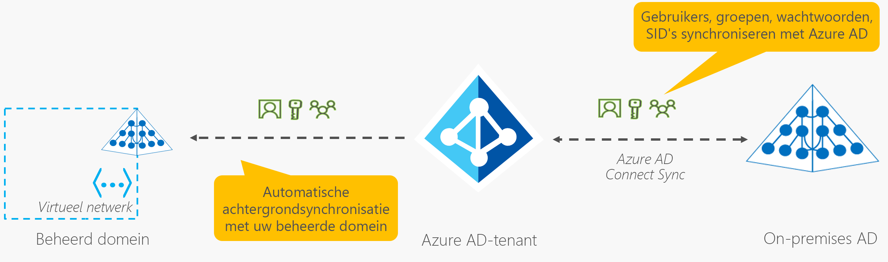

# Hoe objecten en referenties worden gesynchroniseerd in een Azure Active Directory Domain Services beheerd domein

Objecten en referenties in een door Azure Active Directory Domain Services (Azure AD DS) beheerd domein kunnen lokaal in het domein worden gemaakt of worden gesynchroniseerd vanuit een Azure Active Directory-Tenant (Azure AD). Wanneer u Azure AD DS voor het eerst implementeert, wordt een automatische eenrichtings synchronisatie geconfigureerd en gestart om de objecten te repliceren vanuit Azure AD. Deze eenrichtings synchronisatie blijft actief op de achtergrond om de Azure AD DS beheerde domein up-to-date te houden met eventuele wijzigingen van Azure AD. Er wordt geen synchronisatie uitgevoerd vanuit Azure AD DS terug naar Azure AD.

In een hybride omgeving kunnen objecten en referenties van een on-premises AD DS domein worden gesynchroniseerd met Azure AD met behulp van Azure AD Connect. Zodra deze objecten zijn gesynchroniseerd met Azure AD, maakt de automatische achtergrond synchronisatie deze objecten en referenties beschikbaar voor toepassingen die gebruikmaken van het beheerde domein.

In het volgende diagram ziet u hoe synchronisatie werkt tussen Azure AD DS, Azure AD en een optionele on-premises AD DS omgeving:

## Synchronisatie van Azure AD naar Azure AD DS

Gebruikers accounts, groepslid maatschappen en referentie-hashes worden op één manier gesynchroniseerd vanuit Azure AD naar Azure AD DS. Dit synchronisatie proces wordt automatisch uitgevoerd. U hoeft dit synchronisatie proces niet te configureren, te controleren of te beheren. Het kan enkele uren duren voordat de initiële synchronisatie is uitgevoerd, afhankelijk van het aantal objecten in de Azure AD-adres lijst. Wanneer de initiële synchronisatie is voltooid, worden wijzigingen die zijn aangebracht in azure AD, zoals het wijzigen van wacht woorden of kenmerken, automatisch gesynchroniseerd met Azure AD DS.

Wanneer een gebruiker wordt gemaakt in azure AD, worden ze niet gesynchroniseerd met Azure AD DS totdat ze hun wacht woord in azure AD wijzigen. Door deze wachtwoordwijziging worden de wachtwoordhashes voor Kerberos- en NTLM-verificatie gegenereerd en opgeslagen in Azure AD. De wacht woord-hashes zijn vereist voor het verifiëren van een gebruiker in azure AD DS.

Het synchronisatie proces is een manier/unidirectioneel. Er is geen omgekeerde synchronisatie van wijzigingen van Azure AD DS terug naar Azure AD. Een beheerd domein heeft grotendeels het kenmerk alleen-lezen, met uitzonde ring van aangepaste organisatie-eenheden die u kunt maken. U kunt geen wijzigingen aanbrengen in gebruikers kenmerken, gebruikers wachtwoorden of groepslid maatschappen binnen een beheerd domein.

## Kenmerk synchronisatie en toewijzing aan Azure AD DS

De volgende tabel bevat enkele algemene kenmerken en hoe deze worden gesynchroniseerd met Azure AD DS.

| Kenmerk in azure AD DS | Bron | Notities |
|:--- |:--- |:--- |
| UPN | Het *UPN* -kenmerk van de gebruiker in de Azure AD-Tenant | Het UPN-kenmerk van de Azure AD-Tenant wordt gesynchroniseerd naar Azure AD DS. De meest betrouw bare manier om u aan te melden bij een beheerd domein, is het gebruik van de UPN. |
| SAMAccountName | Het *mailNickname* -kenmerk van de gebruiker in azure AD-Tenant of automatisch gegenereerd | Het kenmerk *SAMAccountName* wordt afgeleid van het kenmerk *mailNickname* in de Azure AD-Tenant. Als meerdere gebruikers accounts hetzelfde *mailNickname* -kenmerk hebben, wordt de *SAMAccountName* automatisch gegenereerd. Als de *mailNickname* of het *UPN* -voor voegsel van de gebruiker langer is dan 20 tekens, wordt de *SAMAccountName* automatisch gegenereerd om te voldoen aan de limiet van 20 tekens voor *SAMAccountName* -kenmerken. |
| Wachtwoorden | Het wacht woord van de gebruiker van de Azure AD-Tenant | Verouderde wacht woord-hashes die zijn vereist voor NTLM-of Kerberos-verificatie, worden gesynchroniseerd vanuit de Azure AD-Tenant. Als de Azure AD-Tenant is geconfigureerd voor hybride synchronisatie met Azure AD Connect, worden deze wacht woord-hashes afgeleid van de on-premises AD DS omgeving. |
| Primaire gebruikers-en groeps-SID | Automatisch gegenereerde | De primaire SID voor gebruikers-en groeps accounts wordt automatisch gegenereerd in azure AD DS. Dit kenmerk komt niet overeen met de primaire gebruiker/groeps-SID van het object in een on-premises AD DS omgeving. Dit komt niet overeen omdat het beheerde domein een andere SID-naam ruimte heeft dan de on-premises AD DS domein. |
| SID-geschiedenis voor gebruikers en groepen | On-premises primaire gebruikers-en groeps-SID | Het kenmerk *SidHistory* voor gebruikers en groepen in azure AD DS is zo ingesteld dat het overeenkomt met de overeenkomstige primaire gebruiker of groeps-sid in een on-premises AD DS omgeving. Deze functie helpt bij het opheffen van lift-en Shift-locaties naar Azure AD DS eenvoudiger, omdat u resources niet opnieuw moet gebruiken. |

> [!TIP]
> **Aanmelden bij het beheerde domein met de UPN-indeling** Het kenmerk *SAMAccountName* , zoals `AADDSCONTOSO\driley` , kan automatisch worden gegenereerd voor sommige gebruikers accounts in een beheerd domein. Automatische gegenereerde *SAMAccountName* van gebruikers kan afwijken van het UPN-voor voegsel, dus is niet altijd een betrouw bare manier om u aan te melden.
>
> Als meerdere gebruikers bijvoorbeeld hetzelfde *mailNickname* -kenmerk hebben of gebruikers over lange UPN-voor voegsels beschikken, kunnen de *SAMAccountName* voor deze gebruikers automatisch worden gegenereerd. Gebruik de UPN-indeling, zoals `driley@aaddscontoso.com` , om u op een betrouw bare manier aan te melden bij een beheerd domein.

### Kenmerk toewijzing voor gebruikers accounts

In de volgende tabel ziet u hoe specifieke kenmerken voor gebruikers objecten in azure AD worden gesynchroniseerd met de bijbehorende kenmerken in azure AD DS.

| Gebruikers kenmerk in azure AD | Gebruikers kenmerk in azure AD DS |
|:--- |:--- |
| accountEnabled |userAccountControl (Hiermee wordt de ACCOUNT_DISABLED bit ingesteld of gewist) |
| city |l |
| country |co |
| department |department |
| displayName |displayName |
| employeedId |employeeId |
| facsimileTelephoneNumber |facsimileTelephoneNumber |
| givenName |givenName |
| jobTitle |titel |
| mail |mail |
| mailNickname |msDS-AzureADMailNickname |
| mailNickname |SAMAccountName (kan soms automatisch worden gegenereerd) |
| manager |manager |
| mobiel |mobiel |
| id |msDS-AzureADObjectId |
| onPremiseSecurityIdentifier |Sid |
| passwordPolicies |userAccountControl (Hiermee wordt de DONT_EXPIRE_PASSWORD bit ingesteld of gewist) |
| physicalDeliveryOfficeName |physicalDeliveryOfficeName |
| Code |Code |
| preferredLanguage |preferredLanguage |
| proxyAddresses | proxyAddresses |
| state |st |
| streetAddress |streetAddress |
| surname |sn |
| telephoneNumber |telephoneNumber |
| userPrincipalName |userPrincipalName |

### Kenmerk toewijzing voor groepen

In de volgende tabel ziet u hoe specifieke kenmerken voor groeps objecten in azure AD worden gesynchroniseerd met de bijbehorende kenmerken in azure AD DS.

| Groeps kenmerk in azure AD | Groeps kenmerk in azure AD DS |
|:--- |:--- |
| displayName |displayName |
| displayName |SAMAccountName (kan soms automatisch worden gegenereerd) |
| mail |mail |
| mailNickname |msDS-AzureADMailNickname |
| id |msDS-AzureADObjectId |
| onPremiseSecurityIdentifier |Sid |
| proxyAddresses | proxyAddresses |
| securityEnabled |groupType |

## Synchronisatie van on-premises AD DS naar Azure AD en Azure AD DS

Azure AD Connect wordt gebruikt voor het synchroniseren van gebruikers accounts, groepslid maatschappen en referentie-hashes van een on-premises AD DS omgeving naar Azure AD. Kenmerken van gebruikers accounts, zoals de UPN-en on-premises beveiligings-id (SID), worden gesynchroniseerd. Als u zich wilt aanmelden met Azure AD DS, worden verouderde wachtwoord-hashes die zijn vereist voor NTLM-en Kerberos-verificatie ook gesynchroniseerd met Azure AD.

> [!IMPORTANT]
> Azure AD Connect moet alleen worden geïnstalleerd en geconfigureerd voor synchronisatie met on-premises AD DS-omgevingen. Het installeren van Azure AD Connect in een beheerd domein om objecten weer naar Azure AD te synchroniseren, wordt niet ondersteund.

Als u write-back configureert, worden wijzigingen van Azure AD weer gesynchroniseerd naar de on-premises AD DS omgeving. Als een gebruiker bijvoorbeeld het wacht woord wijzigt met behulp van Azure AD selfservice voor wachtwoord beheer, wordt het wacht woord opnieuw in de on-premises AD DS omgeving bijgewerkt.

> [!NOTE]
> Gebruik altijd de nieuwste versie van Azure AD Connect om ervoor te zorgen dat u oplossingen hebt voor alle bekende bugs.

### Synchronisatie vanuit een on-premises omgeving met meerdere forests

Veel organisaties hebben een tamelijk complexe on-premises AD DS omgeving die meerdere forests bevat. Azure AD Connect ondersteunt het synchroniseren van gebruikers, groepen en referentie-hashes van omgevingen met meerdere forests naar Azure AD.

Azure AD heeft een veel eenvoudiger en platte naam ruimte. Om gebruikers in staat te stellen om op betrouw bare wijze toegang te krijgen tot toepassingen die door Azure AD worden beveiligd, lost u UPN-conflicten op tussen gebruikers accounts in Beheerde domeinen gebruiken een platte OE-structuur, vergelijkbaar met Azure AD. Alle gebruikers accounts en-groepen worden opgeslagen in de container *AADDC-gebruikers* , ondanks dat ze worden gesynchroniseerd vanuit verschillende on-premises domeinen of forests, zelfs als u on-premises een hiërarchische OE-structuur hebt geconfigureerd. Het beheerde domein Platt alle hiërarchische OU-structuren samen.

Zoals eerder is beschreven, is er geen synchronisatie van Azure AD DS terug naar Azure AD. U kunt [een aangepaste organisatie-eenheid (OE) maken](create-ou.md) in azure AD DS en vervolgens gebruikers, groepen of service accounts binnen die aangepaste organisatie-eenheden. Geen van de objecten die zijn gemaakt in aangepaste organisatie-eenheden, worden weer gesynchroniseerd met Azure AD. Deze objecten zijn alleen beschikbaar in het beheerde domein en zijn niet zichtbaar met behulp van Azure AD Power shell-cmdlets, Microsoft Graph-API of met de Azure AD-beheer interface.

## Wat is niet gesynchroniseerd met Azure AD DS

De volgende objecten of kenmerken worden niet gesynchroniseerd van een on-premises AD DS omgeving naar Azure AD of Azure AD DS:

* **Uitgesloten kenmerken:** U kunt ervoor kiezen om bepaalde kenmerken uit te sluiten van synchronisatie met Azure AD vanuit een on-premises AD DS omgeving met behulp van Azure AD Connect. Deze uitgesloten kenmerken zijn niet beschikbaar in azure AD DS.
* **Groeps beleid:** Groeps beleid dat is geconfigureerd in een on-premises AD DS omgeving, wordt niet gesynchroniseerd met Azure AD DS.
* **Map SYSVOL:** De inhoud van de map *SYSVOL* in een on-premises AD DS omgeving wordt niet gesynchroniseerd met Azure AD DS.
* **Computer objecten:** Computer objecten voor computers die zijn gekoppeld aan een on-premises AD DS omgeving worden niet gesynchroniseerd met Azure AD DS. Deze computers hebben geen vertrouwens relatie met het beheerde domein en behoren alleen tot de on-premises AD DS omgeving. In azure AD DS worden alleen computer objecten weer gegeven voor computers die expliciet zijn toegevoegd aan het beheerde domein.
* **SidHistory-kenmerken voor gebruikers en groepen:** De primaire gebruikers-en primaire groeps-Sid's van een on-premises AD DS omgeving worden gesynchroniseerd met Azure AD DS. Bestaande *SidHistory* -kenmerken voor gebruikers en groepen worden echter niet gesynchroniseerd van de on-premises AD DS omgeving naar Azure AD DS.
* **Structuren van organisatie-eenheden (OE):** Organisatie-eenheden gedefinieerd in een on-premises AD DS omgeving worden niet gesynchroniseerd met Azure AD DS. Er zijn twee ingebouwde organisatie-eenheden in azure AD DS: een voor gebruikers, en één voor computers. Het beheerde domein heeft een platte OE-structuur. U kunt ervoor kiezen om [een aangepaste OE in uw beheerde domein te maken](create-ou.md).

## Synchronisatie van wacht woord-hash en beveiligings overwegingen

Wanneer u Azure AD DS inschakelt, zijn verouderde wachtwoord hashes voor NTLM + Kerberos-verificatie vereist. In azure AD worden geen wacht woorden met een lees bare tekst opgeslagen. deze hashes kunnen daarom niet automatisch worden gegenereerd voor bestaande gebruikers accounts. Eenmaal gegenereerde en opgeslagen NTLM-wacht woord-hashes worden altijd op een versleutelde manier opgeslagen in azure AD.

De versleutelings sleutels zijn uniek voor elke Azure AD-Tenant. Deze hashes worden zodanig versleuteld dat alleen Azure AD DS toegang heeft tot de ontsleutelings sleutels. Geen enkele andere service of een ander onderdeel in azure AD heeft toegang tot de versleutelings sleutels.

Verouderde wacht woord-hashes worden vervolgens vanuit Azure AD gesynchroniseerd met de domein controllers voor een beheerd domein. De schijven voor deze beheerde domein controllers in azure AD DS worden op rest versleuteld. Deze wacht woord-hashes worden opgeslagen en beveiligd op deze domein controllers, vergelijkbaar met de manier waarop wacht woorden worden opgeslagen en beveiligd in een on-premises AD DS omgeving.

Voor Azure AD-omgevingen in de Cloud [moeten gebruikers hun wacht woord opnieuw instellen/wijzigen](tutorial-create-instance.md#enable-user-accounts-for-azure-ad-ds) om ervoor te zorgen dat de vereiste wacht woord-hashes worden gegenereerd en opgeslagen in azure AD. Voor alle Cloud gebruikers accounts die zijn gemaakt in azure AD na het inschakelen van Azure AD Domain Services, worden de wacht woord-hashes gegenereerd en opgeslagen in de NTLM-en Kerberos-compatibele indelingen. Alle Cloud gebruikers accounts moeten hun wacht woord wijzigen voordat ze worden gesynchroniseerd met Azure AD DS.

Voor hybride gebruikers accounts die zijn gesynchroniseerd vanuit een on-premises AD DS omgeving met Azure AD Connect, moet u [Azure AD Connect configureren voor het synchroniseren van wacht woord-hashes in de indelingen NTLM en Kerberos-compatibel](tutorial-configure-password-hash-sync.md).

## Volgende stappen

Zie [hoe wacht woord-hash synchronisatie werkt met Azure AD Connect](../active-directory/hybrid/how-to-connect-password-hash-synchronization.md?context=/azure/active-directory-domain-services/context/azure-ad-ds-context)voor meer informatie over de details van wachtwoord synchronisatie.

[Maak een beheerd domein](tutorial-create-instance.md)om aan de slag te gaan met Azure AD DS.
