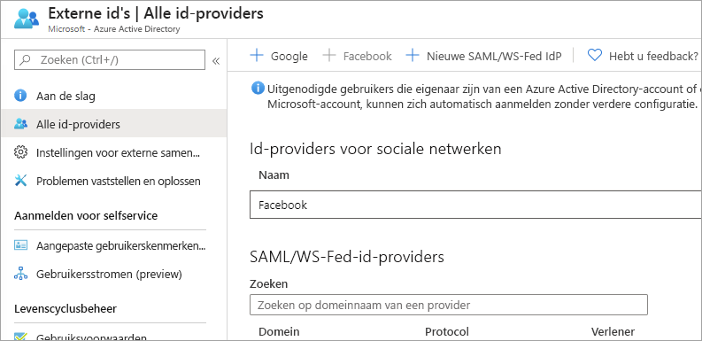
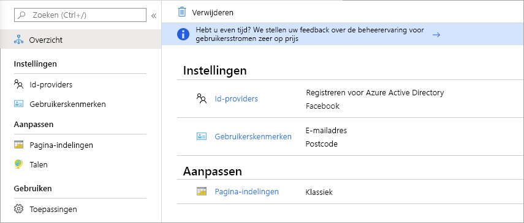

# Wat is gastgebruikerstoegang in Azure Active Directory B2B?

Azure Active Directory (Azure AD) business-to-business B2B-samenwerking laat u uw bedrijfstoepassingen en services veilig delen met gastgebruikers van andere organisaties, zonder controle te verliezen over uw eigen bedrijfsgegevens. Veilig en zeker werken met externe partners, groot of klein, zelfs als ze niet beschikken over de Azure AD of een IT-afdeling. Een eenvoudig uitnodigings- en inwisselproces laat uw partners hun eigen referenties gebruiken voor toegang tot resources van uw bedrijf. Ontwikkelaars kunnen gebruikmaken van Azure AD business-to-business API's voor het aanpassen van het uitnodigingsproces of toepassingen schrijven, zoals selfservice aanmeldingsportals.

Bekijk de video voor informatie over hoe u veilig kan samenwerken met gastgebruikers door ze uit te nodigen om zich aan te melden bij de apps en services van uw bedrijf met behulp van hun eigen identiteiten.

De volgende video biedt een handig overzicht.

>[!VIDEO https://www.youtube.com/embed/AhwrweCBdsc]

   > [!IMPORTANT]
   > **Vanaf 31 maart 2021** heeft Microsoft geen ondersteuning meer voor het aflossen van uitnodigingen door het maken van niet-beheerde Azure AD-accounts en -tenants voor B2B-samenwerkingsscenario's. In de voorbereiding raden wij klanten aan om te kiezen voor de [verificatie van de eenmalige wachtwoordcode e-mailen](one-time-passcode.md). We waarderen uw feedback over deze openbare preview-functie en willen graag nog meer manieren te maken om samen te werken.

## Samenwerken met een partner met behulp van hun identiteit

Met Azure AD B2B gebruikt de partner hun eigen oplossing voor identiteitsbeheer, zonder externe administratieve overhead voor uw organisatie.

- De partner maakt gebruik van hun eigen identiteiten en referenties; Azure AD is niet vereist.
- U hoeft te beheren externe accounts of wachtwoorden.
- U hoeft accounts niet te synchroniseren of account levenscycli niet te beheren.  

## Uitnodigen van gastgebruikers met een eenvoudige uitnodiging en inwisselproces

Gastgebruikers melden zich met hun eigen werk-, school- of sociale identiteiten aan bij uw apps en services. Als de gastgebruiker geen Microsoft-account of een Azure AD-account heeft, wordt er een gemaakt voor hen wanneer ze hun uitnodiging inwisselen. 

- Nodig gastgebruikers uit met behulp van de identiteit van de e-mail van hun keuze.
- Stuur een directe koppeling naar een app of een uitnodiging naar het toegangsvenster van de gastgebruiker.
- Gastgebruikers volgen een paar eenvoudige inwisselstappen om zich aan te melden.

## Gebruik beleidsrichtlijnen voor het veilig delen van uw apps en services

U kunt een autorisatiebeleid voeren om uw zakelijke inhoud te beveiligen. Beleid voor voorwaardelijke toegang zoals meervoudige verificatie kan worden afgedwongen:

- Op tenantniveau.
- Op toepassingsniveau.
- Voor specifieke gastgebruikers om zakelijke apps en gegevens te beschermen.

## Gastgebruikers eenvoudig toevoegen in de Azure AD portal

Als beheerder kunt u eenvoudig gastgebruikers toevoegen aan uw organisatie in de Azure Portal.

- Maak een nieuwe gastgebruiker in Azure AD, vergelijkbaar met hoe u een nieuwe gebruiker wilt toevoegen.
- De gastgebruiker ontvangt onmiddellijk een aangepaste uitnodiging waarmee ze aanmelden bij hun Toegangsvenster.
- Gastgebruikers in de map kunnen aan apps of groepen worden toegewezen.  

## Toepassings- en groepseigenaars toestaan om hun eigen gastgebruikers te beheren

U kunt beheer van gastgebruikers overdragen aan toepassingseigenaars zodat ze gastgebruikers rechtstreeks kunnen toevoegen aan een toepassing die ze willen delen, ongeacht of het een Microsoft-toepassing is of niet.

- Administrators stellen selfservice app en groepsbeheer in.
- Niet-administrators gebruiken hun [Toegangsvenster](https://myapps.microsoft.com) om gastgebruikers aan toepassingen of groepen toe te voegen.

## De onboardingervaring voor B2B-gastgebruikers aanpassen

Breng uw externe partners aan boord op manieren die zijn aangepast aan de behoeften van uw organisatie.

- Gebruik [Azure AD-rechtenbeheer](https://docs.microsoft.com/azure/active-directory/governance/entitlement-management-overview) om beleidsregels te configureren die [de toegang voor externe gebruikers beheren](https://docs.microsoft.com/azure/active-directory/governance/entitlement-management-external-users#how-access-works-for-external-users).
- Gebruik de [B2B-samenwerkingsuitnodiging API's](https://developer.microsoft.com/graph/docs/api-reference/v1.0/resources/invitation) voor het aanpassen van uw onboarding-ervaringen.

## Integreren met id-providers

Azure AD biedt ondersteuning voor externe ID-providers, zoals Facebook, Microsoft-accounts, Google- of zakelijke id-providers. U kunt federatie met id-providers instellen zodat uw externe gebruikers zich kunnen aanmelden met hun bestaande sociale of zakelijke accounts in plaats van een nieuw account te maken voor uw toepassing. Meer informatie over id-providers voor externe identiteiten.

## Een selfservice voor registreren van gasten via gebruikersstromen maken (preview)

Met een selfservice voor het registreren van gebruikers kunt u een aanmeldingservaring maken voor externe gebruikers die toegang willen ontvangen tot uw apps. Als onderdeel van de registratiestroom kunt u opties bieden voor verschillende sociale of zakelijke id-providers, en informatie over de gebruiker verzamelen. Meer informatie over de selfservice-aanmelding en hoe u deze kunt instellen.

## Volgende stappen

- [Licentierichtlijnen voor Azure AD B2B-samenwerking](licensing-guidance.md)
- [Gastgebruikers voor B2B-samenwerking toevoegen in de portal](add-users-administrator.md)
- [Het inwisselproces van de uitnodiging begrijpen](redemption-experience.md)
- En zoals altijd verbinding maken met het productteam voor feedback, discussies en suggesties via onze [Microsoft Tech Community](https://techcommunity.microsoft.com/t5/Azure-Active-Directory-B2B/bd-p/AzureAD_B2b).
