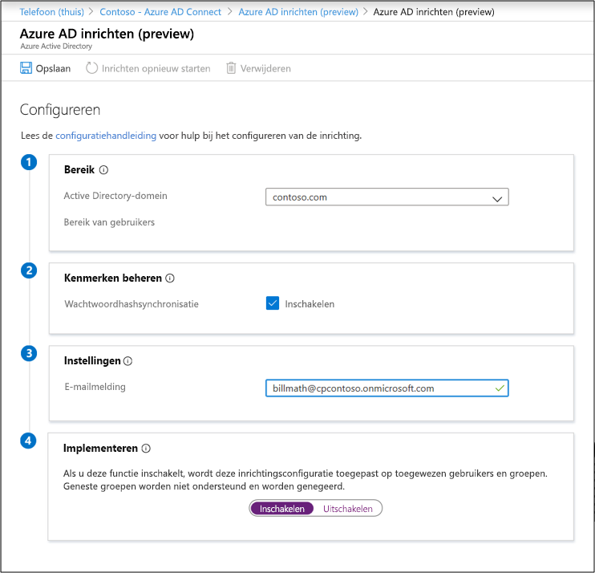

# Een nieuwe configuratie maken voor Azure AD Connect cloudgebaseerde inrichting

Nadat u de agent hebt geïnstalleerd, moet u zich aanmelden bij de Azure-portal en Azure Active Directory (Azure AD) Connect-cloudinrichting configureren. Volg deze stappen om de agent in te schakelen.

## Inrichten configureren
Voer deze stappen uit om provisioning te configureren.

1.  Selecteer in de Azure-portal **Azure Active Directory**.
1.  Selecteer **Azure AD Connect**.
1.  Selecteer **Inrichting beheren (voorbeeld)**.

    

1.  Selecteer **Nieuwe configuratie**.
1.  In het configuratiescherm is het on-premises domein vooraf ingevuld.
1.  Voer een **e-mail met melding in**. Deze e-mail wordt op de hoogte gebracht wanneer de inrichting niet in orde is.
1.  Verplaats de kiezer naar **Inschakelen**en selecteer **Opslaan**.

    

## Scope voorziening voor specifieke gebruikers en groepen
U de agent scopen om specifieke gebruikers en groepen te synchroniseren met behulp van on-premises Active Directory-groepen of organisatie-eenheden. U geen groepen en organisatie-eenheden configureren binnen een configuratie. 

1.  Selecteer in de Azure-portal **Azure Active Directory**.
1.  Selecteer **Azure AD Connect**.
1.  Selecteer **Inrichting beheren (voorbeeld)**.
1.  Selecteer **onder Configuratie**uw configuratie.

    

1.  Selecteer **onder Configureren**alle **gebruikers** selecteren om het bereik van de configuratieregel te wijzigen.

    

1. Aan de rechterkant u het bereik wijzigen om alleen beveiligingsgroepen op te nemen. Voer de gedistingeerde naam van de groep in en selecteer **Toevoegen**.

    

1.  U het bereik wijzigen om alleen specifieke organisatie-eenheden op te nemen. Selecteer **Gereed** en **Opslaan**.  
2.  Zodra u het bereik hebt gewijzigd, moet u [de inrichting opnieuw starten](#restart-provisioning) om een onmiddellijke synchronisatie van de wijzigingen te starten.

    

## Inrichting opnieuw opstarten 
Als u niet wilt wachten op de volgende geplande uitvoering, activeert u de inprovisioning met de knop **Inrichting opnieuw starten.** 
1.  Selecteer in de Azure-portal **Azure Active Directory**.
1.  Selecteer **Azure AD Connect**.
1.  Selecteer **Inrichting beheren (voorbeeld)**.
1.  Selecteer **onder Configuratie**uw configuratie.

    

1.  Selecteer bovenaan **Inrichting opnieuw starten**.

## Een configuratie verwijderen
Voer deze stappen uit om een configuratie te verwijderen.

1.  Selecteer in de Azure-portal **Azure Active Directory**.
1.  Selecteer **Azure AD Connect**.
1.  Selecteer **Inrichting beheren (voorbeeld)**.
1.  Selecteer **onder Configuratie**uw configuratie.

    

1.  Selecteer Boven aan het configuratiescherm **delete**.

    

>[!IMPORTANT]
>Er is geen bevestiging voorafgaand aan het verwijderen van een configuratie. Zorg ervoor dat dit de actie is die u wilt uitvoeren voordat u **Verwijderen**selecteert.

## Volgende stappen 

- [Wat is inrichting?](what-is-provisioning.md)
- [Wat is Azure AD Connect-cloudinrichting?](what-is-cloud-provisioning.md)
