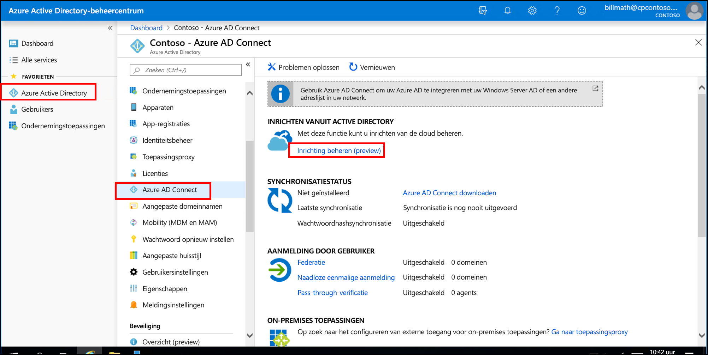
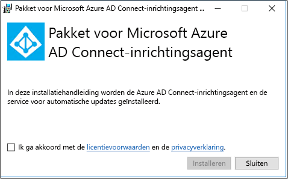
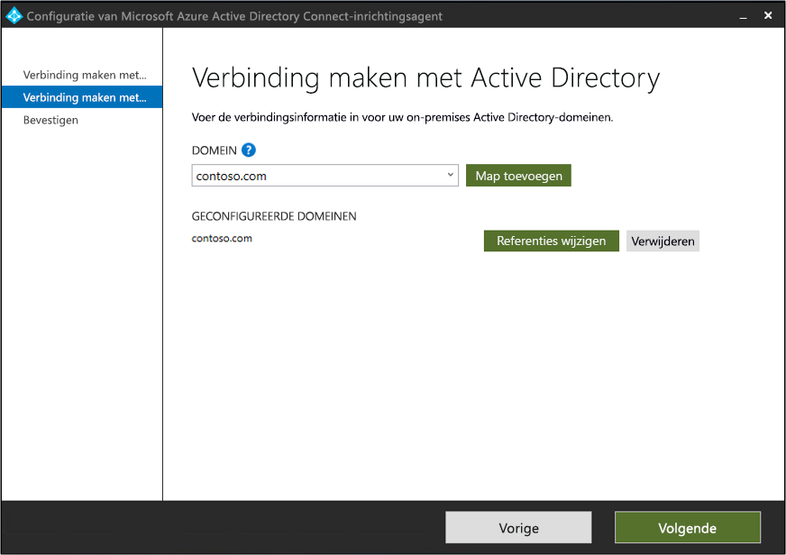
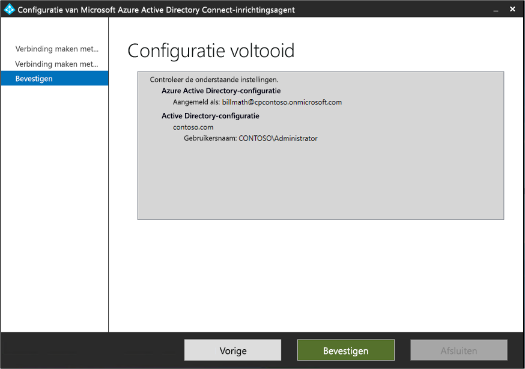
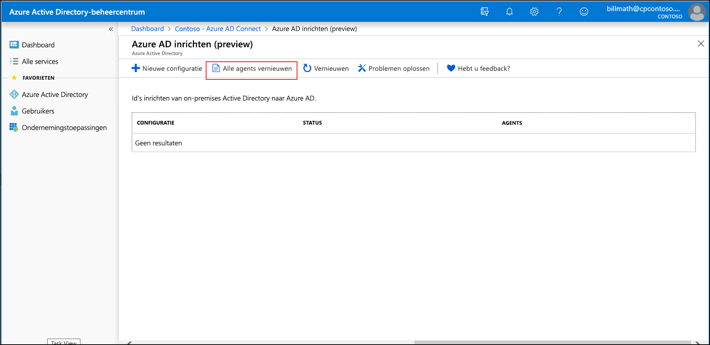
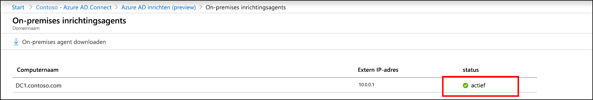
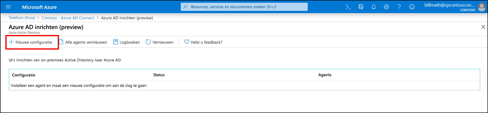
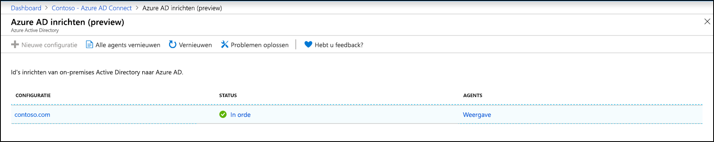
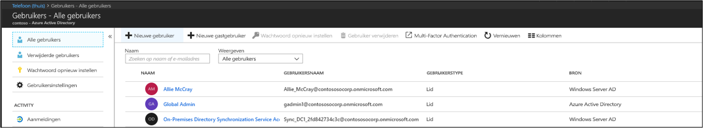
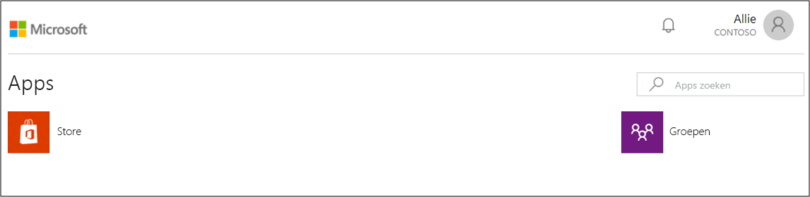

# Zelfstudie: Een enkele forest integreren met enkele Azure AD-tenant

In deze zelfstudie wordt u begeleid bij het maken van een hybride-identiteitsomgeving met behulp van Azure Active Directory (Azure AD) Connect voor het inrichten van de cloud.

U kunt de omgeving die u in deze zelfstudie maakt gebruiken voor testdoeleinden of om meer vertrouwd te raken met het inrichten van de cloud.

## Vereisten
### In het Azure Active Directory-beheercentrum

1. Maak een alleen-cloud account voor globale beheerders in uw Azure AD-tenant. Op deze manier kunt u de configuratie van uw tenant beheren als uw on-premises services mislukken of niet meer beschikbaar zijn. Meer informatie over het [toevoegen van een alleen-cloud account voor globale beheerders](../fundamentals/add-users-azure-active-directory.md). Het voltooien van deze stap is van cruciaal belang om ervoor te zorgen dat de tenant niet wordt vergrendeld.
2. Voeg een of meer [aangepaste domeinnamen](../fundamentals/add-custom-domain.md) toe aan uw Azure AD-tenant. Uw gebruikers kunnen zich aanmelden met een van deze domeinnamen.

### In uw on-premises omgeving

1. Geef een hostserver op die is toegevoegd aan het domein en waarop Windows Server 2012 R2 of hoger wordt uitgevoerd met minimaal 4 GB RAM en .NET 4.7.1+-runtime 

2. Als er een firewall is tussen uw servers en Azure AD, moet u de volgende items configureren:
   - Zorg ervoor dat agenten *uitgaande* aanvragen voor Azure AD via de volgende poorten kunnen maken:

     | Poortnummer | Hoe dat wordt gebruikt |
     | --- | --- |
     | **80** | Downloadt de certificaatintrekkingslijsten (CRL's) tijdens het valideren van het TLS-/SSL-certificaat |
     | **443** | Verwerkt alle uitgaande communicatie met de service |
     | **8080** (optioneel) | Agents rapporteren hun status elke 10 minuten via poort 8080, als poort 443 niet beschikbaar is. Deze status wordt weergegeven in de Azure AD-portal. |
     
     Als met uw firewall regels worden afgedwongen op basis van de herkomst van gebruikers, opent u deze poorten voor verkeer dat afkomstig is van Windows-services die als een netwerkservice worden uitgevoerd.
   - Als uw firewall of proxyserver het opgeven van veilige achtervoegsels toestaat, kunt u verbindingen met **\*.msappproxy.net** en **\*.servicebus.windows.net** toevoegen. Als dat niet het geval is, moet u toegang toestaan tot de [IP-adresbereiken van Azure Datacenter](https://www.microsoft.com/download/details.aspx?id=41653), die elke week worden bijgewerkt.
   - Uw agenten hebben voor de eerste registratie toegang nodig tot **login.windows.net** en **login.microsoftonline.com**. Open uw firewall ook voor deze URL's.
   - Voor certificaatvalidatie deblokkeert u de volgende URL's: **mscrl.microsoft.com:80**, **crl.microsoft.com:80**, **ocsp.msocsp.com:80** en **www\.microsoft.com:80**. Omdat deze URL's worden gebruikt voor certificaatvalidatie met andere Microsoft-producten, is het mogelijk dat u deze URL's al hebt gedeblokkeerd.

## De agent voor Azure AD Connect-inrichting installeren
1. Meld u aan bij de server die is toegevoegd aan het domein.  Als u de zelfstudie [AD- en Azure-basisomgeving](tutorial-basic-ad-azure.md) gebruikt, is dit DC1.
2. Meld u aan bij de Azure-portal met behulp van de referenties van de alleen-cloud account voor globale beheerders.
3. Selecteer aan de linkerkant **Azure Active Directory**, klik op **Azure AD Connect** en selecteer in het midden **Beheer inrichten (preview)** .

   

4. Klik op **Agent downloaden**.
5. Voer de agent voor Azure AD Connect-inrichting uit.
6. Ga in het welkomstscherm **akkoord** met de licentievoorwaarden en klik op **Installeren**.

   

7. Zodra deze bewerking is voltooid, wordt de configuratiewizard gestart.  Meld u aan met uw globale beheerdersreferenties voor Azure AD.  Houd er rekening mee dat als u verbeterde beveiliging van Internet Explorer hebt ingeschakeld, aanmelding wordt geblokkeerd.  Als dit het geval is, sluit u de installatie, schakelt u verbeterde beveiliging van Internet Explorer in Serverbeheer uit en klikt u op de **wizard voor de AAD Connect-inrichtingsagent** om de installatie opnieuw te starten.
8. Klik in het scherm **Verbinding maken met Active Directory** op **Directory toevoegen** en meld u aan met uw Active Directory-domeinbeheerdersaccount.  OPMERKING: Het domeinbeheerdersaccount mag geen vereisten voor wachtwoordwijziging hebben. Als het wachtwoord is verlopen of gewijzigd, moet u de agent opnieuw configureren met de nieuwe referenties. Met deze bewerking wordt uw on-premises adreslijst toegevoegd.  Klik op **Volgende**.

   

9. Klik in het scherm **Configuratie voltooid** op **Bevestigen**.  Met deze bewerking wordt de agent geregistreerd en opnieuw gestart.

   

10. Zodra deze bewerking is voltooid, ziet u een melding: **De agentconfiguratie is gecontroleerd.**  U kunt op **Afsluiten** klikken. 
 
11. Als het welkomstscherm nog steeds wordt weergegeven, klikt u op **Sluiten**.

## Agentinstallatie verifiëren
Verificatie van de agent vindt plaats in de Azure Portal en op de lokale server waarop de agent wordt uitgevoerd.

### Verificatie van Azure Portal-agent
Voer de volgende stappen uit om te controleren of de agent wordt gedetecteerd door Azure:

1. Meld u aan bij Azure Portal.
2. Selecteer **Azure Active Directory** links, klik op **Azure AD Connect** en selecteer **Beheer inrichten (preview)** in het midden. 
 

3.  Klik in het scherm **Azure AD-inrichting (preview)** op **Alle agents controleren**.
 
 
4. In het scherm **On-premises inrichtingsagents** ziet u de agents die u hebt geïnstalleerd.  Controleer of de agent in kwestie beschikbaar is en op **Uitgeschakeld** staat.
 

### Op de lokale server
Voer de volgende stappen uit om te controleren of de agent wordt uitgevoerd:

1.  Meld u aan bij de server met een beheerdersaccount
2.  Open **Services** door hiernaartoe te navigeren of via Start/Uitvoeren/Services. msc.
3.  Controleer onder **Services** of **Microsoft Azure AD Connect-agentupdater** en **Microsoft Azure AD Connect-inrichtingsagent** aanwezig zijn en of de status **Actief** is.

## Azure AD Connect-cloudinrichting configureren
 Voer de volgende stappen uit om de inrichting te configureren

1.  Meld u aan bij de Azure AD-portal.
2.  Klik op **Azure Active Directory**
3.  Klik op **Azure AD Connect**
4.  Selecteer **Inrichting beheren (preview)** 

5.  Klik op **Nieuwe configuratie**

7.  Voer in het configuratiescherm een **E-mailadres voor meldingen** in, zet de selector op **Inschakelen** en klik op **Opslaan**.

1.  De configuratiestatus moet nu **In orde** zijn.

## Controleer of gebruikers zijn gemaakt en synchronisatie plaatsvindt
U gaat nu controleren of de gebruikers die beschikbaar waren in onze on-premises adreslijst, zijn gesynchroniseerd en nu aanwezig zijn in onze Azure AD-tenant.  Dit synchronisatieproces kan enkele uren duren.  Ga als volgt te werk om te controleren of gebruikers zijn gesynchroniseerd.

1. Meld u bij de [Azure Portal](https://portal.azure.com) aan met een account waaraan een Azure-abonnement is gekoppeld.
2. Selecteer links **Azure Active Directory**
3. Onder **Beheren**, selecteer **Gebruikers**.
4. Kijk of u de nieuwe gebruikers ziet in onze tenant. 
 

## Aanmelden testen met een van onze gebruikers

1. Blader naar [https://myapps.microsoft.com](https://myapps.microsoft.com)
2. Meld u aan met een gebruikersaccount dat is gemaakt in onze nieuwe tenant.  U moet zich aanmelden met de volgende indeling: (user@domain.onmicrosoft.com). Gebruik hetzelfde wachtwoord dat de gebruiker gebruikt om zich on-premises aan te melden. 
    

U hebt nu een omgeving met een hybride identiteit ingesteld die u kunt gebruiken voor testdoeleinden en om bekend te raken met wat Azure te bieden heeft.

## Volgende stappen 

- [Wat is inrichting?](what-is-provisioning.md)
- [Wat is Azure AD Connect-cloudinrichting?](what-is-cloud-provisioning.md)