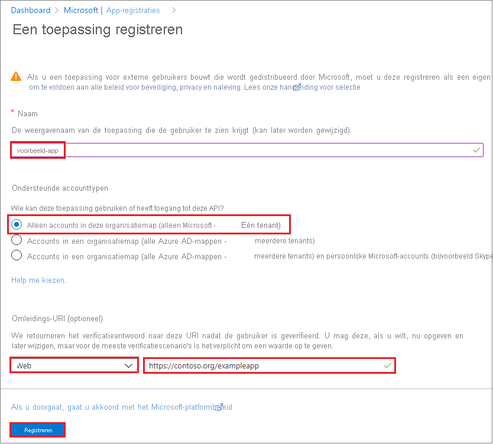

# <a name="how-to-use-the-portal-to-create-an-azure-ad-application-and-service-principal-that-can-access-resources"></a>Procedure: Gebruik de portal voor het maken van een Azure AD-toepassing en service-principal die toegang hebben tot resources

In dit artikel wordt beschreven hoe u een nieuwe Azure Active Directory (Azure AD)-toepassing en Service-Principal maakt die kunnen worden gebruikt met het toegangs beheer op basis van rollen. Wanneer u toepassingen, gehoste services of geautomatiseerde hulpprogram ma's hebt die toegang nodig hebben tot of wijzigen van resources, kunt u een identiteit voor de app maken. Deze identiteit staat bekend als een service-principal. De toegang tot resources wordt beperkt door de functies die aan de Service-Principal zijn toegewezen, zodat u kunt bepalen welke resources toegankelijk zijn en op welk niveau. Uit veiligheidsoverwegingen is het altijd aanbevolen om voor geautomatiseerde tools service-principals te gebruiken, in plaats van deze zich te laten aanmelden met een gebruikers-id.

In dit artikel leest u hoe u de-portal kunt gebruiken om de service-principal te maken in de Azure Portal. Het is gericht op een toepassing met één Tenant waarbij de toepassing alleen binnen één organisatie kan worden uitgevoerd. Normaal gesp roken gebruikt u toepassingen met één Tenant voor line-of-business-toepassingen die binnen uw organisatie worden uitgevoerd.  U kunt ook [Azure PowerShell gebruiken om een service-principal te maken](howto-authenticate-service-principal-powershell.md).

> [!IMPORTANT]
> In plaats van een service-principal te maken, kunt u overwegen beheerde identiteiten te gebruiken voor Azure-resources voor uw toepassings identiteit. Als uw code wordt uitgevoerd op een service die beheerde identiteiten ondersteunt en toegang krijgt tot bronnen die ondersteuning bieden voor Azure AD-verificatie, zijn beheerde identiteiten een betere optie voor u. Zie [Wat is beheerde identiteiten voor Azure-resources?](../managed-identities-azure-resources/overview.md)voor meer informatie over beheerde identiteiten voor Azure-resources, waaronder de services die momenteel door worden ondersteund.

## <a name="app-registration-app-objects-and-service-principals"></a>App-registratie, app-objecten en service-principals
Het is niet mogelijk om rechtstreeks een service-principal te maken met behulp van de Azure Portal.  Wanneer u een toepassing registreert via de Azure Portal, worden er automatisch een toepassings object en service-principal gemaakt in uw basismap of Tenant.  Lees voor meer informatie over de relatie tussen app-registratie, toepassings objecten en service-principals de [objecten Application and Service Principal in azure Active Directory](app-objects-and-service-principals.md).

## <a name="permissions-required-for-registering-an-app"></a>Benodigde machtigingen voor het registreren van een app

U moet over voldoende machtigingen beschikken om een toepassing te registreren bij uw Azure AD-Tenant en de toepassing een rol in uw Azure-abonnement toe te wijzen.

### <a name="check-azure-ad-permissions"></a>Azure AD-machtigingen controleren

1. Selecteer **Azure Active Directory**.
1. Noteer uw rol. Als **u de gebruikersrol** hebt, moet u ervoor zorgen dat niet-beheerders toepassingen kunnen registreren.

   

1. Selecteer **gebruikers instellingen**in het linkerdeel venster.
1. Controleer de instelling **app-registraties** . Deze waarde kan alleen worden ingesteld door een beheerder. Als deze instelling is ingesteld op **Ja**, kan elke gebruiker in de Azure AD-Tenant een app registreren.

Als de instelling app-registraties is ingesteld op **Nee**, kunnen alleen gebruikers met een rol beheerder deze typen toepassingen registreren. Bekijk de [beschik bare rollen](../users-groups-roles/directory-assign-admin-roles.md#available-roles) en [rolmachtigingen](../users-groups-roles/directory-assign-admin-roles.md#role-permissions) voor meer informatie over beschik bare beheerders rollen en de specifieke machtigingen in azure AD die aan elke rol worden gegeven. Als aan uw account de gebruikersrol is toegewezen, maar de instelling van de app-registratie is beperkt tot gebruikers met beheerders rechten, vraagt u de beheerder om een van de beheerders rollen toe te wijzen die alle aspecten van app-registraties kunnen maken en beheren, of om gebruikers in staat te stellen apps te registreren.

### <a name="check-azure-subscription-permissions"></a>Azure-abonnements machtigingen controleren

In uw Azure-abonnement moet uw account `Microsoft.Authorization/*/Write` toegang hebben om een rol toe te wijzen aan een AD-app. Deze toegang wordt verleend via de rol [Eigenaar](../../role-based-access-control/built-in-roles.md#owner) of [Administrator voor gebruikerstoegang](../../role-based-access-control/built-in-roles.md#user-access-administrator). Als uw account de rol **Inzender** heeft toegewezen, beschikt u niet over voldoende machtigingen. Er wordt een fout bericht weer gegeven wanneer u probeert om de service-principal een rol toe te wijzen.

Uw abonnements machtigingen controleren:

1. Zoek en selecteer **abonnementen**of selecteer **abonnementen** op de **Start** pagina.

   

1. Selecteer het abonnement waarin u de Service-Principal wilt maken.

   

   Als u het gewenste abonnement niet ziet, selecteert u **globaal abonnementen filter**. Zorg ervoor dat het gewenste abonnement is geselecteerd voor de portal.

1. Selecteer **Mijn machtigingen**. Selecteer vervolgens **Klik hier om de volledige toegangs gegevens voor dit abonnement weer te geven**.

   

1. Selecteer **weer gave** in **roltoewijzingen** om uw toegewezen rollen weer te geven en te bepalen of u voldoende machtigingen hebt om een rol toe te wijzen aan een AD-app. Als dat niet het geval is, vraagt u uw abonnements beheerder om u toe te voegen aan de rol beheerder van gebruikers toegang. In de volgende afbeelding is de gebruiker toegewezen aan de rol eigenaar, wat betekent dat de gebruiker over de juiste machtigingen beschikt.

   

## <a name="register-an-application-with-azure-ad-and-create-a-service-principal"></a>Een toepassing registreren bij Azure AD en een service-principal maken

Laten we meteen beginnen met het maken van de identiteit. Als u een probleem ondervindt, controleert u de [vereiste machtigingen](#permissions-required-for-registering-an-app) om te controleren of uw account de identiteit kan maken.

1. Meld u aan bij uw Azure-account via de [Azure Portal](https://portal.azure.com).
1. Selecteer **Azure Active Directory**.
1. Selecteer **App-registraties**.
1. Selecteer **Nieuwe registratie**.
1. Geef de toepassing een naam. Selecteer een ondersteund account type, dat bepaalt wie de toepassing kan gebruiken. Onder **omleidings-URI**selecteert u **Web** voor het type toepassing dat u wilt maken. Voer de URI in waarnaar het toegangs token wordt verzonden. U kunt geen referenties maken voor een [systeem eigen toepassing](../manage-apps/application-proxy-configure-native-client-application.md). U kunt dit type niet gebruiken voor een geautomatiseerde toepassing. Nadat u de waarden hebt ingesteld, selecteert u **registreren**.

   

U hebt uw Azure AD-toepassing en service-principal gemaakt.

## <a name="assign-a-role-to-the-application"></a>Een rol aan de toepassing toewijzen

Als u toegang wilt krijgen tot resources in uw abonnement, moet u een rol aan de toepassing toewijzen. Bepaal welke rol de juiste machtigingen voor de toepassing biedt. Zie [ingebouwde rollen van Azure](../../role-based-access-control/built-in-roles.md)voor meer informatie over de beschik bare rollen.

U kunt het bereik instellen op het niveau van het abonnement, de resource groep of de resource. Machtigingen worden overgenomen door lagere bereik niveaus. Als u bijvoorbeeld een toepassing toevoegt aan de rol van *lezer* voor een resource groep, betekent dit dat de resource groep en alle resources die deze bevat, kunnen worden gelezen.

1. Selecteer in het Azure Portal het bereik dat u aan de toepassing wilt toewijzen. Als u bijvoorbeeld een rol wilt toewijzen aan het abonnements bereik, zoekt en selecteert u **abonnementen**, of selecteert u **abonnementen** op de **Start** pagina.

   

1. Selecteer het specifieke abonnement waaraan u de toepassing wilt toewijzen.

   

   Als u het gewenste abonnement niet ziet, selecteert u **globaal abonnementen filter**. Zorg ervoor dat het gewenste abonnement is geselecteerd voor de portal.

1. Klik op **Toegangsbeheer (IAM)** .
1. Selecteer **Roltoewijzing toevoegen**.
1. Selecteer de rol die u aan de toepassing wilt toewijzen. Als u bijvoorbeeld wilt toestaan dat de toepassing acties uitvoert zoals **opnieuw opstarten**, exemplaren **starten** en **stoppen** , selecteert u de rol **Inzender** .  Meer informatie over de [beschik bare rollen](../../role-based-access-control/built-in-roles.md) : Azure AD-toepassingen worden standaard niet weer gegeven in de beschik bare opties. Zoek de naam en selecteer deze om uw toepassing te vinden.

   

1. Selecteer **Opslaan** om de rol toe te wijzen. U ziet uw toepassing in de lijst met gebruikers met een rol voor dat bereik.

De Service-Principal is ingesteld. U kunt deze gebruiken om uw scripts of apps uit te voeren. Als u de Service-Principal (machtigingen, machtigingen voor de gebruiker die u wilt machtigen, wilt zien welke gebruikers zijn gemachtigd, machtigingen controleren, aanmeldings gegevens en meer), gaat u naar **bedrijfs toepassingen**.

In de volgende sectie ziet u hoe u waarden kunt ophalen die nodig zijn bij het programmatisch aanmelden.

## <a name="get-tenant-and-app-id-values-for-signing-in"></a>Tenant-en App-ID-waarden ophalen voor aanmelden

Wanneer u zich programmatisch aanmeldt, moet u de Tenant-ID door geven aan uw verificatie aanvraag en de toepassings-ID.  U hebt ook een certificaat of een verificatie sleutel nodig (beschreven in de volgende sectie). U kunt deze waarden als volgt ophalen:

1. Selecteer **Azure Active Directory**.
1. Selecteer uw toepassing in **app-registraties** in azure AD.
1. Kopieer de Directory-ID (Tenant) en sla deze op in de code van uw toepassing.

    

    De Directory-ID (Tenant) kan ook worden gevonden op de standaard pagina overzicht van mappen.

1. Kopieer de **Toepassings-id** en sla deze op in uw toepassingscode.

   

## <a name="authentication-two-options"></a>Verificatie: twee opties

Er zijn twee soorten verificatie beschikbaar voor service-principals: verificatie op basis van wacht woorden (toepassings geheim) en verificatie op basis van certificaten. *We raden u aan een certificaat te gebruiken*, maar u kunt ook een toepassings geheim maken.

### <a name="option-1-upload-a-certificate"></a>Optie 1: een certificaat uploaden

U kunt een bestaand certificaat gebruiken als u er een hebt.  U kunt eventueel ook een zelfondertekend certificaat maken voor *test doeleinden*. Als u een zelfondertekend certificaat wilt maken, opent u Power shell en voert u [New-SelfSignedCertificate](/powershell/module/pkiclient/new-selfsignedcertificate) uit met de volgende para meters om het certificaat in het certificaat archief van de gebruiker op uw computer te maken:

```powershell
$cert=New-SelfSignedCertificate -Subject "CN=DaemonConsoleCert" -CertStoreLocation "Cert:\CurrentUser\My"  -KeyExportPolicy Exportable -KeySpec Signature
```

Dit certificaat exporteren naar een bestand met behulp van de MMC-module [gebruikers certificaat beheren](/dotnet/framework/wcf/feature-details/how-to-view-certificates-with-the-mmc-snap-in) , toegankelijk via het configuratie scherm van Windows.

1. Selecteer **uitvoeren** in het menu **Start** en voer vervolgens **certmgr. msc**in.

   Het hulp programma certificaat beheer voor de huidige gebruiker wordt weer gegeven.

1. Als u uw certificaten wilt weer geven, vouwt u onder **certificaten-huidige gebruiker** in het linkerdeel venster de **persoonlijke** map uit.
1. Klik met de rechter muisknop op het certificaat dat u hebt gemaakt, selecteer **alle taken->exporteren**.
1. Volg de wizard Certificaat exporteren.  Exporteer de persoonlijke sleutel niet en exporteer deze naar een. CER-bestand.

Het certificaat uploaden:

1. Selecteer **Azure Active Directory**.
1. Selecteer uw toepassing in **app-registraties** in azure AD.
1. Selecteer **Certificaten en geheimen**.
1. Selecteer **certificaat uploaden** en selecteer het certificaat (een bestaand certificaat of het zelfondertekende certificaat dat u hebt geëxporteerd).

    

1. Selecteer **Toevoegen**.

Nadat u het certificaat hebt geregistreerd bij uw toepassing in de portal voor toepassings registratie, moet u de client toepassings code inschakelen om het certificaat te gebruiken.

### <a name="option-2-create-a-new-application-secret"></a>Optie 2: een nieuw toepassings geheim maken

Als u ervoor kiest geen certificaat te gebruiken, kunt u een nieuw toepassings geheim maken.

1. Selecteer **Azure Active Directory**.
1. Selecteer uw toepassing in **app-registraties** in azure AD.
1. Selecteer **Certificaten en geheimen**.
1. Selecteer **Clientgeheimen -> Nieuw clientgeheim**.
1. Geef een beschrijving van het geheim en een duur op. Selecteer **Toevoegen** wanneer u klaar bent.

   Nadat u het clientgeheim hebt opgeslagen, wordt de waarde van het clientgeheim weergegeven. Kopieer deze waarde omdat u de sleutel later niet meer kunt ophalen. U geeft de sleutel waarde op met de toepassings-ID om u aan te melden als de toepassing. Bewaar de sleutelwaarde op een locatie waar de toepassing deze kan ophalen.

   

## <a name="configure-access-policies-on-resources"></a>Toegangs beleid voor resources configureren
Houd er rekening mee dat u aanvullende machtigingen moet configureren voor bronnen die voor uw toepassing toegankelijk moeten zijn. U moet bijvoorbeeld ook [het toegangs beleid van een sleutel kluis bijwerken](../../key-vault/general/secure-your-key-vault.md#data-plane-and-access-policies) om uw toepassing toegang te geven tot sleutels, geheimen of certificaten.

1. Navigeer in het [Azure Portal](https://portal.azure.com)naar uw sleutel kluis en selecteer **toegangs beleid**.
1. Selecteer **toegangs beleid toevoegen**en selecteer vervolgens de sleutel, het geheim en de certificaat machtigingen die u uw toepassing wilt verlenen.  Selecteer de service-principal die u eerder hebt gemaakt.
1. Selecteer **toevoegen** om het toegangs beleid toe te voegen en **Sla** vervolgens op om uw wijzigingen door te voeren.
    

## <a name="next-steps"></a>Volgende stappen
* Meer informatie over het [gebruik van Azure PowerShell voor het maken van een Service-Principal](howto-authenticate-service-principal-powershell.md).
* Zie voor meer informatie over het opgeven van beveiligings beleid [Azure op rollen gebaseerd toegangs beheer (Azure RBAC)](../../role-based-access-control/role-assignments-portal.md).
* Zie Azure Resource Manager-bewerkingen van de [resource provider](../../role-based-access-control/resource-provider-operations.md)voor een lijst met beschik bare acties die kunnen worden verleend of geweigerd aan gebruikers.
* Voor informatie over het werken met app-registraties met behulp van **Microsoft Graph**, zie de API-naslag informatie voor [toepassingen](/graph/api/resources/application) .
