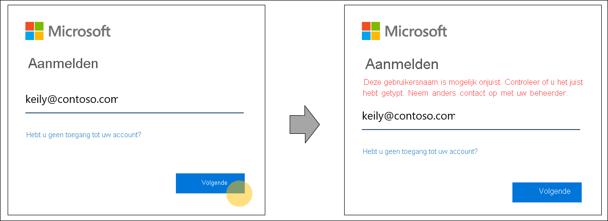
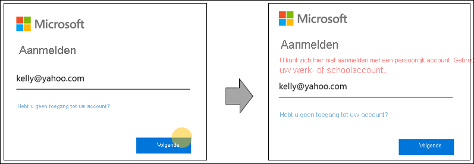

# Thuisrealmdetectie voor aanmeldingspagina's in Azure Active Directory

We wijzigen het aanmeldingsgedrag van Azure Active Directory (Azure AD) zodat we nieuwe verificatiemethoden kunnen gebruiken en de bruikbaarheid kunnen verbeteren. Tijdens de aanmelding bepaalt Azure AD of een gebruiker verificatie moet uitvoeren. Azure AD neemt intelligente beslissingen door de organisatie- en gebruikersinstellingen te lezen voor de gebruikersnaam die op de aanmeldingspagina is ingevoerd. Dit is een stap in de richting van een wachtwoordloze toekomst met extra referentiemogelijkheden zoals FIDO 2.0.

## Thuisrealmdetectiegedrag

In het verleden werd de detectie van het thuisrealm bepaald door het domein dat wordt opgegeven bij het aanmelden, of voor enkele oudere toepassingen door een thuisrealmdetectiebeleid. Zo konden gebruikers van Azure Active Directory bij ons detectiegedrag een typefout maken in hun gebruikersnaam, maar toch aankomen bij het referentieverzamelingsscherm van hun organisatie. Dit gebeurt wanneer de gebruiker de domeinnaam (bijvoorbeeld 'contoso.com') van de organisatie correct opgeeft. Dit gedrag maakt niet voldoende granulariteit mogelijk om de ervaring voor individuele gebruikers aan te passen.

Om een breder scala aan referenties te ondersteunen en de bruikbaarheid te vergroten, is het gedrag bij het opzoeken van gebruikersnamen in Azure Active Directory tijdens het aanmeldingsproces nu bijgewerkt. Het nieuwe gedrag neemt intelligente beslissingen door instellingen op organisatie- en gebruikersniveau te lezen op basis van de gebruikersnaam die op de aanmeldingspagina wordt ingevoerd. Om dit mogelijk te maken, controleert Azure Active Directory of de gebruikersnaam die op de aanmeldingspagina wordt ingevoerd, in het opgegeven domein bestaat, of leidt de gebruiker om naar een pagina voor het opgeven van referenties.

Een extra voordeel van dit werk is verbeterde foutberichten. Hier volgen enkele voor beelden van verbeterde foutberichten bij het aanmelden bij een toepassing die alleen Azure Active Directory-gebruikers ondersteunt.

- De gebruikersnaam is onjuist getypt of de gebruikersnaam is nog niet gesynchroniseerd met Azure AD:
  
    
  
- De domeinnaam is onjuist getypt:
  
    
  
- De gebruiker probeert zich aan te melden met een bekend consumentendomein:
  
    
  
- Het wachtwoord is onjuist getypt, maar de gebruikersnaam klopt:  
  
    
  
> [!IMPORTANT]
> Deze functie kan van invloed zijn op federatieve domeinen die afhankelijk zijn van de oude thuisrealmdetectie om federatie af te dwingen. Zie [Detectie van thuisdomein tijdens aanmelding voor Microsoft 365-services](https://azure.microsoft.com/updates/signin-hrd/) voor updates over het toevoegen van ondersteuning voor federatieve domeinen. Ondertussen hebben sommige organisaties hun werknemers getraind om zich aan te melden met een gebruikersnaam die niet bestaat in Azure Active Directory maar wel de juiste domeinnaam bevat, omdat de domeinnamen gebruikers momenteel naar het domeineindput van hun organisatie sturen. Bij het nieuwe aanmeldingsgedrag is dit niet mogelijk. De gebruiker krijgt een bericht dat deze de gebruikersnaam moet corrigeren, en mag zich niet aanmelden met een gebruikersnaam die niet in Azure Active Directory bestaat.
>
> Als u of uw organisatie procedures heeft die afhankelijk zijn van het oude gedrag, is het belangrijk dat beheerders de documentatie over het aanmelden en de verificatie van gebruikers bijwerken, en hun werknemers trainen om zich aan te melden met hun Azure Active Directory-gebruikersnaam.
  
Als u vragen hebt over het nieuwe gedrag, kunt u uw opmerkingen doorgeven in de **Feedback** -sectie van dit artikel.  

## Volgende stappen

[Uw huisstijl voor aanmelden aanpassen](../fundamentals/add-custom-domain.md)
