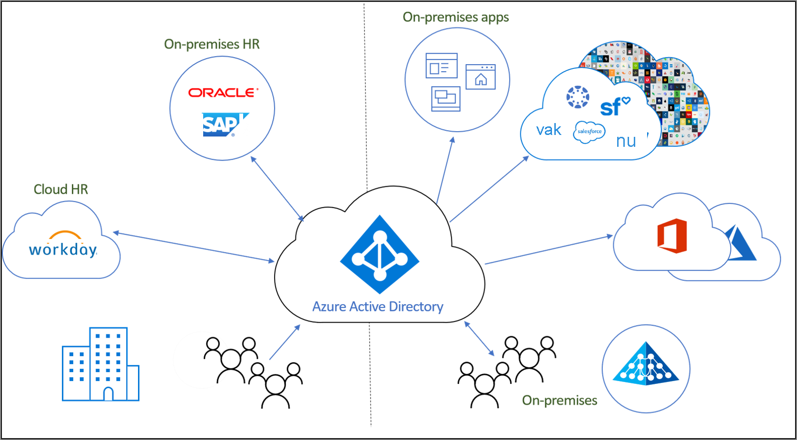

# Wat is identiteitslevenscyclusbeheer?

Met Identity Governance kunnen organisaties een balans vinden tussen productiviteit: hoe snel kunnen personen toegang krijgen tot de resources die ze nodig hebben, bijvoorbeeld wanneer ze deel uit gaan maken van mijn organisatie? En veiligheid: hoe moet de toegang in de loop van de tijd worden aangepast, bijvoorbeeld als gevolg van wijzigingen in de werknemersstatus van die persoon?

**Beheer van identiteitslevenscycli** vormt de basis voor Identity Governance en voor een effectief beheer op schaal moet de infrastructuur voor het identiteitslevenscyclusbeheer voor toepassingen worden gemoderniseerd. Beheer van identiteitslevenscycli is gericht op het automatiseren en beheren van het hele proces voor de levenscyclus van digitale identiteiten. 

## Wat is een digitale identiteit?

Een digitale identiteit is informatie over een entiteit die wordt gebruikt door een of meer computerresources, zoals besturingssystemen of toepassingen. Deze entiteiten kunnen personen, organisaties, toepassingen of apparaten vertegenwoordigen.  De identiteit wordt meestal beschreven door de kenmerken die eraan zijn gekoppeld, zoals de naam, id's en eigenschappen zoals rollen die worden gebruikt voor toegangsbeheer.  Deze kenmerken helpen systemen te bepalen wie er toegang heeft tot wat en wie specifieke systemen mag gebruiken.  

## De levenscyclus van digitale identiteiten beheren

Het beheren van digitale identiteiten is een complexe taak, met name omdat het te maken heeft met zaken in de echte wereld, zoals een persoon en zijn relatie met een organisatie als werknemer van die organisatie. Deze worden digitaal vertegenwoordigd.    In kleine organisaties kan het beheer van de digitale weergave van personen die een identiteit nodig hebben, een handmatig proces zijn. Wanneer iemand wordt ingehuurd, of wanneer een contractant wordt ingeschakeld, kan een IT-specialist een account voor hem maken in een map en de benodigde toegang toewijzen.  In middelgrote bedrijven kan automatisering de organisatie echter helpen om effectiever te schalen en de identiteiten op een nauwkeurige manier te beheren.

Het gebruikelijke proces voor het opzetten van Beheer van identiteitslevenscycli volgt de volgende stappen:

1. Bepaal of er al recordsystemen zijn: gegevensbronnen die door de organisatie als leidend worden beschouwd.  De organisatie kan bijvoorbeeld het HR-systeem Workday gebruiken, waarbij dat systeem leidend is bij het leveren van de lijst met huidige werknemers en een aantal eigenschappen, zoals de naam of afdeling van de werknemer.  Het is ook mogelijk dat een e-mailsysteem, zoals Exchange Online, wordt gebruikt om te bepalen wat het e-mailadres van een werknemer is.

2. Koppel deze recordsystemen aan een of meer mappen en data bases die worden gebruikt door toepassingen en los eventuele inconsistenties tussen de mappen en recordsystemen op. Een map kan bijvoorbeeld verouderde gegevens bevatten, zoals een account van een voormalige werknemer, die niet meer nodig zijn. 

3. Bepaal welke processen kunnen worden gebruikt om leidende informatie te leveren als er nog geen recordsysteem is.  Als er bijvoorbeeld digitale identiteiten voor bezoekers zijn, maar de organisatie geen database voor bezoekers heeft, kan het nodig zijn om te zoeken naar een andere manier om te bepalen wanneer een digitale identiteit voor een bezoeker niet meer nodig is.

4. Configureer dat wijzigingen in het recordsysteem of andere processen worden gerepliceerd naar alle mappen of databases waarvoor een update is vereist.

## Beheer van identiteitslevenscycli voor het weergeven van werknemers en andere personen die een relatie hebben met een organisatie

Bij het plannen van het beheer van identiteitslevenscycli voor werknemers of andere personen die een relatie hebben met een organisatie, zoals een contractant of student, gebruiken veel organisaties het proces 'toetreden, verplaatsen en verlaten'.  Deze zijn:
    
   - Toetreden: wanneer een persoon voor het eerst toegang nodig heeft, is er een identiteit nodig voor de betreffende toepassingen, waardoor er mogelijk een nieuwe digitale identiteit moet worden gemaakt als deze nog niet beschikbaar is
   - Verplaatsen: wanneer een persoon andere taken krijgt waarvoor extra toegangsmachtigingen moeten worden toegevoegd aan of verwijderd uit hun digitale identiteit
   - Verlaten: wanneer een persoon geen toegang meer nodig heeft, kan het zijn dat de toegang moet worden verwijderd en is het mogelijk dat de identiteit alleen nog noodzakelijk is voor audit- of forensische doeleinden

Als er bijvoorbeeld een nieuwe werknemer wordt aangenomen voor uw organisatie en hij nog nooit heeft gewerkt voor uw bedrijf, moet hij een nieuwe digitale identiteit krijgen in de vorm van een gebruikersaccount in Azure AD.  Het maken van dit account is een 'toetredingsproces', wat kan worden geautomatiseerd als er een recordsysteem zoals Workday wordt gebruikt dat kan aangeven wanneer de nieuwe werknemer met zijn functie begint.  Als uw organisatie een medewerker in de toekomst verplaatst van de verkoop- naar de marketingafdeling, is er sprake van een 'verplaatsingsproces'.  Hiervoor moet u de toegangsrechten die hij had op de verkoopafdeling en die hij niet meer nodig heeft, verwijderen. Vervolgens moet u hem de rechten verlenen die hij op de marketingafdeling nodig heeft.

## Beheer van identiteitslevenscycli voor gasten

Er zijn ook vergelijkbare processen nodig voor gasten en andere gebruikers.  Rechtenbeheer in Azure AD maakt gebruik van Azure AD Business-to-Business (B2B) om het levenscyclusbeheer te bieden dat nodig is om te kunnen samenwerken met mensen buiten uw organisatie, maar die wel toegang nodig hebben tot de resources van uw organisatie. Met Azure AD B2B verifiëren externe gebruikers via hun thuismap, maar hebben ze een account in uw map. Met dat account in uw map kan de gebruiker toegang toegewezen krijgen tot uw resources.  Met rechtenbeheer kunnen personen buiten uw organisatie toegang aanvragen en kan er zo nodig een digitale identiteit worden gemaakt. Deze digitale identiteiten worden automatisch verwijderd wanneer de gebruiker geen toegang meer nodig heeft.  

## Hoe automatiseert Azure AD Beheer van identiteitslevenscycli?

Azure AD biedt momenteel de volgende functies:

* Gebruikers die werknemers vertegenwoordigen, kunnen automatisch worden gemaakt en bijgewerkt in Azure AD en Active Directory met behulp van [Inrichting op basis van HR](what-is-hr-driven-provisioning.md)
* Gebruikers die al aanwezig zijn in Active Directory kunnen automatisch worden gemaakt en onderhouden in Azure AD met behulp van [Inrichting tussen mappen](what-is-inter-directory-provisioning.md)
* Gebruikers kunnen automatisch worden toegewezen aan groepen op basis van hun eigenschappen met behulp van [dynamische groepen](../external-identities/use-dynamic-groups.md#what-are-dynamic-groups) en kunnen, op aanvraag, worden toegewezen aan groepen, teams, Azure AD-rollen, Azure-resourcerollen en SharePoint Online-sites. Dit verloopt met behulp van [Rechtenbeheer](entitlement-management-scenarios.md) en [Azure AD Privileged Identity Management](../privileged-identity-management/pim-configure.md)
* Updates voor gebruikers kunnen automatisch worden verzonden naar meerdere toepassingen met behulp van [App-inrichting](what-is-app-provisioning.md)

## Volgende stappen 

- [Wat is inrichting?](what-is-provisioning.md)
- [De toegang voor externe gebruikers bepalen in Rechtenbeheer van Azure AD](/azure/active-directory/governance/entitlement-management-external-users)
- [Wat is inrichting op basis van HR?](what-is-hr-driven-provisioning.md)
- [Wat is app-inrichting?](what-is-app-provisioning.md)
- [Wat is directory-inrichting?](what-is-inter-directory-provisioning.md)
