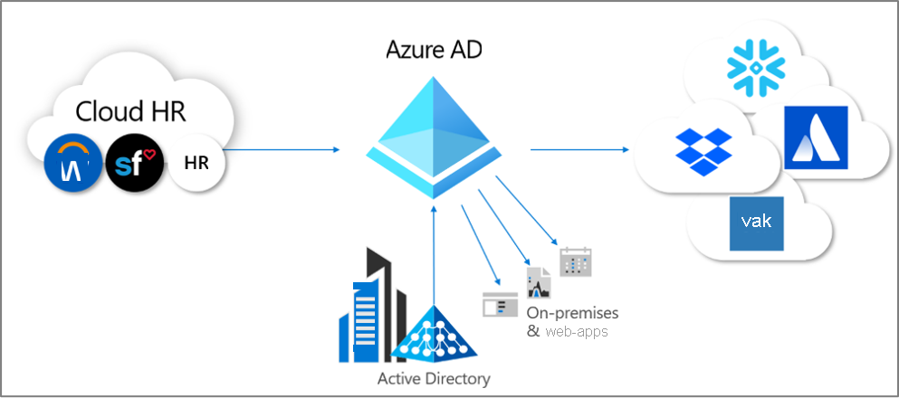
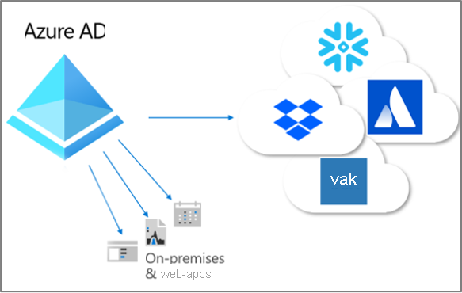

# Wat is inrichting?

Inrichten en het ongedaan maken van het inrichten zijn de processen die de consistentie van digitale identiteiten op meerdere systemen garanderen.  Deze processen worden meestal gebruikt als onderdeel van [Beheer van identiteitslevenscycli](what-is-identity-lifecycle-management.md).

**Inrichten** is het proces waarbij er op basis van bepaalde voorwaarden een identiteit wordt gemaakt in een doelsysteem.  **Het ongedaan maken van het inrichten** is het proces waarbij er een identiteit wordt verwijderd uit een doelsysteem als er niet langer aan voorwaarden wordt voldaan. **Synchronisatie** is het proces waarbij het ingerichte object up-to-date wordt bewaard, zodat het bronobject en doelobject vergelijkbaar zijn.

Wanneer een nieuwe werknemer bijvoorbeeld toetreedt tot uw organisatie, wordt deze werknemer ingevoerd in het HR-systeem.  Op dat moment kan met inrichting **van** HR **naar** Azure Active Directory (Azure AD) een corresponderend gebruikersaccount in Azure AD worden gemaakt. Toepassingen die query's uitvoeren in Azure AD kunnen het account voor die nieuwe werknemer zien.  Als er toepassingen zijn die geen gebruikmaken van Azure AD, dan kunt u inrichten **van** Azure AD **naar** de databases van die toepassingen. Dit zorgt ervoor dat de gebruiker toegang kan krijgen tot alle toepassingen waartoe de gebruiker toegang nodig heeft.  Dit stelt de gebruiker, al op de eerste dag, in staat om aan de slag te gaan en de benodigde toepassingen en systemen te gebruiken.  En wanneer zijn eigenschappen, zoals zijn afdeling of werkstatus, wijzigingen in het HR-systeem, worden die updates gesynchroniseerd van het HR-systeem naar Azure AD. Daarnaast gebeurt hetzelfde bij andere toepassingen en doeldatabases. Zo wordt de consistentie gegarandeerd.

Azure AD biedt momenteel drie gebieden van automatische inrichting.  Dit zijn:  

- Inrichten vanaf een extern, leidend recordsysteem zonder mappen naar Azure AD, via **[Inrichten op basis van HR](#hr-driven-provisioning)**  
- Inrichten vanaf Azure AD naar toepassingen, via **[App-inrichting](#app-provisioning)**  
- Inrichten tussen Azure AD en Active Directory Domain Services via **[inrichting tussen mappen](#inter-directory-provisioning)** 

## Inrichting op basis van HR

Het inrichten van HR naar Azure AD omvat het maken van objecten (meestal gebruikersidentiteiten die elke werknemer vertegenwoordigen). In sommige gevallen gaat het echter om andere objecten. Die objecten vertegenwoordigen afdelingen of andere structuren op basis van de informatie in uw HR-systeem.  

Het meest voorkomende scenario is wanneer een nieuwe werknemer toetreedt tot uw bedrijf en deze wordt ingevoerd in het HR-systeem.  Als dit het geval is, worden ze automatisch ingericht als een nieuwe gebruiker in Azure AD, zonder dat er administratieve betrokkenheid nodig is voor elke nieuwe werknemer.  Inrichting vanuit HR kan, over het algemeen, voorkomen in de volgende scenario's.

- **Nieuwe medewerkers aannemen** : wanneer een nieuwe werknemer wordt toegevoegd aan een HR-systeem, wordt automatisch een gebruikersaccount gemaakt. Dit gebeurt in Active Directory, Azure AD en optioneel in mappen voor andere toepassingen die worden ondersteund in Azure AD, met een terugschrijfbewerking van het e-mailadres naar het HR-systeem.
- **Updates van kenmerken en profielen van werknemers** : wanneer de record van een werknemer wordt bijgewerkt in het HR-systeem (zoals naam, functie of manager), wordt het gebruikersaccount automatisch bijgewerkt in Active Directory, Azure AD en optioneel in andere toepassingen die worden ondersteund in Azure AD.
- **Beëindiging van dienstverband** : wanneer een dienstverband in HR wordt beëindigd, worden aanmeldpogingen van het gebruikersaccount automatisch geblokkeerd of wordt het account automatisch verwijderd uit Active Directory, Azure AD en andere toepassingen.
- **Opnieuw aannemen van werknemers** : wanneer een werknemer opnieuw wordt ingeschakeld in de cloud van HR, kan zijn oude account automatisch opnieuw worden geactiveerd of opnieuw worden ingericht (afhankelijk van uw voorkeur).

Er zijn drie implementatieopties voor inrichten op basis van HR met Azure AD:

1. Voor organisaties met één abonnement op Workday of SuccessFactors en die geen gebruik maken van Active Directory
1. Voor organisaties met één abonnement op Workday of SuccessFactors en die gebruik maken van zowel Active Directory als Azure AD
1. Voor organisaties met meerdere HR-systemen of een HR-systeem dat on-premises is (zoals SAP, Oracle eBusiness of PeopleSoft)

Zie [Wat is een inrichten op basis van HR?](what-is-hr-driven-provisioning.md) voor meer informatie.

## App-inrichting

In Azure AD verwijst de term **[app-inrichting](https://docs.microsoft.com/azure/active-directory/manage-apps/user-provisioning)** naar het automatisch maken van kopieën van gebruikersidentiteiten. Dit gebeurt in de toepassingen waarvoor gebruikers toegang nodig hebben en voor toepassingen met een eigen gegevensarchief, buiten Azure AD of Active Directory. Naast het maken van gebruikersidentiteiten omvat app-inrichting het onderhoud en de verwijdering van gebruikersidentiteiten binnen die toepassingen, wanneer de gebruikersstatus of rollen wijzigen. Veelvoorkomende scenario's zijn onder andere het inrichten van een Azure AD-gebruiker in toepassingen zoals [Dropbox](https://docs.microsoft.com/azure/active-directory/saas-apps/dropboxforbusiness-provisioning-tutorial), [SalesForce](https://docs.microsoft.com/azure/active-directory/saas-apps/salesforce-provisioning-tutorial) en [ServiceNow](https://docs.microsoft.com/azure/active-directory/saas-apps/servicenow-provisioning-tutorial), omdat deze toepassingen een eigen gebruikersopslagplaats hebben die van Azure AD afgescheiden is.

Zie [Wat is app-inrichting?](what-is-app-provisioning.md) voor meer informatie.

## Inrichting tussen mappen

Veel organisaties vertrouwen op zowel Active Directory als Azure AD. Ze kunnen toepassingen hebben aangesloten op Active Directory, zoals bestandsservers die on-premises zijn.

Omdat veel organisaties on-premises inrichting op basis van HR hebben geïmplementeerd, hebben ze mogelijk al gebruikersidentiteiten voor al hun werknemers in Active Directory.   Het meestvoorkomende scenario voor inrichting tussen mappen is wanneer een gebruiker, die al in Active Directory staat, wordt ingericht in Azure AD.  Deze inrichting wordt gebruikelijk uitgevoerd door Azure AD Connect-synchronisatie of Azure AD Connect-cloudinrichting. 

Daarnaast is het mogelijk dat organisaties ook willen inrichten voor on-premises systemen vanuit Azure AD.  Een organisatie kan bijvoorbeeld gasten hebben ingesteld op de Azure AD-map, maar deze gasten moeten toegang hebben tot op on-premises WIA-webtoepassingen (Windows Integrated Authentication) via de app-proxy.  Hiervoor moeten on-premises AD-accounts worden ingericht voor die gebruikers in Azure AD.

Zie [Wat is inrichting tussen mappen?](what-is-inter-directory-provisioning.md) voor meer informatie.

 
## Volgende stappen 
- [Wat is identiteitslevenscyclusbeheer?](what-is-identity-lifecycle-management.md)
- [Wat is inrichting op basis van HR?](what-is-hr-driven-provisioning.md)
- [Wat is app-inrichting?](what-is-app-provisioning.md)
- [Wat is directory-inrichting?](what-is-inter-directory-provisioning.md)
