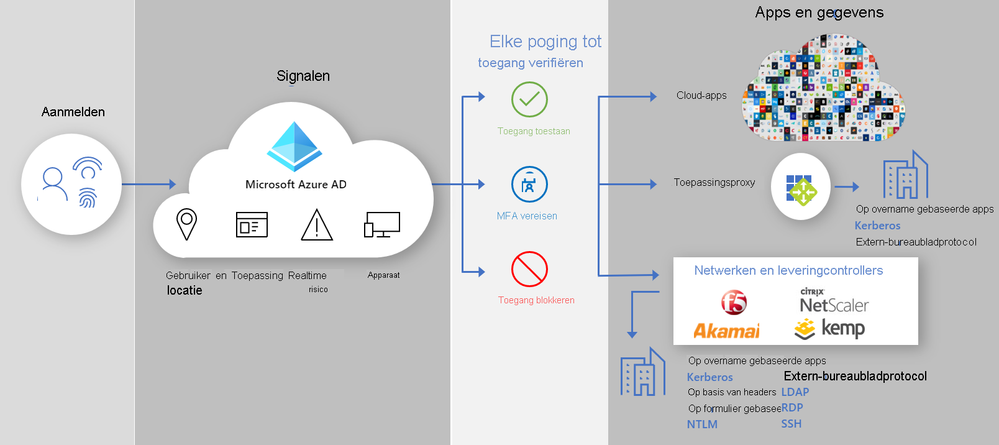

# Beveiligde hybride toegang: beveiligde verouderde apps met Azure Active Directory

U kunt nu uw lokale en Cloud toepassingen voor verouderde verificatie beveiligen door deze te verbinden met Azure Active Directory (AD) met:

- [Azure AD-toepassingsproxy](#secure-hybrid-access-through-azure-ad-application-proxy)

- [Uw bestaande controllers en netwerken voor de levering van toepassingen](#secure-hybrid-access-through-networking-and-delivery-controllers)

- [VPN-toepassingen (virtueel particulier netwerk)](#secure-hybrid-access-through-vpn-applications)

U kunt de ruimte overbruggen en uw beveiligings postuur versterken voor alle toepassingen met Azure AD-mogelijkheden, zoals [voorwaardelijke toegang tot](https://docs.microsoft.com/azure/active-directory/conditional-access/overview) Azure AD en Azure AD [Identity Protection](https://docs.microsoft.com/azure/active-directory/identity-protection/overview-identity-protection).

## Hybride toegang beveiligen via Azure AD-toepassingsproxy
  
Met [toepassings proxy](https://aka.ms/whyappproxy) kunt u [veilige externe toegang](https://docs.microsoft.com/azure/active-directory/manage-apps/application-proxy) tot uw on-premises webtoepassingen bieden. Uw gebruikers hoeven geen VPN te gebruiken. Gebruikers profiteren van een eenvoudige verbinding met hun toepassingen vanaf elk apparaat na een [eenmalige aanmelding](https://docs.microsoft.com/azure/active-directory/manage-apps/add-application-portal-setup-sso). Toepassings proxy biedt externe toegang als een service en biedt u de mogelijkheid om [uw on-premises toepassingen eenvoudig te publiceren](https://docs.microsoft.com/azure/active-directory/manage-apps/application-proxy-add-on-premises-application) naar gebruikers buiten het bedrijfs netwerk. U kunt hiermee uw beheer van Cloud toegang schalen zonder dat u uw on-premises toepassingen hoeft te wijzigen. [Plan een Azure AD-toepassingsproxy-implementatie](https://docs.microsoft.com/azure/active-directory/manage-apps/application-proxy-deployment-plan) als een volgende stap.

## Integraties van Azure AD-partner

### Hybride toegang beveiligen via netwerk-en bezorgings controllers

Naast [Azure AD-toepassingsproxy](https://aka.ms/whyappproxy), zodat u het [vertrouwens raamwerk met de waarde nul](https://www.microsoft.com/security/blog/2020/04/02/announcing-microsoft-zero-trust-assessment-tool/)kunt gebruiken, micro soft-partners met externe providers. U kunt uw bestaande netwerk-en bezorgings controllers gebruiken en eenvoudig verouderde toepassingen beveiligen die essentieel zijn voor uw bedrijfs processen, maar die u niet beveiligt met Azure AD. Waarschijnlijk hebt u al alles wat u nodig hebt om deze toepassingen te beveiligen.

De volgende netwerk leveranciers bieden vooraf ontwikkelde oplossingen en gedetailleerde richt lijnen voor de integratie met Azure AD.

- [Akamai Enter prise Application Access (EAA)](https://docs.microsoft.com/azure/active-directory/saas-apps/akamai-tutorial)

- [Citrix Application Delivery controller (ADC)](https://docs.microsoft.com/azure/active-directory/saas-apps/citrix-netscaler-tutorial)

- [F5 BIG-IP APM](https://docs.microsoft.com/azure/active-directory/saas-apps/headerf5-tutorial)

- [Kemp](https://docs.microsoft.com/azure/active-directory/saas-apps/kemp-tutorial)

### Hybride toegang beveiligen via VPN-toepassingen

Met VPN-oplossingen kunt u op elk gewenst moment beveiligde toegang bieden tot uw bedrijfs netwerk vanaf elk apparaat, op elke locatie tijdens het beveiligen van de gegevens van uw organisatie. Door Azure AD als id-provider (IDP) te hebben, kunt u moderne verificatie-en autorisatie methoden gebruiken, zoals [eenmalige aanmelding](https://docs.microsoft.com/azure/active-directory/manage-apps/what-is-single-sign-on) voor Azure AD en [multi-factor Authentication](https://docs.microsoft.com/azure/active-directory/authentication/concept-mfa-howitworks) om uw on-premises verouderde toepassingen te beveiligen.  

De volgende VPN-leveranciers bieden vooraf ontwikkelde oplossingen en gedetailleerde richt lijnen voor de integratie met Azure AD.

• [Cisco AnyConnect](https://docs.microsoft.com/azure/active-directory/saas-apps/cisco-anyconnect)

• [Fortinet](https://docs.microsoft.com/azure/active-directory/saas-apps/fortigate-ssl-vpn-tutorial)

• [F5 BIG-IP apm](https://aka.ms/f5-hybridaccessguide)

• [Palo Alto-netwerken wereld wijd beveiligen](https://docs.microsoft.com/azure/active-directory/saas-apps/paloaltoadmin-tutorial)

• [Zscaler private Access (ZPA)](https://aka.ms/zscaler-hybridaccessguide)
