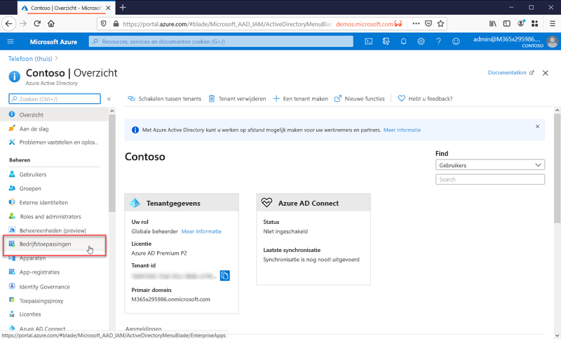

# Wat is toepassingsbeheer?

Azure AD is een IAM-systeem (identiteits- en toegangsbeheer). Het biedt één plaats voor het opslaan van informatie over digitale identiteiten. U kunt uw softwaretoepassingen configureren voor het gebruik van Azure AD als de locatie waar de gebruikersgegevens worden opgeslagen. 

Azure AD moet worden geconfigureerd om te integreren met een toepassing. Met andere woorden, de IT-afdeling moet weten welke toepassingen deze gebruiken als een identiteitssysteem. Het proces waarbij Azure AD op de hoogte wordt gehouden van deze toepassingen en hoe deze moeten worden verwerkt, wordt toepassingsbeheer genoemd.

U kunt toepassingen beheren op de blade **ondernemingstoepassingen** in het gedeelte Beheren van de Azure Active Directory-portal.

## Wat is een IAM-systeem (identiteits- en toegangsbeheer)?
Een toepassing is software die voor een bepaald doel wordt gebruikt. Voor de meeste toepassingen moeten gebruikers zich aanmelden zodat de toepassing een aangepaste ervaring kan bieden voor die specifieke gebruiker. Met andere woorden, de toepassing moet de identiteit weten van de gebruiker die de toepassing gebruikt. Omdat het weet welke functionaliteit het moet aanbieden of verwijderen voor de gebruiker.

Als voor elke toepassing afzonderlijke gebruikers worden bijgehouden, is het resultaat een silo van verschillende gebruikersnamen en aanmeldingen voor elke toepassing. Een toepassing weet niets over de gebruikers in andere toepassingen.

Een gecentraliseerd identiteitssysteem lost dit probleem op door één locatie op te geven voor het opslaan van gebruikersgegevens die vervolgens door alle toepassingen kunnen worden gebruikt. Deze systemen worden aangeduid als identiteits-en toegangsbeheer(IAM)-systemen. Azure Active AD is het IAM-systeem voor de Microsoft-cloud.

>[!TIP]
>Een IAM-systeem biedt één locatie voor het bijhouden van gebruikersidentiteiten. Azure AD is het IAM-systeem voor de Microsoft-cloud.

## Waarom toepassingen beheren met een cloud-oplossing?

Organisaties hebben vaak honderden toepassingen waar gebruikers afhankelijk van zijn voor hun werk. Gebruikers hebben toegang tot deze toepassingen van groot aantal apparaten en -locaties. Elke dag worden nieuwe toepassingen toegevoegd, ontwikkeld en buiten gebruik gesteld. Met zo veel toepassingen en toegangspunten is het belangrijker dan ooit om een op de cloud gebaseerde oplossing te gebruiken voor het beheren van gebruikerstoegang tot alle toepassingen.

>[!TIP]
>De galerie met Azure AD-apps bevat veel populaire toepassingen die al vooraf zijn geconfigureerd voor gebruik met Azure AD als id-provider.

## Hoe werkt Azure AD met toepassingen?

Azure AD vereenvoudigt de manier waarop u uw toepassingen beheert door één identiteitssysteem te bieden voor uw cloud- en on-premises apps. U kunt uw SaaS-toepassingen (Software as a Service), on-premises toepassingen en LOB-apps (Line-Of-Business) toevoegen aan Azure AD. Gebruikers melden zich vervolgens eenmalig aan voor veilige en naadloze toegang tot deze toepassingen, samen met Office 365 en andere zakelijke toepassingen van Microsoft. U kunt de administratieve kosten verlagen door het [inrichten van gebruikers te automatiseren](../app-provisioning/user-provisioning.md). U kunt ook meervoudige verificatie en beleid voor voorwaardelijke toegang gebruiken om op een veilige manier toegang te bieden tot toepassingen.

## Welke typen toepassingen kan ik integreren met Azure AD?

Er zijn vier hoofdtypen toepassingen die u kunt toevoegen aan **Bedrijfstoepassingen** en vervolgens kunt beheren met Azure AD:

- **Toepassingen uit galerie van Azure AD**: Azure AD bevat een galerie met duizenden toepassingen die vooraf zijn geïntegreerd voor eenmalige aanmelding met Azure AD. Sommige toepassingen die worden gebruikt in uw organisatie, bevinden zich waarschijnlijk in de galerie. [Lees meer over het plannen van uw app-integratie](plan-an-application-integration.md) of raadpleeg gedetailleerde integratiestappen voor afzonderlijke apps in de [zelfstudies voor SaaS-toepassingen](https://docs.microsoft.com/azure/active-directory/saas-apps/).

- **On-premises toepassingen met Application Proxy**: met Azure AD Application Proxy kunt u uw on-premises web-apps integreren met Azure AD om ondersteuning voor eenmalige aanmelding te bieden. Eindgebruikers hebben vervolgens toegang tot uw on-premises web-apps op dezelfde manier als waarop ze toegang hebben tot Office 365 en andere SaaS-toepassingen, zie [Externe toegang bieden tot on-premises toepassingen via de toepassingsproxy van Azure AD](application-proxy.md).

- **Aangepaste toepassingen**: wanneer u uw eigen LOB-toepassingen bouwt, kunt u deze integreren met Azure AD voor de ondersteuning van eenmalige aanmelding. Door uw toepassing te registreren bij Azure AD, hebt u controle over het verificatiebeleid voor de toepassing. Zie de [richtlijnen voor ontwikkelaars](developer-guidance-for-integrating-applications.md) voor meer informatie.

- **Toepassingen niet in galerie**: neem uw eigen toepassingen mee. Biedt ondersteuning voor eenmalige aanmelding voor andere apps door deze toe te voegen aan Azure AD. Er zijn meerdere manieren om een toepassing te integreren, een paar hiervan worden hieronder weergegeven. Zie [Wachtwoord voor eenmalige aanmelding configureren voor een toepassing buiten de galerie](configure-single-sign-on-non-gallery-applications.md) voor meer informatie.

>[!TIP]
>U kunt Azure AD integreren met een toepassing, zelfs als deze nog niet vooraf is geconfigureerd en niet in de app-galerie staat. U kunt **Azure AD integreren met een** van de volgende
> - Een webkoppeling of toepassing die een **gebruikersnaam- en wachtwoordveld** weergeeft.
> - Elke toepassing die ondersteuning biedt voor **SAML- of OpenID Connect-protocollen**.
> - Elke toepassing die ondersteuning biedt voor de standaard **System for Cross-Domain Identity Management**.

## Risico beheersen met beleid voor voorwaardelijke toegang

Het koppelen van eenmalige aanmelding van Azure AD aan beleid voor [voorwaardelijke toegang](../conditional-access/concept-conditional-access-cloud-apps.md) biedt een hoge mate van beveiliging voor toegang tot toepassingen. Mogelijkheden voor beveiliging zijn schaalbare cloud-identiteitsbeveiliging, risicogebaseerde meervoudige verificatie en beleid voor voorwaardelijke toegang. Dankzij deze mogelijkheden kunt een nauwkeurig beheer creëren op basis van toepassingen of van groepen die een hoger niveau van beveiliging nodig hebben.

## Verhoog de productiviteit met eenmalige aanmelding

Eenmalige aanmelding (SSO) voor toepassingen en Office 365 biedt een superieure aanmeldingservaring voor bestaande gebruikers door verschillende aanmeldingen te elimineren. Er wordt een samenhangende gebruikersomgeving gecreëerd zonder afleiding door meerdere aanmeldschermen of de noodzaak om meerdere wachtwoorden te beheren. De bedrijfsgroep kan toegang beheren en goedkeuren via selfservice en dynamisch lidmaatschap. De zorg dat alleen de juiste personen in het bedrijf toegang hebben tot een toepassing verbetert de beveiliging van het identiteitssysteem.

SSO verbetert de beveiliging. *Zonder eenmalige aanmelding* moeten beheerders gebruikersaccounts maken en bijwerken voor elke afzonderlijke toepassing. Dat kost waardevolle tijd. Gebruikers moeten meerdere referenties bijhouden voor toegang tot hun toepassingen. Als gevolg hiervan schrijven gebruikers vaak hun wachtwoorden op of gebruiken andere oplossingen voor wachtwoordbeheer waarmee het beveiligingsrisico stijgt. [Lees meer over eenmalige aanmelding](what-is-single-sign-on.md).

## Voeg governance en naleving toe

Met Azure AD, kunt u de toepassing-aanmeldingen bewaken met behulp van rapporten die gebruikmaken van hulpprogramma's voor beveiligingsincidenten en gebeurtenisbewaking (SIEM). U kunt de rapporten openen vanuit de portal of via API's. Programmatisch controleren wie toegang heeft tot uw toepassingen en toegang verwijderen van niet-actieve gebruikers via toegangsbeoordelingen.

## Kosten beheren

Door te migreren naar Azure AD, kunt u kosten besparen en wordt het beheer van on-premises infrastructuur makkelijk. Azure AD biedt ook self-service tot toepassingen, en bespaart daarmee tijd voor beheerders en gebruikers. Eenmalige aanmelding elimineert de noodzaak van toepassingsspecifieke wachtwoorden. De mogelijkheid u slechts eenmaal te hoeven aanmelden, bespaart op kosten in verband met wachtwoordherstel voor toepassingen en wordt productieverlies voorkomen bij het ophalen van wachtwoorden.

Voor toepassingen die gericht zijn op human resources of andere toepassingen met een grote set gebruikers, kunt u gebruikmaken van app-inrichting voor het automatiseren van het proces van het inrichten en het ongedaan maken van de inrichting van gebruikers, zie [Wat is toepassing inrichten?](../app-provisioning/user-provisioning.md).

## Volgende stappen

- [Toepassingen weergeven die al zijn geconfigureerd in uw Azure AD-Tenant](view-applications-portal.md)
- [Snelstart: Een galerietoepassing toevoegen aan uw Azure AD-tenant](add-application-portal.md)
- [Een galerietoepassing toevoegen aan uw Azure AD-organisatie](add-gallery-app.md)
- [Aan de slag met toepassingsintegratie](plan-an-application-integration.md)
- [Meer informatie over het automatiseren van inrichting](../app-provisioning/user-provisioning.md)