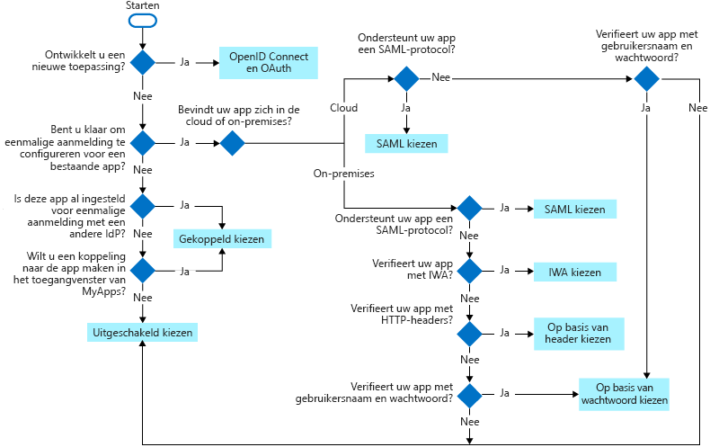

# Wat is eenmalige aanmelding?

Eenmalige aanmelding (SSO) voegt beveiligings-en gebruiks gemak toe wanneer gebruikers zich aanmelden bij toepassingen in Azure Active Directory (Azure AD). In dit artikel worden de methoden voor eenmalige aanmelding beschreven, en kunt u de meest geschikte SSO-methode kiezen voor het configureren van uw toepassingen.

- **Met eenmalige aanmelding**kunnen gebruikers zich eenmaal aanmelden met een account om toegang te krijgen tot apparaten die lid zijn van een domein, bedrijfs bronnen, SaaS-toepassingen (Software as a Service) en webtoepassingen. Nadat u zich hebt aangemeld, kan de gebruiker toepassingen starten vanuit de Office 365-portal of het Azure AD MyApps-toegangs venster. Beheerders kunnen beheer van gebruikers accounts centraliseren en automatisch gebruikers toegang toevoegen aan of verwijderen uit toepassingen op basis van groepslid maatschap.

- **Zonder**eenmalige aanmelding moeten gebruikers toepassingsspecifieke wacht woorden onthouden en zich aanmelden bij elke toepassing. IT-mede werkers moeten gebruikers accounts maken en bijwerken voor elke toepassing, zoals Office 365, box en Sales Force. Gebruikers moeten hun wacht woord onthouden, plus de tijd om zich aan te melden bij elke toepassing.

## Een methode kiezen voor eenmalige aanmelding

Er zijn verschillende manieren om een toepassing te configureren voor eenmalige aanmelding. Het kiezen van een methode voor eenmalige aanmelding is afhankelijk van hoe de toepassing voor verificatie is geconfigureerd.

- Cloud toepassingen kunnen OpenID Connect Connect-, OAuth-, SAML-, op wacht woord gebaseerde, gekoppelde of uitgeschakelde methoden gebruiken voor eenmalige aanmelding. 
- On-premises toepassingen kunnen op wacht woord gebaseerde, geïntegreerde Windows-verificatie, op headers gebaseerde, gekoppelde of uitgeschakelde methoden gebruiken voor eenmalige aanmelding. De on-premises keuzes werken wanneer toepassingen zijn geconfigureerd voor toepassings proxy.

Dit stroom diagram helpt u te beslissen welke methode voor eenmalige aanmelding het meest geschikt is voor uw situatie.

De volgende tabel bevat een overzicht van de methoden voor eenmalige aanmelding en koppelingen naar meer details.

| Methode voor eenmalige aanmelding | Toepassingstypen | Wanneer gebruikt u dit? |
| :------ | :------- | :----- |
| [OpenID Connect Connect en OAuth](#openid-connect-and-oauth) | alleen Cloud | Gebruik OpenID Connect Connect en OAuth bij het ontwikkelen van een nieuwe toepassing. Dit protocol vereenvoudigt toepassings configuratie, heeft gebruiks vriendelijke Sdk's en stelt uw toepassing in staat om MS Graph te gebruiken.
| [SAML](#saml-sso) | Cloud en on-premises | Kies indien mogelijk SAML voor bestaande toepassingen die geen gebruikmaken van OpenID Connect Connect of OAuth. SAML werkt voor toepassingen die worden geverifieerd met een van de SAML-protocollen.|
| [Op basis van wacht woorden](#password-based-sso) | Cloud en on-premises | Kies een wacht woord op basis van het tijdstip waarop de toepassing wordt geverifieerd met de gebruikers naam en het wacht woord. Met eenmalige aanmelding op basis van wacht woorden kan beveiligde toepassings wachtwoorden worden opgeslagen en opnieuw worden afgespeeld met een webbrowser extensie of een mobiele app. Deze methode maakt gebruik van het bestaande aanmeldings proces van de toepassing, maar stelt een beheerder in staat om de wacht woorden te beheren. |
| [Btrieve](#linked-sign-on) | Cloud en on-premises | Kies gekoppelde aanmelding wanneer de toepassing is geconfigureerd voor eenmalige aanmelding in een andere ID-provider service. Met deze optie wordt geen eenmalige aanmelding toegevoegd aan de toepassing. De toepassing heeft echter mogelijk al een eenmalige aanmelding die is geïmplementeerd met een andere service, zoals Active Directory Federation Services.|
| [Uitgeschakeld](#disabled-sso) | Cloud en on-premises | Kies uitgeschakelde eenmalige aanmelding wanneer de app niet gereed is om te worden geconfigureerd voor eenmalige aanmelding. Deze modus is de standaard instelling bij het maken van de app.|
| [Geïntegreerde Windows-verificatie (IWA)](#integrated-windows-authentication-iwa-sso) | alleen on-premises | Kies IWA eenmalige aanmelding voor toepassingen die gebruikmaken van [geïntegreerde Windows-authenticatie (IWA)](/aspnet/web-api/overview/security/integrated-windows-authentication)of claim bewuste toepassingen. Voor IWA gebruiken de connectors van de toepassings proxy Kerberos-beperkte delegering (KCD) om gebruikers te verifiëren voor de toepassing. |
| [Op basis van koptekst](#header-based-sso) | alleen on-premises | Gebruik eenmalige aanmelding op basis van een koptekst wanneer de toepassing headers gebruikt voor verificatie. Voor eenmalige aanmelding op basis van een header is PingAccess voor Azure AD vereist. Toepassings proxy gebruikt Azure AD voor de verificatie van de gebruiker en geeft vervolgens verkeer door via de connector service.  |

## OpenID Connect Connect en OAuth

Bij het ontwikkelen van nieuwe toepassingen gebruikt u moderne protocollen zoals OpenID Connect Connect en OAuth om de beste eenmalige aanmelding voor uw app op meerdere platformen te bieden. Met OAuth kunnen gebruikers of beheerders [toestemming geven](configure-user-consent.md) voor beveiligde bronnen zoals [Microsoft Graph](/graph/overview). We bieden u de mogelijkheid om [sdk's](../develop/reference-v2-libraries.md) voor uw app te nemen, en uw app is nu klaar voor gebruik van [Microsoft Graph](/graph/overview).

Zie voor meer informatie:

- [OAuth 2.0](../develop/v2-oauth2-auth-code-flow.md)
- [OpenID Connect 1.0](../develop/v2-protocols-oidc.md)
- [Ontwikkelaars handleiding voor micro soft Identity platform](https://docs.microsoft.com/azure/active-directory/develop/active-directory-developers-guide).

## Eenmalige aanmelding op basis van SAML

Met **eenmalige aanmelding via SAML**verifieert Azure AD bij de toepassing met behulp van het Azure ad-account van de gebruiker. Azure AD communiceert de aanmeldings gegevens met de toepassing via een verbindings protocol. Met eenmalige aanmelding op basis van SAML kunt u gebruikers toewijzen aan specifieke toepassings rollen op basis van de regels die u in uw SAML-claims definieert.

Kies op SAML gebaseerde eenmalige aanmelding wanneer de toepassing deze ondersteunt.

Eenmalige aanmelding op basis van SAML wordt ondersteund voor toepassingen die gebruikmaken van een van de volgende protocollen:

- SAML 2.0
- Webservices-federatie

Als u een SaaS-toepassing wilt configureren voor eenmalige aanmelding op basis van SAML, raadpleegt u [eenmalige aanmelding op basis van SAML configureren](configure-single-sign-on-non-gallery-applications.md). Daarnaast beschikken veel SaaS-toepassingen (Software as a Service) over een [toepassingsspecifieke zelf studie](../saas-apps/tutorial-list.md) die u door de configuratie voor eenmalige aanmelding op basis van SAML.

Als u een toepassing voor WS-Federation wilt configureren, volgt u dezelfde richt lijnen om de toepassing te configureren voor eenmalige aanmelding op basis van SAML. Zie [op SAML gebaseerde eenmalige aanmelding configureren](configure-single-sign-on-non-gallery-applications.md). In de stap om de toepassing te configureren voor het gebruik van Azure AD, moet u de Azure AD-aanmeldings-URL voor het WS-Federation-eind punt vervangen `https://login.microsoftonline.com/<tenant-ID>/wsfed` .

Als u een on-premises toepassing wilt configureren voor eenmalige aanmelding op basis van SAML, raadpleegt u SSO [eenmalige aanmelding voor on-premises toepassingen met toepassings proxy](application-proxy-configure-single-sign-on-on-premises-apps.md).

Zie het [SAML-protocol voor eenmalige aanmelding](../develop/single-sign-on-saml-protocol.md)voor meer informatie over het SAML-protocol.

## Eenmalige aanmelding op basis van wacht woorden

Met aanmelden op basis van wacht woorden kunnen gebruikers zich bij de toepassing aanmelden met een gebruikers naam en wacht woord, de eerste keer dat ze deze gebruiken. Na de eerste aanmelding levert Azure AD de gebruikersnaam en het wachtwoord voor de toepassing.

Eenmalige aanmelding op basis van wacht woorden gebruikt het bestaande verificatie proces dat door de toepassing wordt verschaft. Wanneer u eenmalige aanmelding met een wacht woord inschakelt voor een toepassing, worden gebruikers namen en wacht woorden voor de toepassing door Azure AD verzameld en beveiligd. Gebruikers referenties worden opgeslagen in een versleutelde status in de map.

Kies eenmalige aanmelding op basis van wacht woorden wanneer:

- Een toepassing biedt geen ondersteuning voor het SAML-protocol voor eenmalige aanmelding.
- Een toepassing wordt geverifieerd met een gebruikers naam en wacht woord in plaats van toegangs tokens en headers.

>[!NOTE]
>U kunt geen beleid voor voorwaardelijke toegang of multi-factor Authentication voor SSO op basis van wacht woorden Toep assen.

Eenmalige aanmelding op basis van wacht woorden wordt ondersteund voor elke Cloud toepassing die een op HTML gebaseerde aanmeldings pagina heeft. De gebruiker kan een van de volgende browsers gebruiken:

- Internet Explorer 11 op Windows 7 of hoger
   > [!NOTE]
   > Internet Explorer heeft beperkte ondersteuning en ontvangt geen nieuwe software-updates meer. Micro soft Edge is de aanbevolen browser.

- Micro soft Edge in Windows 10 jubileum Edition of hoger
- Micro soft Edge voor iOS en Android
- Intune Managed Browser
- Chrome op Windows 7 of hoger en op macOS X of hoger
- Firefox 26,0 of hoger op Windows XP SP2 of hoger en op macOS X 10,6 of hoger

Als u een Cloud toepassing wilt configureren voor eenmalige aanmelding op basis van wacht woord, raadpleegt u [eenmalige aanmelding voor wacht woord configureren](configure-password-single-sign-on-non-gallery-applications.md).

Als u een on-premises toepassing wilt configureren voor eenmalige aanmelding via toepassings proxy, raadpleegt u [wachtwoord kluizen voor eenmalige aanmelding met toepassings proxy](application-proxy-configure-single-sign-on-password-vaulting.md)

### Hoe verificatie werkt voor SSO op basis van een wacht woord

Als u een gebruiker wilt verifiëren voor een toepassing, haalt Azure AD de referenties van de gebruiker op uit de Directory en voert deze in op de aanmeldings pagina van de toepassing.  Azure AD geeft de gebruikers referenties veilig door middel van een webbrowser extensie of een mobiele app. Met dit proces kan een beheerder gebruikers referenties beheren en hoeven gebruikers hun wacht woord niet te onthouden.

> [!IMPORTANT]
> De referenties zijn van de gebruiker verborgen tijdens het geautomatiseerde aanmeldings proces. De referenties kunnen echter wel worden gedetecteerd met behulp van hulpprogram ma's voor fout opsporing in het web. Gebruikers en beheerders moeten hetzelfde beveiligings beleid volgen alsof referenties rechtstreeks door de gebruiker zijn ingevoerd.

### Referenties voor SSO op basis van een wacht woord beheren

Wacht woorden voor elke toepassing kunnen worden beheerd door de Azure AD-beheerder of door de gebruikers.

Wanneer de Azure AD-beheerder de referenties beheert:  

- De gebruiker hoeft de gebruikers naam en het wacht woord niet opnieuw in te stellen of te onthouden. De gebruiker kan toegang krijgen tot de toepassing door erop te klikken in hun toegangs venster of via een beschik bare koppeling.
- De beheerder kan beheer taken uitvoeren op de referenties. De beheerder kan bijvoorbeeld de toegang tot de toepassing bijwerken op basis van lidmaatschappen van gebruikers en de status van werk nemers.
- De beheerder kan beheerders referenties gebruiken om toegang te bieden tot toepassingen die worden gedeeld door veel gebruikers. De beheerder kan bijvoorbeeld toestaan dat iedereen die toegang heeft tot een toepassing toegang heeft tot een sociale media of een toepassing voor het delen van documenten.

Wanneer de eind gebruiker de referenties beheert:

- Gebruikers kunnen hun wacht woord beheren door ze naar behoefte bij te werken of te verwijderen.
- Beheerders kunnen nog steeds nieuwe referenties voor de toepassing instellen.

## Gekoppelde aanmelding
Met gekoppelde aanmelding kan Azure AD eenmalige aanmelding bieden voor een toepassing die al is geconfigureerd voor eenmalige aanmelding in een andere service. De gekoppelde toepassing kan worden weer gegeven aan eind gebruikers in de Office 365-portal of Azure AD MyApps-Portal. Een gebruiker kan bijvoorbeeld een toepassing starten die is geconfigureerd voor eenmalige aanmelding in Active Directory Federation Services 2,0 (AD FS) van de Office 365-Portal. Aanvullende rapportage is ook beschikbaar voor gekoppelde toepassingen die worden gestart vanuit de Office 365-portal of de Azure AD MyApps-Portal. Zie [gekoppelde aanmelding configureren](configure-linked-sign-on.md)voor informatie over het configureren van een toepassing voor een gekoppelde aanmelding.

### Gekoppelde aanmelding voor toepassings migratie

Een gekoppelde aanmelding kan een consistente gebruikers ervaring bieden tijdens het migreren van toepassingen over een bepaalde periode. Als u toepassingen migreert naar Azure Active Directory, kunt u een gekoppelde aanmelding gebruiken om snel koppelingen te publiceren naar alle toepassingen die u wilt migreren.  Gebruikers kunnen alle koppelingen vinden in de [MyApps-Portal](../user-help/active-directory-saas-access-panel-introduction.md) of het [Start programma voor Office 365 Application](https://support.office.com/article/meet-the-office-365-app-launcher-79f12104-6fed-442f-96a0-eb089a3f476a). Gebruikers weten niet dat ze toegang hebben tot een gekoppelde toepassing of een gemigreerde toepassing.  

Nadat een gebruiker is geverifieerd met een gekoppelde toepassing, moet een account record worden gemaakt voordat de eind gebruiker toegang tot eenmalige aanmelding biedt. Het inrichten van deze account record kan automatisch plaatsvinden of kan hand matig door een beheerder worden uitgevoerd.

>[!NOTE]
>U kunt geen beleid voor voorwaardelijke toegang of multi-factor Authentication Toep assen op een gekoppelde toepassing. Dit komt doordat een gekoppelde toepassing geen mogelijkheden biedt voor eenmalige aanmelding via Azure AD. Wanneer u een gekoppelde toepassing configureert, voegt u simpelweg een koppeling toe die wordt weer gegeven in het start programma voor apps of in de MyApps-Portal. 

## SSO uitgeschakeld

In de modus uitgeschakeld wordt eenmalige aanmelding niet gebruikt voor de toepassing. Wanneer eenmalige aanmelding is uitgeschakeld, moeten gebruikers mogelijk twee maal worden geverifieerd. Eerst verifiëren gebruikers bij Azure AD en registreren ze vervolgens bij de toepassing.

Uitgeschakelde modus voor eenmalige aanmelding gebruiken:

- Als u deze toepassing niet kunt integreren met eenmalige aanmelding van Azure AD, of
- Als u andere aspecten van de toepassing test, of
- Als een beveiligingslaag voor een on-premises toepassing waarvoor gebruikers zich niet hoeven te verifiëren. Als deze is uitgeschakeld, moet de gebruiker worden geverifieerd.

Houd er rekening mee dat als u de toepassing voor met SP geïnitieerde op SAML gebaseerde eenmalige aanmelding hebt geconfigureerd en u de SSO-modus wijzigt in uitschakelen, niet stopt dat gebruikers zich niet meer kunnen aanmelden bij de toepassing buiten de MyApps-Portal. Als u dit wilt doen, moet u [de mogelijkheid voor gebruikers om zich aan te melden, uitschakelen](disable-user-sign-in-portal.md)

## Geïntegreerde Windows-verificatie (IWA) SSO

[Toepassings proxy](application-proxy.md) biedt eenmalige aanmelding (SSO) voor toepassingen die gebruikmaken van [geïntegreerde Windows-authenticatie (IWA)](/aspnet/web-api/overview/security/integrated-windows-authentication)of claim bewuste toepassingen. Als uw toepassing gebruikmaakt van IWA, verifieert de toepassings proxy bij de toepassing met behulp van Kerberos-beperkte delegering (KCD). Voor een claim bewuste toepassing die Azure Active Directory vertrouwt, werkt eenmalige aanmelding, omdat de gebruiker al is geverifieerd met behulp van Azure AD.

Kies geïntegreerde Windows-verificatie modus voor eenmalige aanmelding om eenmalige aanmelding te bieden voor een on-premises app die wordt geverifieerd met IWA.

Als u een on-premises app wilt configureren voor IWA, raadpleegt [u beperkte Kerberos-delegering voor eenmalige aanmelding bij uw toepassingen met toepassings proxy](application-proxy-configure-single-sign-on-with-kcd.md).

### Hoe eenmalige aanmelding met KCD werkt
In dit diagram wordt de stroom uitgelegd wanneer een gebruiker toegang heeft tot een on-premises toepassing die gebruikmaakt van IWA.

1. De gebruiker voert de URL in voor toegang tot de on-premises toepassing via de toepassings proxy.
1. Toepassings proxy leidt de aanvraag om naar Azure AD Authentication Services om vooraf te worden geverifieerd. Op dit moment past Azure AD alle toepasselijke beleids regels voor verificatie en autorisatie toe, zoals multi-factor Authentication. Als de gebruiker is gevalideerd, wordt door Azure AD een token gemaakt en verzonden naar de gebruiker.
1. De gebruiker geeft het token door aan de toepassings proxy.
1. Toepassings proxy valideert het token en haalt de User Principal Name (UPN) op uit het token. Vervolgens worden de aanvraag, de UPN en de SPN-naam (Service Principal Name) verzonden naar de connector via een dubbel geverifieerd beveiligd kanaal.
1. De connector gebruikt KCD-onderhandelingen (Kerberos-beperkte overdracht) met de on-premises AD en imiteert de gebruiker om een Kerberos-token aan de toepassing te krijgen.
1. Active Directory verzendt het Kerberos-token voor de toepassing naar de connector.
1. De connector verzendt de oorspronkelijke aanvraag naar de toepassings server met behulp van het Kerberos-token dat is ontvangen van AD.
1. De toepassing stuurt het antwoord naar de connector, die vervolgens wordt teruggestuurd naar de service toepassings proxy en uiteindelijk aan de gebruiker.

## SSO op basis van koptekst

Op headers gebaseerde eenmalige aanmelding werkt voor toepassingen die gebruikmaken van HTTP-headers voor authenticatie. Deze aanmeldings methode maakt gebruik van een verificatie service van derden met de naam PingAccess. Een gebruiker hoeft zich alleen te verifiëren bij Azure AD.

Kies eenmalige aanmelding op basis van een header wanneer toepassings proxy en PingAccess zijn geconfigureerd voor de toepassing.

Zie op headers gebaseerde verificatie [voor eenmalige aanmelding met toepassings proxy](application-proxy-configure-single-sign-on-with-ping-access.md)om verificatie op basis van headers te configureren.

### Wat is PingAccess voor Azure AD?

Met PingAccess voor Azure AD kunnen gebruikers toegang krijgen tot en eenmalige aanmelding voor toepassingen die gebruikmaken van headers voor authenticatie. Toepassings proxy behandelt deze toepassingen, zoals andere, met behulp van Azure AD om toegang te verifiëren en vervolgens verkeer door te geven via de connector service. Nadat de verificatie is uitgevoerd, zet de PingAccess-service het Azure AD-toegangs token om in een header-indeling die naar de toepassing wordt verzonden.

Uw gebruikers zien niets anders wanneer ze zich aanmelden om uw bedrijfs toepassingen te gebruiken. Ze kunnen nog steeds vanaf elke locatie op elk apparaat werken. De Application proxy-connectors sturen extern verkeer naar alle toepassingen, waarna ze automatisch taak verdelingen blijven.

### Hoe kan ik een licentie voor PingAccess ophalen?

Aangezien dit scenario wordt aangeboden via een partnerschap tussen Azure AD en PingAccess, hebt u licenties nodig voor beide services. Azure AD Premium-abonnementen omvatten echter een eenvoudige PingAccess-licentie die betrekking heeft op Maxi maal 20 toepassingen. Als u meer dan 20 toepassingen op basis van headers wilt publiceren, kunt u een extra licentie verkrijgen via PingAccess.

Zie [Azure Active Directory-edities](../fundamentals/active-directory-whatis.md)voor meer informatie.

## Verwante artikelen:
* [Tutorials for integrating SaaS applications with Azure Active Directory](../saas-apps/tutorial-list.md) (Zelfstudies voor het integreren van SaaS-toepassingen met Azure Active Directory)
* [Eenmalige aanmelding op basis van SAML configureren](configure-single-sign-on-non-gallery-applications.md)
* [Eenmalige aanmelding op basis van wacht woord configureren](configure-password-single-sign-on-non-gallery-applications.md)
* [Een gekoppelde aanmelding configureren](configure-linked-sign-on.md)
* [Inleiding tot het beheren van de toegang tot toepassingen](what-is-access-management.md)
* Download koppeling: [implementatie plan voor eenmalige aanmelding](https://aka.ms/SSODeploymentPlan).
