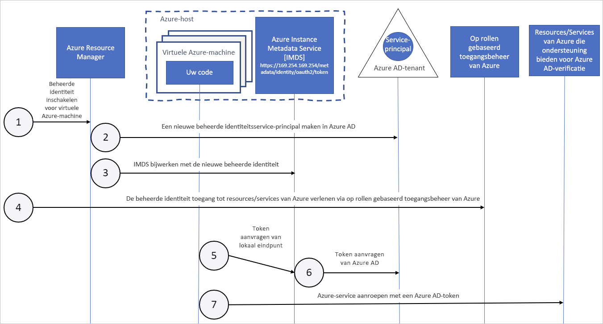

# Hoe beheerde identiteiten voor Azure-resources werken met virtuele machines van Azure

Beheerde identiteiten voor Azure-resources bieden Azure-services met een automatisch beheerde identiteit in Azure Active Directory. U kunt deze identiteit gebruiken voor verificatie bij alle services die Microsoft Azure AD-verificatie ondersteunen, zonder dat u aanmeldingsgegevens in uw code hoeft te hebben.

In dit artikel leert u hoe beheerde identiteiten werken met virtuele machines van Azure (Vm's).

## Hoe werkt het?

Interne beheerde identiteiten zijn service-principals van een speciaal type, die alleen kunnen worden gebruikt met Azure-resources. Wanneer de beheerde identiteit wordt verwijderd, wordt de bijbehorende service-principal automatisch verwijderd.
Wanneer een door de gebruiker toegewezen of door het systeem toegewezen identiteit wordt gemaakt, geeft de resourceprovider voor beheerde identiteit intern een certificaat door aan die identiteit. 

De code kan gebruikmaken van een beheerde identiteit om toegangstokens aan te vragen voor services die ondersteuning bieden voor Azure AD-verificatie. Azure zorgt voor het implementeren van de referenties die worden gebruikt door het service-exemplaar. 

In het volgende diagram ziet u hoe beheerde service-identiteiten samenwerken met virtuele machines (VM's) van Azure:

|  Eigenschap    | Door het systeem toegewezen beheerde identiteit | Door een gebruiker toegewezen beheerde identiteit |
|------|----------------------------------|--------------------------------|
| Maken |  Gemaakt als onderdeel van een Azure-resource (bijvoorbeeld een virtuele Azure-machine of Azure App Service). | Gemaakt als een zelfstandige Azure-resource. |
| Levenscyclus | Gedeelde levenscyclus met de Azure-resource waarmee de beheerde identiteit wordt gemaakt.   Wanneer de bovenliggende resource wordt verwijderd, wordt ook de beheerde identiteit verwijderd. | Onafhankelijke levenscyclus.   Moet expliciet worden verwijderd. |
| Delen tussen Azure-resources | Kan niet worden gedeeld.   Deze kan alleen worden gekoppeld aan één Azure-resource. | Kan worden gedeeld.   Dezelfde door de gebruiker toegewezen beheerde identiteit kan worden gekoppeld aan meer dan één Azure-resource. |
| Algemene scenario’s | Werkbelastingen die zijn opgenomen in één Azure-resource.   Werkbelastingen waarvoor u onafhankelijke identiteiten nodig hebt.   Bijvoorbeeld een toepassing die op één virtuele machine wordt uitgevoerd | Werkbelastingen die worden uitgevoerd op meerdere resources en die één identiteit kunnen delen.   Werkbelastingen waarvoor vooraf autorisatie is vereist voor een beveiligde bron als onderdeel van een inrichtingsstroom.   Werkbelastingen waarbij resources regelmatig worden gerecycled, maar de machtigingen consistent moeten blijven.   Bijvoorbeeld een werkbelasting waarbij meerdere virtuele machines toegang moeten hebben tot dezelfde resource |

## Door het systeem toegewezen beheerde identiteit

1. Azure Resource Manager ontvangt een aanvraag voor het inschakelen van de door het systeem toegewezen beheerde identiteit op een VM.

2. Azure Resource Manager maakt een service-principal in Azure AD voor de identiteit van de VM. De service-principal wordt gemaakt in de Azure AD-tenant die wordt vertrouwd door het abonnement.

3. Azure Resource Manager configureert de identiteit op de virtuele machine door het Azure Instance Metadata Service Identity-eindpunt bij te werken met de client-id en het certificaat van de service-principal.

4. Als de VM een identiteit heeft, gebruikt u de informatie van de service-principal om de VM toegang te verlenen tot Azure-resources. Voor het aanroepen van Azure Resource Manager gebruikt u op rollen gebaseerd toegangsbeheer (RBAC) in Azure AD om de juiste rol aan de VM-service-principal toe te wijzen. Als u Key Vault wilt aanroepen, geeft u de code toegang tot het specifieke geheim of de specifieke sleutel in Key Vault.

5. De code die wordt uitgevoerd op de VM, kan een token aanvragen vanaf het Azure Instance Metadata-eindpunt, dat alleen toegankelijk is vanuit de VM: `http://169.254.169.254/metadata/identity/oauth2/token`
    - De resourceparameter geeft de service op waarnaar het token wordt verzonden. Gebruik `resource=https://management.azure.com/` om bij Azure Resource Manager te verificatie uit te voeren.
    - De API-versieparameter specificeert de IMDS-versie, gebruik api-version=2018-02-01 of hoger.

6. Er wordt een aanroep uitgevoerd naar Azure AD om een toegangstoken aan te vragen (zoals beschreven in stap 5) met behulp van de client-id en het certificaat dat in stap 3 is geconfigureerd. Azure AD retourneert een JWT-toegangstoken (JSON Web Token).

7. Uw code verzendt het toegangstoken bij een aanroep naar een service die Azure AD-verificatie ondersteunt.

## Door een gebruiker toegewezen beheerde identiteit

1. Azure Resource Manager ontvangt een aanvraag voor het maken van een door de gebruiker toegewezen beheerde identiteit.

2. Azure Resource Manager maakt een service-principal in Azure AD voor de door de gebruiker toegewezen beheerde identiteit. De service-principal wordt gemaakt in de Azure AD-tenant die wordt vertrouwd door het abonnement.

3. Azure Resource Manager ontvangt een aanvraag om de door de gebruiker toegewezen beheerde identiteit op een virtuele machine te configureren en werkt het Azure Instance Metadata Service Identity-eindpunt bij met de client-id en het certificaat van de service-principal voor de door de gebruiker toegewezen beheerde identiteit.

4. Nadat de door de gebruiker toegewezen beheerde identiteit is gemaakt, gebruikt u de informatie van de service-principal om de identiteit toegang te verlenen tot Azure-resources. Voor het aanroepen van Azure Resource Manager gebruikt u RBAC in Azure AD om de juiste rol aan de service-principal van de door de gebruiker toegewezen identiteit toe te wijzen. Als u Key Vault wilt aanroepen, geeft u de code toegang tot het specifieke geheim of de specifieke sleutel in Key Vault.

   > [!Note]
   > U kunt deze stap ook vóór stap 3 uitvoeren.

5. De code die wordt uitgevoerd op de VM, kan een token aanvragen vanaf het Azure Instance Metadata Identity-eindpunt, dat alleen toegankelijk is vanuit de VM: `http://169.254.169.254/metadata/identity/oauth2/token`
    - De resourceparameter geeft de service op waarnaar het token wordt verzonden. Gebruik `resource=https://management.azure.com/` om bij Azure Resource Manager te verificatie uit te voeren.
    - De client-id-parameter bevat de identiteit waarvoor het token wordt aangevraagd. Deze waarde is vereist om ambiguïteit op te heffen wanneer meer dan een door de gebruiker toegewezen identiteit aanwezig is op één VM.
    - De parameter voor de API-versie geeft de versie van Azure Instance Metadata Service op. Gebruik `api-version=2018-02-01` of hoger.

6. Er wordt een aanroep uitgevoerd naar Azure AD om een toegangstoken aan te vragen (zoals beschreven in stap 5) met behulp van de client-id en het certificaat dat in stap 3 is geconfigureerd. Azure AD retourneert een JWT-toegangstoken (JSON Web Token).
7. Uw code verzendt het toegangstoken bij een aanroep naar een service die Azure AD-verificatie ondersteunt.

## Volgende stappen

Gebruik de volgende snelstartgidsen om aan de slag te gaan met de functie Beheerde identiteiten voor Azure-resources:

* [Een door het Windows-VM-systeem toegewezen beheerde identiteit gebruiken voor toegang tot Resource Manager](tutorial-windows-vm-access-arm.md)
* [Een door het Linux-VM-systeem toegewezen beheerde identiteit gebruiken voor toegang tot Resource Manager](tutorial-linux-vm-access-arm.md)
