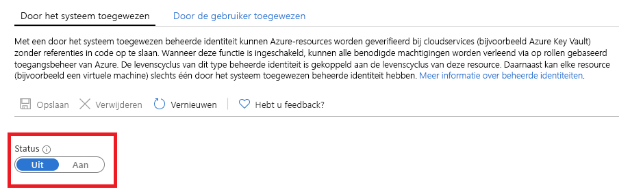

# Wat zijn beheerde identiteiten voor Azure-resources?

[!INCLUDE [preview-notice](../../../includes/active-directory-msi-preview-notice.md)]

Als cloudontwikkelaar zoekt u waarschijnlijk naar de eenvoudigste en veiligste manier om Azure-resources te openen in uw code. 

De beheerde identiteiten voor Azure-resources helpen u hiermee, omdat beheerde identiteiten:

- De noodzaak voor referenties in uw code **elimeneren**.
- De referenties automatisch **roteren**.
- Uw betrokkenheid in het beheer van identiteiten **beperken** tot een minimum.

## Hoe werkt het? 

Alle Azure-resources die beheerde identiteiten ondersteunen, kunnen tokens verkrijgen om gegevens uit te wisselen zonder referenties in code. Het proces bestaat uit de volgende stappen:

 
1.  **Inschakelen**: maak de beheerde identiteit voor de resource.
2.  **Toegang verlenen**: sta toegang tot de resource toe met Azure RBAC.
3.  **Toegang**: voer de toegestane acties uit.
4.  **Uitschakelen**: schakel de beheerde identiteit uit. 

## Typen beheerde identiteiten

Er zijn twee typen beheerde identiteit:

- Door het systeem toegewezen beheerde identiteit

- Door een gebruiker toegewezen beheerde identiteit

Voor zelfstandige Azure-resources kunt u **door het systeem toegewezen** beheerde identiteiten inschakelen. Door het systeem toegewezen identiteiten bieden de handigste ondersteuning vanuit het perspectief van identiteitsbeheer. Met slechts één klik kunt u het geautomatiseerde levenscyclusbeheer van een identiteit inschakelen voor uw resource.   

   

Hoewel door het systeem toegewezen beheerde identiteiten de handigste oplossing bieden voor zelfstandige resources, zien zaken er anders uit als u een groep Azure-resources voor dezelfde taak moet beheren. In dit scenario is het handig om handmatig een identiteit te maken en deze hoofdidentiteit toe te wijzen aan alle Azure-resources die u moet groeperen. Deze toewijzing staat bekend als **door de gebruik toegewezen** beheerde identiteit. 
  

## Ondersteunde services

U kunt beheerde identiteiten gebruiken voor Azure-resources voor verificatie bij services die ondersteuning bieden voor Azure AD-verificatie. Zie [Services die ondersteuning bieden voor beheerde identiteiten voor Azure-resources](services-support-msi.md) voor meer informatie.

## Volgende stappen

Gebruik de volgende snelstartgidsen om aan de slag te gaan met de functie Beheerde identiteiten voor Azure-resources:

* [Een door het Windows-VM-systeem toegewezen beheerde identiteit gebruiken voor toegang tot Resource Manager](tutorial-windows-vm-access-arm.md)
* [Een door het Linux-VM-systeem toegewezen beheerde identiteit gebruiken voor toegang tot Resource Manager](tutorial-linux-vm-access-arm.md)
