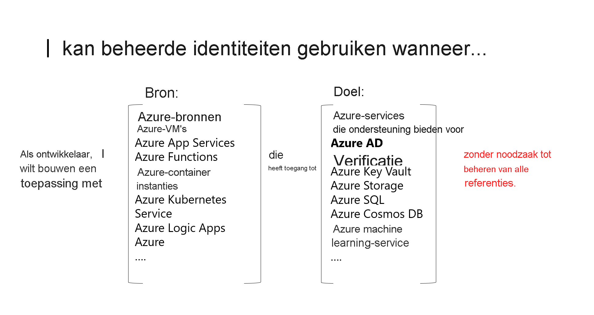

# Wat zijn beheerde identiteiten voor Azure-resources?

Een veelvoorkomende uitdaging voor ontwikkelaars is het beheer van geheimen en referenties om communicatie tussen verschillende services te beveiligen. In Azure elimineren beheerde identiteiten de noodzaak voor ontwikkelaars om referenties te beheren door een identiteit voor de Azure-resource in Azure AD op te geven en deze te gebruiken voor het verkrijgen van Azure Active Directory-tokens (Azure AD). Dit helpt ook om toegang te krijgen tot [Azure Key Vault](../../key-vault/general/overview.md), waar ontwikkelaars referenties op een veilige manier kunnen opslaan. Beheerde identiteiten voor Azure-resources lossen dit probleem op door Azure-services aan te bieden met een automatisch beheerde identiteit in Azure AD.

Waarvoor kan een beheerde identiteit worden gebruikt?

   > [!VIDEO https://www.youtube.com/embed/5lqayO_oeEo]

Hier volgen enkele van de voordelen van het gebruik van beheerde identiteiten:

- U hoeft geen referenties te beheren. Referenties zijn voor u zelfs niet toegankelijk.
- U kunt de beheerde identiteiten gebruiken voor verificatie bij alle Azure-services die ondersteuning bieden voor Azure AD-verificatie, inclusief Key Vault.
- Beheerde identiteiten kunnen worden gebruikt zonder extra kosten.

> [!NOTE]
> Beheerde identiteiten voor Azure-resources is de nieuwe naam voor de service die eerder de naam Managed Service Identity (MSI) had.

## Typen beheerde identiteiten

Er zijn twee typen beheerde identiteit:

- **Door het systeem toegewezen** Sommige Azure-services bieden u de mogelijkheid een beheerde identiteit rechtstreeks op een service-exemplaar in te schakelen. Wanneer u een door het systeem toegewezen beheerde identiteit inschakelt, wordt er een identiteit gemaakt in Azure AD die is gekoppeld aan de levenscyclus van het service-exemplaar. Als de resource wordt verwijderd, wordt de identiteit automatisch door Azure voor u verwijderd. Standaard kan alleen die Azure-resource deze identiteit gebruiken voor het aanvragen van tokens van Azure AD.
- **Door de gebruiker toegewezen** U kunt ook een beheerde identiteit maken als een zelfstandige Azure-resource. U kunt [een door de gebruiker toegewezen beheerde identiteit maken](how-to-manage-ua-identity-portal.md) en deze toewijzen aan een of meer exemplaren van een Azure-service. In het geval van door de gebruiker toegewezen beheerde identiteiten, wordt de identiteit afzonderlijk beheerd van de resources die deze gebruikt.   

  > [!VIDEO https://www.youtube.com/embed/OzqpxeD3fG0]

In de volgende tabel ziet u de verschillen tussen de twee typen beheerde identiteiten.

|  Eigenschap    | Door het systeem toegewezen beheerde identiteit | Door een gebruiker toegewezen beheerde identiteit |
|------|----------------------------------|--------------------------------|
| Maken |  Gemaakt als onderdeel van een Azure-resource (bijvoorbeeld een virtuele Azure-machine of Azure App Service) | Gemaakt als een zelfstandige Azure-resource |
| Levenscyclus | Gedeelde levenscyclus met de Azure-resource waarmee de beheerde identiteit wordt gemaakt.   Wanneer de bovenliggende resource wordt verwijderd, wordt ook de beheerde identiteit verwijderd. | Onafhankelijke levenscyclus.   Moet expliciet worden verwijderd. |
| Delen tussen Azure-resources | Kan niet worden gedeeld.   Deze kan alleen worden gekoppeld aan één Azure-resource. | Kan worden gedeeld   Dezelfde door de gebruiker toegewezen beheerde identiteit kan worden gekoppeld aan meer dan één Azure-resource. |
| Algemene scenario’s | Werkbelastingen die zijn opgenomen in één Azure-resource   Werkbelastingen waarvoor u onafhankelijke identiteiten nodig hebt.   Bijvoorbeeld een toepassing die op één virtuele machine wordt uitgevoerd | Werkbelastingen die worden uitgevoerd op meerdere resources en die één identiteit kunnen delen.   Werkbelastingen waarvoor vooraf autorisatie is vereist voor een beveiligde bron als onderdeel van een inrichtingsstroom.   Werkbelastingen waarbij resources regelmatig worden gerecycled, maar de machtigingen consistent moeten blijven.   Bijvoorbeeld een werkbelasting waarbij meerdere virtuele machines toegang moeten hebben tot dezelfde resource |

>[!IMPORTANT]
>Los van het type identiteit dat een beheerde identiteit heeft gekozen, is er een service-principal van een speciaal type dat alleen kan worden gebruikt met Azure-resources. Wanneer de beheerde identiteit wordt verwijderd, wordt de bijbehorende service-principal automatisch verwijderd.

## Hoe gebruik ik beheerde identiteiten voor Azure-resources?

## Welke Azure-services bieden ondersteuning voor de functie?

Beheerde identiteiten voor Azure-resources kunnen worden gebruikt voor verificatie bij services die ondersteuning bieden voor Azure AD-verificatie. Zie [Services die ondersteuning bieden voor beheerde identiteiten voor Azure-resources](./services-support-managed-identities.md) voor meer informatie.

## Volgende stappen

* [Een door het Windows-VM-systeem toegewezen beheerde identiteit gebruiken voor toegang tot Resource Manager](tutorial-windows-vm-access-arm.md)
* [Een door het Linux-VM-systeem toegewezen beheerde identiteit gebruiken voor toegang tot Resource Manager](tutorial-linux-vm-access-arm.md)
* [Beheerde identiteiten gebruiken voor App Service en Azure Functions](../../app-service/overview-managed-identity.md)
* [Beheerde identiteiten gebruiken met Azure Container Instances](../../container-instances/container-instances-managed-identity.md)
* [Beheerde identiteiten implementeren voor Microsoft Azure-resources](https://www.pluralsight.com/courses/microsoft-azure-resources-managed-identities-implementing).