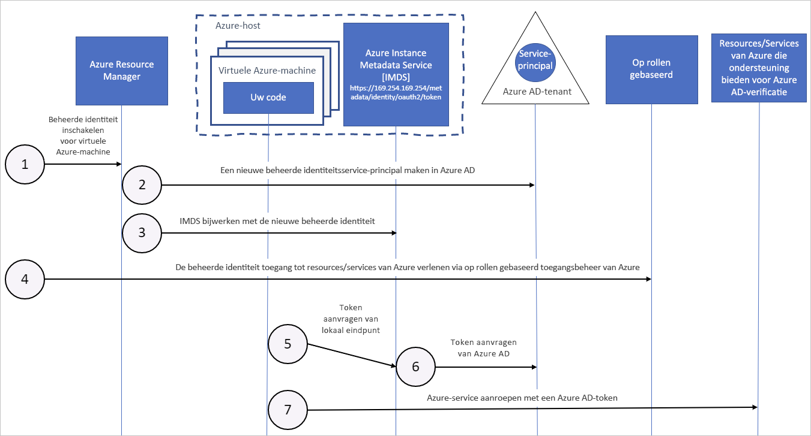

# Wat zijn beheerde identiteiten voor Azure-bronnen?

[!INCLUDE [preview-notice](../../../includes/active-directory-msi-preview-notice.md)]

Een veelvoorkomende uitdaging bij het bouwen van cloud-apps is het beheren van de referenties in uw code voor verificatie bij cloudservices. Het is belangrijk dat de referenties veilig worden bewaard. In het ideale geval worden de referenties nooit weergegeven op werkstations van ontwikkelaars en niet ingecheckt in broncodebeheer. Azure Key Vault biedt een manier voor het veilig opslaan van referenties, geheimen en andere sleutels, maar uw code moet worden geverifieerd bij Key Vault om ze op te halen.

Dit probleem wordt opgelost met de functie Beheerde identiteiten voor Azure-resources in Azure Active Directory (Azure AD). De functie biedt Azure-services met een automatisch beheerde identiteit in Azure AD. U kunt de identiteit gebruiken voor verificatie bij alle services die ondersteuning bieden voor Azure AD-verificatie, inclusief Key Vault, zonder referenties in de code.

De functie Beheerde identiteiten voor Azure-resources is gratis bij een abonnement op Azure AD. Er zijn geen extra kosten.

> [!NOTE]
> Beheerde identiteiten voor Azure-resources is de nieuwe naam voor de service die eerder de naam Managed Service Identity (MSI) had.

## Terminologie

De volgende termen worden in de beheerde identiteiten gebruikt voor de documentatieset van Azure-resources:

- **Client-id** - een unieke id die is gegenereerd door Azure AD en die tijdens de eerste inlevering is gekoppeld aan een toepassing en serviceprincipal.
- **Principal-id**: de object-id van het service-principal-object van uw beheerde identiteit. Deze wordt gebruikt om op basis van rollen toegang te verlenen tot een Azure-resource.
- **IMDS (Azure Instance Metadata Service)** - een REST-eindpunt dat toegankelijk is voor alle IaaS VM's die zijn gemaakt via Azure Resource Manager. Het eindpunt is beschikbaar via een bekend, niet-routeerbaar IP-adres (169.254.169.254) dat alleen kan worden benaderd vanuit de virtuele machine.

## Hoe werken beheerde identiteiten voor Azure-resources?

Er zijn twee typen beheerde identiteit:

- Een **door het systeem toegewezen beheerde identiteit** wordt rechtstreeks op een Azure-service-exemplaar ingeschakeld. Wanneer de identiteit is ingeschakeld, wordt een identiteit voor het service-exemplaar in de Azure AD-tenant gemaakt, dat wordt vertrouwd door het abonnement van het service-exemplaar. Nadat de identiteit is gemaakt, worden de referenties op het exemplaar ingericht. De levenscyclus van een door het systeem toegewezen identiteit is rechtstreeks gekoppeld aan het Azure-service-exemplaar waarop de identiteit is ingeschakeld. Als het exemplaar wordt verwijderd, ruimt Azure automatisch de referenties en de identiteit in Azure AD op.
- Een **door de gebruiker toegewezen beheerde identiteit** wordt gemaakt als een zelfstandige Azure-resource. Via een productieproces maakt Azure een identiteit in de Azure AD-tenant, die wordt vertrouwd door het gebruikte abonnement. Nadat de identiteit is gemaakt, kan deze worden toegewezen aan een of meer Azure-service-exemplaren. De levenscyclus van een door de gebruiker toegewezen identiteit wordt afzonderlijk beheerd van de levenscyclus van de Azure Service-exemplaren waaraan de identiteit is toegewezen.

Intern zijn beheerde identiteiten serviceprincipals van een speciaal type, die zijn vergrendeld om alleen te worden gebruikt met Azure-resources. Wanneer de beheerde identiteit wordt verwijderd, wordt de bijbehorende serviceprincipal automatisch verwijderd.
Wanneer een door de gebruiker toegewezen of systeemtoegewezen identiteit wordt gemaakt, geeft de Managed Identity Resource Provider (MSRP) een certificaat intern af aan die identiteit. 

De code kan gebruikmaken van een beheerde identiteit om toegangstokens aan te vragen voor services die ondersteuning bieden voor Azure AD-verificatie. Azure zorgt voor het implementeren van de referenties die worden gebruikt door het service-exemplaar. 

## Referentierotatie
De rotatie van referenties wordt beheerd door de resourceprovider die de Azure-bron host. De standaardrotatie van de referentie vindt elke 46 dagen plaats. Het is aan de resourceprovider om nieuwe referenties op te vragen, zodat de resourceprovider langer dan 46 dagen kan wachten.

In het volgende diagram ziet u hoe beheerde service-identiteiten samenwerken met virtuele machines (VM's) van Azure:

|  Eigenschap    | Door het systeem toegewezen beheerde identiteit | Door een gebruiker toegewezen beheerde identiteit |
|------|----------------------------------|--------------------------------|
| Maken |  Gemaakt als onderdeel van een Azure-bron (bijvoorbeeld een Azure-virtuele machine of Azure App Service) | Gemaakt als een zelfstandige Azure-bron |
| Levenscyclus | Gedeelde levenscyclus met de Azure-bron waarmee de beheerde identiteit is gemaakt.   Wanneer de bovenliggende bron wordt verwijderd, wordt de beheerde identiteit ook verwijderd. | Onafhankelijke levenscyclus.   Moet expliciet worden verwijderd. |
| Delen tussen Azure-bronnen | Kan niet gedeeld worden.   Het kan alleen worden gekoppeld aan één Azure-bron. | Kan worden gedeeld   Dezelfde door de gebruiker toegewezen beheerde identiteit kan worden gekoppeld aan meer dan één Azure-bron. |
| Algemene scenario’s | Workloads die zich in één Azure-bron bevinden   Workloads waarvoor je onafhankelijke identiteiten nodig hebt.   Een toepassing die bijvoorbeeld op één virtuele machine wordt uitgevoerd | Workloads die op meerdere resources worden uitgevoerd en die één identiteit kunnen delen.   Workloads die vooraf moeten worden autorisatie voor een beveiligde resource als onderdeel van een inrichtingsstroom.   Workloads waarbij resources vaak worden gerecycled, maar machtigingen moeten consistent blijven.   Bijvoorbeeld een werkbelasting waarbij meerdere virtuele machines toegang moeten krijgen tot dezelfde resource |

### Hoe een door het systeem toegewezen beheerde identiteit samenwerkt met een Azure-VM

1. Azure Resource Manager ontvangt een aanvraag voor het inschakelen van de door het systeem toegewezen beheerde identiteit op een VM.

2. Azure Resource Manager maakt een service-principal in Azure AD voor de identiteit van de VM. De service-principal wordt gemaakt in de Azure AD-tenant die wordt vertrouwd door het abonnement.

3. Azure Resource Manager configureert de identiteit van de VM door het identiteitseindpunt van de Azure Instance Metadata Service bij te werken met de serviceprincipalclient-id en het certificaat.

4. Als de VM een identiteit heeft, gebruikt u de informatie van de service-principal om de VM toegang te verlenen tot Azure-resources. Voor het aanroepen van Azure Resource Manager gebruikt u op rollen gebaseerd toegangsbeheer (RBAC) in Azure AD om de juiste rol aan de VM-service-principal toe te wijzen. Als u Key Vault wilt aanroepen, geeft u de code toegang tot het specifieke geheim of de specifieke sleutel in Key Vault.

5. Uw code die op de VM wordt uitgevoerd, kan een token aanvragen bij het eindpunt van de Azure Instance Metadata-service, dat alleen toegankelijk is vanuit de VM:`http://169.254.169.254/metadata/identity/oauth2/token`
    - De resourceparameter geeft de service op waarnaar het token wordt verzonden. Gebruik `resource=https://management.azure.com/` om bij Azure Resource Manager te verificatie uit te voeren.
    - De API-versieparameter specificeert de IMDS-versie, gebruik api-version=2018-02-01 of hoger.

6. Er wordt een aanroep uitgevoerd naar Azure AD om een toegangstoken aan te vragen (zoals beschreven in stap 5) met behulp van de client-id en het certificaat dat in stap 3 is geconfigureerd. Azure AD retourneert een JWT-toegangstoken (JSON Web Token).

7. Uw code verzendt het toegangstoken bij een aanroep naar een service die Azure AD-verificatie ondersteunt.

### Hoe een door een gebruiker toegewezen beheerde identiteit samenwerkt met een Azure-VM

1. Azure Resource Manager ontvangt een aanvraag voor het maken van een door de gebruiker toegewezen beheerde identiteit.

2. Azure Resource Manager maakt een service-principal in Azure AD voor de door de gebruiker toegewezen beheerde identiteit. De service-principal wordt gemaakt in de Azure AD-tenant die wordt vertrouwd door het abonnement.

3. Azure Resource Manager ontvangt een verzoek om de door de gebruiker toegewezen beheerde identiteit op een vm te configureren en het endpoint van de Azure Instance Metadata Service-identiteit bij te werken met de door de gebruiker toegewezen hoofdclient-id en -certificaat met beheerde identiteitsservice.

4. Nadat de door de gebruiker toegewezen beheerde identiteit is gemaakt, gebruikt u de informatie van de service-principal om de identiteit toegang te verlenen tot Azure-resources. Voor het aanroepen van Azure Resource Manager gebruikt u RBAC in Azure AD om de juiste rol aan de service-principal van de door de gebruiker toegewezen identiteit toe te wijzen. Als u Key Vault wilt aanroepen, geeft u de code toegang tot het specifieke geheim of de specifieke sleutel in Key Vault.

   > [!Note]
   > U kunt deze stap ook vóór stap 3 uitvoeren.

5. Uw code die op de VM wordt uitgevoerd, kan een token aanvragen bij het identiteitseindpunt van de Azure Instance Metadata Service, die alleen toegankelijk is vanuit de VM:`http://169.254.169.254/metadata/identity/oauth2/token`
    - De resourceparameter geeft de service op waarnaar het token wordt verzonden. Gebruik `resource=https://management.azure.com/` om bij Azure Resource Manager te verificatie uit te voeren.
    - De client-id-parameter bevat de identiteit waarvoor het token wordt aangevraagd. Deze waarde is vereist om ambiguïteit op te heffen wanneer meer dan een door de gebruiker toegewezen identiteit aanwezig is op één VM.
    - De parameter voor de API-versie geeft de versie van Azure Instance Metadata Service op. Gebruik `api-version=2018-02-01` of hoger.

6. Er wordt een aanroep uitgevoerd naar Azure AD om een toegangstoken aan te vragen (zoals beschreven in stap 5) met behulp van de client-id en het certificaat dat in stap 3 is geconfigureerd. Azure AD retourneert een JWT-toegangstoken (JSON Web Token).
7. Uw code verzendt het toegangstoken bij een aanroep naar een service die Azure AD-verificatie ondersteunt.

## Hoe gebruik ik beheerde identiteiten voor Azure-resources?

In deze zelfstudies leert u hoe u gebruik kunt maken van beheerde identiteiten om toegang te krijgen tot verschillende Azure-resources.

> [!NOTE]
> Bekijk de cursus [Beheerde identiteiten implementeren voor Microsoft Azure-resources](https://www.pluralsight.com/courses/microsoft-azure-resources-managed-identities-implementing) voor meer informatie over beheerde identiteiten, inclusief een gedetailleerd video-overzicht van verschillende ondersteunde scenario’s.

Informatie over het gebruik van een beheerde identiteit met een Windows-VM:

* [Toegang tot Azure Data Lake Store](tutorial-windows-vm-access-datalake.md)
* [Toegang tot Azure Resource Manager](tutorial-windows-vm-access-arm.md)
* [Toegang tot Azure SQL](tutorial-windows-vm-access-sql.md)
* [Toegang tot Azure Storage met behulp van een toegangssleutel](tutorial-vm-windows-access-storage.md)
* [Toegang tot Azure Storage met behulp van handtekeningen voor gedeelde toegang](tutorial-windows-vm-access-storage-sas.md)
* [Toegang tot een niet-Azure-resource met Azure Key Vault](tutorial-windows-vm-access-nonaad.md)

Informatie over het gebruik van een beheerde identiteit met een Linux-VM:

* [Toegang tot Azure Container Registry](../../container-registry/container-registry-authentication-managed-identity.md)
* [Toegang tot Azure Data Lake Store](tutorial-linux-vm-access-datalake.md)
* [Toegang tot Azure Resource Manager](tutorial-linux-vm-access-arm.md)
* [Toegang tot Azure Storage met behulp van een toegangssleutel](tutorial-linux-vm-access-storage.md)
* [Toegang tot Azure Storage met behulp van handtekeningen voor gedeelde toegang](tutorial-linux-vm-access-storage-sas.md)
* [Toegang tot een niet-Azure-resource met Azure Key Vault](tutorial-linux-vm-access-nonaad.md)

Informatie over het gebruik van een beheerde identiteit met andere Azure-services:

* [Azure App Service](/azure/app-service/overview-managed-identity)
* [Azure API Management](../../api-management/api-management-howto-use-managed-service-identity.md)
* [Azure Container Instances](../../container-instances/container-instances-managed-identity.md)
* [Azure Container Registry Tasks](../../container-registry/container-registry-tasks-authentication-managed-identity.md)
* [Azure Event Hubs](../../event-hubs/authenticate-managed-identity.md)
* [Azure Functions](/azure/app-service/overview-managed-identity)
* [Azure Kubernetes Service](/azure/aks/use-managed-identity)
* [Azure Logic Apps](/azure/logic-apps/create-managed-service-identity)
* [Azure Service Bus](../../service-bus-messaging/service-bus-managed-service-identity.md)
* [Azure Data Factory](../../data-factory/data-factory-service-identity.md)

## Welke Azure-services bieden ondersteuning voor de functie?

Beheerde identiteiten voor Azure-resources kunnen worden gebruikt voor verificatie bij services die ondersteuning bieden voor Azure AD-verificatie. Zie [Services die ondersteuning bieden voor beheerde identiteiten voor Azure-resources](services-support-msi.md) voor meer informatie.

## Volgende stappen

Gebruik de volgende snelstartgidsen om aan de slag te gaan met de functie Beheerde identiteiten voor Azure-resources:

* [Een door het Windows-VM-systeem toegewezen beheerde identiteit gebruiken voor toegang tot Resource Manager](tutorial-windows-vm-access-arm.md)
* [Een door het Linux-VM-systeem toegewezen beheerde identiteit gebruiken voor toegang tot Resource Manager](tutorial-linux-vm-access-arm.md)
