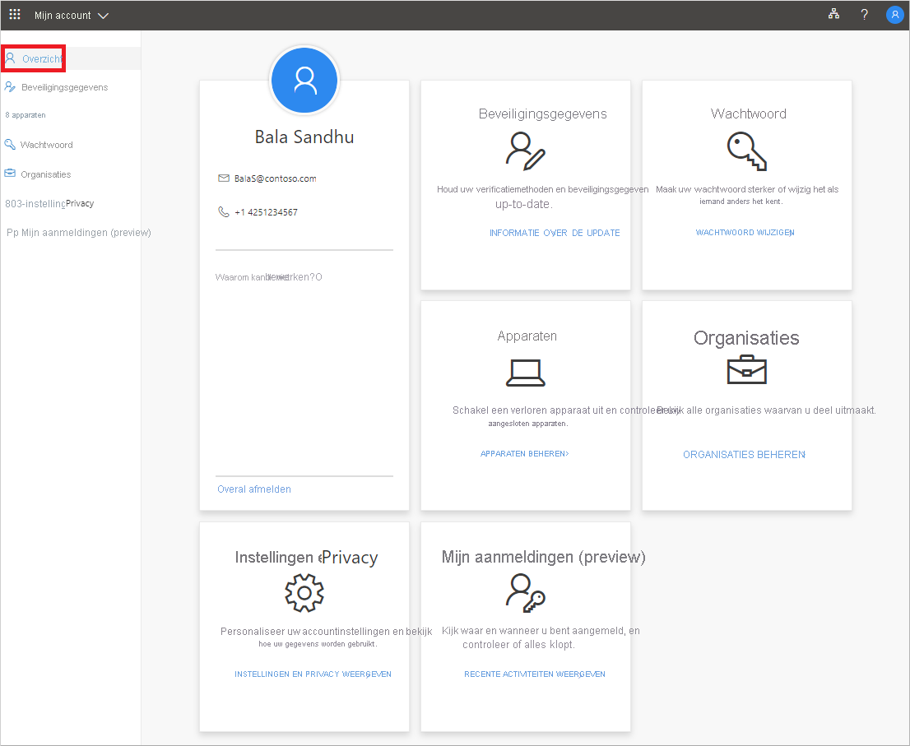

# Wat is de portal Mijn account?

De **mijn-accountportal** helpt u uw werk- of schoolaccount te beheren door uw beveiligingsgegevens in te stellen en te beheren, uw verbonden organisaties en apparaten te beheren en te bekijken hoe uw organisatie uw gegevens gebruikt.

U naar de mijnhttps://myprofile.microsoft.com) **accountportal** (, vanuit de huidige versie van een van de volgende browsers:

- Chrome
- Microsoft Edge
- Safari
- Firefox
- Internet Explorer 11

>[!Important]
>Dit artikel is bedoeld voor gebruikers die naar de mijn accountportal proberen te gaan om hun beveiligingsgegevens, apparaatgegevens, wachtwoord, verbonden organisaties, privacy of eerdere aanmeldingsgegevens bij te werken. Als u een beheerder bent die op zoek is naar informatie over het inschakelen van verificatie en andere Azure AD-functies (Azure Directory) voor uw werknemers en andere toepassingen, raadpleegt u de [Azure AD-documentatie voor beheerders](https://docs.microsoft.com/azure/active-directory/).

## Volgende stappen

- Selecteer om uw [beveiligingsgegevens](user-help-security-info-overview.md) weer te geven of te beheren

- Uw verbonden [apparaten](my-account-portal-devices-page.md) weergeven of beheren

- Uw [organisaties](my-account-portal-organizations-page.md) weergeven en beheren

- Uw [aanmeldingsactiviteit weergeven](my-account-portal-sign-ins-page.md)

- Bekijk hoe uw organisatie [uw privacygerelateerde gegevens gebruikt](my-account-portal-privacy-page.md)

## Gerelateerde Microsoft Office-inhoud

- [Aanmelden om uw Office-product te beheren](https://support.office.com/article/sign-in-to-manage-your-office-product-959ac957-8d37-4ae4-b1b6-d6e4874e013f)

- [Ga naar de pagina **Office Mijn account**](https://portal.office.com/account/)

- [Ga naar de pagina Office **Mijn installaties**](https://portal.office.com/account/#installs)

- [Ga naar de pagina **Office-abonnementen**](https://portal.office.com/account/#subscriptions)