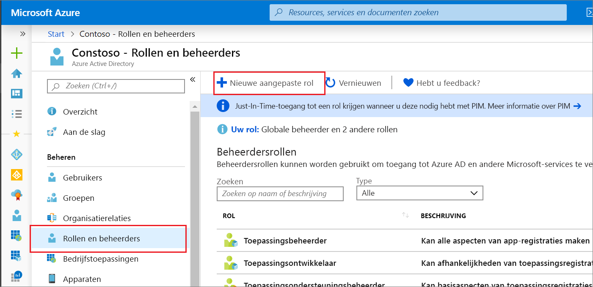

# <a name="create-and-assign-a-custom-role-in-azure-active-directory"></a>Een aangepaste rol maken en toewijzen in Azure Active Directory

In dit artikel wordt beschreven hoe u nieuwe aangepaste rollen maakt in Azure Active Directory (Azure AD). Zie het overzicht van [aangepaste rollen](roles-custom-overview.md)voor de basisbeginselen van aangepaste rollen. De rol kan alleen worden toegewezen aan het bereik op directoryniveau of alleen op een app-registratiebronbereik.

Aangepaste rollen kunnen worden gemaakt op het tabblad [Rollen en beheerders](https://portal.azure.com/#blade/Microsoft_AAD_IAM/ActiveDirectoryMenuBlade/RolesAndAdministrators) op de overzichtspagina van Azure AD.

## <a name="create-a-role-in-the-azure-portal"></a>Een rol maken in de Azure-portal

### <a name="create-a-new-custom-role-to-grant-access-to-manage-app-registrations"></a>Een nieuwe aangepaste rol maken om toegang te verlenen voor app-registraties

1. Meld u aan bij het [Azure AD-beheercentrum](https://aad.portal.azure.com) met bevoegde rolbeheerder of machtigingen voor globale beheerders in de Azure AD-organisatie.
1. Selecteer **Azure Active Directory** > **Rollen en beheerders** > **Nieuwe aangepaste rol**.

   

1. Geef op het tabblad **Basisbeginselen** een naam en beschrijving voor de rol op en klik op **Volgende**.

   

1. Selecteer op het tabblad **Machtigingen** de machtigingen die nodig zijn om basiseigenschappen en referentie-eigenschappen van app-registraties te beheren. Zie Subtypen en machtigingen voor [toepassingsregistratie in Azure Active Directory](./roles-custom-available-permissions.md)voor een gedetailleerde beschrijving van elke machtiging.
   1. Voer eerst 'referenties' in de zoekbalk `microsoft.directory/applications/credentials/update` in en selecteer de machtiging.

      

   1. Voer vervolgens 'basic' in de zoekbalk in, selecteer de `microsoft.directory/applications/basic/update` machtiging en klik op **Volgende**.
1. Controleer op het tabblad **Controleren + maken** de machtigingen en selecteer **Maken**.

Uw aangepaste rol wordt weergegeven in de lijst met beschikbare rollen die moeten worden toegewezen.

## <a name="create-a-role-using-powershell"></a>Een rol maken met PowerShell

### <a name="prepare-powershell"></a>PowerShell voorbereiden

Eerst moet u [de PowerShell-module azure AD Preview downloaden.](https://www.powershellgallery.com/packages/AzureADPreview)

Als u de Azure AD PowerShell-module wilt installeren, gebruikt u de volgende opdrachten:

``` PowerShell
install-module azureadpreview
import-module azureadpreview
```

Als u wilt controleren of de module klaar is voor gebruik, gebruikt u de volgende opdracht:

``` PowerShell
get-module azureadpreview
  ModuleType Version      Name                         ExportedCommands
  ---------- ---------    ----                         ----------------
  Binary     2.0.2.31     azuread                      {Add-AzureADAdministrati...}
```

### <a name="create-the-custom-role"></a>De aangepaste rol maken

Maak een nieuwe rol met het volgende PowerShell-script:

``` PowerShell
# Basic role information
$displayName = "Application Support Administrator"
$description = "Can manage basic aspects of application registrations."
$templateId = (New-Guid).Guid
 
# Set of permissions to grant
$allowedResourceAction =
@(
    "microsoft.directory/applications/basic/update",
    "microsoft.directory/applications/credentials/update"
)
$rolePermissions = @{'allowedResourceActions'= $allowedResourceAction}
 
# Create new custom admin role
$customAdmin = New-AzureADMSRoleDefinition -RolePermissions $rolePermissions -DisplayName $displayName -Description $description -TemplateId $templateId -IsEnabled $true
```

### <a name="assign-the-custom-role-using-azure-ad-powershell"></a>De aangepaste rol toewijzen met Azure AD PowerShell

Wijs de rol toe met het onderstaande PowerShell-script:

``` PowerShell
# Get the user and role definition you want to link
$user = Get-AzureADUser -Filter "userPrincipalName eq 'cburl@f128.info'"
$roleDefinition = Get-AzureADMSRoleDefinition -Filter "displayName eq 'Application Support Administrator'"

# Get app registration and construct resource scope for assignment.
$appRegistration = Get-AzureADApplication -Filter "displayName eq 'f/128 Filter Photos'"
$resourceScope = '/' + $appRegistration.objectId

# Create a scoped role assignment
$roleAssignment = New-AzureADMSRoleAssignment -ResourceScope $resourceScope -RoleDefinitionId $roleDefinition.Id -PrincipalId $user.objectId
```

## <a name="create-a-role-with-graph-api"></a>Een rol maken met Graph API

1. Maak de roldefinitie.

    HTTP-verzoek om een aangepaste roldefinitie te maken.

    POST

    ``` HTTP
    https://graph.microsoft.com/beta/roleManagement/directory/roleDefinitions
    ```

    Hoofdtekst

    ``` HTTP
   {
       "description": "Can manage basic aspects of application registrations.",
       "displayName": "Application Support Administrator",
       "isEnabled": true,
       "templateId": "<GUID>",
       "rolePermissions": [
           {
               "allowedResourceActions": [
                   "microsoft.directory/applications/basic/update",
                   "microsoft.directory/applications/credentials/update"
               ]
           }
       ]
   }
    ```

1. Maak de roltoewijzing.

    HTTP-verzoek om een aangepaste roldefinitie te maken.

    POST

    ``` HTTP
    https://graph.microsoft.com/beta/roleManagement/directory/roleAssignments
    ```

    Hoofdtekst

    ``` HTTP
   {
       "principalId":"<GUID OF USER>",
       "roleDefinitionId":"<GUID OF ROLE DEFINITION>",
       "resourceScope":"/<GUID OF APPLICATION REGISTRATION>"
   }
    ```

## <a name="assign-a-custom-role-scoped-to-a-resource"></a>Een aangepaste rol toewijzen aan een resource

Net als ingebouwde rollen worden aangepaste rollen standaard toegewezen aan het standaard bereik voor de hele organisatie om toegangsmachtigingen toe te kennen voor alle app-registraties in uw organisatie. Maar in tegenstelling tot ingebouwde rollen, kunnen aangepaste rollen ook worden toegewezen aan het bereik van één Azure AD-bron. Hiermee u de gebruiker de toestemming geven om referenties en basiseigenschappen van één app bij te werken zonder dat u een tweede aangepaste rol hoeft te maken.

1. Meld u aan bij het [Azure AD-beheercentrum](https://aad.portal.azure.com) met machtigingen voor toepassingsontwikkelaars in de Azure AD-organisatie.
1. Selecteer **App-registraties**.
1. Selecteer de app-registratie waaraan u toegang verleent om te beheren. Mogelijk moet u **Alle toepassingen** selecteren om de volledige lijst met app-registraties in uw Azure AD-organisatie te bekijken.

    

1. Selecteer rollen en **beheerders**in de app-registratie . Als u er nog geen hebt gemaakt, staan de instructies in de [vorige procedure.](#create-a-new-custom-role-to-grant-access-to-manage-app-registrations)

1. Selecteer de rol die u wilt openen op de pagina **Toewijzingen.**
1. Selecteer **Toewijzing toevoegen** om een gebruiker toe te voegen. De gebruiker krijgt alle machtigingen voor alleen de geselecteerde app-registratie.

## <a name="next-steps"></a>Volgende stappen

- Voel je vrij om met ons te delen op het [Azure AD-forum voor beheerfuncties](https://feedback.azure.com/forums/169401-azure-active-directory?category_id=166032).
- Zie [Beheerdersrollen toewijzen](directory-assign-admin-roles.md)voor meer informatie over rollen en toewijzing van beheerders.
- Zie een vergelijking van [standaardmachtigingen voor gasten en leden](../fundamentals/users-default-permissions.md)voor standaardgebruikersmachtigingen voor standaardgebruikers.
