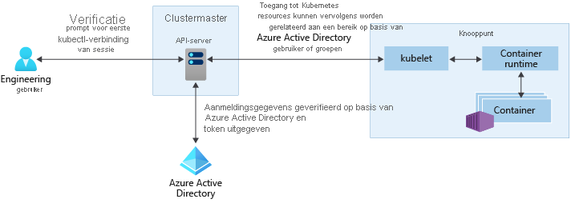

# Toegangs- en identiteitsopties voor Azure Kubernetes Service (AKS)

Er zijn verschillende manieren om te verifiëren, toegang te beheren/te controleren en Kubernetes-clusters te beveiligen. Met behulp van Kubernetes op basis van rollen (RBAC) kunt u gebruikers, groepen en service accounts toegang verlenen tot de resources die ze nodig hebben. Met Azure Kubernetes service (AKS) kunt u de structuur van beveiliging en machtigingen verder verbeteren met behulp van Azure Active Directory en Azure RBAC. Op deze manier kunt u uw cluster toegang beveiligen en alleen de mini maal vereiste machtigingen geven aan ontwikkel aars en Opera tors.

In dit artikel worden de belangrijkste concepten geïntroduceerd die u helpen bij het verifiëren en toewijzen van machtigingen in AKS:

- [Kubernetes voor op rollen gebaseerde toegangs beheer (RBAC)](#kubernetes-role-based-access-controls-rbac)
  - [Rollen en ClusterRoles](#roles-and-clusterroles)
  - [RoleBindings en ClusterRoleBindings](#rolebindings-and-clusterrolebindings) 
  - [Kubernetes-service accounts](#kubernetes-service-accounts)
- [Integratie van Azure Active Directory](#azure-active-directory-integration)
- [Azure RBAC](#azure-role-based-access-controls-rbac)
  - [Azure RBAC voor het machtigen van toegang tot de AKS-resource](#azure-rbac-to-authorize-access-to-the-aks-resource)
  - [Azure RBAC voor Kubernetes-autorisatie (preview-versie)](#azure-rbac-for-kubernetes-authorization-preview)

## Kubernetes voor op rollen gebaseerde toegangs beheer (RBAC)

Kubernetes maakt gebruik van op rollen gebaseerde toegangs beheer (RBAC) om nauw keurige filters te bieden voor de acties die gebruikers kunnen uitvoeren. Met dit besturings systeem kunt u gebruikers of groepen gebruikers toewijzen, machtigingen geven om resources te maken of te wijzigen, of logboeken van actieve werk belastingen van toepassingen bekijken. Deze machtigingen kunnen worden ingesteld op een enkele naam ruimte of worden toegestaan in het hele AKS-cluster. Met Kubernetes RBAC maakt u *rollen* om machtigingen te definiëren en wijst u deze rollen vervolgens toe aan gebruikers met *functie bindingen*.

Zie [using RBAC Authorization][kubernetes-rbac](Engelstalig) voor meer informatie.

### Rollen en ClusterRoles

Voordat u machtigingen toewijst aan gebruikers met Kubernetes RBAC, definieert u eerst die machtigingen als een *rol*. Kubernetes-rollen *verlenen* machtigingen. Er is geen machtiging voor *weigeren* .

Rollen worden gebruikt voor het verlenen van machtigingen binnen een naam ruimte. Als u machtigingen wilt verlenen voor het hele cluster of als u cluster bronnen buiten een bepaalde naam ruimte wilt toewijzen, kunt u in plaats daarvan *ClusterRoles*gebruiken.

Een ClusterRole werkt op dezelfde manier om machtigingen te verlenen aan resources, maar kan worden toegepast op resources in het hele cluster, niet op een specifieke naam ruimte.

### RoleBindings en ClusterRoleBindings

Zodra rollen zijn gedefinieerd om machtigingen te verlenen voor bronnen, wijst u deze Kubernetes RBAC-machtigingen toe aan een *RoleBinding*. Als uw AKS-cluster wordt [geïntegreerd met Azure Active Directory](#azure-active-directory-integration), zijn bindingen de manier waarop deze Azure AD-gebruikers machtigingen krijgen voor het uitvoeren van acties in het cluster. Zie How [to Control Access to cluster resources using access control and Azure Active Directory Identities](azure-ad-rbac.md)(Engelstalig) voor meer informatie.

Roltoewijzingen worden gebruikt voor het toewijzen van rollen voor een bepaalde naam ruimte. Met deze benadering kunt u een enkel AKS-cluster logisch scheiden, met gebruikers die alleen toegang hebben tot de toepassings resources in hun toegewezen naam ruimte. Als u rollen moet binden in het hele cluster of als u cluster bronnen buiten een bepaalde naam ruimte wilt koppelen, kunt u in plaats daarvan *ClusterRoleBindings*gebruiken.

Een ClusterRoleBinding werkt op dezelfde manier om rollen aan gebruikers te binden, maar kan worden toegepast op resources in het hele cluster, niet op een specifieke naam ruimte. Met deze aanpak kunt u beheerders of ondersteunings technici toegang verlenen tot alle resources in het AKS-cluster.

> [!NOTE]
> Alle cluster acties die door micro soft/AKS worden uitgevoerd, worden gemaakt met toestemming van de gebruiker onder een ingebouwde Kubernetes-rol `aks-service` en ingebouwde functie binding `aks-service-rolebinding` . Deze rol stelt AKS in staat om problemen met het cluster op te lossen en te diagnosticeren, maar kan geen machtigingen wijzigen of rollen of roltoewijzingen maken, of andere acties met hoge bevoegdheden. Rollen toegang is alleen ingeschakeld onder actieve ondersteunings tickets met Just-in-time-toegang. Meer informatie over [AKS-ondersteunings beleid](support-policies.md).

### Kubernetes-service accounts

Een van de primaire gebruikers typen in Kubernetes is een *Service account*. Er bestaat een service account in en wordt beheerd door de Kubernetes-API. De referenties voor service accounts worden opgeslagen als Kubernetes geheimen, waardoor ze kunnen worden gebruikt door geautoriseerde peul om te communiceren met de API-server. De meeste API-aanvragen bieden een verificatie token voor een service account of een normaal gebruikers account.

Normale gebruikers accounts staan meer traditionele toegang toe voor beheerders of ontwikkel aars van personen, niet alleen services en processen. Kubernetes zelf biedt geen oplossing voor identiteits beheer waar reguliere gebruikers accounts en wacht woorden worden opgeslagen. In plaats daarvan kunnen externe identiteits oplossingen worden geïntegreerd in Kubernetes. Voor AKS-clusters is deze geïntegreerde identiteits oplossing Azure Active Directory.

Zie [Kubernetes-verificatie][kubernetes-authentication]voor meer informatie over de identiteits opties in Kubernetes.

## Integratie van Azure Active Directory

De beveiliging van AKS-clusters kan worden uitgebreid met de integratie van Azure Active Directory (AD). Azure AD is gebouwd op tien tallen bedrijfs identiteits beheer en is een multi tenant-, Cloud-en identiteits beheer service die belang rijke Directory Services, Toegangs beheer voor toepassingen en identiteits beveiliging combineert. Met Azure AD kunt u on-premises identiteiten integreren in AKS-clusters om één bron te bieden voor account beheer en beveiliging.

Met Azure AD geïntegreerde AKS-clusters kunt u gebruikers of groepen toegang verlenen tot Kubernetes-resources binnen een naam ruimte of in het cluster. `kubectl`Een gebruiker kan een configuratie context verkrijgen door de opdracht [AZ AKS Get-credentials][az-aks-get-credentials] uit te voeren. Wanneer een gebruiker vervolgens met het AKS-cluster communiceert met `kubectl` , wordt u gevraagd zich aan te melden met hun Azure AD-referenties. Deze benadering biedt één bron voor gebruikers account beheer en wachtwoord referenties. De gebruiker heeft alleen toegang tot de resources zoals gedefinieerd door de Cluster beheerder.

Azure AD-verificatie wordt geleverd voor AKS-clusters met OpenID Connect Connect. OpenID Connect Connect is een id-laag die boven op het OAuth 2,0-protocol is gebouwd. Voor meer informatie over OpenID Connect Connect raadpleegt u de [Open-ID Connect-documentatie][openid-connect]. Vanuit het Kubernetes-cluster wordt [webhook-token verificatie][webhook-token-docs] gebruikt om verificatie tokens te verifiëren. Webhook-token verificatie wordt geconfigureerd en beheerd als onderdeel van het AKS-cluster.

### Webhook en API-server

Zoals in de bovenstaande afbeelding wordt weer gegeven, roept de API-server de AKS-webhookserver aan en voert de volgende stappen uit:

1. De Azure AD-client toepassing wordt door kubectl gebruikt voor het aanmelden van gebruikers met [OAuth 2,0-autorisatie subsidie stroom](../active-directory/develop/v2-oauth2-device-code.md).
2. Azure AD biedt een access_token, id_token en een refresh_token.
3. De gebruiker doet een aanvraag om kubectl te maken met een access_token van kubeconfig.
4. Kubectl stuurt de access_token naar APIServer.
5. De API-server is geconfigureerd met de auth webhook-server om validatie uit te voeren.
6. De webhookserver voor verificatie bevestigt dat de JSON Web Token hand tekening geldig is door de open bare Azure AD-ondertekeningssleutel te controleren.
7. De server toepassing maakt gebruik van door de gebruiker ingevoerde referenties voor het opvragen van groepslid maatschappen van de aangemelde gebruiker vanuit de MS Graph API.
8. Er wordt een antwoord verzonden naar de APIServer met gebruikers informatie, zoals de claim van de user principal name (UPN) van het toegangs token en het groepslid maatschap van de gebruiker op basis van de object-ID.
9. De API voert een autorisatie besluit uit op basis van de Kubernetes Role/RoleBinding.
10. Na de autorisatie retourneert de API-server een reactie op kubectl.
11. Kubectl geeft feedback aan de gebruiker.
 
**Meer informatie over het integreren van AKS [met Aad.](managed-aad.md)**

## Op rollen gebaseerd toegangs beheer (RBAC) van Azure

Azure RBAC is een autorisatie systeem dat is gebaseerd op [Azure Resource Manager](../azure-resource-manager/management/overview.md) dat een nauw keurig toegangs beheer van Azure-resources biedt.

 Azure RBAC is ontworpen om te werken aan resources binnen uw Azure-abonnement terwijl Kubernetes RBAC is ontworpen voor het werken met Kubernetes-resources binnen uw AKS-cluster. 

Met Azure RBAC maakt u een *roldefinitie* waarin de machtigingen worden beschreven die moeten worden toegepast. Vervolgens wordt aan een gebruiker of groep deze roldefinitie toegewezen via een *roltoewijzing* voor een bepaald *bereik*. Dit kan een afzonderlijke resource, een resource groep of het hele abonnement zijn.

Zie [Wat is Azure Role-based Access Control (Azure RBAC)?][azure-rbac] voor meer informatie.

Er zijn twee toegangs niveaus nodig om een AKS-cluster volledig te kunnen gebruiken: 
1. [Open de AKS-resource in uw Azure-abonnement](#azure-rbac-to-authorize-access-to-the-aks-resource). Met dit proces kunt u bepalen of u uw cluster wilt schalen of upgraden met behulp van de AKS-Api's en hoe u uw kubeconfig ophaalt.
2. Toegang tot de Kubernetes-API. Deze toegang wordt bepaald door [KUBERNETES RBAC](#kubernetes-role-based-access-controls-rbac) (traditioneel) of door [Azure RBAC te integreren met AKS voor Kubernetes-autorisatie](#azure-rbac-for-kubernetes-authorization-preview)

### Azure RBAC voor het machtigen van toegang tot de AKS-resource

Met Azure RBAC kunt u uw gebruikers (of identiteiten) voorzien van gedetailleerde toegang tot AKS-resources in een of meer abonnementen. U kunt bijvoorbeeld de rol van de [Azure Kubernetes-service Inzender](../role-based-access-control/built-in-roles.md#azure-kubernetes-service-contributor-role) hebben waarmee u acties kunt uitvoeren, zoals het schalen en upgraden van uw cluster. Hoewel een andere gebruiker de beheer [functie van de Azure Kubernetes-service cluster](../role-based-access-control/built-in-roles.md#azure-kubernetes-service-cluster-admin-role) kan hebben die alleen toestemming geeft om de beheerder kubeconfig te halen.

U kunt uw gebruiker ook de rol algemeen [Inzender](../role-based-access-control/built-in-roles.md#contributor) geven, die de bovenstaande machtigingen bevat en elke actie die mogelijk is voor de AKS-resource, met uitzonde ring van het beheren van machtigingen zelf.

Meer informatie over het gebruik van Azure RBAC voor het beveiligen van de toegang tot het kubeconfig-bestand dat [hier](control-kubeconfig-access.md)toegang geeft tot de KUBERNETES-API.

### Azure RBAC voor Kubernetes-autorisatie (preview-versie)

Met de integratie van Azure RBAC maakt AKS gebruik van een Kubernetes Authorization webhook-server, zodat u machtigingen en toewijzingen van Azure AD-geïntegreerde K8s-cluster resources kunt beheren met Azure RBAC-roldefinitie en roltoewijzingen.

Zoals in het bovenstaande diagram wordt weer gegeven, volgt u bij het gebruik van de Azure RBAC-integratie alle aanvragen voor de Kubernetes-API dezelfde verificatie stroom als wordt uitgelegd in de [sectie Azure Active Integration](#azure-active-directory-integration). 

Maar daarna wordt het verzoek door Azure in plaats van Kubernetes RBAC voor autorisatie gebruikt, op voor waarde dat de identiteit die de aanvraag heeft ingediend in AAD voor komt. Als de identiteit niet bestaat in AAD, bijvoorbeeld een Kubernetes-service account, is de Azure RBAC niet in en de normale Kubernetes RBAC.

In dit scenario kunt u gebruikers een van de vier ingebouwde rollen geven of aangepaste rollen maken zoals u zou doen met Kubernetes-rollen, maar in dit geval de Azure RBAC-mechanismen en Api's gebruiken. 

Met deze functie kunt u bijvoorbeeld niet alleen gebruikers machtigingen geven voor de AKS-resource in abonnementen, maar ze instellen en de rol en machtigingen geven die ze zullen hebben in elk van deze clusters die de toegang tot de Kubernetes-API beheren. U kunt bijvoorbeeld de `Azure Kubernetes Service RBAC Viewer` rol voor het abonnements bereik toekennen en de ontvanger kan alle Kubernetes-objecten van alle clusters weer geven, maar niet wijzigen.

#### Ingebouwde rollen

AKS biedt de volgende vier ingebouwde rollen. Ze zijn vergelijkbaar met de [ingebouwde rollen](https://kubernetes.io/docs/reference/access-authn-authz/rbac/#user-facing-roles) van de Kubernetes, maar met een paar verschillen als ondersteunende CRDs. Zie [hier](../role-based-access-control/built-in-roles.md)voor een volledige lijst met acties die zijn toegestaan door elke ingebouwde rol.

| Rol                                | Beschrijving  |
|-------------------------------------|--------------|
| RBAC-viewer voor Azure Kubernetes service  | Hiermee staat u alleen-lezen toegang toe om de meeste objecten in een naam ruimte weer te geven. Het weer geven van functies of functie bindingen is niet toegestaan. Deze rol staat weer gave niet toe `Secrets` , omdat het lezen van de inhoud van geheimen toegang biedt tot `ServiceAccount` referenties in de naam ruimte, waardoor er API-toegang zou kunnen worden toegestaan `ServiceAccount` in de naam ruimte (een vorm van bevoegdheden escalatie)  |
| RBAC-schrijver van Azure Kubernetes service | Hiermee wordt lees-/schrijftoegang tot de meeste objecten in een naam ruimte toegestaan. Deze rol staat het weer geven of wijzigen van rollen of rollen bindingen niet toe. Met deze rol is het echter mogelijk `Secrets` om de serviceaccount in de naam ruimte te benaderen en uit te voeren, zodat deze kan worden gebruikt om de API-toegangs niveaus van een wille keurige serviceaccount in de naam ruimte te verkrijgen. |
| RBAC-beheerder voor Azure Kubernetes service  | Hiermee kan beheerders toegang worden verleend binnen een naam ruimte. Hiermee staat u lees-/schrijftoegang toe voor de meeste bronnen in een naam ruimte (of cluster bereik), inclusief de mogelijkheid om rollen en rollen bindingen te maken binnen de naam ruimte. Deze rol staat geen schrijf toegang tot resource quota of de naam ruimte zelf toe. |
| De Azure Kubernetes service RBAC-cluster beheerder  | Hiermee kan toegang van Super gebruikers elke actie op elke resource uitvoeren. Hiermee krijgt u volledige controle over elke resource in het cluster en in alle naam ruimten. |

**Lees [hier](manage-azure-rbac.md)hoe u gebruik kunt maken van Azure RBAC voor Kubernetes-autorisatie.**

## Volgende stappen

- Zie [Azure Active Directory integreren met AKS][aks-aad]om aan de slag te gaan met Azure AD en Kubernetes RBAC.
- Zie [Aanbevolen procedures voor verificatie en autorisatie in AKS][operator-best-practices-identity]voor gekoppelde aanbevolen procedures.
- Om aan de slag te gaan met Azure RBAC voor Kubernetes-autorisatie, raadpleegt u [Azure RBAC gebruiken om toegang te verlenen in het Azure Kubernetes service-cluster (AKS)](manage-azure-rbac.md).
- Zie toegang tot het [cluster configuratie bestand beperken](control-kubeconfig-access.md) om aan de slag te gaan met het beveiligen van uw kubeconfig-bestand

Raadpleeg de volgende artikelen voor meer informatie over de belangrijkste Kubernetes-en AKS-concepten:

- [Kubernetes/AKS-clusters en-workloads][aks-concepts-clusters-workloads]
- [Kubernetes/AKS-beveiliging][aks-concepts-security]
- [Kubernetes/AKS virtuele netwerken][aks-concepts-network]
- [Kubernetes/AKS-opslag][aks-concepts-storage]
- [Kubernetes/AKS-schaal][aks-concepts-scale]

<!-- LINKS - External -->
[kubernetes-authentication]: https://kubernetes.io/docs/reference/access-authn-authz/authentication
[webhook-token-docs]: https://kubernetes.io/docs/reference/access-authn-authz/authentication/#webhook-token-authentication
[kubernetes-rbac]: https://kubernetes.io/docs/reference/access-authn-authz/rbac/

<!-- LINKS - Internal -->
[openid-connect]: ../active-directory/develop/v2-protocols-oidc.md
[az-aks-get-credentials]: /cli/azure/aks#az-aks-get-credentials
[azure-rbac]: ../role-based-access-control/overview.md
[aks-aad]: managed-aad.md
[aks-concepts-clusters-workloads]: concepts-clusters-workloads.md
[aks-concepts-security]: concepts-security.md
[aks-concepts-scale]: concepts-scale.md
[aks-concepts-storage]: concepts-storage.md
[aks-concepts-network]: concepts-network.md
[operator-best-practices-identity]: operator-best-practices-identity.md
