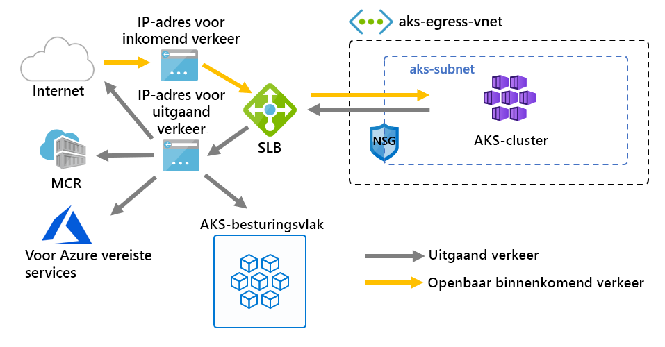

# <a name="customize-cluster-egress-with-a-user-defined-route-preview"></a>Cluster uitgang aanpassen met een door de gebruiker gedefinieerde route (preview-versie)

Een AKS-cluster kan worden aangepast aan specifieke scenario's. AKS zal standaard een standaard-SKU inrichten Load Balancer worden ingesteld en gebruikt voor uitgaand verkeer. Het is echter mogelijk dat de standaard instelling niet voldoet aan de vereisten van alle scenario's als open bare IP-adressen zijn niet toegestaan of extra hops zijn vereist voor het uitvallen van de gegevens.

In dit artikel wordt beschreven hoe u de uitgangs route van een cluster kunt aanpassen ter ondersteuning van aangepaste netwerk scenario's, zoals die voor het niet toestaan van open bare IP-adressen en het cluster vereist achter een virtueel netwerk apparaat (NVA).

> [!IMPORTANT]
> De preview-functies van AKS zijn self-service en worden op een opt-basis aangeboden. Previews worden aangeboden *als is* en *als beschikbaar* en zijn uitgesloten van de Service Level Agreement (Sla) en beperkte garantie. AKS-previews worden gedeeltelijk gedekt *door de klant* ondersteuning. De functies zijn daarom niet bedoeld voor productie gebruik. Zie de volgende ondersteunings artikelen voor meer informatie:
>
> * [AKS-ondersteunings beleid](support-policies.md)
> * [Veelgestelde vragen over ondersteuning voor Azure](faq.md)

## <a name="prerequisites"></a>Vereisten
* Azure CLI-versie 2.0.81 of hoger
* Azure CLI preview-extensie versie 0.4.28 of hoger
* API-versie `2020-01-01` van of hoger

## <a name="install-the-latest-azure-cli-aks-preview-extension"></a>De nieuwste Azure CLI AKS preview-extensie installeren
Als u het uitgaande type van een cluster wilt instellen, hebt u de Azure CLI AKS preview-extensie versie 0.4.18 of hoger nodig. Installeer de Azure CLI AKS preview-extensie met behulp van de opdracht AZ extension add en controleer vervolgens of er beschik bare updates zijn met behulp van de volgende opdracht AZ extension update:

```azure-cli
# Install the aks-preview extension
az extension add --name aks-preview

# Update the extension to make sure you have the latest version installed
az extension update --name aks-preview
```

## <a name="limitations"></a>Beperkingen
* Tijdens de preview `outboundType` -periode kan alleen worden gedefinieerd tijdens het maken van het cluster en kan later niet worden bijgewerkt.
* Tijdens de preview `outboundType` moeten AKS-clusters gebruikmaken van Azure cni. Kubenet kan worden geconfigureerd. voor het gebruik moet hand matig koppelingen van de route tabel worden gemaakt met het AKS-subnet.
* Voor `outboundType` de instelling zijn AKS- `vm-set-type` clusters `VirtualMachineScaleSets` met `load-balancer-sku` een `Standard`van en van vereist.
* Voor `outboundType` het instellen van een `UDR` waarde van is een door de gebruiker gedefinieerde route met geldige uitgaande connectiviteit voor het cluster vereist.
* Als `outboundType` u de waarde instelt `UDR` op ' impliceert het binnenkomende bron-IP-adres dat naar de Load Balancer wordt doorgestuurd, mogelijk niet hetzelfde als het uitgaande **afwijkings** doel van het cluster.

## <a name="overview-of-outbound-types-in-aks"></a>Overzicht van uitgaande typen in AKS

Een AKS-cluster kan worden aangepast met een `outboundType` uniek type Load Balancer of door de gebruiker gedefinieerde route ring.

> [!IMPORTANT]
> Uitgaand type is alleen van invloed op het uitgaande verkeer van uw cluster. Zie [ingangs controllers instellen](ingress-basic.md) voor meer informatie.

### <a name="outbound-type-of-loadbalancer"></a>Uitgaand type loadBalancer

Als `loadBalancer` is ingesteld, aks de volgende installatie automatisch volt ooien. De load balancer wordt gebruikt voor uitgaand verkeer via een AKS toegewezen openbaar IP-adres. Een uitgaand `loadBalancer` type van ondersteunt Kubernetes Services `loadBalancer`van het type, dat wordt verwacht uit het Load Balancer dat is gemaakt door de resource provider AKS.

De volgende installatie wordt uitgevoerd door AKS.
   * Een openbaar IP-adres is ingericht voor het uituitgangs cluster.
   * Het open bare IP-adres wordt toegewezen aan de load balancer resource.
   * Back-end-Pools voor de load balancer zijn ingesteld voor agent knooppunten in het cluster.

Hieronder vindt u een netwerk topologie die standaard wordt geïmplementeerd in AKS-clusters, `outboundType` waarbij `loadBalancer`een van wordt gebruikt.



### <a name="outbound-type-of-userdefinedrouting"></a>Uitgaand type userDefinedRouting

> [!NOTE]
> Het gebruik van een uitgaand type is een geavanceerd netwerk scenario en vereist een juiste netwerk configuratie.

Als `userDefinedRouting` is ingesteld, worden uitzonderings paden niet automatisch door aks geconfigureerd. Het volgende wordt verwacht door **de gebruiker**.

Het cluster moet worden geïmplementeerd in een bestaand virtueel netwerk met een subnet dat is geconfigureerd. Er moet een geldige door de gebruiker gedefinieerde route (UDR) bestaan in het subnet met uitgaande connectiviteit.

De resource provider AKS implementeert een Standard-load balancer (SLB). De load balancer is niet geconfigureerd met regels en er worden [geen kosten in rekening gebracht tot er een regel wordt geplaatst](https://azure.microsoft.com/pricing/details/load-balancer/). AKS wordt **niet** automatisch een openbaar IP-adres ingericht voor de SLB-front-end. Met AKS wordt de load balancer back-end-groep **niet** automatisch geconfigureerd.

## <a name="deploy-a-cluster-with-outbound-type-of-udr-and-azure-firewall"></a>Een cluster met uitgaand type UDR en Azure Firewall implementeren

Ter illustratie van de toepassing van een cluster met een uitgaand type met behulp van een door de gebruiker gedefinieerde route kan een cluster worden geconfigureerd op een virtueel netwerk dat is gekoppeld aan een Azure Firewall.


* Inkomend verkeer wordt geforceerd door Firewall filters
   * Een geïsoleerd subnet bevat een interne load balancer voor route ring in agent knooppunten
   * Agent knooppunten worden geïsoleerd in een toegewezen subnet
* Uitgaande aanvragen worden gestart vanaf agent knooppunten naar het Azure Firewall interne IP-adres met behulp van een door de gebruiker gedefinieerde route
   * Aanvragen van AKS-agent knooppunten volgen een UDR die is geplaatst op het subnet waarin het AKS-cluster is geïmplementeerd.
   * Azure Firewall egresses buiten het virtuele netwerk vanaf een openbaar IP-front-end
   * De toegang tot het AKS-besturings vlak wordt beveiligd door een NSG, waarvoor het IP-frontend-adres van de firewall is ingeschakeld
   * Toegang tot het open bare Internet of andere Azure-Services stromen van en naar het IP-adres van de firewall-frontend

### <a name="set-configuration-via-environment-variables"></a>Configuratie via omgevings variabelen instellen

Definieer een set omgevings variabelen die moeten worden gebruikt voor het maken van resources.

```bash
PREFIX="contosofin"
RG="${PREFIX}-rg"
LOC="eastus"
NAME="${PREFIX}outboundudr"
AKS_NAME="${PREFIX}aks"
VNET_NAME="${PREFIX}vnet"
AKSSUBNET_NAME="${PREFIX}akssubnet"
SVCSUBNET_NAME="${PREFIX}svcsubnet"
# DO NOT CHANGE FWSUBNET_NAME - This is currently a requirement for Azure Firewall.
FWSUBNET_NAME="AzureFirewallSubnet"
FWNAME="${PREFIX}fw"
FWPUBLICIP_NAME="${PREFIX}fwpublicip"
FWIPCONFIG_NAME="${PREFIX}fwconfig"
FWROUTE_TABLE_NAME="${PREFIX}fwrt"
FWROUTE_NAME="${PREFIX}fwrn"
FWROUTE_NAME_INTERNET="${PREFIX}fwinternet"
DEVSUBNET_NAME="${PREFIX}dev"
```

Stel vervolgens abonnement-Id's in.

```azure-cli
# Get ARM Access Token and Subscription ID - This will be used for AuthN later.

ACCESS_TOKEN=$(az account get-access-token -o tsv --query 'accessToken')

# NOTE: Update Subscription Name
# Set Default Azure Subscription to be Used via Subscription ID

az account set -s <SUBSCRIPTION_ID_GOES_HERE>

# NOTE: Update Subscription Name for setting SUBID

SUBID=$(az account show -s '<SUBSCRIPTION_NAME_GOES_HERE>' -o tsv --query 'id')
```

## <a name="create-a-virtual-network-with-multiple-subnets"></a>Een virtueel netwerk met meerdere subnetten maken

Richt een virtueel netwerk in met drie afzonderlijke subnetten, één voor het cluster, een voor de firewall en één voor service-uitstaand verkeer.


Maak een resource groep om alle resources te bewaren.

```azure-cli
# Create Resource Group

az group create --name $RG --location $LOC
```

Maak een twee virtuele netwerken om het AKS-cluster en het Azure Firewall te hosten. Elk heeft een eigen subnet. Laten we beginnen met het AKS-netwerk.

```
# Dedicated virtual network with AKS subnet

az network vnet create \
    --resource-group $RG \
    --name $VNET_NAME \
    --address-prefixes 100.64.0.0/16 \
    --subnet-name $AKSSUBNET_NAME \
    --subnet-prefix 100.64.1.0/24

# Dedicated subnet for K8s services

az network vnet subnet create \
    --resource-group $RG \
    --vnet-name $VNET_NAME \
    --name $SVCSUBNET_NAME \
    --address-prefix 100.64.2.0/24

# Dedicated subnet for Azure Firewall (Firewall name cannot be changed)

az network vnet subnet create \
    --resource-group $RG \
    --vnet-name $VNET_NAME \
    --name $FWSUBNET_NAME \
    --address-prefix 100.64.3.0/24
```

## <a name="create-and-setup-an-azure-firewall-with-a-udr"></a>Een Azure Firewall met een UDR maken en instellen

Azure Firewall binnenkomende en uitgaande regels moeten worden geconfigureerd. Het belangrijkste doel van de firewall is om organisaties in staat te stellen granulair inkomend en uitgaand verkeer naar en uit het AKS-cluster te installeren.


Maak een open bare IP-resource voor een standaard-SKU die wordt gebruikt als het front-Azure Firewall front-end-adres.

```azure-cli
az network public-ip create -g $RG -n $FWPUBLICIP_NAME -l $LOC --sku "Standard"
```

Registreer de preview cli-extensie om een Azure Firewall te maken.
```azure-cli
# Install Azure Firewall preview CLI extension

az extension add --name azure-firewall

# Deploy Azure Firewall

az network firewall create -g $RG -n $FWNAME -l $LOC
```

Het eerder gemaakte IP-adres kan nu worden toegewezen aan de firewall-frontend.
> [!NOTE]
> Het instellen van het open bare IP-adres voor de Azure Firewall kan een paar minuten duren.
> 
> Als er herhaaldelijk fouten worden ontvangen, verwijdert u de bestaande firewall en het open bare IP-adres en richt u het open bare IP-adres en het Azure Firewall in via de portal.

```azure-cli
# Configure Firewall IP Config

az network firewall ip-config create -g $RG -f $FWNAME -n $FWIPCONFIG_NAME --public-ip-address $FWPUBLICIP_NAME --vnet-name $VNET_NAME
```

Wanneer de vorige opdracht is geslaagd, slaat u het IP-adres van de firewall voor de configuratie later op.

```bash
# Capture Firewall IP Address for Later Use

FWPUBLIC_IP=$(az network public-ip show -g $RG -n $FWPUBLICIP_NAME --query "ipAddress" -o tsv)
FWPRIVATE_IP=$(az network firewall show -g $RG -n $FWNAME --query "ipConfigurations[0].privateIpAddress" -o tsv)
```

### <a name="create-a-udr-with-a-hop-to-azure-firewall"></a>Een UDR maken met een hop naar Azure Firewall

Azure routeert automatisch verkeer tussen Azure-subnetten, virtuele netwerken en on-premises netwerken. Als u de standaard routering van Azure wilt wijzigen, doet u dat door een route tabel te maken.

Maak een lege route tabel die moet worden gekoppeld aan een bepaald subnet. In de route tabel wordt de volgende hop gedefinieerd als de hierboven gemaakte Azure Firewall. Elk subnet kan zijn gekoppeld aan geen enkele of één routetabel.

```azure-cli
# Create UDR and add a route for Azure Firewall

az network route-table create -g $RG --name $FWROUTE_TABLE_NAME
az network route-table route create -g $RG --name $FWROUTE_NAME --route-table-name $FWROUTE_TABLE_NAME --address-prefix 0.0.0.0/0 --next-hop-type VirtualAppliance --next-hop-ip-address $FWPRIVATE_IP --subscription $SUBID
az network route-table route create -g $RG --name $FWROUTE_NAME_INTERNET --route-table-name $FWROUTE_TABLE_NAME --address-prefix $FWPUBLIC_IP/32 --next-hop-type Internet
```

Raadpleeg de documentatie over de [route tabel van het virtuele netwerk](../virtual-network/virtual-networks-udr-overview.md#user-defined) over hoe u de standaard systeem routes van Azure kunt overschrijven of extra routes toevoegt aan de route tabel van een subnet.

## <a name="adding-network-firewall-rules"></a>Firewall regels voor netwerken toevoegen

> [!WARNING]
> Hieronder ziet u een voor beeld van het toevoegen van een firewall regel. Alle uitstaande eind punten die in de [vereiste eind punten](egress.md) zijn gedefinieerd, moeten worden ingeschakeld door de firewall regels van de toepassing voor het werken met AKS-clusters. Als deze eind punten niet zijn ingeschakeld, kan uw cluster niet worden gebruikt.

Hieronder volgt een voor beeld van een netwerk-en toepassings regel. We voegen een netwerk regel toe waarmee u elk protocol, bron adres, doel adres en doel poorten kunt toestaan. We voegen ook een toepassings regel toe voor **een aantal** van de eind punten die zijn vereist voor AKS.

In een productie scenario dient u alleen toegang tot de vereiste eind punten voor uw toepassing in te scha kelen en die zijn gedefinieerd in [AKS vereist](egress.md)uitgaand verkeer.

```
# Add Network FW Rules

az network firewall network-rule create -g $RG -f $FWNAME --collection-name 'aksfwnr' -n 'netrules' --protocols 'Any' --source-addresses '*' --destination-addresses '*' --destination-ports '*' --action allow --priority 100

# Add Application FW Rules
# IMPORTANT: Add AKS required egress endpoints

az network firewall application-rule create -g $RG -f $FWNAME \
    --collection-name 'AKS_Global_Required' \
    --action allow \
    --priority 100 \
    -n 'required' \
    --source-addresses '*' \
    --protocols 'http=80' 'https=443' \
    --target-fqdns \
        'aksrepos.azurecr.io' \
        '*blob.core.windows.net' \
        'mcr.microsoft.com' \
        '*cdn.mscr.io' \
        '*.data.mcr.microsoft.com' \
        'management.azure.com' \
        'login.microsoftonline.com' \
        'ntp.ubuntu.com' \
        'packages.microsoft.com' \
        'acs-mirror.azureedge.net'
```

Raadpleeg de [documentatie van Azure firewall](https://docs.microsoft.com/azure/firewall/overview) voor meer informatie over de Azure Firewall-service.

## <a name="associate-the-route-table-to-aks"></a>De route tabel aan AKS koppelen

Als u het cluster wilt koppelen aan de firewall, moet het toegewezen subnet voor het subnet van het cluster verwijzen naar de route tabel die hierboven is gemaakt. U kunt de koppeling doen door een opdracht uit te geven aan het virtuele netwerk dat zowel het cluster als de firewall heeft om de route tabel van het subnet van het cluster bij te werken.

```azure-cli
# Associate route table with next hop to Firewall to the AKS subnet

az network vnet subnet update -g $RG --vnet-name $VNET_NAME --name $AKSSUBNET_NAME --route-table $FWROUTE_TABLE_NAME
```

## <a name="deploy-aks-with-outbound-type-of-udr-to-the-existing-network"></a>AKS met uitgaand type UDR implementeren in het bestaande netwerk

Nu kan een AKS-cluster worden geïmplementeerd in de bestaande virtuele-netwerk installatie. Als u een uitgaand cluster type wilt instellen op door de gebruiker gedefinieerde route ring, moet een bestaand subnet worden opgegeven bij AKS.


### <a name="create-a-service-principal-with-access-to-provision-inside-the-existing-virtual-network"></a>Een service-principal met toegang maken om in het bestaande virtuele netwerk in te richten

Een service-principal wordt door AKS gebruikt om cluster bronnen te maken. De service-principal die wordt door gegeven tijdens het maken, wordt gebruikt voor het maken van onderliggende AKS-resources, zoals Vm's, opslag en load balancers die worden gebruikt door AKS. Als er te weinig machtigingen worden verleend, kan er geen AKS-cluster worden ingericht.

```azure-cli
# Create SP and Assign Permission to Virtual Network

az ad sp create-for-rbac -n "${PREFIX}sp" --skip-assignment
```

Vervang nu de `APPID` en `PASSWORD` onderstaande door de Service Principal AppID en het Service Principal-wacht woord dat automatisch wordt gegenereerd door de vorige opdracht uitvoer. We verwijzen naar de VNET-Resource-ID om machtigingen toe te kennen aan de Service-Principal zodat AKS hierin resources kan implementeren.

```azure-cli
APPID="<SERVICE_PRINCIPAL_APPID_GOES_HERE>"
PASSWORD="<SERVICEPRINCIPAL_PASSWORD_GOES_HERE>"
VNETID=$(az network vnet show -g $RG --name $VNET_NAME --query id -o tsv)

# Assign SP Permission to VNET

az role assignment create --assignee $APPID --scope $VNETID --role Contributor

# View Role Assignment
az role assignment list --assignee $APPID --all -o table
```

### <a name="deploy-aks"></a>AKS implementeren

Ten slotte kan het AKS-cluster worden geïmplementeerd in het bestaande subnet dat voor het cluster is toegewezen. Het doel-subnet waarnaar moet worden geïmplementeerd, `$SUBNETID`is gedefinieerd met de omgevings variabele. De `$SUBNETID` variabele is niet gedefinieerd in de vorige stappen. Als u de waarde voor de subnet-ID wilt instellen, kunt u de volgende opdracht gebruiken:

```azurecli
SUBNETID="/subscriptions/$SUBID/resourceGroups/$RG/providers/Microsoft.Network/virtualNetworks/$VNET_NAME/subnets/$AKSSUBNET_NAME"
```

Het uitgaande type wordt gedefinieerd om de UDR te volgen die bestaat op het subnet, waardoor de installatie van AKS overs laan voor de load balancer dat nu strikt intern kan zijn.

De AKS-functie voor door de [API server geautoriseerde IP-adresbereiken](api-server-authorized-ip-ranges.md) kan worden toegevoegd om de API-server toegang alleen te beperken tot het open bare eind punt van de firewall. De functie voor geautoriseerde IP-bereiken wordt in het diagram aangeduid als de NSG die moet worden door gegeven om toegang te krijgen tot het besturings vlak. Wanneer u de functie geautoriseerd IP-bereik inschakelt om de toegang tot de API-server te beperken, moeten uw ontwikkel hulpprogramma's gebruikmaken van een JumpBox in het virtuele netwerk van de firewall of moet u alle ontwikkel eindpunten toevoegen aan het geautoriseerde IP-bereik.

> [!TIP]
> Extra functies kunnen worden toegevoegd aan de cluster implementatie, zoals (private cluster) []. Wanneer u gemachtigde IP-bereiken gebruikt, is er een JumpBox vereist in het cluster netwerk om toegang te krijgen tot de API-server.

```azure-cli
az aks create -g $RG -n $AKS_NAME -l $LOC \
  --node-count 3 \
  --network-plugin azure --generate-ssh-keys \
  --service-cidr 192.168.0.0/16 \
  --dns-service-ip 192.168.0.10 \
  --docker-bridge-address 172.22.0.1/29 \
  --vnet-subnet-id $SUBNETID \
  --service-principal $APPID \
  --client-secret $PASSWORD \
  --load-balancer-sku standard \
  --outbound-type userDefinedRouting \
  --api-server-authorized-ip-ranges $FWPUBLIC_IP
  ```

### <a name="enable-developer-access-to-the-api-server"></a>Ontwikkel aars toegang tot de API-server inschakelen

Als gevolg van de instelling van het geautoriseerde IP-bereik voor het cluster, moet u de IP-adressen van ontwikkel aars toevoegen aan de AKS-cluster lijst met goedgekeurde IP-bereiken om toegang te krijgen tot de API-server. Een andere optie is het configureren van een JumpBox met het benodigde hulp programma binnen een afzonderlijk subnet in het virtuele netwerk van de firewall.

Voeg een ander IP-adres toe aan de goedgekeurde bereiken met de volgende opdracht

```bash
# Retrieve your IP address
CURRENT_IP=$(dig @resolver1.opendns.com ANY myip.opendns.com +short)

# Add to AKS approved list
az aks update -g $RG -n $AKS_NAME --api-server-authorized-ip-ranges $CURRENT_IP/32

```

 Gebruik de opdracht [AZ AKS Get-credentials][az-aks-get-credentials] om `kubectl` te configureren om verbinding te maken met het zojuist gemaakte Kubernetes-cluster. 

 ```azure-cli
 az aks get-credentials -g $RG -n $AKS_NAME
 ```

### <a name="setup-the-internal-load-balancer"></a>De interne load balancer instellen

AKS heeft een load balancer geïmplementeerd met het cluster dat kan worden ingesteld als een [interne Load Balancer](internal-lb.md).

Als u een interne load balancer wilt maken, maakt u een service manifest met de naam Internal-lb. yaml met het Service type LoadBalancer en de Azure-Load Balancer-interne aantekening, zoals wordt weer gegeven in het volgende voor beeld:

```yaml
apiVersion: v1
kind: Service
metadata:
  name: internal-app
  annotations:
    service.beta.kubernetes.io/azure-load-balancer-internal: "true"
    service.beta.kubernetes.io/azure-load-balancer-internal-subnet: "contosofinsvcsubnet"
spec:
  type: LoadBalancer
  ports:
  - port: 80
  selector:
    app: internal-app
```

Implementeer de interne load balancer met behulp van de kubectl-toepassing en geef de naam van uw YAML-manifest op:

```bash
kubectl apply -f internal-lb.yaml
```

## <a name="deploy-a-kubernetes-service"></a>Een Kubernetes-service implementeren

Omdat het uitgaande cluster type is ingesteld als UDR, koppelt u de agent knooppunten als de back-end-pool voor de load balancer wordt niet automatisch door AKS tijdens het maken van het cluster voltooid. De koppeling van de back-endadresgroep wordt echter afgehandeld door de Azure-Cloud provider Kubernetes wanneer de Kubernetes-service wordt geïmplementeerd.

Implementeer de Azure stem-app-toepassing door de yaml hieronder te kopiëren naar `example.yaml`een bestand met de naam.

```yaml
apiVersion: apps/v1
kind: Deployment
metadata:
  name: azure-vote-back
spec:
  replicas: 1
  selector:
    matchLabels:
      app: azure-vote-back
  template:
    metadata:
      labels:
        app: azure-vote-back
    spec:
      nodeSelector:
        "beta.kubernetes.io/os": linux
      containers:
      - name: azure-vote-back
        image: redis
        resources:
          requests:
            cpu: 100m
            memory: 128Mi
          limits:
            cpu: 250m
            memory: 256Mi
        ports:
        - containerPort: 6379
          name: redis
---
apiVersion: v1
kind: Service
metadata:
  name: azure-vote-back
spec:
  ports:
  - port: 6379
  selector:
    app: azure-vote-back
---
apiVersion: apps/v1
kind: Deployment
metadata:
  name: azure-vote-front
spec:
  replicas: 1
  selector:
    matchLabels:
      app: azure-vote-front
  template:
    metadata:
      labels:
        app: azure-vote-front
    spec:
      nodeSelector:
        "beta.kubernetes.io/os": linux
      containers:
      - name: azure-vote-front
        image: microsoft/azure-vote-front:v1
        resources:
          requests:
            cpu: 100m
            memory: 128Mi
          limits:
            cpu: 250m
            memory: 256Mi
        ports:
        - containerPort: 80
        env:
        - name: REDIS
          value: "azure-vote-back"
---
apiVersion: v1
kind: Service
metadata:
  name: azure-vote-front
  annotations:
    service.beta.kubernetes.io/azure-load-balancer-internal: "true"
    service.beta.kubernetes.io/azure-load-balancer-internal-subnet: "contosofinsvcsubnet"
spec:
  type: LoadBalancer
  ports:
  - port: 80
  selector:
    app: azure-vote-front
```

Implementeer de service door uit te voeren:

```bash
kubectl apply -f example.yaml
```

## <a name="add-a-dnat-rule-to-azure-firewall"></a>Een DNAT-regel toevoegen aan Azure Firewall

Als u binnenkomende connectiviteit wilt configureren, moet er een DNAT-regel naar de Azure Firewall geschreven. Als u de verbinding met ons cluster wilt testen, wordt er een regel gedefinieerd voor het open bare IP-adres van de firewall-frontend om te routeren naar het interne IP dat door de interne service wordt weer gegeven.

Het doel adres kan worden aangepast, omdat het de poort op de firewall is die moet worden geopend. Het vertaalde adres moet het IP-adres van de interne load balancer zijn. De vertaalde poort moet de weer gegeven poort voor uw Kubernetes-service zijn.

U moet het interne IP-adres opgeven dat is toegewezen aan de load balancer gemaakt door de Kubernetes-service. Het adres ophalen door het volgende uit te voeren:

```bash
kubectl get services
```

Het IP-adres dat nodig is, wordt weer gegeven in de kolom extern-IP, vergelijkbaar met het volgende.

```bash
NAME               TYPE           CLUSTER-IP       EXTERNAL-IP   PORT(S)        AGE
azure-vote-back    ClusterIP      192.168.92.209   <none>        6379/TCP       23m
azure-vote-front   LoadBalancer   192.168.19.183   100.64.2.5    80:32106/TCP   23m
kubernetes         ClusterIP      192.168.0.1      <none>        443/TCP        4d3h
```

```azure-cli
az network firewall nat-rule create --collection-name exampleset --destination-addresses $FWPUBLIC_IP --destination-ports 80 --firewall-name $FWNAME --name inboundrule --protocols Any --resource-group $RG --source-addresses '*' --translated-port 80 --action Dnat --priority 100 --translated-address <INSERT IP OF K8s SERVICE>
```

## <a name="clean-up-resources"></a>Resources opschonen

> [!NOTE]
> Als de interne load balancer wordt verwijderd door een wille keurige service, wordt de interne load balancer door de Azure-Cloud provider verwijderd. Bij de volgende implementatie van de service wordt een load balancer geïmplementeerd als er geen kan worden gevonden met de aangevraagde configuratie.

Als u Azure-resources wilt opschonen, verwijdert u de resource groep AKS.

```azure-cli
az group delete -g $RG
```

## <a name="validate-connectivity"></a>Connectiviteit valideren

Ga in een browser naar het Azure Firewall frontend-IP-adres om de connectiviteit te valideren.

U ziet een afbeelding van de Azure stem-app.

## <a name="next-steps"></a>Volgende stappen

Zie [overzicht van Azure Networking UDR](https://docs.microsoft.com/azure/virtual-network/virtual-networks-udr-overview).

Zie [een route tabel maken, wijzigen of verwijderen](https://docs.microsoft.com/azure/virtual-network/manage-route-table).

<!-- LINKS - internal -->
[az-aks-get-credentials]: /cli/azure/aks?view=azure-cli-latest#az-aks-get-credentials
