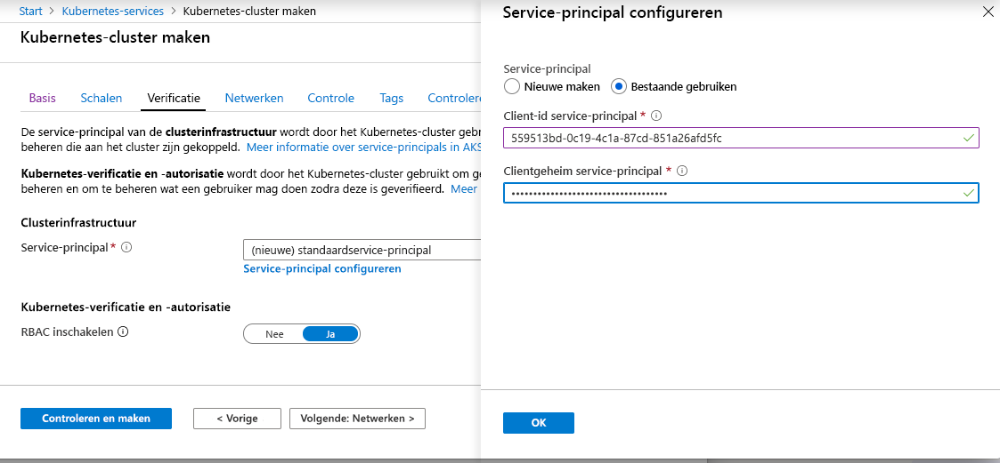

# <a name="service-principals-with-azure-kubernetes-service-aks"></a>Service-principals met AKS (Azure Kubernetes Service)

Als u wilt communiceren met Azure-Api's, is voor een AKS-cluster een [Service-Principal voor Azure Active Directory (AD)][aad-service-principal]vereist. De service-principal is nodig voor het dynamisch maken en beheren van andere Azure-resources zoals een Azure Load Balancer of een Azure Container Registry (ACR).

In dit artikel ziet u hoe u een service-principal voor uw AKS-clusters maakt en gebruikt.

## <a name="before-you-begin"></a>Voordat u begint

Als u een service-principal voor Azure AD wilt maken, moet u beschikken over machtigingen voor het registreren van een toepassing bij de Azure AD-tenant. U moet ook machtigingen hebben om de toepassing aan een rol toe te wijzen in uw abonnement. Als u niet beschikt over de benodigde machtigingen, moet u mogelijk de Azure AD- of abonnementsbeheerder vragen om de benodigde machtigingen toe te wijzen, of vooraf een service-principal maken voor gebruik met het AKS-cluster.

Als u een service-principal van een andere Azure AD-Tenant gebruikt, zijn er aanvullende overwegingen rond de beschik bare machtigingen wanneer u het cluster implementeert. Mogelijk beschikt u niet over de juiste machtigingen om mapgegevens te lezen en te schrijven. Zie [Wat zijn de standaard machtigingen voor gebruikers in azure Active Directory?][azure-ad-permissions] voor meer informatie.

Ook moet de Azure CLI-versie 2.0.59 of hoger zijn geïnstalleerd en geconfigureerd. Voer  `az --version` uit om de versie te bekijken. Als u wilt installeren of upgraden, raadpleegt u [Azure cli installeren][install-azure-cli].

## <a name="automatically-create-and-use-a-service-principal"></a>Automatisch een service-principal maken en gebruiken

Wanneer u een AKS-cluster maakt in de Azure Portal of met de opdracht [AZ AKS Create][az-aks-create] , kan Azure automatisch een Service-Principal genereren.

In het volgende Azure CLI-voorbeeld is geen service-principal opgegeven. In dit scenario maakt de Azure CLI een service-principal voor het AKS-cluster. Om deze bewerking te kunnen voltooien, moet uw Azure-account beschikken over de juiste rechten voor het maken van een service-principal.

```azurecli
az aks create --name myAKSCluster --resource-group myResourceGroup
```

## <a name="manually-create-a-service-principal"></a>Handmatig een service-principal maken

Gebruik de opdracht [AZ AD SP create-for-RBAC][az-ad-sp-create] om hand matig een service-principal te maken met de Azure cli. In het volgende voorbeeld wordt met de parameter `--skip-assignment` voorkomen dat eventuele extra standaardtoewijzingen worden toegewezen:

```azurecli-interactive
az ad sp create-for-rbac --skip-assignment --name myAKSClusterServicePrincipal
```

De uitvoer lijkt op die in het volgende voorbeeld. Noteer uw eigen `appId` en `password`. Deze waarden worden gebruikt wanneer u in de volgende sectie een AKS-cluster maakt.

```json
{
  "appId": "559513bd-0c19-4c1a-87cd-851a26afd5fc",
  "displayName": "myAKSClusterServicePrincipal",
  "name": "http://myAKSClusterServicePrincipal",
  "password": "e763725a-5eee-40e8-a466-dc88d980f415",
  "tenant": "72f988bf-86f1-41af-91ab-2d7cd011db48"
}
```

## <a name="specify-a-service-principal-for-an-aks-cluster"></a>Een service-principal opgeven voor een AKS-cluster

Als u een bestaande Service-Principal wilt gebruiken wanneer u een AKS-cluster maakt met behulp van de opdracht [AZ AKS Create][az-aks-create] , gebruikt u de para meters `--service-principal` en `--client-secret` om de `appId` en `password` op te geven uit de uitvoer van de opdracht [AZ AD SP create-for-RBAC][az-ad-sp-create] :

```azurecli-interactive
az aks create \
    --resource-group myResourceGroup \
    --name myAKSCluster \
    --service-principal <appId> \
    --client-secret <password>
```

Als u een AKS-cluster implementeert met behulp van de Azure Portal, kiest u op de pagina *Verificatie* van het dialoogvenster **Kubernetes-cluster maken** de optie **Service-principal configureren**. Selecteer **Bestaande gebruiken** en geef de volgende waarden op:

- **Client-id van de service-principal** is uw *appId*
- **Clientgeheim van de service-principal** is de waarde van het *wachtwoord*



## <a name="delegate-access-to-other-azure-resources"></a>Machtiging afgeven voor toegang tot andere Azure-resources

De service-principal voor het AKS-cluster kan worden gebruikt voor toegang tot andere resources. Als u bijvoorbeeld uw AKS-cluster wilt implementeren in een bestaand subnet van het virtuele netwerk van Azure of als u verbinding wilt maken met Azure Container Registry (ACR), moet u de toegang tot deze resources delegeren aan de Service-Principal.

Als u machtigingen wilt delegeren, maakt u een roltoewijzing met de opdracht [AZ Role Assignment Create][az-role-assignment-create] . Wijs de `appId` toe aan een bepaald bereik, zoals een resource groep of virtuele netwerk resource. Op basis van de rol wordt gedefinieerd welke machtigingen de service-principal heeft voor de resource, zoals in het volgende voorbeeld wordt weergegeven:

```azurecli
az role assignment create --assignee <appId> --scope <resourceScope> --role Contributor
```

De `--scope` van een resource moet een volledige resource-id zijn, zoals */subscriptions/\<guid\>/resourceGroups/myResourceGroup* of */subscriptions/\<guid \>/resourceGroups/myResourceGroupVnet/providers/Microsoft.Network/virtualNetworks/myVnet*

In de volgende secties wordt meer uitleg gegeven over algemene machtigingen die u mogelijk moet afgeven.

### <a name="azure-container-registry"></a>Azure Container Registry

Als u Azure Container Registry (ACR) als container installatie kopie archief gebruikt, moet u machtigingen verlenen aan de service-principal voor uw AKS-cluster om installatie kopieën te lezen en te verzamelen. De aanbevolen configuratie is momenteel het gebruik van de opdracht [AZ AKS Create][az-aks-create] of [AZ AKS update][az-aks-update] om te integreren met een REGI ster en de juiste rol voor de Service-Principal toe te wijzen. Zie [verifiëren met Azure container Registry van de Azure Kubernetes-service][aks-to-acr]voor gedetailleerde stappen.

### <a name="networking"></a>Networking

U kunt gebruikmaken van geavanceerde netwerkmogelijkheden als het virtuele netwerk en het subnet of de openbare IP-adressen zich in een andere resourcegroep bevinden. Wijs een van de volgende sets rolmachtigingen toe:

- Een [aangepaste rol][rbac-custom-role] maken en de volgende rolmachtigingen definiëren:
  - *Microsoft.Network/virtualNetworks/subnets/join/action*
  - *Microsoft.Network/virtualNetworks/subnets/read*
  - *Microsoft.Network/virtualNetworks/subnets/write*
  - *Microsoft.Network/publicIPAddresses/join/action*
  - *Microsoft.Network/publicIPAddresses/read*
  - *Microsoft.Network/publicIPAddresses/write*
- Of wijs de ingebouwde rol [netwerk bijdrager][rbac-network-contributor] toe aan het subnet binnen het virtuele netwerk

### <a name="storage"></a>Storage

Mogelijk hebt u toegang nodig tot bestaande schijfresources in een andere resourcegroep. Wijs een van de volgende sets rolmachtigingen toe:

- Een [aangepaste rol][rbac-custom-role] maken en de volgende rolmachtigingen definiëren:
  - *Microsoft.Compute/disks/read*
  - *Microsoft.Compute/disks/write*
- Of wijs de ingebouwde rol [Inzender voor opslag accounts][rbac-storage-contributor] toe aan de resource groep

### <a name="azure-container-instances"></a>Azure Container Instances

Als u Virtual Kubelet gebruikt om te integreren met AKS en ervoor kiest Azure Container Instances (ACI) uit te voeren in de resourcegroep, los van de AKS-cluster, dan moet u de AKS-service-principal de machtiging *Inzender* voor de ACI-resourcegroep verlenen.

## <a name="additional-considerations"></a>Aanvullende overwegingen

Houd rekening met het volgende wanneer u werkt met AKS en Azure AD-service-principals.

- De service-principal voor Kubernetes is een onderdeel van de configuratie van het cluster. Gebruik echter niet de id voor het implementeren van het cluster.
- De referenties van de Service-Principal zijn standaard één jaar geldig. U kunt [de referenties van de Service-Principal][update-credentials] op elk gewenst moment bijwerken of draaien.
- Elke service-principal is gekoppeld aan een Azure AD-toepassing. De service-principal voor een Kubernetes-cluster kan zijn gekoppeld aan elke geldige Azure AD-toepassingsnaam (bijvoorbeeld *https://www.contoso.org/example* ). De URL van de toepassing hoeft geen echt eindpunt te zijn.
- Gebruik bij het opgeven van de **client-id** van de service-principal de waarde van de `appId`.
- Op het agent knooppunt Vm's in het Kubernetes-cluster worden de referenties van de Service-Principal opgeslagen in het bestand `/etc/kubernetes/azure.json`
- Wanneer u de opdracht [AZ AKS Create][az-aks-create] gebruikt om de Service-Principal automatisch te genereren, worden de referenties van de Service-Principal naar het bestand `~/.azure/aksServicePrincipal.json` op de computer die wordt gebruikt om de opdracht uit te voeren.
- Wanneer u een AKS-cluster verwijdert dat is gemaakt door [AZ AKS Create][az-aks-create], wordt de service-principal die automatisch is gemaakt, niet verwijderd.
    - Als u de Service-Principal wilt verwijderen, voert u een query uit voor uw cluster *servicePrincipalProfile. clientId* en verwijdert u vervolgens met [AZ AD App delete][az-ad-app-delete]. Vervang de volgende brongroeps- en clusternamen door uw eigen waarden:

        ```azurecli
        az ad sp delete --id $(az aks show -g myResourceGroup -n myAKSCluster --query servicePrincipalProfile.clientId -o tsv)
        ```

## <a name="troubleshoot"></a>Problemen oplossen

De referenties van de service-principal voor een AKS-cluster worden in de cache opgeslagen door de Azure CLI. Als deze referenties zijn verlopen, treden er fouten op bij het implementeren van AKS-clusters. Het volgende fout bericht bij het uitvoeren van [AZ AKS Create][az-aks-create] kan duiden op een probleem met de referenties van de Service-Principal in de cache:

```console
Operation failed with status: 'Bad Request'.
Details: The credentials in ServicePrincipalProfile were invalid. Please see https://aka.ms/aks-sp-help for more details.
(Details: adal: Refresh request failed. Status Code = '401'.
```

Controleer de leeftijd van het referentie bestand met behulp van de volgende opdracht:

```console
ls -la $HOME/.azure/aksServicePrincipal.json
```

De standaard verval tijd voor de referenties van de Service-Principal is één jaar. Als uw *aksServicePrincipal. json* -bestand ouder is dan één jaar, verwijdert u het bestand en probeert u nogmaals een AKS-cluster te implementeren.

## <a name="next-steps"></a>Volgende stappen

Zie [Application and Service Principal Objects][service-principal](Engelstalig) voor meer informatie over het Azure Active Directory van service-principals.

Zie [de referenties voor een Service-Principal bijwerken of draaien in AKS][update-credentials]voor meer informatie over het bijwerken van de referenties.

<!-- LINKS - internal -->
[aad-service-principal]:../active-directory/develop/app-objects-and-service-principals.md
[acr-intro]: ../container-registry/container-registry-intro.md
[az-ad-sp-create]: /cli/azure/ad/sp#az-ad-sp-create-for-rbac
[azure-load-balancer-overview]: ../load-balancer/load-balancer-overview.md
[install-azure-cli]: /cli/azure/install-azure-cli
[service-principal]:../active-directory/develop/app-objects-and-service-principals.md
[user-defined-routes]: ../load-balancer/load-balancer-overview.md
[az-ad-app-list]: /cli/azure/ad/app#az-ad-app-list
[az-ad-app-delete]: /cli/azure/ad/app#az-ad-app-delete
[az-aks-create]: /cli/azure/aks#az-aks-create
[az-aks-update]: /cli/azure/aks#az-aks-update
[rbac-network-contributor]: ../role-based-access-control/built-in-roles.md#network-contributor
[rbac-custom-role]: ../role-based-access-control/custom-roles.md
[rbac-storage-contributor]: ../role-based-access-control/built-in-roles.md#storage-account-contributor
[az-role-assignment-create]: /cli/azure/role/assignment#az-role-assignment-create
[aks-to-acr]: cluster-container-registry-integration.md
[update-credentials]: update-credentials.md
[azure-ad-permissions]: ../active-directory/fundamentals/users-default-permissions.md
