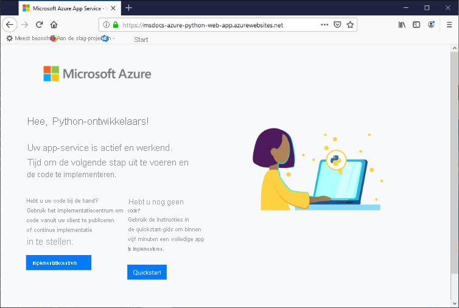

# <a name="configure-a-linux-python-app-for-azure-app-service"></a>Een Linux Python-app voor Azure App Service configureren

In dit artikel wordt beschreven hoe Python-apps worden uitgevoerd in [Azure App Service](overview.md) en hoe u het gedrag van Azure App Service zo nodig kunt aanpassen. Python-apps moet worden geïmplementeerd met alle vereiste [pip](https://pypi.org/project/pip/)-modules.

Met de implementatie-engine van App Service wordt automatisch een virtuele omgeving geactiveerd waarin `pip install -r requirements.txt` voor u wordt uitgevoerd wanneer u een [Git-opslagplaats](deploy-local-git.md) of een [zip-pakket](deploy-zip.md) implementeert.

In deze handleiding vindt u belangrijke concepten en instructies voor Python-ontwikkelaars die een ingebouwde Linux-container in App Service gebruiken. Als u Azure App Service nog nooit hebt gebruikt, moet u eerst de [Python-quickstart](quickstart-python.md) en de [zelfstudie Python met PostgreSQL](tutorial-python-postgresql-app.md) volgen.

U kunt de [Azure-portal](https://portal.azure.com) of de Azure CLI gebruiken voor het configureren:

- **Azure-portal** : gebruik de pagina **Instellingen** > **Configuratie** zoals beschreven in [Een App Service-app configureren in de Azure-portal](configure-common.md).

- **Azure CLI** : u hebt twee opties.

    - Voer opdrachten uit in de [Azure Cloud Shell](../cloud-shell/overview.md), die u kunt openen met behulp van de knop **Probeer het nu** in de rechterbovenhoek van codeblokken.
    - Voer opdrachten lokaal uit door de nieuwste versie van de [Azure CLI](/cli/azure/install-azure-cli) te installeren en u vervolgens aan te melden bij Azure met [az login](/cli/azure/reference-index#az-login).
    
> [!NOTE]
> Linux is momenteel de aanbevolen optie voor het uitvoeren van Python-apps in App Service. Zie [Python in de Windows-versie van App Service](/visualstudio/python/managing-python-on-azure-app-service) voor informatie over de Windows-optie.

## <a name="configure-python-version"></a>Python-versie configureren

- **Azure-portal** : gebruik het tabblad **Algemene instellingen** op de pagina **Configuratie** , zoals wordt beschreven in [Algemene instellingen configureren](configure-common.md#configure-general-settings) voor Linux-containers.

- **Azure CLI** :

    -  Geef de huidige Python-versie weer met [az webapp config show](/cli/azure/webapp/config#az_webapp_config_show):
    
        ```azurecli-interactive
        az webapp config show --resource-group <resource-group-name> --name <app-name> --query linuxFxVersion
        ```
        
        Vervang `<resource-group-name>` en `<app-name>` door de namen die van toepassing zijn op uw web-app.
    
    - Stel de Python-versie in met [az webapp config set](/cli/azure/webapp/config#az_webapp_config_set)
        
        ```azurecli-interactive
        az webapp config set --resource-group <resource-group-name> --name <app-name> --linux-fx-version "PYTHON|3.7"
        ```
    
    - Geef alle Python-versies die worden ondersteund in Azure App Service weer met [az webapp list-runtimes](/cli/azure/webapp#az_webapp_list_runtimes):
    
        ```azurecli-interactive
        az webapp list-runtimes --linux | grep PYTHON
        ```
    
U kunt een niet-ondersteunde versie van Python uitvoeren door in plaats daarvan uw eigen containerinstallatiekopie te bouwen. Voor meer informatie raadpleegt u [Een aangepaste Docker-installatiekopie gebruiken](tutorial-custom-container.md?pivots=container-linux).

<!-- <a> element here to preserve external links-->
<a name="access-environment-variables"></a>

## <a name="customize-build-automation"></a>De automatisering van bouwbewerkingen aanpassen

Oryx, het buildsysteem van App Service, voert de volgende stappen uit wanneer u de app implementeert met Git of zip-pakketten:

1. Voer een aangepast pre-buildscript uit als dit wordt opgegeven via de instelling `PRE_BUILD_COMMAND`.
1. Voer `pip install -r requirements.txt` uit. Het bestand *requirements.txt* moet aanwezig zijn in de hoofdmap van het project. Anders wordt de volgende fout gerapporteerd door het buildproces: Kan setup.py of requirements.txt niet vinden; PIP-installatie wordt niet uitgevoerd.
1. Als *manage.py* wordt aangetroffen in de hoofdmap van de opslagplaats (wat aangeeft dat het een Django-app is), voert u *manage.py collectstatic* uit. Als de instelling `DISABLE_COLLECTSTATIC` echter `true` is, wordt deze stap overgeslagen.
1. Voer een aangepast post-buildscript uit als dit wordt opgegeven via de instelling `POST_BUILD_COMMAND`.

De instellingen `PRE_BUILD_COMMAND`, `POST_BUILD_COMMAND` en `DISABLE_COLLECTSTATIC` zijn standaard leeg. 

- Als u het uitvoeren van collectstatic wilt uitschakelen wanneer u Django-apps bouwt, stelt u `DISABLE_COLLECTSTATIC` in op true.

- Als u pre-buildopdrachten wilt uitvoeren, moet de instelling `PRE_BUILD_COMMAND` een opdracht, zoals `echo Pre-build command`, of een pad naar een scriptbestand ten opzichte van de hoofdmap van het project, zoals `scripts/prebuild.sh`, bevatten. In alle opdrachten moeten relatieve paden naar de hoofdmap van het project worden gebruikt.

- Als u post-buildopdrachten wilt uitvoeren, moet de instelling `POST_BUILD_COMMAND` een opdracht, zoals `echo Post-build command`, of een pad naar een scriptbestand ten opzichte van de hoofdmap van het project, zoals `scripts/postbuild.sh`, bevatten. In alle opdrachten moeten relatieve paden naar de hoofdmap van het project worden gebruikt.

Zie [Oryx-configuratie](https://github.com/microsoft/Oryx/blob/master/doc/configuration.md) voor aanvullende instellingen voor het aanpassen van bouwautomatisering. 

Zie [hoe Python-apps worden gedetecteerd en gebouwd met Oryx](https://github.com/microsoft/Oryx/blob/master/doc/runtimes/python.md) voor meer informatie over de manier waarop Python-apps door App Service worden uitgevoerd en gebouwd in Linux.

> [!NOTE]
> De instellingen `PRE_BUILD_SCRIPT_PATH` en `POST_BUILD_SCRIPT_PATH` zijn gelijk aan `PRE_BUILD_COMMAND` en `POST_BUILD_COMMAND`, en worden ondersteund voor oudere versies.
> 
> Als een instelling met de naam `SCM_DO_BUILD_DURING_DEPLOYMENT` `true` of 1 bevat, wordt een Oryx-build geactiveerd tijdens de implementatie. De instelling is true (waar) wanneer u implementeert met behulp van Git, de Azure CLI-opdracht `az webapp up` en Visual Studio code.

> [!NOTE]
> Gebruik altijd relatieve paden in alle pre- en post-buildscripts, omdat de buildcontainer waarin Oryx wordt uitgevoerd, een andere container is dan de runtimecontainer waarin de app wordt uitgevoerd. Vertrouw er nooit op dat de app-projectmap exact binnen de container wordt geplaatst (bijvoorbeeld onder *site/wwwroot* ).

## <a name="production-settings-for-django-apps"></a>Productie-instellingen voor Django-apps

Voor een productie omgeving, zoals Azure App Service, moeten Django-apps voldoen aan de [controlelijst voor implementatie](https://docs.djangoproject.com/en/3.1/howto/deployment/checklist/) van Django (djangoproject.com).

In de volgende tabel vindt u een beschrijving van de relevante productie-instellingen voor Azure. Deze instellingen worden gedefinieerd in het bestand *setting.py* van de app.

| Django-instelling | Instructies voor Azure |
| --- | --- |
| `SECRET_KEY` | Sla de waarde op in een App Service-instelling, zoals wordt beschreven op [App-instellingen openen als omgevingsvariabelen](#access-app-settings-as-environment-variables). U kunt ook [de waarde opslaan als een geheim in Azure Key Vault](/azure/key-vault/secrets/quick-create-python). |
| `DEBUG` | Maak een `DEBUG`-instelling op App Service met de waarde 0 (false) en laad de waarde als een omgevingsvariabele. Maak in uw ontwikkelomgeving een `DEBUG`-omgevingsvariabele met de waarde 1 (niet waar). |
| `ALLOWED_HOSTS` | In een productieomgeving is voor Django vereist dat u de URL van de app opneemt in de `ALLOWED_HOSTS`-matrix van *settings.py* . U kunt deze URL tijdens runtime ophalen met de code, `os.environ['WEBSITE_HOSTNAME']`. App Service stelt de omgevingsvariabele `WEBSITE_HOSTNAME` automatisch in op de URL van de app. |
| `DATABASES` | Definieer instellingen in App Service voor de databaseverbinding en laad deze als omgevingsvariabelen om de woordenlijst [`DATABASES`](https://docs.djangoproject.com/en/3.1/ref/settings/#std:setting-DATABASES) in te vullen. U kunt de waarden (met name de gebruikersnaam en het wachtwoord) ook opslaan als [Azure Key Vault-geheimen](/azure/key-vault/secrets/quick-create-python). |

## <a name="container-characteristics"></a>Containerkenmerken

Python-apps die zijn geïmplementeerd in App Service worden uitgevoerd binnen een Docker-container voor Linux die is gedefinieerd in de [GitHub-opslagplaats voor App Service Python](https://github.com/Azure-App-Service/python). U vindt de afbeeldingsconfiguraties binnen de versiespecifieke mappen.

Deze container heeft de volgende kenmerken:

- Apps worden uitgevoerd met behulp van de [WSGI HTTP-server Gunicorn](https://gunicorn.org/), met de aanvullende argumenten `--bind=0.0.0.0 --timeout 600`.
    - U kunt configuratie-instellingen voor Gunicorn opgeven via een *gunicorn.conf.py* -bestand in de hoofdmap van het project, zoals wordt beschreven in het [Gunicorn-configuratieoverzicht](https://docs.gunicorn.org/en/stable/configure.html#configuration-file) (docs.gunicorn.org). U kunt ook [de opstartopdracht aanpassen](#customize-startup-command).

    - Als u uw web-app wilt beveiligen tegen onbedoelde of opzettelijke DDOS-aanvallen, wordt Gunicorn uitgevoerd achter een omgekeerde Nginx-proxy, zoals beschreven in [Deploy Gunicorn](https://docs.gunicorn.org/en/latest/deploy.html) (Gunicorn implementeren, docs.gunicorn.org).

- Standaard bevat de basiscontainerinstallatiekopie alleen het Flask-webframework, maar de container ondersteunt andere frameworks die voldoen aan WSGI en compatibel zijn met Python 3.6+, zoals Django.

- Voor het installeren van extra pakketten, zoals Django, maakt u met een bestand [*requirements.txt*](https://pip.pypa.io/en/stable/user_guide/#requirements-files) in de hoofdmap van uw project, met daarin de directe afhankelijkheden. App Service installeert die afhankelijkheden vervolgens automatisch wanneer u het project implementeert.

    Het bestand *requirements.txt* *moet* zich in de hoofdmap van het project bevinden om de afhankelijkheden te installeren. Anders wordt de volgende fout gerapporteerd door het buildproces: Kan setup.py of requirements.txt niet vinden; PIP-installatie wordt niet uitgevoerd. Als deze fout optreedt, controleert u de locatie van het bestand requirements.txt.

- App Service definieert automatisch een omgevingsvariabele met de naam `WEBSITE_HOSTNAME` met de URL van de web-app, bijvoorbeeld `msdocs-hello-world.azurewebsites.net`. App Service definieert ook `WEBSITE_SITE_NAME` met de naam van uw app, zoals `msdocs-hello-world`. 
   
## <a name="container-startup-process"></a>Opstartproces met container

Tijdens het opstarten voert de App Service met Linux-container de volgende stappen uit:

1. Gebruik een [aangepaste opstartopdracht](#customize-startup-command) als deze er is.
2. Controleer of er een [Django-app](#django-app) bestaat en start Gunicorn voor deze app als de app is gedetecteerd.
3. Controleer of er een [Flask-app](#flask-app) bestaat en start Gunicorn voor deze app als de app is gedetecteerd.
4. Als er geen andere app wordt gevonden, start u een standaard-app die is ingebouwd in de container.

De volgende secties bevatten aanvullende informatie voor elke optie.

### <a name="django-app"></a>Django-app

Voor Django-apps zoekt App Service in uw app-code naar een bestand met de naam `wsgi.py`. Daarna wordt Gunicorn uitgevoerd met de volgende opdracht:

```bash
# <module> is the name of the folder that contains wsgi.py
gunicorn --bind=0.0.0.0 --timeout 600 <module>.wsgi
```

Voor gedetailleerde controle over de opstartopdracht gebruikt u een [aangepaste opstartopdracht](#customize-startup-command) en vervangt u `<module>` door de naam van de map met *wsgi.py* en voegt u een `--chdir`-argument toe als die module zich niet in de hoofdmap van het project bevindt. Als *wsgi.py* zich bijvoorbeeld bevindt onder *knboard/backend/config* in de hoofdmap van het project, gebruikt u de argumenten `--chdir knboard/backend config.wsgi`.

Als u productielogboekregistratie wilt inschakelen, voegt u de parameters `--access-logfile` en `--error-logfile` toe, zoals wordt weer gegeven in de voorbeelden voor [aangepaste opstartopdrachten](#customize-startup-command).

### <a name="flask-app"></a>Flask-app

Voor Flask zoekt App Service naar een bestand met de naam *application.py* of *app.py* en wordt Gunicorn als volgt gestart:

```bash
# If application.py
gunicorn --bind=0.0.0.0 --timeout 600 application:app

# If app.py
gunicorn --bind=0.0.0.0 --timeout 600 app:app
```

Als de hoofdmodule van de app in een ander bestand is opgenomen, gebruikt u een andere naam voor het app-object. Als u aanvullende argumenten wilt doorgeven aan Gunicorn, gebruikt u een [aangepaste opstartopdracht](#customize-startup-command).

### <a name="default-behavior"></a>Standaardgedrag

Als de App Service geen aangepaste opdracht, Django-app of Flask-app vindt, wordt er een standaard alleen-lezen-app uitgevoerd. Deze bevindt zich in de map _opt/defaultsite_ . De standaard-app wordt als volgt weergegeven:



## <a name="customize-startup-command"></a>Opstartopdracht aanpassen

Zoals u eerder in dit artikel hebt kunnen lezen, kunt u configuratie-instellingen voor Gunicorn opgeven via een *gunicorn.conf.py* -bestand in de hoofdmap van het project, zoals wordt beschreven in het [Gunicorn-configuratieoverzicht](https://docs.gunicorn.org/en/stable/configure.html#configuration-file).

Als een dergelijke configuratie niet voldoende is, kunt u het opstartgedrag van de container beheren door een aangepaste opstartopdracht of meerdere opdrachten in een opstartopdrachtbestand op te geven. U kunt elke gewenste naam voor het opstartopdrachtbestand gebruiken, zoals *startup.sh* , *startup.cmd* , *startup.txt* , enzovoort.

In alle opdrachten moeten relatieve paden naar de hoofdmap van het project worden gebruikt.

Een opstartopdracht of opdrachtbestand opgeven:

- **Azure-portal** : selecteer de **configuratiepagina** van de app en selecteer vervolgens **Algemene instellingen** . Geef de volledige tekst van de opstartopdracht of de naam van uw opstartopdrachtbestand op in het veld **Opstartopdracht** . Selecteer vervolgens **Opslaan** om de wijzigingen toe te passen. Zie [Algemene instellingen configureren](configure-common.md#configure-general-settings) voor Linux-containers.

- **Azure CLI** : gebruik de opdracht [az webapp config set](/cli/azure/webapp/config#az_webapp_config_set) met de parameter `--startup-file` om de opstartopdracht of het opstartbestand in te stellen:

    ```azurecli-interactive
    az webapp config set --resource-group <resource-group-name> --name <app-name> --startup-file "<custom-command>"
    ```
        
    Vervang `<custom-command>` door de volledige tekst van de opstartopdracht of de naam van uw opstartopdrachtbestand.
        
App Service negeert eventuele fouten die optreden tijdens de verwerking van een aangepaste opstartopdracht of opstartopdrachtbestand, en vervolgt het opstartproces door te zoeken naar Django- en Flask-apps. Als u het verwachte gedrag niet ziet, moet u controleren of de opstartopdracht of het opstartopdrachtbestand geen fouten bevat en of er een opstartopdrachtbestand samen met uw app-code wordt geïmplementeerd in App Service. U kunt ook de [diagnostische logboeken](#access-diagnostic-logs) controleren op aanvullende informatie. Controleer ook de pagina **Problemen vaststellen en oplossen** van de app in de [Azure-portal](https://portal.azure.com).

### <a name="example-startup-commands"></a>Voorbeelden van opstartopdrachten

- **Gunicorn argumenten toegevoegd** : In het volgende voorbeeld wordt `--workers=4` toegevoegd aan een Gunicorn-opdrachtregel voor het starten van een Django-app: 

    ```bash
    # <module-path> is the relative path to the folder that contains the module
    # that contains wsgi.py; <module> is the name of the folder containing wsgi.py.
    gunicorn --bind=0.0.0.0 --timeout 600 --workers=4 --chdir <module_path> <module>.wsgi
    ```    

    Zie voor meer informatie [Running Gunicorn](https://docs.gunicorn.org/en/stable/run.html) (Gunicorn uitvoeren, docs.gunicorn.org).

- **Productielogboekregistratie inschakelen voor Django** : Voeg de argumenten `--access-logfile '-'` en `--error-logfile '-'` toe aan de opdrachtregel:

    ```bash    
    # '-' for the log files means stdout for --access-logfile and stderr for --error-logfile.
    gunicorn --bind=0.0.0.0 --timeout 600 --workers=4 --chdir <module_path> <module>.wsgi --access-logfile '-' --error-logfile '-'
    ```    

    Deze logboeken worden weergegeven in de [App Service-logboekstroom](#access-diagnostic-logs).

    Zie [Gunicorn logging](https://docs.gunicorn.org/en/stable/settings.html#logging) (Gunicorn-logboekregistratie, docs.gunicorn.org).
    
- **Aangepaste Flask-hoofdmodule** : in App Service wordt standaard ervan uitgegaan dat de hoofdmodule van een Flask-app *application.py* of *app.py* is. Als uw hoofdmodule een andere naam heeft, moet u de opstartopdracht aanpassen. Als u bijvoorbeeld een Flask-app hebt waarvan de hoofdmodule *hello.py* is, en het Flask-app-object in dit bestand `myapp` heet, ziet de opdracht er als volgt uit:

    ```bash
    gunicorn --bind=0.0.0.0 --timeout 600 hello:myapp
    ```
    
    Als de belangrijkste module zich in een submap bevindt, zoals `website`, geeft u deze map op met het argument `--chdir`:
    
    ```bash
    gunicorn --bind=0.0.0.0 --timeout 600 --chdir website hello:myapp
    ```
    
- **Een niet-Gunicorn-server gebruiken** : Als u een andere webserver wilt gebruiken, zoals [aiohttp](https://aiohttp.readthedocs.io/en/stable/web_quickstart.html), gebruikt u de juiste opdracht als opstartopdracht of in het opstartopdrachtbestand:

    ```bash
    python3.7 -m aiohttp.web -H localhost -P 8080 package.module:init_func
    ```

## <a name="access-app-settings-as-environment-variables"></a>App-instellingen openen als omgevingsvariabelen

App-instellingen zijn waarden die specifiek voor uw app in de cloud zijn opgeslagen, zoals wordt beschreven in [App-instellingen configureren](configure-common.md#configure-app-settings). Deze instellingen zijn beschikbaar voor uw app-code als omgevingsvariabelen en worden geopend met behulp van het standaardpatroon [os.environ](https://docs.python.org/3/library/os.html#os.environ).

Als u bijvoorbeeld een app-instelling met de naam `DATABASE_SERVER` hebt gemaakt, wordt de waarde van die instelling opgehaald met de volgende code:

```python
db_server = os.environ['DATABASE_SERVER']
```
    
## <a name="detect-https-session"></a>HTTPS-sessie detecteren

In App Service vindt [SSL-beëindiging](https://wikipedia.org/wiki/TLS_termination_proxy) (wikepedia.org) plaats in de load balancers voor het netwerk, zodat alle HTTPS-aanvragen uw app bereiken als niet-versleutelde HTTP-aanvragen. Inspecteer de header `X-Forwarded-Proto` als de app-logica moet controleren of de aanvragen van gebruikers al dan niet zijn versleuteld.

```python
if 'X-Forwarded-Proto' in request.headers and request.headers['X-Forwarded-Proto'] == 'https':
# Do something when HTTPS is used
```

Populaire webframeworks bieden toegang tot de `X-Forwarded-*`-informatie in het patroon van de standaard-app. In [CodeIgniter](https://codeigniter.com/) wordt met [is_https()](https://github.com/bcit-ci/CodeIgniter/blob/master/system/core/Common.php#L338-L365) standaard de waarde van `X_FORWARDED_PROTO` gecontroleerd.

## <a name="access-diagnostic-logs"></a>Toegang tot diagnostische logboeken

[!INCLUDE [Access diagnostic logs](../../includes/app-service-web-logs-access-linux-no-h.md)]

Als u logboeken wilt openen via de Azure-portal, selecteert u **Bewaking** > **Logboekstream** in het menu aan de linkerkant van uw app.

## <a name="open-ssh-session-in-browser"></a>SSH-sessie in de browser openen

[!INCLUDE [Open SSH session in browser](../../includes/app-service-web-ssh-connect-builtin-no-h.md)]

## <a name="troubleshooting"></a>Problemen oplossen

- **U ziet de standaard-app nadat de code van uw eigen app is toegepast.** De standaard-app wordt weergegeven omdat u de code van uw app niet hebt toegepast op App Service, of omdat App Service uw app-code niet heeft kunnen vinden en daarom de standaard-app heeft uitgevoerd.

    - Start de App Service opnieuw op en wacht 15-20 seconden voordat u de app opnieuw controleert.
    
    - Zorg ervoor dat u App Service voor Linux gebruikt in plaats van een Windows-exemplaar. Voer vanuit de Azure CLI de opdracht `az webapp show --resource-group <resource-group-name> --name <app-name> --query kind` uit, waarbij u `<resource-group-name>` en `<app-service-name>` dienovereenkomstig vervangt. Als het goed is, ziet u `app,linux` als uitvoer. Als dit niet het geval is, maakt u de App Service opnieuw en kiest u Linux.
    
    - Gebruik SSH of de Kudu-console om rechtstreeks verbinding te maken met de App Service en controleer of uw bestanden in *site/wwwroot* staan. Als uw bestanden niet bestaan, controleert u uw implementatieproces en implementeert u de app opnieuw.
    
    - Als uw bestanden bestaan, heeft App Service uw specifieke opstartbestand niet kunnen identificeren. Controleer of de app is gestructureerd zoals App Service dat verwacht voor [Django](#django-app) of [Flask](#flask-app), of gebruik een [aangepaste opstartopdracht](#customize-startup-command).

- **U ziet het bericht 'Service niet beschikbaar' in de browser.** De browser heeft een time-out gegenereerd in afwachting van een reactie van App Service. Dat betekent dat de App Service de Gunicorn-server heeft gestart, maar dat de argumenten die de app-code opgeeft onjuist zijn.

    - Vernieuw de browser, met name als u gebruikmaakt van de laagste prijscategorieën in uw App Service-plan. Het is bijvoorbeeld mogelijk dat het opstarten van de app langer duurt wanneer gebruik wordt gemaakt van de gratis prijscategorie en reageert na het vernieuwen van de browser.

    - Controleer of de app is gestructureerd zoals App Service dat verwacht voor [Django](#django-app) of [Flask](#flask-app), of gebruik een [aangepaste opstartopdracht](#customize-startup-command).

    - Controleer de [logboekstream](#access-diagnostic-logs) op eventuele foutberichten.

- **De logboekstream bevat 'Kan setup.py of requirements.txt niet vinden; PIP-installatie wordt niet uitgevoerd.'** : Het bestand *requirements.txt* is niet gevonden door het Oryx-bouwproces.

    - Gebruik SSH of de Kudu-console om rechtstreeks verbinding te maken met App Service en controleer of *requirements.txt* zich direct onder *site/wwwroot* bevindt. Als dat niet het geval is, moet u ervoor zorgen dat het bestand in uw opslagplaats staat en deel uitmaakt van uw implementatie. Als het zich in een afzonderlijke map bevindt, verplaatst u het naar de hoofdmap.

## <a name="next-steps"></a>Volgende stappen

> [!div class="nextstepaction"]
> [Zelfstudie: Python-app met PostgreSQL](tutorial-python-postgresql-app.md)

> [!div class="nextstepaction"]
> [Zelfstudie: Implementeren vanuit een privécontaineropslagplaats](tutorial-custom-container.md?pivots=container-linux)

> [!div class="nextstepaction"]
> [Veelgestelde vragen over App Service Linux](faq-app-service-linux.md)
