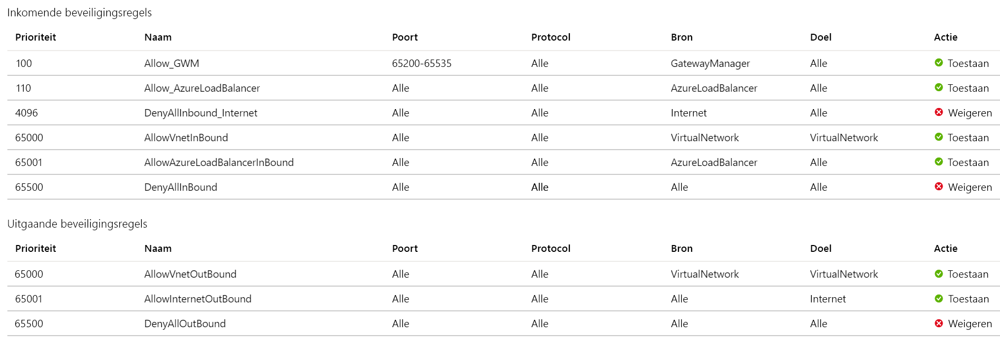

# Veelgestelde vragen over Application Gateway

[!INCLUDE [updated-for-az](../../includes/updated-for-az.md)]

Hier volgen enkele veelgestelde vragen over Azure-toepassing gateway.

## Algemeen

### Wat is Application Gateway?

Azure-toepassing gateway biedt een ADC (Application Delivery controller) als een service. Het biedt diverse Layer 7-functies voor taak verdeling voor uw toepassingen. Deze service is Maxi maal beschikbaar en schaalbaar en volledig beheerd door Azure.

### Welke functies ondersteunt Application Gateway?

Application Gateway ondersteunt automatisch schalen, TLS-offloading en end-to-end TLS, een Web Application Firewall (WAF), sessie affiniteit op basis van cookies, op URL-pad gebaseerde route ring, hosting van meerdere sites en andere functies. Zie [Inleiding tot Application Gateway](application-gateway-introduction.md)voor een volledige lijst met ondersteunde functies.

### Hoe verschillen Application Gateway en Azure Load Balancer?

Application Gateway is een laag 7-load balancer, wat betekent dat het alleen werkt met webverkeer (HTTP, HTTPS, WebSocket en HTTP/2). Het ondersteunt mogelijkheden als TLS-beëindiging, sessie affiniteit op basis van cookies en round robin voor verkeer voor taak verdeling. Load Balancer load-balanceert het verkeer op laag 4 (TCP of UDP).

### Welke protocollen Application Gateway ondersteunen?

Application Gateway ondersteunt HTTP, HTTPS, HTTP/2 en WebSocket.

### Hoe ondersteunt Application Gateway HTTP/2?

Zie [http/2-ondersteuning](https://docs.microsoft.com/azure/application-gateway/configuration-overview#http2-support).

### Welke resources worden ondersteund als onderdeel van een back-end-groep?

Bekijk de [ondersteunde back-end-bronnen](https://docs.microsoft.com/azure/application-gateway/application-gateway-components#backend-pools).

### In welke regio's is Application Gateway beschikbaar?

Application Gateway is beschikbaar in alle regio's van wereld wijd Azure. Het is ook beschikbaar in [Azure China 21vianet](https://www.azure.cn/) en [Azure Government](https://azure.microsoft.com/overview/clouds/government/).

### Is deze implementatie specifiek voor mijn abonnement of wordt deze gedeeld door klanten?

Application Gateway is een speciale implementatie in uw virtuele netwerk.

### Ondersteunt Application Gateway HTTP-naar-HTTPS-omleiding?

Omleiding wordt ondersteund. Zie [Application Gateway omleidings overzicht](application-gateway-redirect-overview.md).

### In welke volg orde worden listeners verwerkt?

Bekijk de [volg orde van de verwerking van de listener](https://docs.microsoft.com/azure/application-gateway/configuration-overview#order-of-processing-listeners).

### Waar vind ik de Application Gateway IP en DNS?

Als u een openbaar IP-adres gebruikt als een eind punt, vindt u de IP-en DNS-informatie over de open bare IP-adres resource. U kunt deze ook vinden in de portal, op de pagina overzicht voor de toepassings gateway. Als u interne IP-adressen gebruikt, vindt u de informatie op de pagina overzicht.

Open voor de v2-SKU de open bare IP-resource en selecteer **configuratie**. Het **DNS-naam label (optioneel)** veld is beschikbaar voor het configureren van de DNS-naam.

### Wat zijn de instellingen voor Keep-Alive time-out en TCP-time-out voor inactiviteit?

*Keep-Alive time-out* bepaalt hoe lang de Application Gateway wacht totdat een client een andere HTTP-aanvraag verzendt naar een permanente verbinding voordat deze opnieuw gebruikt of wordt gesloten. *TCP-time-out voor inactiviteit* bepaalt hoe lang een TCP-verbinding open blijft in het geval van geen activiteit. 

De *time-out voor Keep-Alive* in de Application Gateway v1-sku is 120 seconden en in de v2-sku is 75 seconden. De *time-out voor TCP-inactiviteit* is een standaard waarde van 4 minuten voor het frontend-VIP (Virtual IP) van zowel de v1-als v2 SKU van Application Gateway. U kunt deze waarden niet wijzigen.

### Verandert de IP-of DNS-naam gedurende de levens duur van de toepassings gateway?

In Application Gateway v1 SKU kan het VIP worden gewijzigd als u de toepassings gateway stopt en start. Maar de DNS-naam die aan de toepassings gateway is gekoppeld, wordt niet gewijzigd gedurende de levens duur van de gateway. Omdat de DNS-naam niet wordt gewijzigd, moet u een CNAME-alias gebruiken en deze verwijzen naar het DNS-adres van de toepassings gateway. In Application Gateway v2 SKU kunt u het IP-adres instellen als statisch, zodat de IP-en DNS-naam niet wordt gewijzigd gedurende de levens duur van de toepassings gateway. 

### Ondersteunt Application Gateway statisch IP-adres?

Ja, de SKU van Application Gateway v2 ondersteunt statische open bare IP-adressen. De V1-SKU ondersteunt statische interne Ip's.

### Ondersteunt Application Gateway meerdere open bare IP-adressen op de gateway?

Een toepassings gateway ondersteunt slechts één openbaar IP-adres.

### Hoe groot moet ik mijn subnet voor Application Gateway maken?

Zie [Application Gateway de grootte](https://docs.microsoft.com/azure/application-gateway/configuration-overview#size-of-the-subnet)van het subnet.

### Kan ik meer dan één Application Gateway resource op één subnet implementeren?

Ja. Naast meerdere exemplaren van een bepaalde Application Gateway-implementatie, kunt u een andere unieke Application Gateway resource inrichten voor een bestaand subnet dat een andere Application Gateway resource bevat.

Eén subnet biedt geen ondersteuning voor zowel v2-als v1 Application Gateway-Sku's.

### Ondersteunt Application Gateway V2 door de gebruiker gedefinieerde routes (UDR)?

Ja, maar alleen specifieke scenario's. Zie [Application Gateway configuratie-overzicht](configuration-overview.md#user-defined-routes-supported-on-the-application-gateway-subnet)voor meer informatie.

### Ondersteunt Application Gateway x-doorgestuurd-voor kopteksten?

Ja. Zie [wijzigingen aan een aanvraag](https://docs.microsoft.com/azure/application-gateway/how-application-gateway-works#modifications-to-the-request).

### Hoe lang duurt het om een toepassings gateway te implementeren? Werkt mijn toepassings gateway terwijl deze wordt bijgewerkt?

Het kan Maxi maal 20 minuten duren voordat nieuwe SKU-implementaties van Application Gateway v1 beschikbaar zijn. Wijzigingen in de exemplaar grootte of het aantal zijn niet verstoord en de gateway blijft actief gedurende deze periode.

De meeste implementaties die gebruikmaken van de v2-SKU nemen ongeveer 6 minuten in beslag. Het kan echter langer duren, afhankelijk van het type implementatie. Implementaties over meerdere Beschikbaarheidszones met veel instanties kunnen bijvoorbeeld meer dan 6 minuten duren. 

### Kan ik Exchange Server gebruiken als een back-end met Application Gateway?

Nee. Application Gateway biedt geen ondersteuning voor e-mail protocollen zoals SMTP, IMAP en POP3.

### Zijn er richt lijnen beschikbaar om te migreren van de V1-SKU naar de v2-SKU?

Ja. Voor meer informatie raadpleegt u [Azure-toepassing gateway en Web Application firewall van v1 naar v2](migrate-v1-v2.md).

### Wordt de Application Gateway v1-SKU nog steeds ondersteund?

Ja. De SKU van Application Gateway v1 wordt nog steeds ondersteund. Het wordt echter ten zeerste aanbevolen om over te stappen op v2 om te profiteren van de functie-updates in die SKU. Zie voor meer informatie automatisch [schalen en zone-redundante Application Gateway v2](application-gateway-autoscaling-zone-redundant.md).

### Ondersteunt Application Gateway v2 proxy aanvragen met NTLM-verificatie?

Nee. Application Gateway v2 biedt nog geen ondersteuning voor proxy aanvragen met NTLM-verificatie.

### Ondersteunt Application Gateway kenmerk SameSite-cookie?
Ja, de [V80-update](https://chromiumdash.appspot.com/schedule) van de [chroom browser](https://www.chromium.org/Home) heeft een mandaat geïntroduceerd op http-cookies zonder SameSite kenmerk dat moet worden behandeld als SameSite = slordig. Dit betekent dat de Application Gateway affiniteits cookie niet wordt verzonden door de browser in een context van een derde partij. 

Ter ondersteuning van dit scenario wordt door Application Gateway een andere cookie met de naam *ApplicationGatewayAffinityCORS* , naast de bestaande *ApplicationGatewayAffinity* cookie injecteerd.  Deze cookies zijn vergelijkbaar, maar aan de *ApplicationGatewayAffinityCORS* -cookie zijn twee meer kenmerken toegevoegd: *SameSite = none; Beveiligd*. Deze kenmerken behouden plak sessies, zelfs voor cross-Origin-aanvragen. Zie de [sectie affiniteit op basis van cookies](configuration-overview.md#cookie-based-affinity) voor meer informatie.

## Prestaties

### Hoe ondersteunt Application Gateway hoge Beschik baarheid en schaal baarheid?

De Application Gateway v1-SKU ondersteunt scenario's met hoge Beschik baarheid wanneer u twee of meer exemplaren hebt geïmplementeerd. Azure distribueert deze instanties over update-en fout domeinen om ervoor te zorgen dat de exemplaren niet allemaal op hetzelfde moment worden uitgevoerd. De V1-SKU ondersteunt schaal baarheid door meerdere exemplaren van dezelfde gateway toe te voegen om de belasting te delen.

De v2-SKU zorgt er automatisch voor dat nieuwe instanties worden verspreid over fout domeinen en update domeinen. Als u zone redundantie kiest, worden de nieuwste instanties ook verspreid over de beschik bare zones om zonegebonden-fout tolerantie aan te bieden.

### Hoe kan ik een DR-scenario in data centers behaalt met behulp van Application Gateway?

Gebruik Traffic Manager om verkeer te verdelen over meerdere toepassings gateways in verschillende data centers.

### Ondersteunt Application Gateway automatisch schalen?

Ja, de SKU van Application Gateway v2 ondersteunt automatisch schalen. Zie voor meer informatie automatisch [schalen en zone-redundante Application Gateway](application-gateway-autoscaling-zone-redundant.md).

### Leidt hand matig of automatisch omhoog of omlaag schalen tot uitval tijd?

Nee. Instanties worden gedistribueerd over upgrade domeinen en fout domeinen.

### Ondersteunt Application Gateway verbindings afvoer?

Ja. U kunt de verbinding verbreken instellen om leden binnen een back-end-groep zonder onderbreking te wijzigen. Zie voor meer informatie de [sectie verbindings afvoer van Application Gateway](features.md#connection-draining).

### Kan ik de instantie grootte wijzigen van gemiddeld in groot, zonder onderbreking?

Ja.

## Configuratie

### Wordt Application Gateway altijd geïmplementeerd in een virtueel netwerk?

Ja. Application Gateway wordt altijd geïmplementeerd in een subnet van een virtueel netwerk. Dit subnet kan alleen toepassings gateways bevatten. Zie [vereisten voor virtuele netwerken en subnetten](https://docs.microsoft.com/azure/application-gateway/configuration-overview#azure-virtual-network-and-dedicated-subnet)voor meer informatie.

### Kan Application Gateway communiceren met exemplaren buiten het virtuele netwerk of buiten het bijbehorende abonnement?

Als u een IP-verbinding hebt, kan Application Gateway communiceren met exemplaren buiten het virtuele netwerk waarin het zich bevindt. Application Gateway kunt ook communiceren met exemplaren buiten het abonnement waarin deze zich bevinden. Als u interne Ip's als back-endadresgroep wilt gebruiken, gebruik dan [virtuele netwerk peering](../virtual-network/virtual-network-peering-overview.md) of [Azure VPN gateway](../vpn-gateway/vpn-gateway-about-vpngateways.md).

### Kan ik iets anders in het subnet van de toepassings Gateway implementeren?

Nee. Maar u kunt ook andere toepassings gateways implementeren in het subnet.

### Worden netwerk beveiligings groepen ondersteund op het subnet van de toepassings gateway?

Zie [netwerk beveiligings groepen in het Application Gateway subnet](https://docs.microsoft.com/azure/application-gateway/configuration-overview#network-security-groups-on-the-application-gateway-subnet).

### Ondersteunt het subnet van de toepassings gateway door de gebruiker gedefinieerde routes?

Zie door [de gebruiker gedefinieerde routes die worden ondersteund in het Application Gateway subnet](https://docs.microsoft.com/azure/application-gateway/configuration-overview#user-defined-routes-supported-on-the-application-gateway-subnet).

### Wat zijn de limieten voor Application Gateway? Kan ik deze limieten verhogen?

Zie [Application Gateway limieten](../azure-resource-manager/management/azure-subscription-service-limits.md#application-gateway-limits).

### Kan ik Application Gateway gelijktijdig gebruiken voor zowel extern als intern verkeer?

Ja. Application Gateway ondersteunt één intern IP-adres en één extern IP-adres per toepassings gateway.

### Ondersteunt Application Gateway peering voor virtuele netwerken?

Ja. Met peering voor virtuele netwerken kunt u verkeer verdelen in andere virtuele netwerken.

### Kan ik praten met on-premises servers wanneer ze zijn verbonden via ExpressRoute of VPN-tunnels?

Ja, zolang verkeer is toegestaan.

### Kan één back-end-pool veel toepassingen op verschillende poorten gebruiken?

Micro service-architectuur wordt ondersteund. Als u op verschillende poorten wilt testen, moet u meerdere HTTP-instellingen configureren.

### Ondersteunen aangepaste tests joker tekens of regex op antwoord gegevens?

Nee. 

### Hoe worden routerings regels verwerkt in Application Gateway?

Zie [volg orde van verwerkings regels](https://docs.microsoft.com/azure/application-gateway/configuration-overview#order-of-processing-rules).

### Wat is het veld host voor aangepaste tests?

In het veld host geeft u de naam op voor het verzenden van de test wanneer u meerdere locaties op Application Gateway hebt geconfigureerd. Gebruik anders ' 127.0.0.1 '. Deze waarde wijkt af van de hostnaam van de virtuele machine. De notatie is \<protocol\> :// \<host\> : \<port\> \<path\> .

### Kan ik Application Gateway toegang tot slechts enkele bron-IP-adressen toestaan?

Ja. Zie [toegang tot specifieke bron-ip's beperken](https://docs.microsoft.com/azure/application-gateway/configuration-overview#allow-application-gateway-access-to-a-few-source-ips).

### Kan ik dezelfde poort gebruiken voor zowel open bare als privé gerichte listeners?

Nee.

### Ondersteunt Application Gateway IPv6?

Application Gateway v2 biedt momenteel geen ondersteuning voor IPv6. Het kan worden gebruikt in een dual stack VNet met alleen IPv4, maar het gateway-subnet moet alleen IPv4 zijn. Application Gateway v1 biedt geen ondersteuning voor dual stack-VNets. 

### Application Gateway v2 met alleen het persoonlijke frontend-IP-adres Hoe kan ik gebruiken?

Application Gateway v2 biedt momenteel geen ondersteuning voor de modus Private IP. Het ondersteunt de volgende combi Naties
* Privé-IP en open bare IP
* Alleen openbaar IP

Maar als u Application Gateway v2 wilt gebruiken met alleen particulier IP-adres, kunt u het onderstaande proces volgen:
1. Een Application Gateway maken met zowel het open bare als het persoonlijke frontend-IP-adres
2. Maak geen listeners voor het open bare frontend-IP-adres. Application Gateway luistert niet naar verkeer op het open bare IP-adres als er geen listeners worden gemaakt.
3. Maak en koppel een [netwerk beveiligings groep](https://docs.microsoft.com/azure/virtual-network/security-overview) voor het subnet Application Gateway met de volgende configuratie in volg orde van prioriteit:
    
    a. Sta verkeer toe van de bron als **GatewayManager** -service label en-bestemming als **een** doel poort van **65200-65535**. Dit poort bereik is vereist voor de communicatie van Azure-infra structuur. Deze poorten worden beveiligd (vergrendeld) door verificatie via certificaat. Externe entiteiten, met inbegrip van de gebruikers beheerders van de gateway, kunnen geen wijzigingen op deze eind punten initiëren zonder dat de juiste certificaten aanwezig zijn
    
    b. Verkeer toestaan van bron als **AzureLoadBalancer** -service label en bestemming en doel poort **Any**
    
    c. Alle binnenkomend verkeer van de bron als de code van de **Internet** -service en de doel-en doel poort als **elk**te weigeren. Geef deze regel de *minste prioriteit* in de regels voor binnenkomende verbindingen
    
    d. Behoud de standaard regels zoals het toestaan van VirtualNetwork inkomend zodat de toegang op privé-IP-adres niet wordt geblokkeerd
    
    e. De uitgaande Internet verbinding kan niet worden geblokkeerd. Anders worden er problemen met logboek registratie, metrische gegevens, enzovoort.

Voor beeld van NSG-configuratie voor alleen persoonlijke IP-toegang: 

## Configuratie-TLS

### Welke certificaten ondersteunt Application Gateway?

Application Gateway ondersteunt zelfondertekende certificaten, certificaten van CERTIFICERINGs instanties, certificaten voor uitgebreide validatie (EV) en Joker certificaten.

### Welke coderings suites ondersteunt Application Gateway?

Application Gateway ondersteunt de volgende coderings suites. 

- TLS_ECDHE_RSA_WITH_AES_256_GCM_SHA384
- TLS_ECDHE_RSA_WITH_AES_128_GCM_SHA256
- TLS_ECDHE_RSA_WITH_AES_256_CBC_SHA384
- TLS_ECDHE_RSA_WITH_AES_128_CBC_SHA256
- TLS_ECDHE_RSA_WITH_AES_256_CBC_SHA
- TLS_ECDHE_RSA_WITH_AES_128_CBC_SHA
- TLS_DHE_RSA_WITH_AES_256_GCM_SHA384
- TLS_DHE_RSA_WITH_AES_128_GCM_SHA256
- TLS_DHE_RSA_WITH_AES_256_CBC_SHA
- TLS_DHE_RSA_WITH_AES_128_CBC_SHA
- TLS_RSA_WITH_AES_256_GCM_SHA384
- TLS_RSA_WITH_AES_128_GCM_SHA256
- TLS_RSA_WITH_AES_256_CBC_SHA256
- TLS_RSA_WITH_AES_128_CBC_SHA256
- TLS_RSA_WITH_AES_256_CBC_SHA
- TLS_RSA_WITH_AES_128_CBC_SHA
- TLS_ECDHE_ECDSA_WITH_AES_256_GCM_SHA384
- TLS_ECDHE_ECDSA_WITH_AES_128_GCM_SHA256
- TLS_ECDHE_ECDSA_WITH_AES_256_CBC_SHA384
- TLS_ECDHE_ECDSA_WITH_AES_128_CBC_SHA256
- TLS_ECDHE_ECDSA_WITH_AES_256_CBC_SHA
- TLS_ECDHE_ECDSA_WITH_AES_128_CBC_SHA
- TLS_DHE_DSS_WITH_AES_256_CBC_SHA256
- TLS_DHE_DSS_WITH_AES_128_CBC_SHA256
- TLS_DHE_DSS_WITH_AES_256_CBC_SHA
- TLS_DHE_DSS_WITH_AES_128_CBC_SHA
- TLS_RSA_WITH_3DES_EDE_CBC_SHA
- TLS_DHE_DSS_WITH_3DES_EDE_CBC_SHA

Zie [TLS-beleids versies en coderings suites configureren op Application Gateway](application-gateway-configure-ssl-policy-powershell.md)voor meer informatie over het aanpassen van TLS-opties.

### Ondersteunt Application Gateway het opnieuw versleutelen van verkeer naar de back-end?

Ja. Application Gateway ondersteunt TLS-offload en end-to-end TLS, waarmee het verkeer wordt opnieuw versleuteld naar de back-end.

### Kan ik TLS-beleid configureren voor het beheren van TLS-protocol versies?

Ja. U kunt Application Gateway zodanig configureren dat TLS 1.0, TLS 1.1 en TLS 1.2 worden geweigerd. SSL 2,0 en 3,0 zijn standaard al uitgeschakeld en kunnen niet worden geconfigureerd.

### Kan ik coderings suites en beleids volgorde configureren?

Ja. In Application Gateway kunt u [coderings suites configureren](application-gateway-ssl-policy-overview.md). Schakel ten minste één van de volgende coderings suites in om een aangepast beleid te definiëren. 

* TLS_ECDHE_RSA_WITH_AES_128_GCM_SHA256 
* TLS_ECDHE_RSA_WITH_AES_128_CBC_SHA256
* TLS_DHE_RSA_WITH_AES_128_GCM_SHA256
* TLS_RSA_WITH_AES_128_GCM_SHA256
* TLS_RSA_WITH_AES_256_CBC_SHA256
* TLS_RSA_WITH_AES_128_CBC_SHA256

Application Gateway maakt gebruik van SHA256 voor back-end-beheer.

### Hoeveel TLS/SSL-certificaten ondersteunt Application Gateway?

Application Gateway ondersteunt Maxi maal 100 TLS/SSL-certificaten.

### Hoeveel authenticatie certificaten voor back-end versleuteling Application Gateway ondersteuning?

Application Gateway ondersteunt Maxi maal 100 verificatie certificaten.

### Biedt Application Gateway systeem eigen integratie met Azure Key Vault?

Ja, de SKU van Application Gateway v2 ondersteunt Key Vault. Zie [TLS Terminate with Key Vault certificates](key-vault-certs.md)(Engelstalig) voor meer informatie.

### HTTPS-listeners Hoe kan ik configureren voor. com-en .net-sites? 

Voor meerdere op een domein gebaseerde (op een host gebaseerde) route ring kunt u multi site-listeners maken, listeners instellen die HTTPS gebruiken als protocol en de listeners koppelen aan de routerings regels. Zie voor meer informatie [meerdere sites hosten met behulp van Application Gateway](https://docs.microsoft.com/azure/application-gateway/multiple-site-overview).

### Kan ik speciale tekens in het wacht woord voor het pfx-bestand gebruiken?

Nee, gebruik alleen alfanumerieke tekens in het wacht woord voor het pfx-bestand.

## Configuratie-ingangs controller voor AKS

### Wat is een ingangs controller?

Met Kubernetes kan het maken van `deployment` en `service` de resource een groep van Peul intern in het cluster weer geven. Om dezelfde service extern beschikbaar te maken, wordt een [`Ingress`](https://kubernetes.io/docs/concepts/services-networking/ingress/) resource gedefinieerd die taak verdeling, TLS-beëindiging en op naam gebaseerde virtuele hosting biedt.
Om aan deze `Ingress` resource te voldoen, moet een ingangs controller worden geluisterd naar wijzigingen in `Ingress` resources en wordt het Load Balancer beleid geconfigureerd.

Met de Application Gateway ingangs controller kan [Azure-toepassing gateway](https://azure.microsoft.com/services/application-gateway/) worden gebruikt als binnenkomend verkeer voor een [Azure Kubernetes-service](https://azure.microsoft.com/services/kubernetes-service/) , ook wel een AKS-cluster genoemd.

### Kan één exemplaar van een ingangs controller meerdere toepassings gateways beheren?

Op dit moment kan slechts één exemplaar van de ingangs controller aan een Application Gateway worden gekoppeld.

## Diagnostische gegevens en logboekregistratie

### Welke typen logboeken bevat Application Gateway?

Application Gateway biedt drie logboeken: 

* **ApplicationGatewayAccessLog**: het toegangs logboek bevat elke aanvraag die is verzonden naar het front Application Gateway-front-end. De gegevens omvatten het IP-adres van de beller, de aangevraagde URL, reactie latentie, retour code en bytes in en uit. Het bevat één record per toepassings gateway.
* **ApplicationGatewayPerformanceLog**: in het prestatie logboek worden prestatie gegevens voor elke toepassings gateway vastgelegd. De informatie omvat de door Voer in bytes, totaal aantal geleverde aanvragen, aantal mislukte aanvragen en een gezonde en slechte back-end van een backend-exemplaar.
* **ApplicationGatewayFirewallLog**: voor toepassings gateways die u CONFIGUREERT met WAF, bevat het logboek van de firewall aanvragen die zijn geregistreerd via de detectie modus of de modus voor preventie.

Alle logboeken worden elke 60 seconden verzameld. Zie voor meer informatie [back-end status, Diagnostische logboeken en metrische gegevens voor Application Gateway](application-gateway-diagnostics.md).

### Hoe kan ik weet of de leden van de back-endadresgroep in orde zijn?

Controleer de status met behulp van de Power shell-cmdlet `Get-AzApplicationGatewayBackendHealth` of de portal. Zie [Application Gateway Diagnostics (diagnostische](application-gateway-diagnostics.md)gegevens) voor meer informatie.

### Wat is het Bewaar beleid voor de diagnostische logboeken?

Diagnostische logboeken stroomt naar het opslag account van de klant. Klanten kunnen het Bewaar beleid instellen op basis van hun voor keur. Diagnostische logboeken kunnen ook worden verzonden naar een Event Hub-of Azure Monitor-Logboeken. Zie [Application Gateway Diagnostics (diagnostische](application-gateway-diagnostics.md)gegevens) voor meer informatie.

### Hoe kan ik audit logboeken voor Application Gateway ophalen?

Selecteer in de portal op de menu-Blade van een toepassings gateway het **activiteiten logboek** voor toegang tot het controle logboek. 

### Kan ik waarschuwingen instellen met Application Gateway?

Ja. In Application Gateway worden waarschuwingen voor metrische gegevens geconfigureerd. Zie [Application Gateway metrische gegevens](https://docs.microsoft.com/azure/application-gateway/application-gateway-metrics) en [waarschuwings meldingen ontvangen](../monitoring-and-diagnostics/insights-receive-alert-notifications.md)voor meer informatie.

### Hoe kan ik verkeers statistieken voor Application Gateway analyseren?

U kunt toegangs logboeken op verschillende manieren weer geven en analyseren. Gebruik Azure Monitor-logboeken, Excel, Power BI, enzovoort.

U kunt ook een resource manager-sjabloon gebruiken waarmee de populaire [GoAccess](https://goaccess.io/) log analyzer voor Application Gateway Access-Logboeken wordt geïnstalleerd en uitgevoerd. GoAccess biedt waardevolle statistieken voor HTTP-verkeer, zoals unieke bezoekers, aangevraagde bestanden, hosts, besturings systemen, browsers en HTTP-status codes. Voor meer informatie, in GitHub, raadpleegt u het [Leesmij-bestand in de map Resource Manager-sjabloon](https://aka.ms/appgwgoaccessreadme).

### Wat kan ertoe leiden dat de status van de back-end wordt weer gegeven?

Normaal gesp roken ziet u een onbekende status wanneer de toegang tot de back-end wordt geblokkeerd door een netwerk beveiligings groep (NSG), aangepaste DNS of door de gebruiker gedefinieerde route ring (UDR) op het toepassings gateway-subnet. Zie voor meer informatie [status van back-end, diagnostische logboek registratie en metrische gegevens voor Application Gateway](application-gateway-diagnostics.md).

### Is er een geval waarin NSG-stroom logboeken geen toegestaan verkeer weer geven?

Ja. Als uw configuratie overeenkomt met het volgende scenario, ziet u geen toegestaan verkeer in uw NSG-stroom logboeken:
- U hebt Application Gateway v2 geïmplementeerd
- U hebt een NSG op het toepassings gateway-subnet
- U hebt NSG-stroom logboeken ingeschakeld op die NSG

### Application Gateway v2 met alleen het persoonlijke frontend-IP-adres Hoe kan ik gebruiken?

Application Gateway v2 biedt momenteel geen ondersteuning voor de modus Private IP. Het ondersteunt de volgende combi Naties
* Privé-IP en open bare IP
* Alleen openbaar IP

Maar als u Application Gateway v2 wilt gebruiken met alleen particulier IP-adres, kunt u het onderstaande proces volgen:
1. Een Application Gateway maken met zowel het open bare als het persoonlijke frontend-IP-adres
2. Maak geen listeners voor het open bare frontend-IP-adres. Application Gateway luistert niet naar verkeer op het open bare IP-adres als er geen listeners worden gemaakt.
3. Maak en koppel een [netwerk beveiligings groep](https://docs.microsoft.com/azure/virtual-network/security-overview) voor het subnet Application Gateway met de volgende configuratie in volg orde van prioriteit:
    
    a. Sta verkeer toe van de bron als **GatewayManager** -service label en-bestemming als **een** doel poort van **65200-65535**. Dit poort bereik is vereist voor de communicatie van Azure-infra structuur. Deze poorten worden beveiligd (vergrendeld) door verificatie via certificaat. Externe entiteiten, met inbegrip van de gebruikers beheerders van de gateway, kunnen geen wijzigingen op deze eind punten initiëren zonder dat de juiste certificaten aanwezig zijn
    
    b. Verkeer toestaan van bron als **AzureLoadBalancer** -service label en-doel **Any** poort
    
    c. Alle binnenkomend verkeer van de bron als de tag en de doel poort van **de** **Internet verbinding** weigeren. Geef deze regel de *minste prioriteit* in de regels voor binnenkomende verbindingen
    
    d. Behoud de standaard regels zoals het toestaan van VirtualNetwork inkomend zodat de toegang op privé-IP-adres niet wordt geblokkeerd
    
    e. De uitgaande Internet verbinding kan niet worden geblokkeerd. Anders worden er problemen met logboek registratie, metrische gegevens, enzovoort.

Voor beeld van NSG-configuratie voor alleen persoonlijke IP-toegang: 

## Volgende stappen

Zie [Wat is Azure-toepassing gateway?](overview.md)voor meer informatie over Application Gateway.
