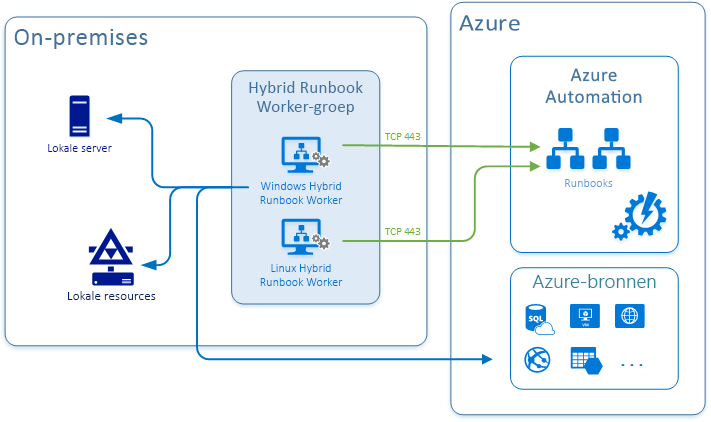

# Overzicht van Hybrid Runbook Worker

Runbooks in Azure Automation hebben mogelijk geen toegang tot resources in andere Clouds of in uw on-premises omgeving omdat ze worden uitgevoerd op het Azure-Cloud platform. U kunt de functie Hybrid Runbook Worker van Azure Automation gebruiken om runbooks rechtstreeks uit te voeren op de computer waarop de rol wordt gehost en aan resources in de omgeving om deze lokale resources te beheren. Runbooks worden opgeslagen en beheerd in Azure Automation en vervolgens aan een of meer toegewezen computers geleverd.

In de volgende afbeelding ziet u deze functionaliteit:

Een Hybrid Runbook Worker kan worden uitgevoerd op het Windows-of Linux-besturings systeem. Dit is afhankelijk van de [log Analytics agent](../azure-monitor/platform/log-analytics-agent.md) rapporteert aan een Azure monitor [log Analytics-werk ruimte](../azure-monitor/platform/design-logs-deployment.md). De werk ruimte is niet alleen voor het bewaken van de computer voor het ondersteunde besturings systeem, maar ook voor het downloaden van de onderdelen die vereist zijn voor de Hybrid Runbook Worker.

Elke Hybrid Runbook Worker is lid van een Hybrid Runbook Worker groep die u opgeeft wanneer u de Agent installeert. Een groep kan één agent bevatten, maar u kunt meerdere agents in een groep installeren voor een hoge Beschik baarheid. Elke computer kan één Hybrid worker-rapportage hosten aan één Automation-account.

Wanneer u een runbook op een Hybrid Runbook Worker start, geeft u de groep op waarop deze wordt uitgevoerd. Elke werk nemer in de groep pollt Azure Automation om te zien of er taken beschikbaar zijn. Als een taak beschikbaar is, haalt de eerste werk nemer de taak op. De verwerkings tijd van de taken wachtrij is afhankelijk van het hardwareprofiel en de belasting van de Hybrid Worker. U kunt een bepaalde werk nemer niet opgeven.

Gebruik een Hybrid Runbook Worker in plaats van een [Azure-sandbox](automation-runbook-execution.md#runbook-execution-environment) omdat deze niet veel van de sandbox- [limieten](../azure-resource-manager/management/azure-subscription-service-limits.md#automation-limits) voor schijf ruimte, geheugen of netwerk sockets bevat. De limieten voor een Hybrid worker zijn alleen gerelateerd aan de eigen resources van de werk nemer.

> [!NOTE]
> Hybrid Runbook Workers worden niet beperkt door de omvang van de [reële share](automation-runbook-execution.md#fair-share) tijd die Azure-sandboxes hebben.

## Installatie van Hybrid Runbook Worker

Het proces voor het installeren van een Hybrid Runbook Worker is afhankelijk van het besturings systeem. In de volgende tabel worden de implementatie typen gedefinieerd.

|Besturingssysteem  |Implementatie typen  |
|---------|---------|
|Windows     | [Geautomatiseerd](automation-windows-hrw-install.md#automated-deployment) [Handmatig](automation-windows-hrw-install.md#manual-deployment)        |
|Linux     | [Python](automation-linux-hrw-install.md#install-a-linux-hybrid-runbook-worker)        |

De aanbevolen installatie methode is om een Azure Automation runbook te gebruiken om het proces van het configureren van een Windows-computer volledig te automatiseren. Als dat niet het geval is, kunt u een stapsgewijze procedure volgen om de rol hand matig te installeren en te configureren. Voor Linux-machines voert u een python-script uit om de agent op de computer te installeren.

## Netwerk planning

Het Hybrid Runbook Worker om verbinding te maken met Azure Automation, moet toegang hebben tot het poort nummer en de Url's die in deze sectie worden beschreven. De werk nemer moet ook toegang hebben tot de [poorten en url's die vereist zijn voor de log Analytics-agent](../azure-monitor/platform/agent-windows.md) om verbinding te maken met de Azure monitor log Analytics-werk ruimte.

[!INCLUDE [azure-monitor-log-analytics-rebrand](../../includes/azure-monitor-log-analytics-rebrand.md)]

De volgende poort en Url's zijn vereist voor de Hybrid Runbook Worker:

* Poort: alleen TCP 443 vereist voor uitgaande internet toegang
* Globale URL:`*.azure-automation.net`
* Globale URL van US Gov-Virginia:`*.azure-automation.us`
* Agent service:`https://<workspaceId>.agentsvc.azure-automation.net`

Als u een Automation-account hebt dat is gedefinieerd voor een specifieke regio, kunt u Hybrid Runbook Worker communicatie beperken tot dat regionale Data Center. Controleer de [DNS-records die door Azure Automation worden gebruikt](how-to/automation-region-dns-records.md) voor de vereiste DNS-records.

### Gebruik van proxy server

Als u een proxy server gebruikt voor communicatie tussen Azure Automation en computers waarop de Log Analytics agent wordt uitgevoerd, moet u ervoor zorgen dat de juiste resources toegankelijk zijn. De time-out voor aanvragen van de Hybrid Runbook Worker-en Automation-Services is 30 seconden. Na drie pogingen mislukt een aanvraag.

### Gebruik van Firewall

Als u een firewall gebruikt om de toegang tot internet te beperken, moet u de firewall configureren om toegang toe te staan. Als u de Log Analytics-gateway als een proxy gebruikt, moet u ervoor zorgen dat deze is geconfigureerd voor Hybrid Runbook Workers. Zie [de log Analytics-gateway configureren voor Hybrid Automation-werk](../azure-monitor/platform/gateway.md)rollen.

### Servicetags

Azure Automation ondersteunt de service tags voor het virtuele Azure-netwerk, te beginnen met de service label [GuestAndHybridManagement](../virtual-network/service-tags-overview.md). U kunt service tags gebruiken voor het definiëren van netwerk toegangs beheer voor [netwerk beveiligings groepen](../virtual-network/security-overview.md#security-rules) of [Azure firewall](../firewall/service-tags.md). Service tags kunnen worden gebruikt in plaats van specifieke IP-adressen wanneer u beveiligings regels maakt. Door het opgeven van de servicetag naam **GuestAndHybridManagement** in het juiste bron-of doel veld van een regel, kunt u het verkeer voor de Automation-Service toestaan of weigeren. Deze servicetag biedt geen ondersteuning voor het toestaan van nauw keurigere controle door IP-adresbereiken te beperken tot een bepaalde regio.

Het servicetag voor de Azure Automation-Service biedt alleen IP-adressen die worden gebruikt voor de volgende scenario's:

* Webhooks activeren vanuit uw virtuele netwerk
* Hybrid Runbook Workers of status configuratie agenten op uw VNet toestaan om te communiceren met de Automation-Service

>[!NOTE]
>De **GuestAndHybridManagement** van de service tags biedt momenteel geen ondersteuning voor het uitvoeren van een runbook-taak in een Azure-sandbox, alleen rechtstreeks op een Hybrid Runbook Worker.

## Ondersteuning voor impact niveau 5 (IL5)

Azure Automation Hybrid Runbook Worker kan worden gebruikt in Azure Government voor het ondersteunen van impact niveau 5-workloads in een van de volgende twee configuraties:

* [Geïsoleerde virtuele machine](../azure-government/documentation-government-impact-level-5.md#isolated-virtual-machines). Wanneer ze worden geïmplementeerd, gebruiken ze de gehele fysieke host voor die VM, waardoor het vereiste isolatie niveau is vereist voor de ondersteuning van IL5-workloads.

* [Exclusieve Azure-hosts](../azure-government/documentation-government-impact-level-5.md#azure-dedicated-hosts), die fysieke servers bieden die kunnen fungeren als host voor een of meer virtuele machines, toegewezen aan één Azure-abonnement.

>[!NOTE]
>Reken isolatie via de Hybrid Runbook Worker rol is beschikbaar voor Clouds van Azure en Amerikaanse overheids instanties. 

## Updatebeheer op Hybrid Runbook Worker

Als Azure Automation [updatebeheer](update-management/update-mgmt-overview.md) is ingeschakeld, wordt een computer die is verbonden met uw log Analytics-werk ruimte automatisch geconfigureerd als een Hybrid Runbook Worker. Elke werk nemer kan runbooks ondersteunen die gericht zijn op update beheer.

Een op deze manier geconfigureerde machine is niet geregistreerd met Hybrid Runbook Worker groepen die al zijn gedefinieerd in uw Automation-account. U kunt de machine toevoegen aan een Hybrid Runbook Worker groep, maar u moet hetzelfde account gebruiken voor zowel Updatebeheer als het lidmaatschap van de Hybrid Runbook Worker-groep. Deze functionaliteit is toegevoegd aan versie 7.2.12024.0 van Hybrid Runbook Worker.

### Updatebeheer adressen voor Hybrid Runbook Worker

Naast de standaard adressen en poorten die vereist zijn voor de Hybrid Runbook Worker, heeft Updatebeheer aanvullende vereisten voor netwerk configuratie beschreven onder het gedeelte [netwerk planning](update-management/update-mgmt-overview.md#ports) .

## Azure Automation status configuratie op een Hybrid Runbook Worker

U kunt [Azure Automation status configuratie](automation-dsc-overview.md) uitvoeren op een Hybrid Runbook Worker. Als u de configuratie wilt beheren van servers die ondersteuning bieden voor de Hybrid Runbook Worker, moet u de servers als DSC-knoop punten toevoegen. Zie [machines inschakelen voor beheer door Azure Automation status configuratie](automation-dsc-onboarding.md).

## Runbooks op een Hybrid Runbook Worker

Mogelijk beschikt u over runbooks die resources op de lokale computer beheren of worden uitgevoerd op resources in de lokale omgeving waar een Hybrid Runbook Worker wordt geïmplementeerd. In dit geval kunt u ervoor kiezen om uw runbooks uit te voeren op de Hybrid worker in plaats van een Automation-account. Runbooks die worden uitgevoerd op een Hybrid Runbook Worker, zijn identiek in de structuur van de mappen die u uitvoert in het Automation-account. Zie [Runbooks uitvoeren op een Hybrid Runbook worker](automation-hrw-run-runbooks.md).

### Hybrid Runbook Worker taken

Hybrid Runbook Worker taken worden uitgevoerd onder het lokale **systeem** account op Windows of het [nxautomation-account](automation-runbook-execution.md#log-analytics-agent-for-linux) in Linux. Azure Automation verwerkt taken van Hybrid Runbook Workers enigszins anders dan taken die worden uitgevoerd in azure-sandboxes. Zie [Runbook Execution Environment](automation-runbook-execution.md#runbook-execution-environment).

Als de Hybrid Runbook Worker-hostcomputer opnieuw wordt opgestart, wordt elke actieve Runbook-taak opnieuw gestart vanaf het begin of van het laatste controle punt voor Power shell-werk stroom runbooks. Nadat een runbook-taak meer dan drie keer opnieuw is opgestart, wordt deze onderbroken.

### Runbook-machtigingen voor een Hybrid Runbook Worker

Omdat ze toegang hebben tot niet-Azure-resources, kunnen runbooks die worden uitgevoerd op een Hybrid Runbook Worker niet gebruikmaken van het verificatie mechanisme dat doorgaans wordt gebruikt door runbooks die verifiëren naar Azure-resources. Een runbook biedt een eigen verificatie voor lokale bronnen of configureert verificatie met behulp [van beheerde identiteiten voor Azure-resources](../active-directory/managed-identities-azure-resources/tutorial-windows-vm-access-arm.md#grant-your-vm-access-to-a-resource-group-in-resource-manager). U kunt ook een uitvoeren als-account opgeven om een gebruikers context te bieden voor alle runbooks.

## Volgende stappen

* Zie [Runbooks uitvoeren op een Hybrid Runbook worker](automation-hrw-run-runbooks.md)voor meer informatie over het configureren van uw runbooks om processen te automatiseren in uw on-premises Data Center of andere cloud omgeving.

* Zie [problemen met Hybrid Runbook worker oplossen](troubleshoot/hybrid-runbook-worker.md#general)voor meer informatie over het oplossen van problemen met uw Hybrid Runbook Workers.
