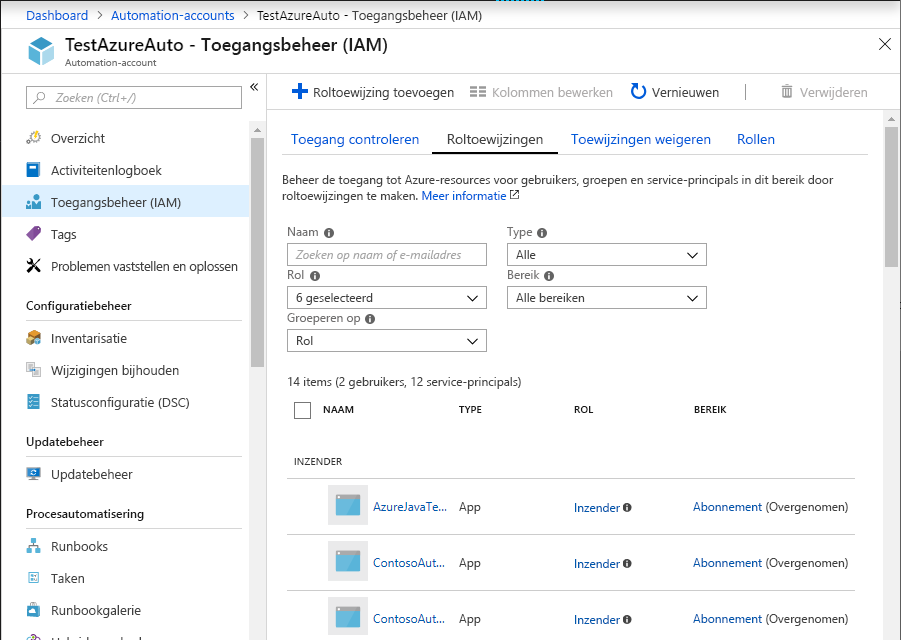
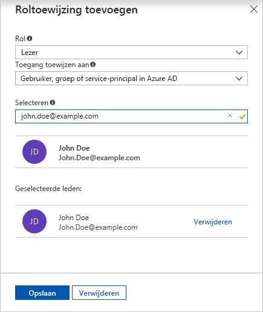
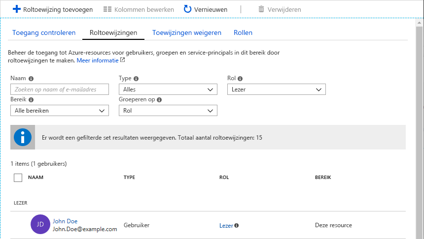
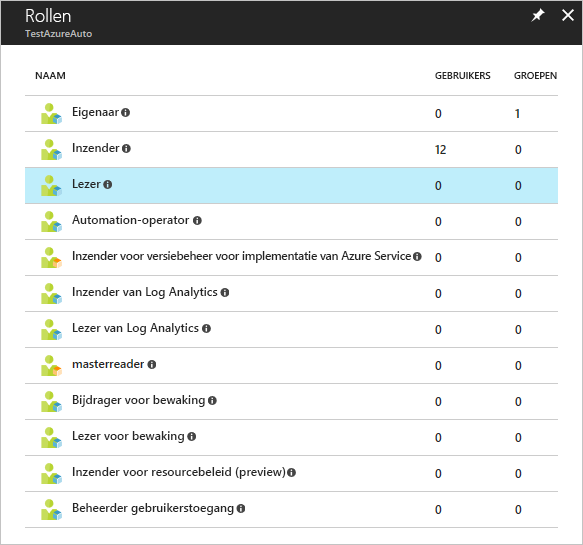
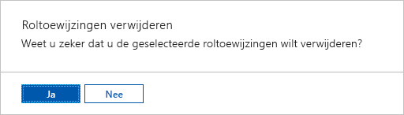
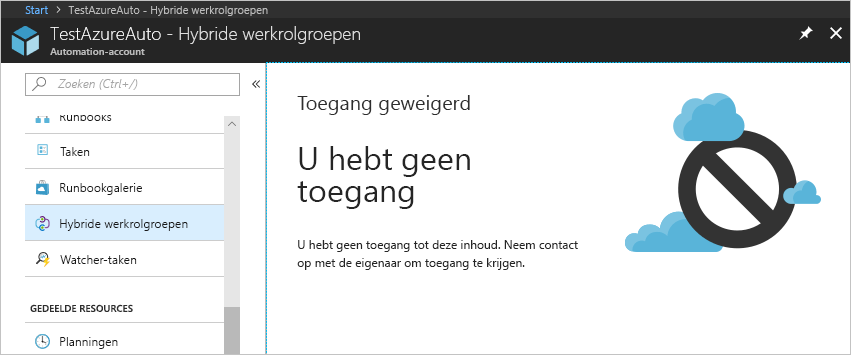
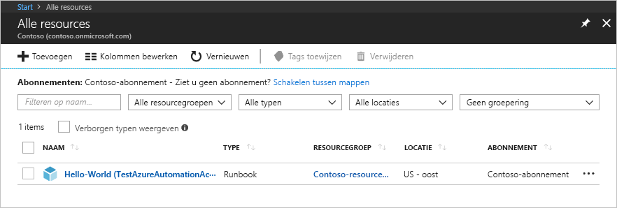
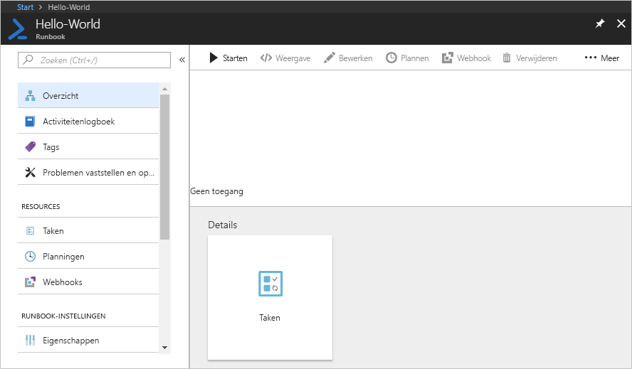

# <a name="manage-role-permissions-and-security"></a>Rolmachtigingen en beveiliging beheren

Met op rollen gebaseerd toegangsbeheer (RBAC) beschikt u over toegangsbeheer voor Azure-resources. Met [RBAC](../role-based-access-control/overview.md)kunt u taken binnen uw team scheiden en alleen de hoeveelheid toegang verlenen aan gebruikers, groepen en toepassingen die ze nodig hebben om hun taken uit te voeren. U kunt op rollen gebaseerde toegang verlenen aan gebruikers met behulp van de Azure Portal, Azure-opdracht regel Programma's of Azure Management-Api's.

## <a name="roles-in-automation-accounts"></a>Rollen in Automation-accounts

In Azure Automation wordt toegang verleend door de juiste RBAC-rol toe te wijzen aan gebruikers, groepen en toepassingen bij het Automation-accountbereik. Hieronder vindt u de ingebouwde rollen die worden ondersteund met een Automation-account:

| **Role** | **Beschrijving** |
|:--- |:--- |
| Eigenaar |De rol eigenaar biedt toegang tot alle resources en acties binnen een Automation-account, inclusief toegang tot andere gebruikers, groepen en toepassingen om het Automation-account te beheren. |
| Inzender |De rol van Bijdrager maakt het mogelijk om alles te beheren, behalve de toegangsrechten van andere gebruikers te wijzigen naar een Automation-account. |
| Lezer |Met de rol van Lezer kunt u alle resources in een Automation-account bekijken, maar niets wijzigen. |
| Automation-operator |Met de rol Automation-operator kunt u de naam en eigenschappen van een runbook weer geven en taken maken en beheren voor alle runbooks in een Automation-account. Deze rol is handig als u uw Automation-account resources wilt beveiligen, zoals de gegevens assets en runbooks, maar nog steeds leden van uw organisatie kunnen deze runbooks uitvoeren. |
|Automation-taak operator|Met de rol Automation-taak operator kunt u taken maken en beheren voor alle runbooks in een Automation-account.|
|Automation-Runbook-operator|Met de rol Automation-Runbook-operator kunt u de naam en eigenschappen van een runbook weer geven.|
| Inzender van Log Analytics | Met de rol Log Analytics Inzender kunt u alle bewakings gegevens lezen en bewakings instellingen bewerken. Het bewerken van bewakings instellingen omvat het toevoegen van de VM-extensie aan Vm's, het lezen van opslag account sleutels om het verzamelen van Logboeken vanuit Azure Storage te kunnen configureren, Automation-accounts te maken en te configureren, Azure Automation-functies toe te voegen en Azure Diagnostics te configureren voor alle Azure-resources.|
| Lezer van Log Analytics | Met de rol Log Analytics lezer kunt u alle bewakings gegevens weer geven en doorzoeken, evenals controle-instellingen weer geven. Dit omvat het weer geven van de configuratie van Azure Diagnostics op alle Azure-resources. |
| Inzender bewaken | Met de rol bewakings bijdrager kunt u alle bewakings gegevens lezen en bewakings instellingen bijwerken.|
| Bewakings lezer | Met de rol controle lezer kunt u alle bewakings gegevens lezen. |
| Beheerder van gebruikerstoegang |De beheerdersrol gebruiker toegang kunt u gebruikerstoegang tot Azure Automation-accounts beheren. |

## <a name="role-permissions"></a>Rolmachtigingen

In de volgende tabellen worden de specifieke machtigingen beschreven die aan elke rol worden gegeven. Dit kan acties omvatten, waarmee machtigingen en de vermeden worden beperkt.

### <a name="owner"></a>Eigenaar

Een eigenaar kan alles beheren, inclusief toegang. In de volgende tabel ziet u de machtigingen die zijn verleend voor de rol:

|Acties|Beschrijving|
|---|---|
|Micro soft. Automation/automationAccounts/|Resources van alle typen maken en beheren.|

### <a name="contributor"></a>Inzender

Een mede werker kan alles behalve toegang beheren. De volgende tabel bevat de verleende en geweigerde machtigingen voor de rol:

|**Acties**  |**Beschrijving**  |
|---------|---------|
|Micro soft. Automation/automationAccounts/|Resources van alle typen maken en beheren|
|**Geen acties**||
|Micro soft. Authorization/*/Delete| Rollen en roltoewijzingen verwijderen.       |
|Micro soft. Authorization/*/write     |  Rollen en roltoewijzingen maken.       |
|Micro soft. Authorization/elevateAccess/Action    | Hiermee weigert u de mogelijkheid om een beheerder voor gebruikers toegang te maken.       |

### <a name="reader"></a>Lezer

Een lezer kan alle resources in een Automation-account weer geven, maar kan geen wijzigingen aanbrengen.

|**Acties**  |**Beschrijving**  |
|---------|---------|
|Micro soft. Automation/automationAccounts/lezen|Alle resources in een Automation-account weer geven. |

### <a name="automation-operator"></a>Automation-operator

Een Automation-operator kan taken maken en beheren, en de namen en eigenschappen van runbook lezen voor alle runbooks in een Automation-account.

>[!NOTE]
>Als u de toegang van Opera tors tot afzonderlijke runbooks wilt beheren, moet u deze rol niet instellen. Gebruik in plaats daarvan de rollen **Automation-taak operator** en **Automation Runbook-operator** in combi natie.

In de volgende tabel ziet u de machtigingen die zijn verleend voor de rol:

|**Acties**  |**Beschrijving**  |
|---------|---------|
|Micro soft. Authorization/*/Read|Lees autorisatie.|
|Micro soft. Automation/automationAccounts/hybridRunbookWorkerGroups/lezen|Hybrid Runbook Worker resources lezen.|
|Micro soft. Automation/automationAccounts/Jobs/lezen|Taken van het runbook weer geven.|
|Micro soft. Automation/automationAccounts/Jobs/resume/Action|Een onderbroken taak hervatten.|
|Micro soft. Automation/automationAccounts/Jobs/stop/actie|Annuleren van een taak wordt uitgevoerd.|
|Micro soft. Automation/automationAccounts/Jobs/stromen/lezen|Lees de taak stromen en uitvoer.|
|Micro soft. Automation/automationAccounts/Jobs/uitvoer/lezen|De uitvoer van een taak ophalen.|
|Micro soft. Automation/automationAccounts/Jobs/onderbreken/actie|Pauzeren van een taak wordt uitgevoerd.|
|Micro soft. Automation/automationAccounts/Jobs/schrijven|Maak taken.|
|Micro soft. Automation/automationAccounts/jobSchedules/lezen|Een Azure Automation taak schema ophalen.|
|Micro soft. Automation/automationAccounts/jobSchedules/write|Maak een Azure Automation taak schema.|
|Micro soft. Automation/automationAccounts/linkedWorkspace/lezen|De werk ruimte die is gekoppeld aan het Automation-account ophalen.|
|Micro soft. Automation/automationAccounts/lezen|Een Azure Automation-account ophalen.|
|Micro soft. Automation/automationAccounts/runbooks/lezen|Een Azure Automation runbook ophalen.|
|Micro soft. Automation/automationAccounts/schedules/lezen|Een Azure Automation schema-Asset ophalen.|
|Micro soft. Automation/automationAccounts/schedules/write|Een Azure Automation Schedule-Asset maken of bijwerken.|
|Micro soft. resources/abonnementen/resourceGroups/lezen      |Lees rollen en roltoewijzingen.         |
|Micro soft. resources/implementaties/*      |Implementaties van resource groepen maken en beheren.         |
|Micro soft. Insights/alertRules/*      | Waarschuwings regels maken en beheren.        |
|Micro soft. support/* |Ondersteunings tickets maken en beheren.|

### <a name="automation-job-operator"></a>Automation-taak operator

Er wordt een rol voor Automation-taak operator verleend voor het Automation-account bereik.Hierdoor kunnen de operator machtigingen voor het maken en beheren van taken voor alle runbooks in het account. Als de rol van de taak operator Lees machtigingen heeft voor de resource groep met het Automation-account, hebben leden van de rol de mogelijkheid om runbooks te starten. Ze kunnen ze echter niet maken, bewerken of verwijderen.

In de volgende tabel ziet u de machtigingen die zijn verleend voor de rol:

|**Acties**  |**Beschrijving**  |
|---------|---------|
|Micro soft. Authorization/*/Read|Lees autorisatie.|
|Micro soft. Automation/automationAccounts/Jobs/lezen|Taken van het runbook weer geven.|
|Micro soft. Automation/automationAccounts/Jobs/resume/Action|Een onderbroken taak hervatten.|
|Micro soft. Automation/automationAccounts/Jobs/stop/actie|Annuleren van een taak wordt uitgevoerd.|
|Micro soft. Automation/automationAccounts/Jobs/stromen/lezen|Lees de taak stromen en uitvoer.|
|Micro soft. Automation/automationAccounts/Jobs/onderbreken/actie|Pauzeren van een taak wordt uitgevoerd.|
|Micro soft. Automation/automationAccounts/Jobs/schrijven|Maak taken.|
|Micro soft. resources/abonnementen/resourceGroups/lezen      |  Lees rollen en roltoewijzingen.       |
|Micro soft. resources/implementaties/*      |Implementaties van resource groepen maken en beheren.         |
|Micro soft. Insights/alertRules/*      | Waarschuwings regels maken en beheren.        |
|Micro soft. support/* |Ondersteunings tickets maken en beheren.|

### <a name="automation-runbook-operator"></a>Automation-Runbook-operator

Er wordt een Automation Runbook-operator functie verleend op het Runbook-bereik. Een Automation-Runbook-operator kan de naam en eigenschappen van het Runbook weer geven.Deze rol in combi natie met de rol **Automation-taak operator** stelt de operator in staat om ook taken voor het runbook te maken en te beheren. In de volgende tabel ziet u de machtigingen die zijn verleend voor de rol:

|**Acties**  |**Beschrijving**  |
|---------|---------|
|Micro soft. Automation/automationAccounts/runbooks/lezen     | De runbooks weer geven.        |
|Micro soft. Authorization/*/Read      | Lees autorisatie.        |
|Micro soft. resources/abonnementen/resourceGroups/lezen      |Lees rollen en roltoewijzingen.         |
|Micro soft. resources/implementaties/*      | Implementaties van resource groepen maken en beheren.         |
|Micro soft. Insights/alertRules/*      | Waarschuwings regels maken en beheren.        |
|Micro soft. support/*      | Ondersteunings tickets maken en beheren.        |

### <a name="log-analytics-contributor"></a>Inzender van Log Analytics

Een Log Analytics Inzender kan alle bewakings gegevens lezen en controle-instellingen bewerken. Het bewerken van bewakings instellingen omvat het toevoegen van de VM-extensie aan Vm's; lezen van opslag account sleutels om het verzamelen van logboeken van Azure Storage te kunnen configureren. Automation-accounts maken en configureren; functies toevoegen; en het configureren van Azure Diagnostics voor alle Azure-resources. In de volgende tabel ziet u de machtigingen die zijn verleend voor de rol:

|**Acties**  |**Beschrijving**  |
|---------|---------|
|*/read|Lees resources van alle typen, met uitzonde ring van geheimen.|
|Micro soft. Automation/automationAccounts/*|Automation-accounts beheren.|
|Micro soft. ClassicCompute/informatie/Extensions/*|Extensies voor virtuele machines maken en beheren.|
|Micro soft. ClassicStorage/Storage accounts/Listkeys ophalen/Action|Lijst met klassieke opslag account-sleutels.|
|Micro soft. Compute/informatie/Extensions/*|Maak en beheer klassieke virtuele-machine uitbreidingen.|
|Micro soft. Insights/alertRules/*|Waarschuwings regels lezen/schrijven/verwijderen.|
|Micro soft. Insights/diagnosticSettings/*|Diagnostische instellingen lezen/schrijven/verwijderen.|
|Micro soft. OperationalInsights/*|Azure Monitor logboeken beheren.|
|Micro soft. OperationsManagement/*|Beheer Azure Automation functies in werk ruimten.|
|Micro soft. resources/implementaties/*|Implementaties van resource groepen maken en beheren.|
|Micro soft. resources/abonnementen/ResourceGroups/implementaties/*|Implementaties van resource groepen maken en beheren.|
|Micro soft. Storage/Storage accounts/Listkeys ophalen/Action|Sleutels van opslag account weer geven.|
|Micro soft. support/*|Ondersteunings tickets maken en beheren.|

### <a name="log-analytics-reader"></a>Lezer van Log Analytics

Een Log Analytics lezer kan alle bewakings gegevens weer geven en doorzoeken en controle-instellingen weer geven, inclusief het weer geven van de configuratie van Azure Diagnostics op alle Azure-resources. In de volgende tabel ziet u de machtigingen die zijn verleend of geweigerd voor de rol:

|**Acties**  |**Beschrijving**  |
|---------|---------|
|*/read|Lees resources van alle typen, met uitzonde ring van geheimen.|
|Micro soft. OperationalInsights/werk ruimten/Analytics/query/actie|Query's beheren in Azure Monitor-Logboeken.|
|Micro soft. OperationalInsights/werk ruimten/zoeken/actie|Azure Monitor logboek gegevens zoeken.|
|Micro soft. support/*|Ondersteunings tickets maken en beheren.|
|**Geen acties**| |
|Micro soft. OperationalInsights/werk ruimten/sharedKeys/lezen|De gedeelde toegangs sleutels kunnen niet worden gelezen.|

### <a name="monitoring-contributor"></a>Inzender bewaken

Een mede werker van de bewaking kan alle bewakings gegevens lezen en bewakings instellingen bijwerken. In de volgende tabel ziet u de machtigingen die zijn verleend voor de rol:

|**Acties**  |**Beschrijving**  |
|---------|---------|
|*/read|Lees resources van alle typen, met uitzonde ring van geheimen.|
|Micro soft. AlertsManagement/Alerts/*|Waarschuwingen beheren.|
|Micro soft. AlertsManagement/alertsSummary/*|Het waarschuwings Dashboard beheren.|
|Micro soft. Insights/AlertRules/*|Waarschuwings regels beheren.|
|Micro soft. Insights/onderdelen/*|Application Insights onderdelen beheren.|
|Micro soft. Insights/DiagnosticSettings/*|Diagnostische instellingen beheren.|
|Micro soft. Insights/eventtypes/*|Lijst activiteiten logboek gebeurtenissen (beheer gebeurtenissen) in een abonnement. Deze machtiging is van toepassing op zowel toegang via het programma als de portal tot het activiteiten logboek.|
|Micro soft. Insights/LogDefinitions/*|Deze machtiging is nodig voor gebruikers die toegang moeten hebben tot activiteiten logboeken via de portal. Lijst met logboek categorieën in het activiteiten logboek.|
|Micro soft. Insights/MetricDefinitions/*|Metrische definities lezen (lijst met beschik bare meet typen voor een resource).|
|Micro soft. Insights/metrische gegevens/*|Meet gegevens voor een resource lezen.|
|Micro soft. Insights/registreren/actie|Registreer de micro soft. Insights-provider.|
|Micro soft. Insights/webtests/*|Application Insights-webtests beheren.|
|Micro soft. OperationalInsights/werk ruimten/Intelligence packs/*|De oplossings pakketten van Azure Monitor-logboeken beheren.|
|Micro soft. OperationalInsights/werk ruimten/savedSearches/*|Opgeslagen Zoek opdrachten in Azure Monitor logboeken beheren.|
|Micro soft. OperationalInsights/werk ruimten/zoeken/actie|Zoeken Log Analytics-werk ruimten.|
|Micro soft. OperationalInsights/werk ruimten/sharedKeys/actie|Lijst met sleutels voor een Log Analytics-werk ruimte.|
|Micro soft. OperationalInsights/werk ruimten/storageinsightconfigs/*|Beheer van Azure Monitor-logboeken voor opslag inzicht in de configuratie.|
|Micro soft. support/*|Ondersteunings tickets maken en beheren.|
|Micro soft. WorkloadMonitor/workloads/*|Werk belastingen beheren.|

### <a name="monitoring-reader"></a>Bewakings lezer

Een bewakings lezer kan alle bewakings gegevens lezen. In de volgende tabel ziet u de machtigingen die zijn verleend voor de rol:

|**Acties**  |**Beschrijving**  |
|---------|---------|
|*/read|Lees resources van alle typen, met uitzonde ring van geheimen.|
|Micro soft. OperationalInsights/werk ruimten/zoeken/actie|Zoeken Log Analytics-werk ruimten.|
|Micro soft. support/*|Ondersteunings tickets maken en beheren|

### <a name="user-access-administrator"></a>Beheerder van gebruikerstoegang

Een beheerder van de gebruikers toegang kan de gebruikers toegang tot Azure-resources beheren. In de volgende tabel ziet u de machtigingen die zijn verleend voor de rol:

|**Acties**  |**Beschrijving**  |
|---------|---------|
|*/read|Alle resources lezen|
|Micro soft. Authorization/*|Autorisatie beheren|
|Micro soft. support/*|Ondersteunings tickets maken en beheren|

## <a name="feature-setup-permissions"></a>Installatie machtigingen voor onderdelen

In de volgende secties worden de minimale vereiste machtigingen beschreven die nodig zijn voor het inschakelen van de functies Updatebeheer en Wijzigingen bijhouden en inventaris.

### <a name="permissions-for-enabling-update-management-and-change-tracking-and-inventory-from-a-vm"></a>Machtigingen voor het inschakelen van Updatebeheer en Wijzigingen bijhouden en inventaris van een virtuele machine

|**Actie**  |**Machtiging**  |**Minimum bereik**  |
|---------|---------|---------|
|Nieuwe implementatie schrijven      | Micro soft. resources/implementaties/*          |Abonnement          |
|Nieuwe resource groep schrijven      | Micro soft. resources/abonnementen/resourceGroups/schrijven        | Abonnement          |
|Nieuwe standaardwerk ruimte maken      | Micro soft. OperationalInsights/werk ruimten/schrijven         | Resourcegroep         |
|Nieuw account maken      |  Micro soft. Automation/automationAccounts/schrijven        |Resourcegroep         |
|Werk ruimte en account koppelen      |Micro soft. OperationalInsights/werk ruimten/schrijven</br>Micro soft. Automation/automationAccounts/lezen|Werkruimte</br>Automation-account
|MMA-extensie maken      | Micro soft. Compute/informatie/schrijven         | Virtuele machine         |
|Opgeslagen zoek opdracht maken      | Micro soft. OperationalInsights/werk ruimten/schrijven          | Werkruimte         |
|Scope configuratie maken      | Micro soft. OperationalInsights/werk ruimten/schrijven          | Werkruimte         |
|Status controle voor onboarding-werk ruimte lezen      | Micro soft. OperationalInsights/werk ruimten/lezen         | Werkruimte         |
|Status controle voor onboarding-de eigenschap gekoppelde werk ruimte van het account lezen     | Micro soft. Automation/automationAccounts/lezen      | Automation-account        |
|Status controle voor onboarding-Lees oplossing      | Micro soft. OperationalInsights/werk ruimten/Intelligence packs/lezen          | Oplossing         |
|Controle van status van onboarding-VM lezen      | Micro soft. Compute/informatie/lezen         | Virtuele machine         |
|Status controle voor onboarding-account lezen      | Micro soft. Automation/automationAccounts/lezen  |  Automation-account   |
| Controle van de werk ruimte voor VM<sup>1</sup> voorbereiden       | Micro soft. OperationalInsights/werk ruimten/lezen         | Abonnement         |
| De Log Analytics provider registreren |Micro soft. Insights/registreren/actie | Abonnement|

<sup>1</sup> deze machtiging is nodig om functies in te scha kelen via de VM-Portal-ervaring.

### <a name="permissions-for-enabling-update-management-and-change-tracking-and-inventory-from-an-automation-account"></a>Machtigingen voor het inschakelen van Updatebeheer en Wijzigingen bijhouden en inventaris vanuit een Automation-account

|**Actie**  |**Machtiging** |**Minimum bereik**  |
|---------|---------|---------|
|Nieuwe implementatie maken     | Micro soft. resources/implementaties/*        | Abonnement         |
|Nieuwe resource groep maken     | Micro soft. resources/abonnementen/resourceGroups/schrijven         | Abonnement        |
|Blade AutomationOnboarding-nieuwe werk ruimte maken     |Micro soft. OperationalInsights/werk ruimten/schrijven           | Resourcegroep        |
|Blade AutomationOnboarding-gekoppelde werk ruimte lezen     | Micro soft. Automation/automationAccounts/lezen        | Automation-account       |
|Blade AutomationOnboarding-oplossing lezen     | Micro soft. OperationalInsights/werk ruimten/Intelligence packs/lezen         | Oplossing        |
|Blade AutomationOnboarding-werk ruimte lezen     | Micro soft. OperationalInsights/werk ruimten/Intelligence packs/lezen        | Werkruimte        |
|Koppeling maken voor de werk ruimte en het account     | Micro soft. OperationalInsights/werk ruimten/schrijven        | Werkruimte        |
|Account voor Shoebox schrijven      | Micro soft. Automation/automationAccounts/schrijven        | Account        |
|Opgeslagen zoek opdracht maken/bewerken     | Micro soft. OperationalInsights/werk ruimten/schrijven        | Werkruimte        |
|Scope configuratie maken/bewerken     | Micro soft. OperationalInsights/werk ruimten/schrijven        | Werkruimte        |
| De Log Analytics provider registreren |Micro soft. Insights/registreren/actie | Abonnement|
|**Stap 2: meerdere Vm's inschakelen**     |         |         |
|Blade VMOnboarding-uitbrei ding MMA maken     | Micro soft. Compute/informatie/schrijven           | Virtuele machine        |
|Opgeslagen zoek opdracht maken/bewerken     | Micro soft. OperationalInsights/werk ruimten/schrijven           | Werkruimte        |
|Scope configuratie maken/bewerken  | Micro soft. OperationalInsights/werk ruimten/schrijven   | Werkruimte|

## <a name="update-management-permissions"></a>Beheer machtigingen bijwerken

Update beheer bereikt meerdere services voor het leveren van de service. De volgende tabel bevat de machtigingen die nodig zijn voor het beheren van implementaties van update beheer:

|**Resource**  |**Role**  |**Bereik**  |
|---------|---------|---------|
|Automation-account     | Inzender van Log Analytics       | Automation-account        |
|Automation-account    | Inzender voor virtuele machines        | Resource groep voor het account        |
|Log Analytics-werkruimte     | Inzender van Log Analytics| Log Analytics-werkruimte        |
|Log Analytics-werkruimte |Lezer van Log Analytics| Abonnement|
|Oplossing     |Inzender van Log Analytics         | Oplossing|
|Virtuele machine     | Inzender voor virtuele machines        | Virtuele machine        |

## <a name="configure-rbac-for-your-automation-account"></a>RBAC configureren voor uw Automation-account

In de volgende sectie ziet u hoe u RBAC kunt configureren voor uw Automation-account via de [Azure Portal](#configure-rbac-using-the-azure-portal) en [Power shell](#configure-rbac-using-powershell).

### <a name="configure-rbac-using-the-azure-portal"></a>RBAC configureren met behulp van de Azure Portal

1. Meld u aan bij de [Azure-portal](https://portal.azure.com/) en open uw Automation-account via de pagina Automation-accounts.
2. Klik op **toegangs beheer (IAM)** om de pagina toegangs beheer (IAM) te openen. U kunt deze pagina gebruiken om nieuwe gebruikers, groepen en toepassingen toe te voegen voor het beheren van uw Automation-account en het weer geven van bestaande rollen die kunnen worden geconfigureerd voor het Automation-account.
3. Klik op het tabblad **Roltoewijzingen**.

   

#### <a name="add-a-new-user-and-assign-a-role"></a>Een nieuwe gebruiker toevoegen en een rol toewijzen

1. Klik op de pagina toegangs beheer (IAM) op **+ roltoewijzing toevoegen**. Met deze actie wordt de pagina roltoewijzing toevoegen geopend, waar u een gebruiker, groep of toepassing kunt toevoegen en een overeenkomstige rol kan toewijzen.

2. Selecteer een rol in de lijst met beschikbare rollen. U kunt kiezen uit een van de beschik bare ingebouwde rollen die een Automation-account ondersteunt of een aangepaste rol die u mogelijk hebt gedefinieerd.

3. Typ in het veld **selecteren** de naam van de gebruiker aan wie u machtigingen wilt verlenen. Kies de gebruiker in de lijst en klik op **Opslaan**.

   

   Nu ziet u de gebruiker die is toegevoegd aan de pagina gebruikers, waarbij de geselecteerde rol is toegewezen.

   

   U kunt ook een rol aan de gebruiker toewijzen via de pagina Rollen.

4. Klik op **functies** op de pagina toegangs beheer (IAM) om de pagina rollen te openen. U kunt de naam van de rol en het aantal gebruikers en groepen weer geven die aan die rol zijn toegewezen.

    

   > [!NOTE]
   > U kunt alleen op rollen gebaseerd toegangs beheer instellen op het bereik van het Automation-account en niet op een resource onder het Automation-account.

#### <a name="remove-a-user"></a>Een gebruiker verwijderen

U kunt de toegangs machtiging verwijderen voor een gebruiker die het Automation-account niet beheert of die niet langer werkt voor de organisatie. Hieronder vindt u de stappen voor het verwijderen van een gebruiker:

1. Selecteer op de pagina toegangs beheer (IAM) de gebruiker die u wilt verwijderen en klik op **verwijderen**.
2. Klik op de pagina met toewijzingsdetails op de knop **Verwijderen**.
3. Klik op **Ja** om het verwijderen te bevestigen.

   

### <a name="configure-rbac-using-powershell"></a>RBAC configureren met Power shell

U kunt ook op rollen gebaseerde toegang configureren voor een Automation-account met behulp van de volgende [Azure PowerShell-cmdlets](../role-based-access-control/role-assignments-powershell.md):

[Get-AzRoleDefinition](/powershell/module/Az.Resources/Get-AzRoleDefinition?view=azps-3.7.0) geeft een lijst van alle RBAC-rollen die beschikbaar zijn in azure Active Directory. U kunt deze cmdlet gebruiken met de `Name` para meter om alle acties weer te geven die een specifieke rol kan uitvoeren.

```azurepowershell-interactive
Get-AzRoleDefinition -Name 'Automation Operator'
```

Hier volgt een voor beeld van de uitvoer:

```azurepowershell
Name             : Automation Operator
Id               : d3881f73-407a-4167-8283-e981cbba0404
IsCustom         : False
Description      : Automation Operators are able to start, stop, suspend, and resume jobs
Actions          : {Microsoft.Authorization/*/read, Microsoft.Automation/automationAccounts/jobs/read, Microsoft.Automation/automationAccounts/jobs/resume/action,
                   Microsoft.Automation/automationAccounts/jobs/stop/action...}
NotActions       : {}
AssignableScopes : {/}
```

[Get-AzRoleAssignment](/powershell/module/az.resources/get-azroleassignment?view=azps-3.7.0) geeft een overzicht van Azure AD RBAC-roltoewijzingen voor het opgegeven bereik. Zonder para meters retourneert deze cmdlet alle roltoewijzingen die zijn gemaakt met het abonnement. Gebruik de `ExpandPrincipalGroups` para meter om de toegangs toewijzingen voor de opgegeven gebruiker weer te geven, evenals de groepen waartoe de gebruiker behoort.

**Voor beeld:** Gebruik de volgende cmdlet om een lijst weer te geven van alle gebruikers en hun rollen binnen een Automation-account.

```azurepowershell-interactive
Get-AzRoleAssignment -Scope '/subscriptions/<SubscriptionID>/resourcegroups/<Resource Group Name>/Providers/Microsoft.Automation/automationAccounts/<Automation account name>'
```

Hier volgt een voor beeld van de uitvoer:

```powershell
RoleAssignmentId   : /subscriptions/00000000-0000-0000-0000-000000000000/resourceGroups/myResourceGroup/providers/Microsoft.Automation/automationAccounts/myAutomationAccount/provid
                     ers/Microsoft.Authorization/roleAssignments/cc594d39-ac10-46c4-9505-f182a355c41f
Scope              : /subscriptions/00000000-0000-0000-0000-000000000000/resourceGroups/myResourceGroup/providers/Microsoft.Automation/automationAccounts/myAutomationAccount
DisplayName        : admin@contoso.com
SignInName         : admin@contoso.com
RoleDefinitionName : Automation Operator
RoleDefinitionId   : d3881f73-407a-4167-8283-e981cbba0404
ObjectId           : 15f26a47-812d-489a-8197-3d4853558347
ObjectType         : User
```

Gebruik [New-AzRoleAssignment](/powershell/module/Az.Resources/New-AzRoleAssignment?view=azps-3.7.0) om toegang te verlenen aan gebruikers, groepen en toepassingen aan een bepaald bereik.

**Voor beeld:** Gebruik de volgende opdracht om de rol ' Automation-operator ' toe te wijzen voor een gebruiker in het Automation-account bereik.

```azurepowershell-interactive
New-AzRoleAssignment -SignInName <sign-in Id of a user you wish to grant access> -RoleDefinitionName 'Automation operator' -Scope '/subscriptions/<SubscriptionID>/resourcegroups/<Resource Group Name>/Providers/Microsoft.Automation/automationAccounts/<Automation account name>'
```

Hier volgt een voor beeld van de uitvoer:

```azurepowershell
RoleAssignmentId   : /subscriptions/00000000-0000-0000-0000-000000000000/resourcegroups/myResourceGroup/Providers/Microsoft.Automation/automationAccounts/myAutomationAccount/provid
                     ers/Microsoft.Authorization/roleAssignments/25377770-561e-4496-8b4f-7cba1d6fa346
Scope              : /subscriptions/00000000-0000-0000-0000-000000000000/resourcegroups/myResourceGroup/Providers/Microsoft.Automation/automationAccounts/myAutomationAccount
DisplayName        : admin@contoso.com
SignInName         : admin@contoso.com
RoleDefinitionName : Automation Operator
RoleDefinitionId   : d3881f73-407a-4167-8283-e981cbba0404
ObjectId           : f5ecbe87-1181-43d2-88d5-a8f5e9d8014e
ObjectType         : User
```

Gebruik [Remove-AzRoleAssignment](/powershell/module/Az.Resources/Remove-AzRoleAssignment?view=azps-3.7.0) om de toegang van een opgegeven gebruiker, groep of toepassing te verwijderen uit een bepaald bereik.

**Voor beeld:** Gebruik de volgende opdracht om de gebruiker te verwijderen uit de rol Automation-operator in het Automation-account bereik.

```azurepowershell-interactive
Remove-AzRoleAssignment -SignInName <sign-in Id of a user you wish to remove> -RoleDefinitionName 'Automation Operator' -Scope '/subscriptions/<SubscriptionID>/resourcegroups/<Resource Group Name>/Providers/Microsoft.Automation/automationAccounts/<Automation account name>'
```

Vervang `sign-in ID of a user you wish to remove` ,, `SubscriptionID` `Resource Group Name` en `Automation account name` door uw account gegevens in het voor gaande voor beeld. Kies **Ja** wanneer u wordt gevraagd om te bevestigen voordat u doorgaat met het verwijderen van de toewijzingen van gebruikers rollen.

### <a name="user-experience-for-automation-operator-role---automation-account"></a>Gebruikers ervaring voor de rol van Automation-operator-Automation-account

Wanneer een gebruiker die is toegewezen aan de rol van Automation-operator in het bereik van de Automation-account, het Automation-account bekijkt waaraan hij/zij is toegewezen, kan de gebruiker alleen de lijst met runbooks, runbook-taken en schema's weer geven die zijn gemaakt in het Automation-account. Deze gebruiker kan de definities van deze items niet weer geven. De gebruiker kan de runbook-taak starten, stoppen, onderbreken, hervatten of plannen. De gebruiker heeft echter geen toegang tot andere Automation-resources, zoals configuraties, Hybrid worker-groepen of DSC-knoop punten.



## <a name="configure-rbac-for-runbooks"></a>RBAC configureren voor runbooks

Met Azure Automation kunt u RBAC toewijzen aan specifieke runbooks. U doet dit door het volgende script uit te voeren om een gebruiker toe te voegen aan een specifiek runbook. Een Automation-account beheerder of een Tenant Administrator kan dit script uitvoeren.

```azurepowershell-interactive
$rgName = "<Resource Group Name>" # Resource Group name for the Automation account
$automationAccountName ="<Automation account name>" # Name of the Automation account
$rbName = "<Name of Runbook>" # Name of the runbook
$userId = "<User ObjectId>" # Azure Active Directory (AAD) user's ObjectId from the directory

# Gets the Automation account resource
$aa = Get-AzResource -ResourceGroupName $rgName -ResourceType "Microsoft.Automation/automationAccounts" -ResourceName $automationAccountName

# Get the Runbook resource
$rb = Get-AzResource -ResourceGroupName $rgName -ResourceType "Microsoft.Automation/automationAccounts/runbooks" -ResourceName "$rbName"

# The Automation Job Operator role only needs to be run once per user.
New-AzRoleAssignment -ObjectId $userId -RoleDefinitionName "Automation Job Operator" -Scope $aa.ResourceId

# Adds the user to the Automation Runbook Operator role to the Runbook scope
New-AzRoleAssignment -ObjectId $userId -RoleDefinitionName "Automation Runbook Operator" -Scope $rb.ResourceId
```

Zodra het script is uitgevoerd, moet de gebruiker zich aanmelden bij de Azure Portal en **alle resources**selecteren. De gebruiker kan in de lijst het runbook zien waarvoor hij/zij is toegevoegd als een Automation-Runbook-operator.



### <a name="user-experience-for-automation-operator-role---runbook"></a>Gebruikers ervaring voor de rol van Automation-operator-Runbook

Wanneer een gebruiker die is toegewezen aan de rol Automation-operator in het Runbook-bereik een toegewezen runbook weergeeft, kan de gebruiker alleen het runbook starten en de runbook-taken weer geven.



## <a name="next-steps"></a>Volgende stappen

* Zie [RBAC beheren met Azure PowerShell](../role-based-access-control/role-assignments-powershell.md)voor meer informatie over Power shell RBAC.
* Zie [Azure Automation runbook-typen](automation-runbook-types.md)voor meer informatie over de typen runbooks.
* Als u een runbook wilt starten, raadpleegt u [een Runbook starten in azure Automation](start-runbooks.md).
