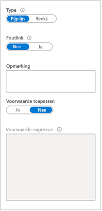
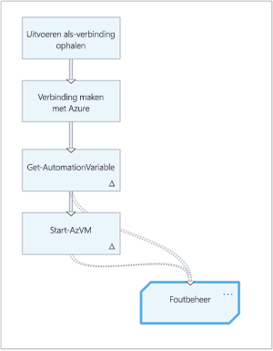
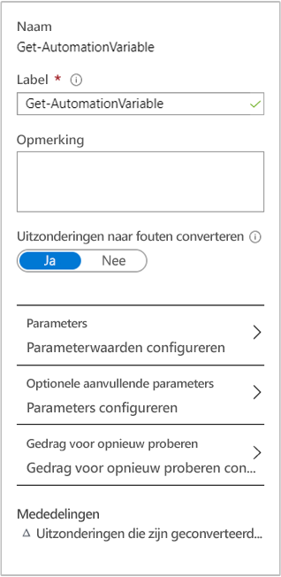
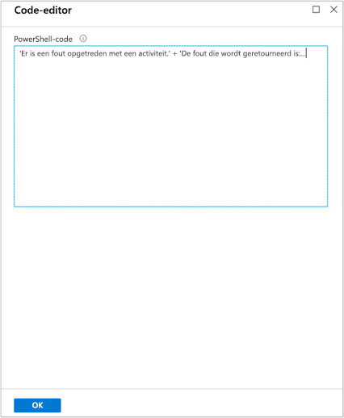

# Fout afhandeling in Azure Automation grafische runbooks

Een belang rijk aandachtspunt voor uw Azure Automation grafische runbook is de identificatie van problemen die het runbook kan ondervinden tijdens de uitvoering. Deze problemen kunnen geslaagde pogingen, verwachte foutstatussen en onverwachte foutvoorwaarden zijn.

Als er sprake is van een niet-afsluit fout die optreedt bij een runbook-activiteit, wordt de activiteit vaak door Windows Power shell verwerkt door de volgende activiteit te verwerken, ongeacht de fout. De fout genereert waarschijnlijk een uitzondering, maar de volgende activiteit mag wel worden uitgevoerd.

Uw grafische runbook moet fout verwerkings code bevatten om te kunnen omgaan met uitvoerings problemen. Als u de uitvoer van een activiteit wilt valideren of een fout wilt verwerken, kunt u een Power shell-code activiteit gebruiken, voorwaardelijke logica definiëren op de uitvoer koppeling van de activiteit of een andere methode Toep assen.

Azure Automation grafische runbooks zijn verbeterd met de mogelijkheid om fout afhandeling te bieden. U kunt nu van uitzonderingen niet-afsluitfouten maken en foutkoppelingen tussen activiteiten maken. Dankzij het verbeterde proces kan uw runbook fouten opvangen en gerealiseerde of onverwachte voor waarden beheren. 

>[!NOTE]
>Dit artikel is bijgewerkt voor het gebruik van de nieuwe Azure PowerShell Az-module. De AzureRM-module kan nog worden gebruikt en krijgt bugoplossingen tot ten minste december 2020. Zie voor meer informatie over de nieuwe Az-module en compatibiliteit met AzureRM [Introductie van de nieuwe Az-module van Azure PowerShell](https://docs.microsoft.com/powershell/azure/new-azureps-module-az?view=azps-3.5.0). Zie [de module Azure PowerShell installeren](https://docs.microsoft.com/powershell/azure/install-az-ps?view=azps-3.5.0)voor de installatie-instructies voor AZ module op uw Hybrid Runbook Worker. Voor uw Automation-account kunt u uw modules bijwerken naar de nieuwste versie met behulp van [het bijwerken van Azure PowerShell-modules in azure Automation](automation-update-azure-modules.md).

## Power Shell-fout typen

De typen Power shell-fouten die zich kunnen voordoen tijdens het uitvoeren van een runbook, zijn afsluit fouten en niet-afsluit fouten.
 
### Fout bij beëindigen

Een afsluit fout is een ernstige fout tijdens de uitvoering, waardoor de uitvoering van een opdracht of script volledig wordt gestopt. Voor beelden zijn niet-bestaande cmdlets, syntaxis fouten waardoor een cmdlet niet kan worden uitgevoerd en andere fatale fouten.

### Niet-afsluit fout

Een niet-afsluit fout is een niet-ernstige fout waardoor de uitvoering ondanks de fout situatie kan worden voortgezet. Voor beelden zijn onder andere operationele fouten, zoals het bestand niet gevonden fouten en machtigingen.

## Wanneer foutafhandeling gebruiken

Gebruik fout afhandeling in uw runbook wanneer een kritieke activiteit een fout of uitzonde ring genereert. Het is belang rijk om te voor komen dat de volgende activiteit in het runbook wordt verwerkt en om de fout op de juiste wijze af te handelen. Het afhandelen van de fout is met name van belang wanneer uw runbooks ondersteuning bieden voor een bedrijfs-of service proces.

Voor elke activiteit die een fout kan veroorzaken, kunt u een fout koppeling toevoegen die verwijst naar een andere activiteit. De doel activiteit kan elk type zijn, inclusief code activiteit, aanroep van een cmdlet, aanroep van een ander runbook, enzovoort. De doel activiteit kan ook uitgaande koppelingen hebben, hetzij normale als koppelingen naar fouten. Met de koppelingen kan het runbook complexe logica voor fout afhandeling implementeren zonder dat hiervoor een code activiteit wordt toegepast.

De aanbevolen procedure is het maken van een specifiek runbook voor fout afhandeling met algemene functionaliteit, maar deze procedure is niet verplicht. Denk bijvoorbeeld aan een runbook dat probeert een virtuele machine te starten en een toepassing erop te installeren. Als de virtuele machine niet correct wordt gestart, geldt het volgende:

1. Hiermee wordt een melding over dit probleem verzonden.
2. Start een ander runbook dat in plaats daarvan automatisch een nieuwe VM inricht.

Eén oplossing is het maken van een fout koppeling in het runbook dat verwijst naar een activiteit die stap één afhandelt. Het runbook kan bijvoorbeeld de cmdlet **Write-warn** koppelen aan een activiteit voor stap twee, zoals de cmdlet [Start-AzAutomationRunbook](https://docs.microsoft.com/powershell/module/az.automation/start-azautomationrunbook?view=azps-3.5.0) .

U kunt dit gedrag ook generaliseren voor gebruik in veel runbooks door deze twee activiteiten in een afzonderlijke runbook voor fout afhandeling te plaatsen. Voordat uw oorspronkelijke runbook het runbook voor fout afhandeling aanroept, kan het een aangepast bericht maken op basis van de gegevens en het vervolgens door geven als een para meter voor het runbook voor fout afhandeling.

## Hoe foutafhandeling te gebruiken

Elke activiteit in het runbook heeft een configuratie-instelling waarmee uitzonde ringen in niet-afsluit fouten worden uitgeschakeld. Deze instelling is standaard uitgeschakeld. U wordt aangeraden deze instelling in te scha kelen voor elke activiteit waarbij uw runbook fouten verwerkt. Deze instelling zorgt ervoor dat het runbook zowel afsluit-als niet-afsluit fouten in de activiteit verwerkt als niet-afsluit fouten, met behulp van een fout koppeling.  

Nadat u de configuratie-instelling hebt ingeschakeld, moet u in uw runbook een activiteit maken waarmee de fout wordt afgehandeld. Als de activiteit een fout veroorzaakt, worden de uitgaande fout koppelingen gevolgd. De gewone koppelingen worden niet gevolgd, zelfs niet als de activiteit ook regel matig uitvoer produceert.   

In het volgende voor beeld wordt met een runbook een variabele opgehaald die de computer naam van een virtuele machine bevat. Vervolgens wordt geprobeerd de virtuele machine te starten met de volgende activiteit.           

De activiteit **Get-AutomationVariable** en de cmdlet [Start-AzVM](https://docs.microsoft.com/powershell/module/Az.Compute/Start-AzVM?view=azps-3.5.0) zijn geconfigureerd om uitzonde ringen te converteren naar fouten. Als er problemen zijn bij het ophalen van de variabele of het starten van de virtuele machine, genereert de code fouten.   instellingen voor het verwerken van de activiteit voor fout afhandeling van .

Fout koppelingen stromen van deze activiteiten naar een enkele activiteit voor **fout beheer** code. Deze activiteit is geconfigureerd met een eenvoudige Power shell-expressie die gebruikmaakt van het sleutel woord **throw** om de verwerking te stoppen, samen met `$Error.Exception.Message` om het bericht op te halen waarin de huidige uitzonde ring wordt beschreven.   code voorbeeld voor fout afhandeling van 

## Volgende stappen

* Zie voor meer informatie over koppelingen en koppelings typen in grafische runbooks [grafisch ontwerpen in azure Automation](automation-graphical-authoring-intro.md#links-and-workflow).

* Zie [runbook-uitvoering in azure Automation](automation-runbook-execution.md)voor meer informatie over het uitvoeren van een runbook, het bewaken van runbook-taken en andere technische details.