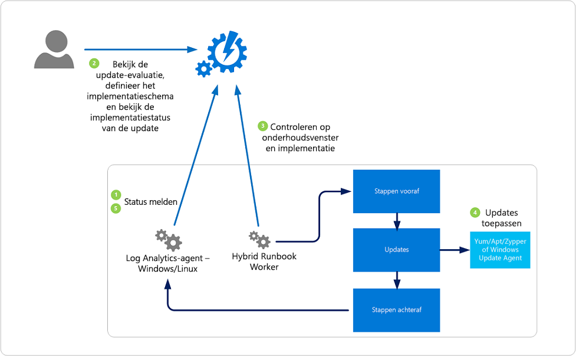

# <a name="update-management-solution-in-azure"></a>UpdateManagementoplossing in Azure

U de **oplossing Voor updatebeheer** in Azure Automation gebruiken om updates van besturingssystemen voor uw Windows- en Linux-machines in Azure, in on-premises omgevingen en in andere cloudomgevingen te beheren. U snel de status van beschikbare updates op alle agentmachines beoordelen en het proces van het installeren van vereiste updates voor servers beheren.

U Updatebeheer voor virtuele machines (VM's) inschakelen met behulp van de volgende methoden:

- Vanuit uw [Azure Automation-account](automation-onboard-solutions-from-automation-account.md) voor een of meer Azure-machines en handmatig voor niet-Azure-machines.

- Voor één Azure VM van de virtuele machinepagina in de Azure-portal. Dit scenario is beschikbaar voor [Linux-](../virtual-machines/linux/tutorial-config-management.md#enable-update-management) en Windows-VM's. [Windows](../virtual-machines/windows/tutorial-config-management.md#enable-update-management)

- Voor [meerdere Azure VM's](manage-update-multi.md) door ze te selecteren op de pagina Virtuele machines in de Azure-portal. 

> [!NOTE]
> De **oplossing Voor updatebeheer** moet een Log Analytics-werkruimte worden gekoppeld aan uw Automatiseringsaccount. Zie [Azure Workspace-toewijzingen](./how-to/region-mappings.md)voor een definitieve lijst met ondersteunde regio's. De regiotoewijzingen hebben geen invloed op de mogelijkheid om VM's in een apart gebied te beheren dan uw Automatiseringsaccount.

[!INCLUDE [azure-monitor-log-analytics-rebrand](../../includes/azure-monitor-log-analytics-rebrand.md)]

Er is een [Azure Resource Manager-sjabloon](automation-update-management-deploy-template.md) beschikbaar waarmee u de **oplossing Voor updatebeheer** implementeren in een nieuw of bestaand automatiseringsaccount en de werkruimte Log Analytics in uw abonnement.

## <a name="solution-overview"></a>Oplossingenoverzicht

Machines die worden beheerd door Update Management gebruiken de volgende configuraties om beoordeling uit te voeren en implementaties bij te werken:

* Log Analytics-agent voor Windows of Linux
* PowerShell Desired State Configuration (DSC) voor Linux
* Automation Hybrid Runbook Worker
* Microsoft Update of Windows Server Update Services (WSUS) voor Windows-machines

In het volgende diagram ziet u hoe de oplossing beveiligingsupdates beoordeelt en toepast op alle aangesloten Windows Server- en Linux-machines in een werkruimte:



Updatebeheer kan worden gebruikt voor de systeemeigen onboarding van computers in meerdere abonnementen in dezelfde tenant.

Nadat een pakket is vrijgegeven, duurt het 2 tot 3 uur voordat de patch wordt weergegeven voor Linux-machines voor beoordeling. Voor Windows-machines duurt het 12 tot 15 uur voordat de patch wordt weergegeven voor beoordeling nadat deze is uitgebracht.

Nadat een machine een scan voor update-naleving heeft voltooid, stuurt de agent de informatie in bulk door naar Azure Monitor-logboeken. Op een Windows-machine wordt de compliance-scan standaard elke 12 uur uitgevoerd.

Naast het scanschema wordt de scan voor update-naleving gestart binnen 15 minuten nadat de Log Analytics-agent opnieuw is gestart, voordat de update wordt geïnstalleerd en na de installatie van de update.

Voor een Linux-machine wordt de compliance-scan standaard elk uur uitgevoerd. Als de Log Analytics-agent opnieuw wordt gestart, wordt binnen 15 minuten een compliance-scan gestart.

De oplossing rapporteert hoe up-to-date de machine is gebaseerd op de bron waarmee u bent geconfigureerd om mee te synchroniseren. Als de Windows-machine is geconfigureerd om te rapporteren aan WSUS, afhankelijk van wanneer WSUS voor het laatst is gesynchroniseerd met Microsoft Update, kunnen de resultaten afwijken van wat Microsoft Update weergeeft. Dit gedrag is hetzelfde voor Linux-machines die zijn geconfigureerd om te rapporteren aan een lokale repo in plaats van aan een openbare repo.

> [!NOTE]
> Updatemanagement vereist dat bepaalde URL's en poorten worden ingeschakeld om correct aan de service te rapporteren. Zie [Netwerkplanning voor hybride werknemers voor](automation-hybrid-runbook-worker.md#network-planning)meer informatie over deze vereisten.

U software-updates implementeren en installeren op machines waarvoor de updates nodig zijn door een geplande implementatie te maken. Updates die als optioneel zijn *geclassificeerd,* worden niet opgenomen in de implementatiescope voor Windows-machines. Alleen vereiste updates zijn opgenomen in het implementatiebereik.

De geplande implementatie bepaalt welke doelmachines de toepasselijke updates ontvangen. Dit gebeurt door bepaalde machines expliciet op te geven of door een [computergroep](../azure-monitor/platform/computer-groups.md) te selecteren die is gebaseerd op logboekzoekopdrachten van een specifieke set machines (of op een [Azure-query](automation-update-management-query-logs.md) die dynamisch Azure VM's selecteert op basis van opgegeven criteria). Deze groepen verschillen van [scopeconfiguratie](../azure-monitor/insights/solution-targeting.md), die alleen wordt gebruikt om te bepalen welke machines de beheerpakketten krijgen die de oplossing mogelijk maken.

U geeft ook een schema op om een periode goed te keuren en in te stellen waarin updates kunnen worden geïnstalleerd. Deze periode wordt het onderhoudsvenster genoemd. Een periode van 20 minuten van het onderhoudsvenster is gereserveerd voor opnieuw opstarten, ervan uitgaande dat er een nodig is en u de juiste rebootoptie hebt geselecteerd. Als patchen langer duurt dan verwacht en er minder dan 20 minuten in het onderhoudsvenster staat, treedt er geen herstart op.

Updates worden geïnstalleerd door runbooks in Azure Automation. U deze runbooks niet bekijken en ze vereisen geen configuratie. Wanneer een update-implementatie wordt gemaakt, wordt een schema gemaakt waarmee een hoofdupdate-runbook wordt gestart op het opgegeven tijdstip voor de meegeleverde machines. Het hoofdlogboek start een onderliggende runbook op elke agent om de vereiste updates te installeren.

Op de datum en tijd die in de update-implementatie zijn opgegeven, voeren de doelmachines de implementatie parallel uit. Voor de installatie wordt een scan uitgevoerd om te controleren of de updates nog steeds nodig zijn. Als de updates niet zijn goedgekeurd in WSUS, mislukt de implementatie van de update voor WSUS-clientmachines.

Het wordt niet ondersteund voor het registreren van een machine voor Updatemanagement in meer dan één Log Analytics-werkruimte (ook wel multihoming genoemd).

## <a name="clients"></a>Clients

### <a name="supported-client-types"></a>Ondersteunde clienttypen

In de volgende tabel worden de ondersteunde besturingssystemen voor updatebeoordelingen weergegeven. Voor patchen is een hybride runbookworker vereist. Zie de installatiehandleidingen voor het installeren van een [Hybride Runbook Worker](automation-windows-hrw-install.md) en een Linux Hybrid Runbook Worker voor informatie over de vereisten voor hybride runbook [worker.](automation-linux-hrw-install.md#installing-a-linux-hybrid-runbook-worker)

|Besturingssysteem  |Opmerkingen  |
|---------|---------|
|Windows Server 2019 (Datacenter/Datacenter Core/Standard)<br><br>Windows Server 2016 (Datacenter/Datacenter Core/Standard)<br><br>Windows Server 2012 R2(Datacenter/Standaard)<br><br>Windows Server 2012 || 
|Windows Server 2008 R2 (RTM en Sp1 Standard)| Updatebeheer ondersteunt alleen het uitvoeren van beoordelingen voor dit besturingssysteem, patchen wordt niet ondersteund omdat de [hybride runbookworker](automation-windows-hrw-install.md) niet wordt ondersteund voor Windows Server 2008 R2. |
|CentOS 6 (x86/x64) en 7 (x64)      | Linux-agents hebben toegang nodig tot een updaterepository. Classificatiegebaseerde patching `yum` vereist het retourneren van beveiligingsgegevens die CentOS niet heeft in zijn RTM-releases. Zie Classificaties op Linux bijwerken voor meer informatie over op classificatiegebaseerde [patching](automation-view-update-assessments.md#linux-2)op CentOS.          |
|Red Hat Enterprise 6 (x86/x64) en 7 (x64)     | Linux-agents hebben toegang nodig tot een updaterepository.        |
|SUSE Linux Enterprise Server 11 (x86/x64) en 12 (x64)     | Linux-agents hebben toegang nodig tot een updaterepository.        |
|Ubuntu 14.04 LTS, 16.04 LTS en 18.04 (x86/x64)      |Linux-agents hebben toegang nodig tot een updaterepository.         |

> [!NOTE]
> Azure virtuele machineschaalsets kunnen worden beheerd via Updatebeheer. Update Management werkt op de instanties zelf en niet op de basisafbeelding. U moet de updates op een incrementele manier plannen, zodat niet alle VM-exemplaren tegelijk worden bijgewerkt.
> U knooppunten toevoegen voor virtuele machineschaalsets door de stappen te volgen onder [Een niet-Azure-machine aan boord nemen.](automation-tutorial-installed-software.md#onboard-a-non-azure-machine)

### <a name="unsupported-client-types"></a>Niet-ondersteunde clienttypen

In de volgende tabel worden niet-ondersteunde besturingssystemen weergegeven:

|Besturingssysteem  |Opmerkingen  |
|---------|---------|
|Windows-client     | Clientbesturingssystemen (zoals Windows 7 en Windows 10) worden niet ondersteund.        |
|Windows Server 2016 Nano Server     | Wordt niet ondersteund.       |
|Azure Kubernetes-serviceknooppunten | Wordt niet ondersteund. Gebruik het patchproces dat is beschreven in [Beveiligings- en kernelupdates toepassen op Linux-knooppunten in Azure Kubernetes Service (AKS)](../aks/node-updates-kured.md)|

### <a name="client-requirements"></a>Clientvereisten

De volgende informatie beschrijft OS-specifieke clientvereisten. Zie [Netwerkplanning](#ports)voor aanvullende richtlijnen .

#### <a name="windows"></a>Windows

Windows-agents moeten zijn geconfigureerd om te communiceren met een WSUS-server of ze hebben toegang tot Microsoft Update nodig.

U Updatebeheer gebruiken met Configuratiebeheer. Zie [Configuratiebeheer integreren met Updatebeheer](oms-solution-updatemgmt-sccmintegration.md#configuration)voor meer informatie over integratiescenario's. De [Windows-agent Log Analytics](../azure-monitor/platform/agent-windows.md) is vereist. De agent wordt automatisch geïnstalleerd als u een Azure VM inschakelt.

Standaard worden Windows VM's die vanuit de Azure Marketplace worden geïmplementeerd, ingesteld op automatische updates van Windows Update Service. Dit gedrag verandert niet wanneer u deze oplossing toevoegt of Windows VM's toevoegt aan uw werkruimte. Als u updates niet actief beheert met deze oplossing, is het standaardgedrag (om updates automatisch toe te passen) van toepassing.

> [!NOTE]
> Een gebruiker kan groepsbeleid wijzigen, zodat opnieuw opstarten van de machine alleen door de gebruiker kan worden uitgevoerd, niet door het systeem. Beheerde machines kunnen vast komen te zitten als Update Management geen rechten heeft om de machine opnieuw op te starten zonder handmatige interactie van de gebruiker.
>
> Zie [Groepsbeleidsinstellingen configureren voor automatische updates voor](https://docs.microsoft.com/windows-server/administration/windows-server-update-services/deploy/4-configure-group-policy-settings-for-automatic-updates)meer informatie.

#### <a name="linux"></a>Linux

Voor Linux heeft de machine toegang nodig tot een updaterepository. De updaterepository kan privé of openbaar zijn. TLS 1.1 of TLS 1.2 is vereist om te communiceren met Update Management. Een Log Analytics-agent voor Linux die is geconfigureerd om te rapporteren aan meer dan één Log Analytics-werkruimte, wordt niet ondersteund met deze oplossing. De machine moet ook Python 2.x geïnstalleerd hebben.

Zie [Log Analytics-agent voor Linux](../azure-monitor/platform/agent-linux.md)voor informatie over het installeren van de Log Analytics-agent voor Linux en het downloaden van de nieuwste versie. Zie [Windows-computers verbinden met Azure Monitor](../log-analytics/log-analytics-windows-agent.md)voor informatie over het installeren van de agent Log Analytics voor Windows.

VM's die zijn gemaakt op basis van de On-demand Red Hat Enterprise Linux (RHEL)-afbeeldingen die beschikbaar zijn in de Azure Marketplace, zijn geregistreerd om toegang te krijgen tot de [Red Hat Update Infrastructure (RHUI)](../virtual-machines/workloads/redhat/redhat-rhui.md) die is geïmplementeerd in Azure. Elke andere Linux-distributie moet worden bijgewerkt vanuit de online bestandsopslagplaats van de distributie met behulp van de ondersteunde methoden van de distributie.

## <a name="permissions"></a>Machtigingen

Als u update-implementaties wilt maken en beheren, hebt u specifieke machtigingen nodig. Zie Toegang op basis [van rollen – Updatebeheer](automation-role-based-access-control.md#update-management-permissions)voor meer informatie over deze machtigingen.

## <a name="solution-components"></a>Oplossingsonderdelen

De oplossing bestaat uit de volgende bronnen. Deze resources worden automatisch toegevoegd aan uw Automatiseringsaccount wanneer u de oplossing inschakelt. 

### <a name="hybrid-worker-groups"></a>Hybrid Worker-groepen

Nadat u deze oplossing hebt ingeschakeld, wordt elke Windows-machine die rechtstreeks is verbonden met uw Log Analytics-werkruimte automatisch geconfigureerd als hybride runbookworker om de runbooks te ondersteunen die in deze oplossing zijn opgenomen.

Elke Windows-machine die door de oplossing wordt beheerd, wordt in het deelvenster Hybride werknemersgroepen weergegeven als een hybride werknemersgroep voor het systeemsysteem voor het automatiseringsaccount. De oplossingen `Hostname FQDN_GUID` maken gebruik van de naamgevingsconventie. Je deze groepen niet targeten met runbooks in je account. Als u het probeert, mislukt de poging. Deze groepen zijn bedoeld om alleen deze beheeroplossing te ondersteunen.

U de Windows-machine toevoegen aan een hybride runbookworkergroep in uw Automatiseringsaccount ter ondersteuning van automatiseringsrunbooks als u hetzelfde account gebruikt voor zowel de oplossing als het groepslidmaatschap hybride runbookworker. Deze functionaliteit is toegevoegd in versie 7.2.12024.0 van de Hybrid Runbook Worker.

### <a name="management-packs"></a>Management packs

Als uw beheergroep System Center Operations Manager is [verbonden met een Log Analytics-werkruimte,](../azure-monitor/platform/om-agents.md)worden de volgende beheerpakketten geïnstalleerd in Operations Manager. Deze beheerpakketten worden ook geïnstalleerd op direct verbonden Windows-machines nadat u de oplossing hebt toegevoegd. U hoeft deze management packs niet te configureren of te beheren.

* Microsoft System Center Advisor Update Assessment Intelligence Pack (Microsoft.IntelligencePacks.UpdateAssessment)
* Microsoft.IntelligencePack.UpdateAssessment.Configuration (Microsoft.IntelligencePack.UpdateAssessment.Configuration)
* Implementatie MP bijwerken

> [!NOTE]
> Als u een beheergroep Operations Manager 1807 of 2019 hebt die is gekoppeld aan een Log Analytics-werkruimte `IsAutoRegistrationEnabled` met agents die zijn geconfigureerd in de beheergroep om logboekgegevens te verzamelen, moet u de parameter overschrijven en instellen op True in de regel **Microsoft.IntelligencePacks.AzureAutomation.HybridAgent.Init.**

Zie Operations Manager verbinden met Azure [Monitor-logboeken](../azure-monitor/platform/om-agents.md)voor meer informatie over hoe oplossingsbeheerpakketten worden bijgewerkt.

> [!NOTE]
> Voor machines met de Operations Manger-agent die volledig door Update Management moeten worden beheerd, moet de agent worden bijgewerkt naar de Log Analytics-agent voor Windows of de Log Analytics-agent voor Linux. Zie [Een medewerker operations Manager upgraden](https://docs.microsoft.com/system-center/scom/deploy-upgrade-agents)voor meer informatie over het bijwerken van de agent. In omgevingen die Operations Manager gebruiken, moet u System Center Operations Manager 2012 R2 UR 14 of hoger uitvoeren.

## <a name="data-collection"></a>Gegevensverzameling

### <a name="supported-agents"></a>Ondersteunde agents

De volgende tabel beschrijft de verbonden bronnen die worden ondersteund door deze oplossing:

| Verbonden bron | Ondersteund | Beschrijving |
| --- | --- | --- |
| Windows-agents |Ja |De oplossing verzamelt informatie over systeemupdates van Windows-agents en initieert vervolgens de installatie van vereiste updates. |
| Linux-agents |Ja |De oplossing verzamelt informatie over systeemupdates van Linux-agents en initieert vervolgens de installatie van vereiste updates voor ondersteunde distributies. |
| Beheergroep Operations Manager |Ja |De oplossing verzamelt informatie over systeemupdates van agents in een verboden beheergroep.<br/><br/>Een directe verbinding van de operations manager-agent met Azure Monitor-logboeken is niet vereist. Gegevens worden doorgestuurd van de beheergroep naar de werkruimte Log Analytics. |

### <a name="collection-frequency"></a>Verzamelingsfrequentie

Voor elke beheerde Windows-machine wordt twee keer per dag een scan uitgevoerd. Elke 15 minuten wordt de Windows-API opgeroepen om de laatste updatetijd op te vragen om te bepalen of de status is gewijzigd. Als de status is gewijzigd, wordt een nalevingsscan gestart.

Voor elke beheerde Linux-machine wordt elk uur een scan uitgevoerd.

Het kan tussen de 30 minuten en 6 uur duren voordat het dashboard bijgewerkte gegevens van beheerde machines weergeeft.

Het gemiddelde gegevensgebruik van Azure Monitor-logboeken voor een machine met updatebeheer is ongeveer 25 megabyte (MB) per maand. Deze waarde is slechts een benadering en kan worden gewijzigd, afhankelijk van uw omgeving. We raden u aan uw omgeving te controleren om uw exacte gebruik bij te houden. Zie [Gebruik en kosten beheren](../azure-monitor/platform/manage-cost-storage.md)voor meer informatie voor het analyseren van gegevensgebruik.

## <a name="network-planning"></a><a name="ports"></a>Netwerkplanning

De volgende adressen zijn specifiek vereist voor Update Management. Communicatie naar deze adressen vindt plaats via poort 443.

|Openbare Azure-peering  |Azure Government  |
|---------|---------|
|*.ods.opinsights.azure.com    | *.ods.opinsights.azure.us         |
|*.oms.opinsights.azure.com     | *.oms.opinsights.azure.us        |
|*.blob.core.windows.net | *.blob.core.usgovcloudapi.net|
|*.azure-automation.net | *.azure-automation.us|

Voor Windows-machines moet u ook verkeer toestaan naar eindpunten die vereist zijn door Windows Update. U een bijgewerkte lijst met vereiste eindpunten vinden in [problemen met betrekking tot HTTP/Proxy.](/windows/deployment/update/windows-update-troubleshooting#issues-related-to-httpproxy) Als u een lokale [Windows Update-server hebt,](/windows-server/administration/windows-server-update-services/plan/plan-your-wsus-deployment)moet u ook verkeer toestaan naar de server die is opgegeven in uw [WSUS-toets.](/windows/deployment/update/waas-wu-settings#configuring-automatic-updates-by-editing-the-registry)

Zie [IP's voor de RHUI-contentdeliveryservers](../virtual-machines/workloads/redhat/redhat-rhui.md#the-ips-for-the-rhui-content-delivery-servers) voor vereiste eindpunten voor Red Hat Linux-machines. Zie voor andere Linux-distributies de documentatie van uw provider.

Zie [Hybride werknemersrolpoorten](automation-hybrid-runbook-worker.md#hybrid-worker-role)voor meer informatie over poorten die nodig zijn voor de hybride runbookworker.

We raden u aan de vermelde adressen te gebruiken bij het definiëren van uitzonderingen. Voor IP-adressen u [IP-bereiken van Microsoft Azure Datacenter](https://www.microsoft.com/download/details.aspx?id=41653)downloaden. Dit bestand wordt wekelijks bijgewerkt en weerspiegelt de momenteel geïmplementeerde bereiken en eventuele komende wijzigingen in de IP-bereiken.

Volg de instructies in [Connect-computers zonder internettoegang](../azure-monitor/platform/gateway.md) om machines te configureren die geen toegang tot internet hebben.

## <a name="update-classifications"></a>Update classifications

In de volgende tabellen worden de updateclassificaties weergegeven in Updatebeheer, met een definitie voor elke classificatie.

### <a name="windows"></a>Windows

|Classificatie  |Beschrijving  |
|---------|---------|
|Essentiële updates     | Een update voor een specifiek probleem dat een kritieke, niet-beveiligingsgerelateerde bug aanpakt.        |
|Beveiligingsupdates     | Een update voor een productspecifiek beveiligingsprobleem.        |
|Updatepakketten     | Een cumulatieve set hotfixes die samen worden verpakt voor eenvoudige implementatie.        |
|Functiepakketten     | Nieuwe productfuncties die buiten een productrelease worden gedistribueerd.        |
|Servicepacks     | Een cumulatieve set hotfixes die op een toepassing worden toegepast.        |
|Definitie-updates     | Een update voor virus- of andere definitiebestanden.        |
|Hulpprogramma's     | Een hulpprogramma of functie die helpt bij het voltooien van een of meer taken.        |
|Updates     | Een update voor een toepassing of bestand dat momenteel is geïnstalleerd.        |

### <a name="linux"></a><a name="linux-2"></a>Linux

|Classificatie  |Beschrijving  |
|---------|---------|
|Essentiële en beveiligingsupdates     | Updates voor een specifiek probleem of een productspecifiek beveiligingsprobleem.         |
|Andere Updates     | Alle andere updates die niet van cruciaal belang zijn of die geen beveiligingsupdates zijn.        |

Voor Linux kan Update Management onderscheid maken tussen kritieke updates en beveiligingsupdates in de cloud terwijl beoordelingsgegevens worden weergegeven als gevolg van gegevensverrijking in de cloud. Voor het patchen is Update Management afhankelijk van classificatiegegevens die beschikbaar zijn op de machine. In tegenstelling tot andere distributies beschikt CentOS niet over deze informatie in de RTM-versie. Als CentOS-machines zijn geconfigureerd om beveiligingsgegevens terug te sturen voor de volgende opdracht, kan Updatemanagement patchen op basis van classificaties.

```bash
sudo yum -q --security check-update
```

Er is momenteel geen ondersteunde methode om de beschikbaarheid van native classificatiegegevens op CentOS mogelijk te maken. Op dit moment wordt alleen ondersteuning voor de beste inspanning geboden aan klanten die dit mogelijk zelf hebben ingeschakeld. 

Om updates op Red Hat Enterprise versie 6 te classificeren, moet u de plug-in yum-security installeren. Op Red Hat Enterprise Linux 7, de plugin is al een deel van yum zelf, is er geen noodzaak om iets te installeren. Zie voor meer informatie het volgende Red Hat [kennisartikel.](https://access.redhat.com/solutions/10021)

## <a name="integrate-with-configuration-manager"></a>Integreren met Configuration Manager

Klanten die hebben geïnvesteerd in Microsoft Endpoint Configuration Manager voor het beheren van pc's, servers en mobiele apparaten, vertrouwen ook op de sterkte en volwassenheid van Configuration Manager om hen te helpen bij het beheren van software-updates. Configuration Manager maakt deel uit van de somcyclus (software update management).

Zie [Configuratiebeheer integreren met Updatebeheer](oms-solution-updatemgmt-sccmintegration.md)voor meer informatie over het integreren van de beheeroplossing met Configuration Manager.

### <a name="third-party-updates-on-windows"></a>Updates van derden op Windows

Updatebeheer is afhankelijk van de lokaal geconfigureerde updaterepository om ondersteunde Windows-systemen bij te werken. Dit is WSUS of Windows Update. Met tools zoals [System Center Updates Publisher](https://docs.microsoft.com/configmgr/sum/tools/updates-publisher) (Updates Publisher) u aangepaste updates importeren en publiceren met WSUS. Met dit scenario kan Updatebeheer machines bijwerken die Configuration Manager gebruiken als hun updaterepository met software van derden. Zie Publisher [voor updates installeren](https://docs.microsoft.com/configmgr/sum/tools/install-updates-publisher)voor meer informatie over het configureren van Publisher voor updates .

## <a name="enable-update-management"></a><a name="onboard"></a>Updatebeheer inschakelen

Als u wilt beginnen met het bijwerken van systemen, moet u de oplossing Updatebeheer inschakelen. De volgende methoden om aan boord van de oplossing te komen:

- [Van een virtuele machine](automation-onboard-solutions-from-vm.md)
- [Van het browsen op meerdere machines](automation-onboard-solutions-from-browse.md)
- [Vanaf uw Automatiseringsaccount](automation-onboard-solutions-from-automation-account.md)
- [Met een Azure Automation-runbook](automation-onboard-solutions.md)
- [Met een Azure Resource Manager-sjabloon](automation-update-management-deploy-template.md)

## <a name="next-steps"></a>Volgende stappen

Bekijk de [veelgestelde vragen over](automation-faq.md) Azure Automation om veelgestelde vragen over deze oplossing te bekijken.
