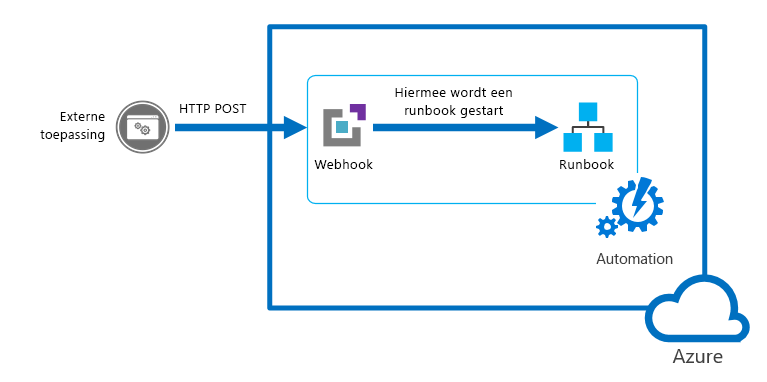
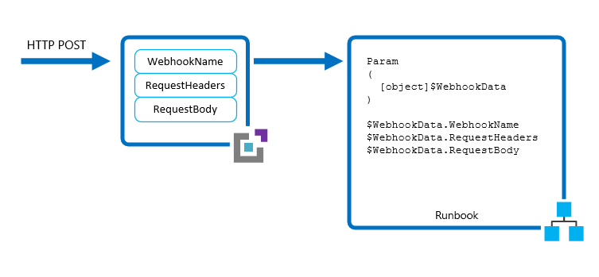
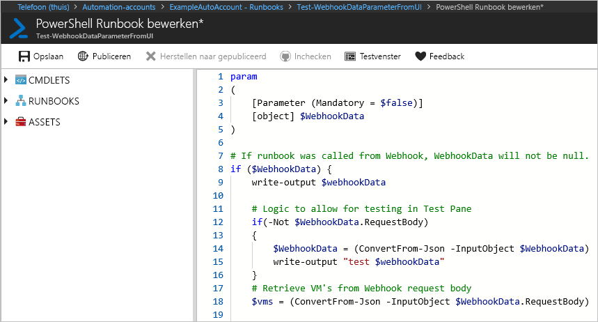
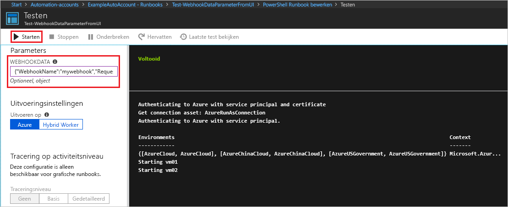
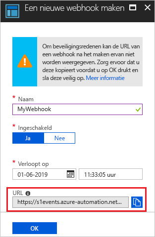

# <a name="starting-an-azure-automation-runbook-with-a-webhook"></a>Een Azure Automation runbook starten met een webhook

Met een webhook kan een externe service een bepaald runbook in Azure Automation starten via één HTTP-aanvraag. Externe services omvatten Azure DevOps Services, GitHub, Azure Monitor-logboeken en aangepaste toepassingen. Een dergelijke service kan een webhook gebruiken om een runbook te starten zonder een volledige oplossing te implementeren met behulp van de Azure Automation-API. U kunt webhooks vergelijken met andere methoden voor het starten van een runbook bij [het starten van een runbook in azure Automation](automation-starting-a-runbook.md).

> [!NOTE]
> Het gebruik van een webhook voor het starten van een python-runbook wordt niet ondersteund.



>[!NOTE]
>Dit artikel is bijgewerkt voor het gebruik van de nieuwe Azure PowerShell Az-module. De AzureRM-module kan nog worden gebruikt en krijgt bugoplossingen tot ten minste december 2020. Zie voor meer informatie over de nieuwe Az-module en compatibiliteit met AzureRM [Introductie van de nieuwe Az-module van Azure PowerShell](https://docs.microsoft.com/powershell/azure/new-azureps-module-az?view=azps-3.5.0). Zie [de module Azure PowerShell installeren](https://docs.microsoft.com/powershell/azure/install-az-ps?view=azps-3.5.0)voor de installatie-instructies voor AZ module op uw Hybrid Runbook Worker. Voor uw Automation-account kunt u uw modules bijwerken naar de nieuwste versie met behulp van [het bijwerken van Azure PowerShell-modules in azure Automation](automation-update-azure-modules.md).

## <a name="webhook-properties"></a>Eigenschappen van webhook

In de volgende tabel worden de eigenschappen beschreven die u moet configureren voor een webhook.

| Eigenschap | Beschrijving |
|:--- |:--- |
| Naam |De naam van de webhook. U kunt elke gewenste naam opgeven, omdat deze niet wordt blootgesteld aan de client. Het wordt alleen gebruikt om het runbook in Azure Automation te identificeren. Als best practice moet u de webhook een naam geven die betrekking heeft op de client die deze gebruikt. |
| URL |De URL van de webhook. Dit is het unieke adres dat een client aanroept met een HTTP POST om het runbook te starten dat is gekoppeld aan de webhook. Het wordt automatisch gegenereerd wanneer u de webhook maakt. U kunt geen aangepaste URL opgeven. <br> <br> De URL bevat een beveiligings token waarmee een systeem van derden het runbook kan aanroepen zonder verdere authenticatie. Daarom moet u de URL beschouwen als een wacht woord. Uit veiligheids overwegingen kunt u de URL alleen weer geven in de Azure Portal bij het maken van de webhook. Noteer de URL op een veilige locatie voor toekomstig gebruik. |
| Vervaldatum | De verval datum van de webhook, waarna deze niet meer kan worden gebruikt. U kunt de verval datum wijzigen nadat de webhook is gemaakt, zolang de webhook niet is verlopen. |
| Ingeschakeld | Instelling die aangeeft of de webhook standaard wordt ingeschakeld wanneer deze wordt gemaakt. Als u deze eigenschap instelt op uitgeschakeld, kan geen enkele client de webhook gebruiken. U kunt deze eigenschap instellen wanneer u de webhook maakt of een ander tijdstip nadat het is gemaakt. |

## <a name="parameters-used-when-the-webhook-starts-a-runbook"></a>Para meters die worden gebruikt wanneer de webhook een runbook start

Een webhook kan waarden definiëren voor runbook-para meters die worden gebruikt wanneer het runbook wordt gestart. De webhook moet waarden bevatten voor verplichte runbook-para meters en kan waarden bevatten voor optionele para meters. Een parameter waarde die is geconfigureerd voor een webhook kan worden gewijzigd, zelfs na het maken van de webhook. Meerdere webhooks die zijn gekoppeld aan één runbook kunnen elk verschillende para meters van de runbook gebruiken. Wanneer een client een runbook start met een webhook, kunnen de parameter waarden die zijn gedefinieerd in de webhook niet worden overschreven.

Het runbook ondersteunt een enkele para meter met de naam *WebhookData*om gegevens van de client te ontvangen. Deze para meter definieert een object met gegevens die de client in een POST-aanvraag bevat.



De para meter *WebhookData* heeft de volgende eigenschappen:

| Eigenschap | Beschrijving |
|:--- |:--- |
| WebhookName | De naam van de webhook. |
| RequestHeader | Hashtabel met de kopteksten van de binnenkomende POST-aanvraag. |
| RequestBody | De hoofd tekst van de binnenkomende POST-aanvraag. Deze hoofd tekst behoudt alle gegevens opmaak, zoals teken reeks, JSON, XML of door een formulier gecodeerd. Het runbook moet worden geschreven om te kunnen werken met de verwachte gegevens indeling. |

Er is geen configuratie van de webhook vereist voor ondersteuning van de para meter *WebhookData* en het runbook is niet vereist om het te accepteren. Als het runbook de para meter niet definieert, worden de details van de aanvraag die vanaf de client is verzonden, genegeerd.

> [!NOTE]
> Bij het aanroepen van een webhook moet de client altijd parameter waarden opslaan voor het geval de aanroep mislukt. Als er sprake is van een netwerk storing of een verbindings probleem, kan de toepassing geen mislukte webhook-aanroepen ophalen.

Als u een waarde opgeeft voor *WebhookData* bij het maken van een webhook, wordt deze overschreven wanneer de webhook het runbook start met de gegevens van de client post-aanvraag. Dit gebeurt zelfs als de toepassing geen gegevens in de hoofd tekst van de aanvraag bevat. 

Als u een runbook start dat *WebhookData* definieert met behulp van een ander mechanisme dan een webhook, kunt u een waarde opgeven voor *WebhookData* die door het runbook wordt herkend. Deze waarde moet een object zijn met dezelfde [Eigenschappen](#webhook-properties) als de para meter *WebhookData* , zodat het runbook ermee kan werken zoals het werkt met werkelijke *WebhookData* -objecten die worden door gegeven door een webhook.

Als u bijvoorbeeld het volgende runbook start vanuit de Azure Portal en een aantal voor beeld-webhookgegevens wilt door geven om te testen, moet u de gegevens in JSON door geven in de gebruikers interface.



Voor het volgende runbook-voor beeld gaan we de volgende eigenschappen definiëren *WebhookData*:

* **Webhooknaam**: MyWebhook
* **RequestBody**: `*[{'ResourceGroup': 'myResourceGroup','Name': 'vm01'},{'ResourceGroup': 'myResourceGroup','Name': 'vm02'}]*`

Nu gaan we het volgende JSON-object door geven in de gebruikers interface voor de para meter *WebhookData* . Dit voor beeld, met regel-en regel tekens, komt overeen met de indeling die wordt door gegeven vanuit een webhook.

```json
{"WebhookName":"mywebhook","RequestBody":"[\r\n {\r\n \"ResourceGroup\": \"vm01\",\r\n \"Name\": \"vm01\"\r\n },\r\n {\r\n \"ResourceGroup\": \"vm02\",\r\n \"Name\": \"vm02\"\r\n }\r\n]"}
```



> [!NOTE]
> Azure Automation worden de waarden van alle invoer parameters met de runbook-taak geregistreerd. Elke invoer van de client in de webhook-aanvraag wordt dus geregistreerd en beschikbaar voor iedereen die toegang heeft tot de Automation-taak. Daarom moet u voorzichtig zijn met het opnemen van gevoelige informatie in webhook-aanroepen.

## <a name="webhook-security"></a>Beveiliging van webhooks

De beveiliging van een webhook is afhankelijk van de privacy van de URL, die een beveiligings token bevat waarmee de webhook kan worden aangeroepen. Azure Automation voert geen verificatie uit voor een aanvraag zolang deze is gemaakt aan de juiste URL. Daarom mogen uw clients geen webhooks gebruiken voor runbooks die zeer gevoelige bewerkingen uitvoeren zonder gebruik te maken van een alternatieve manier om de aanvraag te valideren.

U kunt logica binnen een runbook toevoegen om te bepalen of deze wordt aangeroepen door een webhook. Zorg ervoor dat het runbook de eigenschap **webhooknaam** van de para meter *WebhookData* controleert. Het runbook kan verdere validatie uitvoeren door te kijken naar specifieke informatie in de eigenschappen **RequestHeader** en **RequestBody** .

Een andere strategie is ervoor te hebben dat het runbook enige validatie van een externe voor waarde uitvoert wanneer er een webhook-aanvraag wordt ontvangen. Denk bijvoorbeeld aan een runbook dat wordt aangeroepen door GitHub telkens wanneer er een nieuwe door Voer is voor een GitHub-opslag plaats. Het runbook kan verbinding maken met GitHub om te controleren of er een nieuwe commit heeft plaatsgevonden voordat u doorgaat.

## <a name="creating-a-webhook"></a>Een webhook maken

Gebruik de volgende procedure om een nieuwe webhook te maken die is gekoppeld aan een runbook in de Azure Portal.

1. Klik op de pagina Runbooks in de Azure Portal op het runbook dat de webhook start om de details van het runbook weer te geven. Zorg ervoor dat het veld runbook **status** is ingesteld op **gepubliceerd**.
2. Klik boven aan de pagina op **webhook** om de pagina webhook toevoegen te openen.
3. Klik op **nieuwe webhook maken** om de pagina webhook maken te openen.
4. Vul de velden **naam** en **verval datum** in voor de webhook en geef op of deze moet worden ingeschakeld. Zie [Eigenschappen van webhook](#webhook-properties) voor meer informatie over deze eigenschappen.
5. Klik op het Kopieer pictogram en druk op CTRL + C om de URL van de webhook te kopiëren. Noteer deze vervolgens op een veilige plaats. 

    > [!NOTE]
    > Wanneer u de webhook hebt gemaakt, kunt u de URL niet opnieuw ophalen.

   

1. Klik op **para meters** om waarden voor de runbook-para meters op te geven. Als het runbook verplichte para meters bevat, kunt u de webhook alleen maken als u waarden opgeeft.
1. Klik op **Maken** om de webhook te maken.

## <a name="using-a-webhook"></a>Een webhook gebruiken

Als u een webhook wilt gebruiken nadat deze is gemaakt, moet uw client een HTTP POST-aanvraag uitgeven met de URL voor de webhook. De syntaxis is:

```http
http://<Webhook Server>/token?=<Token Value>
```

De client ontvangt een van de volgende retour codes van de POST-aanvraag.

| Code | Tekst | Beschrijving |
|:--- |:--- |:--- |
| 202 |Accepted |De aanvraag is geaccepteerd en het runbook is in de wachtrij geplaatst. |
| 400 |Onjuiste aanvraag |De aanvraag is om een van de volgende redenen niet geaccepteerd: <ul> <li>De webhook is verlopen.</li> <li>De webhook is uitgeschakeld.</li> <li>Het token in de URL is ongeldig.</li>  </ul> |
| 404 |Niet gevonden |De aanvraag is om een van de volgende redenen niet geaccepteerd: <ul> <li>De webhook is niet gevonden.</li> <li>Het runbook is niet gevonden.</li> <li>Het account is niet gevonden.</li>  </ul> |
| 500 |Interne server fout |De URL is geldig, maar er is een fout opgetreden. Verzend de aanvraag opnieuw. |

Ervan uitgaande dat de aanvraag is geslaagd, bevat de webhook-respons de taak-ID in JSON-indeling zoals hieronder wordt weer gegeven. Het bevat één taak-ID, maar de JSON-indeling biedt mogelijke toekomstige verbeteringen.

```json
{"JobIds":["<JobId>"]}
```

De client kan niet bepalen wanneer de runbook-taak is voltooid of de voltooiings status van de webhook. Deze informatie kan worden gevonden met behulp van de taak-ID met een ander mechanisme, zoals [Windows Power shell](https://docs.microsoft.com/powershell/module/servicemanagement/azure/get-azureautomationjob) of de [Azure Automation-API](/rest/api/automation/job).

## <a name="renew-webhook"></a>Een webhook vernieuwen

Wanneer er een webhook wordt gemaakt, heeft deze een tijds periode van tien jaar, waarna deze automatisch verloopt. Zodra een webhook is verlopen, kunt u deze niet opnieuw activeren. U kunt het bestand alleen verwijderen en vervolgens opnieuw maken. 

U kunt een webhook uitbreiden waarvan de verloop tijd nog niet is bereikt. Een webhook uitbreiden:

1. Navigeer naar het runbook dat de webhook bevat. 
2. Selecteer **webhooks** onder **resources**. 
3. Klik op de webhook die u wilt uitbreiden. 
4. Kies op de pagina webhook een nieuwe verval datum en-tijd en klik op **Opslaan**.

## <a name="sample-runbook"></a>Voor beeld-runbook

Het volgende voor beeld-runbook accepteert de webhookgegevens en start de virtuele machines die zijn opgegeven in de hoofd tekst van de aanvraag. Als u dit runbook wilt testen, klikt u in uw Automation-account onder **Runbooks**op **een runbook maken**. Als u niet weet hoe u een runbook moet maken, raadpleegt u [een Runbook maken](automation-quickstart-create-runbook.md).

> [!NOTE]
> Voor niet-grafische power shell-runbooks zijn **add-AzAccount** en **add-AzureRMAccount** aliassen voor [Connect-AzAccount](https://docs.microsoft.com/powershell/module/az.accounts/connect-azaccount?view=azps-3.5.0). U kunt deze cmdlets gebruiken of u kunt [uw modules](automation-update-azure-modules.md) in uw Automation-account bijwerken naar de meest recente versies. Mogelijk moet u uw modules bijwerken, zelfs als u zojuist een nieuw Automation-account hebt gemaakt.

```powershell
param
(
    [Parameter (Mandatory = $false)]
    [object] $WebhookData
)

# If runbook was called from Webhook, WebhookData will not be null.
if ($WebhookData) {

    # Check header for message to validate request
    if ($WebhookData.RequestHeader.message -eq 'StartedbyContoso')
    {
        Write-Output "Header has required information"}
    else
    {
        Write-Output "Header missing required information";
        exit;
    }

    # Retrieve VMs from Webhook request body
    $vms = (ConvertFrom-Json -InputObject $WebhookData.RequestBody)

    # Authenticate to Azure by using the service principal and certificate. Then, set the subscription.

    Write-Output "Authenticating to Azure with service principal and certificate"
    $ConnectionAssetName = "AzureRunAsConnection"
    Write-Output "Get connection asset: $ConnectionAssetName"

    $Conn = Get-AutomationConnection -Name $ConnectionAssetName
            if ($Conn -eq $null)
            {
                throw "Could not retrieve connection asset: $ConnectionAssetName. Check that this asset exists in the Automation account."
            }
            Write-Output "Authenticating to Azure with service principal."
            Add-AzAccount -ServicePrincipal -Tenant $Conn.TenantID -ApplicationId $Conn.ApplicationID -CertificateThumbprint $Conn.CertificateThumbprint | Write-Output

        # Start each virtual machine
        foreach ($vm in $vms)
        {
            $vmName = $vm.Name
            Write-Output "Starting $vmName"
            Start-AzVM -Name $vm.Name -ResourceGroup $vm.ResourceGroup
        }
}
else {
    # Error
    write-Error "This runbook is meant to be started from an Azure alert webhook only."
}
```

## <a name="testing-the-sample"></a>Het voor beeld testen

In het volgende voor beeld wordt Windows Power shell gebruikt om een runbook te starten met een webhook. Elke taal die een HTTP-aanvraag kan maken, kan een webhook gebruiken. Windows Power shell wordt hier als voor beeld gebruikt.

Het runbook verwacht een lijst met virtuele machines die in JSON zijn ingedeeld in de hoofd tekst van de aanvraag. Het runbook wordt gevalideerd en de headers bevatten een gedefinieerd bericht om te valideren dat de webhook-aanroeper geldig is.

```azurepowershell-interactive
$uri = "<webHook Uri>"

$vms  = @(
            @{ Name="vm01";ResourceGroup="vm01"},
            @{ Name="vm02";ResourceGroup="vm02"}
        )
$body = ConvertTo-Json -InputObject $vms
$header = @{ message="StartedbyContoso"}
$response = Invoke-WebRequest -Method Post -Uri $uri -Body $body -Headers $header
$jobid = (ConvertFrom-Json ($response.Content)).jobids[0]
```

In het volgende voor beeld ziet u de hoofd tekst van de aanvraag die beschikbaar is voor het runbook in de eigenschap **RequestBody** van *WebhookData*. Deze waarde wordt in JSON ingedeeld om compatibel te zijn met de indeling die is opgenomen in de hoofd tekst van de aanvraag.

```json
[
    {
        "Name":  "vm01",
        "ResourceGroup":  "myResourceGroup"
    },
    {
        "Name":  "vm02",
        "ResourceGroup":  "myResourceGroup"
    }
]
```

In de volgende afbeelding ziet u de aanvraag die wordt verzonden vanuit Windows Power shell en de resulterende reactie. De taak-ID wordt opgehaald uit het antwoord en geconverteerd naar een teken reeks.


## <a name="next-steps"></a>Volgende stappen

* Zie [een waarschuwing gebruiken om een Azure Automation runbook te activeren](automation-create-alert-triggered-runbook.md)voor meer informatie over het gebruik van Azure Automation om actie te ondernemen voor Azure-waarschuwingen.
