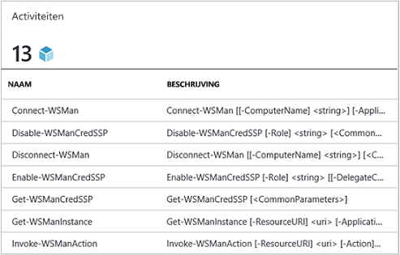
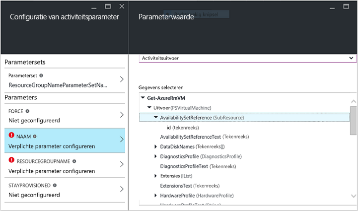
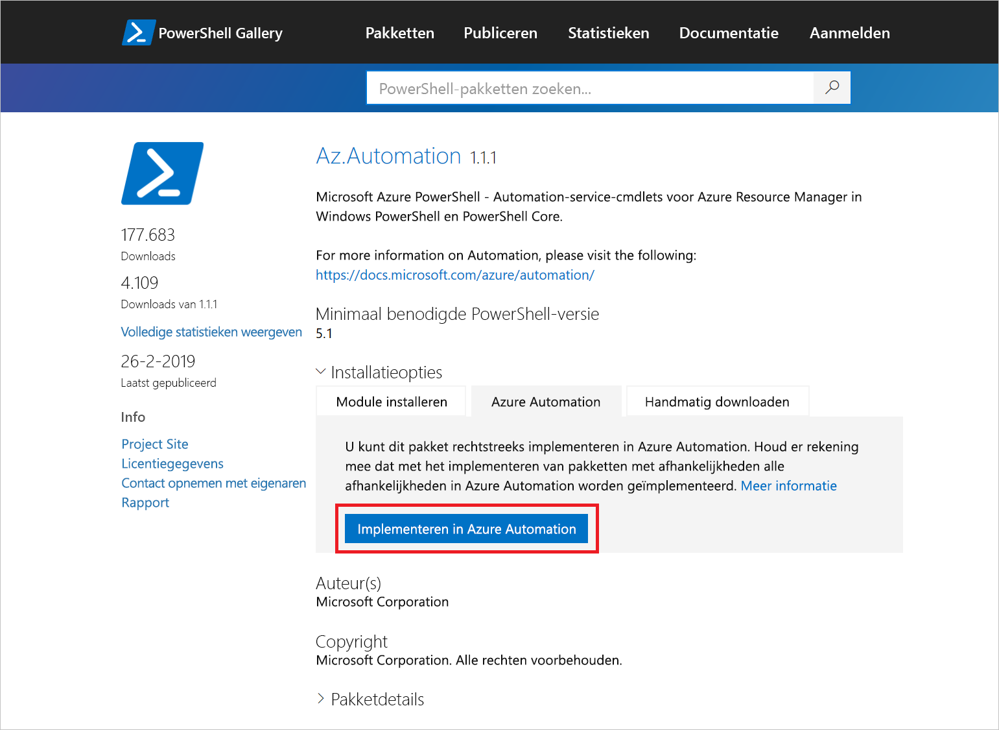
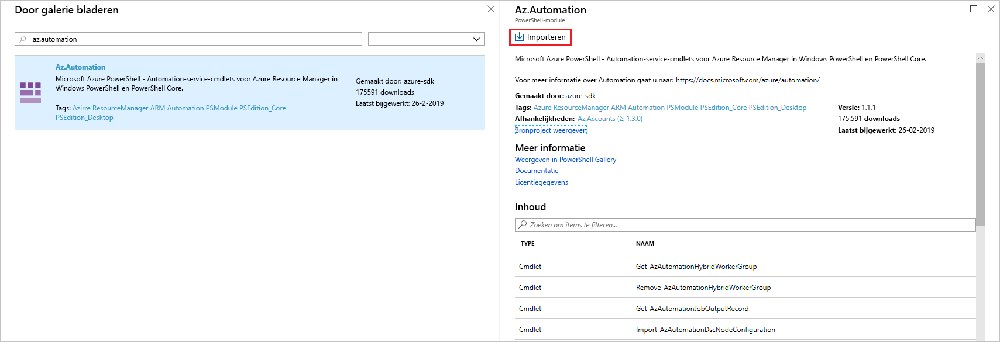
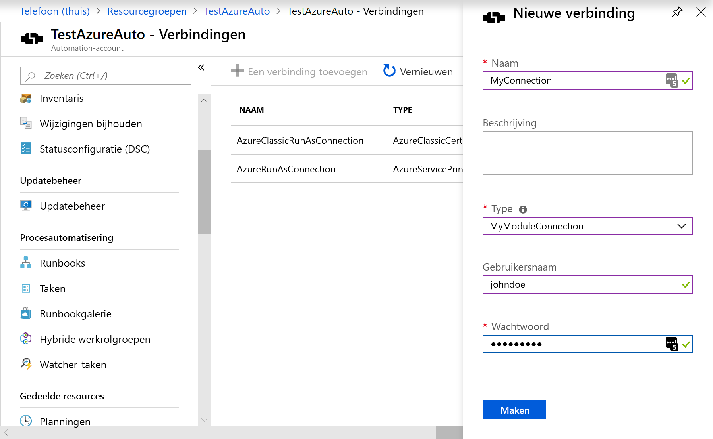

# <a name="manage-modules-in-azure-automation"></a>Modules beheren in Azure Automation

Met Azure Automation kunt u Power shell-modules importeren om cmdlets in te scha kelen in runbooks en DSC-resources in DSC-configuraties. De modules die in Azure Automation worden gebruikt, zijn:

* [Azure PowerShell AZ. Automation](/powershell/azure/new-azureps-module-az?view=azps-1.1.0)
* [Azure PowerShell AzureRM. Automation](https://docs.microsoft.com/powershell/module/azurerm.automation/?view=azurermps-6.13.0)
* Interne `Orchestrator.AssetManagement.Cmdlets` module voor de log Analytics-agent voor Windows
* Andere Power shell-modules
* Aangepaste modules die u maakt 

Wanneer u een Automation-account maakt, Azure Automation standaard een aantal modules geïmporteerd. Zie [standaard modules](#default-modules).

Wanneer Azure Automation runbook-en DSC-compilatie taken uitvoert, worden de modules geladen in sandboxes waar de runbooks kunnen worden uitgevoerd en kunnen de DSC-configuraties worden gecompileerd. Met Automation worden ook alle DSC-resources in modules op de DSC-pull-server geplaatst. Machines kunnen de bronnen ophalen wanneer ze de DSC-configuraties Toep assen.

>[!NOTE]
>Zorg ervoor dat u alleen de modules importeert die voor uw runbooks en DSC-configuraties echt nodig zijn. Het is niet raadzaam om de hoofdmap AZ-module te importeren, omdat deze vele andere modules bevat die u mogelijk niet nodig hebt. Dit kan prestatie problemen veroorzaken. Importeer in plaats daarvan afzonderlijke modules, zoals AZ. compute.

>[!NOTE]
>Dit artikel is bijgewerkt voor het gebruik van de nieuwe Azure PowerShell Az-module. De AzureRM-module kan nog worden gebruikt en krijgt bugoplossingen tot ten minste december 2020. Zie voor meer informatie over de nieuwe Az-module en compatibiliteit met AzureRM [Introductie van de nieuwe Az-module van Azure PowerShell](https://docs.microsoft.com/powershell/azure/new-azureps-module-az?view=azps-3.5.0). Zie [de module Azure PowerShell installeren](https://docs.microsoft.com/powershell/azure/install-az-ps?view=azps-3.5.0)voor de installatie-instructies voor AZ module op uw Hybrid Runbook Worker. Voor uw Automation-account kunt u uw modules bijwerken naar de nieuwste versie met behulp van [het bijwerken van Azure PowerShell-modules in azure Automation](../automation-update-azure-modules.md).

## <a name="default-modules"></a>Standaard modules

De volgende tabel bevat de modules die standaard door Azure Automation worden geïmporteerd wanneer u uw Automation-account maakt. Met Automation kunnen nieuwere versies van deze modules worden geïmporteerd. U kunt de oorspronkelijke versie echter niet verwijderen uit uw Automation-account, zelfs als u een nieuwere versie verwijdert. Houd er rekening mee dat deze standaard modules verschillende AzureRM-modules bevatten. 

Azure Automation importeert de hoofdmap AZ module niet automatisch in nieuwe of bestaande Automation-accounts. Zie [Migrating to AZ modules](#migrating-to-az-modules)(Engelstalig) voor meer informatie over het werken met deze modules.

> [!NOTE]
> Het is niet raadzaam om modules en runbooks te wijzigen in Automation-accounts die de [VM's buiten bedrijfsuren starten/stoppen oplossing in azure Automation](../automation-solution-vm-management.md)bevatten.

|Module naam|Versie|
|---|---|
| AuditPolicyDsc | 1.1.0.0 |
| Azure | 1.0.3 |
| Azure.Storage | 1.0.3 |
| AzureRM.Automation | 1.0.3 |
| AzureRM.Compute | 1.2.1 |
| AzureRM.Profile | 1.0.3 |
| AzureRM.Resources | 1.0.3 |
| AzureRM.Sql | 1.0.3 |
| AzureRM.Storage | 1.0.3 |
| ComputerManagementDsc | 5.0.0.0 |
| GPRegistryPolicyParser | 0,2 |
| Micro soft. Power shell. core | 0 |
| Micro soft. Power shell. Diagnostics |  |
| Micro soft. Power shell. Management |  |
| Micro soft. Power shell. Security |  |
| Microsoft.PowerShell.Utility |  |
| Micro soft. WSMan. Management |  |
| Orchestrator. AssetManagement. cmdlets | 1 |
| PSDscResources | 2.9.0.0 |
| SecurityPolicyDsc | 2.1.0.0 |
| StateConfigCompositeResources | 1 |
| xDSCDomainjoin | 1.1 |
| xPowerShellExecutionPolicy | 1.1.0.0 |
| xRemoteDesktopAdmin | 1.1.0.0 |

## <a name="az-module-cmdlets"></a>AZ module-cmdlets

Voor AZ. Automation hebben de meeste cmdlets dezelfde namen als voor de AzureRM-modules, behalve dat het voor voegsel AzureRm is gewijzigd in AZ. Zie [lijst met uitzonde ringen](/powershell/azure/migrate-from-azurerm-to-az#update-cmdlets-modules-and-parameters)voor een lijst met AZ-modules die niet voldoen aan deze naamgevings Conventie.

## <a name="internal-cmdlets"></a>Interne cmdlets

De volgende tabel definieert de interne cmdlets die door de `Orchestrator.AssetManagement.Cmdlets` module worden ondersteund. Gebruik deze cmdlets in uw runbooks en DSC-configuraties om te communiceren met Azure-assets binnen het Automation-account. De cmdlets zijn ontworpen om te worden gebruikt in plaats van Azure PowerShell-cmdlets om geheimen op te halen van versleutelde variabelen, referenties en versleutelde verbindingen. 

>[!NOTE]
>De interne cmdlets zijn alleen beschikbaar wanneer u runbooks uitvoert in de Azure sandbox-omgeving of op een Windows-Hybrid Runbook Worker. 

|Naam|Beschrijving|
|---|---|
|Get-AutomationCertificate|`Get-AutomationCertificate [-Name] <string> [<CommonParameters>]`|
|Get-AutomationConnection|`Get-AutomationConnection [-Name] <string> [-DoNotDecrypt] [<CommonParameters>]` |
|Get-AutomationPSCredential|`Get-AutomationPSCredential [-Name] <string> [<CommonParameters>]` |
|Get-AutomationVariable|`Get-AutomationVariable [-Name] <string> [-DoNotDecrypt] [<CommonParameters>]`|
|Set-AutomationVariable|`Set-AutomationVariable [-Name] <string> -Value <Object> [<CommonParameters>]` |
|Start-AutomationRunbook|`Start-AutomationRunbook [-Name] <string> [-Parameters <IDictionary>] [-RunOn <string>] [-JobId <guid>] [<CommonParameters>]`|
|Wait-AutomationJob|`Wait-AutomationJob -Id <guid[]> [-TimeoutInMinutes <int>] [-DelayInSeconds <int>] [-OutputJobsTransitionedToRunning] [<CommonParameters>]`|

Houd er rekening mee dat de interne cmdlets verschillen van de namen van de cmdlets AZ en AzureRM. Interne cmdlet-namen bevatten geen woorden zoals ' Azure ' of ' AZ ' in het zelfstandig naam woord, maar u kunt wel gebruikmaken van ' Automation '. We raden u aan het gebruik van AZ of AzureRM-cmdlets te gebruiken tijdens het uitvoeren van een runbook in een Azure sandbox of op een Windows Hybrid Worker. Ze vereisen minder para meters en worden uitgevoerd in de context van de taak die al wordt uitgevoerd.

U wordt aangeraden AZ-of AzureRM-cmdlets te gebruiken voor het bewerken van Azure Automation resources buiten de context van een runbook. 

## <a name="module-supporting-get-automationpscredential"></a>Module die Get-AutomationPSCredential ondersteunt

De `Get-AutomationPSCredential` cmdlet maakt deel uit van de `Orchestrator.AssetManagement.Cmdlets`module. Met deze cmdlet wordt `PSCredential` een object geretourneerd dat wordt verwacht door de meeste Power shell-cmdlets die met referenties werken. Zie [referentie-assets in azure Automation](credentials.md)voor meer informatie over het gebruik van referenties in azure Automation.

## <a name="migrating-to-az-modules"></a>Migreren naar AZ-modules

### <a name="migration-considerations"></a>Overwegingen bij migratie

In deze sectie vindt u overwegingen waarbij u rekening moet houden bij het migreren naar de AZ-modules in Azure Automation. Zie ook [Azure PowerShell migreren van AzureRM naar AZ](https://docs.microsoft.com/powershell/azure/migrate-from-azurerm-to-az?view=azps-3.7.0). 

#### <a name="use-of-azurerm-modules-and-az-modules-in-the-same-automation-account"></a>Gebruik van AzureRM-modules en AZ-modules in hetzelfde Automation-account

 Het is niet raadzaam om AzureRM-modules en AZ-modules uit te voeren in hetzelfde Automation-account. Wanneer u zeker weet dat u van AzureRM naar AZ wilt migreren, kunt u het beste volledig door voeren in een volledige migratie. De belangrijkste reden hiervoor is dat Azure Automation vaak sandboxs in het Automation-account opnieuw gebruikt om op te slaan op de opstart tijden. Als u geen volledige module migratie maakt, kunt u een taak starten met alleen AzureRM-modules en vervolgens een andere taak starten met alleen AZ-modules. De sandbox loopt binnenkort vast en er wordt een fatale fout weer gegeven met de mede deling dat de modules niet compatibel zijn. Deze situatie leidt ertoe dat er op wille keurige wijze crashes optreden voor een wille keurig runbook of configuratie. 

#### <a name="import-of-az-modules-into-the-powershell-session"></a>Importeren van AZ-modules in de Power shell-sessie

Wanneer u een AZ-module importeert in uw Automation-account, wordt de module niet automatisch geïmporteerd in de Power shell-sessie die door runbooks wordt gebruikt. Modules worden in de volgende situaties geïmporteerd in de Power shell-sessie:

* Wanneer een runbook een cmdlet aanroept vanuit een module
* Wanneer een runbook de module expliciet importeert met de cmdlet [import-module](https://docs.microsoft.com/powershell/module/microsoft.powershell.core/import-module?view=powershell-7)
* Wanneer een runbook een andere afhankelijke module importeert
    
#### <a name="testing-for-your-runbooks-and-dsc-configurations-prior-to-module-migration"></a>Testen van uw runbooks en DSC-configuraties vóór de module migratie

Zorg ervoor dat u alle runbooks en DSC-configuraties zorgvuldig test in een afzonderlijk Automation-account voordat u migreert naar de AZ-modules. 

#### <a name="updates-for-tutorial-runbooks"></a>Updates voor zelf studie-runbooks 

Wanneer u een nieuw Automation-account maakt, zelfs na migratie naar AZ-modules, worden in Azure Automation standaard de AzureRM-modules geïnstalleerd. U kunt de zelf studie-runbooks nog steeds bijwerken met de AzureRM-cmdlets. U moet deze runbooks echter niet uitvoeren.

### <a name="stop-and-unschedule-all-runbooks-that-use-azurerm-modules"></a>Alle runbooks die gebruikmaken van AzureRM-modules stoppen en de planning ervan opheffen

Om ervoor te zorgen dat u geen bestaande runbooks of DSC-configuraties uitvoert die gebruikmaken van AzureRM-modules, moet u alle betrokken runbooks en configuraties stoppen en de planning ervan opheffen. Zorg er eerst voor dat u elke runbook-of DSC-configuratie en de bijbehorende schema's afzonderlijk bekijkt om ervoor te zorgen dat u het item indien nodig opnieuw kunt plannen in de toekomst. 

Wanneer u klaar bent om uw planningen te verwijderen, kunt u de Azure Portal of de cmdlet [Remove-AzureRmAutomationSchedule](https://docs.microsoft.com/powershell/module/azurerm.automation/remove-azurermautomationschedule?view=azurermps-6.13.0) gebruiken. Zie [een schema verwijderen](schedules.md#removing-a-schedule).

### <a name="remove-the-azurerm-modules"></a>De AzureRM-modules verwijderen

Het is mogelijk om de AzureRM-modules te verwijderen voordat u de AZ-modules importeert. Het verwijderen van de AzureRM-modules kan echter de synchronisatie van broncode beheer onderbreken en ertoe leiden dat scripts die nog niet zijn gepland, mislukken. Als u besluit de modules te verwijderen, raadpleegt u [AzureRM verwijderen](https://docs.microsoft.com/powershell/azure/migrate-from-azurerm-to-az?view=azps-3.8.0#uninstall-azurerm).

### <a name="import-the-az-modules"></a>De AZ-modules importeren

In deze sectie wordt beschreven hoe u de AZ-modules in de Azure Portal importeert. Vergeet niet om alleen de AZ-modules te importeren die u nodig hebt, niet de volledige AZ. Automation-module. Omdat [AZ. accounts](https://www.powershellgallery.com/packages/Az.Accounts/1.1.0) een afhankelijkheid voor de andere AZ-modules zijn, moet u ervoor zorgen dat deze module vóór andere wordt geïmporteerd.

1. Selecteer in uw Automation-account **modules** onder **gedeelde bronnen**. 
2. Klik op **Bladeren galerie** om de pagina blader galerie te openen.  
3. Voer in de zoek balk de module naam in, bijvoorbeeld `Az.Accounts`. 
4. Klik op de pagina Power shell-module op **importeren** om de module te importeren in uw Automation-account.

    

Dit import proces kan ook worden uitgevoerd via de [PowerShell Gallery](https://www.powershellgallery.com) door te zoeken naar de module die u wilt importeren. Wanneer u de module hebt gevonden, selecteert u deze, kiest u het tabblad **Azure Automation** en klikt **u op implementeren in azure Automation**.


### <a name="test-your-runbooks"></a>Uw runbooks testen

Zodra u de AZ-modules in het Automation-account hebt geïmporteerd, kunt u beginnen met het bewerken van uw runbooks en DSC-configuraties om de nieuwe modules te gebruiken. Een manier om de wijziging van een runbook te testen om de nieuwe cmdlets te gebruiken, `Enable-AzureRmAlias -Scope Process` is aan het begin van het runbook. Door deze opdracht aan uw runbook toe te voegen, kan het script zonder wijzigingen worden uitgevoerd. 

## <a name="authoring-modules"></a>Ontwerp modules

U wordt aangeraden de overwegingen in deze sectie te volgen wanneer u een Power shell-module ontwerpt voor gebruik in Azure Automation.

### <a name="version-folder"></a>Versie map

Neem geen versie-map op in het **zip** -pakket voor uw module.  Dit probleem is minder belang rijk voor runbooks, maar veroorzaakt een probleem met de service State Configuration (DSC). Azure Automation maakt de map versie automatisch wanneer de module wordt gedistribueerd naar knoop punten die worden beheerd door DSC. Als er een versie map bestaat, kunt u een van de twee exemplaren beëindigen. Hier volgt een voor beeld van een mapstructuur voor een DSC-module:

```powershell
myModule
  - DSCResources
    - myResourceFolder
      myResourceModule.psm1
      myResourceSchema.mof
  myModuleManifest.psd1
```

### <a name="help-information"></a>Help-informatie

Neem een samen vatting, beschrijving en Help-URI op voor elke cmdlet in uw module. In Power shell kunt u Help-informatie voor cmdlets definiëren met `Get-Help` behulp van de-cmdlet. In het volgende voor beeld ziet u hoe u een samen vatting en Help-URI definieert in een **. psm1** -module bestand.

  ```powershell
  <#
       .SYNOPSIS
        Gets a Contoso User account
  #>
  function Get-ContosoUser {
  [CmdletBinding](DefaultParameterSetName='UseConnectionObject', `
  HelpUri='https://www.contoso.com/docs/information')]
  [OutputType([String])]
  param(
     [Parameter(ParameterSetName='UserAccount', Mandatory=true)]
     [ValidateNotNullOrEmpty()]
     [string]
     $UserName,

     [Parameter(ParameterSetName='UserAccount', Mandatory=true)]
     [ValidateNotNullOrEmpty()]
     [string]
     $Password,

     [Parameter(ParameterSetName='ConnectionObject', Mandatory=true)]
     [ValidateNotNullOrEmpty()]
     [Hashtable]
     $Connection
  )

  switch ($PSCmdlet.ParameterSetName) {
     "UserAccount" {
        $cred = New-Object –TypeName System.Management.Automation.PSCredential –ArgumentList $UserName, $Password
        Connect-Contoso -Credential $cred
     }
     "ConnectionObject" {
        Connect-Contoso -Connection $Connection
    }
  }
  }
  ```

  Als u deze informatie opgeeft, wordt de `Get-Help` Help-tekst weer gegeven via de cmdlet in de Power shell-console. Deze tekst wordt ook weer gegeven in de Azure Portal.

  

### <a name="connection-type"></a>Type verbinding

Als de module verbinding maakt met een externe service, definieert u een [verbindings type](#adding-a-connection-type-to-your-module). Elke cmdlet in de module moet een verbindings object (een exemplaar van dat verbindings type) accepteren als een para meter. Gebruikers wijzen alle para meters van de verbindings Asset toe aan de bijbehorende para meters telkens wanneer ze een cmdlet aanroepen. In het volgende voor beeld van een runbook, op basis van het voor beeld in de vorige sectie, `ContosoConnection` wordt een contoso-verbindings element gebruikt dat is aangeroepen om toegang te krijgen tot contoso-resources en gegevens te retour neren van de externe service. In dit voor beeld worden de velden toegewezen aan de `UserName` eigenschappen `Password` en van een `PSCredential` object en vervolgens door gegeven aan de cmdlet.

  ```powershell
  $contosoConnection = Get-AutomationConnection -Name 'ContosoConnection'

  $cred = New-Object –TypeName System.Management.Automation.PSCredential –ArgumentList $contosoConnection.UserName, $contosoConnection.Password
  Connect-Contoso -Credential $cred
  }
  ```

  Een eenvoudiger en betere manier om dit gedrag te benaderen, is door het verbindings object rechtstreeks door te geven aan de cmdlet:

  ```powershell
  $contosoConnection = Get-AutomationConnection -Name 'ContosoConnection'

  Connect-Contoso -Connection $contosoConnection
  }
  ```

  U kunt hetzelfde gedrag voor uw cmdlets inschakelen door ze in staat te stellen een verbindings object rechtstreeks als para meter te accepteren, in plaats van alleen verbindings velden voor para meters. Normaal gesp roken wilt u voor elke para meter instellen, zodat een gebruiker die geen gebruikmaakt van Azure Automation, uw cmdlets kan aanroepen zonder een hashtabel te maken die als verbindings object kan fungeren. De parameterset `UserAccount` wordt gebruikt om de eigenschappen van het verbindings veld door te geven. `ConnectionObject`Hiermee kunt u de verbinding direct door geven.

### <a name="output-type"></a>Uitvoer type

Definieer het uitvoer type voor alle cmdlets in uw module. Als u een uitvoer type voor een cmdlet definieert, kunt u met de ontwerp tijd IntelliSense de uitvoer eigenschappen van de cmdlet tijdens het ontwerpen bepalen. Deze praktijk is vooral nuttig tijdens het ontwerpen van een grafisch runbook, waarvoor ontwerp tijd kennis essentieel is voor een eenvoudige gebruikers ervaring met uw module.

Voeg een geldig type toe `[OutputType([<MyOutputType>])]` `MyOutputType` Zie `OutputType` [about functions OutputTypeAttribute](/powershell/module/microsoft.powershell.core/about/about_functions_outputtypeattribute)(Engelstalig) voor meer informatie over. De volgende code is een voor beeld van `OutputType` het toevoegen aan een cmdlet:

  ```powershell
  function Get-ContosoUser {
  [OutputType([String])]
  param(
     [string]
     $Parameter1
  )
  # <script location here>
  }
  ```

  

  Dit gedrag is vergelijkbaar met de functionaliteit ' type vooruit ' van de uitvoer van een cmdlet in Power shell ISE zonder dat u deze hoeft uit te voeren.

  

### <a name="cmdlet-state"></a>Cmdlet-status

Alle cmdlets in de module stateless maken. Meerdere runbook-taken kunnen tegelijkertijd worden uitgevoerd in `AppDomain` hetzelfde proces en in dezelfde sandbox. Als er een status op die niveaus wordt gedeeld, kunnen de taken van invloed zijn op elkaar. Dit gedrag kan leiden tot onregelmatige en moeilijk te onderzoeken problemen. Hier volgt een voor beeld van wat u niet moet doen:

  ```powershell
  $globalNum = 0
  function Set-GlobalNum {
     param(
         [int] $num
     )

     $globalNum = $num
  }
  function Get-GlobalNumTimesTwo {
     $output = $globalNum * 2

     $output
  }
  ```

### <a name="module-dependency"></a>Module afhankelijkheid

Zorg ervoor dat de module volledig is opgenomen in een pakket dat met Xcopy kan worden gekopieerd. Azure Automation-modules worden gedistribueerd naar de Automation-sandboxes wanneer runbooks worden uitgevoerd. De modules moeten onafhankelijk van de host werken waarop ze worden uitgevoerd. 

U moet een module pakket kunnen opwaarderen en verplaatsen en het als normaal laten functioneren wanneer het wordt geïmporteerd in de Power shell-omgeving van een andere host. Als u dit wilt doen, moet u ervoor zorgen dat de module niet afhankelijk is van bestanden buiten de module-map die is ingepakt wanneer de module in Azure Automation wordt geïmporteerd. 

De module mag niet afhankelijk zijn van unieke register instellingen op een host. Voor beelden zijn de instellingen die worden gemaakt wanneer een product wordt geïnstalleerd. 

### <a name="module-file-paths"></a>Bestands paden van module

Zorg ervoor dat alle bestanden in de module paden hebben die minder dan 140 tekens bevatten. Alle paden met een lengte van 140 tekens leiden tot problemen met het importeren van runbooks. Azure Automation kunt een bestand met een grootte van Maxi maal 140 tekens niet importeren in de `Import-Module`Power shell-sessie met.

## <a name="importing-modules"></a>Modules importeren

In deze sectie worden verschillende manieren gedefinieerd waarop u een module kunt importeren in uw Automation-account. 

### <a name="import-modules-in-azure-portal"></a>Modules importeren in Azure Portal

Een module importeren in de Azure Portal:

1. Navigeer naar uw Automation-account.
2. Selecteer **modules** onder **gedeelde bronnen**.
3. Klik op **een module toevoegen**. 
4. Selecteer het **zip** -bestand dat de module bevat.
5. Klik op **OK** om te beginnen met het importeren van het proces.

### <a name="import-modules-using-powershell"></a>Modules importeren met behulp van Power shell

U kunt de cmdlet [New-AzAutomationModule](https://docs.microsoft.com/powershell/module/az.automation/new-azautomationmodule?view=azps-3.7.0) gebruiken om een module te importeren in uw Automation-account. De cmdlet maakt een URL voor een module. zip-pakket.

```azurepowershell-interactive
New-AzAutomationModule -Name <ModuleName> -ContentLinkUri <ModuleUri> -ResourceGroupName <ResourceGroupName> -AutomationAccountName <AutomationAccountName>
```

U kunt ook dezelfde cmdlet gebruiken om rechtstreeks een module te importeren vanuit PowerShell Gallery. Zorg ervoor dat u `ModuleName` `ModuleVersion` van [PowerShell Gallery](https://www.powershellgallery.com)ophaalt.

```azurepowershell-interactive
$moduleName = <ModuleName>
$moduleVersion = <ModuleVersion>
New-AzAutomationModule -AutomationAccountName <AutomationAccountName> -ResourceGroupName <ResourceGroupName> -Name $moduleName -ContentLinkUri "https://www.powershellgallery.com/api/v2/package/$moduleName/$moduleVersion"
```

### <a name="import-modules-from-powershell-gallery"></a>Modules importeren uit PowerShell Gallery

U kunt [PowerShell Gallery](https://www.powershellgallery.com) modules rechtstreeks vanuit de galerie of vanuit uw Automation-account importeren.

Een module rechtstreeks vanuit het PowerShell Gallery importeren:

1. Ga naar https://www.powershellgallery.com en zoek naar de module die u wilt importeren.
2. Klik op **implementeren naar Azure Automation** op het tabblad **Azure Automation** onder **installatie opties**. Met deze actie wordt de Azure Portal geopend. 
3. Selecteer uw Automation-account op de pagina importeren en klik op **OK**.



Een PowerShell Gallery module rechtstreeks vanuit uw Automation-account importeren:

1. Selecteer **modules** onder **gedeelde bronnen**. 
2. Klik op de pagina modules op **Browse Gallery**en zoek in de galerie naar een module. 
3. Selecteer de module die u wilt importeren en klik op **importeren**. 
4. Klik op de pagina importeren op **OK** om het import proces te starten.



## <a name="deleting-modules"></a>Modules verwijderen

Als u problemen ondervindt met een module of als u een eerdere versie van een module wilt herstellen, kunt u deze verwijderen uit uw Automation-account. U kunt de oorspronkelijke versies van de [standaard modules](#default-modules) die worden geïmporteerd wanneer u een Automation-account maakt, niet verwijderen. Als de module die u wilt verwijderen een nieuwere versie is van een van de [standaard modules](#default-modules), wordt de versie hersteld die is geïnstalleerd met uw Automation-account. Anders wordt de module verwijderd die u uit uw Automation-account verwijdert.

### <a name="delete-modules-in-azure-portal"></a>Modules in Azure Portal verwijderen

Een module verwijderen in de Azure Portal:

1. Navigeer naar uw Automation-account en selecteer **modules** onder **gedeelde bronnen**. 
2. Selecteer de module die u wilt verwijderen. 
3. Selecteer op de pagina **module** de optie **verwijderen**. Als deze module een van de [standaard modules](#default-modules)is, wordt deze teruggedraaid naar de versie die bestond tijdens het maken van het Automation-account.

### <a name="delete-modules-using-powershell"></a>Modules verwijderen met Power shell

Als u een module wilt verwijderen via Power shell, voert u de volgende opdracht uit:

```azurepowershell-interactive
Remove-AzAutomationModule -Name <moduleName> -AutomationAccountName <automationAccountName> -ResourceGroupName <resourceGroupName>
```

## <a name="adding-a-connection-type-to-your-module"></a>Een verbindings type toevoegen aan uw module

U kunt een aangepast [verbindings type](../automation-connections.md) opgeven dat u wilt gebruiken in uw Automation-account door een optioneel meta gegevensbestand toe te voegen aan uw module. Dit bestand geeft een Azure Automation verbindings type op dat moet worden gebruikt met de cmdlets van de module in uw Automation-account. Zie [een Power shell-script module schrijven](https://docs.microsoft.com/powershell/scripting/developer/module/how-to-write-a-powershell-script-module?view=powershell-7)voor meer informatie over het ontwerpen van een Power shell-module.



Het bestand waarin de eigenschappen van het verbindings type worden opgegeven, heeft de naam ** &lt;module&gt;-Automation. json** en is te vinden in de module map van het gecomprimeerde **zip** -bestand. Dit bestand bevat de velden van een verbinding die vereist zijn om verbinding te maken met het systeem of de service die door de module wordt vertegenwoordigd. Met de configuratie kunt u een verbindings type maken in Azure Automation. Met dit bestand kunt u de veld namen en typen instellen en bepalen of de velden zijn versleuteld of optioneel voor het verbindings type van de module. Het volgende voor beeld is een sjabloon in de **JSON** -bestands indeling waarmee gebruikers naam-en wachtwoord eigenschappen worden gedefinieerd:

```json
{
   "ConnectionFields": [
   {
      "IsEncrypted":  false,
      "IsOptional":  true,
      "Name":  "Username",
      "TypeName":  "System.String"
   },
   {
      "IsEncrypted":  true,
      "IsOptional":  false,
      "Name":  "Password",
      "TypeName":  "System.String"
   }
   ],
   "ConnectionTypeName":  "MyModuleConnection",
   "IntegrationModuleName":  "MyModule"
}
```

## <a name="next-steps"></a>Volgende stappen

* Zie [aan de slag met Azure PowerShell](https://docs.microsoft.com/powershell/azure/get-started-azureps?view=azps-3.7.0)voor meer informatie over het gebruik van Azure PowerShell modules.
* Zie [een Windows Power shell-module schrijven](https://docs.microsoft.com/powershell/scripting/developer/module/writing-a-windows-powershell-module?view=powershell-7)voor meer informatie over het maken van Power shell-modules.
