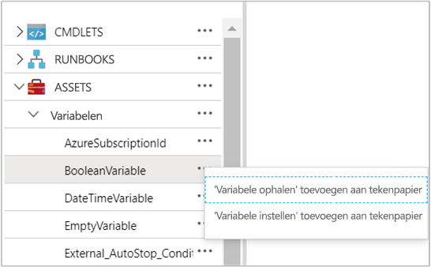
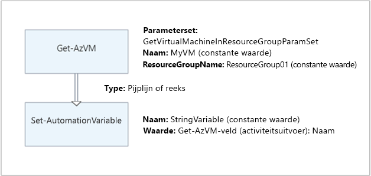

# <a name="manage-variables-in-azure-automation"></a>Variabelen in Azure Automation beheren

Variabele assets zijn waarden die beschikbaar zijn voor alle runbooks en DSC-configuraties in uw Automation-account. U kunt deze beheren vanuit het Azure Portal, vanuit Power shell, binnen een runbook of in een DSC-configuratie.

Automation-variabelen zijn handig voor de volgende scenario's:

- Het delen van een waarde tussen meerdere runbooks of DSC-configuraties.

- Het delen van een waarde tussen meerdere taken vanuit hetzelfde runbook of de DSC-configuratie.

- Het beheren van een waarde die wordt gebruikt door runbooks of DSC-configuraties vanuit de portal of vanaf de Power shell-opdracht regel. Een voor beeld is een set algemene configuratie-items, zoals een specifieke lijst met VM-namen, een specifieke resource groep, een AD-domein naam en meer.  

Azure Automation persistente variabelen en maakt deze beschikbaar, zelfs als een runbook-of DSC-configuratie mislukt. Dit gedrag maakt het mogelijk dat een runbook of DSC-configuratie een waarde instelt die vervolgens wordt gebruikt door een ander runbook of door hetzelfde runbook of de DSC-configuratie de volgende keer dat deze wordt uitgevoerd.

Azure Automation elke versleutelde variabele veilig op te slaan. Wanneer u een variabele maakt, kunt u de versleuteling en opslag opgeven door Azure Automation als een beveiligd activum. 

>[!NOTE]
>Beveilig assets in Azure Automation referenties, certificaten, verbindingen en versleutelde variabelen bevatten. Deze assets worden versleuteld en opgeslagen in Azure Automation met behulp van een unieke sleutel die wordt gegenereerd voor elk Automation-account. Azure Automation slaat de sleutel op in de door het systeem beheerde Key Vault. Voordat u een beveiligde Asset opslaat, laadt Automation de sleutel van Key Vault en gebruikt deze om de Asset te versleutelen. 

## <a name="variable-types"></a>Typen variabelen

Wanneer u een variabele met de Azure Portal maakt, moet u een gegevens type in de vervolg keuzelijst opgeven, zodat de portal het juiste besturings element kan weer geven voor het invoeren van de waarde van de variabele. Hieronder ziet u de beschik bare variabele typen in Azure Automation:

* Tekenreeks
* Geheel getal
* DateTime
* Booleaans
* Null

De variabele is niet beperkt tot het opgegeven gegevens type. U moet de variabele instellen met behulp van Windows Power shell als u een waarde van een ander type wilt opgeven. Als u opgeeft `Not defined` , wordt de waarde van de variabele ingesteld op null. U moet de waarde instellen met de cmdlet [set-AzAutomationVariable](/powershell/module/az.automation/set-azautomationvariable?view=azps-3.5.0) of de interne `Set-AutomationVariable` cmdlet.

U kunt de Azure Portal niet gebruiken om de waarde voor een complex type variabele te maken of te wijzigen. U kunt echter een waarde van elk type opgeven met behulp van Windows Power shell. Complexe typen worden opgehaald als een [PSCustomObject](/dotnet/api/system.management.automation.pscustomobject).

U kunt meerdere waarden opslaan voor één variabele door een matrix of hashtabel te maken en deze op te slaan in de variabele.

>[!NOTE]
>VM-naam variabelen mogen Maxi maal 80 tekens lang zijn. Variabelen voor resource groepen mogen Maxi maal 90 tekens lang zijn. Zie [naamgevings regels en beperkingen voor Azure-resources](../../azure-resource-manager/management/resource-name-rules.md).

## <a name="powershell-cmdlets-to-access-variables"></a>Power shell-cmdlets voor toegang tot variabelen

Met de cmdlets in de volgende tabel worden Automation-variabelen met Power shell gemaakt en beheerd. Ze worden geleverd als onderdeel van de [AZ-modules](modules.md#az-modules).

| Cmdlet | Beschrijving |
|:---|:---|
|[Get-AzAutomationVariable](/powershell/module/az.automation/get-azautomationvariable?view=azps-3.5.0) | Hiermee haalt u de waarde van een bestaande variabele op. Als de waarde een eenvoudig type is, wordt hetzelfde type opgehaald. Als het een complex type is, wordt er een `PSCustomObject` type opgehaald. <br>**Opmerking:**  U kunt deze cmdlet niet gebruiken om de waarde van een versleutelde variabele op te halen. De enige manier om dit te doen is met behulp van de interne `Get-AutomationVariable` cmdlet in een runbook of DSC-configuratie. Zie [interne cmdlets voor toegang tot variabelen](#internal-cmdlets-to-access-variables). |
|[New-AzAutomationVariable](/powershell/module/az.automation/new-azautomationvariable?view=azps-3.5.0) | Hiermee maakt u een nieuwe variabele en stelt u de waarde ervan in.|
|[Remove-AzAutomationVariable](/powershell/module/az.automation/remove-azautomationvariable?view=azps-3.5.0)| Hiermee verwijdert u een bestaande variabele.|
|[Set-AzAutomationVariable](/powershell/module/az.automation/set-azautomationvariable?view=azps-3.5.0)| Hiermee stelt u de waarde voor een bestaande variabele in. |

## <a name="internal-cmdlets-to-access-variables"></a>Interne cmdlets voor toegang tot variabelen

De interne cmdlets in de volgende tabel worden gebruikt voor toegang tot variabelen in uw runbooks en DSC-configuraties. Deze cmdlets worden geleverd met de globale module `Orchestrator.AssetManagement.Cmdlets` . Zie [interne cmdlets](modules.md#internal-cmdlets)voor meer informatie.

| Interne cmdlet | Beschrijving |
|:---|:---|
|`Get-AutomationVariable`|Hiermee haalt u de waarde van een bestaande variabele op.|
|`Set-AutomationVariable`|Hiermee stelt u de waarde voor een bestaande variabele in.|

> [!NOTE]
> Vermijd het gebruik van variabelen in de `Name` para meter van `Get-AutomationVariable` in een RUNBOOK of DSC-configuratie. Het gebruik van de variabelen kan de detectie van afhankelijkheden tussen runbooks en Automation-variabelen tijdens ontwerp tijd bemoeilijken.

`Get-AutomationVariable`werkt niet in Power shell, maar alleen in een runbook-of DSC-configuratie. Als u bijvoorbeeld de waarde van een versleutelde variabele wilt zien, kunt u een runbook maken om de variabele op te halen en deze vervolgens naar de uitvoer stroom te schrijven:
 
```powershell
$mytestencryptvar = Get-AutomationVariable -Name TestVariable
Write-output "The encrypted value of the variable is: $mytestencryptvar"
```

## <a name="python-2-functions-to-access-variables"></a>Python 2-functies voor toegang tot variabelen

De functies in de volgende tabel worden gebruikt voor toegang tot variabelen in een python 2-runbook.

|Python 2-functies|Beschrijving|
|:---|:---|
|`automationassets.get_automation_variable`|Hiermee haalt u de waarde van een bestaande variabele op. |
|`automationassets.set_automation_variable`|Hiermee stelt u de waarde voor een bestaande variabele in. |

> [!NOTE]
> U moet de `automationassets` module boven aan het python-runbook importeren om toegang te krijgen tot de Asset-functies.

## <a name="create-and-get-a-variable"></a>Een variabele maken en ophalen

>[!NOTE]
>Als u de versleuteling voor een variabele wilt verwijderen, moet u de variabele verwijderen en opnieuw maken als niet-versleuteld.

### <a name="create-and-get-a-variable-using-the-azure-portal"></a>Een variabele maken en ophalen met behulp van de Azure Portal

1. Klik vanuit uw Automation-account op de tegel **assets** , vervolgens op de Blade **assets** en selecteer **variabelen**.
2. Selecteer **een variabele toevoegen**op de tegel **variabelen** .
3. Voltooi de opties op de Blade **nieuwe variabele** en klik vervolgens op **maken** om de nieuwe variabele op te slaan.

> [!NOTE]
> Zodra u een versleutelde variabele hebt opgeslagen, kan deze niet worden weer gegeven in de portal. Het kan alleen worden bijgewerkt.

### <a name="create-and-get-a-variable-in-windows-powershell"></a>Een variabele maken en ophalen in Windows Power shell

Uw runbook-of DSC-configuratie maakt gebruik van de `New-AzAutomationVariable` cmdlet om een nieuwe variabele te maken en de oorspronkelijke waarde ervan in te stellen. Als de variabele is versleuteld, moet de aanroep de `Encrypted` para meter gebruiken. Uw script kan de waarde van de variabele ophalen met `Get-AzAutomationVariable` . 

>[!NOTE]
>Een Power shell-script kan een versleutelde waarde niet ophalen. De enige manier om dit te doen is door de interne `Get-AutomationVariable` cmdlet te gebruiken.

In het volgende voor beeld ziet u hoe u een teken reeks variabele maakt en vervolgens de waarde ervan als resultaat geeft.

```powershell
New-AzAutomationVariable -ResourceGroupName "ResourceGroup01" 
–AutomationAccountName "MyAutomationAccount" –Name 'MyStringVariable' `
–Encrypted $false –Value 'My String'
$string = (Get-AzAutomationVariable -ResourceGroupName "ResourceGroup01" `
–AutomationAccountName "MyAutomationAccount" –Name 'MyStringVariable').Value
```

In het volgende voor beeld ziet u hoe u een variabele met een complex type maakt en vervolgens de eigenschappen ervan ophaalt. In dit geval wordt een object van de virtuele machine uit [Get-AzVM](/powershell/module/Az.Compute/Get-AzVM?view=azps-3.5.0) gebruikt.

```powershell
$vm = Get-AzVM -ResourceGroupName "ResourceGroup01" –Name "VM01"
New-AzAutomationVariable –AutomationAccountName "MyAutomationAccount" –Name "MyComplexVariable" –Encrypted $false –Value $vm

$vmValue = (Get-AzAutomationVariable -ResourceGroupName "ResourceGroup01" `
–AutomationAccountName "MyAutomationAccount" –Name "MyComplexVariable").Value
$vmName = $vmValue.Name
$vmIpAddress = $vmValue.IpAddress
```

## <a name="textual-runbook-examples"></a>Voor beelden van tekst-runbook

### <a name="retrieve-and-set-a-simple-value-from-a-variable"></a>Een eenvoudige waarde uit een variabele ophalen en instellen

In het volgende voor beeld ziet u hoe u een variabele kunt instellen en ophalen in een tekst runbook. In dit voor beeld wordt ervan uitgegaan dat de `NumberOfIterations` variabele integer een naam en `NumberOfRunnings` een teken reeks met de naam heeft gemaakt `SampleMessage` .

```powershell
$NumberOfIterations = Get-AzAutomationVariable -ResourceGroupName "ResourceGroup01" –AutomationAccountName "MyAutomationAccount" -Name 'NumberOfIterations'
$NumberOfRunnings = Get-AzAutomationVariable -ResourceGroupName "ResourceGroup01" –AutomationAccountName "MyAutomationAccount" -Name 'NumberOfRunnings'
$SampleMessage = Get-AutomationVariable -Name 'SampleMessage'

Write-Output "Runbook has been run $NumberOfRunnings times."

for ($i = 1; $i -le $NumberOfIterations; $i++) {
    Write-Output "$i`: $SampleMessage"
}
Set-AzAutomationVariable -ResourceGroupName "ResourceGroup01" –AutomationAccountName "MyAutomationAccount" –Name NumberOfRunnings –Value ($NumberOfRunnings += 1)
```

### <a name="retrieve-and-set-a-variable-in-a-python-2-runbook"></a>Een variabele ophalen en instellen in een python 2-runbook

Het volgende voor beeld laat zien hoe u een variabele kunt ophalen, een variabele kunt instellen en een uitzonde ring kunt afhandelen voor een niet-bestaande variabele in een python 2-runbook.

```python
import automationassets
from automationassets import AutomationAssetNotFound

# get a variable
value = automationassets.get_automation_variable("test-variable")
print value

# set a variable (value can be int/bool/string)
automationassets.set_automation_variable("test-variable", True)
automationassets.set_automation_variable("test-variable", 4)
automationassets.set_automation_variable("test-variable", "test-string")

# handle a non-existent variable exception
try:
    value = automationassets.get_automation_variable("nonexisting variable")
except AutomationAssetNotFound:
    print "variable not found"
```

## <a name="graphical-runbook-examples"></a>Voor beelden van grafische runbook

In een grafisch runbook kunt u activiteiten voor de interne cmdlets of toevoegen `Get-AutomationVariable` `Set-AutomationVariable` . Klik met de rechter muisknop op elke variabele in het deel venster Bibliotheek van de grafische editor en selecteer de gewenste activiteit.



De volgende afbeelding toont voorbeeld activiteiten om een variabele met een eenvoudige waarde in een grafisch runbook bij te werken. In dit voor beeld wordt met de activiteit voor het `Get-AzVM` ophalen van één virtuele Azure-machine en de computer naam opgeslagen op een bestaande automatiserings reeks variabele. Het maakt niet uit of de [koppeling een pijp lijn of sequencer is](../automation-graphical-authoring-intro.md#use-links-for-workflow) , omdat de code slechts één object in de uitvoer verwacht.



## <a name="next-steps"></a>Volgende stappen

* Zie [modules beheren in azure Automation](modules.md)voor meer informatie over de cmdlets die worden gebruikt voor toegang tot variabelen.
* Zie voor algemene informatie over runbooks [Runbook-uitvoering in azure Automation](../automation-runbook-execution.md).
* Zie [Azure Automation status configuratie Overview](../automation-dsc-overview.md)(Engelstalig) voor meer informatie over DSC-configuraties.
