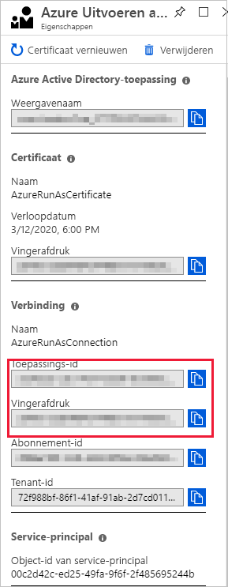
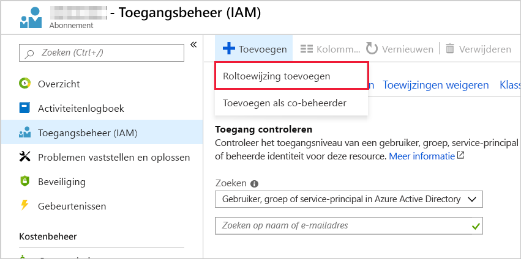
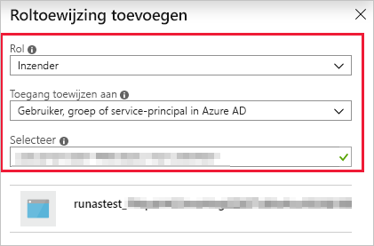

# <a name="troubleshoot-errors-with-runbooks"></a>Fouten met runbooks oplossen

Wanneer er fouten zijn opgetreden bij het uitvoeren van runbooks in Azure Automation, kunt u de volgende stappen gebruiken om te helpen bij het vaststellen van de problemen.

1. **Zorg ervoor dat het runbook-script correct wordt uitgevoerd op uw lokale machine.** 

    Raadpleeg de [Power shell-docs](/powershell/scripting/overview) of [python-documenten](https://docs.python.org/3/) voor taal referentie-en leer modules. Als u uw script lokaal uitvoert, kunnen veelvoorkomende fouten worden gedetecteerd en opgelost, zoals:

      * Ontbrekende modules
      * Syntaxis fouten
      * Logische fouten

2. **[Fout stromen](https://docs.microsoft.com/azure/automation/automation-runbook-output-and-messages#runbook-output)voor runbook onderzoeken.**

    Bekijk deze streams voor specifieke berichten en vergelijk ze met de fouten die in dit artikel worden beschreven.

3. **Zorg ervoor dat uw knoop punten en Automation-werk ruimte de vereiste modules hebben.** 

    Als uw runbook modules importeert, controleert u of deze beschikbaar zijn voor uw Automation-account met behulp van de stappen die worden beschreven in [modules importeren](../shared-resources/modules.md#import-modules). Werk uw modules bij naar de meest recente versie door de instructies te volgen [in azure-modules bijwerken in azure Automation](..//automation-update-azure-modules.md). Zie [problemen met modules oplossen](shared-resources.md#modules)voor meer informatie over probleem oplossing.

4. **Als uw runbook wordt onderbroken of onverwacht mislukt.**

    * [Controleer of de taak statussen](https://docs.microsoft.com/azure/automation/automation-runbook-execution#job-statuses) de runbook-statussen en enkele mogelijke oorzaken definieert.
    * [Voeg extra uitvoer](https://docs.microsoft.com/azure/automation/automation-runbook-output-and-messages#message-streams) aan het runbook toe om te bepalen wat er gebeurt voordat het runbook wordt onderbroken.
    * [Alle uitzonde ringen verwerken](https://docs.microsoft.com/azure/automation/automation-runbook-execution#handling-exceptions) die door uw taak worden gegenereerd.

## <a name="login-azurerm"></a>Scenario: aanmeldings AzureRMAccount uitvoeren om u aan te melden

### <a name="issue"></a>Probleem

Bij het uitvoeren van een runbook wordt de volgende fout weer gegeven:

```error
Run Login-AzureRMAccount to login.
```

### <a name="cause"></a>Oorzaak

Deze fout kan optreden wanneer u geen uitvoeren als-account gebruikt of als het run as-account is verlopen. Zie [Azure Automation uitvoeren als-accounts beheren](https://docs.microsoft.com/azure/automation/manage-runas-account).

Deze fout heeft twee primaire oorzaken:

* Er zijn verschillende versies van de AzureRM-of AZ-module.
* U probeert toegang te krijgen tot resources in een afzonderlijk abonnement.

### <a name="resolution"></a>Oplossing

Als deze fout wordt weer gegeven nadat u een AzureRM-of AZ-module hebt bijgewerkt, moet u alle modules bijwerken naar dezelfde versie.

Als u probeert toegang te krijgen tot resources in een ander abonnement, kunt u de onderstaande stappen volgen om machtigingen te configureren.

1. Ga naar het Automation uitvoeren als-account en kopieer de toepassings-ID en vinger afdruk.
  de toepassings-ID en de vinger afdruk 
1. Ga naar de Access Control van het abonnement waarin het Automation-account niet wordt gehost en voeg een nieuwe roltoewijzing toe.
  
1. Voeg de toepassings-ID die u eerder hebt verzameld, toe. Selecteer Inzender machtigingen.
   
1. Kopieer de naam van het abonnement.
1. U kunt nu de volgende runbook-code gebruiken om de machtigingen van uw Automation-account te testen voor het andere abonnement. Vervang `"\<CertificateThumbprint\>"` door de waarde die u in stap 1 hebt gekopieerd. Vervang `"\<SubscriptionName\>"` door de waarde die u in stap 4 hebt gekopieerd.

    ```powershell
    $Conn = Get-AutomationConnection -Name AzureRunAsConnection
    Connect-AzureRmAccount -ServicePrincipal -Tenant $Conn.TenantID -ApplicationId $Conn.ApplicationID -CertificateThumbprint "<CertificateThumbprint>"
    #Select the subscription you want to work with
    Select-AzureRmSubscription -SubscriptionName '<YourSubscriptionNameGoesHere>'

    #Test and get outputs of the subscriptions you granted access.
    $subscriptions = Get-AzureRmSubscription
    foreach($subscription in $subscriptions)
    {
        Set-AzureRmContext $subscription
        Write-Output $subscription.Name
    }
    ```

## <a name="unable-to-find-subscription"></a>Scenario: het Azure-abonnement kan niet worden gevonden

### <a name="issue"></a>Probleem

U ontvangt de volgende fout bij het werken met de `Select-AzureSubscription`-of `Select-AzureRmSubscription`-cmdlet:

```error
The subscription named <subscription name> cannot be found.
```

### <a name="error"></a>Fout

Deze fout kan optreden als:

* De naam van het abonnement is niet geldig.
* De Azure Active Directory gebruiker die de abonnements gegevens probeert op te halen, is niet geconfigureerd als beheerder van het abonnement.

### <a name="resolution"></a>Oplossing

Volg de onderstaande stappen om te bepalen of u hebt geverifieerd voor Azure en toegang hebt tot het abonnement dat u wilt selecteren.

1. Om ervoor te zorgen dat uw script zelfstandig werkt, test u het buiten Azure Automation.
2. Zorg ervoor dat uw script de cmdlet `Add-AzureAccount` uitvoert voordat u de `Select-AzureSubscription`-cmdlet uitvoert.
3. `Disable-AzureRmContextAutosave –Scope Process` toevoegen aan het begin van het runbook. Met deze cmdlet-aanroep zorgt u ervoor dat alle referenties alleen van toepassing zijn op de uitvoering van het huidige runbook.
4. Als dit fout bericht nog steeds wordt weer gegeven, wijzigt u de code door de para meter `AzureRmContext` toe te voegen voor de `Add-AzureAccount` cmdlet en voert u de code uit.

   ```powershell
   Disable-AzureRmContextAutosave –Scope Process

   $Conn = Get-AutomationConnection -Name AzureRunAsConnection
   Connect-AzureRmAccount -ServicePrincipal -Tenant $Conn.TenantID -ApplicationId $Conn.ApplicationID -CertificateThumbprint $Conn.CertificateThumbprint

   $context = Get-AzureRmContext

   Get-AzureRmVM -ResourceGroupName myResourceGroup -AzureRmContext $context
    ```

## <a name="auth-failed-mfa"></a>Scenario: authenticatie naar Azure is mislukt omdat multi-factor Authentication is ingeschakeld

### <a name="issue"></a>Probleem

U ontvangt de volgende fout melding bij de verificatie bij Azure met uw Azure-gebruikers naam en-wacht woord:

```error
Add-AzureAccount: AADSTS50079: Strong authentication enrollment (proof-up) is required
```

### <a name="cause"></a>Oorzaak

Als u multi-factor Authentication voor uw Azure-account hebt, kunt u geen Azure Active Directory gebruiker gebruiken om te verifiëren bij Azure. In plaats daarvan moet u een certificaat of een Service-Principal gebruiken om te verifiëren.

### <a name="resolution"></a>Oplossing

Als u een certificaat met cmdlets voor het klassieke Azure-implementatie model wilt gebruiken, raadpleegt u [een certificaat maken en toevoegen om Azure-Services te beheren](https://blogs.technet.com/b/orchestrator/archive/2014/04/11/managing-azure-services-with-the-microsoft-azure-automation-preview-service.aspx). Zie Service-Principal [maken met behulp van Azure Portal](../../active-directory/develop/howto-create-service-principal-portal.md) en [verificatie van een service-principal met Azure Resource Manager](../../active-directory/develop/howto-authenticate-service-principal-powershell.md)om een service-principal met Azure Resource Manager-cmdlets te gebruiken.

## <a name="get-serializationsettings"></a>Scenario: er wordt een fout in uw taak stromen weer geven over de get_SerializationSettings methode

### <a name="issue"></a>Probleem

U ziet de volgende fout in uw taak stromen voor een runbook:

```error
Connect-AzureRMAccount : Method 'get_SerializationSettings' in type
'Microsoft.Azure.Management.Internal.Resources.ResourceManagementClient' from assembly
'Microsoft.Azure.Commands.ResourceManager.Common, Version=4.0.0.0, Culture=neutral, PublicKeyToken=31bf3856ad364e35'
does not have an implementation.
At line:16 char:1
+ Connect-AzureRMAccount -ServicePrincipal -Tenant $Conn.TenantID -Appl ...
+ ~~~~~~~~~~~~~~~~~~~~~~~~~~~~~~~~~~~~~~~~~~~~~~~~~~~~~~~~~~~~~~~~~~~~~
    + CategoryInfo          : NotSpecified: (:) [Connect-AzureRmAccount], TypeLoadException
    + FullyQualifiedErrorId : System.TypeLoadException,Microsoft.Azure.Commands.Profile.ConnectAzureRmAccountCommand
```

### <a name="cause"></a>Oorzaak

Deze fout wordt veroorzaakt door het gebruik van zowel de AzureRM-als AZ-module-cmdlets in een runbook. Deze gebeurtenis treedt op wanneer u de AZ-module importeert voordat u de AzureRM-module importeert.

### <a name="resolution"></a>Oplossing

AZ en AzureRM-cmdlets kunnen niet worden geïmporteerd en gebruikt in hetzelfde runbook. Voor meer informatie over AZ-cmdlets in Azure Automation raadpleegt u [AZ module support in azure Automation](../az-modules.md).

## <a name="task-was-cancelled"></a>Scenario: het runbook is mislukt met de fout: een taak is geannuleerd

### <a name="issue"></a>Probleem

Het runbook is mislukt met een fout die vergelijkbaar is met het volgende voor beeld:

```error
Exception: A task was canceled.
```

### <a name="cause"></a>Oorzaak

Deze fout kan worden veroorzaakt door het gebruik van verouderde Azure-modules.

### <a name="resolution"></a>Oplossing

U kunt deze fout oplossen door uw Azure-modules bij te werken naar de meest recente versie. 

1. Klik in uw Automation-account op **modules**en **werk vervolgens Azure-modules**bij. 
2. De update neemt ongeveer 15 minuten in beslag. Als de app is voltooid, voert u het runbook dat is mislukt opnieuw uit.

Zie [Azure-modules bijwerken in azure Automation](../automation-update-azure-modules.md)voor meer informatie over het bijwerken van uw modules.

## <a name="runbook-auth-failure"></a>Scenario: Runbooks mislukken bij het omgaan met meerdere abonnementen

### <a name="issue"></a>Probleem

Bij het uitvoeren van runbooks kan het runbook geen Azure-resources beheren.

### <a name="cause"></a>Oorzaak

Het runbook gebruikt niet de juiste context wanneer het wordt uitgevoerd.

### <a name="resolution"></a>Oplossing

De context van het abonnement kan verloren gaan wanneer een runbook meerdere runbooks aanroept. Als u er zeker van wilt zijn dat de context van het abonnement wordt door gegeven aan de runbooks, laat u het runbook van de client de context door geven aan de cmdlet `Start-AzureRmAutomationRunbook` in de para meter `AzureRmContext`. Gebruik de `Disable-AzureRmContextAutosave` cmdlet met de para meter `Scope` ingesteld op `Process` om ervoor te zorgen dat de opgegeven referenties alleen worden gebruikt voor het huidige runbook. Zie [werken met meerdere abonnementen](../automation-runbook-execution.md#working-with-multiple-subscriptions)voor meer informatie.

```azurepowershell-interactive
# Ensures that any credentials apply only to the execution of this runbook
Disable-AzureRmContextAutosave –Scope Process

# Connect to Azure with Run As account
$ServicePrincipalConnection = Get-AutomationConnection -Name 'AzureRunAsConnection'

Add-AzureRmAccount `
    -ServicePrincipal `
    -TenantId $ServicePrincipalConnection.TenantId `
    -ApplicationId $ServicePrincipalConnection.ApplicationId `
    -CertificateThumbprint $ServicePrincipalConnection.CertificateThumbprint

$AzureContext = Select-AzureRmSubscription -SubscriptionId $ServicePrincipalConnection.SubscriptionID

$params = @{"VMName"="MyVM";"RepeatCount"=2;"Restart"=$true}

Start-AzureRmAutomationRunbook `
    –AutomationAccountName 'MyAutomationAccount' `
    –Name 'Test-ChildRunbook' `
    -ResourceGroupName 'LabRG' `
    -AzureRmContext $AzureContext `
    –Parameters $params –wait
```

## <a name="not-recognized-as-cmdlet"></a>Scenario: term wordt niet herkend als de naam van een cmdlet, functie, script

### <a name="issue"></a>Probleem

Het runbook is mislukt met een fout die vergelijkbaar is met het volgende voor beeld:

```error
The term 'Connect-AzureRmAccount' is not recognized as the name of a cmdlet, function, script file, or operable program. Check the spelling of the name, or if the path was included verify that the path is correct and try again.
```

### <a name="cause"></a>Oorzaak

Deze fout kan de volgende oorzaken hebben:

* De module met de cmdlet wordt niet geïmporteerd in het Automation-account.
* De module met de cmdlet is geïmporteerd, maar is verouderd.

### <a name="resolution"></a>Oplossing

Voer een van de volgende taken uit om deze fout op te lossen. 

* Zie [Azure PowerShell-modules bijwerken in azure Automation](../automation-update-azure-modules.md) voor informatie over het bijwerken van uw modules in uw Automation-account voor een Azure-module.

* Voor een module die niet van Azure is, moet u ervoor zorgen dat de module in uw Automation-account is geïmporteerd.

## <a name="job-attempted-3-times"></a>Scenario: het starten van de runbook-taak is drie keer geprobeerd, maar kan niet elke keer worden gestart

### <a name="issue"></a>Probleem

Het runbook is mislukt met de volgende fout:

```error
The job was tried three times but it failed
```

### <a name="cause"></a>Oorzaak

Deze fout treedt op als gevolg van een van de volgende problemen:

* Geheugen limiet. Een taak kan mislukken als er meer dan 400 MB aan geheugen wordt gebruikt. De gedocumenteerde limieten voor geheugen die aan een sandbox zijn toegewezen, worden gevonden bij [limieten voor Automation-Service](../../azure-resource-manager/management/azure-subscription-service-limits.md#automation-limits). 

* Netwerk sockets. Azure-sandboxes zijn beperkt tot 1000 gelijktijdige netwerk sockets. Zie [limieten voor Automation-Service](../../azure-resource-manager/management/azure-subscription-service-limits.md#automation-limits).

* Module is niet compatibel. Module-afhankelijkheden zijn mogelijk niet juist. In dit geval retourneert uw runbook meestal een `Command not found` of `Cannot bind parameter` bericht.

* Geen verificatie met Active Directory voor sandbox. Uw runbook heeft geprobeerd een uitvoerbaar of subproces dat wordt uitgevoerd in een Azure sandbox aan te roepen. Het configureren van runbooks om te verifiëren met Azure AD met behulp van de Azure Active Directory Authentication Library (ADAL) wordt niet ondersteund.

* Te veel uitzonderings gegevens. Uw runbook heeft geprobeerd te veel uitzonderings gegevens te schrijven naar de uitvoer stroom.

### <a name="resolution"></a>Oplossing

* Geheugen limiet, netwerk sockets. Voorgestelde manieren om binnen de geheugen limieten te werken, zijn om de werk belasting over meerdere runbooks te verdelen, minder gegevens in het geheugen te verwerken, overbodige uitvoer van runbooks te voor komen en te bepalen hoeveel controle punten in uw Power shell-werk stroom zijn geschreven runbooks. Gebruik de methode Clear, zoals `$myVar.clear`, om variabelen te wissen en gebruik `[GC]::Collect` om de garbagecollection onmiddellijk uit te voeren. Deze acties verminderen het geheugen gebruik van uw runbook tijdens runtime.

* Module is niet compatibel. Werk uw Azure-modules bij door de stappen te volgen in de [Azure Automation Azure PowerShell-modules bij te werken](../automation-update-azure-modules.md).

* Geen verificatie met Active Directory voor sandbox. Zorg ervoor dat de Azure AD-module beschikbaar is in uw Automation-account wanneer u een verificatie uitvoert voor Azure AD met een runbook. Zorg ervoor dat u het uitvoeren als-account de benodigde machtigingen verleent om de taken uit te voeren die door het runbook worden geautomatiseerd.

  Als uw runbook geen uitvoerbaar of subproces kan aanroepen dat wordt uitgevoerd in een Azure-sandbox, gebruikt u het runbook op een [Hybrid Runbook worker](../automation-hrw-run-runbooks.md). Hybrid Workers worden niet beperkt door de geheugen-en netwerk limieten die Azure-sandboxes hebben.

* Te veel uitzonderings gegevens. Er is een limiet van 1 MB voor de taak uitvoer stroom. Zorg ervoor dat uw runbook aanroepen naar een uitvoerbaar bestand of subproces samensluit met `try` en `catch` blokken. Als de bewerkingen een uitzonde ring veroorzaken, laat u de code het bericht van de uitzonde ring in een Automation-variabele schrijven. Met deze techniek wordt voor komen dat het bericht naar de uitvoer stroom van de taak wordt geschreven.

## <a name="sign-in-failed"></a>Scenario: aanmelden bij het Azure-account is mislukt

### <a name="issue"></a>Probleem

Er wordt een van de volgende fouten weer gegeven wanneer u werkt met de `Add-AzureAccount`-of `Connect-AzureRmAccount`-cmdlet:

```error
Unknown_user_type: Unknown User Type
```

```error
No certificate was found in the certificate store with thumbprint
```

### <a name="cause"></a>Oorzaak

Deze fouten treden op als de naam van het referentie-element niet geldig is. Ze kunnen ook optreden als de gebruikers naam en het wacht woord die u hebt gebruikt voor het instellen van het Automation-referentie-element niet geldig zijn.

### <a name="resolution"></a>Oplossing

Voer de volgende stappen uit om te bepalen wat er mis is:

1. Zorg ervoor dat u geen speciale tekens hebt. Deze tekens bevatten het `\@` teken in de naam van het Automation-referentie-element dat u gebruikt om verbinding te maken met Azure.
2. Controleer of u de gebruikers naam en het wacht woord kunt gebruiken die zijn opgeslagen in de Azure Automation referentie in uw lokale Power shell ISE-editor. Voer de volgende cmdlets uit in de Power shell-ISE.

   ```powershell
   $Cred = Get-Credential
   #Using Azure Service Management
   Add-AzureAccount –Credential $Cred
   #Using Azure Resource Manager
   Connect-AzureRmAccount –Credential $Cred
   ```

3. Als uw verificatie lokaal mislukt, hebt u uw Azure Active Directory referenties niet juist ingesteld. Raadpleeg de [verificatie voor Azure met Azure Active Directory](https://azure.microsoft.com/blog/azure-automation-authenticating-to-azure-using-azure-active-directory/) blog bericht om de Azure Active Directory-account goed in te stellen.

4. Als de fout tijdelijk wordt weer gegeven, kunt u proberen logica toe te voegen aan uw verificatie routine om te zorgen voor een betere verificatie.

   ```powershell
   # Get the connection "AzureRunAsConnection"
   $connectionName = "AzureRunAsConnection"
   $servicePrincipalConnection = Get-AutomationConnection -Name $connectionName

   $logonAttempt = 0
   $logonResult = $False

   while(!($connectionResult) -And ($logonAttempt -le 10))
   {
       $LogonAttempt++
       #Logging in to Azure...
       $connectionResult = Connect-AzureRmAccount `
                              -ServicePrincipal `
                              -TenantId $servicePrincipalConnection.TenantId `
                              -ApplicationId $servicePrincipalConnection.ApplicationId `
                              -CertificateThumbprint $servicePrincipalConnection.CertificateThumbprint

       Start-Sleep -Seconds 30
   }
   ```

## <a name="child-runbook-object"></a>Scenario: de object verwijzing is niet ingesteld op een exemplaar van een object

### <a name="issue"></a>Probleem

U ontvangt de volgende fout bij het aanroepen van een onderliggend runbook met de para meter `Wait` en de uitvoer stroom bevat een object:

```error
Object reference not set to an instance of an object
```

### <a name="cause"></a>Oorzaak

`Start-AzureRmAutomationRunbook` de uitvoer stroom niet correct verwerkt als de stroom objecten bevat.

### <a name="resolution"></a>Oplossing

Het is raadzaam om een polling logica te implementeren en de cmdlet [Get-AzureRmAutomationJobOutput](/powershell/module/azurerm.automation/get-azurermautomationjoboutput) te gebruiken om de uitvoer op te halen. Hieronder wordt een voor beeld van deze logica gedefinieerd.

```powershell
$automationAccountName = "ContosoAutomationAccount"
$runbookName = "ChildRunbookExample"
$resourceGroupName = "ContosoRG"

function IsJobTerminalState([string] $status) {
    return $status -eq "Completed" -or $status -eq "Failed" -or $status -eq "Stopped" -or $status -eq "Suspended"
}

$job = Start-AzureRmAutomationRunbook -AutomationAccountName $automationAccountName -Name $runbookName -ResourceGroupName $resourceGroupName
$pollingSeconds = 5
$maxTimeout = 10800
$waitTime = 0
while((IsJobTerminalState $job.Status) -eq $false -and $waitTime -lt $maxTimeout) {
   Start-Sleep -Seconds $pollingSeconds
   $waitTime += $pollingSeconds
   $job = $job | Get-AzureRmAutomationJob
}

$jobResults | Get-AzureRmAutomationJobOutput | Get-AzureRmAutomationJobOutputRecord | Select-Object -ExpandProperty Value
```

## <a name="fails-deserialized-object"></a>Scenario: Runbook is mislukt vanwege een gedeserialiseerd object

### <a name="issue"></a>Probleem

Het runbook is mislukt met de volgende fout:

```error
Cannot bind parameter <ParameterName>.

Cannot convert the <ParameterType> value of type Deserialized <ParameterType> to type <ParameterType>.
```

### <a name="cause"></a>Oorzaak

Als uw runbook een Power shell-werk stroom is, worden complexe objecten in een gedeserialiseerd indeling opgeslagen om de status van het runbook te behouden als de werk stroom wordt onderbroken.

### <a name="resolution"></a>Oplossing

Gebruik een van de volgende oplossingen om dit probleem op te lossen.

* Als u complexe objecten van de ene cmdlet naar de andere wilt verpakken, plaatst u deze cmdlets in een `InlineScript`-activiteit.
* Geef de naam of waarde die u nodig hebt uit het complexe object in plaats van het volledige object door te geven.
* Gebruik een Power shell-runbook in plaats van een Power shell workflow-runbook.

## <a name="quota-exceeded"></a>Scenario: de Runbook-taak is mislukt omdat het toegewezen quotum is overschreden

### <a name="issue"></a>Probleem

De runbook-taak is mislukt met de volgende fout:

```error
The quota for the monthly total job run time has been reached for this subscription
```

### <a name="cause"></a>Oorzaak

Deze fout treedt op wanneer de taak uitvoering het quotum van 500 minuten voor uw account overschrijdt. Dit quotum is van toepassing op alle typen taken voor taak uitvoering. Sommige van deze taken testen een taak, start een taak vanuit de portal, voert een taak uit met behulp van webhooks of een taak plannen om uit te voeren met behulp van de Azure Portal of uw Data Center. Zie [prijzen voor Automation](https://azure.microsoft.com/pricing/details/automation/)voor meer informatie over prijzen voor Automation.

### <a name="resolution"></a>Oplossing

Als u meer dan 500 minuten van verwerking per maand wilt gebruiken, wijzigt u uw abonnement van de laag gratis in de laag basis.

1. Meld u aan bij uw Azure-abonnement.
2. Selecteer het Automation-account dat u wilt bijwerken.
3. Klik op **instellingen**en vervolgens op **prijzen**.
4. Klik op **inschakelen** op de pagina onderaan om uw account te upgraden naar de Basic-laag.

## <a name="cmdlet-not-recognized"></a>Scenario: cmdlet wordt niet herkend bij het uitvoeren van een runbook

### <a name="issue"></a>Probleem

De runbook-taak is mislukt met de volgende fout:

```error
<cmdlet name>: The term <cmdlet name> is not recognized as the name of a cmdlet, function, script file, or operable program.
```

### <a name="cause"></a>Oorzaak

Deze fout wordt veroorzaakt wanneer de Power shell-engine de cmdlet die u in uw runbook gebruikt, niet kan vinden. Het is mogelijk dat de module met de cmdlet ontbreekt in het account. er is een naam conflict met een runbooknaam, of de cmdlet bestaat ook in een andere module en de naam kan niet worden omgezet met Automation.

### <a name="resolution"></a>Oplossing

Gebruik een van de volgende oplossingen om het probleem op te lossen.

* Zorg ervoor dat u de naam van de cmdlet correct hebt ingevoerd.
* Zorg ervoor dat de cmdlet bestaat in uw Automation-account en dat er geen conflicten zijn. Als u wilt controleren of de cmdlet aanwezig is, opent u een runbook in de bewerkings modus en zoekt u naar de cmdlet die u wilt zoeken in de bibliotheek of voert u `Get-Command <CommandName>`uit. Nadat u hebt gecontroleerd of de cmdlet beschikbaar is voor het account en dat er geen naam conflicten met andere cmdlets of runbooks zijn, voegt u de cmdlet toe aan het canvas en zorgt u ervoor dat u een geldige para meter in uw runbook gebruikt.
* Als er sprake is van een naam conflict en de cmdlet is beschikbaar in twee verschillende modules, lost u het probleem op door de volledig gekwalificeerde naam voor de cmdlet te gebruiken. U kunt bijvoorbeeld `ModuleName\CmdletName`gebruiken.
* Als u het runbook on-premises uitvoert in een Hybrid worker-groep, moet u ervoor zorgen dat de module en de cmdlet zijn geïnstalleerd op de computer die als host fungeert voor de Hybrid Worker.

## <a name="long-running-runbook"></a>Scenario: een langlopend runbook wordt niet voltooid

### <a name="issue"></a>Probleem

Het runbook wordt na drie uur weer gegeven met de status gestopt. Deze fout kan ook worden weer gegeven:

```error
The job was evicted and subsequently reached a Stopped state. The job cannot continue running.
```

Dit gedrag is inherent aan het ontwerp van Azure-sandboxes vanwege de [billijke](../automation-runbook-execution.md#fair-share) bewaking van processen binnen Azure Automation. Als een proces langer dan drie uur wordt uitgevoerd, stopt de billijke share automatisch een runbook. De status van een runbook dat de duur van de reële share overschrijdt, verschilt per runbook-type. Power shell-en python-runbooks zijn ingesteld op de status gestopt. De Power shell-werk stroom-runbooks zijn ingesteld op mislukt.

### <a name="cause"></a>Oorzaak

Het runbook is groter dan de limiet van 3 uur die is toegestaan door een billijke share in een Azure sandbox.

### <a name="resolution"></a>Oplossing

Een aanbevolen oplossing is om het runbook uit te voeren op een [Hybrid Runbook worker](../automation-hrw-run-runbooks.md). Hybrid Workers worden niet beperkt door de limiet van het aantal gemeen schappelijke runbook-beperkingen van drie uur die Azure-sandboxes hebben. Runbooks die worden uitgevoerd op Hybrid Runbook Workers moeten worden ontwikkeld ter ondersteuning van het opnieuw starten van gedrag als er onverwachte problemen zijn met de lokale infra structuur.

Een andere oplossing is het optimaliseren van het runbook door [onderliggende runbooks](../automation-child-runbooks.md)te maken. Als uw runbook met dezelfde functie wordt uitgevoerd op verschillende resources, bijvoorbeeld in een database bewerking op verschillende data bases, kunt u de functie verplaatsen naar een onderliggend runbook. Elk onderliggend runbook wordt parallel uitgevoerd in een afzonderlijk proces. Dit gedrag vermindert de totale tijd voor het volt ooien van het bovenliggende runbook.

De Power shell-cmdlets waarmee het onderliggende runbook-scenario wordt ingeschakeld, zijn:

* [Start-AzureRMAutomationRunbook](/powershell/module/AzureRM.Automation/Start-AzureRmAutomationRunbook). met deze cmdlet kunt u een runbook starten en parameters aan het runbook doorgeven.

* [Get-AzureRmAutomationJob](/powershell/module/azurerm.automation/get-azurermautomationjob). Als er bewerkingen zijn die moeten worden uitgevoerd nadat het onderliggende runbook is voltooid, kunt u met deze cmdlet de taak status voor elk onderliggend item controleren.

## <a name="expired webhook"></a>Scenario: status: 400 ongeldige aanvraag bij het aanroepen van een webhook

### <a name="issue"></a>Probleem

Wanneer u probeert een webhook voor een Azure Automation runbook aan te roepen, wordt de volgende fout weer gegeven:

```error
400 Bad Request : This webhook has expired or is disabled
```

### <a name="cause"></a>Oorzaak

De webhook die u probeert aan te roepen, is uitgeschakeld of is verlopen.

### <a name="resolution"></a>Oplossing

Als de webhook is uitgeschakeld, kunt u de webhook opnieuw inschakelen via de Azure Portal. Als de webhook is verlopen, moet u deze verwijderen en vervolgens opnieuw maken. U kunt [een webhook alleen vernieuwen](../automation-webhooks.md#renew-webhook) als deze nog niet is verlopen.

## <a name="429"></a>Scenario: 429: het aanvraag aantal is momenteel te groot...

### <a name="issue"></a>Probleem

Het volgende fout bericht wordt weer gegeven bij het uitvoeren van de cmdlet `Get-AzureRmAutomationJobOutput`:

```error
429: The request rate is currently too large. Please try again
```

### <a name="cause"></a>Oorzaak

Deze fout kan optreden bij het ophalen van de taak uitvoer van een runbook met veel [uitgebreide stromen](../automation-runbook-output-and-messages.md#verbose-stream).

### <a name="resolution"></a>Oplossing

Voer een van de volgende handelingen uit om deze fout op te lossen.

* Bewerk het runbook en verminder het aantal taak stromen dat wordt verzonden.

* Verminder het aantal streams dat moet worden opgehaald bij het uitvoeren van de cmdlet. Hiervoor kunt u de waarde van de para meter `Stream` instellen voor de `Get-AzureRmAutomationJobOutput` cmdlet om alleen uitvoer stromen op te halen. 

## <a name="cannot-invoke-method"></a>Scenario: Power shell-taak mislukt met fout: kan methode niet aanroepen

### <a name="issue"></a>Probleem

Het volgende fout bericht wordt weer gegeven bij het starten van een Power shell-taak in een runbook dat wordt uitgevoerd in Azure:

```error
Exception was thrown - Cannot invoke method. Method invocation is supported only on core types in this language mode.
```

### <a name="cause"></a>Oorzaak

Deze fout kan erop wijzen dat runbooks die in een Azure-sandbox worden uitgevoerd, niet in de [volledige taal modus](/powershell/module/microsoft.powershell.core/about/about_language_modes)kunnen worden uitgevoerd.

### <a name="resolution"></a>Oplossing

Er zijn twee manieren om deze fout op te lossen.

* In plaats van `Start-Job`te gebruiken, gebruikt u `Start-AzureRmAutomationRunbook` om het runbook te starten.
* Probeer het runbook uit te voeren op een Hybrid Runbook Worker.

Voor meer informatie over dit gedrag en ander gedrag van Azure Automation runbooks raadpleegt u [Runbook Behavior](../automation-runbook-execution.md#runbook-behavior).

## <a name="scenario-linux-hybrid-runbook-worker-receives-a-prompt-for-a-password-when-signing-a-runbook"></a>Scenario: Linux Hybrid Runbook Worker ontvangt een vraag om een wacht woord bij het ondertekenen van een Runbook

### <a name="issue"></a>Probleem

Als de `sudo` opdracht voor een Linux-Hybrid Runbook Worker wordt uitgevoerd, wordt er een onverwachte prompt voor een wacht woord opgehaald.

### <a name="cause"></a>Oorzaak

Het **nxautomationuser** -account voor de log Analytics-agent voor Linux is niet juist geconfigureerd in het **sudo** -bestand. De Hybrid Runbook Worker heeft de juiste configuratie van account machtigingen en andere gegevens nodig, zodat de runbooks kunnen worden ondertekend op de Linux Runbook Worker.

### <a name="resolution"></a>Oplossing

* Zorg ervoor dat de Hybrid Runbook Worker het uitvoer bare bestand GnuPG (GPG) op de computer heeft.

* Controleer de configuratie van het **nxautomationuser** -account in het **sudo** -bestand. Zie [Runbooks uitvoeren op een Hybrid Runbook worker](../automation-hrw-run-runbooks.md)

## <a name="scenario-cmdlet-failing-in-pnp-powershell-runbook-on-azure-automation"></a>Scenario: cmdlet mislukt in PnP Power shell-runbook op Azure Automation

### <a name="issue"></a>Probleem

Wanneer een runbook een door een PnP-Power shell gegenereerd object naar de Azure Automation-uitvoer schrijft, kan de cmdlet-uitvoer niet weer streamen naar Automation.

### <a name="cause"></a>Oorzaak

Dit probleem treedt meestal op wanneer Azure Automation runbooks verwerkt die PnP-Power shell-cmdlets aanroepen, bijvoorbeeld `add-pnplistitem`, zonder dat de retour objecten worden onderschept.

### <a name="resolution"></a>Oplossing

Bewerk uw scripts om retour waarden toe te wijzen aan variabelen, zodat de cmdlets niet proberen om hele objecten te schrijven naar de standaard uitvoer. Een script kan de uitvoer stroom omleiden naar een cmdlet zoals hieronder wordt weer gegeven.

```azurecli
  $null = add-pnplistitem
```

Als uw script cmdlet-uitvoer parseert, moet het script de uitvoer opslaan in een variabele en de variabele bewerken in plaats van de uitvoer simpelweg te streamen.

```azurecli
$SomeVariable = add-pnplistitem ....
if ($SomeVariable.someproperty -eq ....
```

## <a name="other"></a>Mijn probleem komt niet hierboven voor in de lijst

In de volgende secties worden andere veelvoorkomende fouten vermeld en worden er ondersteunings documentatie gegeven om u te helpen bij het oplossen van uw probleem.

### <a name="hybrid-runbook-worker-doesnt-run-jobs-or-isnt-responding"></a>Er worden geen taken uitgevoerd met Hybrid Runbook Worker, of Hybrid Runbook Worker reageert niet

Als u taken uitvoert op een Hybrid Runbook Worker in plaats van in Azure Automation, moet u mogelijk [de Hybrid worker zelf oplossen](https://docs.microsoft.com/azure/automation/troubleshoot/hybrid-runbook-worker).

### <a name="runbook-fails-with-no-permission-or-some-variation"></a>Runbook is mislukt zonder toestemming of enige variatie

Run as-accounts hebben mogelijk niet dezelfde machtigingen voor Azure-resources als uw huidige account. Zorg ervoor dat uw uitvoeren als-account [machtigingen heeft voor toegang tot alle resources](https://docs.microsoft.com/azure/role-based-access-control/role-assignments-portal) die worden gebruikt in uw script.

### <a name="issues-passing-parameters-into-webhooks"></a>Problemen bij het door geven van para meters in webhooks

Zie [een Runbook starten vanuit een webhook](../automation-webhooks.md#parameters-used-when-the-webhook-starts-a-runbook)voor hulp bij het door geven van para meters in webhooks.

### <a name="issues-using-az-modules"></a>Problemen met AZ-modules

Het gebruik van AZ-modules en AzureRM-modules in hetzelfde Automation-account wordt niet ondersteund. Zie [AZ-modules in runbooks](https://docs.microsoft.com/azure/automation/az-modules) voor meer informatie.

### <a name="inconsistent-behavior-in-runbooks"></a>Inconsistent gedrag in runbooks

Volg de instructies in [Runbook Execution](https://docs.microsoft.com/azure/automation/automation-runbook-execution#runbook-behavior) om problemen te voor komen met gelijktijdige taken, resources die meerdere keren worden gemaakt of een andere timing gevoelige logica in runbooks.

### <a name="runbook-fails-with-the-error-no-permission-forbidden-403-or-some-variation"></a>Runbook is mislukt met de fout geen machtiging, verboden (403) of enige variatie

Run as-accounts hebben mogelijk niet dezelfde machtigingen voor Azure-resources als uw huidige account. Zorg ervoor dat uw uitvoeren als-account [machtigingen heeft voor toegang tot alle resources](https://docs.microsoft.com/azure/role-based-access-control/role-assignments-portal) die worden gebruikt in uw script.

### <a name="runbooks-were-working-but-suddenly-stopped"></a>Runbooks werkten, maar zijn plotseling gestopt

* Zorg ervoor dat het run as-account niet is verlopen. Zie [certificering vernieuwen](https://docs.microsoft.com/azure/automation/manage-runas-account#cert-renewal).
* Als u een [webhook](https://docs.microsoft.com/azure/automation/automation-webhooks#renew-webhook) gebruikt om een runbook te starten, moet u ervoor zorgen dat de webhook niet is verlopen.

### <a name="passing-parameters-into-webhooks"></a>Parameters doorgeven aan webhooks

Zie [een Runbook starten vanuit een webhook](https://docs.microsoft.com/azure/automation/automation-webhooks#parameters-used-when-the-webhook-starts-a-runbook)voor hulp bij het door geven van para meters in webhooks.

### <a name="using-az-modules"></a>Az-modules gebruiken

Het gebruik van AZ-modules en AzureRM-modules in hetzelfde Automation-account wordt niet ondersteund. Zie [AZ-modules in runbooks](https://docs.microsoft.com/azure/automation/az-modules).

### <a name="using-self-signed-certificates"></a>Zelfondertekende certificaten gebruiken

Zie [een nieuw certificaat maken](https://docs.microsoft.com/azure/automation/shared-resources/certificates#creating-a-new-certificate)voor het gebruik van zelfondertekende certificaten.

### <a name="access-denied-when-using-azure-sandbox-for-a-runbook"></a>Toegang geweigerd bij het gebruik van Azure sandbox voor een runbook

De Azure-sandbox voor komt toegang tot alle out-of-process COM-servers. Zo kan een toepassing of runbook in de sandbox niet worden aangeroepen Windows Management Instrumentation (WMI) of in de Windows Installer-service (msiserver. exe). Zie [Runbook execution in azure Automation](https://docs.microsoft.com/azure/automation/automation-runbook-execution.md)voor meer informatie over het gebruik van de sandbox.

## <a name="recommended-documents"></a>Aanbevolen documenten

* [Een runbook starten in Azure Automation](https://docs.microsoft.com/azure/automation/automation-starting-a-runbook)
* [Uitvoering van Runbook in Azure Automation](https://docs.microsoft.com/azure/automation/automation-runbook-execution)

## <a name="next-steps"></a>Volgende stappen

Als u het probleem niet ziet of als u het probleem niet kunt oplossen, gaat u naar een van de volgende kanalen voor meer ondersteuning:

* Krijg antwoorden van Azure-experts via [Azure-forums](https://azure.microsoft.com/support/forums/).
* Maak verbinding met [@AzureSupport](https://twitter.com/azuresupport), het officiële Microsoft Azure-account voor het verbeteren van de gebruikerservaring door de Azure-community in contact te brengen met de juiste resources: antwoorden, ondersteuning en experts.
* Als u meer hulp nodig hebt, kunt u een ondersteunings incident voor Azure opslaan. Ga naar de [ondersteunings site van Azure](https://azure.microsoft.com/support/options/) en selecteer **ondersteuning verkrijgen**.
