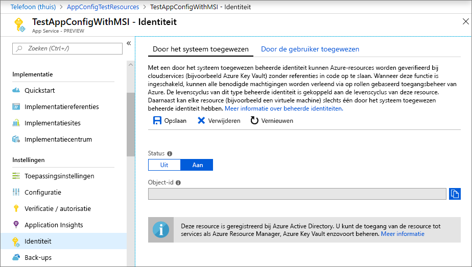
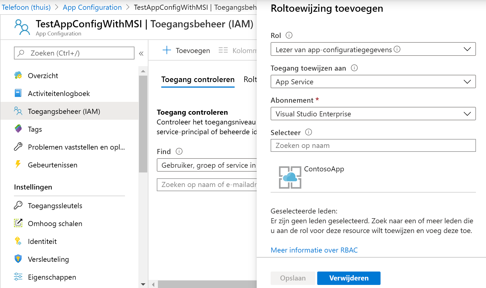

# <a name="integrate-with-azure-managed-identities"></a>Integreren met Azure Managed Identities

Azure Active Directory [beheerde identiteiten](../active-directory/managed-identities-azure-resources/overview.md) vereenvoudigen het beheer van geheimen voor uw cloudtoepassing. Met een beheerde identiteit kan uw code de serviceprincipal gebruiken die is gemaakt voor de Azure-service waarop deze wordt uitgevoerd. U gebruikt een beheerde identiteit in plaats van een afzonderlijke referentie die is opgeslagen in Azure Key Vault of een lokale verbindingstekenreeks. 

Azure App Configuration en de .NET Core-, .NET Framework- en Java Spring-clientbibliotheken hebben identiteitsondersteuning beheerd die daarin is ingebouwd. Hoewel u het niet hoeft te gebruiken, elimineert de beheerde identiteit de noodzaak van een toegangstoken dat geheimen bevat. Uw code heeft toegang tot de App Configuration Store met alleen het serviceeindpunt. U deze URL direct in uw code insluiten zonder enig geheim bloot te leggen.

In dit artikel ziet u hoe u profiteren van de beheerde identiteit om toegang te krijgen tot app-configuratie. Dit is gebaseerd op de web-app die is geïntroduceerd in de quickstarts. Voordat u verdergaat, [maakt u eerst een ASP.NET Core-app met app-configuratie.](./quickstart-aspnet-core-app.md)

In dit artikel ziet u ook hoe u de beheerde identiteit gebruiken in combinatie met de Key Vault-referenties van app-configuratie. Met één beheerde identiteit hebt u naadloos toegang tot zowel geheimen van Key Vault als configuratiewaarden van App-configuratie. Als je deze mogelijkheid wilt verkennen, kun [je eerst Key Vault References gebruiken met ASP.NET Core.](./use-key-vault-references-dotnet-core.md)

U elke codeeditor gebruiken om de stappen in deze zelfstudie uit te voeren. [Visual Studio Code](https://code.visualstudio.com/) is een uitstekende optie die beschikbaar is op de Windows-, macOS- en Linux-platforms.

In dit artikel leert u het volgende:

> [!div class="checklist"]
> * Geef een beheerde identiteitstoegang tot app-configuratie.
> * Configureer uw app om een beheerde identiteit te gebruiken wanneer u verbinding maakt met app-configuratie.
> * Configureer de sein van de app om een beheerde identiteit te gebruiken wanneer u verbinding maakt met Key Vault via een app-verwijzing naar de sleutelkluis voor app-configuratie.

## <a name="prerequisites"></a>Vereisten

U hebt het volgende nodig om deze zelfstudie te voltooien:

* [.NET Core SDK](https://www.microsoft.com/net/download/windows).
* [Azure Cloud Shell geconfigureerd](https://docs.microsoft.com/azure/cloud-shell/quickstart).

[!INCLUDE [quickstarts-free-trial-note](../../includes/quickstarts-free-trial-note.md)]

## <a name="add-a-managed-identity"></a>Een beheerde identiteit toevoegen

Als u een beheerde identiteit in de portal wilt instellen, maakt u eerst een toepassing en schakelt u de functie in.

1. Maak een App Services-exemplaar in de [Azure-portal](https://portal.azure.com) zoals u dat normaal doet. Ga naar het in het portaal.

1. Schuif omlaag naar de groep **Instellingen** in het linkerdeelvenster en selecteer **Identiteit**.

1. **Schakel** op het tabblad **Systeem toegewezen** over naar **Aan** en selecteer **Opslaan**.

1. Antwoord **Ja** wanneer u wordt gevraagd om een door het systeem toegewezen beheerde identiteit in te schakelen.

    

## <a name="grant-access-to-app-configuration"></a>Verleen toegang tot de App-configuratie

1. Selecteer in de [Azure-portal](https://portal.azure.com) **Alle resources** en selecteer het app-configuratiearchief dat u in de quickstart hebt gemaakt.

1. Selecteer **Toegangsbesturingselement (IAM)**.

1. Selecteer op het tabblad **Toegang controleren** **de** optie Toevoegen in de gebruikersinterface van de **roltoewijzingskaart toevoegen.**

1. Selecteer **onder Rol**de optie **Gegevenslezer app-configuratie**. Selecteer **onder Toegang toewijzen tot** **App-service** onder Door Systeem toegewezen **identiteit**.

1. Selecteer **onder Abonnement**uw Azure-abonnement. Selecteer de bron app-service voor uw app.

1. Selecteer **Opslaan**.

    

1. Optioneel: Als u ook toegang wilt verlenen tot Key Vault, volgt u de aanwijzingen in [Key Vault-verificatie bieden met een beheerde identiteit.](https://docs.microsoft.com/azure/key-vault/managed-identity)

## <a name="use-a-managed-identity"></a>Een beheerde identiteit gebruiken

1. Voeg een verwijzing toe aan het *Azure.Identity-pakket:*

    ```cli
    dotnet add package Azure.Identity
    ```

1. Zoek het eindpunt van uw App Configuration Store. Deze URL wordt weergegeven op het tabblad **Toegangssleutels** voor de winkel in de Azure-portal.

1. Open *appsettings.json*en voeg het volgende script toe. Vervang * \<service_endpoint>*, inclusief de haakjes, door de URL naar uw App Configuration Store. 

    ```json
    "AppConfig": {
        "Endpoint": "<service_endpoint>"
    }
    ```

1. Open *Program.cs*en voeg een `Azure.Identity` `Microsoft.Azure.Services.AppAuthentication` verwijzing toe naar de en naamruimten:

    ```csharp-interactive
    using Azure.Identity;
    ```

1. Als u alleen toegang wilt krijgen tot waarden `CreateWebHostBuilder` die rechtstreeks `config.AddAzureAppConfiguration()` in app-configuratie zijn opgeslagen, werkt u de methode bij door de methode te vervangen.

    > [!IMPORTANT]
    > `CreateHostBuilder`vervangt `CreateWebHostBuilder` in .NET Core 3.0.  Selecteer de juiste syntaxis op basis van uw omgeving.

    ### <a name="net-core-2x"></a>[.NET Core 2.x](#tab/core2x)

    ```csharp
        public static IWebHostBuilder CreateWebHostBuilder(string[] args) =>
            WebHost.CreateDefaultBuilder(args)
                .ConfigureAppConfiguration((hostingContext, config) =>
                {
                    var settings = config.Build();
                    config.AddAzureAppConfiguration(options =>
                        options.Connect(new Uri(settings["AppConfig:Endpoint"]), new ManagedIdentityCredential()));
                })
                .UseStartup<Startup>();
    ```

    ### <a name="net-core-3x"></a>[.NET Core 3.x](#tab/core3x)

    ```csharp
        public static IHostBuilder CreateHostBuilder(string[] args) =>
            Host.CreateDefaultBuilder(args)
            .ConfigureWebHostDefaults(webBuilder =>
            webBuilder.ConfigureAppConfiguration((hostingContext, config) =>
            {
                var settings = config.Build();
                    config.AddAzureAppConfiguration(options =>
                        options.Connect(new Uri(settings["AppConfig:Endpoint"]), new ManagedIdentityCredential()));
                })
                .UseStartup<Startup>());
    ```
    ---

1. Werk *Program.cs* bij zoals hieronder wordt weergegeven om zowel app-configuratiewaarden als Key Vault-referenties te gebruiken. Deze code maakt `KeyVaultClient` een `AzureServiceTokenProvider` nieuwe met behulp van `UseAzureKeyVault` een en geeft deze verwijzing naar een aanroep aan de methode.

    ### <a name="net-core-2x"></a>[.NET Core 2.x](#tab/core2x)

    ```csharp
            public static IWebHostBuilder CreateWebHostBuilder(string[] args) =>
                WebHost.CreateDefaultBuilder(args)
                    .ConfigureAppConfiguration((hostingContext, config) =>
                    {
                        var settings = config.Build();
                        var credentials = new ManagedIdentityCredential();

                        config.AddAzureAppConfiguration(options =>
                        {
                            options.Connect(new Uri(settings["AppConfig:Endpoint"]), credentials)
                                    .ConfigureKeyVault(kv =>
                                    {
                                        kv.SetCredential(credentials);
                                    });
                        });
                    })
                    .UseStartup<Startup>();
    ```

    ### <a name="net-core-3x"></a>[.NET Core 3.x](#tab/core3x)

    ```csharp
        public static IHostBuilder CreateHostBuilder(string[] args) =>
            Host.CreateDefaultBuilder(args)
            .ConfigureWebHostDefaults(webBuilder =>
            webBuilder.ConfigureAppConfiguration((hostingContext, config) =>
                    {
                        var settings = config.Build();
                        var credentials = new ManagedIdentityCredential();

                        config.AddAzureAppConfiguration(options =>
                        {
                            options.Connect(new Uri(settings["AppConfig:Endpoint"]), credentials)
                                    .ConfigureKeyVault(kv =>
                                    {
                                        kv.SetCredential(credentials);
                                    });
                        });
                    })
                    .UseStartup<Startup>());
    ```
    ---

    U hebt nu net als elke andere app-configuratiesleutel toegang tot Key Vault-verwijzingen. De config-provider `KeyVaultClient` gebruikt de code die u hebt geconfigureerd om te verifiëren bij Key Vault en de waarde op te halen.

[!INCLUDE [Prepare repository](../../includes/app-service-deploy-prepare-repo.md)]

## <a name="deploy-from-local-git"></a>Implementeren vanuit lokale Git

De eenvoudigste manier om lokale Git-implementatie voor uw app in te schakelen met de Kudu-buildserver, is door [Azure Cloud Shell](https://shell.azure.com)te gebruiken.

### <a name="configure-a-deployment-user"></a>Een implementatiegebruiker configureren

[!INCLUDE [Configure a deployment user](../../includes/configure-deployment-user-no-h.md)]

### <a name="enable-local-git-with-kudu"></a>Lokale Git met Kudu inschakelen
Als je geen lokale git-repository voor je app hebt, moet je er een initialiseren. Voer de volgende opdrachten uit in de projectmap van uw app om een lokale git-opslagplaats te initialiseren:

```cmd
git init
git add .
git commit -m "Initial version"
```

Als u de lokale Git-implementatie voor uw [`az webapp deployment source config-local-git`](/cli/azure/webapp/deployment/source?view=azure-cli-latest#az-webapp-deployment-source-config-local-git) app wilt inschakelen met de Kudu-buildserver, wordt u uitgevoerd in Cloud Shell.

```azurecli-interactive
az webapp deployment source config-local-git --name <app_name> --resource-group <group_name>
```

Deze opdracht geeft u iets wat lijkt op de volgende uitvoer:

```json
{
  "url": "https://<username>@<app_name>.scm.azurewebsites.net/<app_name>.git"
}
```

### <a name="deploy-your-project"></a>Uw project implementeren

Voeg in het _lokale terminalvenster_een Azure-afstandsbediening toe aan uw lokale Git-opslagplaats. Vervang _ \<url->_ door de URL van de Git-afstandsbediening die u hebt gekregen van [Lokale Git inschakelen door Kudu](#enable-local-git-with-kudu).

```bash
git remote add azure <url>
```

Push naar de externe Azure-instantie om uw app te implementeren met de volgende opdracht. Wanneer u om een wachtwoord wordt gevraagd, voert u het wachtwoord in dat u hebt gemaakt in [Een implementatiegebruiker configureren.](#configure-a-deployment-user) Gebruik het wachtwoord dat u gebruikt niet om u aan te melden bij de Azure-portal.

```bash
git push azure master
```

Mogelijk ziet u runtime-specifieke automatisering in de uitvoer, `npm install` zoals MSBuild voor `pip install` ASP.NET, voor Node.js en voor Python.

### <a name="browse-to-the-azure-web-app"></a>Bladeren naar de Azure-web-app

Blader naar uw web-app met een browser om te controleren of de inhoud is geïmplementeerd.

```bash
http://<app_name>.azurewebsites.net
```

## <a name="use-managed-identity-in-other-languages"></a>Beheerde identiteit gebruiken in andere talen

App-configuratie-providers voor .NET Framework en Java Spring hebben ook ingebouwde ondersteuning voor beheerde identiteit. U het URL-eindpunt van uw winkel gebruiken in plaats van de volledige verbindingstekenreeks wanneer u een van deze providers configureert. 

U bijvoorbeeld de .NET Framework-console-app die in de quickstart is gemaakt, bijwerken om de volgende instellingen in het bestand *App.config* op te geven:

```xml
    <configSections>
        <section name="configBuilders" type="System.Configuration.ConfigurationBuildersSection, System.Configuration, Version=4.0.0.0, Culture=neutral, PublicKeyToken=b03f5f7f11d50a3a" restartOnExternalChanges="false" requirePermission="false" />
    </configSections>

    <configBuilders>
        <builders>
            <add name="MyConfigStore" mode="Greedy" endpoint="${Endpoint}" type="Microsoft.Configuration.ConfigurationBuilders.AzureAppConfigurationBuilder, Microsoft.Configuration.ConfigurationBuilders.AzureAppConfiguration" />
            <add name="Environment" mode="Greedy" type="Microsoft.Configuration.ConfigurationBuilders.EnvironmentConfigBuilder, Microsoft.Configuration.ConfigurationBuilders.Environment" />
        </builders>
    </configBuilders>

    <appSettings configBuilders="Environment,MyConfigStore">
        <add key="AppName" value="Console App Demo" />
        <add key="Endpoint" value ="Set via an environment variable - for example, dev, test, staging, or production endpoint." />
    </appSettings>
```

## <a name="clean-up-resources"></a>Resources opschonen

[!INCLUDE [azure-app-configuration-cleanup](../../includes/azure-app-configuration-cleanup.md)]

## <a name="next-steps"></a>Volgende stappen
In deze zelfstudie hebt u een door Azure beheerde identiteit toegevoegd om de toegang tot app-configuratie te stroomlijnen en het referentiebeheer voor uw app te verbeteren. Ga voor meer informatie over het gebruik van app-configuratie verder naar de Azure CLI-voorbeelden.

> [!div class="nextstepaction"]
> [CLI-monsters](./cli-samples.md)
