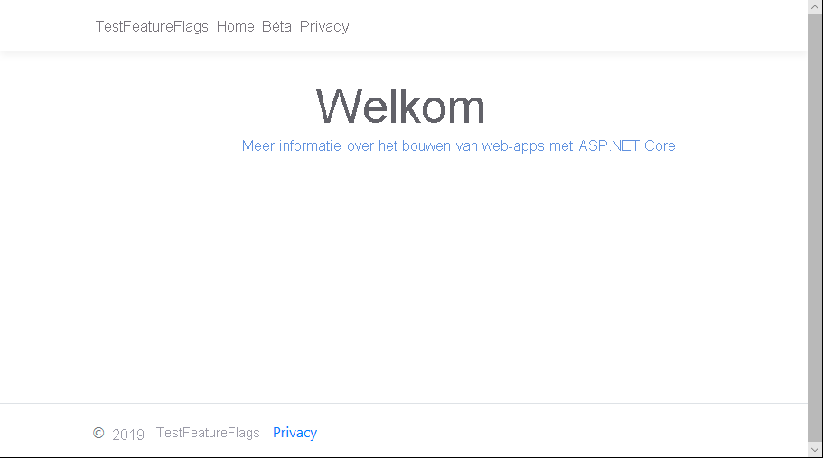

# <a name="quickstart-add-feature-flags-to-an-aspnet-core-app"></a>Snelstartgids: functie vlaggen toevoegen aan een ASP.NET Core-app

In deze Quick Start maakt u een end-to-end-implementatie van onderdeel beheer in een ASP.NET Core-toepassing met behulp van Azure-app-configuratie. U gebruikt de app-configuratie service om al uw functie vlaggen centraal op te slaan en hun status te bepalen. 

De .NET Core-functie beheer bibliotheken breiden het Framework uit met uitgebreide ondersteuning voor functie vlaggen. Deze bibliotheken zijn gebaseerd op het .NET core-configuratie systeem. Ze kunnen naadloos worden geïntegreerd met de configuratie van de app via de .NET-kern configuratie provider.

## <a name="prerequisites"></a>Vereisten

- Azure-abonnement: [Maak er gratis een](https://azure.microsoft.com/free/)
- [.Net core SDK](https://dotnet.microsoft.com/download).

## <a name="create-an-app-configuration-store"></a>Een app-configuratie archief maken

[!INCLUDE [azure-app-configuration-create](../../includes/azure-app-configuration-create.md)]

6. Selecteer **feature Manager** > **+ toevoegen** om een functie vlag met de `Beta`naam toe te voegen.

    > [!div class="mx-imgBorder"]
    > 

    `label` Zorg ervoor dat u dit nu niet opgeeft. Selecteer **Toep assen** om de nieuwe functie vlag op te slaan.

## <a name="create-an-aspnet-core-web-app"></a>Een ASP.NET Core-web-app maken

Gebruik de [.net core-opdracht regel interface (CLI)](https://docs.microsoft.com/dotnet/core/tools/) om een nieuw ASP.net core MVC-Web-app-project te maken. Het voor deel van het gebruik van de .NET Core SLI in plaats van Visual Studio is dat de .NET Core SLI beschikbaar is via de Windows-, macOS-en Linux-platformen.

1. Maak een nieuwe map voor uw project. Geef voor deze Snelstartgids de naam *TestFeatureFlags*.

1. Voer in de nieuwe map de volgende opdracht uit om een nieuw ASP.NET Core MVC-Web-app-project te maken:

   ```    
   dotnet new mvc --no-https
   ```

## <a name="add-secret-manager"></a>Secret Manager toevoegen

Als u een geheim Manager wilt gebruiken `UserSecretsId` , voegt u een element toe aan uw *. csproj* -bestand.

1. Open het *. csproj* -bestand.

1.  Voeg een `UserSecretsId` element toe, zoals hier wordt weer gegeven. U kunt dezelfde GUID gebruiken, maar u kunt deze waarde ook vervangen door uw eigen waarden.

    > [!IMPORTANT]
    > `CreateHostBuilder`vervangt `CreateWebHostBuilder` in .net Core 3,0.  Selecteer de juiste syntaxis op basis van uw omgeving.

    #### <a name="net-core-2x"></a>[.NET Core 2. x](#tab/core2x)

    ```xml
    <Project Sdk="Microsoft.NET.Sdk.Web">

        <PropertyGroup>
            <TargetFramework>netcoreapp2.1</TargetFramework>
            <UserSecretsId>79a3edd0-2092-40a2-a04d-dcb46d5ca9ed</UserSecretsId>
        </PropertyGroup>

        <ItemGroup>
            <PackageReference Include="Microsoft.AspNetCore.App" />
            <PackageReference Include="Microsoft.AspNetCore.Razor.Design" Version="2.1.2" PrivateAssets="All" />
        </ItemGroup>

    </Project>
    ```

    #### <a name="net-core-3x"></a>[.NET Core 3. x](#tab/core3x)

    ```xml
    <Project Sdk="Microsoft.NET.Sdk.Web">

        <PropertyGroup>
            <TargetFramework>netcoreapp3.1</TargetFramework>
            <UserSecretsId>79a3edd0-2092-40a2-a04d-dcb46d5ca9ed</UserSecretsId>
        </PropertyGroup>

    </Project>
    ```
    ---

1. Sla het *. csproj* -bestand op.

Dit hulpprogramma slaat gevoelige gegevens voor ontwikkeltaken op buiten de projectstructuur. Deze aanpak voorkomt dat er per ongeluk appgeheimen worden gedeeld in de broncode.

> [!TIP]
> Zie voor meer informatie over de geheime beheerder de [veilige opslag van app-geheimen in de ontwikkeling van ASP.net core](https://docs.microsoft.com/aspnet/core/security/app-secrets).

## <a name="connect-to-an-app-configuration-store"></a>Verbinding maken met een app-configuratie archief

1. Voeg een verwijzing naar `Microsoft.Azure.AppConfiguration.AspNetCore` de en `Microsoft.FeatureManagement.AspNetCore` de NuGet-pakketten toe door de volgende opdrachten uit te voeren:

    ```dotnetcli
    dotnet add package Microsoft.Azure.AppConfiguration.AspNetCore
    dotnet add package Microsoft.FeatureManagement.AspNetCore
    ```

1. Voer de volgende opdracht uit om de pakketten voor uw project te herstellen:

    ```dotnetcli
    dotnet restore
    ```

1. Voeg een geheim met de naam **ConnectionStrings:AppConfig** toe aan Secret Manager.

    Dit geheim bevat de connection string voor toegang tot uw app-configuratie opslag. Vervang de `<your_connection_string>` waarde in de volgende opdracht door de Connection String voor uw app-configuratie archief. U kunt de connection string vinden onder **toegangs sleutels** in de Azure Portal.

    Deze opdracht moet worden uitgevoerd in de map met het bestand *.csproj*.

    ```dotnetcli
    dotnet user-secrets set ConnectionStrings:AppConfig <your_connection_string>
    ```

    U gebruikt alleen de geheime beheerder als u de web-app lokaal wilt testen. Wanneer u de app op [Azure app service](https://azure.microsoft.com/services/app-service)implementeert, gebruikt u bijvoorbeeld een toepassings instelling met de naam **verbindings reeksen** in app service in plaats van de Connection String te gebruiken.

    U kunt dit geheim openen met de API voor app-configuratie. Een dubbele punt (:) werkt in de configuratie naam met de API voor app-configuratie op alle ondersteunde platforms. Zie [configuratie per omgeving](https://docs.microsoft.com/aspnet/core/fundamentals/configuration).

1. Werk in *Program.cs*de methode `CreateWebHostBuilder` bij voor het gebruik van app-configuratie `config.AddAzureAppConfiguration()` door de methode aan te roepen.

    > [!IMPORTANT]
    > `CreateHostBuilder`vervangt `CreateWebHostBuilder` in .net Core 3,0.  Selecteer de juiste syntaxis op basis van uw omgeving.

    #### <a name="net-core-2x"></a>[.NET Core 2. x](#tab/core2x)

    ```csharp
    public static IWebHostBuilder CreateWebHostBuilder(string[] args) =>
        WebHost.CreateDefaultBuilder(args)
            .ConfigureAppConfiguration((hostingContext, config) =>
            {
                var settings = config.Build();
                config.AddAzureAppConfiguration(options => {
                    options.Connect(settings["ConnectionStrings:AppConfig"])
                        .UseFeatureFlags();
                });
            })
            .UseStartup<Startup>();
    ```

    #### <a name="net-core-3x"></a>[.NET Core 3. x](#tab/core3x)

    ```csharp
    public static IHostBuilder CreateHostBuilder(string[] args) =>
        Host.CreateDefaultBuilder(args)
        .ConfigureWebHostDefaults(webBuilder =>
        webBuilder.ConfigureAppConfiguration((hostingContext, config) =>
        {
            var settings = config.Build();
            config.AddAzureAppConfiguration(options => {
                options.Connect(settings["ConnectionStrings:AppConfig"])
                    .UseFeatureFlags();
            });
        })
        .UseStartup<Startup>());
    ```
    ---

1. Open *Startup.cs*en voeg verwijzingen toe aan .net core feature Manager:

    ```csharp
    using Microsoft.FeatureManagement;
    ```

1. Werk de `ConfigureServices` methode bij om ondersteuning van functie vlaggen toe te `services.AddFeatureManagement()` voegen door de methode aan te roepen. U kunt eventueel ook een filter toevoegen dat wordt gebruikt met functie vlaggen door het volgende `services.AddFeatureFilter<FilterType>()`aan te roepen:

    #### <a name="net-core-2x"></a>[.NET Core 2. x](#tab/core2x)
    ```csharp
    public void ConfigureServices(IServiceCollection services)
    {
        services.AddMvc().SetCompatibilityVersion(CompatibilityVersion.Version_2_2);        
        services.AddFeatureManagement();
    }
    ```
    #### <a name="net-core-3x"></a>[.NET Core 3. x](#tab/core3x)
    ```csharp    
    public void ConfigureServices(IServiceCollection services)
    {
        services.AddControllersWithViews();
        services.AddFeatureManagement();
    }

    ---

1. Update the `Configure` method to add a middleware to allow the feature flag values to be refreshed at a recurring interval while the ASP.NET Core web app continues to receive requests.

    #### [.NET Core 2.x](#tab/core2x)
    ```csharp
    public void Configure(IApplicationBuilder app, IHostingEnvironment env)
    {
            if (env.IsDevelopment())
            {
                app.UseDeveloperExceptionPage();
            }
            else
            {
                app.UseExceptionHandler("/Home/Error");
            }

            app.UseStaticFiles();
            app.UseCookiePolicy();
            app.UseAzureAppConfiguration();
            app.UseMvc(routes =>
            {
                routes.MapRoute(
                    name: "default",
                    template: "{controller=Home}/{action=Index}/{id?}");
            });
    }
    ```
    #### <a name="net-core-3x"></a>[.NET Core 3. x](#tab/core3x)
    ```csharp
    public void Configure(IApplicationBuilder app, IHostingEnvironment env)
    {
            if (env.IsDevelopment())
            {
                app.UseDeveloperExceptionPage();
            }
            else
            {
                app.UseExceptionHandler("/Home/Error");
            }
            app.UseStaticFiles();
            app.UseRouting();
            app.UseAuthorization();
            app.UseEndpoints(endpoints =>
            {
                endpoints.MapControllerRoute(
                    name: "default",
                    pattern: "{controller=Home}/{action=Index}/{id?}");
            });
            app.UseAzureAppConfiguration();
    }
    ```
    ---

1. Een *MyFeatureFlags.cs* -bestand toevoegen:

    ```csharp
    namespace TestFeatureFlags
    {
        public enum MyFeatureFlags
        {
            Beta
        }
    }
    ```

1. Voeg *BetaController.cs* toe aan de map *controllers* :

    ```csharp
    using Microsoft.AspNetCore.Mvc;
    using Microsoft.FeatureManagement;
    using Microsoft.FeatureManagement.Mvc;

    namespace TestFeatureFlags.Controllers
    {
        public class BetaController: Controller
        {
            private readonly IFeatureManager _featureManager;

            public BetaController(IFeatureManagerSnapshot featureManager)
            {
                _featureManager = featureManager;
            }

            [FeatureGate(MyFeatureFlags.Beta)]
            public IActionResult Index()
            {
                return View();
            }
        }
    }
    ```

1. Open *_ViewImports. cshtml* in de map *views* en voeg de functie Manager tag helper toe:

    ```html
    @addTagHelper *, Microsoft.FeatureManagement.AspNetCore
    ```

1. Open *_Layout. cshtml* in de *Views*\\*gedeelde* map `<nav>` views en vervang de streepjes code `<body>`  >  `<header>` door de volgende code:

    ```html
    <nav class="navbar navbar-expand-sm navbar-toggleable-sm navbar-light bg-white border-bottom box-shadow mb-3">
        <div class="container">
            <a class="navbar-brand" asp-area="" asp-controller="Home" asp-action="Index">TestFeatureFlags</a>
            <button class="navbar-toggler" type="button" data-toggle="collapse" data-target=".navbar-collapse" aria-controls="navbarSupportedContent"
            aria-expanded="false" aria-label="Toggle navigation">
            <span class="navbar-toggler-icon"></span>
            </button>
            <div class="navbar-collapse collapse d-sm-inline-flex flex-sm-row-reverse">
                <ul class="navbar-nav flex-grow-1">
                    <li class="nav-item">
                        <a class="nav-link text-dark" asp-area="" asp-controller="Home" asp-action="Index">Home</a>
                    </li>
                    <feature name="Beta">
                    <li class="nav-item">
                        <a class="nav-link text-dark" asp-area="" asp-controller="Beta" asp-action="Index">Beta</a>
                    </li>
                    </feature>
                    <li class="nav-item">
                        <a class="nav-link text-dark" asp-area="" asp-controller="Home" asp-action="Privacy">Privacy</a>
                    </li>
                </ul>
            </div>
        </div>
    </nav>
    ```

1. Maak een *bèta* Directory onder *weer gaven* en voeg hierin *index. cshtml* toe:

    ```html
    @{
        ViewData["Title"] = "Beta Home Page";
    }

    <h1>
        This is the beta website.
    </h1>
    ```

## <a name="build-and-run-the-app-locally"></a>De app lokaal compileren en uitvoeren

1. Als u de app wilt bouwen met behulp van de .NET Core SLI, voert u de volgende opdracht uit in de opdracht shell:

    ```
    dotnet build
    ```

1. Wanneer de build is voltooid, voert u de volgende opdracht uit om de web-app lokaal uit te voeren:

    ```
    dotnet run
    ```

1. Open een browser venster en ga naar `https://localhost:5000`. Dit is de standaard-URL voor de web-app die lokaal wordt gehost.
    Als u werkt in de Azure Cloud Shell, selecteert u de knop *voor beeld Web* , gevolgd door *configureren*.  Selecteer poort 5000 wanneer u hierom wordt gevraagd.

    

    In uw browser wordt een pagina weer gegeven die vergelijkbaar is met de onderstaande afbeelding.
    

1. Meld u aan bij de [Azure-portal](https://portal.azure.com). Selecteer **alle resources**en selecteer de app-configuratie Store-instantie die u hebt gemaakt in de Quick Start.

1. Selecteer **functie beheer**en wijzig de status van de **bèta** sleutel in **op aan**.

1. Ga terug naar de opdracht prompt en Annuleer het `dotnet` proces dat wordt `Ctrl-C`uitgevoerd door op te drukken.  Start de toepassing opnieuw `dotnet run`met.

1. Vernieuw de browserpagina om de nieuwe configuratie-instellingen te zien.

    

## <a name="clean-up-resources"></a>Resources opschonen

[!INCLUDE [azure-app-configuration-cleanup](../../includes/azure-app-configuration-cleanup.md)]

## <a name="next-steps"></a>Volgende stappen

In deze Quick Start hebt u een nieuwe app-configuratie opgeslagen gemaakt en gebruikt om de functies in een ASP.NET Core web-app te beheren via de [beheer bibliotheken voor onderdelen](https://go.microsoft.com/fwlink/?linkid=2074664).

- Meer informatie over [functie beheer](./concept-feature-management.md).
- [Functie vlaggen beheren](./manage-feature-flags.md).
- [Functie vlaggen in een ASP.net core-app gebruiken](./use-feature-flags-dotnet-core.md).
- [Dynamische configuratie in een ASP.NET Core-app gebruiken](./enable-dynamic-configuration-aspnet-core.md)
