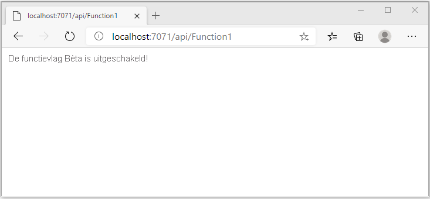

# <a name="quickstart-add-feature-flags-to-an-azure-functions-app"></a>Quickstart: Functiemarkeringen toevoegen aan een Azure Functions-app

In deze quickstart maakt u een implementatie van functiebeheer in een Azure Functions-app met behulp van Azure App Configuration. U gebruikt de App Configuration-service om al uw functievlaggen centraal op te slaan en hun status te bepalen. 

De .NET Feature Management-bibliotheken breiden het framework uit met ondersteuning voor functiemarkeringen. Deze bibliotheken worden boven op het .NET-configuratiesysteem gebouwd. Ze integreren naadloos met App Configuration via de configuratieprovider voor .NET.

## <a name="prerequisites"></a>Vereisten

- Azure-abonnement: [u kunt een gratis abonnement nemen](https://azure.microsoft.com/free/)
- [Visual Studio 2019](https://visualstudio.microsoft.com/vs) met de workload **Azure Development**.
- [Hulpprogramma's van Azure Functions](../azure-functions/functions-develop-vs.md#check-your-tools-version)

## <a name="create-an-app-configuration-store"></a>Een App Configuration-archief maken

[!INCLUDE [azure-app-configuration-create](../../includes/azure-app-configuration-create.md)]

7. Selecteer **Functiebeheer** >  **+ Toevoegen** om een functievlag met de naam `Beta` toe te voegen.

    > [!div class="mx-imgBorder"]
    > 

    Laat `label` en `Description` voor nu ongedefinieerd.

8. Selecteer **Toepassen** om de nieuwe functievlag op te slaan.

## <a name="create-a-functions-app"></a>Een Functions-app maken

[!INCLUDE [Create a project using the Azure Functions template](../../includes/functions-vstools-create.md)]

## <a name="connect-to-an-app-configuration-store"></a>Verbinding maken met een App Configuration-archief

1. Klik met de rechtermuisknop op het project en selecteer **NuGet-pakketten beheren**. Zoek op het tabblad **Bladeren** de volgende NuGet-pakketten op en voeg deze toe aan uw project. Controleer voor `Microsoft.Extensions.DependencyInjection` dat u de meest recente stabiele versie hebt. 

    ```
    Microsoft.Extensions.DependencyInjection
    Microsoft.Extensions.Configuration
    Microsoft.FeatureManagement
    ```


1. Open *Function1.cs* en voeg de naamruimten van deze pakketten toe.

    ```csharp
    using Microsoft.Extensions.Configuration;
    using Microsoft.FeatureManagement;
    using Microsoft.Extensions.DependencyInjection;
    ```

1. Voeg hieronder de `Function1` statische constructor toe om de Azure App Configuration-provider te bootstrappen. Voeg vervolgens twee `static`-leden toe, een veld met de naam `ServiceProvider` om een exemplaar van een individuele database van `ServiceProvider` te maken, en een eigenschap onder `Function1` genaamd `FeatureManager` om een exemplaar van een individuele database van `IFeatureManager`te maken. Maak vervolgens verbinding met App Configuration in `Function1` door `AddAzureAppConfiguration()` aan te roepen. Dit proces laadt de configuratie wanneer de toepassing wordt gestart. Hetzelfde configuratie-exemplaar wordt later gebruikt voor alle Functions-aanroepen. 

    ```csharp
        // Implements IDisposable, cached for life time of function
        private static ServiceProvider ServiceProvider; 

        static Function1()
        {
            IConfigurationRoot configuration = new ConfigurationBuilder()
                .AddAzureAppConfiguration(options =>
                {
                    options.Connect(Environment.GetEnvironmentVariable("ConnectionString"))
                           .UseFeatureFlags();
                }).Build();

            var services = new ServiceCollection();                                                                             
            services.AddSingleton<IConfiguration>(configuration).AddFeatureManagement();

            ServiceProvider = services.BuildServiceProvider(); 
        }

        private static IFeatureManager FeatureManager => ServiceProvider.GetRequiredService<IFeatureManager>();
    ```

1. Werk de `Run`-methode bij om de waarde van het weergegeven bericht te wijzigen, afhankelijk van de status van de functiemarkering.

    ```csharp
        [FunctionName("Function1")]
        public static async Task<IActionResult> Run(
                [HttpTrigger(AuthorizationLevel.Anonymous, "get", "post", Route = null)] HttpRequest req,
                ILogger log)
            {
                string message = await FeatureManager.IsEnabledAsync("Beta")
                     ? "The Feature Flag 'Beta' is turned ON"
                     : "The Feature Flag 'Beta' is turned OFF";
                
                return (ActionResult)new OkObjectResult(message); 
            }
    ```

## <a name="test-the-function-locally"></a>De functie lokaal testen

1. Stel een omgevingsvariabele met de naam **Verbindingsreeks** in, waarbij de waarde de toegangssleutel is die u eerder in uw App Configuration-archief hebt opgehaald onder **Toegangssleutels**. Als u de Windows-opdrachtprompt gebruikt, voert u de volgende opdracht uit en start u de opdrachtprompt opnieuw om de wijziging door te voeren:

    ```cmd
        setx ConnectionString "connection-string-of-your-app-configuration-store"
    ```

    Als u Windows PowerShell gebruikt, voert u de volgende opdracht uit:

    ```azurepowershell
        $Env:ConnectionString = "connection-string-of-your-app-configuration-store"
    ```

    Als u macOS of Linux gebruikt, voert u de volgende opdracht uit:

    ```bash
        export ConnectionString='connection-string-of-your-app-configuration-store'
    ```

1. Druk op F5 om de functie testen. Accepteer desgevraagd de aanvraag van Visual Studio om **Azure Functions Core-hulpprogramma's (CLI)** te downloaden en installeren. Mogelijk moet u ook een firewall-uitzondering inschakelen, zodat de hulpprogramma's HTTP-aanvragen kunnen afhandelen.

1. Kopieer de URL van uw functie vanuit de uitvoer van de Azure Functions-runtime.

    

1. Plak de URL van de HTTP-aanvraag in de adresbalk van uw browser. In de volgende afbeelding ziet u het antwoord dat aangeeft dat de functiemarkering `Beta` is uitgeschakeld. 

    

1. Meld u aan bij de [Azure-portal](https://portal.azure.com). Selecteer **Alle resources** en selecteer de instantie van het App Configuration-archief dat u hebt gemaakt.

1. Selecteer **Functiebeheer** en wijzig de status van de sleutel **Beta** in **Aan**:

1. Ga terug naar de opdrachtprompt en annuleer het actieve proces door op `Ctrl-C` te drukken.  Herstart de app door op F5 te drukken. 

1. Kopieer de URL van uw functie uit de uitvoer van de Azure Functions-runtime op dezelfde manier als in stap 3. Plak de URL van de HTTP-aanvraag in de adresbalk van uw browser. Het antwoord van de browser moet zijn gewijzigd om aan te geven dat de functiemarkering `Beta` is ingeschakeld, zoals wordt weergegeven in de onderstaande afbeelding.
 
    

## <a name="clean-up-resources"></a>Resources opschonen

[!INCLUDE [azure-app-configuration-cleanup](../../includes/azure-app-configuration-cleanup.md)]

## <a name="next-steps"></a>Volgende stappen

In deze quickstart hebt u een nieuwe functiemarkering gemaakt en gebruikt met een Azure Functions-app via de [App Configuration-provider](https://go.microsoft.com/fwlink/?linkid=2074664).

- Meer informatie over [functiebeheer](./concept-feature-management.md).
- [Functievlaggen beheren](./manage-feature-flags.md).
- [Dynamische configuratie gebruiken in een Azure Functions-app](./enable-dynamic-configuration-azure-functions-csharp.md)
