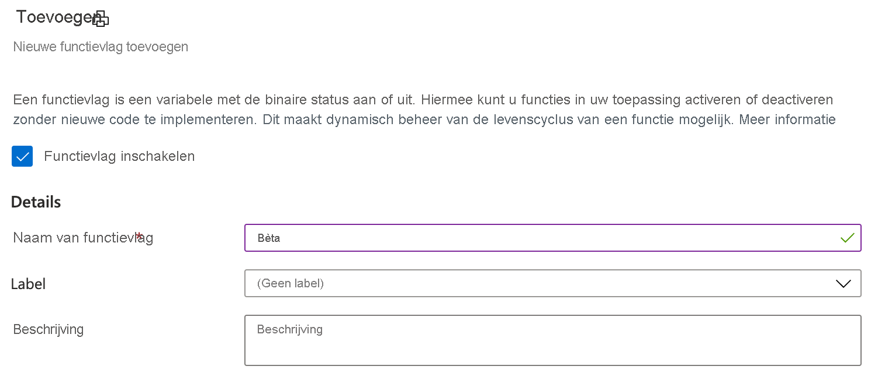

# <a name="quickstart-add-feature-flags-to-a-net-framework-app"></a>Snelstartgids: functie vlaggen toevoegen aan een .NET Framework-app

In deze Snelstartgids neemt u Azure-app configuratie op in een .NET Framework-app om een end-to-end-implementatie van functie beheer te maken. U kunt de app Configuration-service gebruiken om al uw functie vlaggen centraal op te slaan en hun status te bepalen. 

De beheer bibliotheken van .NET-onderdelen breiden het Framework uit met uitgebreide ondersteuning voor functie vlaggen. Deze bibliotheken worden boven op het .NET-configuratie systeem gebouwd. Ze kunnen naadloos worden geïntegreerd met de configuratie van de app via de .NET-configuratie provider.

## <a name="prerequisites"></a>Vereisten

- Azure-abonnement: [Maak er gratis een](https://azure.microsoft.com/free/)
- [Visual Studio 2019](https://visualstudio.microsoft.com/vs)
- [.NET Framework 4,8](https://dotnet.microsoft.com/download)

## <a name="create-an-app-configuration-store"></a>Een app-configuratie archief maken

[!INCLUDE [azure-app-configuration-create](../../includes/azure-app-configuration-create.md)]

6. Selecteer **feature Manager** > **+ toevoegen** om een functie vlag met de `Beta`naam toe te voegen.

    > [!div class="mx-imgBorder"]
    > 

    `label` Zorg ervoor dat u dit nu niet opgeeft.

## <a name="create-a-net-console-app"></a>Een .NET Core-consoletoepassing maken

1. Start Visual Studio en selecteer **bestand** > **New** > **project**.

1. In **een nieuw project maken**filtert u op het type **console** project en klikt u op **console-app (.NET Framework)**. Klik op **Volgende**.

1. Voer in **uw nieuwe project configureren**een project naam in. Onder **Framework**selecteert u **.NET Framework 4,8** of hoger. Klik op **maken**.

## <a name="connect-to-an-app-configuration-store"></a>Verbinding maken met een app-configuratie archief

1. Klik met de rechter muisknop op het project en selecteer **NuGet-pakketten beheren**. Zoek op het tabblad **Bladeren** de volgende NuGet-pakketten aan uw project en voeg deze toe. Als u deze niet kunt vinden, schakelt u het selectie vakje **include Prerelease** in.

    ```
    Microsoft.Extensions.DependencyInjection
    Microsoft.Extensions.Configuration.AzureAppConfiguration
    Microsoft.FeatureManagement
    ```

1. Open *Program.cs* en voeg de volgende-instructies toe:

    ```csharp
    using Microsoft.Extensions.DependencyInjection;
    using Microsoft.Extensions.Configuration;
    using Microsoft.Extensions.Configuration.AzureAppConfiguration;
    using Microsoft.FeatureManagement;
    ```

1. Werk de `Main` methode bij om verbinding te maken met de app `UseFeatureFlags` -configuratie, waarbij u de optie opgeeft zodat functie vlaggen worden opgehaald. Vervolgens wordt een bericht weer gegeven `Beta` als de functie vlag is ingeschakeld.

    ```csharp
        public static async Task Main(string[] args)
        {         
            IConfigurationRoot configuration = new ConfigurationBuilder()
                .AddAzureAppConfiguration(options =>
                {
                    options.Connect(Environment.GetEnvironmentVariable("ConnectionString"))
                           .UseFeatureFlags();
                }).Build();

            IServiceCollection services = new ServiceCollection();

            services.AddSingleton<IConfiguration>(configuration).AddFeatureManagement();

            using (ServiceProvider serviceProvider = services.BuildServiceProvider())
            {
                IFeatureManager featureManager = serviceProvider.GetRequiredService<IFeatureManager>();

                if (await featureManager.IsEnabledAsync("Beta"))
                {
                    Console.WriteLine("Welcome to the beta!");
                }
            }

            Console.WriteLine("Hello World!");
        }
    ```

## <a name="build-and-run-the-app-locally"></a>De app lokaal compileren en uitvoeren

1. Stel een omgevings variabele met de naam **Connections Tring** in op de Connection String van de app-configuratie opslag. Als u de Windows-opdracht prompt gebruikt, voert u de volgende opdracht uit:

        setx ConnectionString "connection-string-of-your-app-configuration-store"

    Als u Windows Power shell gebruikt, voert u de volgende opdracht uit:

        $Env:ConnectionString = "connection-string-of-your-app-configuration-store"

1. Start Visual Studio opnieuw zodat de wijziging kan worden doorgevoerd. 

1. Druk op CTRL + F5 om de console-app te bouwen en uit te voeren.

    

## <a name="clean-up-resources"></a>Resources opschonen

[!INCLUDE [azure-app-configuration-cleanup](../../includes/azure-app-configuration-cleanup.md)]

## <a name="next-steps"></a>Volgende stappen

In deze Quick Start hebt u een functie vlag in app-configuratie gemaakt en gebruikt met een .NET Framework-console-app. Ga verder met de volgende zelf studie als u wilt weten hoe u functie vlaggen en andere configuratie waarden dynamisch kunt bijwerken zonder de toepassing opnieuw te starten.

> [!div class="nextstepaction"]
> [Dynamische configuratie inschakelen](./enable-dynamic-configuration-dotnet.md)
