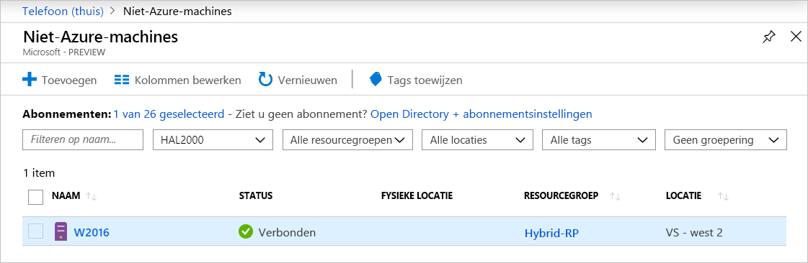

# <a name="connect-hybrid-machines-to-azure-at-scale"></a>Hybride machines op schaal aansluiten op Azure

U kunt Azure Arc-servers inschakelen voor meerdere Windows-of Linux-computers in uw omgeving met verschillende flexibele opties, afhankelijk van uw vereisten. Met het sjabloon script dat we bieden, kunt u elke stap van de installatie automatiseren, met inbegrip van het tot stand brengen van de verbinding met Azure Arc. U moet dit script echter interactief uitvoeren met een account dat verhoogde machtigingen heeft op de doel computer en in Azure. Als u de computers wilt verbinden met servers die geschikt zijn voor Azure, kunt u een Azure Active Directory [Service-Principal](../../active-directory/develop/app-objects-and-service-principals.md) gebruiken in plaats van uw bevoorrechte identiteit te gebruiken om [interactief verbinding te maken met de computer](onboard-portal.md). Een Service-Principal is een speciale beperkt beheer identiteit die alleen de mini maal vereiste machtigingen krijgt om computers te verbinden met Azure met behulp van de `azcmagent` opdracht. Dit is veiliger dan het gebruik van een account met een hogere bevoegdheden, zoals een Tenant Administrator, gevolgd door de aanbevolen procedures voor het beheren van de toegangs beveiliging. De service-principal wordt alleen gebruikt tijdens onboarding en wordt niet voor andere doel einden gebruikt.  

De installatie methoden voor het installeren en configureren van de verbonden machine agent vereist dat de geautomatiseerde methode die u gebruikt, beheerders rechten heeft op de computers. Op Linux, met behulp van het hoofd account en in Windows als lid van de lokale groep Administrators.

Voordat u aan de slag gaat, moet u de [vereisten](agent-overview.md#prerequisites) controleren en controleren of uw abonnement en resources voldoen aan de vereisten.

Als u nog geen abonnement op Azure hebt, maak dan een [gratis account](https://azure.microsoft.com/free/?WT.mc_id=A261C142F) aan voordat u begint.

Aan het einde van dit proces hebt u uw hybride computers verbonden met servers waarop Azure Arc is ingeschakeld.

## <a name="create-a-service-principal-for-onboarding-at-scale"></a>Een service-principal maken voor onboarding op schaal

U kunt [Azure PowerShell](/powershell/azure/install-az-ps) gebruiken om een service-principal te maken met de cmdlet [New-AzADServicePrincipal](/powershell/module/Az.Resources/New-AzADServicePrincipal) . U kunt ook de stappen volgen die worden vermeld onder [een service-principal maken met behulp van de Azure Portal](../../active-directory/develop/howto-create-service-principal-portal.md) om deze taak te volt ooien.

> [!NOTE]
> Wanneer u een Service-Principal maakt, moet uw account een eigenaar of beheerder van de gebruikers toegang zijn in het abonnement dat u wilt gebruiken voor onboarding. Als u niet over de juiste machtigingen beschikt om roltoewijzingen te maken, wordt de Service-Principal mogelijk gemaakt, maar kan de machine niet op de onboarding worden uitgevoerd.
>

Voer het volgende uit om de service-principal te maken met behulp van Power shell.

1. Voer de volgende opdracht uit. U moet de uitvoer van de [`New-AzADServicePrincipal`](/powershell/module/az.resources/new-azadserviceprincipal) cmdlet in een variabele opslaan of u kunt het wacht woord dat u in een latere stap nodig hebt, niet ophalen.

    ```azurepowershell-interactive
    $sp = New-AzADServicePrincipal -DisplayName "Arc-for-servers" -Role "Azure Connected Machine Onboarding"
    $sp
    ```

    ```output
    Secret                : System.Security.SecureString
    ServicePrincipalNames : {ad9bcd79-be9c-45ab-abd8-80ca1654a7d1, https://Arc-for-servers}
    ApplicationId         : ad9bcd79-be9c-45ab-abd8-80ca1654a7d1
    ObjectType            : ServicePrincipal
    DisplayName           : Hybrid-RP
    Id                    : 5be92c87-01c4-42f5-bade-c1c10af87758
    Type                  :
    ```

2. Voer de volgende opdracht uit om het wacht woord op te halen dat is opgeslagen in de `$sp` variabele:

    ```azurepowershell-interactive
    $credential = New-Object pscredential -ArgumentList "temp", $sp.Secret
    $credential.GetNetworkCredential().password
    ```

3. In de uitvoer vindt u de wachtwoord waarde onder het veld **wacht woord** en kopieert u deze. Zoek ook de waarde onder het veld **ApplicationId** en kopieer deze ook. Bewaar ze later op een veilige plaats. Als u het wacht woord van de Service-Principal vergeet of kwijtraakt, kunt u het opnieuw instellen met de [`New-AzADSpCredential`](/powershell/module/azurerm.resources/new-azurermadspcredential) cmdlet.

De waarden van de volgende eigenschappen worden gebruikt met para meters die worden door gegeven aan de `azcmagent` :

* De waarde van de eigenschap **ApplicationId** wordt gebruikt voor de `--service-principal-id` parameter waarde
* De waarde van de eigenschap **Password** wordt gebruikt voor de  `--service-principal-secret` para meter die wordt gebruikt om verbinding te maken met de agent.

> [!NOTE]
> Zorg ervoor dat u de Service Principal **ApplicationId** -eigenschap gebruikt, niet de eigenschap **id** .
>

De rol van de voor bereide **Azure connected-computer** bevat alleen de vereiste machtigingen voor het onboarden van een computer. U kunt de machtiging Service-Principal toewijzen zodat het bereik een resource groep of een abonnement kan bevatten. Zie [Azure-roltoewijzingen toevoegen of verwijderen met behulp van de Azure Portal](../../role-based-access-control/role-assignments-portal.md) of Azure- [roltoewijzingen toevoegen of verwijderen met behulp van Azure cli](../../role-based-access-control/role-assignments-cli.md)om roltoewijzing toe te voegen.

## <a name="install-the-agent-and-connect-to-azure"></a>De agent installeren en verbinding maken met Azure

Met de volgende stappen wordt de verbonden machine agent op uw hybride computers geïnstalleerd en geconfigureerd met behulp van de-script sjabloon, waarmee vergelijk bare stappen worden uitgevoerd die worden beschreven in de [hybride computers verbinden met Azure vanuit het Azure Portal](onboard-portal.md) -artikel. Het verschil bevindt zich in de laatste stap waarin u de verbinding met Azure Arc tot stand brengt met de `azcmagent` opdracht met behulp van de Service-Principal.

Hieronder vindt u de instellingen die u kunt configureren `azcmagent` om te gebruiken voor de Service-Principal.

* `tenant-id` : De unieke id (GUID) die staat voor uw toegewezen exemplaar van Azure AD.
* `subscription-id` : De abonnements-ID (GUID) van uw Azure-abonnement waarvoor u de computers wilt.
* `resource-group` : De naam van de resource groep waaraan u de verbonden computers wilt koppelen.
* `location` : Zie [ondersteunde Azure-regio's](overview.md#supported-regions). Deze locatie kan hetzelfde of hetzelfde zijn als de locatie van de resource groep.
* `resource-name` : (*Optioneel*) gebruikt voor de Azure resource-representatie van uw on-premises machine. Als u deze waarde niet opgeeft, wordt de hostnaam van de computer gebruikt.

Meer informatie over het `azcmagent` opdracht regel programma vindt u in de Azcmagent- [verwijzing](./manage-agent.md).

### <a name="windows-installation-script"></a>Windows-installatie script

Hier volgt een voor beeld van het installatie script van de verbonden machine agent voor Windows dat is gewijzigd om de service-principal te gebruiken om een volledig geautomatiseerde, niet-interactieve installatie van de agent te ondersteunen.

```
 # Download the package
function download() {$ProgressPreference="SilentlyContinue"; Invoke-WebRequest -Uri https://aka.ms/AzureConnectedMachineAgent -OutFile AzureConnectedMachineAgent.msi}
download

# Install the package
msiexec /i AzureConnectedMachineAgent.msi /l*v installationlog.txt /qn | Out-String

# Run connect command
& "$env:ProgramFiles\AzureConnectedMachineAgent\azcmagent.exe" connect `
  --service-principal-id "{serviceprincipalAppID}" `
  --service-principal-secret "{serviceprincipalPassword}" `
  --resource-group "{ResourceGroupName}" `
  --tenant-id "{tenantID}" `
  --location "{resourceLocation}" `
  --subscription-id "{subscriptionID}"
```

>[!NOTE]
>Het script ondersteunt alleen uitvoering vanaf een 64-bits versie van Windows Power shell.
>

### <a name="linux-installation-script"></a>Linux-installatie script

Hier volgt een voor beeld van het gekoppelde installatie script van de computer agent voor Linux dat is gewijzigd om de service-principal te gebruiken voor de ondersteuning van een volledig geautomatiseerde, niet-interactieve installatie van de agent.

```
# Download the installation package
wget https://aka.ms/azcmagent -O ~/install_linux_azcmagent.sh

# Install the hybrid agent
bash ~/install_linux_azcmagent.sh

# Run connect command
azcmagent connect \
  --service-principal-id "{serviceprincipalAppID}" \
  --service-principal-secret "{serviceprincipalPassword}" \
  --resource-group "{ResourceGroupName}" \
  --tenant-id "{tenantID}" \
  --location "{resourceLocation}" \
  --subscription-id "{subscriptionID}"
```

>[!NOTE]
>U moet toegangs machtigingen voor het *hoofd* hebben op Linux-machines om **azcmagent**uit te voeren.

Nadat u de agent hebt geïnstalleerd en geconfigureerd om verbinding te maken met servers met Azure-Arc, gaat u naar de Azure Portal om te controleren of de server met succes is verbonden. Bekijk uw computers in [Azure Portal](https://aka.ms/hybridmachineportal).



## <a name="next-steps"></a>Volgende stappen

* Informatie over probleem oplossing vindt u in de [hand leiding problemen met verbonden machine agent oplossen](troubleshoot-agent-onboard.md).

- Meer informatie over het beheren van uw machine met [Azure Policy](../../governance/policy/overview.md), voor zaken als VM- [gast configuratie](../../governance/policy/concepts/guest-configuration.md), moet u controleren of de computer rapporteert aan de verwachte log Analytics-werk ruimte, de bewaking inschakelen met [Azure monitor met vm's](../../azure-monitor/insights/vminsights-enable-policy.md)en nog veel meer.

- Meer informatie over de [log Analytics-agent](../../azure-monitor/platform/log-analytics-agent.md). De Log Analytics-agent voor Windows en Linux is vereist wanneer u bewakings gegevens van het besturings systeem en werk belasting wilt verzamelen, deze wilt beheren met Automation-runbooks of-functies zoals Updatebeheer, of om andere Azure-Services zoals [Azure Security Center](../../security-center/security-center-intro.md)te gebruiken.