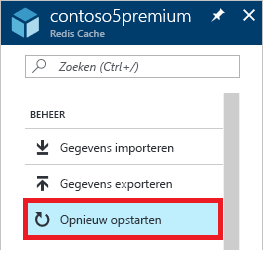
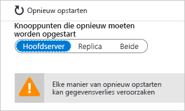
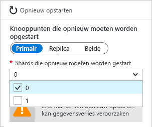
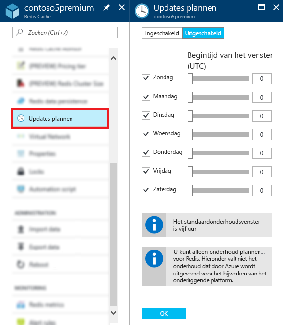

# Azure-cache beheren voor redis
In dit onderwerp wordt beschreven hoe u beheer taken uitvoert, zoals het [opnieuw opstarten](#reboot) en het [plannen van updates](#schedule-updates) voor uw Azure-cache voor redis-exemplaren.

> [!NOTE]
> Afwijking-vrije communicatie
>
> Micro soft biedt ondersteuning voor een gevarieerde en inbegrips omgeving. Dit artikel bevat verwijzingen naar het woord _Slave_. De micro soft- [stijl gids voor beschik bare communicatie](https://github.com/MicrosoftDocs/microsoft-style-guide/blob/master/styleguide/bias-free-communication.md) herkent deze als een uitsluitend woord. Het woord wordt in dit artikel gebruikt voor consistentie omdat het momenteel het woord is dat wordt weer gegeven in de software. Wanneer de software is bijgewerkt om het woord te verwijderen, wordt dit artikel zodanig bijgewerkt dat het in uitlijning is.
>

[!INCLUDE [updated-for-az](../../includes/updated-for-az.md)]

## Opnieuw opstarten
Op de Blade **opnieuw opstarten** kunt u een of meer knoop punten van de cache opnieuw opstarten. Met deze mogelijkheid voor opnieuw opstarten kunt u uw toepassing testen op tolerantie als er een fout optreedt in een cache knooppunt.

Selecteer de knoop punten die u opnieuw wilt opstarten en klik op **opnieuw opstarten**.

Als u een Premium-cache met clustering hebt ingeschakeld, kunt u selecteren welke Shards de cache moet worden opgestart.

Als u een of meer knoop punten van uw cache opnieuw wilt opstarten, selecteert u de gewenste knoop punten en klikt u op **opnieuw opstarten**. Als u een Premium-cache met clustering hebt ingeschakeld, selecteert u de gewenste Shards om opnieuw op te starten en klikt u vervolgens op **opnieuw opstarten**. Na enkele minuten worden de geselecteerde knoop punten opnieuw opgestart en zijn ze een paar minuten later weer online.

De invloed op client toepassingen varieert, afhankelijk van de knoop punten die u opnieuw opstart.

* **Master** : wanneer het hoofd knooppunt opnieuw wordt opgestart, wordt door Azure cache voor redis een failover uitgevoerd naar het replica knooppunt en wordt het model gepromoot naar de Master. Tijdens deze failover kan er sprake zijn van een kort interval waarin verbindingen mogelijk niet in de cache worden opgeslagen.
* **Slave** : wanneer het slave-knoop punt opnieuw wordt opgestart, heeft dit doorgaans geen invloed op de cache-clients.
* **Zowel Master als slave** : wanneer beide cache knooppunten opnieuw worden opgestart, gaan alle gegevens verloren in de cache en worden de verbindingen met de cache mislukt totdat het primaire knoop punt weer online is. Als u [gegevens persistentie](cache-how-to-premium-persistence.md)hebt geconfigureerd, wordt de meest recente back-up hersteld wanneer de cache weer online is, maar eventuele cache schrijf bewerkingen die zijn opgetreden na de meest recente back-up, gaan verloren.
* **Knoop punten van een Premium-cache waarbij Clustering is ingeschakeld** : wanneer u een of meer knoop punten van een Premium-cache opnieuw opstart terwijl Clustering is ingeschakeld, is het gedrag voor de geselecteerde knoop punten hetzelfde als wanneer u het bijbehorende knoop punt of knoop punten van een niet-geclusterde cache opnieuw opstart.

## Veelgestelde vragen over opnieuw opstarten
* [Welk knoop punt moet ik opnieuw opstarten om mijn toepassing te testen?](#which-node-should-i-reboot-to-test-my-application)
* [Kan ik de cache opnieuw opstarten om client verbindingen te wissen?](#can-i-reboot-the-cache-to-clear-client-connections)
* [Gaan er gegevens verloren vanuit mijn cache als ik opnieuw opstart?](#will-i-lose-data-from-my-cache-if-i-do-a-reboot)
* [Kan ik mijn cache opnieuw opstarten met Power shell, CLI of andere beheer hulpprogramma's?](#can-i-reboot-my-cache-using-powershell-cli-or-other-management-tools)

### Welk knoop punt moet ik opnieuw opstarten om mijn toepassing te testen?
Als u de tolerantie van uw toepassing wilt testen op fouten van het primaire knoop punt van uw cache, start u het **hoofd** knooppunt opnieuw op. Als u de tolerantie van uw toepassing wilt testen tegen storing van het secundaire knoop punt, start u het **Slave** -knoop punt opnieuw op. Als u de tolerantie van uw toepassing wilt testen tegen de totale uitval van de cache, moet u **beide** knoop punten opnieuw opstarten.

### Kan ik de cache opnieuw opstarten om client verbindingen te wissen?
Ja, als u de cache opnieuw opstart, worden alle client verbindingen gewist. Het opnieuw opstarten van het systeem kan nuttig zijn in het geval dat alle client verbindingen worden gebruikt vanwege een logische fout of een fout in de client toepassing. Elke prijs categorie heeft verschillende [limieten voor client verbindingen](cache-configure.md#default-redis-server-configuration) voor de verschillende grootten en zodra deze limieten zijn bereikt, worden er geen client verbindingen meer geaccepteerd. Het opnieuw opstarten van de cache biedt een manier om alle client verbindingen te wissen.

> [!IMPORTANT]
> Als u de cache opnieuw opstart om client verbindingen te wissen, wordt stack Exchange. redis automatisch opnieuw verbonden zodra het knoop punt redis weer online is. Als het onderliggende probleem niet is opgelost, kunnen de client verbindingen blijven gebruiken.
> 
> 

### Gaan er gegevens verloren vanuit mijn cache als ik opnieuw opstart?
Als u de **Master** -en **Slave** -knoop punten opnieuw opstart, kunnen alle gegevens in de cache (of in die Shard als u een Premium-cache gebruikt en clustering is ingeschakeld) verloren gaan, maar dit wordt niet gegarandeerd. Als u [gegevens persistentie](cache-how-to-premium-persistence.md)hebt geconfigureerd, wordt de meest recente back-up hersteld wanneer de cache weer online is, maar eventuele cache schrijf bewerkingen die zijn opgetreden nadat de back-up is gemaakt, gaan verloren.

Als u slechts één van de knoop punten opnieuw opstart, gaan de gegevens doorgaans verloren, maar is deze nog steeds aanwezig. Als bijvoorbeeld het hoofd knooppunt opnieuw wordt opgestart en er een cache-schrijf bewerking wordt uitgevoerd, gaan de gegevens uit de cache-schrijf bewerking verloren. Een ander scenario voor gegevens verlies is dat als u één knoop punt opnieuw opstart en het andere knoop punt wordt uitgevoerd als gevolg van een fout op hetzelfde moment. Zie [Wat is er gebeurd met mijn gegevens in redis?](https://gist.github.com/JonCole/b6354d92a2d51c141490f10142884ea4#file-whathappenedtomydatainredis-md) voor meer informatie over mogelijke oorzaken voor gegevens verlies.

### Kan ik mijn cache opnieuw opstarten met Power shell, CLI of andere beheer hulpprogramma's?
Ja, voor Power shell-instructies Zie [een Azure-cache opnieuw opstarten voor redis](cache-how-to-manage-redis-cache-powershell.md#to-reboot-an-azure-cache-for-redis).

## Updates plannen
Op de Blade **updates plannen** kunt u een onderhouds venster voor uw cache-exemplaar aanwijzen. Wanneer het onderhouds venster is opgegeven, worden er redis-server updates gemaakt tijdens dit venster. 

> [!NOTE] 
> Het onderhouds venster is alleen van toepassing op redis-server updates en niet op Azure-updates of updates voor het besturings systeem van de virtuele machines die de cache hosten.
>

Als u een onderhouds venster wilt opgeven, controleert u de gewenste dagen en geeft u het onderhouds venster voor elke dag op en klikt u op **OK**. Houd er rekening mee dat de tijd van het onderhouds venster in UTC is. 

Het standaard en minimale onderhouds venster voor updates is vijf uur. Deze waarde kan niet worden geconfigureerd vanuit het Azure Portal, maar u kunt deze configureren in Power shell met behulp `MaintenanceWindow` van de para meter van de cmdlet [New-AzRedisCacheScheduleEntry](/powershell/module/az.rediscache/new-azrediscachescheduleentry) . Zie kan ik geplande updates beheren met Power shell, CLI of andere beheer hulpprogramma's? voor meer informatie.

## Veelgestelde vragen over het plannen van updates
* [Wanneer worden er updates uitgevoerd als ik de functie updates plannen niet gebruik?](#when-do-updates-occur-if-i-dont-use-the-schedule-updates-feature)
* [Welk type updates worden er uitgevoerd tijdens het geplande onderhouds venster?](#what-type-of-updates-are-made-during-the-scheduled-maintenance-window)
* [Kan ik geplande updates beheren met Power shell, CLI of andere beheer hulpprogramma's?](#can-i-managed-scheduled-updates-using-powershell-cli-or-other-management-tools)

### Wanneer worden er updates uitgevoerd als ik de functie updates plannen niet gebruik?
Als u geen onderhouds venster opgeeft, kunnen er op elk gewenst moment updates worden uitgevoerd.

### Welk type updates worden er uitgevoerd tijdens het geplande onderhouds venster?
Er worden alleen redis-server updates gemaakt tijdens het geplande onderhouds venster. Het onderhouds venster is niet van toepassing op Azure-updates of updates voor het VM-besturings systeem.

### Kan ik geplande updates beheren met Power shell, CLI of andere beheer hulpprogramma's?
Ja, u kunt uw geplande updates beheren met de volgende Power shell-cmdlets:

* [Get-AzRedisCachePatchSchedule](/powershell/module/az.rediscache/get-azrediscachepatchschedule)
* [New-AzRedisCachePatchSchedule](/powershell/module/az.rediscache/new-azrediscachepatchschedule)
* [New-AzRedisCacheScheduleEntry](/powershell/module/az.rediscache/new-azrediscachescheduleentry)
* [Remove-AzRedisCachePatchSchedule](/powershell/module/az.rediscache/remove-azrediscachepatchschedule)

## Volgende stappen
* Meer Azure-cache verkennen voor de functies [van de Premium-laag van redis](cache-premium-tier-intro.md) .

