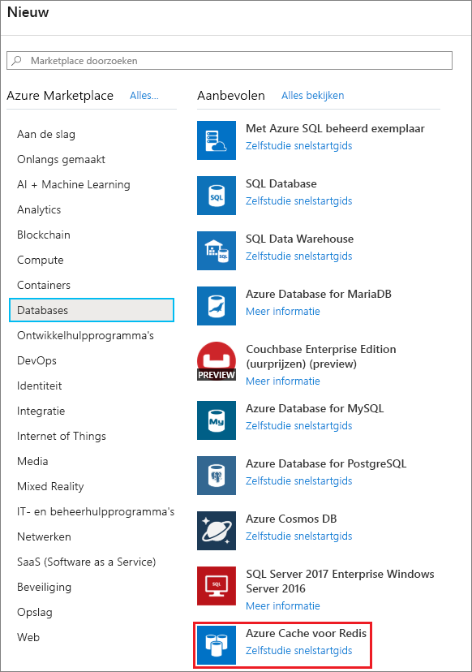
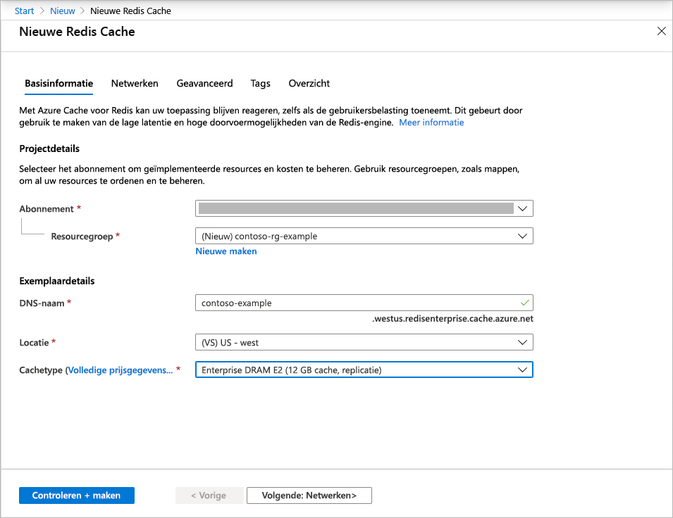
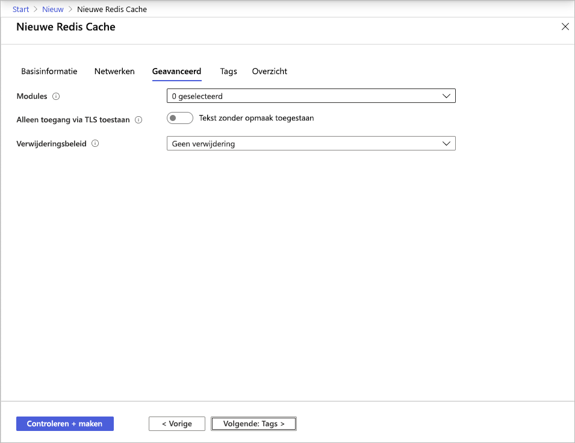
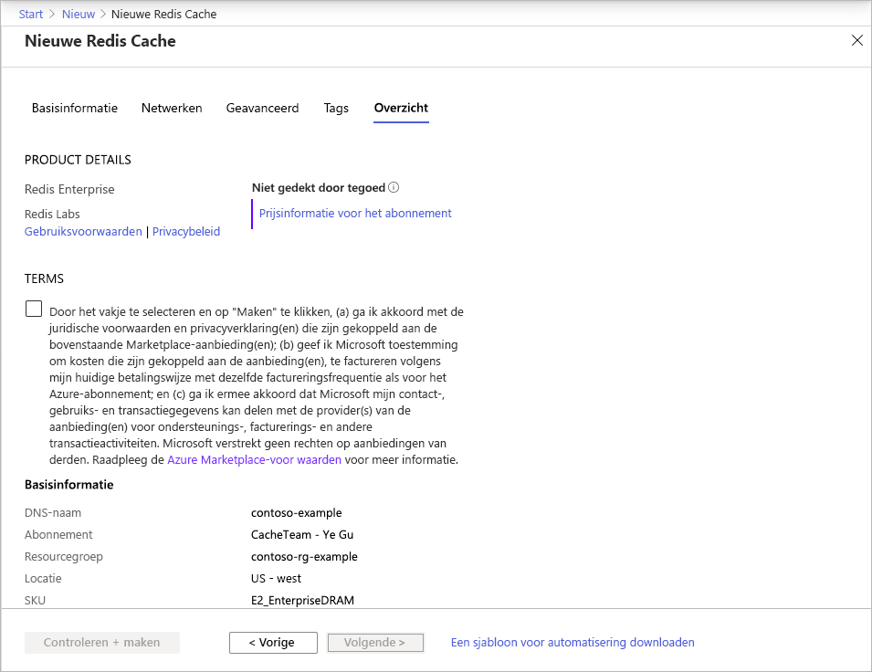

# Quickstart: Een cache voor een Enterprise-laag maken (preview)

De Enterprise-lagen voor Azure Cache voor Redis bieden het volledig geïntegreerde en beheerde [Redis Enterprise](https://redislabs.com/redis-enterprise/) in Azure. Ze zijn momenteel beschikbaar als preview. Er zijn twee nieuwe lagen beschikbaar in deze preview:
* Enterprise, waarbij gebruik wordt gemaakt van vluchtig geheugen (DRAM) op een virtuele machine om gegevens op te slaan
* Enterprise SSD, waarbij gebruik wordt gemaakt van vluchtig en niet-vluchtig geheugen (NVMe) om gegevens op te slaan

Er zijn geen kosten verbonden aan het samenvoegen van de preview. Als u interesse hebt, kunt u zich op [Azure Marketplace](https://aka.ms/redispreviewsignup/) aanmelden via de knop **Contact opnemen**. Er is een zeer beperkt aantal plaatsen beschikbaar en we kunnen niet garanderen dat u wordt geselecteerd als deelnemer voor deze preview.

## Vereisten

U hebt een Azure-abonnement nodig voordat u kunt beginnen. Als u nog geen account hebt, maakt u eerst [een gratis account](https://azure.microsoft.com/free/).

## Een cache maken
1. Meld u aan bij de Azure-portal via de link in uw preview-uitnodiging en selecteer **Een resource maken** om een cache te maken.

   > [!IMPORTANT] 
   > Abonneer u niet rechtstreeks op Marketplace op *Azure Cache for Redis, Enterprise Tiers*.
   > Deze stap wordt automatisch uitgevoerd door de gebruikersinterface van de Azure Cache voor Redis-portal.
   >
   
1. Selecteer op de pagina **Nieuw** de optie **Databases** en selecteer vervolgens **Azure Cache voor Redis**.
   
   
   
1. Configureer op de pagina **Nieuwe Redis-cache** de instellingen voor de nieuwe cache.
   
   | Instelling      | Voorgestelde waarde  | Beschrijving |
   | ------------ |  ------- | -------------------------------------------------- |
   | **Abonnement** | Open de vervolgkeuzelijst en selecteer uw abonnement. | Het abonnement waarmee dit nieuwe Azure Cache voor Redis-exemplaar wordt gemaakt. | 
   | **Resourcegroep** | Open de vervolgkeuzelijst en selecteer een resourcegroep of kies **Nieuwe maken** en geef een naam voor de nieuwe resourcegroep op. | Naam voor de resourcegroep waarin de cache en andere resources moeten worden gemaakt. Door al uw app-resources in één resourcegroep te plaatsen, kunt u ze eenvoudig beheren of verwijderen. | 
   | **DNS-naam** | Geef een wereldwijd unieke naam op. | De cachenaam is een tekenreeks van 1 tot 63 tekens die alleen cijfers, letters en afbreekstreepjes mag bevatten. De naam moet beginnen en eindigen met een cijfer of letter en mag geen opeenvolgende afbreekstreepjes bevatten. De *hostnaam* van het cache-exemplaar is *\<DNS name>.<Azure region>.redisenterprise.cache.azure.net*. | 
   | **Locatie** | Open de vervolgkeuzelijst en selecteer een locatie. | Enterprise-lagen zijn beschikbaar in US - west, US - oost 2 en Europa - west. |
   | **Cachelaag** | Open de vervolgkeuzelijst en selecteer een *Enterprise DRAM*- of *Enterprise SSD*-laag en een grootte. |  De grootte, prestaties en functies die beschikbaar zijn voor de cache, zijn afhankelijk van de gekozen laag. |
   
    

1. Selecteer **Volgende: Netwerken** en ga door.

   > [!NOTE] 
   > Ondersteuning voor privékoppelingen volgt later.
   >

1. Selecteer **Volgende: Geavanceerd**.
   
   U kunt de standaardinstellingen behouden of deze indien nodig aanpassen. Als u **Alleen toegang via TLS toestaan** inschakelt, moet u TLS gebruiken om vanuit uw toepassing toegang te krijgen tot de nieuwe cache.

    

   > [!NOTE] 
   > Redis-modules worden nog niet ondersteund in de Enterprise SSD-laag. Kies een Enterprise-cache als u van plan bent een Redis-module te gebruiken.
   >
   
1. Selecteer **Volgende: Tags** en ga door.

1. Selecteer **Volgende: Samenvatting**.

    

1. Klik op het selectievakje onder **Voorwaarden**, controleer de instellingen en selecteer **Beoordelen en maken**.
   
   Het duurt enige tijd voordat de cache is gemaakt. U kunt de voortgang bekijken op de **overzichtspagina** van Azure Cache voor Redis. Als u bij **Status** **Wordt uitgevoerd** ziet staan, kunt u de cache gebruiken.

   > [!NOTE] 
   > Enige tijd nadat de Enterprise-cache is gemaakt, ontvangt u de e-mail **Actie vereist** van Azure Marketplace om *Azure Cache for Redis, Enterprise Tiers* te configureren. U hoeft hier niets mee te doen. U kunt die e-mail gewoon negeren.
   >

## Volgende stappen

In deze quickstart hebt u geleerd hoe u een instantie van een Enterprise-laag van Azure Cache voor Redis maakt.

> [!div class="nextstepaction"]
> [Maak een ASP.NET-web-app die gebruikmaakt van Azure Cache voor Redis.](./cache-web-app-howto.md)

