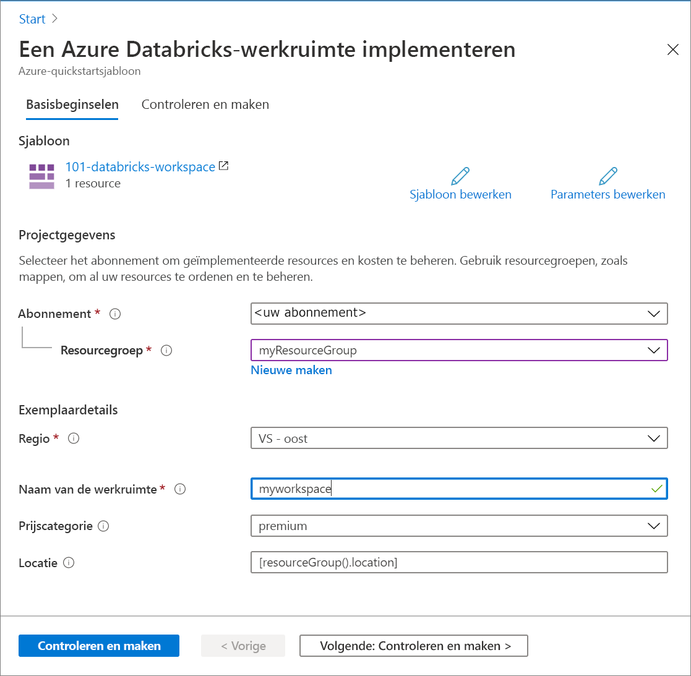

# <a name="quickstart-create-an-azure-databricks-workspace-by-using-the-azure-resource-manager-template"></a>Quickstart: Een Azure Databricks-werkruimte maken met behulp van de Azure Resource Manager-sjabloon

In deze snelstart gebruikt u een Azure Resource Manager-sjabloon om een Azure Databricks-werkruimte te maken. Nadat de werkruimte is gemaakt, valideert u de implementatie.

[!INCLUDE [About Azure Resource Manager](../../includes/resource-manager-quickstart-introduction.md)]

## <a name="prerequisites"></a>Vereisten

U hebt het volgende nodig om dit artikel te voltooien:

* Een Azure-abonnement: u kunt [een gratis abonnement maken](https://azure.microsoft.com/free/)

## <a name="create-an-azure-databricks-workspace"></a>Een Azure Databricks-werkruimte maken

### <a name="review-the-template"></a>De sjabloon controleren

De sjabloon die in deze quickstart wordt gebruikt, komt uit [Azure Quick Start-sjablonen](https://github.com/Azure/azure-quickstart-templates/tree/master/101-databricks-workspace).

:::code language="json" source="~/quickstart-templates/101-databricks-workspace/azuredeploy.json" range="1-53":::

De Azure-resource die in de sjabloon is gedefinieerd, is Microsoft. Databricks/werkruimten: een Azure Databricks-werkruimte maken. 

## <a name="deploy-the-template"></a>De sjabloon implementeren

In deze sectie gaat u een Azure Databricks-werkruimte maken met behulp van de Resource Manager-sjabloon.

1. Selecteer de volgende afbeelding om u aan te melden bij Azure en een sjabloon te openen. De sjabloon maakt een Azure Databricks-werkruimte.

   [](https://portal.azure.com/#create/Microsoft.Template/uri/https%3A%2F%2Fraw.githubusercontent.com%2FAzure%2Fazure-quickstart-templates%2Fmaster%2F101-databricks-workspace%2Fazuredeploy.json)

2. Geef de vereiste waarden op voor het maken van uw Azure-Databricks-werkruimte

   

   Geef de volgende waarden op:

   |Eigenschap  |Beschrijving  |
   |---------|---------|
   |**Abonnement**     | Selecteer uw Azure-abonnement in de vervolgkeuzelijst.        |
   |**Resourcegroep**     | Geef aan of u een nieuwe resourcegroep wilt maken of een bestaande groep wilt gebruiken. Een resourcegroep is een container met gerelateerde resources voor een Azure-oplossing. Zie [Overzicht van Azure Resource Manager](../azure-resource-manager/management/overview.md) voor meer informatie. |
   |**Locatie**     | Selecteer **VS - oost 2**. Zie [Producten beschikbaar per regio](https://azure.microsoft.com/regions/services/) voor andere beschikbare regio's.        |
   |**Werkruimtenaam**     | Geef een naam op voor uw Databricks-werkruimte.        |
   |**Prijscategorie**     |  U kunt kiezen tussen **Standard** en **Premium**. Bekijk de pagina [Prijzen voor Databricks](https://azure.microsoft.com/pricing/details/databricks/) voor meer informatie over deze categorieën.       |

3. Selecteer **Controleren en maken** en vervolgens **Maken**.

4. Het maken van de werkruimte duurt enkele minuten. Wanneer de implementatie van een werkruimte mislukt, wordt de werkruimte nog steeds gemaakt, maar krijgt deze de status Mislukt. Verwijder de mislukte werkruimte en maak een nieuwe werkruimte waarin de implementatiefouten zijn opgelost. Wanneer u de mislukte werkruimte verwijdert, worden de beheerde resourcegroep en de resources die wel zijn geïmplementeerd ook verwijderd.

## <a name="review-deployed-resources"></a>Geïmplementeerde resources bekijken

U kunt de Azure-portal gebruiken om de Azure Databricks-werkruimte te controleren of het volgende Azure CLI- of Azure PowerShell-script gebruiken om de resource weer te geven.

### <a name="azure-cli"></a>Azure CLI

```azurecli-interactive
echo "Enter your Azure Databricks workspace name:" &&
read databricksWorkspaceName &&
echo "Enter the resource group where the Azure Databricks workspace exists:" &&
read resourcegroupName &&
az databricks workspace show -g $resourcegroupName -n $databricksWorkspaceName
```

### <a name="azure-powershell"></a>Azure PowerShell

```azurepowershell-interactive
$resourceGroupName = Read-Host -Prompt "Enter the resource group name where your Azure Databricks workspace exists"
(Get-AzResource -ResourceType "Microsoft.Databricks/workspaces" -ResourceGroupName $resourceGroupName).Name
 Write-Host "Press [ENTER] to continue..."
```

## <a name="clean-up-resources"></a>Resources opschonen

Als u verder wilt gaan met volgende zelfstudies, kunt u deze resources intact laten. Wanneer u een resourcegroep niet meer nodig hebt, verwijdert u de resourcegroep, waarmee de Azure Databricks-werkruimte en de gerelateerde beheerde resources worden verwijderd. Zo verwijdert u de resourcegroep met behulp van Azure CLI of Azure PowerShell:

### <a name="azure-cli"></a>Azure CLI

```azurecli-interactive
echo "Enter the Resource Group name:" &&
read resourceGroupName &&
az group delete --name $resourceGroupName &&
echo "Press [ENTER] to continue ..."
```

### <a name="azure-powershell"></a>Azure PowerShell

```azurepowershell-interactive
$resourceGroupName = Read-Host -Prompt "Enter the Resource Group name"
Remove-AzResourceGroup -Name $resourceGroupName
Write-Host "Press [ENTER] to continue..."
```

## <a name="next-steps"></a>Volgende stappen

In deze snelstart hebt u een Azure Databricks-werkruimte gemaakt met behulp van een Azure Resource Manager-sjabloon en de implementatie gevalideerd. Ga naar het volgende artikel voor informatie over het uitvoeren van een ETL-bewerking (Extraction, Transformation, and Loading) met behulp van Azure Databricks.

> [!div class="nextstepaction"]
> [Gegevens uitpakken, transformeren en laden met Azure Databricks](databricks-extract-load-sql-data-warehouse.md)
