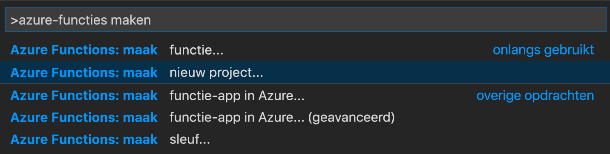
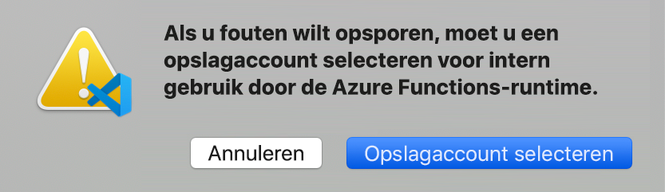

# <a name="create-your-first-durable-function-in-python"></a>Uw eerste Durable Function maken in Python

*Durable Functions* is een extensie van [Azure Functions](../functions-overview.md) waarmee u stateful functies kunt schrijven in een serverloze omgeving. Met de extensie worden status, controlepunten en het opnieuw opstarten voor u beheerd.

In dit artikel leert u hoe u de Azure Functions-extensie van Visual Studio Code kunt gebruiken om lokaal een duurzame ‘Hallo wereld’-functie te maken en te testen.  Met deze functie worden aanroepen naar andere functies ingedeeld en aan elkaar gekoppeld. Vervolgens publiceert u de functiecode op Azure.


## <a name="prerequisites"></a>Vereisten

Vereisten voor het voltooien van deze zelfstudie:

* Installeer [Visual Studio Code](https://code.visualstudio.com/download).

* Installeer de [Azure Functions](https://marketplace.visualstudio.com/items?itemName=ms-azuretools.vscode-azurefunctions) VS Code-extensie.

* Zorg ervoor dat u beschikt over de nieuwste versie van de [Azure Functions Core Tools](../functions-run-local.md).

* Voor Durable Functions is een Azure-opslagaccount vereist. U hebt een Azure-abonnement nodig.

* Zorg ervoor dat u versie 3.6, 3.7 of 3.8 van [Python](https://www.python.org/) hebt geïnstalleerd.

[!INCLUDE [quickstarts-free-trial-note](../../../includes/quickstarts-free-trial-note.md)]

## <a name="create-your-local-project"></a><a name="create-an-azure-functions-project"></a>Uw lokale project maken 

In deze sectie gebruikt u Visual Studio Code om een lokaal Azure Functions-project te maken. 

1. Druk in Visual Studio Code op F1 (of Ctrl+Shift+P) om het opdrachtenpalet te openen. In het opdrachtenpalet zoekt en selecteert u `Azure Functions: Create New Project...`.

    

1. Kies een lege map voor uw project en kies **Selecteren**.

1. Volg de instructies en geef de volgende informatie op:

    | Vraag | Waarde | Beschrijving |
    | ------ | ----- | ----------- |
    | Selecteer een taal voor uw functie-appproject | Python | Maak een lokaal Python Functions-project. |
    | Een versie selecteren | Azure Functions v3 | U ziet deze optie alleen wanneer de Core Tools niet al zijn geïnstalleerd. In dit geval worden de Core Tools geïnstalleerd wanneer u de app voor het eerst uitvoert. |
    | Python-versie | Python 3.6, 3.7 of 3.8 | VS Code maakt een virtuele omgeving met de versie die u selecteert. |
    | Selecteer een sjabloon voor de eerste functie van uw project | Nu overslaan | |
    | Selecteer hoe u uw project wilt openen | In het huidige venster openen | Opent VS Code opnieuw in de map die u hebt geselecteerd. |

Visual Studio Code installeert zo nodig de Azure Functions Core Tools. Er wordt ook een functie-app-project gemaakt in een map. Dit project bevat de configuratiebestanden [host.json](../functions-host-json.md) en [local.settings.json](../functions-run-local.md#local-settings-file).

Er wordt ook een requirement.txt-bestand gemaakt in de hoofdmap. Dit geeft de Python-pakketten op die nodig zijn om uw functie-app uit te voeren.

## <a name="install-azure-functions-durable-from-pypi"></a>Azure-functions-durable installeren vanaf PyPI

Toen u het project heeft aangemaakt, heeft de Azure Functions VS Code-extensie automatisch een virtuele omgeving gemaakt met de geselecteerde Python-versie. U activeert de virtuele omgeving in een terminal en installeert enkele afhankelijkheden die vereist zijn voor Azure Functions en Durable Functions.

1. Open `requirements.txt` in de editor en wijzig de inhoud als volgt:

    ```
    azure-functions
    azure-functions-durable>=1.0.0b6
    ```

1. Open de geïntegreerde terminal van de editor in de huidige map (`` Ctrl-Shift-` ``).

1. Activeer vanuit de geïntegreerde terminal de virtuele omgeving in de huidige map:

    **Linux of macOS**

    ```bash
    source .venv/bin/activate
    ```

    **Windows**

    ```powershell
    .venv\scripts\activate
    ```

    

1. In de geïntegreerde terminal waar de virtuele omgeving wordt geactiveerd, gebruikt u PIP om de pakketten die u zojuist hebt gedefinieerd te installeren:

    ```bash
    python -m pip install -r requirements.txt
    ```

## <a name="create-your-functions"></a>Uw functies maken

Een eenvoudige Durable Functions-app bevat drie functies:

* *Orchestrator-functie*: beschrijft een werkstroom die andere functies organiseert.
* *Activiteitfunctie*: wordt aangeroepen door de Orchestrator-functie, voert het werk uit en retourneert optioneel een waarde.
* *Clientfunctie*: een reguliere Azure-functie waarmee een Orchestrator-functie wordt gestart. In dit voorbeeld wordt een door HTTP geactiveerde functie gebruikt.

### <a name="orchestrator-function"></a>Orchestrator-functie

U gebruikt een sjabloon om de code van de Durable Function te maken in uw project.

1. In het opdrachtenpalet zoekt en selecteert u `Azure Functions: Create Function...`.

1. Volg de instructies en geef de volgende informatie op:

    | Vraag | Waarde | Beschrijving |
    | ------ | ----- | ----------- |
    | Selecteer een sjabloon voor uw functie | Durable Functions-orchestrator | Een Durable Functions-indeling maken |
    | Geef een functienaam op | HelloOrchestrator | Naam van uw Durable Function |

U hebt een orchestrator toegevoegd om de activiteitsfuncties te coördineren. Open *HelloOrchestrator/\_\_init__.py* om de Orchestrator-functie weer te geven. Elke aanroep van `context.call_activity` roept een activiteitfunctie aan met de naam `Hello`.

Vervolgens voegt u de `Hello`-activiteitsfunctie toe waarnaar wordt verwezen.

### <a name="activity-function"></a>Activiteitsfunctie

1. In het opdrachtenpalet zoekt en selecteert u `Azure Functions: Create Function...`.

1. Volg de instructies en geef de volgende informatie op:

    | Vraag | Waarde | Beschrijving |
    | ------ | ----- | ----------- |
    | Selecteer een sjabloon voor uw functie | Durable Functions-activiteit | Een ectiviteitsfunctie maken |
    | Geef een functienaam op | Hello | Naam van uw activiteitsfunctie |

U hebt de `Hello`-activiteitsfunctie toegevoegd die wordt aangeroepen door de orchestrator. Open *Hello/\_\_init__. py*. U ziet dat het een naam aanneemt als invoer en een begroeting retourneert. Met een activiteitsfunctie kunt u acties uitvoeren, zoals het maken van een database-aanroep of het uitvoeren van een berekening.

Ten slotte voegt u een door HTTP geactiveerde functie toe waarmee de indeling wordt gestart.

### <a name="client-function-http-starter"></a>Clientfunctie (HTTP-starter)

1. In het opdrachtenpalet zoekt en selecteert u `Azure Functions: Create Function...`.

1. Volg de instructies en geef de volgende informatie op:

    | Vraag | Waarde | Beschrijving |
    | ------ | ----- | ----------- |
    | Selecteer een sjabloon voor uw functie | HTTP-starter Durable Functions | Een HTTP-starterfunctie maken |
    | Geef een functienaam op | DurableFunctionsHttpStart | Naam van uw activiteitsfunctie |
    | Autorisatieniveau | Anoniem | Sta omwille van de demo toe dat de functie wordt aangeroepen zonder verificatie |

U hebt een door HTTP geactiveerde functie toegevoegd waarmee een indeling wordt gestart. Open *DurableFunctionsHttpStart/\_\_init__.py* om te zien dat deze `client.start_new` gebruikt om een nieuwe indeling te starten. Vervolgens wordt `client.create_check_status_response` gebruikt om een HTTP-antwoord te retourneren met URL's die kunnen worden gebruikt om de nieuwe indeling te controleren en beheren.

U hebt nu een Durable Functions-app die lokaal kan worden uitgevoerd en in Azure kan worden geïmplementeerd.

## <a name="test-the-function-locally"></a>De functie lokaal testen

Met Azure Functions Core-hulpprogramma's kunt u een Azure Functions-project uitvoeren op uw lokale ontwikkelcomputer. Als ze nog niet geïnstalleerd zijn, wordt u gevraagd deze hulpprogramma's te installeren wanneer u voor de eerste keer een functie vanuit Visual Studio Code start.

1. Stel een onderbrekingspunt in code van de `Hello`-activiteitsfunctie (*Hello/\_\_init__.py*) in om uw functie te testen. Druk op F5 of selecteer `Debug: Start Debugging` in het opdrachtpalet om het project met de functie-app te starten. De uitvoer van Core Tools wordt weergegeven in het deelvenster **Terminal**.

    > [!NOTE]
    > Raadpleeg de [Durable Functions-diagnoses](durable-functions-diagnostics.md#debugging) voor meer informatie over foutopsporing.

1. Durable Functions vereist een Azure-opslagaccount om te kunnen worden uitgevoerd. Kies **Opslagaccount selecteren** wanneer VS Code u vraagt een opslagaccount te selecteren.

    

1. Volg de aanwijzingen en geef de volgende informatie op om een nieuw opslagaccount te maken in Azure.

    | Vraag | Waarde | Beschrijving |
    | ------ | ----- | ----------- |
    | Abonnement selecteren | *naam van uw abonnement* | Selecteer uw Azure-abonnement |
    | Selecteer een opslagaccount | Een nieuw opslagaccount maken |  |
    | Voer de naam van het nieuwe opslagaccount in | *unieke naam* | Naam van het opslagaccount dat moet worden gemaakt |
    | Een resourcegroep selecteren | *unieke naam* | Naam van de resourcegroep die moet worden gemaakt |
    | Selecteer een locatie | *regio* | Kies een regio bij u in de buurt |

1. Kopieer het URL-eindpunt van de door HTTP getriggerde functie in het deelvenster **Terminal**.

    

1. Verzend met behulp van uw browser of een hulpprogramma zoals [Postman](https://www.getpostman.com/) of [cURL](https://curl.haxx.se/) een HTTP-aanvraag naar het URL-eindpunt. Vervang het laatste segment door de naam van de Orchestrator-functie (`HelloOrchestrator`). De URL moet vergelijkbaar zijn met `http://localhost:7071/api/orchestrators/HelloOrchestrator`.

   De reactie is het eerste resultaat van de HTTP-functie dat u laat weten dat de duurzame indeling is gestart. Dit is nog niet het eindresultaat van de orchestrator. De reactie bevat enkele nuttige URL's. Maar eerst gaan we de status van de orchestrator opvragen.

1. Kopieer de URL-waarde voor `statusQueryGetUri`, plak deze in de adresbalk van de browser en voer de aanvraag uit. U kunt ook Postman blijven gebruiken om de GET-aanvraag uit te voeren.

   De aanvraag voert een query uit op het orchestrator-exemplaar voor de status. U moet een eindige reactie krijgen, die laat zien dat de instantie is voltooid en die de uitvoer of resultaten van de Durable Function bevat. Deze ziet er als volgt uit: 

    ```json
    {
        "name": "HelloOrchestrator",
        "instanceId": "9a528a9e926f4b46b7d3deaa134b7e8a",
        "runtimeStatus": "Completed",
        "input": null,
        "customStatus": null,
        "output": [
            "Hello Tokyo!",
            "Hello Seattle!",
            "Hello London!"
        ],
        "createdTime": "2020-03-18T21:54:49Z",
        "lastUpdatedTime": "2020-03-18T21:54:54Z"
    }
    ```

1. Druk op **Shift + F5** in VS Code als u het opsporen van fouten wilt opsporen.

Nadat u hebt gecontroleerd of de functie correct wordt uitgevoerd op uw lokale computer, is het tijd om het project te publiceren in Azure.

[!INCLUDE [functions-create-function-app-vs-code](../../../includes/functions-sign-in-vs-code.md)]

[!INCLUDE [functions-publish-project-vscode](../../../includes/functions-publish-project-vscode.md)]

## <a name="test-your-function-in-azure"></a>Uw functie testen in Azure

1. Kopieer de URL van de HTTP-trigger vanuit het deelvenster **Output** (Uitvoer). De URL die uw HTTP-geactiveerde functie aanroept, moet de volgende indeling hebben: `http://<functionappname>.azurewebsites.net/orchestrators/HelloOrchestrator`

2. Plak deze nieuwe URL van de HTTP-aanvraag in de adresbalk van uw browser. U krijgt dezelfde statusreactie als eerder, toen u de gepubliceerde app gebruikte.

## <a name="next-steps"></a>Volgende stappen

U hebt Visual Studio Code gebruikt om een duurzame Python-functie-app te maken en te publiceren.

> [!div class="nextstepaction"]
> [Meer informatie over algemene patronen van duurzame functies](durable-functions-overview.md#application-patterns)
