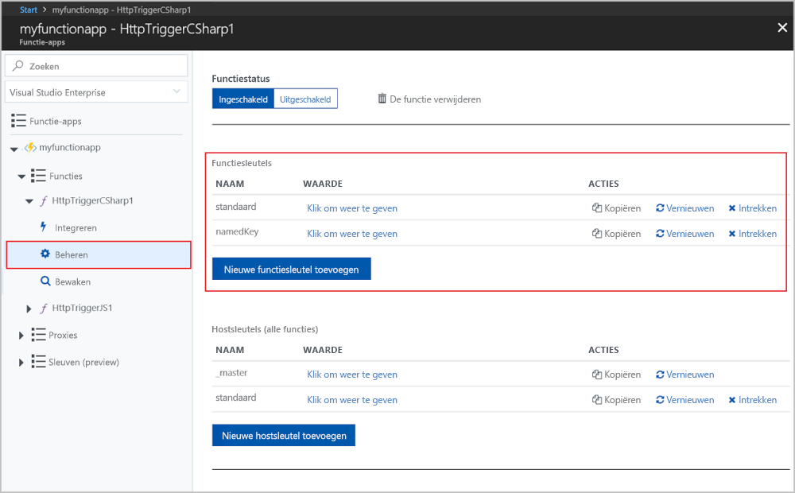
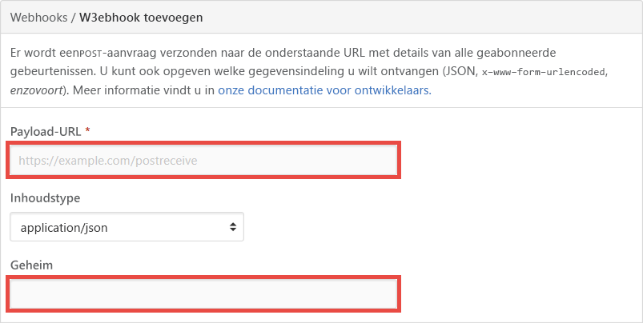

# <a name="azure-functions-http-triggers-and-bindings"></a>HTTP-triggers en-bindingen Azure Functions

In dit artikel wordt uitgelegd hoe u met HTTP-triggers en uitvoer bindingen in Azure Functions kunt werken.

Een HTTP-trigger kan worden aangepast om te reageren op [webhooks](https://en.wikipedia.org/wiki/Webhook).

[!INCLUDE [intro](../../includes/functions-bindings-intro.md)]

[!INCLUDE [HTTP client best practices](../../includes/functions-http-client-best-practices.md)]

De code in dit artikel wordt standaard ingesteld op de syntaxis die gebruikmaakt van .NET core, die wordt gebruikt in functions versie 2. x of hoger. Zie voor meer informatie over de syntaxis van 1. x de [functies sjablonen van 1. x](https://github.com/Azure/azure-functions-templates/tree/v1.x/Functions.Templates/Templates).

## <a name="packages---functions-1x"></a>Pakketten - functies 1.x

De HTTP-bindingen zijn opgenomen in het [micro soft. Azure. webjobs. Extensions. http NuGet-](https://www.nuget.org/packages/Microsoft.Azure.WebJobs.Extensions.Http) pakket, versie 1. x. De bron code voor het pakket bevindt zich in de GitHub-opslag plaats [Azure-webjobs-SDK-Extensions](https://github.com/Azure/azure-webjobs-sdk-extensions/tree/v2.x/src/WebJobs.Extensions.Http) .

[!INCLUDE [functions-package-auto](../../includes/functions-package-auto.md)]

## <a name="packages---functions-2x-and-higher"></a>Pakketten-functions 2. x en hoger

De HTTP-bindingen zijn opgenomen in het [micro soft. Azure. webjobs. Extensions. http NuGet-](https://www.nuget.org/packages/Microsoft.Azure.WebJobs.Extensions.Http) pakket, versie 3. x. De bron code voor het pakket bevindt zich in de GitHub-opslag plaats [Azure-webjobs-SDK-Extensions](https://github.com/Azure/azure-webjobs-sdk-extensions/blob/master/src/WebJobs.Extensions.Http/) .

[!INCLUDE [functions-package](../../includes/functions-package-auto.md)]

## <a name="trigger"></a>Trigger

Met de HTTP-trigger kunt u een functie aanroepen met een HTTP-aanvraag. U kunt een HTTP-trigger gebruiken om serverloze Api's te maken en te reageren op webhooks.

Een HTTP-trigger retourneert standaard HTTP 200 OK met een lege tekst in functions 1. x of HTTP 204 geen inhoud met een lege hoofd tekst in functions 2. x of hoger. Als u het antwoord wilt wijzigen, configureert u een [http-uitvoer binding](#output).

## <a name="trigger---example"></a>Trigger - voorbeeld

# <a name="ctabcsharp"></a>[C#](#tab/csharp)

In het volgende voor beeld ziet u een [ C# functie](functions-dotnet-class-library.md) die zoekt naar een `name`-para meter in de query reeks of de hoofd tekst van de HTTP-aanvraag. U ziet dat de retour waarde wordt gebruikt voor de uitvoer binding, maar een retour waarde-kenmerk is niet vereist.

```cs
[FunctionName("HttpTriggerCSharp")]
public static async Task<IActionResult> Run(
    [HttpTrigger(AuthorizationLevel.Function, "get", "post", Route = null)] 
    HttpRequest req, ILogger log)
{
    log.LogInformation("C# HTTP trigger function processed a request.");

    string name = req.Query["name"];

    string requestBody = await new StreamReader(req.Body).ReadToEndAsync();
    dynamic data = JsonConvert.DeserializeObject(requestBody);
    name = name ?? data?.name;

    return name != null
        ? (ActionResult)new OkObjectResult($"Hello, {name}")
        : new BadRequestObjectResult("Please pass a name on the query string or in the request body");
}
```

# <a name="c-scripttabcsharp-script"></a>[C#Schriften](#tab/csharp-script)

In het volgende voor beeld ziet u een trigger binding in een *Function. json* -bestand en een [ C# script functie](functions-reference-csharp.md) die gebruikmaakt van de binding. De functie zoekt naar een `name`-para meter in de query reeks of de hoofd tekst van de HTTP-aanvraag.

Hier is het bestand *Function. json* :

```json
{
    "disabled": false,
    "bindings": [
        {
            "authLevel": "function",
            "name": "req",
            "type": "httpTrigger",
            "direction": "in",
            "methods": [
                "get",
                "post"
            ]
        },
        {
            "name": "$return",
            "type": "http",
            "direction": "out"
        }
    ]
}
```

In de [configuratie](#trigger---configuration) sectie worden deze eigenschappen uitgelegd.

Dit is C# de script code die wordt gekoppeld aan `HttpRequest`:

```cs
#r "Newtonsoft.Json"

using System.Net;
using Microsoft.AspNetCore.Mvc;
using Microsoft.Extensions.Primitives;
using Newtonsoft.Json;

public static async Task<IActionResult> Run(HttpRequest req, ILogger log)
{
    log.LogInformation("C# HTTP trigger function processed a request.");

    string name = req.Query["name"];

    string requestBody = await new StreamReader(req.Body).ReadToEndAsync();
    dynamic data = JsonConvert.DeserializeObject(requestBody);
    name = name ?? data?.name;

    return name != null
        ? (ActionResult)new OkObjectResult($"Hello, {name}")
        : new BadRequestObjectResult("Please pass a name on the query string or in the request body");
}
```

U kunt een verbinding maken met een aangepast object in plaats van `HttpRequest`. Dit object wordt gemaakt op basis van de hoofd tekst van de aanvraag en geparseerd als JSON. Op dezelfde manier kan een type worden door gegeven aan de HTTP-antwoord uitvoer binding en geretourneerd als de antwoord tekst, samen met een 200-status code.

```csharp
using System.Net;
using System.Threading.Tasks;
using Microsoft.Extensions.Logging;

public static string Run(Person person, ILogger log)
{   
    return person.Name != null
        ? (ActionResult)new OkObjectResult($"Hello, {person.Name}")
        : new BadRequestObjectResult("Please pass an instance of Person.");
}

public class Person {
     public string Name {get; set;}
}
```

# <a name="javascripttabjavascript"></a>[JavaScript](#tab/javascript)

In het volgende voor beeld ziet u een trigger binding in een *Function. json* -bestand en een [Java script-functie](functions-reference-node.md) die gebruikmaakt van de binding. De functie zoekt naar een `name`-para meter in de query reeks of de hoofd tekst van de HTTP-aanvraag.

Hier is het bestand *Function. json* :

```json
{
    "disabled": false,    
    "bindings": [
        {
            "authLevel": "function",
            "type": "httpTrigger",
            "direction": "in",
            "name": "req"
        },
        {
            "type": "http",
            "direction": "out",
            "name": "res"
        }
    ]
}
```

In de [configuratie](#trigger---configuration) sectie worden deze eigenschappen uitgelegd.

Dit is de JavaScript-code:

```javascript
module.exports = function(context, req) {
    context.log('Node.js HTTP trigger function processed a request. RequestUri=%s', req.originalUrl);

    if (req.query.name || (req.body && req.body.name)) {
        context.res = {
            // status defaults to 200 */
            body: "Hello " + (req.query.name || req.body.name)
        };
    }
    else {
        context.res = {
            status: 400,
            body: "Please pass a name on the query string or in the request body"
        };
    }
    context.done();
};
```

# <a name="pythontabpython"></a>[Python](#tab/python)

In het volgende voor beeld ziet u een trigger binding in een *Function. json* -bestand en een [python-functie](functions-reference-python.md) die gebruikmaakt van de binding. De functie zoekt naar een `name`-para meter in de query reeks of de hoofd tekst van de HTTP-aanvraag.

Hier is het bestand *Function. json* :

```json
{
    "scriptFile": "__init__.py",
    "disabled": false,    
    "bindings": [
        {
            "authLevel": "function",
            "type": "httpTrigger",
            "direction": "in",
            "name": "req"
        },
        {
            "type": "http",
            "direction": "out",
            "name": "res"
        }
    ]
}
```

In de [configuratie](#trigger---configuration) sectie worden deze eigenschappen uitgelegd.

Dit is de python-code:

```python
import logging
import azure.functions as func


def main(req: func.HttpRequest) -> func.HttpResponse:
    logging.info('Python HTTP trigger function processed a request.')

    name = req.params.get('name')
    if not name:
        try:
            req_body = req.get_json()
        except ValueError:
            pass
        else:
            name = req_body.get('name')

    if name:
        return func.HttpResponse(f"Hello {name}!")
    else:
        return func.HttpResponse(
            "Please pass a name on the query string or in the request body",
            status_code=400
        )
```

# <a name="javatabjava"></a>[Java](#tab/java)

* [De para meter lezen uit de query reeks](#read-parameter-from-the-query-string)
* [Hoofd tekst van een POST-aanvraag lezen](#read-body-from-a-post-request)
* [Para meter lezen vanuit een route](#read-parameter-from-a-route)
* [POJO hoofd tekst van een POST-aanvraag lezen](#read-pojo-body-from-a-post-request)

In de volgende voor beelden ziet u de binding HTTP-trigger in een *Function. json* -bestand en de respectieve [Java-functies](functions-reference-java.md) die gebruikmaken van de binding. 

Hier is het bestand *Function. json* :

```json
{
    "disabled": false,    
    "bindings": [
        {
            "authLevel": "anonymous",
            "type": "httpTrigger",
            "direction": "in",
            "name": "req"
        },
        {
            "type": "http",
            "direction": "out",
            "name": "res"
        }
    ]
}
```

#### <a name="read-parameter-from-the-query-string"></a>De para meter lezen uit de query reeks

In dit voor beeld wordt een para meter met de naam ```id```van de query teken reeks gelezen en gebruikt om een JSON-document te maken dat naar de client wordt geretourneerd, met het inhouds type ```application/json```. 

```java
@FunctionName("TriggerStringGet")
public HttpResponseMessage run(
        @HttpTrigger(name = "req", 
            methods = {HttpMethod.GET}, 
            authLevel = AuthorizationLevel.ANONYMOUS)
        HttpRequestMessage<Optional<String>> request,
        final ExecutionContext context) {
    
    // Item list
    context.getLogger().info("GET parameters are: " + request.getQueryParameters());

    // Get named parameter
    String id = request.getQueryParameters().getOrDefault("id", "");

    // Convert and display
    if (id.isEmpty()) {
        return request.createResponseBuilder(HttpStatus.BAD_REQUEST)
                        .body("Document not found.")
                        .build();
    } 
    else {
        // return JSON from to the client
        // Generate document
        final String name = "fake_name";
        final String jsonDocument = "{\"id\":\"" + id + "\", " + 
                                        "\"description\": \"" + name + "\"}";
        return request.createResponseBuilder(HttpStatus.OK)
                        .header("Content-Type", "application/json")
                        .body(jsonDocument)
                        .build();
    }
}
```

#### <a name="read-body-from-a-post-request"></a>Hoofd tekst van een POST-aanvraag lezen

In dit voor beeld wordt de hoofd tekst van een POST-aanvraag gelezen als ```String```, en gebruikt deze om een JSON-document te maken dat naar de client wordt geretourneerd, met het inhouds type ```application/json```.

```java
    @FunctionName("TriggerStringPost")
    public HttpResponseMessage run(
            @HttpTrigger(name = "req", 
              methods = {HttpMethod.POST}, 
              authLevel = AuthorizationLevel.ANONYMOUS)
            HttpRequestMessage<Optional<String>> request,
            final ExecutionContext context) {
        
        // Item list
        context.getLogger().info("Request body is: " + request.getBody().orElse(""));

        // Check request body
        if (!request.getBody().isPresent()) {
            return request.createResponseBuilder(HttpStatus.BAD_REQUEST)
                          .body("Document not found.")
                          .build();
        } 
        else {
            // return JSON from to the client
            // Generate document
            final String body = request.getBody().get();
            final String jsonDocument = "{\"id\":\"123456\", " + 
                                         "\"description\": \"" + body + "\"}";
            return request.createResponseBuilder(HttpStatus.OK)
                          .header("Content-Type", "application/json")
                          .body(jsonDocument)
                          .build();
        }
    }
```

#### <a name="read-parameter-from-a-route"></a>Para meter lezen vanuit een route

In dit voor beeld leest u een verplichte para meter, met de naam ```id```, en een optionele para meter ```name``` van het traject, en gebruikt u deze om een JSON-document te maken dat naar de client wordt geretourneerd, met het inhouds type ```application/json```. T

```java
@FunctionName("TriggerStringRoute")
public HttpResponseMessage run(
        @HttpTrigger(name = "req", 
            methods = {HttpMethod.GET}, 
            authLevel = AuthorizationLevel.ANONYMOUS,
            route = "trigger/{id}/{name=EMPTY}") // name is optional and defaults to EMPTY
        HttpRequestMessage<Optional<String>> request,
        @BindingName("id") String id,
        @BindingName("name") String name,
        final ExecutionContext context) {
    
    // Item list
    context.getLogger().info("Route parameters are: " + id);

    // Convert and display
    if (id == null) {
        return request.createResponseBuilder(HttpStatus.BAD_REQUEST)
                        .body("Document not found.")
                        .build();
    } 
    else {
        // return JSON from to the client
        // Generate document
        final String jsonDocument = "{\"id\":\"" + id + "\", " + 
                                        "\"description\": \"" + name + "\"}";
        return request.createResponseBuilder(HttpStatus.OK)
                        .header("Content-Type", "application/json")
                        .body(jsonDocument)
                        .build();
    }
}
```

#### <a name="read-pojo-body-from-a-post-request"></a>POJO hoofd tekst van een POST-aanvraag lezen

Dit is de code voor de klasse ```ToDoItem```, waarnaar wordt verwezen in dit voor beeld:

```java

public class ToDoItem {

  private String id;
  private String description;  

  public ToDoItem(String id, String description) {
    this.id = id;
    this.description = description;
  }

  public String getId() {
    return id;
  }

  public String getDescription() {
    return description;
  }
  
  @Override
  public String toString() {
    return "ToDoItem={id=" + id + ",description=" + description + "}";
  }
}

```

In dit voor beeld wordt de hoofd tekst van een POST-aanvraag gelezen. De aanvraag tekst wordt automatisch gedeserialiseerd in een ```ToDoItem```-object en wordt geretourneerd naar de client met het inhouds type ```application/json```. De para meter ```ToDoItem``` wordt geserialiseerd door de functions-runtime, omdat deze is toegewezen aan de eigenschap ```body``` van de ```HttpMessageResponse.Builder```-klasse.

```java
@FunctionName("TriggerPojoPost")
public HttpResponseMessage run(
        @HttpTrigger(name = "req", 
            methods = {HttpMethod.POST}, 
            authLevel = AuthorizationLevel.ANONYMOUS)
        HttpRequestMessage<Optional<ToDoItem>> request,
        final ExecutionContext context) {
    
    // Item list
    context.getLogger().info("Request body is: " + request.getBody().orElse(null));

    // Check request body
    if (!request.getBody().isPresent()) {
        return request.createResponseBuilder(HttpStatus.BAD_REQUEST)
                        .body("Document not found.")
                        .build();
    } 
    else {
        // return JSON from to the client
        // Generate document
        final ToDoItem body = request.getBody().get();
        return request.createResponseBuilder(HttpStatus.OK)
                        .header("Content-Type", "application/json")
                        .body(body)
                        .build();
    }
}
```

---

## <a name="trigger---attributes"></a>Trigger - kenmerken

In [ C# klasse-bibliotheken](functions-dotnet-class-library.md) en Java is het kenmerk `HttpTrigger` beschikbaar voor het configureren van de functie.

U kunt het autorisatie niveau en toegestane HTTP-methoden instellen in de para meters van de kenmerk-constructor, het type webhook en een route sjabloon. Zie [trigger-configuratie](#trigger---configuration)voor meer informatie over deze instellingen.

# <a name="ctabcsharp"></a>[C#](#tab/csharp)

In dit voor beeld ziet u hoe u het kenmerk [http trigger](https://github.com/Azure/azure-webjobs-sdk-extensions/blob/dev/src/WebJobs.Extensions.Http/HttpTriggerAttribute.cs) gebruikt.

```csharp
[FunctionName("HttpTriggerCSharp")]
public static Task<IActionResult> Run(
    [HttpTrigger(AuthorizationLevel.Anonymous)] HttpRequest req)
{
    ...
}
```

Zie voor een volledig voor beeld het [voor beeld](#trigger---example)van de trigger.

# <a name="c-scripttabcsharp-script"></a>[C#Schriften](#tab/csharp-script)

Kenmerken worden niet ondersteund door C# het script.

# <a name="javascripttabjavascript"></a>[JavaScript](#tab/javascript)

Kenmerken worden niet ondersteund door Java script.

# <a name="pythontabpython"></a>[Python](#tab/python)

Kenmerken worden niet ondersteund door python.

# <a name="javatabjava"></a>[Java](#tab/java)

In dit voor beeld ziet u hoe u het kenmerk [http trigger](https://github.com/Azure/azure-functions-java-library/blob/dev/src/main/java/com/microsoft/azure/functions/annotation/HttpTrigger.java) gebruikt.

```java
@FunctionName("HttpTriggerJava")
public HttpResponseMessage<String> HttpTrigger(
        @HttpTrigger(name = "req",
                     methods = {"get"},
                     authLevel = AuthorizationLevel.ANONYMOUS) HttpRequestMessage<String> request,
        final ExecutionContext context) {

    ...
}
```

Zie voor een volledig voor beeld het [voor beeld](#trigger---example)van de trigger.

---

## <a name="trigger---configuration"></a>Trigger - configuratie

De volgende tabel bevat informatie over de binding configuratie-eigenschappen die u hebt ingesteld in het bestand *Function. json* en het kenmerk `HttpTrigger`.

|de eigenschap Function.JSON | De kenmerkeigenschap |Beschrijving|
|---------|---------|----------------------|
| **type** | N.v.t.| Vereist: moet worden ingesteld op `httpTrigger`. |
| **direction** | N.v.t.| Vereist: moet worden ingesteld op `in`. |
| **naam** | N.v.t.| Vereist: de naam van de variabele die wordt gebruikt in de functie code voor de aanvraag of aanvraag tekst. |
| <a name="http-auth"></a>**authLevel** |  **AuthLevel** |Bepaalt welke sleutels, indien aanwezig, moeten aanwezig zijn in de aanvraag om de functie te kunnen aanroepen. Het autorisatie niveau kan een van de volgende waarden hebben: <ul><li><code>anonymous</code>&mdash;er is geen API-sleutel vereist.</li><li><code>function</code>&mdash;een functie-specifieke API-sleutel is vereist. Dit is de standaard waarde als er geen is ingesteld.</li><li><code>admin</code>&mdash;de hoofd sleutel is vereist.</li></ul> Zie de sectie over [autorisatie sleutels](#authorization-keys)voor meer informatie. |
| **technieken** |**Technieken** | Een matrix van de HTTP-methoden waarop de functie reageert. Als deze niet wordt opgegeven, reageert de functie op alle HTTP-methoden. Zie [het HTTP-eind punt aanpassen](#customize-the-http-endpoint). |
| **rond** | **Rond** | Hiermee wordt de route sjabloon gedefinieerd, waarmee wordt bepaald welke Url's van aanvragen uw functie reageert. De standaard waarde als er geen wordt gegeven, is `<functionname>`. Zie [het HTTP-eind punt aanpassen](#customize-the-http-endpoint)voor meer informatie. |
| **webHookType** | **WebHookType** | _Alleen ondersteund voor de runtime van versie 1. x._<br/><br/>Hiermee wordt de HTTP-trigger geconfigureerd om te fungeren als een [webhook](https://en.wikipedia.org/wiki/Webhook) -ontvanger voor de opgegeven provider. Stel de eigenschap `methods` niet in als u deze eigenschap instelt. Het type webhook kan een van de volgende waarden hebben:<ul><li><code>genericJson</code>&mdash;een eind punt voor een webhook voor algemene doel einden zonder logica voor een specifieke provider. Met deze instelling worden aanvragen beperkt tot gebruikers met behulp van HTTP POST en met het inhouds type `application/json`.</li><li><code>github</code>&mdash;de functie reageert op [github-webhooks](https://developer.github.com/webhooks/). Gebruik niet de eigenschap _authLevel_ met github-webhooks. Zie de sectie GitHub-webhooks verderop in dit artikel voor meer informatie.</li><li><code>slack</code>&mdash;de functie reageert op [toegestane webhooks](https://api.slack.com/outgoing-webhooks). Gebruik niet de eigenschap _authLevel_ met toegestane webhooks. Zie de sectie over toegestane webhooks verderop in dit artikel voor meer informatie.</li></ul>|

## <a name="trigger---usage"></a>Trigger - gebruik

Het invoer type van de trigger wordt als `HttpRequest` of een aangepast type gedeclareerd. Als u `HttpRequest`selecteert, krijgt u volledige toegang tot het aanvraag object. Voor een aangepast type probeert de runtime de JSON-aanvraag tekst te parseren om de object eigenschappen in te stellen.

### <a name="customize-the-http-endpoint"></a>Het HTTP-eind punt aanpassen

Wanneer u een functie voor een HTTP-trigger maakt, is de functie standaard adresseerbaar met een route van het formulier:

    http://<APP_NAME>.azurewebsites.net/api/<FUNCTION_NAME>

U kunt deze route aanpassen met behulp van de optionele eigenschap `route` van de invoer binding van de HTTP-trigger. Als voor beeld wordt met het volgende *Function. json* -bestand een `route` eigenschap gedefinieerd voor een http-trigger:

```json
{
    "bindings": [
    {
        "type": "httpTrigger",
        "name": "req",
        "direction": "in",
        "methods": [ "get" ],
        "route": "products/{category:alpha}/{id:int?}"
    },
    {
        "type": "http",
        "name": "res",
        "direction": "out"
    }
    ]
}
```

Met deze configuratie is de functie nu adresseerbaar met de volgende route in plaats van de oorspronkelijke route.

```
http://<APP_NAME>.azurewebsites.net/api/products/electronics/357
```

Hierdoor kan de functie code twee para meters ondersteunen in het adres, de _categorie_ en de _id_.

# <a name="ctabcsharp"></a>[C#](#tab/csharp)

U kunt elke [Web-API-route beperking](https://www.asp.net/web-api/overview/web-api-routing-and-actions/attribute-routing-in-web-api-2#constraints) gebruiken met de para meters. De volgende C# functie code maakt gebruik van beide para meters.

```csharp
using System.Net;
using Microsoft.AspNetCore.Mvc;
using Microsoft.Extensions.Primitives;

public static IActionResult Run(HttpRequest req, string category, int? id, ILogger log)
{
    var message = String.Format($"Category: {category}, ID: {id}");
    return (ActionResult)new OkObjectResult(message);
}
```

# <a name="c-scripttabcsharp-script"></a>[C#Schriften](#tab/csharp-script)

U kunt elke [Web-API-route beperking](https://www.asp.net/web-api/overview/web-api-routing-and-actions/attribute-routing-in-web-api-2#constraints) gebruiken met de para meters. De volgende C# functie code maakt gebruik van beide para meters.

```csharp
#r "Newtonsoft.Json"

using System.Net;
using Microsoft.AspNetCore.Mvc;
using Microsoft.Extensions.Primitives;

public static IActionResult Run(HttpRequest req, string category, int? id, ILogger log)
{
    var message = String.Format($"Category: {category}, ID: {id}");
    return (ActionResult)new OkObjectResult(message);
}
```

# <a name="javascripttabjavascript"></a>[JavaScript](#tab/javascript)

In het knoop punt biedt de functions-runtime de hoofd tekst van de aanvraag van het `context`-object. Zie voor meer informatie het [voor beeld van Java script-trigger](#trigger---example).

In het volgende voor beeld ziet u hoe u route parameters van `context.bindingData`kunt lezen.

```javascript
module.exports = function (context, req) {

    var category = context.bindingData.category;
    var id = context.bindingData.id;
    var message = `Category: ${category}, ID: ${id}`;

    context.res = {
        body: message;
    }

    context.done();
}
```

# <a name="pythontabpython"></a>[Python](#tab/python)

De context van de functie-uitvoering wordt weer gegeven via een para meter die is gedeclareerd als `func.HttpRequest`. Met dit exemplaar kunt u een functie gebruiken om toegang te krijgen tot gegevens route parameters, waarden van query reeksen en methoden waarmee u HTTP-antwoorden kunt ophalen.

Eenmaal gedefinieerd, zijn de route parameters beschikbaar voor de functie door de `route_params` methode aan te roepen.

```python
import logging

import azure.functions as func

def main(req: func.HttpRequest) -> func.HttpResponse:

    category = req.route_params.get('category')
    id = req.route_params.get('id')
    message = f"Category: {category}, ID: {id}"

    return func.HttpResponse(message)
```

# <a name="javatabjava"></a>[Java](#tab/java)

De context van de functie-uitvoering is de eigenschappen die zijn gedeclareerd in het kenmerk `HttpTrigger`. Met het kenmerk kunt u route parameters, autorisatie niveaus, HTTP-woorden en het exemplaar van de inkomende aanvraag definiëren.

Route parameters worden gedefinieerd via het kenmerk `HttpTrigger`.

```java
package com.function;

import java.util.*;
import com.microsoft.azure.functions.annotation.*;
import com.microsoft.azure.functions.*;

public class HttpTriggerJava {
    public HttpResponseMessage<String> HttpTrigger(
            @HttpTrigger(name = "req",
                         methods = {"get"},
                         authLevel = AuthorizationLevel.FUNCTION,
                         route = "products/{category:alpha}/{id:int}") HttpRequestMessage<String> request,
            @BindingName("category") String category,
            @BindingName("id") int id,
            final ExecutionContext context) {

        String message = String.format("Category  %s, ID: %d", category, id);
        return request.createResponseBuilder(HttpStatus.OK).body(message).build();
    }
}
```

---

Standaard worden alle functie routes voorafgegaan door *API*. U kunt het voor voegsel ook aanpassen of verwijderen met behulp van de eigenschap `http.routePrefix` in het JSON-bestand van de [host](functions-host-json.md) . In het volgende voor beeld wordt het voor voegsel *API* -route verwijderd met behulp van een lege teken reeks voor het voor voegsel in het bestand *host. json* .

```json
{
    "http": {
    "routePrefix": ""
    }
}
```

### <a name="using-route-parameters"></a>Route parameters gebruiken

Route parameters die het `route` patroon van een functie hebben gedefinieerd, zijn beschikbaar voor elke binding. Als u bijvoorbeeld een route hebt gedefinieerd als `"route": "products/{id}"`, kan een tabel opslag binding de waarde van de para meter `{id}` in de bindings configuratie gebruiken.

De volgende configuratie laat zien hoe de `{id}` para meter wordt door gegeven aan de `rowKey`van de binding.

```json
{
    "type": "table",
    "direction": "in",
    "name": "product",
    "partitionKey": "products",
    "tableName": "products",
    "rowKey": "{id}"
}
```


### <a name="working-with-client-identities"></a>Werken met client identiteiten

Als uw functie-app gebruikmaakt van [app service verificatie/autorisatie](../app-service/overview-authentication-authorization.md), kunt u informatie weer geven over geverifieerde clients vanuit uw code. Deze informatie is beschikbaar als [aanvraag headers die zijn geïnjecteerd door het platform](../app-service/app-service-authentication-how-to.md#access-user-claims). 

U kunt deze informatie ook lezen van bindings gegevens. Deze functie is alleen beschikbaar voor de functions-runtime in 2. x en hoger. Het is momenteel alleen beschikbaar voor .NET-talen.

# <a name="ctabcsharp"></a>[C#](#tab/csharp)

Informatie over geverifieerde clients is beschikbaar als een [claimsprincipal is](https://docs.microsoft.com/dotnet/api/system.security.claims.claimsprincipal). De Claimsprincipal is is beschikbaar als onderdeel van de context van de aanvraag, zoals wordt weer gegeven in het volgende voor beeld:

```csharp
using System.Net;
using Microsoft.AspNetCore.Mvc;
using System.Security.Claims;

public static IActionResult Run(HttpRequest req, ILogger log)
{
    ClaimsPrincipal identities = req.HttpContext.User;
    // ...
    return new OkObjectResult();
}
```

U kunt de Claimsprincipal is ook gewoon opnemen als een extra para meter in de functie handtekening:

```csharp
using System.Net;
using Microsoft.AspNetCore.Mvc;
using System.Security.Claims;
using Newtonsoft.Json.Linq;

public static void Run(JObject input, ClaimsPrincipal principal, ILogger log)
{
    // ...
    return;
}
```

# <a name="c-scripttabcsharp-script"></a>[C#Schriften](#tab/csharp-script)

Informatie over geverifieerde clients is beschikbaar als een [claimsprincipal is](https://docs.microsoft.com/dotnet/api/system.security.claims.claimsprincipal). De Claimsprincipal is is beschikbaar als onderdeel van de context van de aanvraag, zoals wordt weer gegeven in het volgende voor beeld:

```csharp
using System.Net;
using Microsoft.AspNetCore.Mvc;
using System.Security.Claims;

public static IActionResult Run(HttpRequest req, ILogger log)
{
    ClaimsPrincipal identities = req.HttpContext.User;
    // ...
    return new OkObjectResult();
}
```

U kunt de Claimsprincipal is ook gewoon opnemen als een extra para meter in de functie handtekening:

```csharp
#r "Newtonsoft.Json"

using System.Net;
using Microsoft.AspNetCore.Mvc;
using System.Security.Claims;
using Newtonsoft.Json.Linq;

public static void Run(JObject input, ClaimsPrincipal principal, ILogger log)
{
    // ...
    return;
}
```

# <a name="javascripttabjavascript"></a>[JavaScript](#tab/javascript)

De geverifieerde gebruiker is beschikbaar via [http-headers](../app-service/app-service-authentication-how-to.md#access-user-claims).

# <a name="pythontabpython"></a>[Python](#tab/python)

De geverifieerde gebruiker is beschikbaar via [http-headers](../app-service/app-service-authentication-how-to.md#access-user-claims).

# <a name="javatabjava"></a>[Java](#tab/java)

De geverifieerde gebruiker is beschikbaar via [http-headers](../app-service/app-service-authentication-how-to.md#access-user-claims).

---

### <a name="authorization-keys"></a>Autorisatie sleutels

Met functies kunt u sleutels gebruiken om het moeilijker te maken om toegang te krijgen tot de eind punten van uw HTTP-functies tijdens het ontwikkelen.  Een HTTP-standaard trigger kan vereisen dat een dergelijke API-sleutel in de aanvraag wordt weer gegeven. 

> [!IMPORTANT]
> Hoewel sleutels uw HTTP-eind punten kunnen afleiden tijdens de ontwikkeling, zijn ze niet bedoeld als een manier om een HTTP-trigger in de productie te beveiligen. Zie [een HTTP-eind punt in productie beveiligen](#secure-an-http-endpoint-in-production)voor meer informatie.

> [!NOTE]
> In de functies 1. x runtime kunnen webhook-providers gebruikmaken van sleutels om aanvragen op verschillende manieren te autoriseren, afhankelijk van wat de provider ondersteunt. Dit wordt behandeld in [webhooks en sleutels](#webhooks-and-keys). De functions-runtime in versie 2. x en hoger bevat geen ingebouwde ondersteuning voor webhook-providers.

Er zijn twee soorten sleutels:

* **Host-sleutels**: deze sleutels worden gedeeld door alle functies in de functie-app. Wanneer deze als een API-sleutel wordt gebruikt, is toegang tot alle functies in de functie-app toegestaan.
* **Functie toetsen**: deze sleutels zijn alleen van toepassing op de specifieke functies waaronder ze zijn gedefinieerd. Wanneer u als een API-sleutel wordt gebruikt, is deze alleen toegankelijk voor deze functie.

Elke sleutel krijgt de naam van de verwijzing en er is een standaard sleutel (met de naam ' default ') op het niveau van de functie en de host. Functie sleutels hebben voor rang op de sleutels van de host. Wanneer twee sleutels met dezelfde naam zijn gedefinieerd, wordt de functie toets altijd gebruikt.

Elke functie-app heeft ook een speciale **hoofd sleutel**. Deze sleutel is een host-sleutel met de naam `_master`, die beheerders toegang biedt tot de runtime-Api's. Deze sleutel kan niet worden ingetrokken. Wanneer u een autorisatie niveau van `admin`instelt, moeten aanvragen gebruikmaken van de hoofd sleutel. een andere sleutel resulteert in een autorisatie fout.

> [!CAUTION]  
> Als gevolg van de verhoogde machtigingen in uw functie-app die is verleend door de hoofd sleutel, moet u deze sleutel niet delen met derden of deze distribueren in native client toepassingen. Wees voorzichtig bij het kiezen van het autorisatie niveau beheerder.

### <a name="obtaining-keys"></a>Sleutels verkrijgen

Sleutels worden opgeslagen als onderdeel van de functie-app in Azure en worden op rest versleuteld. Als u de sleutels wilt weer geven, nieuwe wilt maken of sleutels naar nieuwe waarden wilt versleutelen, gaat u naar een van de functies die via HTTP worden geactiveerd in de [Azure Portal](https://portal.azure.com) en selecteert u **beheren**.



U kunt functie sleutels programmatisch verkrijgen met behulp van [Key Management-api's](https://github.com/Azure/azure-functions-host/wiki/Key-management-API).

### <a name="api-key-authorization"></a>Verificatie van API-sleutels

Voor de meeste HTTP-trigger sjablonen is een API-sleutel in de aanvraag vereist. Uw HTTP-aanvraag lijkt daarom normaal te lijken op de volgende URL:

    https://<APP_NAME>.azurewebsites.net/api/<FUNCTION_NAME>?code=<API_KEY>

De sleutel kan worden opgenomen in een query reeks variabele met de naam `code`, zoals hierboven is beschreven. Het kan ook worden opgenomen in een `x-functions-key` HTTP-header. De waarde van de sleutel kan een functie sleutel zijn die is gedefinieerd voor de functie of een wille keurige host-sleutel.

U kunt anonieme aanvragen toestaan waarvoor geen sleutels zijn vereist. U kunt ook instellen dat de hoofd sleutel moet worden gebruikt. U wijzigt het standaard autorisatie niveau met behulp van de eigenschap `authLevel` in de JSON van de binding. Zie [trigger-configuratie](#trigger---configuration)voor meer informatie.

> [!NOTE]
> Bij het lokaal uitvoeren van functies wordt de autorisatie uitgeschakeld, ongeacht de opgegeven instelling voor het autorisatie niveau. Na het publiceren naar Azure wordt de instelling van `authLevel` in uw trigger afgedwongen. Sleutels zijn nog steeds vereist [voor het lokaal uitvoeren in een container](functions-create-function-linux-custom-image.md#build-the-container-image-and-test-locally).


### <a name="secure-an-http-endpoint-in-production"></a>Een HTTP-eind punt in de productie omgeving beveiligen

Als u uw functie-eind punten in productie volledig wilt beveiligen, kunt u overwegen om een van de volgende functie-beveiligings opties op app-niveau te implementeren:

* Schakel App Service verificatie/autorisatie in voor uw functie-app. Met het App Service-platform kunt u Azure Active Directory (AAD) en verschillende id-providers van derden gebruiken om clients te verifiëren. U kunt dit gebruiken om aangepaste autorisatie regels voor uw functies te implementeren en u kunt met gebruikers gegevens uit uw functie code werken. Zie [verificatie en autorisatie in azure app service](../app-service/overview-authentication-authorization.md) en [werken met client identiteiten](#working-with-client-identities)voor meer informatie.

* Gebruik Azure API Management (APIM) om aanvragen te verifiëren. APIM biedt diverse API-beveiligings opties voor inkomende aanvragen. Zie [API Management Authentication policies](../api-management/api-management-authentication-policies.md)(Engelstalig) voor meer informatie. Als APIM is geïmplementeerd, kunt u uw functie-app zodanig configureren dat aanvragen alleen worden geaccepteerd van het IP-adres van uw APIM-exemplaar. Zie [IP-adres beperkingen](ip-addresses.md#ip-address-restrictions)voor meer informatie.

* Implementeer uw functie-app in een Azure App Service Environment (ASE). ASE biedt een specifieke hosting omgeving waarin u uw functies kunt uitvoeren. Met ASE kunt u één front-end-gateway configureren die u kunt gebruiken om alle inkomende aanvragen te verifiëren. Zie [Configuring a Web Application firewall (WAF) (Engelstalig) voor app service Environment](../app-service/environment/app-service-app-service-environment-web-application-firewall.md)voor meer informatie.

Wanneer u een van deze beveiligings methoden op app-niveau gebruikt, moet u het door HTTP geactiveerde functie autorisatie niveau instellen op `anonymous`.

### <a name="webhooks"></a>Webhooks

> [!NOTE]
> De webhook-modus is alleen beschikbaar voor versie 1. x van de functions-runtime. Deze wijziging is doorgevoerd om de prestaties van HTTP-triggers in versie 2. x en hoger te verbeteren.

In versie 1. x, webhook-sjablonen bieden extra validatie voor webhook-payloads. In versie 2. x en hoger werkt de HTTP-basis trigger nog steeds en is de aanbevolen benadering voor webhooks. 

#### <a name="github-webhooks"></a>GitHub-webhooks

Als u wilt reageren op GitHub-webhooks, maakt u eerst uw functie met een HTTP-trigger en stelt u de eigenschap **webHookType** in op `github`. Kopieer vervolgens de URL en API-sleutel naar de pagina **webhook toevoegen** van uw github-opslag plaats. 



#### <a name="slack-webhooks"></a>Toegestane webhooks

De toegestane webhook genereert een token voor u in plaats van door u in te stellen. u moet dus een functie-specifieke sleutel met het token configureren van toegestane vertraging. Zie [autorisatie sleutels](#authorization-keys).

### <a name="webhooks-and-keys"></a>Webhooks en sleutels

Webhook-autorisatie wordt verwerkt door het onderdeel webhook-ontvanger, onderdeel van de HTTP-trigger en het mechanisme varieert op basis van het type webhook. Elk mechanisme is afhankelijk van een sleutel. Standaard wordt de functie sleutel met de naam ' default ' gebruikt. Als u een andere sleutel wilt gebruiken, configureert u de webhook-provider om de sleutel naam met de aanvraag te verzenden op een van de volgende manieren:

* **Query reeks**: de provider geeft de sleutel naam door in de query teken reeks parameter `clientid`, zoals `https://<APP_NAME>.azurewebsites.net/api/<FUNCTION_NAME>?clientid=<KEY_NAME>`.
* **Aanvraag header**: de provider geeft de sleutel naam in de `x-functions-clientid`-header door.

## <a name="trigger---limits"></a>Trigger-limieten

De lengte van de HTTP-aanvraag is beperkt tot 100 MB (104.857.600 bytes) en de URL-lengte is beperkt tot 4 KB (4.096 bytes). Deze limieten worden opgegeven door het `httpRuntime`-element van het [bestand Web. config](https://github.com/Azure/azure-webjobs-sdk-script/blob/v1.x/src/WebJobs.Script.WebHost/Web.config)van de runtime.

Als een functie die de HTTP-trigger gebruikt, niet binnen 230 seconden wordt voltooid, wordt een time-out opgetreden in de [Azure Load Balancer](../app-service/faq-availability-performance-application-issues.md#why-does-my-request-time-out-after-230-seconds) en wordt een HTTP 502-fout geretourneerd. De functie wordt nog steeds uitgevoerd, maar kan geen HTTP-antwoord retour neren. Voor langlopende functies wordt u aangeraden async-patronen te volgen en een locatie te retour neren waar u de status van de aanvraag kunt pingen. Zie voor meer informatie over hoe lang een functie kan worden uitgevoerd het [plan voor schalen en hosten](functions-scale.md#timeout).

## <a name="output"></a>Uitvoer

Gebruik de HTTP-uitvoer binding om te reageren op de afzender van de HTTP-aanvraag. Deze binding vereist een HTTP-trigger en Hiermee kunt u het antwoord aanpassen dat is gekoppeld aan de aanvraag van de trigger. Als er geen HTTP-uitvoer binding is opgegeven, retourneert een HTTP-trigger HTTP 200 OK met een lege tekst in functions 1. x of HTTP 204 geen inhoud met een lege hoofd tekst in functions 2. x en hoger.

## <a name="output---configuration"></a>Uitvoer - configuratie

De volgende tabel bevat uitleg over de binding configuratie-eigenschappen die u in het bestand *Function. json* hebt ingesteld. Voor C# class-bibliotheken zijn er geen kenmerk eigenschappen die overeenkomen met deze *functie. json* -eigenschappen.

|Eigenschap  |Beschrijving  |
|---------|---------|
| **type** |moet worden ingesteld op `http`. |
| **direction** | moet worden ingesteld op `out`. |
| **naam** | De naam van de variabele die wordt gebruikt in de functie code voor het antwoord of `$return` om de retour waarde te gebruiken. |

## <a name="output---usage"></a>Uitvoer - gebruik

Als u een HTTP-antwoord wilt verzenden, gebruikt u de standaard-antwoord patronen voor de taal. In C# of C# script, maakt u het functie retour type `IActionResult` of `Task<IActionResult>`. In C#is geen retour waarde-kenmerk vereist.

Zie voor beeld van antwoorden het [voor beeld](#trigger---example)van de trigger.

## <a name="hostjson-settings"></a>instellingen voor host.JSON

In deze sectie worden de algemene configuratie-instellingen beschreven die beschikbaar zijn voor deze binding in versie 2. x en hoger. In het voor beeld van een host. JSON-bestand bevat alleen de instellingen van versie 2. x + voor deze binding. Zie voor meer informatie over globale configuratie-instellingen in versie 2. x en hoger de [verwijzing host. json voor Azure functions](functions-host-json.md).

> [!NOTE]
> Zie [host. json Reference voor Azure functions 1. x](functions-host-json-v1.md#http)voor een verwijzing naar de host. json in functions 1. x.

```json
{
    "extensions": {
        "http": {
            "routePrefix": "api",
            "maxOutstandingRequests": 200,
            "maxConcurrentRequests": 100,
            "dynamicThrottlesEnabled": true,
            "hsts": {
                "isEnabled": true,
                "maxAge": "10"
            },
            "customHeaders": {
                "X-Content-Type-Options": "nosniff"
            }
        }
    }
}
```

|Eigenschap  |Standaard | Beschrijving |
|---------|---------|---------| 
| customHeaders|geen|Hiermee kunt u aangepaste kopteksten instellen in het HTTP-antwoord. In het vorige voor beeld wordt de `X-Content-Type-Options`-header toegevoegd aan het antwoord om te voor komen dat inhouds type sniffing. |
|dynamicThrottlesEnabled|waar<sup>\*</sup>|Als deze instelling is ingeschakeld, wordt door de aanvraag verwerkings pijplijn regel matig de systeem prestatie meter items gecontroleerd, zoals verbindingen/threads/processen/geheugen/CPU/etc. als een van deze prestatie meter items een ingebouwde hoge drempel waarde (80%) heeft, worden aanvragen geweigerd met een 429 ' te druk ' te allen tijde, totdat de teller (s) op normale niveaus terugkeren.<br/><sup>\*</sup> De standaard waarde in een verbruiks abonnement is `true`. De standaard instelling in een toegewezen abonnement is `false`.|
|hsts|niet ingeschakeld|Als `isEnabled` is ingesteld op `true`, wordt het [HSTS-gedrag (http strict Trans Port Security) van .net core](/aspnet/core/security/enforcing-ssl?view=aspnetcore-3.0&tabs=visual-studio#hsts) afgedwongen, zoals gedefinieerd in de [`HstsOptions`-klasse](/dotnet/api/microsoft.aspnetcore.httpspolicy.hstsoptions?view=aspnetcore-3.0). In het bovenstaande voor beeld wordt de eigenschap [`maxAge`](/dotnet/api/microsoft.aspnetcore.httpspolicy.hstsoptions.maxage?view=aspnetcore-3.0#Microsoft_AspNetCore_HttpsPolicy_HstsOptions_MaxAge) ook ingesteld op 10 dagen. Ondersteunde eigenschappen van `hsts` zijn: <table><tr><th>Eigenschap</th><th>Beschrijving</th></tr><tr><td>excludedHosts</td><td>Een teken reeks matrix met hostnamen waarvoor de HSTS-header niet is toegevoegd.</td></tr><tr><td>includeSubDomains</td><td>Een Booleaanse waarde die aangeeft of de para meter includeSubDomain van de header strict-Trans Port-Security is ingeschakeld.</td></tr><tr><td>maxAge</td><td>Teken reeks die de para meter max-age van de header strict-Trans Port-Security definieert.</td></tr><tr><td>vooraf laden</td><td>Een Booleaanse waarde die aangeeft of de preload-para meter van de strict-Trans Port-Security-header is ingeschakeld.</td></tr></table>|
|maxConcurrentRequests|100<sup>\*</sup>|Het maximum aantal HTTP-functies dat parallel wordt uitgevoerd. Op die manier kunt u gelijktijdigheid beheren, waardoor het resource gebruik kan worden beheerd. Stel dat u een HTTP-functie hebt die gebruikmaakt van veel systeem bronnen (geheugen/CPU/sockets), zodat er problemen ontstaan wanneer gelijktijdigheid te hoog is. Het is ook mogelijk dat u een functie hebt waarmee uitgaande aanvragen voor een service van derden worden uitgevoerd. deze aanroepen moeten een beperkt aantal zijn. In dergelijke gevallen kan het Toep assen van een beperking hier helpen. <br/><sup>*</sup> De standaard waarde voor een verbruiks abonnement is 100. De standaard waarde voor een toegewezen plan is ongebonden (`-1`).|
|maxOutstandingRequests|200<sup>\*</sup>|Het maximum aantal openstaande aanvragen dat op een bepaald moment wordt bewaard. Deze limiet omvat aanvragen die in de wachtrij zijn geplaatst, maar die nog niet zijn gestart, evenals de uitvoeringen die worden uitgevoerd. Alle binnenkomende aanvragen die deze limiet overschrijden, worden geweigerd met een antwoord van 429 ' bezet '. Hiermee kunnen aanroepers op tijd gebaseerde strategieën voor nieuwe pogingen gebruiken en kunt u ook de maximum latentie van aanvragen beheren. Hiermee beheert u alleen de wachtrij die zich in het uitvoerings traject van de Script Host voordoet. Andere wacht rijen, zoals de ASP.NET-aanvraag wachtrij, blijven van kracht en worden niet beïnvloed door deze instelling. <br/><sup>\*</sup> De standaard waarde voor een verbruiks abonnement is 200. De standaard waarde voor een toegewezen plan is ongebonden (`-1`).|
|routePrefix|api|Het route voorvoegsel dat van toepassing is op alle routes. Gebruik een lege teken reeks om het standaard voorvoegsel te verwijderen. |


## <a name="next-steps"></a>Volgende stappen

[Meer informatie over Azure functions-triggers en-bindingen](functions-triggers-bindings.md)
