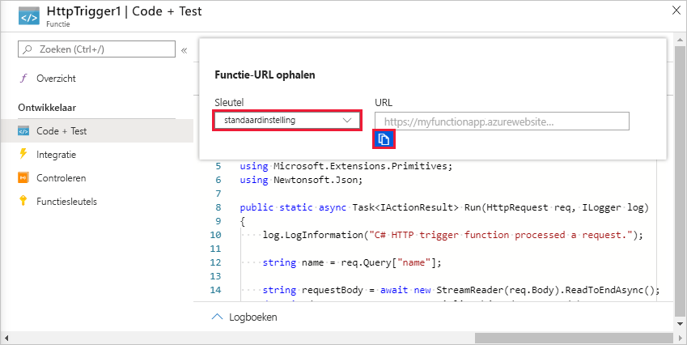
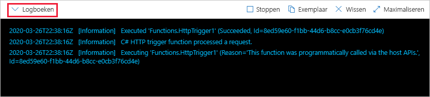

# Uw eerste functie maken in Azure Portal

Met Azure Functions kunt u uw code in een serverloze omgeving uitvoeren zonder dat u eerst een virtuele machine (VM) hoeft te maken of een webtoepassing moet publiceren. In dit artikel leert u hoe u Azure Functions kunt gebruiken om een ' Hallo wereld ' HTTP-trigger functie te maken in de Azure Portal.

[!INCLUDE [quickstarts-free-trial-note](../../includes/quickstarts-free-trial-note.md)]

Als u C#-ontwikkel aars bent, kunt u [uw eerste functie maken in Visual Studio 2019](functions-create-your-first-function-visual-studio.md) in plaats van in de portal. 

## Aanmelden bij Azure

Meld u aan bij de [Azure Portal](https://portal.azure.com) met uw Azure-account.

## Een functie-app maken

U moet een functie-app hebben die als host fungeert voor de uitvoering van uw functies. Met een functie-app kunt u functies groeperen als een logische eenheid, zodat u resources eenvoudiger kunt beheren, implementeren, schalen en delen.

[!INCLUDE [Create function app Azure portal](../../includes/functions-create-function-app-portal.md)]

Maak vervolgens een functie in de nieuwe functie-app.

## Een HTTP-trigger functie maken

1. Selecteer in het menu links van het venster **functies** de optie **functies**en selecteer vervolgens **toevoegen** in het bovenste menu. 
 
1. Selecteer **http-trigger**in het venster **nieuwe functie** .

    

1. Accepteer in het venster **nieuwe functie** de standaard naam voor de **nieuwe functie**of voer een nieuwe naam in. 

1. Kies **anoniem** in de vervolg keuzelijst **autorisatie niveau** en selecteer vervolgens **functie maken**.

    Azure maakt de HTTP-activerings functie. U kunt de nieuwe functie nu uitvoeren door een HTTP-aanvraag te verzenden.

## De functie testen

1. Selecteer in de nieuwe functie HTTP-trigger **code + test** in het menu links en selecteer **functie-URL ophalen** in het bovenste menu.

    

1. Selecteer in het dialoog venster **functie-URL ophalen** de optie **standaard** in de vervolg keuzelijst en selecteer vervolgens het pictogram **kopiëren naar klem bord** . 

    

1. Plak de URL van de functie in de adresbalk van uw browser. Voeg de query reeks waarde `?name=<your_name>` toe aan het einde van deze URL en druk op ENTER om de aanvraag uit te voeren. 

    Het volgende voorbeeld toont het antwoord in de browser:

    

    De aanvraag-URL bevat een sleutel die standaard is vereist, en waarmee u via HTTP toegang hebt tot de functie.

1. Wanneer uw functie wordt uitgevoerd, wordt traceringsinformatie naar de logboeken geschreven. Als u de uitvoer van de tracering wilt zien, gaat u terug naar de pagina **code en test** in de portal en vouwt u de pijl **Logboeken** onder aan de pagina uit.

   

## Resources opschonen

[!INCLUDE [Clean-up resources](../../includes/functions-quickstart-cleanup.md)]

## Volgende stappen

[!INCLUDE [Next steps note](../../includes/functions-quickstart-next-steps.md)]

