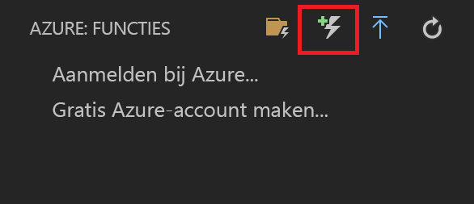
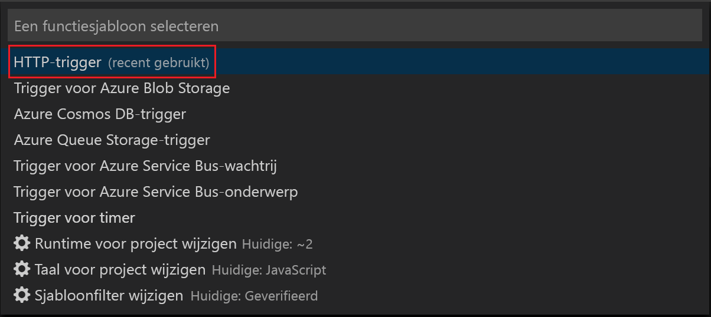
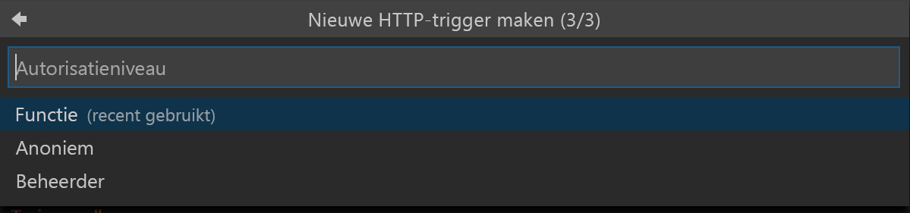
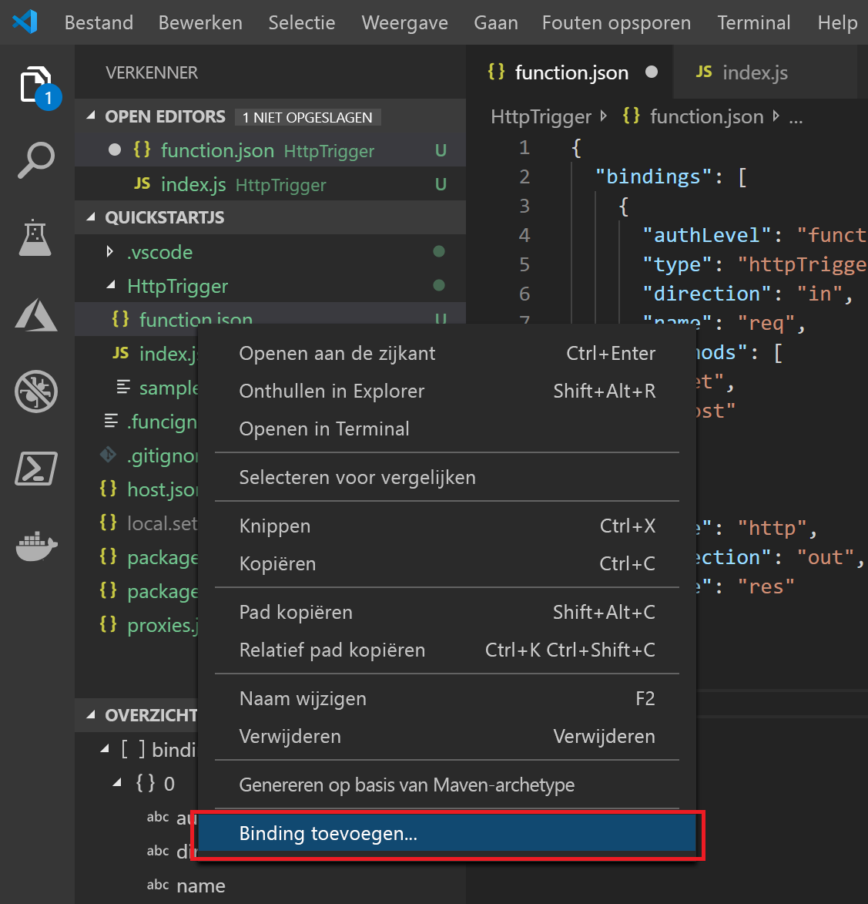
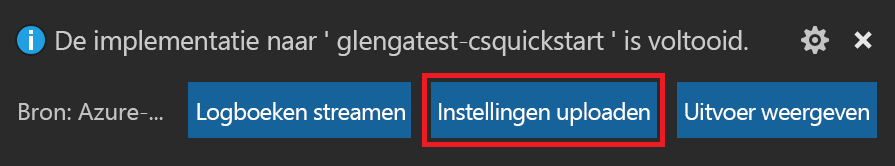
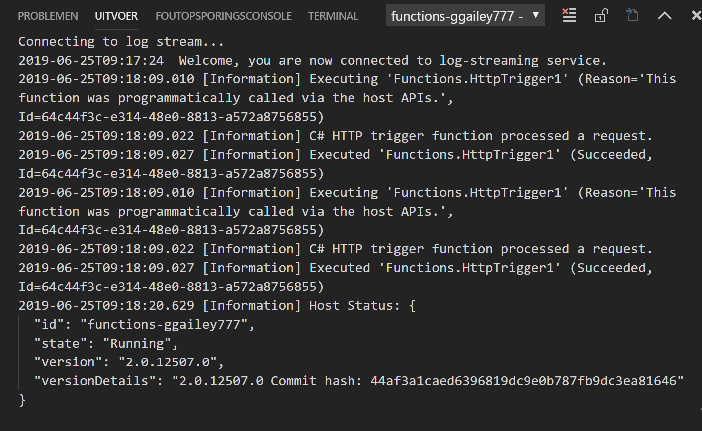

# <a name="develop-azure-functions-by-using-visual-studio-code"></a>Azure Functions ontwikkelen met Visual Studio code

Met de [Azure Functions extension for Visual Studio Code] kunt u op een lokale manier functies ontwikkelen en implementeren in Azure. Als deze ervaring uw eerste met Azure Functions is, kunt u meer te weten komen over [een inleiding tot Azure functions](functions-overview.md).

De uitbrei ding Azure Functions biedt de volgende voor delen:

* U kunt functies bewerken, bouwen en uitvoeren op uw lokale ontwikkel computer.
* Publiceer uw Azure Functions-project rechtstreeks naar Azure.
* Schrijf uw functies in verschillende talen en profiteer van de voor delen van Visual Studio code.

De uitbrei ding kan worden gebruikt in combi natie met de volgende talen, die worden ondersteund door de Azure Functions runtime, te beginnen met versie 2. x:

* [C#doorgestuurd](functions-dotnet-class-library.md)
* <sup></sup> [ C# script](functions-reference-csharp.md)*
* [JavaScript](functions-reference-node.md)
* [Java](functions-reference-java.md)
* [PowerShell](functions-reference-powershell.md)
* [Python](functions-reference-python.md)

<sup>*</sup> Hiervoor moet u [script C# instellen als de standaard taal van het project](#c-script-projects).

In dit artikel zijn voor beelden momenteel alleen beschikbaar voor Java script-functies (node. C# js) en klassen bibliotheek.  

In dit artikel vindt u informatie over het gebruik van de Azure Functions-extensie voor het ontwikkelen van functies en het publiceren ervan naar Azure. Voordat u dit artikel leest, moet u [uw eerste functie maken met Visual Studio code](functions-create-first-function-vs-code.md).

> [!IMPORTANT]
> Combi neer geen lokale ontwikkeling en ontwikkeling van de portal voor één functie-app. Wanneer u vanuit een lokaal project publiceert naar een functie-app, worden de functies die u in de portal hebt ontwikkeld, door het implementatie proces overschreven.

## <a name="prerequisites"></a>Vereisten

Voordat u [Azure functions]de uitbrei ding[Azure functions extensie voor Visual Studio code]installeert en uitvoert, moet u aan de volgende vereisten voldoen:

* [Visual Studio code](https://code.visualstudio.com/) die is geïnstalleerd op een van de [ondersteunde platforms](https://code.visualstudio.com/docs/supporting/requirements#_platforms).

* Een actief Azure-abonnement.

[!INCLUDE [quickstarts-free-trial-note](../../includes/quickstarts-free-trial-note.md)]

Andere resources die u nodig hebt, zoals een Azure-opslag account, worden in uw abonnement gemaakt wanneer u met [Visual Studio code publiceert](#publish-to-azure).

> [!IMPORTANT]
> U kunt functies lokaal ontwikkelen en deze publiceren naar Azure zonder ze lokaal te hoeven starten en uit te voeren. Als u uw functies lokaal wilt uitvoeren, moet u voldoen aan enkele aanvullende vereisten, met inbegrip van een automatische down load van Azure Functions Core Tools. Zie [aanvullende vereisten voor het lokaal uitvoeren van een project voor](#additional-requirements-for-running-a-project-locally)meer informatie.

[!INCLUDE [functions-install-vs-code-extension](../../includes/functions-install-vs-code-extension.md)]

## <a name="create-an-azure-functions-project"></a>Een Azure Functions-project maken

Met de functie-extensie kunt u een functie-app-project maken, samen met uw eerste functie. De volgende stappen laten zien hoe u een door HTTP geactiveerde functie maakt in een nieuw functions-project. [Http-trigger](functions-bindings-http-webhook.md) is de eenvoudigste functie trigger sjabloon om te demonstreren.

1. Selecteer in **Azure: functies**het pictogram **functie maken** :

    

1. Selecteer de map voor uw functie-app-project en **Selecteer vervolgens een taal voor uw functie project**.

1. Als u de kern Hulpprogramma's nog niet hebt geïnstalleerd, wordt u gevraagd om **een versie** van de kern Hulpprogramma's te selecteren die u wilt installeren. Kies versie 2. x of een nieuwere versie. 

1. Selecteer de sjabloon voor de **http-trigger** functie of selecteer **nu overs Laan** om een project zonder een functie te maken. U kunt later altijd [een functie toevoegen aan uw project](#add-a-function-to-your-project) .

    

1. Typ **HttpExample** voor de functie naam en selecteer ENTER, en selecteer vervolgens **functie** autorisatie. Voor dit autorisatie niveau moet u een [functie toets](functions-bindings-http-webhook.md#authorization-keys) opgeven wanneer u het eind punt van de functie aanroept.

    

    Er wordt een functie gemaakt in de taal die u hebt gekozen en in de sjabloon voor een door HTTP geactiveerde functie.

    

Met de project sjabloon maakt u een project in de taal die u hebt gekozen en installeert u de vereiste afhankelijkheden. Voor elke taal bevat het nieuwe project de volgende bestanden:

* **host. json**: Hiermee kunt u de host voor functies configureren. Deze instellingen zijn van toepassing wanneer u functies lokaal uitvoert en wanneer u ze in azure uitvoert. Zie voor meer informatie [host. json Reference](functions-host-json.md).

* **Local. settings. json**: onderhoudt de instellingen die worden gebruikt wanneer u functies lokaal uitvoert. Deze instellingen worden alleen gebruikt wanneer u functies lokaal uitvoert. Zie [Local Settings file](#local-settings-file)(Engelstalig) voor meer informatie.

    >[!IMPORTANT]
    >Omdat het bestand local. settings. json geheimen kan bevatten, moet u het uitsluiten van uw project broncode beheer.

U kunt nu invoer-en uitvoer bindingen aan uw functie toevoegen door [het function. JSON-bestand te wijzigen](#add-a-function-to-your-project) of door [een para meter toe te C# voegen aan een functie van een klassen bibliotheek](#add-a-function-to-your-project).

U kunt ook [een nieuwe functie toevoegen aan uw project](#add-a-function-to-your-project).

## <a name="install-binding-extensions"></a>Binding-extensies installeren

Met uitzonde ring van HTTP-en timer-triggers, worden bindingen geïmplementeerd in uitbreidings pakketten. U moet de uitbreidings pakketten installeren voor de triggers en bindingen die deze nodig hebben. Het proces voor het installeren van bindings uitbreidingen is afhankelijk van de taal van uw project.

# <a name="ctabcsharp"></a>[C\#](#tab/csharp)

Voer de [DotNet-opdracht add package](/dotnet/core/tools/dotnet-add-package) uit in het Terminal venster om de uitbreidings pakketten te installeren die u nodig hebt in uw project. Met de volgende opdracht wordt de extensie Azure Storage geïnstalleerd, waarmee bindingen voor blob-, wachtrij-en tabel opslag worden geïmplementeerd.

```bash
dotnet add package Microsoft.Azure.WebJobs.Extensions.Storage --version 3.0.4
```

# <a name="javascripttabnodejs"></a>[JavaScript](#tab/nodejs)

[!INCLUDE [functions-extension-bundles](../../includes/functions-extension-bundles.md)]

---

## <a name="add-a-function-to-your-project"></a>Een functie toevoegen aan uw project

U kunt een nieuwe functie toevoegen aan een bestaand project door een van de vooraf gedefinieerde functies trigger sjablonen te gebruiken. Als u een nieuwe functie trigger wilt toevoegen, selecteert u F1 om het opdracht palet te openen en zoekt en voert u de opdracht uit **Azure functions: Create-functie**. Volg de aanwijzingen om het trigger type te kiezen en definieer de vereiste kenmerken van de trigger. Als voor uw trigger een toegangs sleutel of connection string om verbinding te maken met een service, moet u dit doen voordat u de functie trigger maakt.

De resultaten van deze actie zijn afhankelijk van de taal van uw project:

# <a name="ctabcsharp"></a>[C\#](#tab/csharp)

Er wordt C# een nieuw Class Library-bestand (. cs) toegevoegd aan uw project.

# <a name="javascripttabnodejs"></a>[JavaScript](#tab/nodejs)

Er wordt een nieuwe map gemaakt in het project. De map bevat een nieuwe functie. JSON-bestand en het nieuwe Java script-code bestand.

---

## <a name="add-input-and-output-bindings"></a>Invoer-en uitvoer bindingen toevoegen

U kunt de functie uitbreiden door invoer-en uitvoer bindingen toe te voegen. Het proces voor het toevoegen van bindingen is afhankelijk van de taal van uw project. Zie [Azure functions triggers en bindingen](functions-triggers-bindings.md)voor meer informatie over bindingen.

In de volgende voor beelden wordt verbinding gemaakt met een opslag wachtrij met de naam `outqueue`, waarbij de connection string voor het opslag account is ingesteld in de instelling `MyStorageConnection` toepassing in lokale. settings. json.

# <a name="ctabcsharp"></a>[C\#](#tab/csharp)

Werk de functie methode bij om de volgende para meter toe te voegen aan de `Run` methode definitie:

```cs
[Queue("outqueue"),StorageAccount("MyStorageConnection")] ICollector<string> msg
```

Voor deze code moet u de volgende `using`-instructie toevoegen:

```cs
using Microsoft.Azure.WebJobs.Extensions.Storage;
```

De para meter `msg` is een `ICollector<T>` type dat een verzameling berichten vertegenwoordigt die naar een uitvoer binding worden geschreven wanneer de functie is voltooid. U voegt een of meer berichten aan de verzameling toe. Deze berichten worden verzonden naar de wachtrij wanneer de functie is voltooid.

Zie de documentatie voor de binding van de [wachtrij opslag](functions-bindings-storage-queue.md#output) voor meer informatie.

# <a name="javascripttabnodejs"></a>[JavaScript](#tab/nodejs)

Met Visual Studio code kunt u bindingen toevoegen aan uw function. JSON-bestand door een handige set prompts te volgen. Als u een binding wilt maken, klikt u met de rechter muisknop (CTRL + klik op macOS) op het bestand **Function. json** in de map function en selecteert u **binding toevoegen**:



Hieronder volgen enkele voor beelden van prompts voor het definiëren van een nieuwe opslag-uitvoer binding:

| Vraag | Waarde | Beschrijving |
| -------- | ----- | ----------- |
| **Bindings richting selecteren** | `out` | De binding is een uitvoer binding. |
| **Binding met richting selecteren** | `Azure Queue Storage` | De binding is een Azure Storage wachtrij binding. |
| **De naam die wordt gebruikt om deze binding in uw code aan te duiden** | `msg` | Naam die de bindings parameter identificeert waarnaar in uw code wordt verwezen. |
| **De wachtrij waarnaar het bericht wordt verzonden** | `outqueue` | De naam van de wachtrij waarnaar de binding wordt geschreven. Wanneer de *wachtrij* naam niet bestaat, wordt deze door de binding gemaakt bij het eerste gebruik. |
| **Selecteer de instelling in ' local. settings. json '** | `MyStorageConnection` | De naam van een toepassings instelling die de connection string voor het opslag account bevat. De instelling `AzureWebJobsStorage` bevat de connection string voor het opslag account dat u hebt gemaakt met de functie-app. |

In dit voor beeld wordt de volgende binding toegevoegd aan de matrix `bindings` in het bestand function. json:

```javascript
{
    "type": "queue",
    "direction": "out",
    "name": "msg",
    "queueName": "outqueue",
    "connection": "MyStorageConnection"
}
```

U kunt ook dezelfde bindings definitie rechtstreeks aan uw function. json toevoegen.

In de functie code wordt de binding van de `msg` geopend vanuit de `context`, zoals in dit voor beeld:

```javascript
context.bindings.msg = "Name passed to the function: " req.query.name;
```

Zie voor meer informatie de referentie voor de uitvoer van de [wachtrij opslag](functions-bindings-storage-queue.md#output) .

---

[!INCLUDE [Supported triggers and bindings](../../includes/functions-bindings.md)]

[!INCLUDE [functions-sign-in-vs-code](../../includes/functions-sign-in-vs-code.md)]

## <a name="publish-to-azure"></a>Publiceren naar Azure

Met Visual Studio code kunt u uw functions-project rechtstreeks naar Azure publiceren. In dit proces maakt u een functie-app en de bijbehorende resources in uw Azure-abonnement. De functie-app biedt een context waar u uw functies kunt uitvoeren. Het project wordt in uw Azure-abonnement verpakt en geïmplementeerd in de nieuwe functie-app.

Wanneer u vanuit Visual Studio code publiceert naar een nieuwe functie-app in azure, krijgt u een snelle functie-app maken en een geavanceerd pad. 

Wanneer u publiceert vanuit Visual Studio code, profiteert u van de technologie van de [zip-implementatie](functions-deployment-technologies.md#zip-deploy) . 

### <a name="quick-function-app-create"></a>Snelle functie-app maken

Wanneer u **+ nieuwe functie-app maken in azure kiest...** , genereert de extensie automatisch waarden voor de Azure-resources die nodig zijn voor uw functie-app. Deze waarden zijn gebaseerd op de naam van de functie-app die u kiest. Zie het [artikel Visual Studio code Quick](functions-create-first-function-vs-code.md#publish-the-project-to-azure)start (Engelstalig) voor een voor beeld van het gebruik van standaard om uw project te publiceren naar een nieuwe functie-app in Azure.

Als u expliciete namen voor de gemaakte resources wilt opgeven, moet u het pad Geavanceerd maken kiezen.

### <a name="enable-publishing-with-advanced-create-options"></a>Een project publiceren naar een nieuwe functie-app in azure met behulp van geavanceerde opties

Met de volgende stappen publiceert u uw project naar een nieuwe functie-app die is gemaakt met geavanceerde opties voor maken:

1. Selecteer in het gebied **Azure: functions** het pictogram **implementeren naar functie-app** .

    

1. Als u niet bent aangemeld, wordt u gevraagd u **aan te melden bij Azure**. U kunt ook **een gratis Azure-account maken**. Nadat u zich hebt aangemeld vanuit de browser, gaat u terug naar Visual Studio code.

1. Als u meerdere abonnementen hebt, **selecteert u een abonnement** voor de functie-app en selecteert u **+ nieuwe functie-app maken in Azure... _Geavanceerd_** . Met deze _Geavanceerde_ optie hebt u meer controle over de resources die u in azure maakt. 

1. Voer de volgende gegevens in om deze informatie op te geven:

    | Vraag | Waarde | Beschrijving |
    | ------ | ----- | ----------- |
    | Functie-app in azure selecteren | Nieuwe functie-app in azure maken | Typ bij de volgende prompt een wereld wijd unieke naam die uw nieuwe functie-app identificeert en selecteer vervolgens ENTER. Geldige tekens voor de naam van en functie-app zijn `a-z`, `0-9` en `-`. |
    | Selecteer een besturings systeem | Windows | De functie-app wordt uitgevoerd in Windows. |
    | Een hosting abonnement selecteren | Verbruiksabonnement | Er wordt een host gebruikt voor het gebruik van een serverloos [verbruiks abonnement](functions-scale.md#consumption-plan) . |
    | Selecteer een runtime voor uw nieuwe app | Uw project taal | De runtime moet overeenkomen met het project dat u wilt publiceren. |
    | Een resource groep selecteren voor nieuwe resources | Nieuwe resource groep maken | Typ bij de volgende prompt de naam van een resource groep, zoals `myResourceGroup`, en selecteer vervolgens ENTER. U kunt ook een bestaande resource groep selecteren. |
    | Een opslag account selecteren | Nieuw opslagaccount maken | Typ bij de volgende prompt een wereld wijd unieke naam voor het nieuwe opslag account dat wordt gebruikt door de functie-app en selecteer vervolgens ENTER. Namen van opslag accounts moeten tussen de 3 en 24 tekens lang zijn en mogen alleen cijfers en kleine letters bevatten. U kunt ook een bestaand account selecteren. |
    | Selecteer een locatie voor nieuwe resources | regio | Selecteer een locatie in een [regio](https://azure.microsoft.com/regions/) bij u in de buurt of in de buurt van andere services die door uw functies worden geopend. |

    Er wordt een melding weer gegeven nadat de functie-app is gemaakt en het implementatie pakket is toegepast. Selecteer **uitvoer weer geven** in deze melding om de resultaten voor het maken en implementeren weer te geven, inclusief de Azure-resources die u hebt gemaakt.

## <a name="republish-project-files"></a>Project bestanden opnieuw publiceren

Wanneer u [doorlopende implementatie](functions-continuous-deployment.md)instelt, wordt de functie-app in azure bijgewerkt wanneer de bron bestanden worden bijgewerkt op de verbonden bron locatie. We raden u aan continue implementatie aan te bevelen, maar u kunt ook de updates van het project bestand opnieuw publiceren vanuit Visual Studio code.

> [!IMPORTANT]
> Als u in een bestaande functie-app publiceert, wordt de inhoud van die app in Azure overschreven.

1. Selecteer in Visual Studio code F1 om het opdracht palet te openen. In het opdracht palet zoekt en selecteert u **Azure functions: implementeren naar functie-app**.

1. Als u niet bent aangemeld, wordt u gevraagd u **aan te melden bij Azure**. Nadat u zich hebt aangemeld vanuit de browser, gaat u terug naar Visual Studio code. Als u meerdere abonnementen hebt, **selecteert u een abonnement** dat uw functie-app bevat.

1. Selecteer uw bestaande functie-app in Azure. Wanneer u wordt gewaarschuwd over het overschrijven van alle bestanden in de functie-app, selecteert u **implementeren** om de waarschuwing te bevestigen en door te gaan.

Het project wordt opnieuw opgebouwd, opnieuw ingepakt en geüpload naar Azure. Het bestaande project wordt vervangen door het nieuwe pakket en de functie-app wordt opnieuw gestart.

## <a name="get-the-url-of-the-deployed-function"></a>De URL van de geïmplementeerde functie ophalen

Als u een door HTTP geactiveerde functie wilt aanroepen, hebt u de URL van de functie nodig wanneer deze wordt geïmplementeerd in uw functie-app. Deze URL bevat alle vereiste [functie sleutels](functions-bindings-http-webhook.md#authorization-keys). U kunt de extensie gebruiken om deze Url's op te halen voor uw geïmplementeerde functies.

1. Selecteer F1 om het opdracht palet te openen, zoek naar en voer de opdracht uit **Azure functions: URL van kopieer functie**.

1. Volg de aanwijzingen om uw functie-app in azure te selecteren en selecteer vervolgens de specifieke HTTP-trigger die u wilt aanroepen.

De functie-URL wordt gekopieerd naar het klem bord, samen met de vereiste sleutels die worden door gegeven door de `code` query-para meter. Gebruik een HTTP-hulp programma voor het verzenden van POST-aanvragen of een browser voor GET-aanvragen voor de externe functie.  

## <a name="run-functions-locally"></a>Functies lokaal uitvoeren

Met de uitbrei ding Azure Functions kunt u een functie project op uw lokale ontwikkel computer uitvoeren. De lokale runtime is dezelfde runtime die als host fungeert voor uw functie-app in Azure. Lokale instellingen worden gelezen uit het [bestand local. settings. json](#local-settings-file).

### <a name="additional-requirements-for-running-a-project-locally"></a>Aanvullende vereisten voor het lokaal uitvoeren van een project

Als u uw functions-project lokaal wilt uitvoeren, moet u aan deze aanvullende vereisten voldoen:

* Installeer versie 2. x of hoger van [Azure functions core tools](functions-run-local.md#v2). Het pakket met kern Hulpprogramma's wordt automatisch gedownload en geïnstalleerd wanneer u het project lokaal start. Kern Hulpprogramma's omvatten de volledige Azure Functions runtime, waardoor het downloaden en installeren kan enige tijd duren.

* Installeer de specifieke vereisten voor de taal van uw keuze:

    | Taal | Vereiste |
    | -------- | --------- |
    | **C#** | [C#switch](https://marketplace.visualstudio.com/items?itemName=ms-vscode.csharp)<br/>[.NET Core SLI-hulpprogram ma's](https://docs.microsoft.com/dotnet/core/tools/?tabs=netcore2x)   |
    | **Java** | [Fout opsporing voor Java-extensie](https://marketplace.visualstudio.com/items?itemName=vscjava.vscode-java-debug)<br/>[Java 8](https://aka.ms/azure-jdks)<br/>[Maven 3 of hoger](https://maven.apache.org/) |
    | **JavaScript** | [Node.js](https://nodejs.org/)<sup>*</sup> |  
    | **Python** | [Python-extensie](https://marketplace.visualstudio.com/items?itemName=ms-python.python)<br/>[Python 3.6.8](https://www.python.org/downloads/) aanbevolen|

    <sup>*</sup> Actieve LTS en onderhoud LTS-versies (8.11.1 en 10.14.1 aanbevolen).

### <a name="configure-the-project-to-run-locally"></a>Het project zodanig configureren dat het lokaal wordt uitgevoerd

In runtime van functions wordt een Azure Storage-account intern gebruikt voor alle trigger typen behalve HTTP en webhooks. Daarom moet u de **waarden. AzureWebJobsStorage** -sleutel instellen op een geldig Azure Storage account Connection String.

In deze sectie wordt gebruikgemaakt [van de Azure Storage extensie voor Visual Studio code](https://marketplace.visualstudio.com/items?itemName=ms-azuretools.vscode-azurestorage) met [Azure Storage Explorer](https://storageexplorer.com/) om verbinding te maken met de opslag Connection String en deze op te halen.

Het opslag account connection string instellen:

1. Open in Visual Studio **Cloud Explorer**, vouw het **opslag account** uit ** > uw opslag account**, selecteer **Eigenschappen** en kopieer de waarde van de **primaire verbindings reeks** .

2. Open in uw project het bestand local. settings. json en stel de waarde van de sleutel **AzureWebJobsStorage** in op de Connection String die u hebt gekopieerd.

3. Herhaal de vorige stap om unieke sleutels toe te voegen aan de matrix **waarden** voor andere verbindingen die uw functies vereisen.

Zie [Local Settings file](#local-settings-file)(Engelstalig) voor meer informatie.

### <a name="debugging-functions-locally"></a>Functies voor lokaal fouten opsporen  

Als u fouten wilt opsporen in uw functies, selecteert u F5. Als u de [kern hulpprogramma's][Azure functions core tools]nog niet hebt gedownload, wordt u gevraagd dit te doen. Wanneer de kern Hulpprogramma's zijn geïnstalleerd en worden uitgevoerd, wordt de uitvoer weer gegeven in de Terminal. Dit is hetzelfde als het uitvoeren van de `func host start`-kern Hulpprogramma's opdracht van de Terminal, maar met aanvullende build-taken en een bijgevoegde debugger.  

Wanneer het project wordt uitgevoerd, kunt u uw functies activeren zoals u dat zou doen wanneer het project wordt geïmplementeerd in Azure. Wanneer het project wordt uitgevoerd in de foutopsporingsmodus, worden onderbrekings punten in Visual Studio code bereikt, zoals verwacht.

De aanvraag-URL voor HTTP-triggers wordt weer gegeven in de uitvoer in de Terminal. Functie sleutels voor HTTP-triggers worden niet gebruikt wanneer een project lokaal wordt uitgevoerd. Zie [strategieën voor het testen van uw code in azure functions](functions-test-a-function.md)voor meer informatie.  

Zie [werken met Azure Functions Core Tools][Azure functions core tools]voor meer informatie.

[!INCLUDE [functions-local-settings-file](../../includes/functions-local-settings-file.md)]

Deze instellingen worden standaard niet automatisch gemigreerd wanneer het project wordt gepubliceerd naar Azure. Nadat het publiceren is voltooid, krijgt u de mogelijkheid om instellingen te publiceren van local. settings. json naar uw functie-app in Azure. Zie [Toepassings instellingen publiceren](#publish-application-settings)voor meer informatie.

Waarden in **Connections Tring** worden nooit gepubliceerd.

De waarden van de functie-toepassings instellingen kunnen ook in uw code worden gelezen als omgevings variabelen. Zie de secties omgevings variabelen van deze taalspecifieke referentie-artikelen voor meer informatie:

* [C#vooraf gecompileerde](functions-dotnet-class-library.md#environment-variables)
* [C# script (.csx)](functions-reference-csharp.md#environment-variables)
* [Java](functions-reference-java.md#environment-variables)
* [JavaScript](functions-reference-node.md#environment-variables)

## <a name="application-settings-in-azure"></a>Toepassings instellingen in azure

De instellingen in het bestand local. settings. json in uw project moeten hetzelfde zijn als de toepassings instellingen in de functie-app in Azure. Alle instellingen die u toevoegt aan local. settings. json moeten ook worden toegevoegd aan de functie-app in Azure. Deze instellingen worden niet automatisch geüpload wanneer u het project publiceert. Alle instellingen die u in de functie-app [in de portal](functions-how-to-use-azure-function-app-settings.md#settings) maakt, moeten ook worden gedownload naar uw lokale project.

### <a name="publish-application-settings"></a>Toepassings instellingen publiceren

De eenvoudigste manier om de vereiste instellingen naar uw functie-app in azure te publiceren, is de koppeling voor het **uploaden van instellingen** te gebruiken die wordt weer gegeven nadat u uw project hebt gepubliceerd:



U kunt instellingen ook publiceren met behulp van de opdracht **Azure functions: lokale instelling uploaden** in het opdracht palet. U kunt afzonderlijke instellingen toevoegen aan toepassings instellingen in azure met behulp van de opdracht **Azure functions: nieuwe instelling toevoegen** .

> [!TIP]
> Zorg ervoor dat u het bestand local. settings. json opslaat voordat u het publiceert.

Als het lokale bestand is versleuteld, wordt het gedecodeerd, gepubliceerd en opnieuw versleuteld. Als er instellingen zijn met conflicterende waarden op de twee locaties, wordt u gevraagd om te kiezen hoe u wilt door gaan.

Bekijk bestaande app-instellingen in het gebied **Azure: functions** door uw abonnement, uw functie-app en **Toepassings instellingen**uit te breiden.


### <a name="download-settings-from-azure"></a>Instellingen downloaden van Azure

Als u toepassings instellingen hebt gemaakt in azure, kunt u deze downloaden naar het bestand local. settings. json met behulp van de **Azure functions: opdracht externe instellingen downloaden** .

Net als bij het uploaden is het lokale bestand versleuteld, wordt het gedecodeerd, bijgewerkt en opnieuw versleuteld. Als er instellingen zijn met conflicterende waarden op de twee locaties, wordt u gevraagd om te kiezen hoe u wilt door gaan.

## <a name="monitoring-functions"></a>Bewakings functies

Wanneer u [functies lokaal uitvoert](#run-functions-locally), worden logboek gegevens naar de Terminal console gestreamd. U kunt ook logboek gegevens ophalen wanneer uw functions-project wordt uitgevoerd in een functie-app in Azure. U kunt verbinding maken met streaming-Logboeken in azure om bijna realtime logboek gegevens te bekijken, of u kunt Application Insights inschakelen voor een uitgebreidere uitleg over hoe de functie-app zich gedraagt.

### <a name="streaming-logs"></a>Streaming-logboeken

Wanneer u een toepassing ontwikkelt, is het vaak handig om logboek gegevens in vrijwel realtime weer te geven. U kunt een stroom weer geven van de logboek bestanden die worden gegenereerd door uw functies. Deze uitvoer is een voor beeld van streaming-logboeken voor een aanvraag naar een door HTTP geactiveerde functie:



Zie [streaming-logboeken](functions-monitoring.md#streaming-logs)voor meer informatie.

[!INCLUDE [functions-enable-log-stream-vs-code](../../includes/functions-enable-log-stream-vs-code.md)]

> [!NOTE]
> Streaming-logboeken bieden ondersteuning voor slechts één exemplaar van de functions-host. Wanneer de functie is geschaald naar meerdere instanties, worden gegevens uit andere instanties niet weer gegeven in de logboek stroom. [Live Metrics stream](../azure-monitor/app/live-stream.md) in Application Insights ondersteunt meerdere instanties. Daarnaast is streaming Analytics in vrijwel real time gebaseerd op de [voorbeeld gegevens](functions-monitoring.md#configure-sampling).

### <a name="application-insights"></a>Application Insights

We raden u aan de uitvoering van uw functies te bewaken door uw functie-app te integreren met Application Insights. Wanneer u een functie-app maakt in de Azure Portal, wordt deze integratie standaard uitgevoerd. Wanneer u de functie-app tijdens het publiceren van Visual Studio maakt, moet u Application Insights zelf integreren.

[!INCLUDE [functions-connect-new-app-insights.md](../../includes/functions-connect-new-app-insights.md)]

Zie [Azure functions bewaken](functions-monitoring.md)voor meer informatie.

## <a name="c-script-projects"></a>C\#-script projecten

Standaard worden alle C# projecten gemaakt als [ C# gecompileerde klassen bibliotheek projecten](functions-dotnet-class-library.md). Als u liever met C# script projecten wilt werken, moet u in plaats C# daarvan script selecteren als de standaard taal in de Azure functions extensie-instellingen:

1. Selecteer **bestands** > **voor keuren** > **instellingen**.

1. Ga naar **gebruikers instellingen** > **extensies** > **Azure functions**.

1. **C #-script** uit **Azure function selecteren: project taal**.

Nadat u deze stappen hebt voltooid, zijn de aanroepen van de onderliggende kern Hulpprogramma's voorzien van de `--csx` optie, C# waarmee script bestanden (. CSX) worden gegenereerd en gepubliceerd. Wanneer deze standaard taal is opgegeven, worden alle projecten die u standaard voor C# script projecten maakt. U wordt niet gevraagd om een project taal te kiezen wanneer een standaard waarde is ingesteld. Als u projecten in andere talen wilt maken, moet u deze instelling wijzigen of verwijderen uit het bestand gebruikers instellingen. json. Nadat u deze instelling hebt verwijderd, wordt u opnieuw gevraagd om uw taal te kiezen wanneer u een project maakt.

## <a name="command-palette-reference"></a>Naslag informatie voor het opdracht palet

De uitbrei ding Azure Functions biedt een handige grafische interface in het gebied voor interactie met uw functie-apps in Azure. Dezelfde functionaliteit is ook beschikbaar als opdrachten in het opdracht palet (F1). Deze Azure Functions-opdrachten zijn beschikbaar:

|Azure Functions opdracht  | Beschrijving  |
|---------|---------|
|**Nieuwe instellingen toevoegen**  |  Hiermee maakt u een nieuwe toepassings instelling in Azure. Zie [Toepassings instellingen publiceren](#publish-application-settings)voor meer informatie. Mogelijk moet u [deze instelling ook downloaden naar de lokale instellingen](#download-settings-from-azure). |
| **Implementatie bron configureren** | Verbindt uw functie-app in azure met een lokale Git-opslag plaats. Zie [continue implementatie voor Azure functions voor](functions-continuous-deployment.md)meer informatie. |
| **Verbinding maken met de GitHub-opslag plaats** | Verbindt uw functie-app met een GitHub-opslag plaats. |
| **Functie-URL kopiëren** | Hiermee wordt de externe URL opgehaald van een door HTTP geactiveerde functie die wordt uitgevoerd in Azure. Zie [de URL van de geïmplementeerde functie ophalen](#get-the-url-of-the-deployed-function)voor meer informatie. |
| **Functie-app maken in azure** | Hiermee maakt u een nieuwe functie-app in uw abonnement in Azure. Zie de sectie over het [publiceren naar een nieuwe functie-app in azure](#publish-to-azure)voor meer informatie.        |
| **Ontsleutelen van instellingen** | [Lokale instellingen](#local-settings-file) worden ontsleuteld die zijn versleuteld door **Azure functions: instellingen versleutelen**.  |
| **functie-app verwijderen** | Hiermee verwijdert u een functie-app uit uw abonnement in Azure. Als er geen andere apps in het App Service-abonnement zijn, krijgt u de mogelijkheid om die te verwijderen. Andere resources, zoals opslag accounts en resource groepen, worden niet verwijderd. Als u alle resources wilt verwijderen, moet u in plaats daarvan [de resource groep verwijderen](functions-add-output-binding-storage-queue-vs-code.md#clean-up-resources). Dit heeft geen invloed op uw lokale project. |
|**Functie verwijderen**  | Hiermee verwijdert u een bestaande functie uit een functie-app in Azure. Omdat deze verwijdering geen invloed heeft op uw lokale project, kunt u overwegen om de functie lokaal te verwijderen en vervolgens [het project opnieuw te publiceren](#republish-project-files). |
| **Proxy verwijderen** | Hiermee verwijdert u een Azure Functions proxy uit uw functie-app in Azure. Zie [werken met Azure functions-proxy's](functions-proxies.md)voor meer informatie over proxy's. |
| **Instelling verwijderen** | Hiermee verwijdert u een functie-app-instelling in Azure. Deze verwijdering heeft geen invloed op de instellingen in het bestand local. settings. json. |
| **Verbinding met opslag plaats verbreken**  | Hiermee verwijdert u de [continue implementatie](functions-continuous-deployment.md) verbinding tussen een functie-app in Azure en een bron beheer bibliotheek. |
| **Externe instellingen downloaden** | Hiermee worden de instellingen van de gekozen functie-app in azure gedownload naar het bestand local. settings. json. Als het lokale bestand is versleuteld, wordt het gedecodeerd, bijgewerkt en opnieuw versleuteld. Als er instellingen zijn met conflicterende waarden op de twee locaties, wordt u gevraagd om te kiezen hoe u wilt door gaan. Zorg ervoor dat u de wijzigingen in het bestand local. settings. json opslaat voordat u deze opdracht uitvoert. |
| **Instellingen bewerken** | Hiermee wijzigt u de waarde van een bestaande functie-app-instelling in Azure. Deze opdracht heeft geen invloed op de instellingen in het bestand local. settings. json.  |
| **Versleutelings instellingen** | Versleutelt afzonderlijke items in de `Values` matrix in de [lokale instellingen](#local-settings-file). In dit bestand wordt `IsEncrypted` ook ingesteld op `true`, waarmee wordt aangegeven dat de lokale runtime instellingen ontsleutelt voordat ze worden gebruikt. Lokale instellingen versleutelen om het risico van het lekken van waardevolle informatie te verminderen. In Azure worden toepassings instellingen altijd versleuteld opgeslagen. |
| **De functie nu uitvoeren** | Start hand matig een door een [Timer geactiveerde functie](functions-bindings-timer.md) in Azure. Deze opdracht wordt gebruikt voor het testen. Zie [hand matig een niet met http geactiveerde functie uitvoeren](functions-manually-run-non-http.md)voor meer informatie over het activeren van niet-HTTP-functies in Azure. |
| **Project initialiseren voor gebruik met VS-code** | Voegt de vereiste Visual Studio code-project bestanden toe aan een bestaand functions-project. Gebruik deze opdracht om te werken met een project dat u hebt gemaakt met behulp van kern Hulpprogramma's. |
| **Azure Functions Core Tools installeren of bijwerken** | Installeert of update [Azure functions core tools], die wordt gebruikt om functies lokaal uit te voeren. |
| **Opnieuw implementeren**  | Hiermee kunt u Project bestanden opnieuw implementeren vanuit een verbonden Git-opslag plaats naar een specifieke implementatie in Azure. Als u lokale updates opnieuw wilt publiceren vanuit Visual Studio code, [publiceert u het project opnieuw](#republish-project-files). |
| **Instellingen voor naam wijzigen** | Hiermee wijzigt u de sleutel naam van een bestaande functie-app-instelling in Azure. Deze opdracht heeft geen invloed op de instellingen in het bestand local. settings. json. Nadat u de naam van instellingen in azure hebt gewijzigd, moet u [deze wijzigingen downloaden naar het lokale project](#download-settings-from-azure). |
| **Opnieuw** | Hiermee wordt de functie-app in azure opnieuw gestart. Als u updates implementeert, wordt ook de functie-app opnieuw gestart. |
| **AzureWebJobsStorage instellen**| Hiermee stelt u de waarde van de `AzureWebJobsStorage` toepassings instelling. Deze instelling is vereist door Azure Functions. Het wordt ingesteld wanneer een functie-app wordt gemaakt in Azure. |
| **Beginnen** | Hiermee wordt een gestopt functie-app in azure gestart. |
| **Streaming-Logboeken starten** | Hiermee start u de streaming-logboeken voor de functie-app in Azure. Gebruik Streaming-logboeken tijdens het extern oplossen van problemen in azure als u logboek gegevens in vrijwel realtime wilt weer geven. Zie [streaming-logboeken](#streaming-logs)voor meer informatie. |
| **Tab** | Hiermee stopt u een functie-app die wordt uitgevoerd in Azure. |
| **Streaming-logboeken stoppen** | Stopt de streaming-logboeken voor de functie-app in Azure. |
| **Scha kelen als sleuf instelling** | Wanneer deze optie is ingeschakeld, zorgt u ervoor dat een toepassings instelling persistent is voor een bepaalde implementatie site. |
| **Azure Functions Core Tools verwijderen** | Hiermee verwijdert u Azure Functions Core Tools, wat vereist is voor de extensie. |
| **Lokale instellingen uploaden** | Uploadt instellingen van het bestand local. settings. json naar de gekozen functie-app in Azure. Als het lokale bestand is versleuteld, wordt het gedecodeerd, geüpload en opnieuw versleuteld. Als er instellingen zijn met conflicterende waarden op de twee locaties, wordt u gevraagd om te kiezen hoe u wilt door gaan. Zorg ervoor dat u de wijzigingen in het bestand local. settings. json opslaat voordat u deze opdracht uitvoert. |
| **Door voeren in GitHub weer geven** | Toont u de laatste door voering in een specifieke implementatie wanneer de functie-app is verbonden met een opslag plaats. |
| **Implementatie logboeken weer geven** | Toont de logboeken voor een specifieke implementatie naar de functie-app in Azure. |

## <a name="next-steps"></a>Volgende stappen

Zie [werken met Azure functions core tools](functions-run-local.md)voor meer informatie over Azure functions core tools.

Zie [Azure functions C# Naslag informatie voor ontwikkel aars](functions-dotnet-class-library.md)voor meer informatie over het ontwikkelen van functies als .net-klassen bibliotheken. Dit artikel bevat ook koppelingen naar voor beelden van het gebruik van kenmerken voor het declareren van de verschillende typen bindingen die door Azure Functions worden ondersteund.

[Azure Functions extension for Visual Studio Code]: https://marketplace.visualstudio.com/items?itemName=ms-azuretools.vscode-azurefunctions (Azure Functions-extensie voor Visual Studio Code)
[Azure Functions Core Tools]: functions-run-local.md
