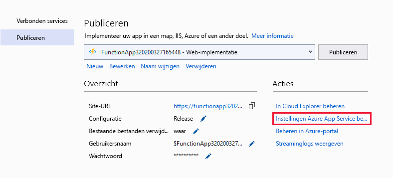

# <a name="develop-azure-functions-using-visual-studio"></a>Azure Functions ontwikkelen met Visual Studio  

Met Visual Studio u c#-klassebibliotheekfuncties ontwikkelen, testen en implementeren in Azure. Als deze ervaring de eerste is met Azure-functies, u meer informatie krijgen bij [Een inleiding tot Azure-functies](functions-overview.md).

Visual Studio biedt de volgende voordelen bij het ontwikkelen van uw functies: 

* Bewerk, bouw en voer functies uit op uw lokale ontwikkelingscomputer. 
* Publiceer uw Azure-functiesproject rechtstreeks naar Azure en maak indien nodig Azure-bronnen. 
* Gebruik C#-kenmerken om functiebindingen rechtstreeks in de C#-code te declareren.
* Ontwikkelen en implementeren van vooraf gecompileerde C#-functies. Vooraf vervulde functies bieden een betere koudestartprestaties dan c#script-gebaseerde functies. 
* Codeer uw functies in C# terwijl u alle voordelen van de ontwikkeling van Visual Studio hebt. 

In dit artikel vindt u informatie over het gebruik van Visual Studio om c#-klassebibliotheekfuncties te ontwikkelen en deze te publiceren naar Azure. Voordat u dit artikel leest, moet u de [functies snelstart voor Visual Studio](functions-create-your-first-function-visual-studio.md)voltooien. 

Tenzij anders vermeld, zijn procedures en voorbeelden voor Visual Studio 2019. 

## <a name="prerequisites"></a>Vereisten

Azure Functions Tools is opgenomen in de Azure-ontwikkelworkload van Visual Studio, te beginnen met Visual Studio 2017. Zorg ervoor dat u de **Azure-ontwikkelingswerkbelasting** opneemt in uw Visual Studio-installatie.

[!INCLUDE [quickstarts-free-trial-note](../../includes/quickstarts-free-trial-note.md)]

Andere resources die u nodig hebt, zoals een Azure Storage-account, worden tijdens het publicatieproces in uw abonnement gemaakt.

> [!NOTE]
> In Visual Studio 2017 installeert de Azure-ontwikkelworkload de Azure Functions Tools als een afzonderlijke extensie. Wanneer u uw Visual Studio 2017 bijwerkt, moet u er ook voor zorgen dat u de [meest recente versie](#check-your-tools-version) van de Azure Functions-hulpprogramma's gebruikt. In de volgende secties ziet u hoe u uw Azure Functions Tools-extensie controleren en (indien nodig) bijwerken in Visual Studio 2017. 
>
> Sla deze sectie over wanneer je Visual Studio 2019 gebruikt.

### <a name="check-your-tools-version-in-visual-studio-2017"></a><a name="check-your-tools-version"></a>Bekijk de versie van uw hulpprogramma's in Visual Studio 2017

1. Kies extensies en **updates**in het menu **Extra.** Vouw **geïnstalleerde** > **hulpprogramma's** uit en kies **Azure-functies en hulpprogramma's voor webtaken.**

    

1. Let op de geïnstalleerde **versie**. U deze versie vergelijken met de nieuwste versie [in de release notes.](https://github.com/Azure/Azure-Functions/blob/master/VS-AzureTools-ReleaseNotes.md) 

1. Als uw versie ouder is, werkt u uw hulpprogramma's in Visual Studio bij, zoals in de volgende sectie wordt weergegeven.

### <a name="update-your-tools-in-visual-studio-2017"></a>Uw hulpprogramma's bijwerken in Visual Studio 2017

1. Vouw in het dialoogvenster Extensies en updates **Visual** > **Studio Marketplace**uit, kies **Azure-functies en webtakenhulpprogramma's** en selecteer **Bijwerken**. **Extensions and Updates**

       

1. Nadat de hulpprogramma-update is gedownload, sluit u Visual Studio om de hulpprogramma-update te activeren met behulp van het VSIX-installatieprogramma.

1. Kies in het installatieprogramma **OK** om te starten en **wijzig vervolgens** om de hulpprogramma's bij te werken. 

1. Nadat de update is voltooid, kiest u Visual Studio **sluiten** en opnieuw starten.

> [!NOTE]  
> In Visual Studio 2019 en hoger wordt de extensie Azure Functions-hulpprogramma's bijgewerkt als onderdeel van Visual Studio.  

## <a name="create-an-azure-functions-project"></a>Een Azure Functions-project maken

[!INCLUDE [Create a project using the Azure Functions](../../includes/functions-vstools-create.md)]

De projectsjabloon maakt een C#-project, installeert het `Microsoft.NET.Sdk.Functions` NuGet-pakket en stelt het doelkader in. Het nieuwe project heeft de volgende bestanden:

* **host.json**: Hiermee u de host functies configureren. Deze instellingen zijn van toepassing zowel wanneer deze lokaal worden uitgevoerd als in Azure. Zie [host.json referentie voor](functions-host-json.md)meer informatie .

* **local.settings.json**: Hiermee worden instellingen onderhouden die worden gebruikt bij het lokaal uitvoeren van functies. Deze instellingen worden niet gebruikt bij het uitvoeren in Azure. Zie [Bestand Lokale instellingen](#local-settings-file)voor meer informatie .

    >[!IMPORTANT]
    >Omdat het bestand local.settings.json geheimen kan bevatten, moet u het uitsluiten van uw projectbronbeheer. De instelling **Kopiëren naar uitvoermap** voor dit bestand moet altijd **kopiëren als nieuwer**is. 

Zie [Functiewerk voor klassenbibliotheekproject Functies](functions-dotnet-class-library.md#functions-class-library-project)voor meer informatie .

[!INCLUDE [functions-local-settings-file](../../includes/functions-local-settings-file.md)]

Instellingen in local.settings.json worden niet automatisch geüpload wanneer u het project publiceert. Als u ervoor wilt zorgen dat deze instellingen ook bestaan in uw functie-app in Azure, moet u ze uploaden nadat u uw project hebt gepubliceerd. Zie [Instellingen van de functie-app](#function-app-settings)voor meer informatie .

Waarden in **ConnectionStrings** worden nooit gepubliceerd.

De instellingen waarden van de functie-app kunnen ook in uw code worden gelezen als omgevingsvariabelen. Zie [Omgevingsvariabelen voor](functions-dotnet-class-library.md#environment-variables)meer informatie .

## <a name="configure-the-project-for-local-development"></a>Het project configureren voor lokale ontwikkeling

De runtime Functies maakt intern gebruik van een Azure Storage-account. Voor alle andere triggertypen dan HTTP en webhooks moet u de sleutel **Values.AzureWebJobsStorage** instellen op een geldige tekenreeks voor azure-opslagaccountverbindingen. Uw functie-app kan ook de [Azure-opslagemulator](../storage/common/storage-use-emulator.md) gebruiken voor de **AzureWebJobsStorage-verbindingsinstelling** die vereist is voor het project. Als u de emulator wilt gebruiken, stelt `UseDevelopmentStorage=true`u de waarde van **AzureWebJobsStorage** in op . Wijzig deze instelling in een tekenreeks voor een daadwerkelijke opslagaccountverbinding voordat u wordt geïmplementeerd.

Ga als u de tekenreeks voor de verbinding met het opslagaccount in:

1. Open in Visual Studio **Cloud Explorer**, **Vouw Opslagaccount** > **uw opslagaccount**uit en kopieer vervolgens op het tabblad **Eigenschappen** de waarde **primaire verbindingstekenreeks.**

2. Open in uw project het bestand local.settings.json en stel de waarde van de **AzureWebJobsStorage-sleutel** in op de verbindingstekenreeks die u hebt gekopieerd.

3. Herhaal de vorige stap om unieke sleutels toe te voegen aan de array **Waarden** voor alle andere verbindingen die door uw functies worden vereist. 

## <a name="add-a-function-to-your-project"></a>Een functie toevoegen aan uw project

In de functies van de klasse C# worden de bindingen die door de functie worden gebruikt, gedefinieerd door kenmerken in de code toe te passen. Wanneer u de functietriggers maakt op basis van de meegeleverde sjablonen, worden de triggerkenmerken voor u toegepast. 

1. Klik in **Solution Explorer** met de rechtermuisknop op het projectknooppunt en selecteer  > **Nieuw item****Toevoegen**. Selecteer **Azure- functie,** typ een **naam** voor de klasse en klik op **Toevoegen**.

2. Kies uw trigger, stel de bindingseigenschappen in en klik op **Maken**. In het volgende voorbeeld worden de instellingen weergegeven bij het maken van een functie die wordt geactiveerd voor wachtrijopslag. 

    

    In dit triggervoorbeeld wordt een verbindingstekenreeks gebruikt met een sleutel met de naam **QueueStorage**. Deze verbindingstekenreeksinstelling moet worden gedefinieerd in het [bestand local.settings.json](functions-run-local.md#local-settings-file).

3. Bekijk de nieuw toegevoegde klasse. U ziet een statische **runmethode,** die wordt toegeschreven aan het kenmerk **FunctionName.** Dit kenmerk geeft aan dat de methode het ingangspunt voor de functie is.

    De volgende klasse C#vertegenwoordigt bijvoorbeeld een basisfunctie voor wachtrijopslag:

    ```csharp
    using System;
    using Microsoft.Azure.WebJobs;
    using Microsoft.Azure.WebJobs.Host;
    using Microsoft.Extensions.Logging;

    namespace FunctionApp1
    {
        public static class Function1
        {
            [FunctionName("QueueTriggerCSharp")]
            public static void Run([QueueTrigger("myqueue-items", 
                Connection = "QueueStorage")]string myQueueItem, ILogger log)
            {
                log.LogInformation($"C# Queue trigger function processed: {myQueueItem}");
            }
        }
    }
    ```

    Op elke bindingsparameter die aan de instappuntmethode wordt geleverd, wordt een bindingsspecifiek attribuut toegepast. Het kenmerk neemt de bindende informatie als parameters. In het vorige voorbeeld wordt bij de eerste parameter een kenmerk **QueueTrigger** toegepast, dat de functie wachtrijgeactiveerd aangeeft. De naam van de wachtrijnaam en verbindingstekenreeks wordt doorgegeven als parameters voor het kenmerk **QueueTrigger.** Zie [Azure Queue-opslagbindingen voor Azure-functies voor](functions-bindings-storage-queue-trigger.md)meer informatie.

U de bovenstaande procedure gebruiken om meer functies toe te voegen aan uw functie-app-project. Elke functie in het project kan een andere trigger hebben, maar een functie moet precies één trigger hebben. Zie [Azure Functions triggers and bindings concepts](functions-triggers-bindings.md)voor meer informatie.

## <a name="add-bindings"></a>Bindingen toevoegen

Net als bij triggers worden invoer- en uitvoerbindingen als bindende kenmerken aan uw functie toegevoegd. Bindingen als volgt aan een functie toevoegen:

1. Zorg ervoor dat u het project hebt [geconfigureerd voor lokale ontwikkeling.](#configure-the-project-for-local-development)

2. Voeg het juiste NuGet-uitbreidingspakket toe voor de specifieke binding. Zie [Local C# development met Visual Studio](./functions-bindings-register.md#local-csharp) in het artikel Triggers en Bindings voor meer informatie. De bindingsspecifieke NuGet-pakketvereisten zijn te vinden in het referentieartikel voor de binding. Zoek bijvoorbeeld pakketvereisten voor de trigger gebeurtenishubs in het [bindende referentieartikel Gebeurtenishubs](functions-bindings-event-hubs.md).

3. Als de binding nodig is, voegt u deze toe aan de verzameling **Waarden** in het [lokale instellingsbestand](functions-run-local.md#local-settings-file)als de binding deze nodig heeft. Deze waarden worden gebruikt wanneer de functie lokaal wordt uitgevoerd. Wanneer de functie wordt uitgevoerd in de functie-app in Azure, worden de instellingen van de [functie-app](#function-app-settings) gebruikt.

4. Voeg het juiste bindingskenmerk toe aan de methodehandtekening. In het volgende voorbeeld activeert een wachtrijbericht de functie en maakt de uitvoerbinding een nieuw wachtrijbericht met dezelfde tekst in een andere wachtrij.

    ```csharp
    public static class SimpleExampleWithOutput
    {
        [FunctionName("CopyQueueMessage")]
        public static void Run(
            [QueueTrigger("myqueue-items-source", Connection = "AzureWebJobsStorage")] string myQueueItem, 
            [Queue("myqueue-items-destination", Connection = "AzureWebJobsStorage")] out string myQueueItemCopy,
            ILogger log)
        {
            log.LogInformation($"CopyQueueMessage function processed: {myQueueItem}");
            myQueueItemCopy = myQueueItem;
        }
    }
    ```
   De verbinding met wachtrijopslag `AzureWebJobsStorage` wordt verkregen uit de instelling. Zie voor meer informatie het referentieartikel voor de specifieke binding. 

[!INCLUDE [Supported triggers and bindings](../../includes/functions-bindings.md)]

## <a name="testing-functions"></a>Functies testen

Met Azure Functions Core-hulpprogramma's kunt u Azure Functions-projecten uitvoeren op uw lokale ontwikkelcomputer. De eerste keer dat u een functie vanuit Visual Studio start, wordt u gevraagd deze hulpprogramma's te installeren.

Druk op F5 om de functie testen. Accepteer desgevraagd de aanvraag van Visual Studio om Azure Functions Core (CLI)-hulpprogramma's te downloaden en installeren. Mogelijk moet u ook een firewall-uitzondering inschakelen, zodat de hulpprogramma's HTTP-aanvragen kunnen afhandelen.

Als het project wordt uitgevoerd, u uw code testen zoals u de geïmplementeerde functie zou testen. Zie [Strategieën voor het testen van uw code in Azure-functies voor](functions-test-a-function.md)meer informatie. Wanneer u in de foutopsporingsmodus wordt uitgevoerd, worden breekpunten zoals verwacht geraakt in Visual Studio. 

<!---
For an example of how to test a queue triggered function, see the [queue triggered function quickstart tutorial](functions-create-storage-queue-triggered-function.md#test-the-function).  
-->

Zie [Azure-functies lokaal coderen en testen](functions-run-local.md)voor meer informatie over het gebruik van de Azure Functions Core Tools.

## <a name="publish-to-azure"></a>Publiceren naar Azure

Bij publicatie vanuit Visual Studio wordt een van de twee implementatiemethoden gebruikt:

* [Web Deploy:](functions-deployment-technologies.md#web-deploy-msdeploy)pakketten en implementeert Windows-apps op elke IIS-server.
* [Zip Deploy met Run-From-Package ingeschakeld:](functions-deployment-technologies.md#zip-deploy)aanbevolen voor Azure Functions-implementaties.

Gebruik de volgende stappen om uw project te publiceren naar een functie-app in Azure.

[!INCLUDE [Publish the project to Azure](../../includes/functions-vstools-publish.md)]

## <a name="function-app-settings"></a>Instellingen voor functie-app

Alle instellingen die u in de local.settings.json hebt toegevoegd, moeten ook worden toegevoegd aan de functie-app in Azure. Deze instellingen worden niet automatisch geüpload wanneer u het project publiceert.

De eenvoudigste manier om de vereiste instellingen naar uw functie-app in Azure te uploaden, is door de koppeling **Toepassingsinstellingen beheren te gebruiken...** die wordt weergegeven nadat u uw project hebt gepubliceerd.



Hiermee wordt het dialoogvenster **Toepassingsinstellingen** voor de functie-app weergegeven, waar u nieuwe toepassingsinstellingen toevoegen of bestaande instellingen wijzigen.


**Lokaal** vertegenwoordigt een instellingswaarde in het bestand local.settings.json en **Remote** is de huidige instelling in de functie-app in Azure.  Kies **Instelling toevoegen** om een nieuwe app-instelling te maken. Gebruik de **waarde Invoegen van de** koppeling Lokaal om een instellingswaarde naar het veld **Extern** te kopiëren. In afwachting van wijzigingen worden geschreven naar het lokale instellingenbestand en de functie-app wanneer u **OK**selecteert.

> [!NOTE]
> Standaard wordt het bestand local.settings.json niet ingecheckt in bronbeheer. Dit betekent dat wanneer u een lokaal project Functies kloont vanuit bronbeheer, het project geen bestand local.settings.json heeft. In dit geval moet u handmatig het bestand local.settings.json in de projecthoofdmap maken, zodat het dialoogvenster **Toepassingsinstellingen** werkt zoals verwacht. 

U toepassingsinstellingen ook op een van de volgende manieren beheren:

* [De Azure-portal gebruiken.](functions-how-to-use-azure-function-app-settings.md#settings)
* [De `--publish-local-settings` optie publiceren gebruiken in de Azure Functions Core Tools](functions-run-local.md#publish).
* [Met behulp van de Azure CLI](/cli/azure/functionapp/config/appsettings#az-functionapp-config-appsettings-set).

## <a name="monitoring-functions"></a>Bewakingsfuncties

De aanbevolen manier om de uitvoering van uw functies te controleren, is door uw functie-app te integreren met Azure Application Insights. Wanneer u een functie-app maakt in de Azure-portal, wordt deze integratie standaard voor u uitgevoerd. Wanneer u uw functie-app maakt tijdens het publiceren van Visual Studio, wordt de integratie in uw functie-app in Azure echter niet uitgevoerd.

Ga als eerste voor het inschakelen van Toepassingsinzichten voor uw functie-app:

[!INCLUDE [functions-connect-new-app-insights.md](../../includes/functions-connect-new-app-insights.md)]

Zie [Azure-functies controleren](functions-monitoring.md)voor meer informatie.

## <a name="next-steps"></a>Volgende stappen

Zie [Azure-functies lokaal coderen en testen](functions-run-local.md)voor meer informatie over de Core-hulpprogramma's voor Azure-functies.

Zie [Naslaginformatie over Azure Functions C#developer](functions-dotnet-class-library.md)voor meer informatie over het ontwikkelen van functies als .NET-klassenbibliotheken. In dit artikel wordt ook gekoppeld aan voorbeelden van het gebruik van kenmerken om de verschillende soorten bindingen te declareren die worden ondersteund door Azure-functies.    
