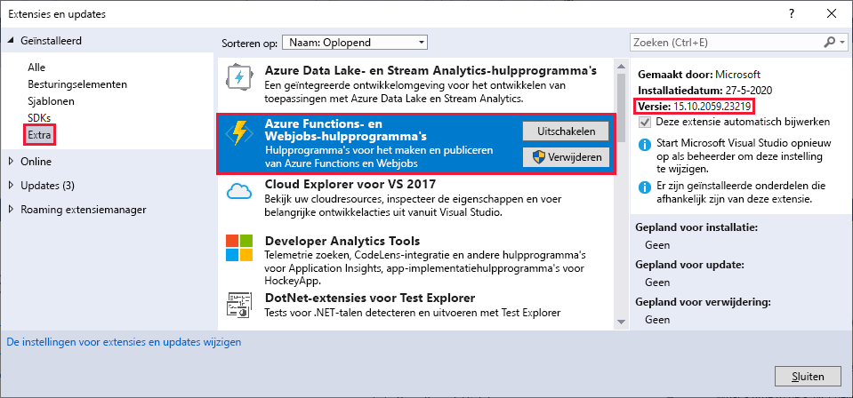
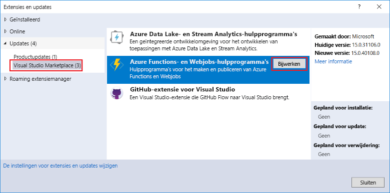
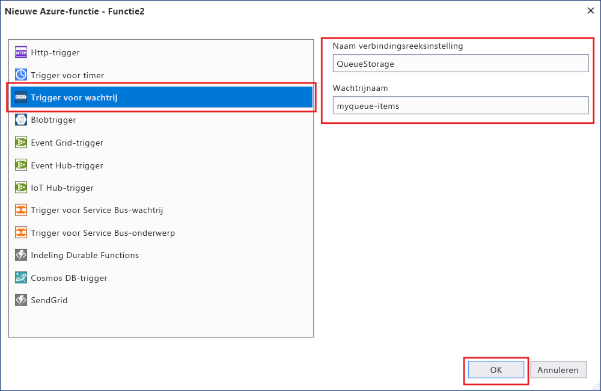
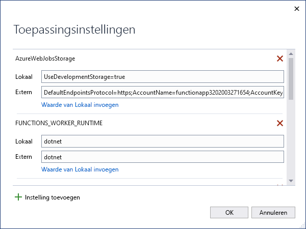

# <a name="develop-azure-functions-using-visual-studio"></a>Azure Functions ontwikkelen met Visual Studio  

Met Visual Studio kunt u C#-klassen bibliotheek functies ontwikkelen, testen en implementeren in Azure. Als deze ervaring uw eerste met Azure Functions is, raadpleegt [u een inleiding tot Azure functions](functions-overview.md).

Visual Studio biedt de volgende voor delen bij het ontwikkelen van uw functies: 

* U kunt functies bewerken, bouwen en uitvoeren op uw lokale ontwikkel computer. 
* Publiceer uw Azure Functions-project rechtstreeks naar Azure en maak indien nodig Azure-resources. 
* Gebruik C#-kenmerken om functie bindingen rechtstreeks in de C#-code te declareren.
* Ontwikkel en implementeer vooraf gecompileerde C#-functies. De vooraf vervulde functies bieden betere prestaties van het koude-start dan op C#-script gebaseerde functies. 
* Codeer uw functies in C# terwijl u alle voor delen van Visual Studio-ontwikkeling hebt. 

In dit artikel vindt u informatie over het gebruik van Visual Studio voor het ontwikkelen van C#-klassen bibliotheek functies en het publiceren ervan naar Azure. Voordat u dit artikel leest, kunt u de [Snelstartgids voor Visual Studio](functions-create-your-first-function-visual-studio.md)volt ooien. 

Tenzij anders aangegeven, worden de procedures en voor beelden weer gegeven voor Visual Studio 2019. 

## <a name="prerequisites"></a>Vereisten

- Azure Functions-Hulpprogram Ma's. Als u Azure function tools wilt toevoegen, moet u de werk belasting voor **Azure Development** in uw Visual Studio-installatie. Azure Functions-Hulpprogram Ma's zijn beschikbaar in de Azure Development-workload, te beginnen met Visual Studio 2017.

- Andere resources die u nodig hebt, zoals een Azure Storage account, worden tijdens het publicatie proces in uw abonnement gemaakt.

- [!INCLUDE [quickstarts-free-trial-note](../../includes/quickstarts-free-trial-note.md)]

> [!NOTE]
> In Visual Studio 2017 installeert de werk belasting Azure Development Azure Functions-Hulpprogram Ma's als een afzonderlijke extensie. Wanneer u de installatie van Visual Studio 2017 bijwerkt, moet u ervoor zorgen dat u de [meest recente versie](#check-your-tools-version) van de Azure functions-hulpprogram ma's gebruikt. In de volgende secties ziet u hoe u de extensie van de Azure Functions-Hulpprogram Ma's in Visual Studio 2017 kunt controleren en (indien nodig) bijwerken. 
>
> Sla deze secties over als u Visual Studio 2019 gebruikt.

### <a name="check-your-tools-version-in-visual-studio-2017"></a><a name="check-your-tools-version"></a>Controleer de versie van uw hulpprogram ma's in Visual Studio 2017

1. Kies in het menu **extra** de optie **extensies en updates**. Vouw **geïnstalleerde**  >  **hulpprogram ma's**uit en kies **Azure functions en hulpprogram ma's voor webjobs**.

    

1. Noteer de geïnstalleerde **versie** en vergelijk deze versie met de meest recente versie die wordt vermeld in de [release opmerkingen](https://github.com/Azure/Azure-Functions/blob/master/VS-AzureTools-ReleaseNotes.md). 

1. Als uw versie ouder is, werkt u de hulpprogram ma's in Visual Studio bij, zoals wordt weer gegeven in de volgende sectie.

### <a name="update-your-tools-in-visual-studio-2017"></a>Werk uw hulpprogram ma's bij in Visual Studio 2017

1. Vouw in het dialoog venster **extensies en updates** het onderdeel **updates**  >  **Visual Studio Marketplace**uit, kies **Azure functions en hulpprogram ma's voor webjobs** en selecteer **bijwerken**.

       

1. Nadat de hulpprogram ma's update is gedownload, selecteert u **sluiten**en sluit u Visual Studio om de hulpprogram ma's bijwerken met VSIX Installer te activeren.

1. Kies in VSIX Installer **wijzigen** om de hulpprogram ma's bij te werken. 

1. Nadat de update is voltooid, kiest u **sluiten**en start u Visual Studio opnieuw.

> [!NOTE]  
> In Visual Studio 2019 en hoger wordt de uitbrei ding Azure Functions tools bijgewerkt als onderdeel van Visual Studio.  

## <a name="create-an-azure-functions-project"></a>Een Azure Functions-project maken

[!INCLUDE [Create a project using the Azure Functions](../../includes/functions-vstools-create.md)]

Nadat u een Azure Functions project hebt gemaakt, maakt de project sjabloon een C#-project, installeert het `Microsoft.NET.Sdk.Functions` NuGet-pakket en stelt het doel raamwerk in. Het nieuwe project heeft de volgende bestanden:

* **host.jsop**: Hiermee kunt u de functie host configureren. Deze instellingen zijn van toepassing op zowel lokaal als in Azure. Zie [host.jsop referentie](functions-host-json.md)voor meer informatie.

* **local.settings.jsop**: onderhoudt de instellingen die worden gebruikt bij het lokaal uitvoeren van functies. Deze instellingen worden niet gebruikt wanneer ze worden uitgevoerd in Azure. Zie [Local Settings file](#local-settings-file)(Engelstalig) voor meer informatie.

    >[!IMPORTANT]
    >Omdat de local.settings.jsin het bestand geheimen kan bevatten, moet u dit uitsluiten van uw project broncode beheer. Zorg ervoor dat de instelling **kopiëren naar uitvoer Directory** voor dit bestand is ingesteld op **kopiëren indien nieuwer**. 

Zie voor meer informatie [functions Class Library project](functions-dotnet-class-library.md#functions-class-library-project).

[!INCLUDE [functions-local-settings-file](../../includes/functions-local-settings-file.md)]

Visual Studio uploadt de instellingen in local.settings.jsniet automatisch wanneer u het project publiceert. Als u er zeker van wilt zijn dat deze instellingen ook in uw functie-app in azure voor komen, moet u deze uploaden nadat u uw project hebt gepubliceerd. Zie voor meer informatie [functie-app-instellingen](#function-app-settings). De waarden in een `ConnectionStrings` verzameling worden nooit gepubliceerd.

Uw code kan ook de waarden van de functie-app-instellingen lezen als omgevings variabelen. Zie [omgevings variabelen](functions-dotnet-class-library.md#environment-variables)voor meer informatie.

## <a name="configure-the-project-for-local-development"></a>Het project voor lokale ontwikkeling configureren

De functions runtime maakt intern gebruik van een Azure Storage-account. Voor alle trigger typen behalve HTTP en webhooks, stelt u de `Values.AzureWebJobsStorage` sleutel in op een geldige Azure Storage-account Connection String. De functie-app kan ook de [Azure-opslag emulator](../storage/common/storage-use-emulator.md) gebruiken voor de `AzureWebJobsStorage` verbindings instelling die door het project wordt vereist. Als u de emulator wilt gebruiken, stelt u de waarde `AzureWebJobsStorage` in op `UseDevelopmentStorage=true` . Wijzig deze instelling in een werkelijk opslag account connection string vóór de implementatie.

Het opslag account connection string instellen:

1. Selecteer in Visual Studio **View**  >  **Cloud Explorer**weer geven.

2. Vouw in **Cloud Explorer** **opslag accounts**uit en selecteer vervolgens uw opslag account. Op het tabblad **Eigenschappen** kopieert u de waarde van de **primaire verbindings reeks** .

2. Open in uw project de local.settings.jsin het bestand en stel de waarde van de `AzureWebJobsStorage` sleutel in op de Connection String die u hebt gekopieerd.

3. Herhaal de vorige stap om unieke sleutels toe te voegen aan de `Values` matrix voor andere verbindingen die uw functies nodig hebben. 

## <a name="add-a-function-to-your-project"></a>Een functie toevoegen aan uw project

In C#-klassen bibliotheek functies worden de bindingen die worden gebruikt door de functie gedefinieerd door het Toep assen van kenmerken in de code. Wanneer u de functie triggers maakt op basis van de beschik bare sjablonen, worden de trigger kenmerken voor u toegepast. 

1. Klik in **Solution Explorer**met de rechter muisknop op het project knooppunt en selecteer **Add**  >  **Nieuw item**toevoegen. 

2. Selecteer **Azure function**, voer een **naam** in voor de klasse en selecteer vervolgens **toevoegen**.

3. Kies uw trigger, stel de bindings eigenschappen in en selecteer **OK**. In het volgende voor beeld ziet u de instellingen voor het maken van een wachtrij opslag trigger functie. 

    

    In deze trigger wordt een connection string gebruikt met een sleutel met de naam `QueueStorage` . Definieer deze connection string-instelling in de [local.settings.jsvoor het bestand](functions-run-local.md#local-settings-file).

4. Bekijk de zojuist toegevoegde klasse. U ziet een statische `Run()` methode die is voorzien van het `FunctionName` kenmerk. Dit kenmerk geeft aan dat de methode het toegangs punt voor de functie is.

    De volgende C#-klasse vertegenwoordigt bijvoorbeeld een eenvoudige functie voor wachtrij opslag:

    ```csharp
    using System;
    using Microsoft.Azure.WebJobs;
    using Microsoft.Azure.WebJobs.Host;
    using Microsoft.Extensions.Logging;

    namespace FunctionApp1
    {
        public static class Function1
        {
            [FunctionName("QueueTriggerCSharp")]
            public static void Run([QueueTrigger("myqueue-items", 
                Connection = "QueueStorage")]string myQueueItem, ILogger log)
            {
                log.LogInformation($"C# Queue trigger function processed: {myQueueItem}");
            }
        }
    }
    ```

Er wordt een binding-specifiek kenmerk toegepast op elke bindings parameter die is opgegeven voor de toegangs punt methode. Het kenmerk neemt de bindings gegevens op als para meters. In het vorige voor beeld is voor de eerste para meter een `QueueTrigger` kenmerk toegepast, dat aangeeft dat de functie voor de opslag van een wachtrij is ingeschakeld. De naam van de wachtrij en de connection string instelling worden door gegeven als para meters aan het `QueueTrigger` kenmerk. Zie [Azure Queue-opslag bindingen voor Azure functions](functions-bindings-storage-queue-trigger.md)voor meer informatie.

Gebruik de bovenstaande procedure om meer functies aan uw functie-app-project toe te voegen. Elke functie in het project kan een andere trigger hebben, maar een functie moet precies één trigger hebben. Zie [Azure functions triggers en bindingen concepten](functions-triggers-bindings.md)voor meer informatie.

## <a name="add-bindings"></a>Bindingen toevoegen

Net als bij triggers worden de invoer-en uitvoer bindingen aan uw functie toegevoegd als bindings kenmerken. Voeg als volgt bindingen toe aan een functie:

1. Zorg ervoor dat u [het project hebt geconfigureerd voor lokale ontwikkeling](#configure-the-project-for-local-development).

2. Voeg het juiste NuGet-extensie pakket toe voor de specifieke binding. 

   Zie [C# class library with Visual Studio](./functions-bindings-register.md#local-csharp)(Engelstalig) voor meer informatie. Zoek de binding-specifieke NuGet-pakket vereisten in het referentie artikel voor de binding. U kunt bijvoorbeeld pakket vereisten voor de trigger Event Hubs vinden in het [artikel over het event hubs binden van bindingen](functions-bindings-event-hubs.md).

3. Als er app-instellingen zijn die aan de binding moeten worden toegevoegd, voegt u deze toe aan de `Values` verzameling in het [lokale instellings bestand](functions-run-local.md#local-settings-file). 

   De functie gebruikt deze waarden wanneer deze lokaal wordt uitgevoerd. Wanneer de functie wordt uitgevoerd in de functie-app in azure, worden de instellingen van de [functie-app](#function-app-settings)gebruikt.

4. Voeg het juiste bindings kenmerk toe aan de hand tekening van de methode. In het volgende voor beeld wordt met een wachtrij bericht de functie geactiveerd en wordt met de uitvoer binding een nieuw wachtrij bericht gemaakt met dezelfde tekst in een andere wachtrij.

    ```csharp
    public static class SimpleExampleWithOutput
    {
        [FunctionName("CopyQueueMessage")]
        public static void Run(
            [QueueTrigger("myqueue-items-source", Connection = "AzureWebJobsStorage")] string myQueueItem, 
            [Queue("myqueue-items-destination", Connection = "AzureWebJobsStorage")] out string myQueueItemCopy,
            ILogger log)
        {
            log.LogInformation($"CopyQueueMessage function processed: {myQueueItem}");
            myQueueItemCopy = myQueueItem;
        }
    }
    ```
   De verbinding met de wachtrij opslag wordt opgehaald van de `AzureWebJobsStorage` instelling. Zie het naslag artikel voor de specifieke binding voor meer informatie. 

[!INCLUDE [Supported triggers and bindings](../../includes/functions-bindings.md)]

## <a name="testing-functions"></a>Functies testen

Met Azure Functions Core-hulpprogramma's kunt u Azure Functions-projecten uitvoeren op uw lokale ontwikkelcomputer. Zie [werken met Azure functions core tools](functions-run-local.md)voor meer informatie. De eerste keer dat u een functie vanuit Visual Studio start, wordt u gevraagd deze hulpprogram ma's te installeren. 

U kunt als volgt uw functie testen in Visual Studio:

1. Druk op F5. Accepteer desgevraagd de aanvraag van Visual Studio om Azure Functions Core (CLI)-hulpprogramma's te downloaden en installeren. Mogelijk moet u ook een firewall-uitzondering inschakelen, zodat de hulpprogramma's HTTP-aanvragen kunnen afhandelen.

2. Wanneer het project wordt uitgevoerd, test u de code zoals u een geïmplementeerde functie zou testen. 

   Zie [strategieën voor het testen van uw code in azure functions](functions-test-a-function.md)voor meer informatie. Wanneer u Visual Studio in de foutopsporingsmodus uitvoert, worden onderbrekings punten op de verwachte wijze bereikt.

<!---
For an example of how to test a queue triggered function, see the [queue triggered function quickstart tutorial](functions-create-storage-queue-triggered-function.md#test-the-function).  
-->


## <a name="publish-to-azure"></a>Publiceren naar Azure

Wanneer u vanuit Visual Studio publiceert, worden er twee implementatie methoden gebruikt:

* [Web Deploy](functions-deployment-technologies.md#web-deploy-msdeploy): pakketten en implementeert Windows-apps op elke IIS-server.
* [Zip-implementatie met uitvoeren vanaf pakket ingeschakeld](functions-deployment-technologies.md#zip-deploy): aanbevolen voor Azure functions implementaties.

Gebruik de volgende stappen om uw project te publiceren naar een functie-app in Azure.

[!INCLUDE [Publish the project to Azure](../../includes/functions-vstools-publish.md)]

## <a name="function-app-settings"></a>Instellingen voor functie-app

Omdat Visual Studio deze instellingen niet automatisch uploadt wanneer u het project publiceert, moeten de instellingen die u toevoegt in het local.settings.jsop u ook worden toegevoegd aan de functie-app in Azure.

De eenvoudigste manier om de vereiste instellingen te uploaden naar uw functie-app in Azure is door de koppeling **Azure app service instellingen beheren** te selecteren die wordt weer gegeven nadat u uw project hebt gepubliceerd.

:::image type="content" source="./media/functions-develop-vs/functions-vstools-app-settings.png" alt-text="Instellingen in het venster publiceren":::

Als u deze koppeling selecteert, wordt het dialoog venster **Toepassings instellingen** weer gegeven voor de functie-app, waar u nieuwe toepassings instellingen kunt toevoegen of bestaande wijzigen.



**Lokale** geeft een instellings waarde in de local.settings.jsop bestand, en op **afstand** wordt een huidige instellings waarde weer gegeven in de functie-app in Azure. Kies **instelling toevoegen** om een nieuwe app-instelling te maken. Gebruik de **waarde invoegen uit lokale** koppeling om een instellings waarde naar het **externe** veld te kopiëren. Wijzigingen in behandeling worden naar het lokale instellingen bestand en de functie-app geschreven wanneer u **OK**selecteert.

> [!NOTE]
> De local.settings.jsin het bestand is standaard niet ingecheckt in broncode beheer. Dit betekent dat als u een project van een lokale functie kloont van broncode beheer, het project geen local.settings.jsheeft voor het bestand. In dit geval moet u de local.settings.jsin het bestand hand matig maken in de hoofdmap van het project, zodat het dialoog venster **Toepassings instellingen** werkt zoals verwacht. 

U kunt ook toepassings instellingen op een van de volgende manieren beheren:

* [Gebruik de Azure Portal](functions-how-to-use-azure-function-app-settings.md#settings).
* [Gebruik de `--publish-local-settings` optie publiceren in de Azure functions core tools](functions-run-local.md#publish).
* [Gebruik de Azure cli](/cli/azure/functionapp/config/appsettings#az-functionapp-config-appsettings-set).

## <a name="monitoring-functions"></a>Functies bewaken

De aanbevolen manier om de uitvoering van uw functies te controleren is door uw functie-app te integreren met Azure-toepassing Insights. Wanneer u een functie-app maakt in de Azure Portal, wordt deze integratie standaard voor u uitgevoerd. Wanneer u echter uw functie-app tijdens het publiceren van Visual Studio maakt, wordt de integratie in uw functie-app in azure niet uitgevoerd.

[!INCLUDE [functions-connect-new-app-insights.md](../../includes/functions-connect-new-app-insights.md)]

Zie [Azure functions bewaken](functions-monitoring.md)voor meer informatie.

## <a name="next-steps"></a>Volgende stappen

Zie [werken met Azure functions core tools](functions-run-local.md)voor meer informatie over de Azure functions core tools.

Zie voor meer informatie over het ontwikkelen van functies als .NET-klassen bibliotheek [Azure functions C# Naslag informatie voor ontwikkel aars](functions-dotnet-class-library.md). In dit artikel vindt u ook koppelingen naar voor beelden van het gebruik van kenmerken voor het declareren van de verschillende typen bindingen die door Azure Functions worden ondersteund.    
