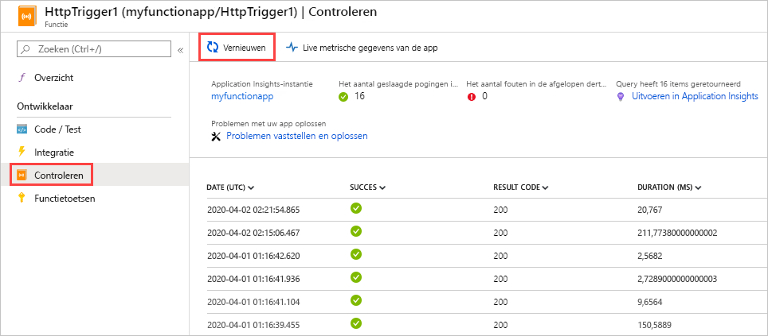
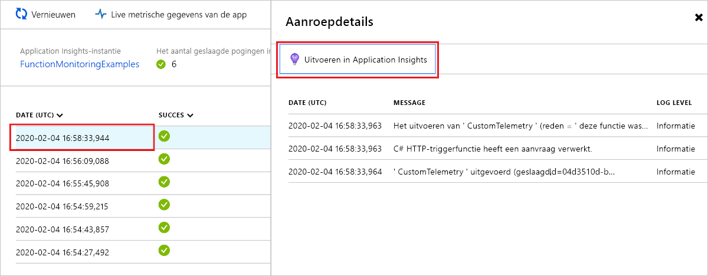
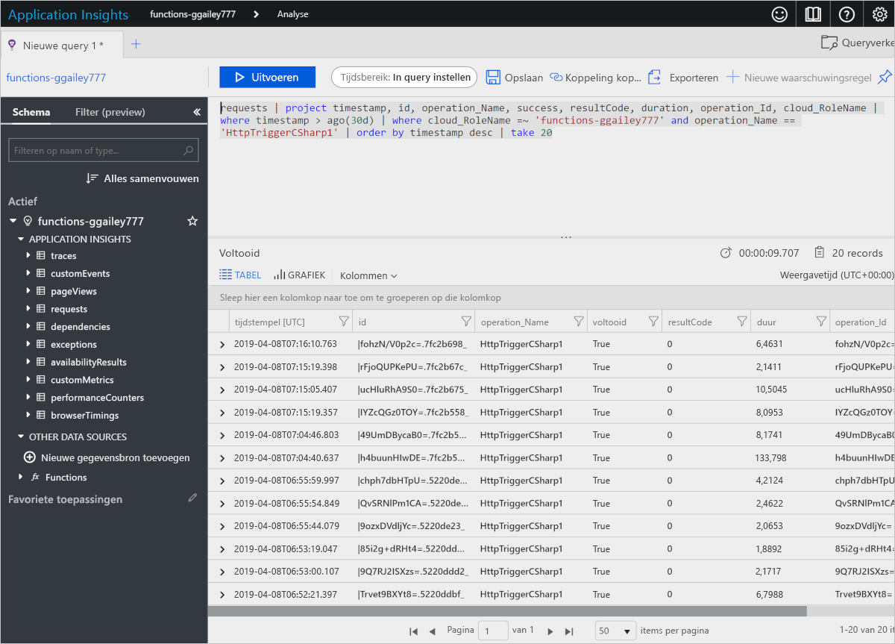
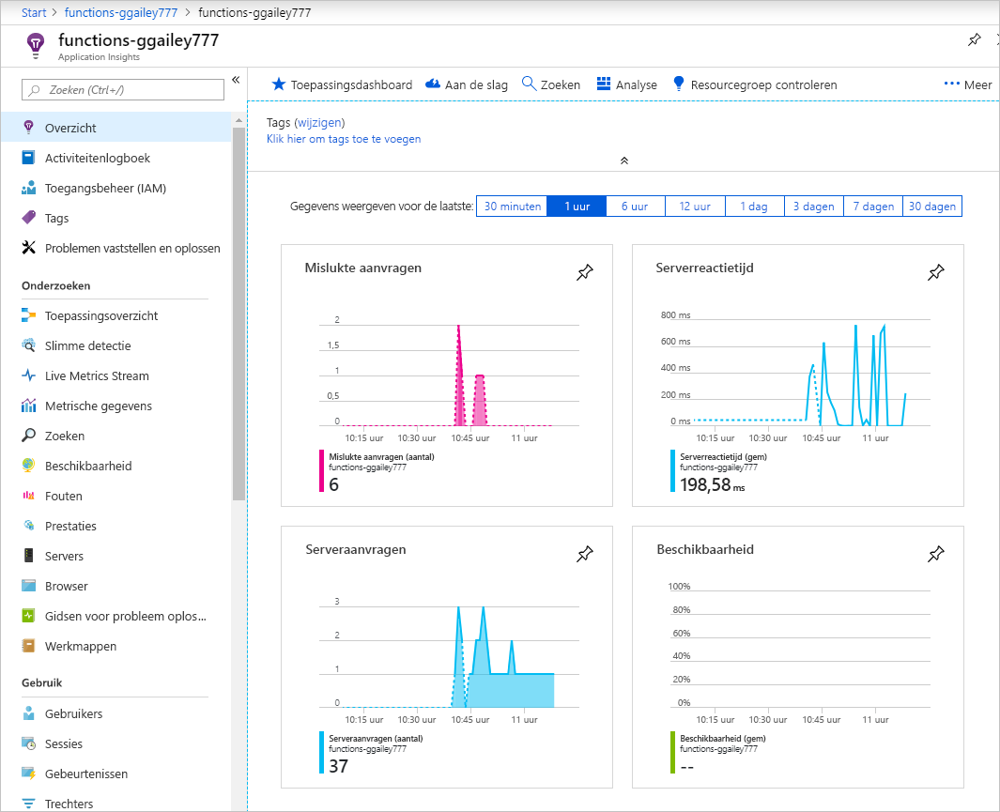
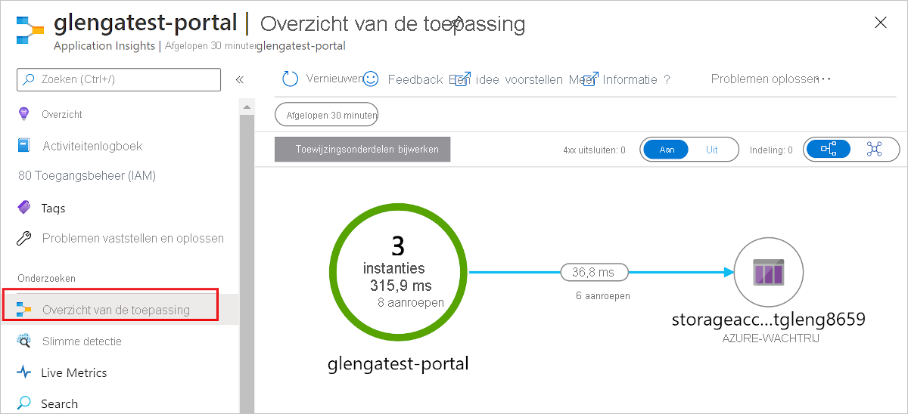
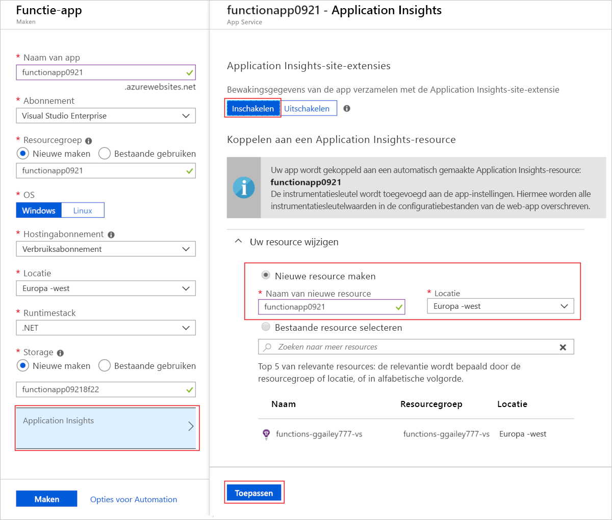
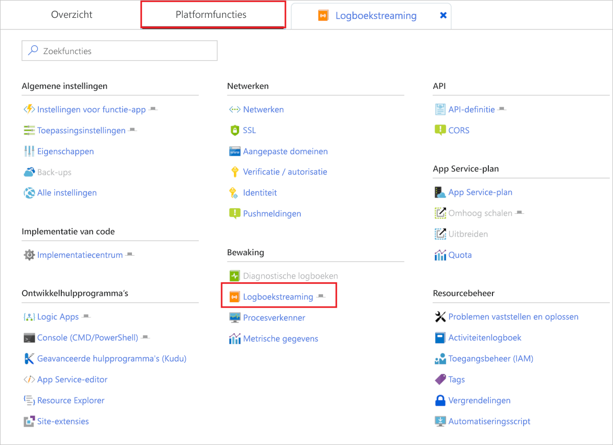
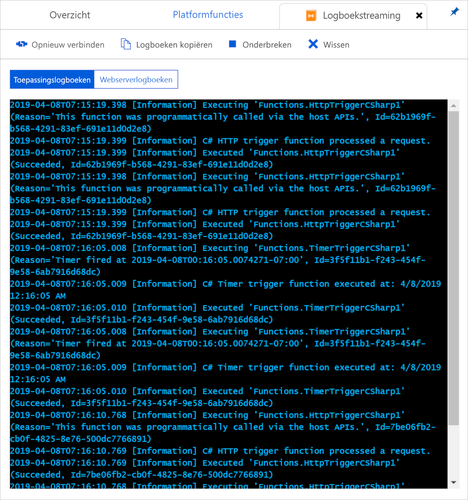
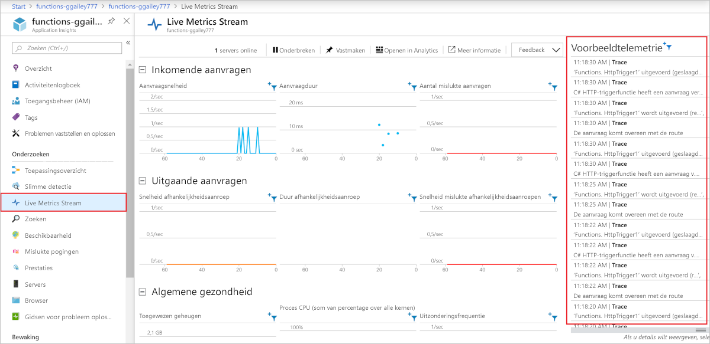

# <a name="monitor-azure-functions"></a>Azure Functions controleren

[Azure Functions](functions-overview.md) biedt ingebouwde integratie met [Azure Application Insights](../azure-monitor/app/app-insights-overview.md) om functies te bewaken. In dit artikel ziet u hoe u Azure-functies configureert om door het systeem gegenereerde logboekbestanden naar Toepassingsinzichten te verzenden.

We raden u aan Application Insights te gebruiken omdat het logboek-, prestatie- en foutgegevens verzamelt. Het detecteert automatisch prestatieafwijkingen en bevat krachtige analysetools om u te helpen problemen te diagnosticeren en te begrijpen hoe uw functies worden gebruikt. Het is bedoeld om u te helpen de prestaties en bruikbaarheid continu te verbeteren. U zelfs Application Insights gebruiken tijdens de projectontwikkeling van lokale functie-apps. Zie Wat is Application Insights voor meer [informatie.](../azure-monitor/app/app-insights-overview.md)

Aangezien de vereiste Application Insights-instrumentatie is ingebouwd in Azure-functies, hebt u alleen een geldige instrumentatiesleutel nodig om uw functie-app te verbinden met een Application Insights-bron. De instrumentatiesleutel moet worden toegevoegd aan de toepassingsinstellingen wanneer uw functie-app-bron wordt gemaakt in Azure. Als uw functie-app deze sleutel nog niet heeft, u [deze handmatig instellen.](#enable-application-insights-integration)  

## <a name="application-insights-pricing-and-limits"></a>Prijzen en limieten voor Application Insights

U de integratie van Application Insights met Functie-apps gratis uitproberen. Er is een dagelijkse limiet aan hoeveel gegevens gratis kunnen worden verwerkt. U deze limiet tijdens het testen bereiken. Azure biedt portal- en e-mailmeldingen wanneer u uw dagelijkse limiet nadert. Als u deze waarschuwingen mist en de limiet bereikt, worden er geen nieuwe logboeken weergegeven in query's met toepassingsstatistieken. Wees je bewust van de limiet om onnodige tijd voor het oplossen van problemen te voorkomen. Zie [Prijzen en gegevensvolume beheren in Application Insights](../azure-monitor/app/pricing.md)voor meer informatie.

De volledige lijst met functies voor Toepassingsinzichten die beschikbaar zijn voor uw functie-app is gedetailleerd in [toepassingsinzichten voor ondersteunde functies met Azure-functies.](../azure-monitor/app/azure-functions-supported-features.md)

## <a name="view-telemetry-in-monitor-tab"></a>Telemetrie weergeven op het tabblad Monitor

Als [de integratie van Application Insights is ingeschakeld,](#enable-application-insights-integration)u telemetriegegevens bekijken op het tabblad **Monitor.**

1. Selecteer op de pagina met de functie-app een functie die ten minste één keer is uitgevoerd nadat Application Insights is geconfigureerd. Selecteer vervolgens het tabblad **Monitor.** Selecteer Periodiek **vernieuwen** totdat de lijst met functieaanroepen wordt weergegeven.

   

    > [!NOTE]
    > Het kan tot vijf minuten duren voordat de lijst wordt weergegeven terwijl de gegevens van de telemetrieclient worden verzonden naar de server. De vertraging is niet van toepassing op de [livestream van live statistieken.](../azure-monitor/app/live-stream.md) Die service maakt verbinding met de host Functies wanneer u de pagina laadt, zodat logboeken rechtstreeks naar de pagina worden gestreamd.

1. Als u de logboeken voor een bepaalde functieaanroep wilt bekijken, selecteert u de **kolomkoppeling Datum (UTC)** voor die aanroep. De logboekuitvoer voor die aanroep wordt op een nieuwe pagina weergegeven.

   

1. Kies de koppeling **Run in Application Insights** om de bron weer te geven van de query waarmee de Azure Monitor-logboekgegevens in Azure-logboek worden opgehaald Als dit de eerste keer is dat Azure Log Analytics in uw abonnement wordt gebruikt, wordt u gevraagd in te schakelen.

1. Wanneer u die koppeling kiest en ervoor kiest log-analyse in te schakelen. de volgende query wordt weergegeven. U zien dat de queryresultaten beperkt zijn`where timestamp > ago(30d)`tot de laatste 30 dagen ( ). Bovendien tonen de resultaten niet meer dan`take 20`20 rijen ( ). De lijst met aanroepgegevens voor uw functie is daarentegen voor de laatste 30 dagen zonder limiet.

   

Zie [Telemetriegegevens van query's](#query-telemetry-data) later in dit artikel voor meer informatie.

## <a name="view-telemetry-in-application-insights"></a>Telemetrie weergeven in toepassingsinzichten

Als u Toepassingsinzichten wilt openen vanuit een functie-app in de Azure-portal, gaat u naar de **pagina Overzicht van** de functie-app. Selecteer **Application Insights** **onder Geconfigureerde functies**.


Zie de [documentatie Application Insights](https://docs.microsoft.com/azure/application-insights/)voor informatie over het gebruik van Application Insights. In deze sectie worden enkele voorbeelden weergegeven van het weergeven van gegevens in Application Insights. Als u al bekend bent met Application Insights, u rechtstreeks naar [de secties gaan over het configureren en aanpassen van de telemetriegegevens.](#configure-categories-and-log-levels)



De volgende gebieden van Application Insights kunnen nuttig zijn bij het evalueren van het gedrag, de prestaties en de fouten in uw functies:

| Onderzoeken | Beschrijving |
| ---- | ----------- |
| **[Fouten](../azure-monitor/app/asp-net-exceptions.md)** |  Maak grafieken en waarschuwingen op basis van functiefouten en serveruitzonderingen. De **operatienaam** is de functienaam. Fouten in afhankelijkheden worden niet weergegeven, tenzij u aangepaste telemetrie voor afhankelijkheden implementeert. |
| **[Prestaties](../azure-monitor/app/performance-counters.md)** | Analyseer prestatieproblemen door het gebruik en de doorvoer van resources per **cloudrolexemplaren**weer te geven. Deze gegevens kunnen handig zijn voor het opsporen van scenario's waarbij functies uw onderliggende resources verzanden. |
| **[Statistieken](../azure-monitor/app/metrics-explorer.md)** | Maak grafieken en waarschuwingen die zijn gebaseerd op statistieken. Statistieken omvatten het aantal functie-aanroepen, uitvoeringstijd en slagingspercentages. |
| **[Live statistieken](../azure-monitor/app/live-stream.md)** | Bekijk metrische gegevens zoals deze in bijna realtime zijn gemaakt. |

## <a name="query-telemetry-data"></a>Telemetriegegevens van query's

[Application Insights Analytics](../azure-monitor/app/analytics.md) geeft u toegang tot alle telemetriegegevens in de vorm van tabellen in een database. Analytics biedt een querytaal voor het extraheren, manipuleren en visualiseren van de gegevens. 

Kies **Logboeken** om te verkennen of query voor geregistreerde gebeurtenissen.


Hier is een queryvoorbeeld dat de verdeling van aanvragen per werknemer over de laatste 30 minuten weergeeft.

<pre>
requests
| where timestamp > ago(30m) 
| summarize count() by cloud_RoleInstance, bin(timestamp, 1m)
| render timechart
</pre>

De beschikbare tabellen worden weergegeven op het tabblad **Schema** aan de linkerkant. In de volgende tabellen vindt u gegevens die zijn gegenereerd door functie-aanroepen:

| Tabel | Beschrijving |
| ----- | ----------- |
| **Sporen** | Logboeken die zijn gemaakt door de runtime en de functiecode. |
| **aanvragen** | Eén aanvraag voor elke functieaanroep. |
| **Uitzonderingen** | Eventuele uitzonderingen die door de runtime worden gegooid. |
| **customMetrics (customMetrics)** | De telling van succesvolle en falende aanroepingen, slagingspercentage, en duur. |
| **aangepaste gebeurtenissen** | Gebeurtenissen die worden bijgehouden door de runtime, bijvoorbeeld: HTTP-aanvragen die een functie activeren. |
| **prestatietellers** | Informatie over de prestaties van de servers waarop de functies worden uitgevoerd. |

De andere tabellen zijn voor beschikbaarheidstests en telemetrie van de client en browser. U aangepaste telemetrie implementeren om gegevens eraan toe te voegen.

Binnen elke tabel bevindt zich enkele functiesspecifieke gegevens in een `customDimensions` veld.  In de volgende query worden bijvoorbeeld alle `Error`traces met een logboekniveau opgehaald.

<pre>
traces 
| where customDimensions.LogLevel == "Error"
</pre>

De runtime `customDimensions.LogLevel` biedt `customDimensions.Category` de velden en velden. U extra velden in logboeken opnemen die u in uw functiecode schrijft. Zie [Structured logging](#structured-logging) later in dit artikel.

## <a name="configure-categories-and-log-levels"></a>Categorieën en logboekniveaus configureren

U Application Insights gebruiken zonder aangepaste configuratie. De standaardconfiguratie kan leiden tot grote hoeveelheden gegevens. Als u een Visual Studio Azure-abonnement gebruikt, u uw gegevensdop voor Application Insights raken. Later in dit artikel leert u hoe u de gegevens die uw functies naar Application Insights verzenden, configureren en aanpassen. Voor een functie-app is logboekregistratie geconfigureerd in het [bestand host.json.]

### <a name="categories"></a>Categorieën

De Azure Functions-logger bevat een *categorie* voor elk logboek. De categorie geeft aan welk deel van de runtime code of uw functiecode het logboek heeft geschreven. In de volgende grafiek worden de belangrijkste categorieën logboeken beschreven die de runtime maakt. 

| Categorie | Beschrijving |
| ----- | ----- | 
| Host.Results | Deze logboeken worden weergegeven als **aanvragen** in Application Insights. Ze wijzen op succes of falen van een functie. Al deze logs zijn `Information` geschreven op niveau. Als u `Warning` op of boven filtert, ziet u geen van deze gegevens. |
| Host.Aggregator Host.Aggregator | Deze logboeken bieden tellingen en gemiddelden van functie-aanroepingen over een [configureerbare](#configure-the-aggregator) periode. De standaardperiode is 30 seconden of 1.000 resultaten, wat het eerst komt. De logboeken zijn beschikbaar in de tabel **customMetrics** in Application Insights. Voorbeelden zijn het aantal runs, slagingspercentage en duur. Al deze logs zijn `Information` geschreven op niveau. Als u `Warning` op of boven filtert, ziet u geen van deze gegevens. |

Alle logboeken voor andere categorieën dan deze zijn beschikbaar in de **tracestabel** in Application Insights.

Alle logboeken met `Host` categorieën die beginnen met worden geschreven door de runtime Functies. De **functie gestart** en Functie **voltooid** logs hebben categorie `Host.Executor`. Voor succesvolle uitvoeringen `Information` zijn deze logboeken vlak. Uitzonderingen worden `Error` op niveau geregistreerd. De runtime `Warning` maakt ook niveaulogboeken, bijvoorbeeld: wachtrijberichten die naar de gifwachtrij worden verzonden.

Met de runtime Functies worden logboeken gemaakt met een categorie die begint met 'Host'. In versie 1.x `function started` `function executed`hebben `function completed` de , `Host.Executor`, en logboeken de categorie . Vanaf versie 2.x hebben deze `Function.<YOUR_FUNCTION_NAME>`logboeken de categorie .

Als u logboeken in uw functiecode `Function.<YOUR_FUNCTION_NAME>.User` schrijft, is en kan de categorie elk logboekniveau zijn. In versie 1.x van de runtime `Function`Functies is de categorie .

### <a name="log-levels"></a>Logboekniveaus

De Azure Functions logger bevat ook een *logboekniveau* bij elk logboek. [LogLevel](/dotnet/api/microsoft.extensions.logging.loglevel) is een opsomming en de gehele code geeft het relatieve belang aan:

|Logniveau    |Code|
|------------|---|
|Tracering       | 0 |
|Fouten opsporen       | 1 |
|Informatie | 2 |
|Waarschuwing     | 3 |
|Fout       | 4 |
|Kritiek    | 5 |
|Geen        | 6 |

Logboekniveau `None` wordt uitgelegd in de volgende sectie. 

### <a name="log-configuration-in-hostjson"></a>Logboekconfiguratie in host.json

Het [bestand host.json] configureert hoeveel logboekregistratie een functie-app naar Application Insights verzendt. Voor elke categorie geeft u het minimale logboekniveau aan dat moet worden verzonden. Er zijn twee voorbeelden: het eerste voorbeeld richt zich op [versie 2.x en later](functions-versions.md#version-2x) op de runtime van de functies (met .NET Core) en het tweede voorbeeld is voor de runtime van versie 1.x.

### <a name="version-2x-and-higher"></a>Versie 2.x en hoger

Versie v2.x en latere versies van de runtime van de functies gebruiken de [filterhiërarchie .NET Core- logboekregistratie](https://docs.microsoft.com/aspnet/core/fundamentals/logging/?view=aspnetcore-2.1#log-filtering). 

```json
{
  "logging": {
    "fileLoggingMode": "always",
    "logLevel": {
      "default": "Information",
      "Host.Results": "Error",
      "Function": "Error",
      "Host.Aggregator": "Trace"
    }
  }
}
```

### <a name="version-1x"></a>Versie 1.x

```json
{
  "logger": {
    "categoryFilter": {
      "defaultLevel": "Information",
      "categoryLevels": {
        "Host.Results": "Error",
        "Function": "Error",
        "Host.Aggregator": "Trace"
      }
    }
  }
}
```

In dit voorbeeld worden de volgende regels ingesteld:

* Voor logboeken `Host.Results` `Function`met categorie `Error` of , stuur alleen niveau en hoger naar Application Insights. Logboeken `Warning` voor niveau en lager worden genegeerd.
* Voor logboeken `Host.Aggregator`met categorie, stuur alle logboeken naar Application Insights. Het `Trace` logboekniveau is hetzelfde als `Verbose`wat sommige `Trace` loggers aanroepen, maar gebruiken in het [bestand host.json.]
* Stuur alleen `Information` niveau en hoger naar Application Insights voor alle andere logboeken.

De categoriewaarde in [host.json] besturingselementen logboekregistratie voor alle categorieën die beginnen met dezelfde waarde. `Host`in [host.json] besturingselementen logboeken voor `Host.General`, `Host.Executor`, `Host.Results`, enzovoort.

Als [host.json] meerdere categorieën bevat die met dezelfde tekenreeks beginnen, worden de langere categorieën eerst gematcht. Stel dat u alles van `Host.Aggregator` de `Error` runtime wilt, `Host.Aggregator` behalve om `Information` op niveau in te loggen, maar u wilt zich op het niveau aanmelden:

### <a name="version-2x-and-later"></a>Versie 2.x en hoger

```json
{
  "logging": {
    "fileLoggingMode": "always",
    "logLevel": {
      "default": "Information",
      "Host": "Error",
      "Function": "Error",
      "Host.Aggregator": "Information"
    }
  }
}
```

### <a name="version-1x"></a>Versie 1.x 

```json
{
  "logger": {
    "categoryFilter": {
      "defaultLevel": "Information",
      "categoryLevels": {
        "Host": "Error",
        "Function": "Error",
        "Host.Aggregator": "Information"
      }
    }
  }
}
```

Als u alle logboeken voor een `None`categorie wilt onderdrukken, u logboekniveau gebruiken. Er zijn geen logboeken geschreven met die categorie en er is geen log niveau erboven.

## <a name="configure-the-aggregator"></a>De aggregator configureren

Zoals in de vorige sectie is opgemerkt, worden gegevens over functieuitvoeringen over een bepaalde periode samengevoegd. De standaardperiode is 30 seconden of 1.000 runs, wat het eerst komt. U deze instelling configureren in het [bestand host.json.]  Hier volgt een voorbeeld:

```json
{
    "aggregator": {
      "batchSize": 1000,
      "flushTimeout": "00:00:30"
    }
}
```

## <a name="configure-sampling"></a>Bemonstering configureren

Application Insights heeft een [samplingfunctie](../azure-monitor/app/sampling.md) die u kan beschermen tegen het produceren van te veel telemetriegegevens over voltooide uitvoeringen op momenten van piekbelasting. Wanneer de snelheid van binnenkomende uitvoeringen een opgegeven drempelwaarde overschrijdt, begint Application Insights willekeurig een aantal binnenkomende uitvoeringen te negeren. De standaardinstelling voor het maximum aantal uitvoeringen per seconde is 20 (vijf in versie 1.x). U sampling configureren in [host.json].  Hier volgt een voorbeeld:

### <a name="version-2x-and-later"></a>Versie 2.x en hoger

```json
{
  "logging": {
    "applicationInsights": {
      "samplingSettings": {
        "isEnabled": true,
        "maxTelemetryItemsPerSecond" : 20
      }
    }
  }
}
```

### <a name="version-1x"></a>Versie 1.x 

```json
{
  "applicationInsights": {
    "sampling": {
      "isEnabled": true,
      "maxTelemetryItemsPerSecond" : 5
    }
  }
}
```

> [!NOTE]
> [Sampling](../azure-monitor/app/sampling.md) is standaard ingeschakeld. Als er gegevens ontbreken, moet u mogelijk de bemonsteringsinstellingen aanpassen aan uw specifieke bewakingsscenario.

## <a name="write-logs-in-c-functions"></a>Logboeken schrijven in C#-functies

U logboeken in uw functiecode schrijven die als sporen worden weergegeven in Application Insights.

### <a name="ilogger"></a>ILogger

Gebruik een [ILogger-parameter](https://docs.microsoft.com/dotnet/api/microsoft.extensions.logging.ilogger) in `TraceWriter` uw functies in plaats van een parameter. Logboeken die `TraceWriter` zijn gemaakt met `ILogger` behulp van ga naar Application Insights, maar laten u [gestructureerde logboekregistratie doen.](https://softwareengineering.stackexchange.com/questions/312197/benefits-of-structured-logging-vs-basic-logging)

Met `ILogger` een object `Log<level>` roept u [extensiemethoden op ILogger](https://docs.microsoft.com/dotnet/api/microsoft.extensions.logging.loggerextensions#methods) aan om logboeken te maken. De volgende `Information` code schrijft logboeken met categorie "Function.<YOUR_FUNCTION_NAME>. Gebruiker."

```cs
public static async Task<HttpResponseMessage> Run(HttpRequestMessage req, ILogger logger)
{
    logger.LogInformation("Request for item with key={itemKey}.", id);
```

### <a name="structured-logging"></a>Gestructureerde logboekregistratie

De volgorde van tijdelijke aanduidingen, niet hun namen, bepaalt welke parameters worden gebruikt in het logboekbericht. Stel dat u de volgende code hebt:

```csharp
string partitionKey = "partitionKey";
string rowKey = "rowKey";
logger.LogInformation("partitionKey={partitionKey}, rowKey={rowKey}", partitionKey, rowKey);
```

Als u dezelfde berichttekenreeks bewaart en de volgorde van de parameters omkeert, heeft de resulterende berichttekst de waarden op de verkeerde plaatsen.

Tijdelijke aanduidingen worden op deze manier behandeld, zodat u gestructureerde logboekregistratie doen. Application Insights slaat de parameternaam-waardeparen en de berichttekenreeks op. Het resultaat is dat de berichtargumenten velden worden waarop u query's.

Als uw aanroepen naar loggermethode lijkt op `customDimensions.prop__rowKey`het vorige voorbeeld, u het veld opvragen. Het `prop__` voorvoegsel wordt toegevoegd om ervoor te zorgen dat er geen botsingen zijn tussen velden die de runtime toevoegt en velden die uw functiecode toevoegt.

U ook een query uitvoeren op de `customDimensions.prop__{OriginalFormat}`oorspronkelijke berichttekenreeks door te verwijzen naar het veld.  

Hier is een voorbeeld JSON vertegenwoordiging van `customDimensions` gegevens:

```json
{
  customDimensions: {
    "prop__{OriginalFormat}":"C# Queue trigger function processed: {message}",
    "Category":"Function",
    "LogLevel":"Information",
    "prop__message":"c9519cbf-b1e6-4b9b-bf24-cb7d10b1bb89"
  }
}
```

### <a name="custom-metrics-logging"></a>Logboekregistratie voor aangepaste statistieken

In C# scriptfuncties `LogMetric` u de `ILogger` extensiemethode gebruiken om aangepaste statistieken te maken in Application Insights. Hier is een voorbeeldmethode aanroep:

```csharp
logger.LogMetric("TestMetric", 1234);
```

Deze code is een `TrackMetric` alternatief voor bellen met behulp van de Application Insights API voor .NET.

## <a name="write-logs-in-javascript-functions"></a>Logboeken schrijven in JavaScript-functies

In de functies Node.js u `context.log` logboeken schrijven. Gestructureerde logboekregistratie is niet ingeschakeld.

```
context.log('JavaScript HTTP trigger function processed a request.' + context.invocationId);
```

### <a name="custom-metrics-logging"></a>Logboekregistratie voor aangepaste statistieken

Wanneer u versie [1.x](functions-versions.md#creating-1x-apps) van de runtime Van Functies uitvoert, `context.log.metric` kunnen de functies van Node.js de methode gebruiken om aangepaste statistieken te maken in Application Insights. Deze methode wordt momenteel niet ondersteund in versie 2.x en hoger. Hier is een voorbeeldmethode aanroep:

```javascript
context.log.metric("TestMetric", 1234);
```

Deze code is een `trackMetric` alternatief voor bellen met de Node.js SDK voor Application Insights.

## <a name="log-custom-telemetry-in-c-functions"></a>Aangepaste telemetrie voor logboeken in C#-functies

Er is een functiespecifieke versie van de Application Insights SDK die u gebruiken om aangepaste telemetriegegevens van uw functies naar Application Insights te verzenden: [Microsoft.Azure.WebJobs.Logging.ApplicationInsights](https://www.nuget.org/packages/Microsoft.Azure.WebJobs.Logging.ApplicationInsights). Gebruik de volgende opdracht in de opdrachtprompt om dit pakket te installeren:

# <a name="command"></a>[Opdracht](#tab/cmd)

```cmd
dotnet add package Microsoft.Azure.WebJobs.Logging.ApplicationInsights --version <VERSION>
```

# <a name="powershell"></a>[Powershell](#tab/powershell)

```powershell
Install-Package Microsoft.Azure.WebJobs.Logging.ApplicationInsights -Version <VERSION>
```

---

Vervang in deze `<VERSION>` opdracht een versie van dit pakket die uw geïnstalleerde versie van [Microsoft.Azure.WebJobs](https://www.nuget.org/packages/Microsoft.Azure.WebJobs/)ondersteunt. 

In de volgende C#-voorbeelden wordt de [aangepaste telemetrie-API gebruikt.](../azure-monitor/app/api-custom-events-metrics.md) Het voorbeeld is voor een .NET-klassebibliotheek, maar de code Application Insights is hetzelfde voor C#-script.

### <a name="version-2x-and-later"></a>Versie 2.x en hoger

Versie 2.x en latere versies van de runtime gebruiken nieuwere functies in Application Insights om telemetrie automatisch te correleren met de huidige bewerking. U hoeft de bewerking `Id`niet handmatig `ParentId`in `Name` te stellen, of velden.

```cs
using System;
using System.Threading.Tasks;
using Microsoft.AspNetCore.Mvc;
using Microsoft.Azure.WebJobs;
using Microsoft.Azure.WebJobs.Extensions.Http;
using Microsoft.AspNetCore.Http;
using Microsoft.Extensions.Logging;

using Microsoft.ApplicationInsights;
using Microsoft.ApplicationInsights.DataContracts;
using Microsoft.ApplicationInsights.Extensibility;
using System.Linq;

namespace functionapp0915
{
    public class HttpTrigger2
    {
        private readonly TelemetryClient telemetryClient;

        /// Using dependency injection will guarantee that you use the same configuration for telemetry collected automatically and manually.
        public HttpTrigger2(TelemetryConfiguration telemetryConfiguration)
        {
            this.telemetryClient = new TelemetryClient(telemetryConfiguration);
        }

        [FunctionName("HttpTrigger2")]
        public Task<IActionResult> Run(
            [HttpTrigger(AuthorizationLevel.Anonymous, "get", Route = null)]
            HttpRequest req, ExecutionContext context, ILogger log)
        {
            log.LogInformation("C# HTTP trigger function processed a request.");
            DateTime start = DateTime.UtcNow;

            // Parse query parameter
            string name = req.Query
                .FirstOrDefault(q => string.Compare(q.Key, "name", true) == 0)
                .Value;

            // Track an Event
            var evt = new EventTelemetry("Function called");
            evt.Context.User.Id = name;
            this.telemetryClient.TrackEvent(evt);

            // Track a Metric
            var metric = new MetricTelemetry("Test Metric", DateTime.Now.Millisecond);
            metric.Context.User.Id = name;
            this.telemetryClient.TrackMetric(metric);

            // Track a Dependency
            var dependency = new DependencyTelemetry
            {
                Name = "GET api/planets/1/",
                Target = "swapi.co",
                Data = "https://swapi.co/api/planets/1/",
                Timestamp = start,
                Duration = DateTime.UtcNow - start,
                Success = true
            };
            dependency.Context.User.Id = name;
            this.telemetryClient.TrackDependency(dependency);

            return Task.FromResult<IActionResult>(new OkResult());
        }
    }
}
```

[GetMetric](../azure-monitor/app/api-custom-events-metrics.md#getmetric) is de momenteel aanbevolen API voor het maken van een statistiek.

### <a name="version-1x"></a>Versie 1.x

```cs
using System;
using System.Net;
using Microsoft.ApplicationInsights;
using Microsoft.ApplicationInsights.DataContracts;
using Microsoft.ApplicationInsights.Extensibility;
using Microsoft.Azure.WebJobs;
using System.Net.Http;
using System.Threading.Tasks;
using Microsoft.Azure.WebJobs.Extensions.Http;
using Microsoft.Extensions.Logging;
using System.Linq;

namespace functionapp0915
{
    public static class HttpTrigger2
    {
        private static string key = TelemetryConfiguration.Active.InstrumentationKey = 
            System.Environment.GetEnvironmentVariable(
                "APPINSIGHTS_INSTRUMENTATIONKEY", EnvironmentVariableTarget.Process);

        private static TelemetryClient telemetryClient = 
            new TelemetryClient() { InstrumentationKey = key };

        [FunctionName("HttpTrigger2")]
        public static async Task<HttpResponseMessage> Run(
            [HttpTrigger(AuthorizationLevel.Anonymous, "get", "post", Route = null)]
            HttpRequestMessage req, ExecutionContext context, ILogger log)
        {
            log.LogInformation("C# HTTP trigger function processed a request.");
            DateTime start = DateTime.UtcNow;

            // Parse query parameter
            string name = req.GetQueryNameValuePairs()
                .FirstOrDefault(q => string.Compare(q.Key, "name", true) == 0)
                .Value;

            // Get request body
            dynamic data = await req.Content.ReadAsAsync<object>();

            // Set name to query string or body data
            name = name ?? data?.name;
         
            // Track an Event
            var evt = new EventTelemetry("Function called");
            UpdateTelemetryContext(evt.Context, context, name);
            telemetryClient.TrackEvent(evt);
            
            // Track a Metric
            var metric = new MetricTelemetry("Test Metric", DateTime.Now.Millisecond);
            UpdateTelemetryContext(metric.Context, context, name);
            telemetryClient.TrackMetric(metric);
            
            // Track a Dependency
            var dependency = new DependencyTelemetry
                {
                    Name = "GET api/planets/1/",
                    Target = "swapi.co",
                    Data = "https://swapi.co/api/planets/1/",
                    Timestamp = start,
                    Duration = DateTime.UtcNow - start,
                    Success = true
                };
            UpdateTelemetryContext(dependency.Context, context, name);
            telemetryClient.TrackDependency(dependency);
        }
        
        // Correlate all telemetry with the current Function invocation
        private static void UpdateTelemetryContext(TelemetryContext context, ExecutionContext functionContext, string userName)
        {
            context.Operation.Id = functionContext.InvocationId.ToString();
            context.Operation.ParentId = functionContext.InvocationId.ToString();
            context.Operation.Name = functionContext.FunctionName;
            context.User.Id = userName;
        }
    }    
}
```

Niet bellen `TrackRequest` of `StartOperation<RequestTelemetry>` omdat u dubbele aanvragen voor een functieaanroep ziet.  De runtime Functies houdt automatisch aanvragen bij.

Niet instellen. `telemetryClient.Context.Operation.Id` Deze globale instelling veroorzaakt een onjuiste correlatie wanneer veel functies tegelijkertijd worden uitgevoerd. Maak in plaats daarvan een`DependencyTelemetry` `EventTelemetry`nieuwe telemetrie-instantie ( , ) en wijzigt de `Context` eigenschap. Geef vervolgens in de telemetrie-instantie `TrackEvent()`door `TrackMetric()`aan de bijbehorende `Track` methode op `TelemetryClient` (`TrackDependency()`, , ). Deze methode zorgt ervoor dat de telemetrie de juiste correlatiedetails heeft voor de huidige functieaanroep.

## <a name="log-custom-telemetry-in-javascript-functions"></a>Aangepaste telemetrie voor logboeken in JavaScript-functies

Hier is een voorbeeld code fragment dat aangepaste telemetrie stuurt met de [Application Insights Node.js SDK:](https://github.com/microsoft/applicationinsights-node.js)

```javascript
const appInsights = require("applicationinsights");
appInsights.setup();
const client = appInsights.defaultClient;

module.exports = function (context, req) {
    context.log('JavaScript HTTP trigger function processed a request.');

    client.trackEvent({name: "my custom event", tagOverrides:{"ai.operation.id": context.invocationId}, properties: {customProperty2: "custom property value"}});
    client.trackException({exception: new Error("handled exceptions can be logged with this method"), tagOverrides:{"ai.operation.id": context.invocationId}});
    client.trackMetric({name: "custom metric", value: 3, tagOverrides:{"ai.operation.id": context.invocationId}});
    client.trackTrace({message: "trace message", tagOverrides:{"ai.operation.id": context.invocationId}});
    client.trackDependency({target:"http://dbname", name:"select customers proc", data:"SELECT * FROM Customers", duration:231, resultCode:0, success: true, dependencyTypeName: "ZSQL", tagOverrides:{"ai.operation.id": context.invocationId}});
    client.trackRequest({name:"GET /customers", url:"http://myserver/customers", duration:309, resultCode:200, success:true, tagOverrides:{"ai.operation.id": context.invocationId}});

    context.done();
};
```

De `tagOverrides` parameter `operation_Id` stelt de aanroep-id van de functie in. Met deze instelling u alle automatisch gegenereerde en aangepaste telemetrie voor een bepaalde functieaanroep correleren.

## <a name="dependencies"></a>Afhankelijkheden

Functies v2 verzamelt automatisch afhankelijkheden voor HTTP-aanvragen, ServiceBus, EventHub en SQL.

U aangepaste code schrijven om de afhankelijkheden weer te geven. Zie bijvoorbeeld de voorbeeldcode in de [sectie Aangepaste telemetrie c#](#log-custom-telemetry-in-c-functions). De voorbeeldcode resulteert in een *toepassingskaart* in Application Insights die lijkt op de volgende afbeelding:



## <a name="enable-application-insights-integration"></a>Application Insights-integratie inschakelen

Als u een functie-app wilt verzenden naar Application Insights, moet deze de instrumentatiesleutel van een Application Insights-bron kennen. De sleutel moet zich in een app-instelling met de naam **APPINSIGHTS_INSTRUMENTATIONKEY**.

Wanneer u uw functie-app [maakt in de Azure-portal](functions-create-first-azure-function.md), vanaf de opdrachtregel met behulp van [Azure Functions Core Tools](functions-create-first-azure-function-azure-cli.md)of met behulp van Visual [Studio Code,](functions-create-first-function-vs-code.md)is application insights-integratie standaard ingeschakeld. De bron Application Insights heeft dezelfde naam als de functie-app en is gemaakt in dezelfde regio of in de dichtstbijzijnde regio.

### <a name="new-function-app-in-the-portal"></a>Nieuwe functie-app in de portal

Als u de bron Application Insights wilt controleren die wordt gemaakt, selecteert u deze om het venster **Toepassingsstatistieken** uit te vouwen. U de **naam van** de nieuwe bron wijzigen of een andere **locatie** kiezen in een [Azure-geografie](https://azure.microsoft.com/global-infrastructure/geographies/) waar u uw gegevens wilt opslaan.



Wanneer u **Maken**kiest, wordt een Application Insights-bron `APPINSIGHTS_INSTRUMENTATIONKEY` gemaakt met uw functie-app, die de ingestelde toepassingsinstellingen heeft. Alles is klaar om te gaan.

<a id="manually-connect-an-app-insights-resource"></a>
### <a name="add-to-an-existing-function-app"></a>Toevoegen aan een bestaande functie-app 

Wanneer u een functie-app maakt met [Visual Studio,](functions-create-your-first-function-visual-studio.md)moet u de bron Application Insights maken. Vervolgens u de instrumentatiesleutel van die resource toevoegen als toepassingsinstelling in uw functie-app.

[!INCLUDE [functions-connect-new-app-insights.md](../../includes/functions-connect-new-app-insights.md)]

Vroege versies van functies gebruikt ingebouwde monitoring, die niet langer wordt aanbevolen. Wanneer u Application Insights-integratie inschakelt voor een dergelijke functie-app, moet u ook [ingebouwde logboekregistratie uitschakelen.](#disable-built-in-logging)  

## <a name="report-issues"></a>Problemen melden

Als u een probleem wilt melden met de integratie van Application Insights in functies of om een suggestie of verzoek te doen, [maakt u een probleem in GitHub.](https://github.com/Azure/Azure-Functions/issues/new)

## <a name="streaming-logs"></a>Streaminglogboeken

Tijdens het ontwikkelen van een toepassing wilt u vaak zien wat er in bijna realtime naar de logboeken wordt geschreven wanneer deze in Azure wordt uitgevoerd.

Er zijn twee manieren om een stroom van logbestanden te bekijken die worden gegenereerd door uw functie-uitvoeringen.

* **Ingebouwde logstreaming:** met het App Service-platform u een stream van uw toepassingslogboekbestanden bekijken. Dit is gelijk aan de uitvoer die wordt waargenomen wanneer u uw functies debugt tijdens [lokale ontwikkeling](functions-develop-local.md) en wanneer u het tabblad **Testen** in de portal gebruikt. Alle log-gebaseerde informatie wordt weergegeven. Zie [Logboeken streamen voor](../app-service/troubleshoot-diagnostic-logs.md#stream-logs)meer informatie. Deze streamingmethode ondersteunt slechts één exemplaar en kan niet worden gebruikt met een app die op Linux wordt uitgevoerd in een verbruiksabonnement.

* **Live Metrics Stream:** wanneer uw functie-app is [verbonden met Application Insights,](#enable-application-insights-integration)u loggegevens en andere statistieken in bijna realtime bekijken in de Azure-portal met [behulp van Live Metrics Stream](../azure-monitor/app/live-stream.md). Gebruik deze methode bij het bewaken van functies die worden uitgevoerd op meerdere exemplaren of op Linux in een verbruiksplan. Deze methode maakt gebruik van [gesamplede gegevens](#configure-sampling).

Logstreams kunnen zowel in de portal als in de meeste lokale ontwikkelomgevingen worden bekeken. 

### <a name="portal"></a>Portal

U beide typen logboekstromen in de portal bekijken.

#### <a name="built-in-log-streaming"></a>Ingebouwde logstreaming

Als u streaminglogboeken in de portal wilt weergeven, selecteert u het tabblad **Platformfuncties** in uw functie-app. Kies vervolgens onder **Controleren**de optie **Logboekstreaming**.



Hiermee wordt uw app verbonden met de logstreamingservice en worden toepassingslogboeken weergegeven in het venster. U schakelen tussen **toepassingslogboeken** en **webserverlogboeken.**  



#### <a name="live-metrics-stream"></a>Live Metrics Stream

Als u de live statistiekenstream voor uw app wilt weergeven, selecteert u het tabblad **Overzicht** van uw functie-app. Wanneer u Application Insights hebt ingeschakeld, ziet u een koppeling **Toepassingsstatistieken** onder **Geconfigureerde functies**. Via deze link ga je naar de pagina Applicatie-inzichten voor je app.

Selecteer Live **Metrics Stream**in Toepassingsinzichten . [Gesamplede logboekvermeldingen](#configure-sampling) worden weergegeven onder **Voorbeeldtelemetrie**.

 

### <a name="visual-studio-code"></a>Visual Studio Code

[!INCLUDE [functions-enable-log-stream-vs-code](../../includes/functions-enable-log-stream-vs-code.md)]

### <a name="core-tools"></a>Kernhulpmiddelen

[!INCLUDE [functions-streaming-logs-core-tools](../../includes/functions-streaming-logs-core-tools.md)]

### <a name="azure-cli"></a>Azure-CLI

U streaminglogboeken inschakelen met behulp van azure [cli](/cli/azure/install-azure-cli). Gebruik de volgende opdrachten om u aan te melden, uw abonnement te kiezen en logboekbestanden te streamen:

```azurecli
az login
az account list
az account set --subscription <subscriptionNameOrId>
az webapp log tail --resource-group <RESOURCE_GROUP_NAME> --name <FUNCTION_APP_NAME>
```

### <a name="azure-powershell"></a>Azure PowerShell

U streaminglogboeken inschakelen met [Azure PowerShell.](/powershell/azure/overview) Gebruik voor PowerShell de volgende opdrachten om uw Azure-account toe te voegen, uw abonnement te kiezen en logboekbestanden te streamen:

```powershell
Add-AzAccount
Get-AzSubscription
Get-AzSubscription -SubscriptionName "<subscription name>" | Select-AzSubscription
Get-AzWebSiteLog -Name <FUNCTION_APP_NAME> -Tail
```

## <a name="disable-built-in-logging"></a>Ingebouwde logboekregistratie uitschakelen

Wanneer u Application Insights inschakelt, schakelt u de ingebouwde logboekregistratie uit die Azure Storage gebruikt. De ingebouwde logboekregistratie is handig voor het testen met lichte workloads, maar is niet bedoeld voor productiegebruik met hoge belasting. Voor productiemonitoring raden we Application Insights aan. Als ingebouwde logboekregistratie wordt gebruikt in de productie, is de logboekregistratie mogelijk onvolledig vanwege beperking op Azure Storage.

Als u ingebouwde logboekregistratie `AzureWebJobsDashboard` wilt uitschakelen, verwijdert u de app-instelling. Zie het gedeelte **Toepassingsinstellingen** van Het beheren van een [functie-app](functions-how-to-use-azure-function-app-settings.md#settings)voor informatie over het verwijderen van app-instellingen in de Azure-portal. Voordat u de app-instelling verwijdert, moet u ervoor zorgen dat bestaande functies in dezelfde functie-app de instelling voor Azure Storage-triggers of bindingen gebruiken.

## <a name="next-steps"></a>Volgende stappen

Zie de volgende bronnen voor meer informatie:

* [Application Insights](/azure/application-insights/)
* [ASP.NET Core-logboekregistratie](/aspnet/core/fundamentals/logging/)

[host.json]: functions-host-json.md
