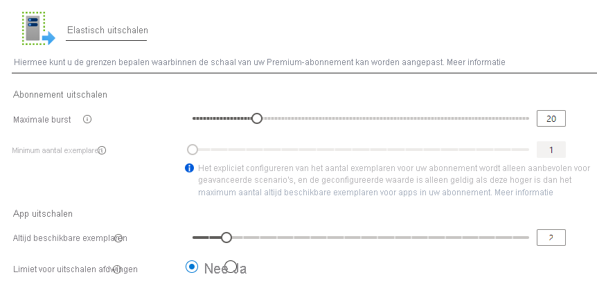

# <a name="azure-functions-premium-plan"></a>Azure Functions Premium-abonnement

Het Premium-abonnement van Azure Functions (ook wel elastisch Premium-abonnement genoemd) is een hosting optie voor functie-apps. Het Premium-abonnement biedt functies als VNet-connectiviteit, geen koud start en Premium-hardware.  Meerdere functie-apps kunnen worden geïmplementeerd in hetzelfde Premium-abonnement en met het plan kunt u de grootte van het reken exemplaar, de grootte van het basis plan en de maximale plan grootte configureren.  Zie [functie schaal en hosting opties](functions-scale.md)voor een vergelijking van het Premium-abonnement en andere typen plannen en hosting.

## <a name="create-a-premium-plan"></a>Een Premium-abonnement maken

[!INCLUDE [functions-premium-create](../../includes/functions-premium-create.md)]

U kunt ook een Premium-abonnement maken met behulp van [AZ functionapp plan Create](/cli/azure/functionapp/plan#az-functionapp-plan-create) in de Azure cli. In het volgende voor beeld wordt een _elastisch Premium 1_ -laag abonnement gemaakt:

```azurecli-interactive
az functionapp plan create --resource-group <RESOURCE_GROUP> --name <PLAN_NAME> \
--location <REGION> --sku EP1
```

In dit voor beeld vervangt `<RESOURCE_GROUP>` u door de resource groep en `<PLAN_NAME>` met een naam voor uw abonnement dat uniek is in de resource groep. Geef een [ondersteund `<REGION>` ](https://azure.microsoft.com/global-infrastructure/services/?products=functions)op. Als u een Premium-abonnement wilt maken dat Linux ondersteunt, neemt u de `--is-linux` optie op.

Met het plan dat u hebt gemaakt, kunt u [AZ functionapp Create](/cli/azure/functionapp#az-functionapp-create) gebruiken om uw functie-app te maken. In de portal worden zowel het abonnement als de app tegelijkertijd gemaakt. Zie [een functie-app maken in een Premium-abonnement](scripts/functions-cli-create-premium-plan.md)voor een voor beeld van een volledig Azure CLI-script.

## <a name="features"></a>Functies

De volgende functies zijn beschikbaar voor het werken met apps die zijn geïmplementeerd in een Premium-abonnement.

### <a name="always-ready-instances"></a>Always ready instances

Als er vandaag geen gebeurtenissen en uitvoeringen in het verbruiks abonnement worden uitgevoerd, kan uw app worden geschaald naar nul instanties. Wanneer er nieuwe gebeurtenissen binnenkomen in, moet er een nieuw exemplaar worden gespecialiseerd in de app die erop wordt uitgevoerd.  Het maken van nieuwe instanties kan enige tijd duren, afhankelijk van de app.  Deze extra latentie bij de eerste aanroep wordt vaak app koude start genoemd.

In het Premium-abonnement kunt u uw app altijd gereed hebben voor een bepaald aantal exemplaren.  Het maximum aantal always ready-exemplaren is 20.  Wanneer gebeurtenissen beginnen met het activeren van de app, worden ze eerst doorgestuurd naar de altijd gereede exemplaren.  Wanneer de functie actief wordt, worden extra instanties geheten als een buffer.  Deze buffer voor komt koude start voor nieuwe instanties die zijn vereist tijdens de schaal.  Deze gebufferde instanties worden [vooraf gehete instanties](#pre-warmed-instances)genoemd.  Met de combi natie van de always ready instances en een vooraf gewarmde buffer, kan uw app in feite koud starten elimineren.

> [!NOTE]
> Elk Premium-abonnement heeft te allen tijde ten minste één actief (gefactureerd) exemplaar.

U kunt het aantal always ready-instanties in de Azure Portal configureren door uw **functie-app**te selecteren, naar het tabblad **platform functies** te gaan en de opties voor **uitschalen** te selecteren. In het venster functie-app bewerken zijn de altijd gereede exemplaren specifiek voor die app.



U kunt ook altijd gereede exemplaren configureren voor een app met de Azure CLI.

```azurecli-interactive
az resource update -g <resource_group> -n <function_app_name>/config/web --set properties.minimumElasticInstanceCount=<desired_always_ready_count> --resource-type Microsoft.Web/sites 
```

#### <a name="pre-warmed-instances"></a>Vooraf gewarmde instanties

Voor bereide instanties zijn het aantal exemplaren dat is geheten als een buffer tijdens de schaal-en activerings gebeurtenissen.  Vooraf gewarmde instanties blijven bufferen totdat de limiet voor de maximale uitstel grootte is bereikt.  Het standaard aantal vooraf gewarme instanties is 1 en voor de meeste scenario's moet 1 zijn.  Als een app een lang opwarmen heeft (zoals een aangepaste container installatie kopie), kunt u deze buffer verg Roten.  Een eerder gewarmd exemplaar wordt pas actief wanneer alle actieve instanties voldoende zijn gebruikt.

Bekijk dit voor beeld van de manier waarop always ready instances en vooraf gewarmde instanties samen werken.  Er zijn vijf exemplaren van de Premium-functie-app geconfigureerd, en de standaard waarde van één vooraf gewarmd exemplaar.  Wanneer de app niet actief is en er geen gebeurtenissen worden geactiveerd, wordt de app ingericht en uitgevoerd op vijf exemplaren.  Op dit moment worden er geen kosten in rekening gebracht voor een vooraf gewarmd exemplaar, omdat de altijd gereede exemplaren niet worden gebruikt en er nog geen vooraf gewarmde instantie is toegewezen.

Zodra de eerste trigger is opgenomen in, worden de vijf altijd bewaarde instanties actief en wordt er een vooraf gewarmd exemplaar toegewezen.  De app wordt nu uitgevoerd met zes ingerichte instanties: de vijf nu actieve, altijd bewaarde instanties en de zesde vooraf gewarmde en inactieve buffer.  Als het aantal uitvoeringen blijft toenemen, worden de vijf actieve instanties uiteindelijk gebruikt.  Wanneer het platform beslist tot meer dan vijf instanties heeft geschaald, wordt het geschaald in het vooraf gewarme exemplaar.  Als dat het geval is, zijn er nu zes actieve instanties en wordt er onmiddellijk een zevende exemplaar ingericht en wordt de vooraf gewarmde buffer gevuld.  Deze volg orde van schalen en vooraf opwarmen gaat door totdat het maximum aantal exemplaren voor de app wordt bereikt.  Er worden geen exemplaren vooraf gewarmd of buiten het maximum geactiveerd.

U kunt het aantal vooraf gehetede instanties voor een app wijzigen met behulp van de Azure CLI.

```azurecli-interactive
az resource update -g <resource_group> -n <function_app_name>/config/web --set properties.preWarmedInstanceCount=<desired_prewarmed_count> --resource-type Microsoft.Web/sites 
```

#### <a name="maximum-instances-for-an-app"></a>Maximum aantal exemplaren voor een app

Naast het [maximum aantal exemplaren](#plan-and-sku-settings)per app, kunt u Maxi maal een maximum van de instantie configureren.  Het maximum aantal apps kan worden geconfigureerd met de [schaal limiet](./functions-scale.md#limit-scale-out)van de app.

### <a name="private-network-connectivity"></a>Connectiviteit van particuliere netwerken

Azure Functions geïmplementeerd in een Premium-abonnement maakt gebruik van de [nieuwe VNet-integratie voor web-apps](../app-service/web-sites-integrate-with-vnet.md).  Als uw app is geconfigureerd, kan deze communiceren met resources binnen uw VNet of worden beveiligd via service-eind punten.  Er zijn ook IP-beperkingen beschikbaar op de app om inkomend verkeer te beperken.

Wanneer u een subnet aan uw functie-app toewijst in een Premium-abonnement, hebt u een subnet met voldoende IP-adressen nodig voor elk mogelijk exemplaar. Er is een IP-blok met ten minste 100 beschik bare adressen vereist.

Zie [uw functie-app integreren met een VNet](functions-create-vnet.md)voor meer informatie.

### <a name="rapid-elastic-scale"></a>Snel elastisch schalen

Er worden automatisch extra reken instanties toegevoegd voor uw app met dezelfde snelle schaal logica als het verbruiks abonnement. Apps in hetzelfde App Service schema worden onafhankelijk van elkaar geschaald op basis van de behoeften van een afzonderlijke app. Functions-apps in hetzelfde App Service plan delen VM-resources zo nodig om de kosten te verlagen, indien mogelijk. Het aantal apps dat is gekoppeld aan een virtuele machine is afhankelijk van de footprint van elke app en de grootte van de virtuele machine.

Zie [functie schaal en hosting](./functions-scale.md#how-the-consumption-and-premium-plans-work)voor meer informatie over de werking van schalen.

### <a name="longer-run-duration"></a>Langere duur van de uitvoering

Azure Functions in een verbruiks abonnement zijn beperkt tot 10 minuten voor één uitvoering.  In het Premium-abonnement wordt de uitvoerings duur standaard ingesteld op 30 minuten om overmatige uitvoeringen te voor komen. U kunt echter [de host.jsop de configuratie wijzigen](./functions-host-json.md#functiontimeout) om de duur ongebonden te maken voor apps uit het Premium-abonnement (gegarandeerd 60 minuten).

## <a name="plan-and-sku-settings"></a>Plannings-en SKU-instellingen

Wanneer u het plan maakt, zijn er twee instellingen voor de plan grootte: het minimum aantal exemplaren (of de plan grootte) en de maximale burst-limiet.

Als uw app exemplaren van de altijd gereede exemplaren vereist, kan deze worden uitgeschaald tot het aantal exemplaren de maximale burst-limiet bereikt.  Er worden alleen exemplaren van uw abonnement in rekening gebracht wanneer ze worden uitgevoerd en aan u worden toegewezen, per seconde.  We maken het beste om uw app te schalen naar de gedefinieerde maximum limiet.

U kunt de plan grootte en maximum waarden in de Azure Portal configureren door de opties voor **Uitschalen** te selecteren in het plan of een functie-app die is geïmplementeerd in dat plan (onder **platform functies**).

U kunt ook de maximale burst-limiet van de Azure CLI verhogen:

```azurecli-interactive
az resource update -g <resource_group> -n <premium_plan_name> --set properties.maximumElasticWorkerCount=<desired_max_burst> --resource-type Microsoft.Web/serverfarms 
```

Het minimum voor elk abonnement is ten minste één exemplaar.  Het daad werkelijke minimum aantal exemplaren wordt automatisch geconfigureerd voor u op basis van de altijd gereed te maken exemplaren die worden aangevraagd door apps in het plan.  Als er bijvoorbeeld een aanvraag voor vijf exemplaren van de app altijd gereed is, en app B twee altijd gereede exemplaren in hetzelfde abonnement aanvraagt, wordt de minimale plan grootte berekend als vijf.  App A wordt uitgevoerd op alle 5 en app B wordt alleen uitgevoerd op 2.

> [!IMPORTANT]
> Er worden kosten in rekening gebracht voor elke instantie die wordt toegewezen in het minimum aantal exemplaren, ongeacht of de functies worden uitgevoerd.

In de meeste gevallen moet deze automatisch berekende minimum voldoende zijn.  Het schalen van het minimale aantal gebeurt echter een beste poging.  Het is echter wel mogelijk dat er op een specifiek tijdschaal vertraging kan worden vertraagd als er geen extra instanties beschikbaar zijn.  Door een minimum hoger in te stellen dan het automatisch berekende minimum, reserveert u exemplaren vooraf van uitschalen.

Het verhogen van het berekende minimum voor een plan kan worden uitgevoerd met behulp van de Azure CLI.

```azurecli-interactive
az resource update -g <resource_group> -n <premium_plan_name> --set sku.capacity=<desired_min_instances> --resource-type Microsoft.Web/serverfarms 
```

### <a name="available-instance-skus"></a>Beschik bare exemplaar-Sku's

Bij het maken of schalen van uw plan kunt u kiezen uit drie instantie grootten.  U wordt gefactureerd voor het totale aantal kernen en geheugen dat per seconde aan u wordt toegewezen.  Uw app kan automatisch uitschalen naar meerdere exemplaren als dat nodig is.  

|SKU|Kernen|Geheugen|Storage|
|--|--|--|--|
|EP1|1|3,5 GB|250 GB|
|EP2|2|7GB|250 GB|
|EP3|4|14GB|250 GB|

### <a name="memory-utilization-considerations"></a>Overwegingen voor geheugen gebruik
Als u een computer met meer geheugen gebruikt, betekent dat niet altijd dat de functie-app alle beschik bare geheugen zal gebruiken.

Een Java script-functie-app is bijvoorbeeld beperkt door de standaard limiet voor geheugen in Node.js. Als u deze limiet voor vaste geheugen wilt verhogen, voegt u de app-instelling `languageWorkers:node:arguments` met de waarde `--max-old-space-size=<max memory in MB>` .

## <a name="region-max-scale-out"></a>Schaal van regio Maxi maal

Hieronder vindt u de momenteel ondersteunde maximum waarden voor scale-out voor één abonnement in elke regio en de configuratie van het besturings systeem. Als u een verhoging wilt aanvragen, opent u een ondersteunings ticket.

Bekijk de volledige regionale Beschik baarheid van functies hier: [Azure.com](https://azure.microsoft.com/global-infrastructure/services/?products=functions)

|Region| Windows | Linux |
|--| -- | -- |
|Australië - centraal| 100 | Niet beschikbaar |
|Australië - centraal 2| 100 | Niet beschikbaar |
|Australië - oost| 100 | 20 |
|Australia Southeast | 100 | 20 |
|Brazil South| 100 | 20 |
|Canada - midden| 100 | 20 |
|Central US| 100 | 20 |
|China - oost 2| 100 | 20 |
|China - noord 2| 100 | 20 |
|Azië - oost| 100 | 20 |
|VS - oost | 100 | 20 |
|VS - oost 2| 100 | 20 |
|Frankrijk - centraal| 100 | 20 |
|Duitsland - west-centraal| 100 | Niet beschikbaar |
|Japan East| 100 | 20 |
|Japan - west| 100 | 20 |
|Korea - centraal| 100 | 20 |
|Korea - zuid| Niet beschikbaar | 20 |
|VS - noord-centraal| 100 | 20 |
|Europa - noord| 100 | 20 |
|Noorwegen - oost| 100 | 20 |
|South Central US| 100 | 20 |
|India - zuid | 100 | Niet beschikbaar |
|Azië - zuidoost| 100 | 20 |
|Zwitserland - noord| 100 | Niet beschikbaar |
|Zwitserland - west| 100 | Niet beschikbaar |
|Verenigd Koninkrijk Zuid| 100 | 20 |
|Verenigd Koninkrijk West| 100 | 20 |
|USGov Arizona| 100 | 20 |
|USGov Virginia| 100 | 20 |
|USNat-Oost| 100 | Niet beschikbaar |
|USNat-West| 100 | Niet beschikbaar |
|Europa -west| 100 | 20 |
|India - west| 100 | 20 |
|VS - west-centraal| 100 | 20 |
|VS - west| 100 | 20 |
|West US 2| 100 | 20 |

## <a name="next-steps"></a>Volgende stappen

> [!div class="nextstepaction"]
> [Opties voor het schalen en hosten van Azure Functions begrijpen](functions-scale.md)
