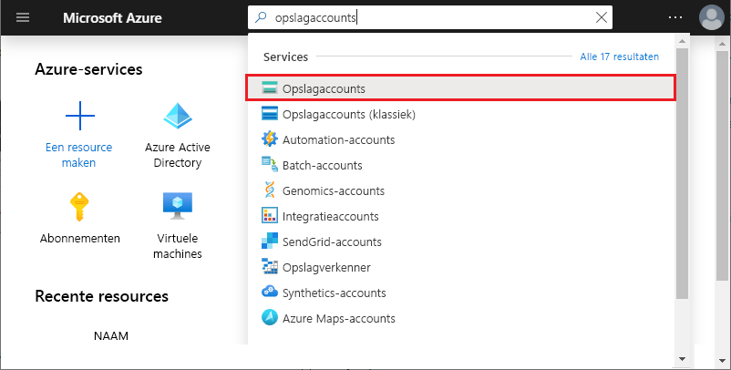
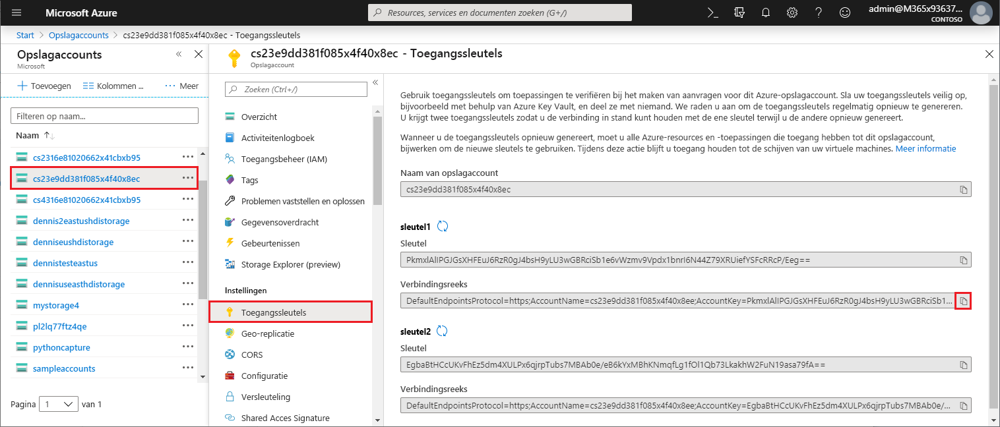
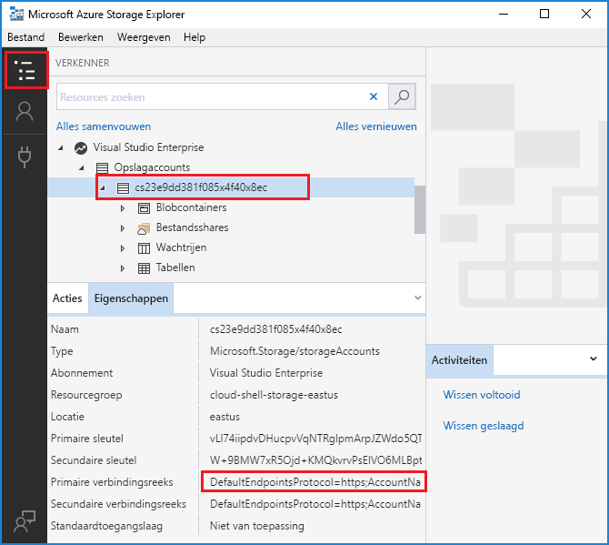

# <a name="work-with-azure-functions-core-tools"></a>Werken met Azure Functions Core Tools

Met Azure Functions Core Tools kunt u uw functies op de lokale computer ontwikkelen en testen vanaf de opdracht prompt of Terminal. Uw lokale functies kunnen verbinding maken met Live Azure-Services, en u kunt fouten opsporen in uw functies op uw lokale computer met behulp van de volledige functions-runtime. U kunt zelfs een functie-app implementeren in uw Azure-abonnement.

[!INCLUDE [Don't mix development environments](../../includes/functions-mixed-dev-environments.md)]

Het ontwikkelen van functies op uw lokale computer en het publiceren van deze naar Azure met behulp van kern Hulpprogramma's volgt deze basis stappen:

> [!div class="checklist"]
> * [Installeer de kern Hulpprogramma's en-afhankelijkheden.](#v2)
> * [Een functie-app-project maken op basis van een taalspecifieke sjabloon.](#create-a-local-functions-project)
> * [Registreer trigger-en binding-extensies.](#register-extensions)
> * [Geef opslag en andere verbindingen op.](#local-settings-file)
> * [Een functie maken op basis van een trigger en een taalspecifieke sjabloon.](#create-func)
> * [Voer de functie lokaal uit.](#start)
> * [Publiceer het project naar Azure.](#publish)

## <a name="core-tools-versions"></a>Versies van Core Tools

Er zijn drie versies van Azure Functions Core Tools. Welke versie u gebruikt, is afhankelijk van uw lokale ontwikkel omgeving, de [keuze van de taal](supported-languages.md)en het vereiste ondersteunings niveau:

+ **Versie 1. x**: ondersteunt versie 1. x van de Azure functions runtime. Deze versie van de hulpprogram ma's wordt alleen ondersteund op Windows-computers en wordt geïnstalleerd vanuit een [NPM-pakket](https://www.npmjs.com/package/azure-functions-core-tools).

+ [**Versie 2. x/3. x**](#v2): ondersteunt [versie 2. x of 3. x van de Azure functions runtime](functions-versions.md). Deze versies ondersteunen [Windows](/azure/azure-functions/functions-run-local?tabs=windows#v2), [macOS](/azure/azure-functions/functions-run-local?tabs=macos#v2)en [Linux](/azure/azure-functions/functions-run-local?tabs=linux#v2) en gebruiken platformspecifieke pakket beheerders of NPM voor installatie.

Tenzij anders vermeld, zijn de voor beelden in dit artikel van versie 3. x.

## <a name="install-the-azure-functions-core-tools"></a>Azure Functions Core Tools installeren

[Azure functions core tools] bevat een versie van dezelfde runtime die voorziet in azure functions runtime die u kunt uitvoeren op uw lokale ontwikkel computer. Het bevat ook opdrachten voor het maken van functies, verbinding maken met Azure en functie projecten implementeren.

>[!IMPORTANT]
>U moet de [Azure cli](/cli/azure/install-azure-cli) lokaal hebben geïnstalleerd om te kunnen publiceren naar Azure vanaf Azure functions core tools.  

### <a name="version-2x-and-3x"></a><a name="v2"></a>Versie 2. x en 3. x

Versie 2. x/3. x van de hulpprogram ma's maakt gebruik van de Azure Functions runtime die is gebouwd op .NET core. Deze versie wordt ondersteund op alle platformen .NET core ondersteunt, waaronder [Windows](/azure/azure-functions/functions-run-local?tabs=windows#v2), [macOS](/azure/azure-functions/functions-run-local?tabs=macos#v2)en [Linux](/azure/azure-functions/functions-run-local?tabs=linux#v2). 

> [!IMPORTANT]
> U kunt de vereiste voor het installeren van de .NET Core SDK overs Laan door gebruik te maken van [uitbreidings bundels].

# <a name="windows"></a>[Windows](#tab/windows)

In de volgende stappen wordt NPM gebruikt om de belangrijkste Hulpprogram Ma's in Windows te installeren. U kunt ook [Choco lade](https://chocolatey.org/)gebruiken. Zie het Leesmij-bestand met [belangrijkste Hulpprogram ma's](https://github.com/Azure/azure-functions-core-tools/blob/master/README.md#windows)voor meer informatie.

1. Installeer [Node.js], dat NPM omvat.
    - Voor versie 2. x van de hulpprogram ma's worden alleen Node.js 8,5 en latere versies ondersteund.
    - Voor versie 3. x van de hulpprogram ma's worden alleen Node.js 10 en latere versies ondersteund.

1. Installeer het pakket met kern Hulpprogramma's:

    ##### <a name="v2x"></a>v2. x

    ```cmd
    npm install -g azure-functions-core-tools
    ```

    ##### <a name="v3x"></a>v3. x

    ```cmd
    npm install -g azure-functions-core-tools@3
    ```

   Het kan enkele minuten duren voordat NPM het pakket met kern Hulpprogramma's downloadt en installeert.

1. Als u geen [uitbreidings bundels]wilt gebruiken, installeert u de [.net Core 2. x SDK voor Windows](https://www.microsoft.com/net/download/windows).

# <a name="macos"></a>[MacOS](#tab/macos)

In de volgende stappen wordt homebrew gebruikt om de belangrijkste Hulpprogram Ma's voor macOS te installeren.

1. Installeer [homebrew](https://brew.sh/)als dit nog niet is gebeurd.

1. Installeer het pakket met kern Hulpprogramma's:

    ##### <a name="v2x"></a>v2. x

    ```bash
    brew tap azure/functions
    brew install azure-functions-core-tools
    ```

    ##### <a name="v3x"></a>v3. x

    ```bash
    brew tap azure/functions
    brew install azure-functions-core-tools@3
    # if upgrading on a machine that has 2.x installed
    brew link --overwrite azure-functions-core-tools@3
    ```

# <a name="linux"></a>[Linux](#tab/linux)

De volgende stappen gebruiken [apt](https://wiki.debian.org/Apt) om kern hulpprogramma's te installeren op uw Ubuntu/Debian Linux-distributie. Raadpleeg het Leesmij-bestand voor de [belangrijkste Hulpprogram ma's](https://github.com/Azure/azure-functions-core-tools/blob/master/README.md#linux)voor andere Linux-distributies.

1. Installeer de micro soft package repository GPG-sleutel om de pakket integriteit te valideren:

    ```bash
    curl https://packages.microsoft.com/keys/microsoft.asc | gpg --dearmor > microsoft.gpg
    sudo mv microsoft.gpg /etc/apt/trusted.gpg.d/microsoft.gpg
    ```

1. Stel de .NET-ontwikkel bron lijst in voordat u een APT-update uitvoert.

   Voer de volgende opdracht uit om de APT-bron lijst voor Ubuntu in te stellen:

    ```bash
    sudo sh -c 'echo "deb [arch=amd64] https://packages.microsoft.com/repos/microsoft-ubuntu-$(lsb_release -cs)-prod $(lsb_release -cs) main" > /etc/apt/sources.list.d/dotnetdev.list'
    ```

   Voer de volgende opdracht uit om de APT-bron lijst voor Debian in te stellen:

    ```bash
    sudo sh -c 'echo "deb [arch=amd64] https://packages.microsoft.com/debian/$(lsb_release -rs | cut -d'.' -f 1)/prod $(lsb_release -cs) main" > /etc/apt/sources.list.d/dotnetdev.list'
    ```

1. Controleer het `/etc/apt/sources.list.d/dotnetdev.list` bestand op een van de juiste Linux-versie teken reeksen die hieronder worden weer gegeven:

    | Linux-distributie | Versie |
    | --------------- | ----------- |
    | Debian 9 | `stretch` |
    | Debian 8 | `jessie` |
    | Ubuntu 18,10    | `cosmic`    |
    | Ubuntu 18.04    | `bionic`    |
    | Ubuntu 17,04    | `zesty`     |
    | Ubuntu 16.04/Linux licht 18    | `xenial`  |

1. Start de APT-bron update:

    ```bash
    sudo apt-get update
    ```

1. Installeer het pakket met kern Hulpprogramma's:

    ```bash
    sudo apt-get install azure-functions-core-tools
    ```

1. Als u geen [uitbreidings bundels]wilt gebruiken, installeert u [.net Core 2. x SDK voor Linux](https://www.microsoft.com/net/download/linux).

---

## <a name="create-a-local-functions-project"></a>Een lokaal Functions-project maken

Een project directory functions bevat de bestanden [host.jsop](functions-host-json.md) en [local.settings.jsop](#local-settings-file), samen met submappen die de code voor afzonderlijke functies bevatten. Deze map is het equivalent van een functie-app in Azure. Zie de [hand leiding voor de Azure functions-ontwikkel aars](functions-reference.md#folder-structure)voor meer informatie over de mapstructuur van de functies.

Versie 2. x vereist dat u een standaard taal voor uw project selecteert wanneer deze wordt geïnitialiseerd. In versie 2. x worden alle functies toegevoegd standaard taal sjablonen gebruiken. In versie 1. x geeft u de taal op telkens wanneer u een functie maakt.

Voer in het Terminal venster of vanaf een opdracht prompt de volgende opdracht uit om het project en de lokale Git-opslag plaats te maken:

```
func init MyFunctionProj
```

Wanneer u een project naam opgeeft, wordt een nieuwe map met die naam gemaakt en geïnitialiseerd. Anders wordt de huidige map geïnitialiseerd.  
In versie 2. x, wanneer u de opdracht uitvoert, moet u een runtime voor uw project kiezen. 

<pre>
Select a worker runtime:
dotnet
node
python 
powershell
</pre>

Gebruik de pijl omhoog/omlaag om een taal te kiezen en druk vervolgens op ENTER. Als u van plan bent java script-of type script-functies te ontwikkelen, kiest u **knoop punt**en selecteert u vervolgens de taal. Type script heeft [een aantal aanvullende vereisten](functions-reference-node.md#typescript). 

De uitvoer ziet eruit als in het volgende voor beeld voor een Java script-project:

<pre>
Select a worker runtime: node
Writing .gitignore
Writing host.json
Writing local.settings.json
Writing C:\myfunctions\myMyFunctionProj\.vscode\extensions.json
Initialized empty Git repository in C:/myfunctions/myMyFunctionProj/.git/
</pre>

`func init`biedt ondersteuning voor de volgende opties: versie 2. x-only, tenzij anders vermeld.

| Optie     | Description                            |
| ------------ | -------------------------------------- |
| **`--csharp`**<br/> **`--dotnet`** | Initialiseert een [C#-Class Library-project (. cs)](functions-dotnet-class-library.md). |
| **`--csx`** | Initialiseert een [C# script-project (. CSX)](functions-reference-csharp.md). U moet `--csx` in volgende opdrachten opgeven. |
| **`--docker`** | Maak een Dockerfile voor een container met behulp van een basis installatie kopie op basis van de gekozen `--worker-runtime` . Gebruik deze optie wanneer u van plan bent om te publiceren naar een aangepaste Linux-container. |
| **`--docker-only`** |  Hiermee wordt een Dockerfile toegevoegd aan een bestaand project. Hiermee wordt u gevraagd om de werk nemer-runtime als deze niet is opgegeven of ingesteld in local.settings.jsop. Gebruik deze optie wanneer u van plan bent een bestaand project te publiceren naar een aangepaste Linux-container. |
| **`--force`** | Initialiseer het project zelfs wanneer er bestaande bestanden in het project aanwezig zijn. Deze instelling overschrijft bestaande bestanden met dezelfde naam. Andere bestanden in de projectmap worden niet beïnvloed. |
| **`--java`**  | Initialiseert een [Java-project](functions-reference-java.md). |
| **`--javascript`**<br/>**`--node`**  | Initialiseert een [Java script-project](functions-reference-node.md). |
| **`--no-source-control`**<br/>**`-n`** | Hiermee wordt voor komen dat een Git-opslag plaats standaard wordt gemaakt in versie 1. x. In versie 2. x wordt de Git-opslag plaats standaard niet gemaakt. |
| **`--powershell`**  | Initialiseert een [Power Shell-project](functions-reference-powershell.md). |
| **`--python`**  | Initialiseert een [python-project](functions-reference-python.md). |
| **`--source-control`** | Hiermee wordt bepaald of een Git-opslag plaats wordt gemaakt. Een opslag plaats wordt standaard niet gemaakt. Wanneer `true` wordt een opslag plaats gemaakt. |
| **`--typescript`**  | Initialiseert een [type script-project](functions-reference-node.md#typescript). |
| **`--worker-runtime`** | Hiermee stelt u de taal runtime voor het project in. Ondersteunde waarden zijn: `csharp` , `dotnet` , `java` , `javascript` , `node` (Java script), `powershell` , en `python` `typescript` . Wanneer deze niet is ingesteld, wordt u gevraagd uw runtime te kiezen tijdens de initialisatie. |

> [!IMPORTANT]
> Versie 2. x van de kern Hulpprogramma's maakt standaard functie-app-projecten voor de .NET-runtime als [C#-klassen projecten](functions-dotnet-class-library.md) (. csproj). Deze C#-projecten, die kunnen worden gebruikt met Visual Studio of Visual Studio code, worden gecompileerd tijdens het testen en bij het publiceren naar Azure. Als u in plaats daarvan dezelfde C# script bestanden (. CSX) wilt maken en gebruiken die zijn gemaakt in versie 1. x en in de portal, moet u de `--csx` para meter toevoegen wanneer u functies maakt en implementeert.

[!INCLUDE [functions-core-tools-install-extension](../../includes/functions-core-tools-install-extension.md)]

[!INCLUDE [functions-local-settings-file](../../includes/functions-local-settings-file.md)]

Deze instellingen worden standaard niet automatisch gemigreerd wanneer het project wordt gepubliceerd naar Azure. Gebruik de `--publish-local-settings` Switch [Wanneer u publiceert](#publish) om ervoor te zorgen dat deze instellingen worden toegevoegd aan de functie-app in Azure. Houd er rekening mee dat waarden in **Connections Tring** nooit worden gepubliceerd.

De waarden van de functie-app-instellingen kunnen ook in uw code worden gelezen als omgevings variabelen. Zie de sectie omgevings variabelen van deze taalspecifieke naslag onderwerpen voor meer informatie:

* [Vooraf gecompileerde C#](functions-dotnet-class-library.md#environment-variables)
* [C#-script (.csx)](functions-reference-csharp.md#environment-variables)
* [Java](functions-reference-java.md#environment-variables)
* [JavaScript](functions-reference-node.md#environment-variables)

Als er geen geldige opslag connection string is ingesteld voor [`AzureWebJobsStorage`] en de emulator niet wordt gebruikt, wordt het volgende fout bericht weer gegeven:

> Ontbrekende waarde voor AzureWebJobsStorage in local.settings.jsop. Dit is vereist voor alle triggers behalve HTTP. U kunt func Azure functionapp fetch-app-Settings uitvoeren \<functionAppName\> of een Connection String in local.settings.jsopgeven.

### <a name="get-your-storage-connection-strings"></a>Uw opslag verbindings reeksen ophalen

Zelfs wanneer u de Microsoft Azure-opslagemulator voor ontwikkeling gebruikt, wilt u wellicht testen met een echte opslag verbinding. Ervan uitgaande dat u al [een opslag account hebt gemaakt](../storage/common/storage-create-storage-account.md), kunt u op een van de volgende manieren een geldig opslag Connection String krijgen:

- Zoek en selecteer **opslag accounts**vanuit het [Azure Portal]. 
  
  
  Selecteer uw opslag account, selecteer **toegangs sleutels** in **instellingen**en kopieer een van de **verbindings reeks** waarden.
  

- Gebruik [Azure Storage Explorer](https://storageexplorer.com/) om verbinding te maken met uw Azure-account. In de **Explorer**breidt u uw abonnement uit, vouwt u **opslag accounts**uit, selecteert u uw opslag account en kopieert u de primaire of secundaire Connection String.

  

+ Gebruik de basis Hulpprogramma's om de connection string te downloaden van Azure met een van de volgende opdrachten:

  + Alle instellingen van een bestaande functie-app downloaden:

    ```
    func azure functionapp fetch-app-settings <FunctionAppName>
    ```
  + De verbindings reeks ophalen voor een specifiek opslag account:

    ```
    func azure storage fetch-connection-string <StorageAccountName>
    ```

    Wanneer u nog niet bent aangemeld bij Azure, wordt u gevraagd dit te doen.

## <a name="create-a-function"></a><a name="create-func"></a>Een functie maken

Voer de volgende opdracht uit om een functie te maken:

```
func new
```

In versie 2. x, wanneer u uitvoert, wordt u `func new` gevraagd een sjabloon in de standaard taal van uw functie-app te kiezen. vervolgens wordt u gevraagd om een naam voor de functie te kiezen. In versie 1. x wordt u ook gevraagd om de taal te kiezen.

<pre>
Select a language: Select a template:
Blob trigger
Cosmos DB trigger
Event Grid trigger
HTTP trigger
Queue trigger
SendGrid
Service Bus Queue trigger
Service Bus Topic trigger
Timer trigger
</pre>

Functie code wordt gegenereerd in een submap met de naam van de geleverde functie, zoals u kunt zien in de volgende uitvoer van de wachtrij trigger:

<pre>
Select a language: Select a template: Queue trigger
Function name: [QueueTriggerJS] MyQueueTrigger
Writing C:\myfunctions\myMyFunctionProj\MyQueueTrigger\index.js
Writing C:\myfunctions\myMyFunctionProj\MyQueueTrigger\readme.md
Writing C:\myfunctions\myMyFunctionProj\MyQueueTrigger\sample.dat
Writing C:\myfunctions\myMyFunctionProj\MyQueueTrigger\function.json
</pre>

U kunt deze opties ook opgeven in de opdracht met behulp van de volgende argumenten:

| Argument     | Description                            |
| ------------------------------------------ | -------------------------------------- |
| **`--csx`** | (Versie 2. x) Genereert dezelfde C# script-sjablonen (. CSX) die worden gebruikt in versie 1. x en in de portal. |
| **`--language`**, **`-l`**| De programmeer taal van de sjabloon, zoals C#, F # of Java script. Deze optie is vereist in versie 1. x. In versie 2. x gebruikt u deze optie niet of kiest u een taal die overeenkomt met de runtime van de werk nemer. |
| **`--name`**, **`-n`** | De functie naam. |
| **`--template`**, **`-t`** | Gebruik de `func templates list` opdracht om de volledige lijst met beschik bare sjablonen voor elke ondersteunde taal weer te geven.   |

Als u bijvoorbeeld een Java script-trigger in één opdracht wilt maken, voert u het volgende uit:

```
func new --template "Http Trigger" --name MyHttpTrigger
```

Als u een in een wachtrij geactiveerde functie wilt maken in één opdracht, voert u het volgende uit:

```
func new --template "Queue Trigger" --name QueueTriggerJS
```

## <a name="run-functions-locally"></a><a name="start"></a>Functies lokaal uitvoeren

Als u een functions-project wilt uitvoeren, voert u de host functions uit. De host schakelt triggers in voor alle functies in het project. De start opdracht varieert, afhankelijk van de taal van uw project.

# <a name="c"></a>[G\#](#tab/csharp)

```
func start --build
```
# <a name="javascript"></a>[JavaScript](#tab/node)

```
func start
```

# <a name="python"></a>[Python](#tab/python)

```
func start
```
Deze opdracht moet worden [uitgevoerd in een virtuele omgeving](/azure/azure-functions/functions-create-first-azure-function-azure-cli?pivots=programming-language-python#create-venv).

# <a name="typescript"></a>[TypeScript](#tab/ts)

```
npm install
npm start     
```

---

>[!NOTE]  
> Versie 1. x van de functions runtime vereist de `host` opdracht, zoals in het volgende voor beeld:
>
> ```
> func host start
> ```

`func start`biedt ondersteuning voor de volgende opties:

| Optie     | Description                            |
| ------------ | -------------------------------------- |
| **`--no-build`** | Pas het huidige project niet samen om uit te voeren. Alleen voor dotnet-projecten. De standaard waarde is ingesteld op ONWAAR. Niet ondersteund voor versie 1. x. |
| **`--cert`** | Het pad naar een pfx-bestand dat een persoonlijke sleutel bevat. Alleen gebruikt met `--useHttps` . Niet ondersteund voor versie 1. x. |
| **`--cors-credentials`** | Toestaan dat geauthenticeerde cross-Origin-aanvragen (cookies en de header Authentication) worden niet ondersteund voor versie 1. x. |
| **`--cors`** | Een door komma's gescheiden lijst met CORS-oorsprong, zonder spaties. |
| **`--language-worker`** | Argumenten voor het configureren van de taal medewerker. U kunt bijvoorbeeld fout opsporing voor taal werk nemer inschakelen door [poort voor fout opsporing en andere vereiste argumenten](https://github.com/Azure/azure-functions-core-tools/wiki/Enable-Debugging-for-language-workers)op te geven. Niet ondersteund voor versie 1. x. |
| **`--nodeDebugPort`**, **`-n`** | De poort voor het Node.js-fout opsporingsprogramma dat moet worden gebruikt. Standaard: een waarde van launch.jsop of 5858. Alleen versie 1. x. |
| **`--password`** | Ofwel het wacht woord of een bestand dat het wacht woord voor een pfx-bestand bevat. Alleen gebruikt met `--cert` . Niet ondersteund voor versie 1. x. |
| **`--port`**, **`-p`** | De lokale poort waarop moet worden geluisterd. Standaard waarde: 7071. |
| **`--pause-on-error`** | Wacht op extra invoer voordat het proces wordt afgesloten. Wordt alleen gebruikt bij het starten van kern Hulpprogramma's van een Integrated Development Environment (IDE).|
| **`--script-root`**, **`--prefix`** | Hiermee geeft u het pad op naar de hoofdmap van de functie-app die moet worden uitgevoerd of geïmplementeerd. Dit wordt gebruikt voor gecompileerde projecten die Project bestanden in een submap genereren. Wanneer u bijvoorbeeld een C#-klassen bibliotheek project bouwt, worden de host.jsop, local.settings.jsaan en function.jsop bestanden gegenereerd in een *hoofdmap* met een pad zoals `MyProject/bin/Debug/netstandard2.0` . In dit geval stelt u het voor voegsel in als `--script-root MyProject/bin/Debug/netstandard2.0` . Dit is de basis van de functie-app wanneer deze wordt uitgevoerd in Azure. |
| **`--timeout`**, **`-t`** | De time-out voor het starten van de functions-host, in seconden. Standaard: 20 seconden.|
| **`--useHttps`** | Maak een binding aan `https://localhost:{port}` in plaats van aan `http://localhost:{port}` . Met deze optie wordt standaard een vertrouwd certificaat op uw computer gemaakt.|

Wanneer de functie host wordt gestart, wordt de URL van de met HTTP geactiveerde functies uitgevoerd:

<pre>
Found the following functions:
Host.Functions.MyHttpTrigger

Job host started
Http Function MyHttpTrigger: http://localhost:7071/api/MyHttpTrigger
</pre>

>[!IMPORTANT]
>Bij lokaal uitvoeren wordt de autorisatie niet afgedwongen voor HTTP-eind punten. Dit betekent dat alle lokale HTTP-aanvragen worden verwerkt als `authLevel = "anonymous"` . Zie het artikel over de [http-binding](functions-bindings-http-webhook-trigger.md#authorization-keys)voor meer informatie.

### <a name="passing-test-data-to-a-function"></a>Test gegevens door geven aan een functie

Als u uw functies lokaal wilt testen, [start u de functies host](#start) en roept u eind punten aan op de lokale server met behulp van HTTP-aanvragen. Het eind punt dat u aanroept, is afhankelijk van het type functie.

>[!NOTE]
> Voor beelden in dit onderwerp gebruiken het krul hulp programma voor het verzenden van HTTP-aanvragen van de terminal of een opdracht prompt. U kunt een hulp programma van uw keuze gebruiken om HTTP-aanvragen naar de lokale server te verzenden. Het krul hulp programma is standaard beschikbaar op Linux-systemen en Windows 10 build 17063 en hoger. In oudere versies van Windows moet u eerst het [krul hulp programma](https://curl.haxx.se/)downloaden en installeren.

Zie [strategieën voor het testen van uw code in azure functions](functions-test-a-function.md)voor meer algemene informatie over het testen van functies.

#### <a name="http-and-webhook-triggered-functions"></a>Geactiveerde HTTP-en webhook-functies

U roept het volgende eind punt aan om HTTP en door de webhook geactiveerde functies lokaal uit te voeren:

    http://localhost:{port}/api/{function_name}

Zorg ervoor dat u dezelfde server naam en poort gebruikt als waarop de host van de functies luistert. U ziet dit in de uitvoer die wordt gegenereerd bij het starten van de host van de functie. U kunt deze URL aanroepen met de HTTP-methode die wordt ondersteund door de trigger.

Met de volgende krul opdracht wordt de Quick Start- `MyHttpTrigger` functie geactiveerd vanuit een GET-aanvraag met de para meter _name_ door gegeven in de query teken reeks.

```
curl --get http://localhost:7071/api/MyHttpTrigger?name=Azure%20Rocks
```

Het volgende voor beeld is dezelfde functie die wordt aangeroepen vanuit een POST-aanvraag voor het door geven van een _naam_ in de hoofd tekst van de aanvraag:

# <a name="bash"></a>[Bash](#tab/bash)
```bash
curl --request POST http://localhost:7071/api/MyHttpTrigger --data '{"name":"Azure Rocks"}'
```
# <a name="cmd"></a>[Cmd](#tab/cmd)
```cmd
curl --request POST http://localhost:7071/api/MyHttpTrigger --data "{'name':'Azure Rocks'}"
```
---

U kunt GET-aanvragen indienen vanuit een browser waarmee gegevens worden door gegeven in de query teken reeks. Voor alle andere HTTP-methoden moet u krul, Fiddler, Postman of een soortgelijk hulp programma voor HTTP-tests gebruiken.

#### <a name="non-http-triggered-functions"></a>Niet-HTTP-geactiveerde functies

Voor alle soorten functies behalve HTTP-triggers en webhooks en Event Grid triggers kunt u uw functies lokaal testen door een beheer eindpunt aan te roepen. Als dit eind punt wordt aangeroepen met een HTTP POST-aanvraag op de lokale server, wordt de functie geactiveerd. 

Zie [Local tests with Viewer web app](functions-bindings-event-grid-trigger.md#local-testing-with-viewer-web-app)als u Event grid geactiveerde functies lokaal wilt testen.

U kunt eventueel test gegevens door geven aan de uitvoering in de hoofd tekst van de POST-aanvraag. Deze functionaliteit is vergelijkbaar met het tabblad **testen** in de Azure Portal.

U roept het volgende Administrator-eind punt aan om niet-HTTP-functies te activeren:

    http://localhost:{port}/admin/functions/{function_name}

Als u test gegevens wilt door geven aan het eind punt van de beheerder van een functie, moet u de gegevens opgeven in de hoofd tekst van een bericht van een POST-aanvraag. De hoofd tekst van het bericht moet de volgende JSON-indeling hebben:

```JSON
{
    "input": "<trigger_input>"
}
```

De `<trigger_input>` waarde bevat gegevens in een indeling die door de functie wordt verwacht. Het volgende krul-voor beeld is een POST naar een `QueueTriggerJS` functie. In dit geval is de invoer een teken reeks die overeenkomt met het bericht dat naar verwachting in de wachtrij wordt gevonden.

# <a name="bash"></a>[Bash](#tab/bash)
```bash
curl --request POST -H "Content-Type:application/json" --data '{"input":"sample queue data"}' http://localhost:7071/admin/functions/QueueTrigger
```
# <a name="cmd"></a>[Cmd](#tab/cmd)
```bash
curl --request POST -H "Content-Type:application/json" --data "{'input':'sample queue data'}" http://localhost:7071/admin/functions/QueueTrigger
```
---

#### <a name="using-the-func-run-command-version-1x-only"></a>De `func run` opdracht gebruiken (alleen versie 1. x)

>[!IMPORTANT]
> De `func run` opdracht wordt alleen ondersteund in versie 1. x van de hulpprogram ma's. Zie het onderwerp [How to Azure functions runtime-versies](set-runtime-version.md)voor meer informatie.

In versie 1. x kunt u ook rechtstreeks een functie aanroepen met behulp `func run <FunctionName>` van en invoer gegevens opgeven voor de functie. Deze opdracht is vergelijkbaar met het uitvoeren van een functie met behulp van het tabblad **testen** in de Azure Portal.

`func run`biedt ondersteuning voor de volgende opties:

| Optie     | Description                            |
| ------------ | -------------------------------------- |
| **`--content`**, **`-c`** | Inline-inhoud. |
| **`--debug`**, **`-d`** | Koppel een fout opsporingsprogramma aan het hostproces voordat u de functie uitvoert.|
| **`--timeout`**, **`-t`** | De tijd (in seconden) die moet worden gewacht totdat de lokale functions-host gereed is.|
| **`--file`**, **`-f`** | De bestands naam die moet worden gebruikt als inhoud.|
| **`--no-interactive`** | Er wordt niet gevraagd om invoer. Handig voor automatiserings scenario's.|

Als u bijvoorbeeld een door HTTP geactiveerde functie wilt aanroepen en de hoofd tekst van de inhoud wilt door geven, voert u de volgende opdracht uit:

```
func run MyHttpTrigger -c '{\"name\": \"Azure\"}'
```

## <a name="publish-to-azure"></a><a name="publish"></a>Publiceren naar Azure

De Azure Functions Core Tools ondersteunt twee typen implementaties: functie project bestanden rechtstreeks implementeren in uw functie-app via [zip-implementatie](functions-deployment-technologies.md#zip-deploy) en [een aangepaste docker-container implementeren](functions-deployment-technologies.md#docker-container). U moet al [een functie-app hebben gemaakt in uw Azure-abonnement](functions-cli-samples.md#create), waar u uw code gaat implementeren. Projecten waarvoor compilatie vereist is, moeten worden gebouwd zodat de binaire bestanden kunnen worden geïmplementeerd.

>[!IMPORTANT]
>U moet de [Azure cli](/cli/azure/install-azure-cli) lokaal hebben geïnstalleerd om te kunnen publiceren naar Azure vanuit de kern hulpprogramma's.  

Een projectmap kan taalspecifieke bestanden en mappen bevatten die niet mogen worden gepubliceerd. Uitgesloten items worden weer gegeven in een. funcignore-bestand in de hoofdmap van het project.     

### <a name="deploy-project-files"></a><a name="project-file-deployment"></a>Project bestanden implementeren

Als u uw lokale code naar een functie-app in azure wilt publiceren, gebruikt u de `publish` opdracht:

```
func azure functionapp publish <FunctionAppName>
```

Met deze opdracht wordt gepubliceerd naar een bestaande functie-app in Azure. U krijgt een fout melding als u probeert te publiceren naar een `<FunctionAppName>` die niet voor komt in uw abonnement. Zie [een functie-app maken voor serverloze uitvoering voor](./scripts/functions-cli-create-serverless.md)meer informatie over het maken van een functie-app vanuit de opdracht prompt of het Terminal venster met behulp van de Azure cli. Deze opdracht maakt standaard gebruik van [externe build](functions-deployment-technologies.md#remote-build) en implementeert uw app voor [uitvoering vanuit het implementatie pakket](run-functions-from-deployment-package.md). Als u deze aanbevolen implementatie modus wilt uitschakelen, gebruikt u de `--nozip` optie.

>[!IMPORTANT]
> Wanneer u een functie-app maakt in de Azure Portal, gebruikt deze standaard versie 2. x van de functie-runtime. Volg de instructies in [uitvoeren op versie 1. x](functions-versions.md#creating-1x-apps)om de functie-app versie 1. x van de runtime te laten gebruiken.
> U kunt de runtime versie niet wijzigen voor een functie-app met bestaande functies.

De volgende publicatie opties zijn van toepassing voor beide versies, 1. x en 2. x:

| Optie     | Description                            |
| ------------ | -------------------------------------- |
| **`--publish-local-settings -i`** |  Publiceer instellingen in local.settings.jsnaar Azure en vraag om te worden overschreven als de instelling al bestaat. Als u de Microsoft Azure-opslagemulator gebruikt, wijzigt u eerst de app-instelling in een [echte opslag verbinding](#get-your-storage-connection-strings). |
| **`--overwrite-settings -y`** | De prompt voor het overschrijven van app-instellingen onderdrukken wanneer deze wordt `--publish-local-settings -i` gebruikt.|

De volgende publicatie opties worden alleen ondersteund in versie 2. x:

| Optie     | Description                            |
| ------------ | -------------------------------------- |
| **`--publish-settings-only`**, **`-o`** |  Publiceer instellingen alleen en sla de inhoud over. De standaard instelling is prompt. |
|**`--list-ignored-files`** | Geeft een lijst weer van bestanden die worden genegeerd tijdens het publiceren, dat is gebaseerd op het. funcignore-bestand. |
| **`--list-included-files`** | Geeft een lijst weer van bestanden die zijn gepubliceerd, die zijn gebaseerd op het. funcignore-bestand. |
| **`--nozip`** | Hiermee schakelt u de standaard `Run-From-Package` modus uit. |
| **`--build-native-deps`** | Slaat de map voor het genereren van wielen op tijdens het publiceren van python-functie-apps. |
| **`--build`**, **`-b`** | Voert een build-actie uit wanneer deze wordt geïmplementeerd in een Linux-functie-app. Accepteert: `remote` en `local` . |
| **`--additional-packages`** | Lijst met pakketten die moeten worden geïnstalleerd bij het bouwen van systeem eigen afhankelijkheden. Bijvoorbeeld: `python3-dev libevent-dev`. |
| **`--force`** | Verificatie vooraf publiceren in bepaalde scenario's negeren. |
| **`--csx`** | Publiceer een C# script-project (. CSX). |
| **`--no-build`** | Maak geen .NET Class Library-functies. |
| **`--dotnet-cli-params`** | Bij het publiceren van gecompileerde C#-functies (. csproj) roept de kern hulpprogramma's ' DotNet build--output bin/Publish ' aan. Alle para meters die aan dit worden door gegeven, worden toegevoegd aan de opdracht regel. |

### <a name="deploy-custom-container"></a>Aangepaste container implementeren

Met Azure Functions kunt u uw functie project implementeren in een [aangepaste docker-container](functions-deployment-technologies.md#docker-container). Zie [een functie maken in Linux met behulp van een aangepaste installatie kopie](functions-create-function-linux-custom-image.md)voor meer informatie. Aangepaste containers moeten een Dockerfile hebben. Als u een app met een Dockerfile wilt maken, gebruikt u de optie-Dockerfile op `func init` .

```
func deploy
```

De volgende opties voor de implementatie van de aangepaste container zijn beschikbaar:

| Optie     | Description                            |
| ------------ | -------------------------------------- |
| **`--registry`** | De naam van een docker-REGI ster waarmee de huidige gebruiker zich heeft aangemeld. |
| **`--platform`** | Hosting platform voor de functie-app. Geldige opties zijn`kubernetes` |
| **`--name`** | Naam van de functie-app. |
| **`--max`**  | Hiermee stelt u eventueel het maximum aantal functie-app-exemplaren in dat moet worden geïmplementeerd. |
| **`--min`**  | Hiermee stelt u optioneel het minimum aantal functie-app-exemplaren in dat moet worden geïmplementeerd. |
| **`--config`** | Hiermee stelt u een optioneel implementatie configuratie bestand in. |

## <a name="monitoring-functions"></a>Functies bewaken

De aanbevolen manier om de uitvoering van uw functies te controleren is door te integreren met Azure-toepassing Insights. U kunt ook uitvoerings logboeken streamen naar uw lokale computer. Zie [Azure functions bewaken](functions-monitoring.md)voor meer informatie.

### <a name="application-insights-integration"></a>Integratie van Application Insights

Application Insights integratie moet worden ingeschakeld wanneer u de functie-app in azure maakt. Als uw functie-app om een bepaalde reden niet is verbonden met een Application Insights-exemplaar, is het eenvoudig om deze integratie uit te voeren in de Azure Portal. 

[!INCLUDE [functions-connect-new-app-insights.md](../../includes/functions-connect-new-app-insights.md)]

### <a name="enable-streaming-logs"></a>Streaming-logboeken inschakelen

U kunt een stroom weer geven van de logboek bestanden die worden gegenereerd door uw functies in een opdracht regel sessie op uw lokale computer. 

#### <a name="native-streaming-logs"></a>Systeem eigen streaming-logboeken

[!INCLUDE [functions-streaming-logs-core-tools](../../includes/functions-streaming-logs-core-tools.md)]

Voor dit type streaming-logboeken moet Application Insights integratie zijn ingeschakeld voor uw functie-app.   


## <a name="next-steps"></a>Volgende stappen

Meer informatie over het ontwikkelen, testen en publiceren van Azure Functions met behulp van Azure Functions Core Tools [micro soft-leer module](https://docs.microsoft.com/learn/modules/develop-test-deploy-azure-functions-with-core-tools/) Azure functions core tools is [open source en wordt gehost op github](https://github.com/azure/azure-functions-cli).  
[Open een github-probleem](https://github.com/azure/azure-functions-cli/issues)als u een fout of een functie aanvraag wilt indienen.

<!-- LINKS -->

[Azure Functions Core Tools]: https://www.npmjs.com/package/azure-functions-core-tools
[Azure-portal]: https://portal.azure.com 
[Node.js]: https://docs.npmjs.com/getting-started/installing-node#osx-or-windows
[`FUNCTIONS_WORKER_RUNTIME`]: functions-app-settings.md#functions_worker_runtime
['AzureWebJobsStorage']: functions-app-settings.md#azurewebjobsstorage
[uitbreidings bundels]: functions-bindings-register.md#extension-bundles
