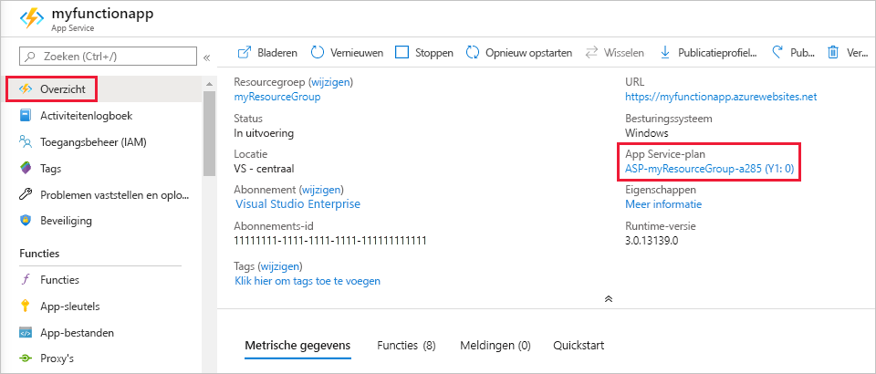
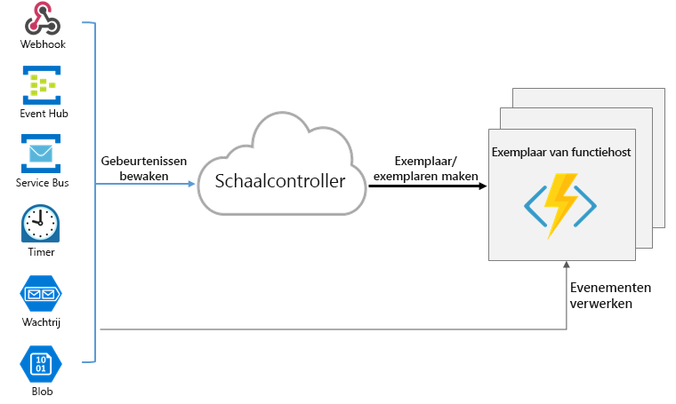

# <a name="azure-functions-scale-and-hosting"></a>Schaal en hosting van Azure Functions

Wanneer u een functie-app in azure maakt, moet u een hosting abonnement kiezen voor uw app. Er zijn drie elementaire hosting plannen beschikbaar voor Azure Functions: [verbruiks abonnement](#consumption-plan), [Premium plan](#premium-plan)en [toegewezen (app service)-abonnement](#app-service-plan). Alle hosting plannen zijn algemeen beschikbaar (GA) op virtuele machines met Linux en Windows.

Het hosting abonnement dat u kiest, bepaalt het volgende gedrag:

* Hoe de functie-app wordt geschaald.
* De bronnen die beschikbaar zijn voor elk exemplaar van de functie-app.
* Ondersteuning voor geavanceerde functies, zoals Azure Virtual Network-connectiviteit.

Zowel verbruik als Premium-abonnementen voegen automatisch reken kracht toe wanneer uw code wordt uitgevoerd. Uw app wordt uitgeschaald wanneer dit nodig is om de belasting te verwerken, en geschaald wanneer de uitvoering van de code wordt gestopt. Voor het verbruiks abonnement hoeft u ook niet vooraf te betalen voor niet-actieve Vm's of reserve ring van capaciteit.  

Premium-abonnement biedt extra functies, zoals Premium Compute-instanties, waarmee instanties voor onbepaalde tijd en VNet-connectiviteit kunnen worden bewaard.

Met App Service plan kunt u profiteren van de toegewezen infra structuur, die u beheert. De functie-app kan niet worden geschaald op basis van gebeurtenissen, wat betekent dat nooit wordt geschaald naar nul. (Vereist dat [Always on](#always-on) is ingeschakeld.)

Zie de [sectie vergelijkings abonnementen](#hosting-plans-comparison)voor een gedetailleerde vergelijking tussen de verschillende hosting plannen (inclusief op Kubernetes gebaseerde hosting).

## <a name="consumption-plan"></a>Verbruiksabonnement

Wanneer u het verbruiks abonnement gebruikt, worden instanties van de Azure Functions-host dynamisch toegevoegd en verwijderd op basis van het aantal binnenkomende gebeurtenissen. Dit serverloze abonnement wordt automatisch geschaald en u betaalt alleen voor rekenresources wanneer uw functies worden uitgevoerd. Bij een verbruiksabonnement treedt er na een ingestelde periode een time-out op voor een functie-uitvoering.

De facturering is dan ook gebaseerd op het aantal uitvoeringen, de uitvoeringstijd en het gebruikte geheugen. De facturering wordt samengevoegd voor alle functies in een functie-app. Zie de pagina met prijzen voor [Azure functions](https://azure.microsoft.com/pricing/details/functions/)voor meer informatie.

Het verbruiks abonnement is het standaard hosting plan en biedt de volgende voor delen:

* Betaal alleen wanneer uw functies worden uitgevoerd
* Automatisch uitschalen, zelfs tijdens peri Oden van hoge belasting

Functie-apps in dezelfde regio kunnen worden toegewezen aan hetzelfde verbruiks plan. Er is geen nadeel of gevolgen voor het uitvoeren van meerdere apps in hetzelfde verbruiks abonnement. Het toewijzen van meerdere apps aan hetzelfde verbruiks plan heeft geen invloed op de flexibiliteit, schaal baarheid of betrouw baarheid van elke app.

Zie voor meer informatie over het schatten van kosten bij het uitvoeren van een verbruiks abonnement de [kosten van verbruiks plan](functions-consumption-costs.md).

## <a name="premium-plan"></a><a name="premium-plan"></a>Premium-abonnement

Wanneer u het Premium-abonnement gebruikt, worden exemplaren van de Azure Functions-host toegevoegd en verwijderd op basis van het aantal binnenkomende gebeurtenissen, net als het verbruiks abonnement.  Premium-abonnement biedt ondersteuning voor de volgende functies:

* Ongebruikte en warme exemplaren om te voor komen dat ze koud worden gestart
* VNet-connectiviteit
* Onbeperkte uitvoerings duur (60 minuten gegarandeerd)
* Grootte van Premium-instanties (één kern, twee kernen en vier kern instanties)
* Meer voorspel bare prijzen
* App-toewijzing met hoge densiteit voor plannen met meerdere functie-apps

Zie [Azure functions Premium-abonnement](functions-premium-plan.md)voor meer informatie over hoe u een functie-app kunt maken in een Premium-abonnement.

In plaats van de facturering per uitvoering en het verbruikte geheugen, wordt de facturering voor het Premium-abonnement gebaseerd op het aantal kern seconden en het geheugen dat voor de benodigde en vooraf gewarmte instanties wordt gebruikt. Ten minste één exemplaar moet op elk moment per plan warm zijn. Dit betekent dat er een mini maal maandelijks bedrag per actief abonnement is, ongeacht het aantal uitvoeringen. Houd er rekening mee dat alle functie-apps in een Premium-abonnement vooraf gewarmde en actieve instanties delen.

Bekijk het Azure Functions Premium-abonnement in de volgende situaties:

* Uw functie-apps worden continu uitgevoerd, of bijna continu.
* U hebt een groot aantal kleine uitvoeringen en beschikt over een hoog uitvoerings bedrag, maar een laag van minder dan een tweede factuur in het verbruiks abonnement.
* U hebt meer CPU-of geheugen opties nodig dan in het verbruiks abonnement is opgenomen.
* De code moet langer worden uitgevoerd dan de [Maxi maal toegestane uitvoerings tijd](#timeout) voor het verbruiks abonnement.
* U hebt functies nodig die alleen beschikbaar zijn in een Premium-abonnement, zoals verbinding met het virtuele netwerk. 

## <a name="dedicated-app-service-plan"></a><a name="app-service-plan"></a>Speciaal plan (App Service)

Uw functie-apps kunnen ook worden uitgevoerd op dezelfde specifieke Vm's als andere App Service-apps (Basic-, Standard-, Premium-en geïsoleerde Sku's).

Houd rekening met een App Service-abonnement in de volgende situaties:

* U hebt al bestaande, te weinig gebruikte virtuele machines waarop andere exemplaren van App Service worden uitgevoerd.
* U wilt een aangepaste installatie kopie opgeven waarop uw functies moeten worden uitgevoerd.

U betaalt hetzelfde voor functie-apps in een App Service plan zoals u zou doen voor andere App Service resources, zoals web-apps. Zie het [overzicht van Azure app service plannen](../app-service/overview-hosting-plans.md)voor meer informatie over de werking van het app service plan.

Met een App Service-abonnement kunt u hand matig uitschalen door meer VM-exemplaren toe te voegen. U kunt ook automatisch schalen inschakelen. Zie [aantal exemplaren hand matig of automatisch schalen](../azure-monitor/platform/autoscale-get-started.md?toc=%2fazure%2fapp-service%2ftoc.json)voor meer informatie. U kunt ook omhoog schalen door een ander App Service plan te kiezen. Zie [een app omhoog schalen in azure](../app-service/manage-scale-up.md)voor meer informatie. 

Wanneer u Java script-functies uitvoert op een App Service-abonnement, moet u een abonnement kiezen dat minder Vcpu's heeft. Zie voor meer informatie [single-core app service-abonnementen kiezen](functions-reference-node.md#choose-single-vcpu-app-service-plans). 
<!-- Note: the portal links to this section via fwlink https://go.microsoft.com/fwlink/?linkid=830855 --> 

Met een [app service Environment](../app-service/environment/intro.md) (ASE) kunt u uw functies volledig isoleren en profiteren van hoge schaal.

### <a name="always-on"></a><a name="always-on"></a>Altijd aan

Als u uitvoert met een App Service-abonnement, moet u de instelling **altijd aan** inschakelen, zodat de functie-app correct wordt uitgevoerd. Bij een App Service-abonnement wordt de runtime van functions na een paar minuten inactiviteit niet-actief, zodat alleen HTTP-triggers uw functies kunnen activeren. Always on is alleen beschikbaar voor een App Service plan. In een verbruiks abonnement activeert het platform automatisch functie-apps.

[!INCLUDE [Timeout Duration section](../../includes/functions-timeout-duration.md)]


Zelfs met Always ingeschakeld, wordt de time-out voor de uitvoering van afzonderlijke functies bepaald door de `functionTimeout` instelling in het [host.jsvan](functions-host-json.md#functiontimeout) het project bestand.

## <a name="determine-the-hosting-plan-of-an-existing-application"></a>Het hosting plan van een bestaande toepassing bepalen

Zie **app service plan** op het tabblad **overzicht** voor de functie-app in de [Azure Portal](https://portal.azure.com)om het hosting plan te bepalen dat door uw functie-app wordt gebruikt. Als u de prijs categorie wilt zien, selecteert u de naam van het **app service plan**en selecteert u vervolgens **Eigenschappen** in het linkerdeel venster.



U kunt de Azure CLI ook gebruiken om het plan als volgt te bepalen:

```azurecli-interactive
appServicePlanId=$(az functionapp show --name <my_function_app_name> --resource-group <my_resource_group> --query appServicePlanId --output tsv)
az appservice plan list --query "[?id=='$appServicePlanId'].sku.tier" --output tsv
```  

Wanneer de uitvoer van deze opdracht is `dynamic` , bevindt uw functie-app zich in het verbruiks abonnement. Wanneer de uitvoer van deze opdracht is `ElasticPremium` , is uw functie-app in het Premium-abonnement. Alle andere waarden geven verschillende lagen van een App Service plan aan.

## <a name="storage-account-requirements"></a>Vereisten voor een opslagaccount

Voor een wille keurig abonnement is voor een functie-app een algemeen Azure Storage account vereist, dat Azure Blob, wachtrij, bestanden en tabel opslag ondersteunt. Dit komt omdat Azure Functions afhankelijk is van Azure Storage voor bewerkingen, zoals het beheren van triggers en de uitvoering van logboek functies, maar sommige opslag accounts bieden geen ondersteuning voor wacht rijen en tabellen. Deze accounts, waaronder alleen Blob Storage-accounts (inclusief Premium Storage) en opslag accounts voor algemeen gebruik met zone-redundante opslag replicatie, worden uitgefilterd op basis van uw bestaande **opslag** accounts geselecteerd wanneer u een functie-app maakt.

Het opslag account dat wordt gebruikt door uw functie-app kan ook worden gebruikt door uw triggers en bindingen om uw toepassings gegevens op te slaan. Voor Storage-intensieve bewerkingen moet u echter een afzonderlijk opslag account gebruiken.  

Het is mogelijk dat meerdere functie-apps hetzelfde opslag account delen zonder problemen. (Een goed voor beeld hiervan is wanneer u meerdere apps in uw lokale omgeving ontwikkelt met behulp van de Azure Storage-emulator, die fungeert als een opslag account.) 

<!-- JH: Does using a Premium Storage account improve perf? -->

Zie [Inleiding tot de Azure Storage services](../storage/common/storage-introduction.md#core-storage-services)voor meer informatie over typen opslag accounts.

## <a name="how-the-consumption-and-premium-plans-work"></a>Hoe de verbruiks- en Premium-abonnementen werken

In de verbruiks-en Premium-abonnementen schaalt de Azure Functions-infra structuur CPU-en geheugen bronnen door extra exemplaren van de functions-host toe te voegen op basis van het aantal gebeurtenissen waarvoor de functies zijn geactiveerd. Elk exemplaar van de functions-host in het verbruiks abonnement is beperkt tot 1,5 GB aan geheugen en één CPU.  Een exemplaar van de host is de volledige functie-app, wat betekent dat alle functies binnen een functie-app resources delen binnen een exemplaar en op hetzelfde moment kunnen worden geschaald. Functie-apps die hetzelfde verbruiks abonnement delen, worden onafhankelijk geschaald.  In het Premium-abonnement bepaalt de grootte van het abonnement het beschik bare geheugen en de CPU voor alle apps in dat exemplaar.  

Functie code bestanden worden opgeslagen op Azure Files shares op het belangrijkste opslag account van de functie. Wanneer u het belangrijkste opslag account van de functie-app verwijdert, worden de functie code bestanden verwijderd en kunnen deze niet worden hersteld.

### <a name="runtime-scaling"></a>Runtime schalen

Azure Functions gebruikt een onderdeel dat de *schaal controller* wordt genoemd om de frequentie van gebeurtenissen te controleren en te bepalen of u wilt schalen of schalen. De schaal controller maakt gebruik van heuristiek voor elk trigger type. Wanneer u bijvoorbeeld een Azure Queue-opslag trigger gebruikt, wordt deze geschaald op basis van de lengte van de wachtrij en de leeftijd van het oudste wachtrij bericht.

De eenheid van de schaal voor Azure Functions is de functie-app. Wanneer de functie-app is geschaald, worden er extra resources toegewezen om meerdere exemplaren van de Azure Functions host uit te voeren. Als de berekenings aanvraag daarentegen wordt verkleind, worden de instanties van de functie-host door de schaal controller verwijderd. Het aantal exemplaren wordt uiteindelijk naar nul *geschaald* wanneer er geen functies in een functie-app worden uitgevoerd.



### <a name="cold-start"></a>Koude start

Nadat de functie-app gedurende een aantal minuten inactief is, kan het platform het aantal exemplaren waarop uw app wordt uitgevoerd, schalen op nul. De volgende aanvraag heeft de toegevoegde latentie van schalen van nul naar één. Deze latentie wordt een _koude start_genoemd. Het aantal afhankelijkheden dat door uw functie-app moet worden geladen, kan van invloed zijn op de koude start tijd. Koude start is meer een probleem voor synchrone bewerkingen, zoals HTTP-triggers die een antwoord moeten retour neren. Als koude start invloed heeft op uw functies, kunt u overwegen om in een Premium-abonnement of in een speciaal plan te worden uitgevoerd met Always ingeschakeld.   

### <a name="understanding-scaling-behaviors"></a>Meer informatie over het schalen van gedrag

Schalen kan variëren op basis van een aantal factoren en op verschillende manieren schalen, afhankelijk van de geselecteerde trigger en taal. Er zijn een aantal complexiteit waarmee u rekening moet houden:

* Een app met één functie wordt alleen geschaald naar Maxi maal 200 exemplaren. Eén exemplaar kan echter meer dan één bericht of aanvraag tegelijk verwerken, dus er is geen limiet ingesteld voor het aantal gelijktijdige uitvoeringen.
* Voor HTTP-triggers worden er Maxi maal één keer per seconde een nieuwe instantie toegewezen.
* Voor niet-HTTP-triggers worden nieuwe instanties Maxi maal één keer per 30 seconden toegewezen. Het schalen verloopt sneller bij het uitvoeren van een [Premium-abonnement](#premium-plan).
* Gebruik voor Service Bus triggers _beheer_ rechten voor bronnen voor de meest efficiënte schaal aanpassing. Met _Luister_ rechten is schalen niet zo nauw keurig omdat de lengte van de wachtrij niet kan worden gebruikt om beslissingen over het schalen te melden. Zie [beleid voor gedeelde toegang](../service-bus-messaging/service-bus-sas.md#shared-access-authorization-policies)voor meer informatie over het instellen van rechten in service bus toegangs beleid.
* Zie de [richt lijnen voor schalen](functions-bindings-event-hubs-trigger.md#scaling) in het naslag artikel voor Event hub-triggers. 

### <a name="best-practices-and-patterns-for-scalable-apps"></a>Aanbevolen procedures en patronen voor schaal bare apps

Er zijn veel aspecten van een functie-app die van invloed zijn op de manier waarop deze worden geschaald, met inbegrip van hostconfiguratie, runtime footprint en resource-efficiëntie.  Zie de [sectie schaal baarheid in het artikel over prestatie overwegingen](functions-best-practices.md#scalability-best-practices)voor meer informatie. U moet ook weten hoe verbindingen zich gedragen als uw functie-app wordt geschaald. Zie [verbindingen beheren in azure functions](manage-connections.md)voor meer informatie.

Voor meer informatie over het schalen van python en Node.js raadpleegt u de [Azure functions python-ontwikkelaars handleiding voor het schalen en gelijktijdigheid](functions-reference-python.md#scaling-and-concurrency) en de [Azure functions Node.js ontwikkelaars handleiding-schalen en gelijktijdigheid](functions-reference-node.md#scaling-and-concurrency).

### <a name="billing-model"></a>Factureringsmodel

De facturering voor de verschillende plannen wordt gedetailleerd beschreven op de [pagina met Azure functions prijzen](https://azure.microsoft.com/pricing/details/functions/). Het gebruik wordt geaggregeerd op het niveau van de functie-app en telt alleen de tijd waarop de functie code wordt uitgevoerd. Hier volgen enkele eenheden voor facturering:

* **Resource verbruik in Gigabyte-seconden (GB-s)**. Berekend als een combi natie van geheugen grootte en uitvoerings tijd voor alle functies in een functie-app. 
* **Uitvoeringen**. Geteld wanneer een functie wordt uitgevoerd in reactie op een gebeurtenis trigger.

Nuttige query's en informatie over het begrijpen van uw verbruiks factuur vindt u [in de veelgestelde vragen over facturering](https://github.com/Azure/Azure-Functions/wiki/Consumption-Plan-Cost-Billing-FAQ).

[Azure Functions pricing page]: https://azure.microsoft.com/pricing/details/functions

## <a name="hosting-plans-comparison"></a>Vergelijking van hostingabonnementen

In de volgende vergelijkings tabel ziet u alle belang rijke aspecten om het besluit van de keuze van de Azure Functions app-hosting plan te helpen:

### <a name="plan-summary"></a>Samen vatting plannen
| | |
| --- | --- |  
|**[Verbruiks abonnement](#consumption-plan)**| Schaal automatisch en betaal alleen voor reken resources wanneer uw functies worden uitgevoerd. In het verbruiks plan worden instanties van de functions-host dynamisch toegevoegd en verwijderd op basis van het aantal binnenkomende gebeurtenissen.<br/> ✔ Standaard hosting plan.<br/>✔ Betaal alleen wanneer uw functies worden uitgevoerd.<br/>✔ automatisch uitschalen, zelfs tijdens peri Oden met een hoge belasting.|  
|**[Premium-abonnement](#premium-plan)**|Bij automatisch schalen op basis van de vraag, kunt u vooraf gewarmde werk rollen gebruiken om toepassingen uit te voeren zonder vertraging na inactiviteit, om krachtigere instanties uit te voeren en verbinding te maken met VNETs. Bekijk het Azure Functions Premium-abonnement in de volgende situaties naast alle functies van het App Service plan: <br/>✔ Uw functie-apps continu of bijna continu worden uitgevoerd.<br/>✔ U een groot aantal kleine uitvoeringen hebt en een hoge uitvoerings factuur hebt, maar een laag GB tweede factuur in het verbruiks abonnement.<br/>✔ U meer CPU-of geheugen opties nodig hebt dan wat wordt aangegeven door het verbruiks abonnement.<br/>✔ De code moet langer worden uitgevoerd dan de Maxi maal toegestane uitvoerings tijd voor het verbruiks abonnement.<br/>✔ U functies nodig hebt die alleen beschikbaar zijn in een Premium-abonnement, zoals een verbinding met een virtueel netwerk.|  
|**[Toegewezen abonnement](#app-service-plan)**<sup>1</sup>|Voer uw functies uit binnen een App Service plan op regel matige App Service plan tarieven. Geschikt voor langlopende bewerkingen en wanneer meer voorspellende schaling en kosten zijn vereist. Houd rekening met een App Service-abonnement in de volgende situaties:<br/>✔ U bestaande, geApp Servicede virtuele machines die al worden uitgevoerd, worden gebruikt.<br/>✔ U een aangepaste installatie kopie wilt opgeven waarop uw functies moeten worden uitgevoerd.|  
|**[ASE](#app-service-plan)**<sup>1</sup>|App Service Environment (ASE) is een App Service functie die een volledig geïsoleerde en toegewezen omgeving biedt voor het veilig uitvoeren van App Service-apps op grote schaal. As zijn geschikt voor werk belastingen van toepassingen die nodig zijn voor: <br/>✔ Zeer grote schaal.<br/>✔ Isolatie en beveiligde netwerk toegang.<br/>✔ Hoog geheugen gebruik.|  
| **[Kubernetes](functions-kubernetes-keda.md)** | Kubernetes biedt een volledig geïsoleerde en toegewezen omgeving die boven op het Kubernetes-platform wordt uitgevoerd.  Kubernetes is geschikt voor werk belastingen van toepassingen die het volgende vereisen: <br/>Aangepaste hardwarevereisten ✔.<br/>✔ Isolatie en beveiligde netwerk toegang.<br/>✔ Mogelijkheid om uit te voeren in een hybride of multi-cloud omgeving.<br/>✔ Uitgevoerd naast bestaande Kubernetes-toepassingen en-services.|  

<sup>1</sup> zie de [app service plan limieten](../azure-resource-manager/management/azure-subscription-service-limits.md#app-service-limits)voor specifieke limieten voor de verschillende opties voor het app service plan.

### <a name="operating-systemruntime"></a>Besturings systeem/runtime

| | Linux<sup>1</sup><br/>Alleen code | Windows<sup>2</sup><br/>Alleen code | Linux<sup>1, 3</sup><br/>Docker-container |
| --- | --- | --- | --- |
| **[Verbruiks abonnement](#consumption-plan)** | .NET Core<br/>Node.js<br/>Java<br/>Python | .NET Core<br/>Node.js<br/>Java<br/>PowerShell Core | Geen ondersteuning  |
| **[Premium-abonnement](#premium-plan)** | .NET Core<br/>Node.js<br/>Java<br/>Python|.NET Core<br/>Node.js<br/>Java<br/>PowerShell Core |.NET Core<br/>Node.js<br/>Java<br/>PowerShell Core<br/>Python  | 
| **[Toegewezen abonnement](#app-service-plan)**<sup>4</sup> | .NET Core<br/>Node.js<br/>Java<br/>Python|.NET Core<br/>Node.js<br/>Java<br/>PowerShell Core |.NET Core<br/>Node.js<br/>Java<br/>PowerShell Core<br/>Python |
| **[ASE](#app-service-plan)**<sup>4</sup> | .NET Core<br/>Node.js<br/>Java<br/>Python |.NET Core<br/>Node.js<br/>Java<br/>PowerShell Core  |.NET Core<br/>Node.js<br/>Java<br/>PowerShell Core<br/>Python | 
| **[Kubernetes](functions-kubernetes-keda.md)** | N.v.t. | N.v.t. |.NET Core<br/>Node.js<br/>Java<br/>PowerShell Core<br/>Python |

<sup>1</sup> Linux is het enige besturings systeem dat wordt ondersteund voor de python-runtime stack.  
<sup>2</sup> Windows is het enige besturings systeem dat wordt ondersteund voor de Power shell-runtime stack.   
<sup>3</sup> Linux is het enige besturings systeem dat wordt ondersteund voor docker-containers.
<sup>4</sup> zie de [app service plan limieten](../azure-resource-manager/management/azure-subscription-service-limits.md#app-service-limits)voor specifieke limieten voor de verschillende opties voor het app service plan.

### <a name="scale"></a>Schalen

| | Uitschalen | Maximum aantal instanties |
| --- | --- | --- |
| **[Verbruiks abonnement](#consumption-plan)** | Gestuurde gebeurtenis. Automatisch uitschalen, zelfs tijdens het aantal Peri Oden van hoge belasting. Met Azure Functions-infra structuur worden CPU-en geheugen bronnen geschaald door extra exemplaren van de functions-host toe te voegen op basis van het aantal gebeurtenissen waarvoor de functies zijn geactiveerd. | 200 |
| **[Premium-abonnement](#premium-plan)** | Gestuurde gebeurtenis. Automatisch uitschalen, zelfs tijdens het aantal Peri Oden van hoge belasting. Met Azure Functions-infra structuur worden CPU-en geheugen bronnen geschaald door extra exemplaren van de functions-host toe te voegen op basis van het aantal gebeurtenissen waarvoor de functies zijn geactiveerd. |100|
| **[Toegewezen abonnement](#app-service-plan)**<sup>1</sup> | Hand matig/automatisch schalen |10-20|
| **[ASE](#app-service-plan)**<sup>1</sup> | Hand matig/automatisch schalen |100 |
| **[Kubernetes](functions-kubernetes-keda.md)**  | Gebeurtenis gerichte automatisch schalen voor Kubernetes-clusters met behulp van [KEDA](https://keda.sh). | Is afhankelijk &nbsp; van het &nbsp; cluster.&nbsp;&nbsp;|

<sup>1</sup> zie de [app service plan limieten](../azure-resource-manager/management/azure-subscription-service-limits.md#app-service-limits)voor specifieke limieten voor de verschillende opties voor het app service plan.

### <a name="cold-start-behavior"></a>Gedrag van koude start

|    |    | 
| -- | -- |
| **[Verbruiks &nbsp; abonnement](#consumption-plan)** | Apps kunnen op nul worden geschaald als ze gedurende een bepaalde tijd niet-actief zijn, wat betekent dat sommige aanvragen mogelijk extra latentie bij het opstarten hebben.  Het verbruiks plan heeft een aantal optimalisaties waarmee u de koude start tijd kunt verlagen, inclusief het ophalen van vooraf gewarmde tijdelijke aanduidingen waarvoor al de host-en taal processen van de functie worden uitgevoerd. |
| **[Premium-abonnement](#premium-plan)** | Ongebruikte en warme exemplaren om te voor komen dat ze koud worden gestart. |
| **[Toegewezen abonnement](#app-service-plan)**<sup>1</sup> | Bij uitvoering in een speciaal plan kan de host functions continu uitvoeren, wat betekent dat koude start niet echt een probleem is. |
| **[ASE](#app-service-plan)**<sup>1</sup> | Bij uitvoering in een speciaal plan kan de host functions continu uitvoeren, wat betekent dat koude start niet echt een probleem is. |
| **[Kubernetes](functions-kubernetes-keda.md)**  | Is afhankelijk van de configuratie van KEDA. Apps kunnen worden geconfigureerd om altijd te worden uitgevoerd en nooit koud te worden gestart, of om te schalen op nul, wat resulteert in koude start voor nieuwe gebeurtenissen. 

<sup>1</sup> zie de [app service plan limieten](../azure-resource-manager/management/azure-subscription-service-limits.md#app-service-limits)voor specifieke limieten voor de verschillende opties voor het app service plan.

### <a name="service-limits"></a>Servicelimieten

[!INCLUDE [functions-limits](../../includes/functions-limits.md)]

### <a name="networking-features"></a>Netwerkfuncties

[!INCLUDE [functions-networking-features](../../includes/functions-networking-features.md)]

### <a name="billing"></a>Billing

| | | 
| --- | --- |
| **[Verbruiks abonnement](#consumption-plan)** | Betaal alleen voor de tijd dat uw functies worden uitgevoerd. De facturering is dan ook gebaseerd op het aantal uitvoeringen, de uitvoeringstijd en het gebruikte geheugen. |
| **[Premium-abonnement](#premium-plan)** | Het Premium-abonnement is gebaseerd op het aantal kern seconden en het geheugen dat wordt gebruikt voor alle benodigde en vooraf gewarmde instanties. Ten minste één exemplaar per plan moet altijd warme worden bewaard. Dit abonnement biedt meer voorspel bare prijzen. |
| **[Toegewezen abonnement](#app-service-plan)**<sup>1</sup> | U betaalt hetzelfde voor functie-apps in een App Service plan zoals u zou doen voor andere App Service resources, zoals web-apps.|
| **[ASE](#app-service-plan)**<sup>1</sup> | Er is een vast maand bedrag voor een ASE dat betaalt voor de infra structuur en niet wordt gewijzigd door de grootte van de ASE. Daarnaast zijn er kosten per App Service plan vCPU. Alle apps die worden gehost in een AS-omgeving, vallen onder de Geïsoleerde prijs-SKU. |
| **[Kubernetes](functions-kubernetes-keda.md)**| U betaalt alleen de kosten van uw Kubernetes-cluster. geen extra facturering voor-functies. De functie-app wordt uitgevoerd als een toepassings workload boven op het cluster, net als bij een gewone app. |

<sup>1</sup> zie de [app service plan limieten](../azure-resource-manager/management/azure-subscription-service-limits.md#app-service-limits)voor specifieke limieten voor de verschillende opties voor het app service plan.

## <a name="next-steps"></a>Volgende stappen

+ [Snelstartgids: een Azure Functions-project maken met Visual Studio code](functions-create-first-function-vs-code.md)
+ [Implementatie technologieën in Azure Functions](functions-deployment-technologies.md) 
+ [Ontwikkelaarshandleiding voor Azure Functions](functions-reference.md)
