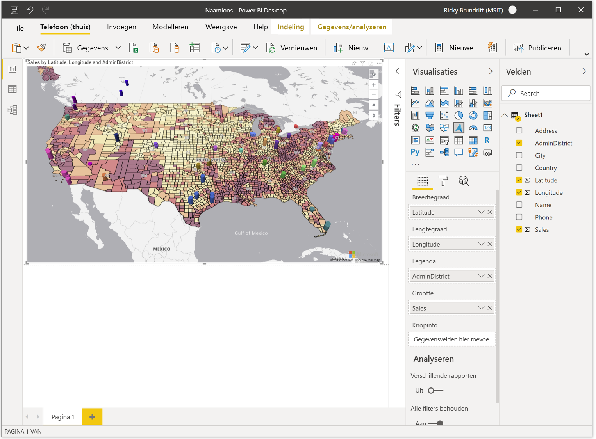

# Aan de slag met de Azure Maps Power BI Visual

<Token>**van toepassing op:**  Power bi-service voor ***consumenten***  Power bi-service voor ontwerpers & ontwikkel aars  Power bi Desktop vereist een Pro-  of Premium-licentie</Token>

In dit artikel wordt beschreven hoe u de Microsoft Azure kaarten Visual voor Power BI kunt gebruiken.

> [!NOTE]
> Deze Visual kan worden gemaakt en weer gegeven in zowel Power BI Desktop als de Power BI-service. De stappen en afbeeldingen uit dit artikel zijn gebaseerd op Power BI Desktop.

De Azure Maps Visual for Power BI biedt een uitgebreide set gegevens visualisaties voor ruimtelijke gegevens boven op een kaart. Het is een schatting dat meer dan 80% van de Bedrijfs gegevens een locatie context heeft. De Azure Maps-Visual kan worden gebruikt om inzicht te krijgen in de manier waarop deze locatie context verband houdt met en invloed heeft op uw bedrijfs gegevens.

## Wat wordt er naar Azure verzonden?

De Azure Maps Visual maakt verbinding met de Cloud service die wordt gehost in azure om locatie gegevens op te halen, zoals het toewijzen van afbeeldingen en coördinaten die worden gebruikt voor het maken van de kaart visualisatie. 

-   Details over het gebied waarop de kaart is gericht, worden naar Azure verzonden om de installatie kopieën op te halen die nodig zijn om het kaart doek weer te geven (ook wel kaart tegels genoemd). 
-   Gegevens in de Bucket locatie, breedte graad en lengte graad kunnen naar Azure worden verzonden om de kaart coördinaten op te halen (een proces dat geocodering wordt genoemd). 

U of uw beheerder moet mogelijk uw firewall bijwerken om toegang te geven tot het Azure Maps platform dat gebruikmaakt van de volgende URL.

> `https://atlas.microsoft.com`

Zie [Microsoft Azure juridische informatie](https://azure.microsoft.com/support/legal/)voor meer informatie over privacy en gebruiksrecht overeenkomst met betrekking tot de Azure Maps-Visual.

## Preview-gedrag en -vereisten

Er zijn enkele overwegingen en vereisten voor deze preview-versie van **Azure Maps**:

-   De **Azure Maps** Visual is in de preview-versie en moet zijn ingeschakeld in Power bi Desktop. Als u **Azure Maps**wilt inschakelen, selecteert u **Bestands** &gt; **Opties en instellingen** &gt; **Opties** &gt; **Preview-functies**en selecteert u vervolgens het selectie vakje **Azure Maps** . Als de Azure Maps Visual niet beschikbaar is nadat u dit hebt gedaan, moet u waarschijnlijk de schakel optie Tenant beheerder in de beheer Portal inschakelen.
-   De gegevensset moet velden bevatten met informatie over **breedte graad** en **lengte graad** . Geocodering van locatie velden wordt toegevoegd in een toekomstige update.
-   Het ingebouwde besturings element legenda voor Power BI wordt momenteel niet weer gegeven in deze preview. Deze wordt toegevoegd in een toekomstige update.

## De Azure Maps-Visual gebruiken

Zodra het **Azure Maps** visuele element is ingeschakeld, selecteert u het **Azure Maps** pictogram in het deel venster **Visualisaties** .

Power BI maakt een leeg Azure Maps visuele ontwerp. In de preview-versie wordt een extra Disclaimer weer gegeven.

Voer de volgende stappen uit om de Azure Maps Visual te laden:

1.  Sleep in het deel venster **velden** gegevens velden met gegevens over breedte graad en lengte graad in de Bucket **breedte graad** en/of **lengte graad** . Dit zijn de minimale gegevens die nodig zijn om de Azure Maps-Visual te laden.
    
    > [!div class="mx-imgBorder"]
    > 

2.  Als u de gegevens op basis van categorisatie wilt kleuren, sleept u het veld categorische naar de Bucket **legenda** van het deel venster **velden** . In dit voor beeld gebruiken we de kolom **AdminDistrict** (ook wel State of provincie genoemd).  
    
    > [!div class="mx-imgBorder"]
    > 

    > [!NOTE]
    > Het ingebouwde besturings element legenda voor Power BI wordt momenteel niet weer gegeven in deze preview. Deze wordt toegevoegd in een toekomstige update.

3.  Als u de gegevens relatief wilt schalen, sleept u een meting naar de Bucket **grootte** van het deel venster **velden** . In dit voor beeld gebruiken we **verkoop** kolom.  
    
    > [!div class="mx-imgBorder"]
    > 

4.  Gebruik de opties in het deel venster **opmaak** om te bepalen hoe gegevens worden weer gegeven. De volgende afbeelding is dezelfde toewijzing als hierboven, maar met de optie transparantie vulling voor bellen lagen ingesteld op 50% en de contour optie met hoog contrast ingeschakeld.  
    
    > [!div class="mx-imgBorder"]
    > 

## Buckets van het deel venster velden

De volgende gegevens verzamelingen zijn beschikbaar in het deel venster **velden** van de Azure Maps Visual.

| Veld     | Beschrijving  |
|-----------|--------------|
| Breedtegraad  | Het veld dat wordt gebruikt om de waarde voor de breedte van de gegevens punten op te geven. De Latitude-waarden moeten tussen-90 en 90 in de decimale-graden notatie zijn.  |
| Lengtegraad | Het veld dat wordt gebruikt om de lengte graad van de gegevens punten op te geven. Lengte waarden moeten tussen-180 en 180 in decimale-graden notatie zijn.  |
| Legenda    | Het veld dat wordt gebruikt om de gegevens te categoriseren en een unieke kleur toe te wijzen voor gegevens punten in elke categorie. Als deze Bucket is gevuld, wordt in het deel venster **indeling** een sectie **gegevens kleuren** weer gegeven waarmee de kleuren kunnen worden aangepast. |
| Grootte      | De meting die wordt gebruikt voor de relatieve grootte van gegevens punten op de kaart.   |
| Knopinfo  | Aanvullende gegevens velden die worden weer gegeven in knop info wanneer vormen worden geplaatst. |

## Kaart instellingen

De sectie **instellingen toewijzen** van het deel venster indeling bieden opties voor het aanpassen van de manier waarop de kaart wordt weer gegeven en reageert op updates.

| Instelling             | Beschrijving  |
|---------------------|--------------|
| Automatisch in-/uitzoomen           | De kaart wordt automatisch ingezoomd op de gegevens die worden geladen via het deel venster **velden** van de Visual. Wanneer de gegevens worden gewijzigd, wordt de bijbehorende positie door de kaart dienovereenkomstig bijgewerkt. Wanneer de schuif regelaar is **uitgeschakeld** , worden er extra kaart weergave-instellingen weer gegeven voor de standaard kaart weergave. |
| Wereld wijde terugloop          | Hiermee kan de gebruiker de kaart horizon taal oneindig pannen. |
| Stijl kiezer        | Hiermee voegt u een knop toe aan de kaart waarmee de rapport lezers de stijl van de kaart kunnen wijzigen. |
| Besturings elementen voor navigatie | Voegt knoppen aan de kaart toe als een andere methode zodat de rapport lezers de Toon hoogte van de kaart kunnen in-en uitzoomen, draaien en wijzigen. Zie dit document over het [navigeren op de kaart](map-accessibility.md#navigating-the-map) voor meer informatie over de verschillende manieren waarop gebruikers door de kaart kunnen navigeren. |
| Kaart stijl           | De stijl van de kaart. Zie dit document voor meer informatie over [ondersteunde kaart stijlen](supported-map-styles.md). |

### Instellingen voor kaart weergave

Als de schuif regelaar automatisch in- **/uitzoomen** is **uitgeschakeld** , worden de volgende instellingen weer gegeven en kan de gebruiker de standaard kaart weergave gegevens opgeven.

| Instelling          | Beschrijving   |
|------------------|---------------|
| Zoom             | Het standaard zoom niveau van de kaart. Dit kan een getal tussen 0 en 22 zijn. |
| Latitude Center  | De standaard breedte graad in het midden van de kaart. |
| Punt lengte | De standaard lengte graad in het midden van de kaart. |
| Kop          | De standaard richting van de kaart in graden, waarbij 0 Noord is, 90 is Oost, 180 is Zuid en 270 is West. Dit kan een getal tussen 0 en 360 zijn. |
| Afstand            | De standaard kanteling van de kaart in graden tussen 0 en 60, waarbij 0 op de kaart wordt doorzocht. |

## Overwegingen en beperkingen

De Azure Maps Visual is beschikbaar in de volgende services en toepassingen:

| Service/app                              | Beschikbaarheid |
|------------------------------------------|--------------|
| Power BI Desktop                         | Ja          |
| Power BI-service (app.powerbi.com)       | Ja          |
| Mobiele Power BI-toepassingen             | Ja          |
| Power BI publiceren op internet                  | Nee           |
| Power BI Embedded                        | Nee           |
| Power BI-service insluiten (PowerBI.com) | Ja          |

Ondersteuning voor extra Power BI Services/apps wordt toegevoegd aan toekomstige updates.

**Waar is Azure Maps beschikbaar?**

Op dit moment is Azure Maps momenteel beschikbaar in alle landen en regio's, met uitzonde ring van het volgende:

- China
- Zuid-Korea

Raadpleeg het document [over geografische dekkings gegevens](geographic-coverage.md) voor meer informatie over de dekking van de verschillende Azure Maps services die dit visuele element uitschakelen.

**Welke webbrowsers worden ondersteund door de Azure Maps Visual?**

Raadpleeg deze documentatie voor meer informatie over browsers die worden [ondersteund door Azure Maps Web SDK](supported-browsers.md).

**Hoeveel gegevens punten kan ik visualiseren?**

Deze Visual ondersteunt Maxi maal 30.000 gegevens punten.

**Kunnen er adressen of andere locatie teken reeksen worden gebruikt in deze Visual?**

De eerste preview van dit visuele element ondersteunt alleen de waarden voor breedte graad en lengte graad in decimale graden. Bij een toekomstige update wordt ondersteuning toegevoegd voor adressen en andere locatie teken reeksen.

## Volgende stappen

Meer informatie over de Azure Maps Power BI Visual:

> [!div class="nextstepaction"]
> [Wat zijn lagen in de Azure Maps Power BI Visual?](power-bi-visual-understanding-layers.md)

> [!div class="nextstepaction"]
> [De Azure Maps Visual in uw organisatie beheren](power-bi-visual-manage-access.md)

De Visual aanpassen:

> [!div class="nextstepaction"]
> [Tips en trucs voor het gebruik van kleuren in Power BI](https://docs.microsoft.com/power-bi/visuals/service-tips-and-tricks-for-color-formatting)

> [!div class="nextstepaction"]
> [Titels, legenda's en achtergronden van visualisaties aanpassen](https://docs.microsoft.com/power-bi/visuals/power-bi-visualization-customize-title-background-and-legend)
