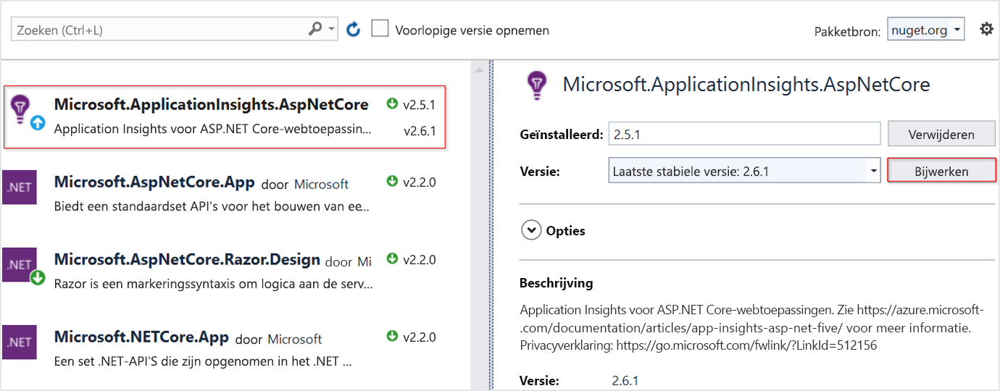

# <a name="application-insights-for-aspnet-core-applications"></a>Toepassingsinzichten voor ASP.NET Core-toepassingen

In dit artikel wordt beschreven hoe u Application Insights inschakelt voor een [ASP.NET Core-toepassing.](https://docs.microsoft.com/aspnet/core) Wanneer u de instructies in dit artikel voltooit, verzamelt Application Insights aanvragen, afhankelijkheden, uitzonderingen, prestatiemeteritems, heartbeats en logboeken van uw ASP.NET Core-toepassing.

Het voorbeeld dat we hier gebruiken is `netcoreapp2.2`een [MVC-toepassing](https://docs.microsoft.com/aspnet/core/tutorials/first-mvc-app) die zich richt. U deze instructies toepassen op alle ASP.NET Core-toepassingen.

## <a name="supported-scenarios"></a>Ondersteunde scenario's

De [Application Insights SDK voor ASP.NET Core](https://nuget.org/packages/Microsoft.ApplicationInsights.AspNetCore) kan uw toepassingen controleren, ongeacht waar of hoe ze worden uitgevoerd. Als uw toepassing wordt uitgevoerd en netwerkconnectiviteit met Azure heeft, kan telemetrie worden verzameld. Application Insights monitoring wordt overal ondersteund .NET Core wordt ondersteund. Steun omvat:
* **Besturingssysteem**: Windows, Linux of Mac.
* **Hostingmethode**: In proces of uit proces.
* **Implementatiemethode**: Framework afhankelijk of op zichzelf staand.
* **Webserver**: IIS (Internet Information Server) of Torenvalk.
* **Hostingplatform**: de Web Apps-functie van Azure App Service, Azure VM, Docker, Azure Kubernetes Service (AKS), enzovoort.
* **.NET Core Runtime-versie**: 1.XX, 2.XX of 3.XX
* **IDE**: Visual Studio, VS Code of command line.

> [!NOTE]
> Als u ASP.NET Core 3.X samen met Application Insights gebruikt, gebruikt u de [2.8.0-versie](https://www.nuget.org/packages/Microsoft.ApplicationInsights.AspNetCore/2.8.0) of hoger. Dit is de enige versie die ASP.NET Core 3.X ondersteunt.

## <a name="prerequisites"></a>Vereisten

- Een functionerende ASP.NET Core applicatie. Als u een ASP.NET Core-toepassing wilt maken, volgt u deze [ASP.NET Core-zelfstudie.](https://docs.microsoft.com/aspnet/core/getting-started/)
- Een geldige Application Insights-instrumentatiesleutel. Deze sleutel is vereist om telemetrie naar Application Insights te verzenden. Zie [Een toepassingsinzichtenbron maken](https://docs.microsoft.com/azure/azure-monitor/app/create-new-resource)als u een nieuwe Application Insights-bron wilt maken om een instrumentatiesleutel te krijgen.

## <a name="enable-application-insights-server-side-telemetry-visual-studio"></a>Telemetrie aan de serverzijde van Application Insights inschakelen (Visual Studio)

1. Open uw project in Visual Studio.

    > [!TIP]
    > Als u wilt, u bronbeheer voor uw project instellen, zodat u alle wijzigingen bijhouden die Application Insights aanbrengt. Als u bronbesturingselement wilt inschakelen, selecteert u **Bestand** > **toevoegen aan bronbeheer**.

2. Selecteer > **Telemetrie van toepassingtoevoegen toepassingsinzichten selecteren**. **Project**

3. Selecteer **Aan de slag**. De tekst van deze selectie kan variëren, afhankelijk van de versie van Visual Studio. Sommige eerdere versies gebruiken in plaats daarvan een **startvrije** knop.

4. Selecteer uw abonnement. Selecteer vervolgens > **Resourceregister**. **Resource**

5. Nadat u Application Insights aan uw project hebt toegevoegd, controleert u of u de nieuwste stabiele versie van de SDK gebruikt. Ga naar **Project** > **Manage NuGet-pakketten** > **Microsoft.ApplicationInsights.AspNetCore**. Als dat nodig is, kiest u **Bijwerken**.

     

6. Als u de optionele tip hebt gevolgd en uw project aan bronbeheer hebt toegevoegd, gaat u naar Wijzigingen in**Team verkenner** >  **weergeven** > .**Changes** Selecteer vervolgens elk bestand om een diff-weergave te zien van de wijzigingen die zijn aangebracht door de telemetrie van Application Insights.

## <a name="enable-application-insights-server-side-telemetry-no-visual-studio"></a>Telemetrie aan de serverzijde van Application Insights inschakelen (geen Visual Studio)

1. Installeer het [Application Insights SDK NuGet-pakket voor ASP.NET Core.](https://nuget.org/packages/Microsoft.ApplicationInsights.AspNetCore) We raden u aan altijd de nieuwste stabiele versie te gebruiken. Vind volledige release notes voor de SDK op de [open-source GitHub repo](https://github.com/Microsoft/ApplicationInsights-aspnetcore/releases).

    In het volgende codevoorbeeld worden de wijzigingen `.csproj` weergegeven die aan het bestand van uw project moeten worden toegevoegd.

    ```xml
        <ItemGroup>
          <PackageReference Include="Microsoft.ApplicationInsights.AspNetCore" Version="2.13.1" />
        </ItemGroup>
    ```

2. Toevoegen `services.AddApplicationInsightsTelemetry();` aan `ConfigureServices()` de `Startup` methode in uw klasse, zoals in dit voorbeeld:

    ```csharp
        // This method gets called by the runtime. Use this method to add services to the container.
        public void ConfigureServices(IServiceCollection services)
        {
            // The following line enables Application Insights telemetry collection.
            services.AddApplicationInsightsTelemetry();
    
            // This code adds other services for your application.
            services.AddMvc();
        }
    ```

3. Stel de instrumentatiesleutel in.

    Hoewel u de instrumentatiesleutel als `AddApplicationInsightsTelemetry`argument opgeven, raden we u aan de instrumentatiesleutel in configuratie op te geven. In het volgende codevoorbeeld ziet u `appsettings.json`hoe u een instrumentatiesleutel opgeeft in . Zorg `appsettings.json` ervoor dat deze tijdens het publiceren naar de hoofdmap van de toepassing wordt gekopieerd.

    ```json
        {
          "ApplicationInsights": {
            "InstrumentationKey": "putinstrumentationkeyhere"
          },
          "Logging": {
            "LogLevel": {
              "Default": "Warning"
            }
          }
        }
    ```

    U ook de instrumentatiesleutel opgeven in een van de volgende omgevingsvariabelen:

    * `APPINSIGHTS_INSTRUMENTATIONKEY`

    * `ApplicationInsights:InstrumentationKey`

    Bijvoorbeeld:

    * `SET ApplicationInsights:InstrumentationKey=putinstrumentationkeyhere`

    * `SET APPINSIGHTS_INSTRUMENTATIONKEY=putinstrumentationkeyhere`

    Hiermee geeft `APPINSIGHTS_INSTRUMENTATIONKEY` u doorgaans de instrumentatiesleutel op voor toepassingen die zijn geïmplementeerd in Azure Web Apps.

    > [!NOTE]
    > Een instrumentatiesleutel die in code `APPINSIGHTS_INSTRUMENTATIONKEY`is opgegeven, wint de omgevingsvariabele , die andere opties overwint.

## <a name="run-your-application"></a>Uw toepassing uitvoeren

Voer uw aanvraag uit en vraag er om. Telemetrie moet nu naar Application Insights worden doorgegeven. De Application Insights SDK verzamelt automatisch binnenkomende webaanvragen voor uw toepassing, samen met de volgende telemetrie.

### <a name="live-metrics"></a>Live Metrics

[Live Metrics](https://docs.microsoft.com/azure/application-insights/app-insights-live-stream) kunnen worden gebruikt om snel te controleren of de monitor van Application Insights correct is geconfigureerd. Hoewel het een paar minuten kan duren voordat telemetrie in de portal en analytics verschijnt, tonen Live Metrics het CPU-gebruik van het lopende proces in bijna realtime. Het kan ook andere telemetrie tonen, zoals aanvragen, afhankelijkheden, sporen, enz.

### <a name="ilogger-logs"></a>ILogger-logboeken

Logs uitgezonden `ILogger` via van `Warning` ernst of groter worden automatisch vastgelegd. Volg [ILogger-documenten](ilogger.md#control-logging-level) om aan te passen welke logniveaus worden vastgelegd door Application Insights.

### <a name="dependencies"></a>Afhankelijkheden

Afhankelijkheidsverzameling is standaard ingeschakeld. [In](asp-net-dependencies.md#automatically-tracked-dependencies) dit artikel worden de afhankelijkheden uitgelegd die automatisch worden verzameld en bevat het ook stappen om handmatigbijhouden uit te voeren.

### <a name="performance-counters"></a>Prestatiemeteritems

Ondersteuning voor [prestatiemeteritems](https://azure.microsoft.com/documentation/articles/app-insights-web-monitor-performance/) in ASP.NET Core is beperkt:

* SDK-versies 2.4.1 en hoger verzamelen prestatiemeteritems als de toepassing wordt uitgevoerd in Azure Web Apps (Windows).
* SDK-versies 2.7.1 en hoger verzamelen prestatiemeteritems als `NETSTANDARD2.0` de toepassing wordt uitgevoerd in Windows en doelen of hoger.
* Voor toepassingen die zich richten op het .NET Framework, worden alle versies van de prestatiemeteritems van SDK-ondersteuning ondersteund.
* SDK Versies 2.8.0 en hoger ondersteunen cpu/memory teller in Linux. Geen enkele andere teller wordt ondersteund in Linux. De aanbevolen manier om systeemtellers in Linux (en andere niet-Windows-omgevingen) te krijgen, is door [EventCounters te gebruiken](#eventcounter)

### <a name="eventcounter"></a>EventCounter (EventCounter)

`EventCounterCollectionModule`is standaard ingeschakeld en het verzamelt een standaardset tellers van .NET Core 3.X-apps. De [zelfstudie EventCounter](eventcounters.md) bevat de standaardset met verzamelde tellers. Het heeft ook instructies over het aanpassen van de lijst.

## <a name="enable-client-side-telemetry-for-web-applications"></a>Telemetrie aan de clientzijde inschakelen voor webtoepassingen

De voorgaande stappen zijn voldoende om u te helpen beginnen met het verzamelen van telemetrie aan de serverzijde. Als uw toepassing componenten aan clientzijde heeft, voert u de volgende stappen uit om [gebruikstelemetrie](https://docs.microsoft.com/azure/azure-monitor/app/usage-overview)te verzamelen.

1. In `_ViewImports.cshtml`, voeg injectie:

    ```cshtml
        @inject Microsoft.ApplicationInsights.AspNetCore.JavaScriptSnippet JavaScriptSnippet
    ```

2. In `_Layout.cshtml`, `HtmlHelper` invoegen aan `<head>` het einde van de sectie, maar vóór een ander script. Als u aangepaste JavaScript-telemetrie van de pagina wilt melden, injecteert u deze na dit fragment:

    ```cshtml
        @Html.Raw(JavaScriptSnippet.FullScript)
        </head>
    ```
    
Als alternatief voor `FullScript` `ScriptBody` het gebruik van de de is beschikbaar vanaf SDK v2.14. Gebruik dit als u `<script>` de tag moet beheren om een inhoudsbeveiligingsbeleid in te stellen:

    ```cshtml
        <script> // apply custom changes to this script tag.
            @Html.Raw(JavaScriptSnippet.ScriptBody)
        </script>
    ```

De `.cshtml` eerder genoemde bestandsnamen zijn afkomstig van een standaard MVC-toepassingssjabloon. Als u uiteindelijk clientbewaking voor uw toepassing goed wilt inschakelen, moet het `<head>` JavaScript-fragment worden weergegeven in het gedeelte van elke pagina van uw toepassing die u wilt controleren. U dit doel voor deze toepassingssjabloon bereiken `_Layout.cshtml`door het JavaScript-fragment toe te voegen aan. 

Als uw project niet `_Layout.cshtml`is opgenomen, u nog steeds [client-side monitoring](https://docs.microsoft.com/azure/azure-monitor/app/website-monitoring)toevoegen. U dit doen door het JavaScript-fragment `<head>` toe te voegen aan een gelijkwaardig bestand dat de pagina's in uw app beheert. Of u het fragment toevoegen aan meerdere pagina's, maar deze oplossing is moeilijk te onderhouden en we raden het over het algemeen niet aan.

## <a name="configure-the-application-insights-sdk"></a>De SDK voor toepassingsinzichten configureren

U de Application Insights SDK voor ASP.NET Core aanpassen om de standaardconfiguratie te wijzigen. Gebruikers van de Application Insights ASP.NET SDK zijn `ApplicationInsights.config` mogelijk bekend `TelemetryConfiguration.Active`met het wijzigen van de configuratie door het gebruik of de wijziging van . U wijzigt de configuratie anders voor ASP.NET Core. Voeg de ASP.NET Core SDK toe aan de toepassing en configureer deze met behulp van ASP.NET core-injectie met ingebouwde [afhankelijkheid.](https://docs.microsoft.com/aspnet/core/fundamentals/dependency-injection) Breng bijna alle configuratiewijzigingen aan in de `ConfigureServices()` methode van uw `Startup.cs` klasse, tenzij u anders wordt geleid. De volgende secties bieden meer informatie.

> [!NOTE]
> In ASP.NET Core-toepassingen wordt `TelemetryConfiguration.Active` het wijzigen van de configuratie door te wijzigen niet ondersteund.

### <a name="using-applicationinsightsserviceoptions"></a>ApplicationInsightsServiceOptions gebruiken

U een paar veelvoorkomende instellingen wijzigen door door te geven `ApplicationInsightsServiceOptions` aan, `AddApplicationInsightsTelemetry`zoals in dit voorbeeld:

```csharp
public void ConfigureServices(IServiceCollection services)
{
    Microsoft.ApplicationInsights.AspNetCore.Extensions.ApplicationInsightsServiceOptions aiOptions
                = new Microsoft.ApplicationInsights.AspNetCore.Extensions.ApplicationInsightsServiceOptions();
    // Disables adaptive sampling.
    aiOptions.EnableAdaptiveSampling = false;

    // Disables QuickPulse (Live Metrics stream).
    aiOptions.EnableQuickPulseMetricStream = false;
    services.AddApplicationInsightsTelemetry(aiOptions);
}
```

Volledige lijst met instellingen in`ApplicationInsightsServiceOptions`

|Instelling | Beschrijving | Standaard
|---------------|-------|-------
|Module PerformanceCounterCollection inschakelen  | Inschakelen/uitschakelen`PerformanceCounterCollectionModule` | waar
|EnableRequestTrackingTelemetryModule inschakelen   | Inschakelen/uitschakelen`RequestTrackingTelemetryModule` | waar
|Module EventCounterCollection inschakelen   | Inschakelen/uitschakelen`EventCounterCollectionModule` | waar
|AfhankelijkheidtrackingTelemetryModule inschakelen   | Inschakelen/uitschakelen`DependencyTrackingTelemetryModule` | waar
|InschakelingAppServicesHeartbeatTelemetryModule  |  Inschakelen/uitschakelen`AppServicesHeartbeatTelemetryModule` | waar
|AzureInstanceMetadataTelemetryModule inschakelen   |  Inschakelen/uitschakelen`AzureInstanceMetadataTelemetryModule` | waar
|InschakelenQuickPulsemetricStream | Functie LiveMetrics inschakelen/uitschakelen | waar
|InschakelenAdaptiveSampling | Adaptieve bemonstering inschakelen/uitschakelen | waar
|Heartbeat inschakelen | Heartbeats-functie inschakelen/uitschakelen, die periodiek (standaard 15 min) een aangepaste statistiek met de naam 'HeartBeatState' verzendt met informatie over de runtime zoals .NET-versie, Azure-omgevingsinformatie, indien van toepassing, enz. | waar
|AddAutoCollectedMetricExtractor | AutoCollectedMetrics-extractor in--/uitschakelen, een telemetrieprocessor die vooraf geaggregeerde statistieken over aanvragen/afhankelijkheden verzendt voordat de bemonstering plaatsvindt. | waar
|RequestCollectionOptions.TrackExceptions | Rapportage van niet-afgehandelde uitzonderingstracking door de module Verzamelen aanvragen in-/uitschakelen. | false in NETSTANDARD2.0 (omdat uitzonderingen worden bijgehouden met ApplicationInsightsLoggerProvider), waar anders.

Zie de [configureerbare `ApplicationInsightsServiceOptions` instellingen in](https://github.com/microsoft/ApplicationInsights-dotnet/blob/develop/NETCORE/src/Shared/Extensions/ApplicationInsightsServiceOptions.cs) voor de meest up-to-date lijst.

### <a name="sampling"></a>Steekproeven

De Application Insights SDK voor ASP.NET Core ondersteunt zowel vaste als adaptieve sampling. Adaptieve bemonstering is standaard ingeschakeld. 

Zie [Adaptieve sampling configureren voor ASP.NET Core-toepassingen voor](../../azure-monitor/app/sampling.md#configuring-adaptive-sampling-for-aspnet-core-applications)meer informatie.

### <a name="adding-telemetryinitializers"></a>Telemetrieinitialisatizers toevoegen

Gebruik [telemetrieinitialisators](https://docs.microsoft.com/azure/azure-monitor/app/api-filtering-sampling#addmodify-properties-itelemetryinitializer) wanneer u globale eigenschappen wilt definiëren die met alle telemetrie worden verzonden.

Voeg nieuw `TelemetryInitializer` aan `DependencyInjection` de container toe zoals in de volgende code. De SDK pikt automatisch `TelemetryInitializer` alle containers op `DependencyInjection` die aan de container zijn toegevoegd.

```csharp
public void ConfigureServices(IServiceCollection services)
{
    services.AddSingleton<ITelemetryInitializer, MyCustomTelemetryInitializer>();
}
```

### <a name="removing-telemetryinitializers"></a>Telemetrieinitialisators verwijderen

Telemetrieinitialisators zijn standaard aanwezig. Als u alle of specifieke telemetrieinitialisators `AddApplicationInsightsTelemetry()`wilt verwijderen, gebruikt u de volgende voorbeeldcode *nadat* u hebt gebeld.

```csharp
public void ConfigureServices(IServiceCollection services)
{
    services.AddApplicationInsightsTelemetry();

    // Remove a specific built-in telemetry initializer
    var tiToRemove = services.FirstOrDefault<ServiceDescriptor>
                        (t => t.ImplementationType == typeof(AspNetCoreEnvironmentTelemetryInitializer));
    if (tiToRemove != null)
    {
        services.Remove(tiToRemove);
    }

    // Remove all initializers
    // This requires importing namespace by using Microsoft.Extensions.DependencyInjection.Extensions;
    services.RemoveAll(typeof(ITelemetryInitializer));
}
```

### <a name="adding-telemetry-processors"></a>Telemetrieprocessors toevoegen

U aangepaste telemetrieprocessors toevoegen aan `TelemetryConfiguration` de extensiemethode `AddApplicationInsightsTelemetryProcessor` op `IServiceCollection`. U gebruikt telemetrieprocessors in [geavanceerde filterscenario's.](https://docs.microsoft.com/azure/azure-monitor/app/api-filtering-sampling#itelemetryprocessor-and-itelemetryinitializer) Gebruik het volgende voorbeeld.

```csharp
public void ConfigureServices(IServiceCollection services)
{
    // ...
    services.AddApplicationInsightsTelemetry();
    services.AddApplicationInsightsTelemetryProcessor<MyFirstCustomTelemetryProcessor>();

    // If you have more processors:
    services.AddApplicationInsightsTelemetryProcessor<MySecondCustomTelemetryProcessor>();
}
```

### <a name="configuring-or-removing-default-telemetrymodules"></a>Standaardtelemetriemodules configureren of verwijderen

Application Insights gebruikt telemetriemodules om automatisch nuttige telemetrie over specifieke workloads te verzamelen zonder handmatige tracking door de gebruiker.

De volgende modules voor automatische verzameling zijn standaard ingeschakeld. Deze modules zijn verantwoordelijk voor het automatisch verzamelen van telemetrie. U ze uitschakelen of configureren om hun standaardgedrag te wijzigen.

* `RequestTrackingTelemetryModule`- Verzamelt RequestTelemetry van inkomende webverzoeken.
* `DependencyTrackingTelemetryModule`- Verzamelt DependencyTelemetry van uitgaande http-oproepen en sql-aanroepen.
* `PerformanceCollectorModule`- Verzamelt Windows PerformanceCounters.
* `QuickPulseTelemetryModule`- Verzamelt telemetrie voor vertoning in de live metrische gegevens portal.
* `AppServicesHeartbeatTelemetryModule`- Verzamelt hartslagen (die worden verzonden als aangepaste statistieken), over de Azure App Service-omgeving waarin de toepassing wordt gehost.
* `AzureInstanceMetadataTelemetryModule`- Verzamelt hartslagen (die worden verzonden als aangepaste statistieken), over de Azure VM-omgeving waarin de toepassing wordt gehost.
* `EventCounterCollectionModule`- Verzamelt [eventcounters.](eventcounters.md) Deze module is een nieuwe functie en is beschikbaar in SDK Versie 2.8.0 en hoger.

Als u `TelemetryModule`een standaardinstelling `ConfigureTelemetryModule<T>` wilt `IServiceCollection`configureren, gebruikt u de extensiemethode op , zoals in het volgende voorbeeld wordt weergegeven.

```csharp
using Microsoft.ApplicationInsights.DependencyCollector;
using Microsoft.ApplicationInsights.Extensibility.PerfCounterCollector;

public void ConfigureServices(IServiceCollection services)
{
    services.AddApplicationInsightsTelemetry();

    // The following configures DependencyTrackingTelemetryModule.
    // Similarly, any other default modules can be configured.
    services.ConfigureTelemetryModule<DependencyTrackingTelemetryModule>((module, o) =>
            {
                module.EnableW3CHeadersInjection = true;
            });

    // The following removes all default counters from EventCounterCollectionModule, and adds a single one.
    services.ConfigureTelemetryModule<EventCounterCollectionModule>(
            (module, o) =>
            {
                module.Counters.Clear();
                module.Counters.Add(new EventCounterCollectionRequest("System.Runtime", "gen-0-size"));
            }
        );

    // The following removes PerformanceCollectorModule to disable perf-counter collection.
    // Similarly, any other default modules can be removed.
    var performanceCounterService = services.FirstOrDefault<ServiceDescriptor>(t => t.ImplementationType == typeof(PerformanceCollectorModule));
    if (performanceCounterService != null)
    {
        services.Remove(performanceCounterService);
    }
}
```

Vanaf de 2.12.2-versie [`ApplicationInsightsServiceOptions`](#using-applicationinsightsserviceoptions) is er een eenvoudige optie om een van de standaardmodules uit te schakelen.

### <a name="configuring-a-telemetry-channel"></a>Een telemetriekanaal configureren

Het standaardkanaal `ServerTelemetryChannel`is . U het overschrijven zoals in het volgende voorbeeld wordt weergegeven.

```csharp
using Microsoft.ApplicationInsights.Channel;

    public void ConfigureServices(IServiceCollection services)
    {
        // Use the following to replace the default channel with InMemoryChannel.
        // This can also be applied to ServerTelemetryChannel.
        services.AddSingleton(typeof(ITelemetryChannel), new InMemoryChannel() {MaxTelemetryBufferCapacity = 19898 });

        services.AddApplicationInsightsTelemetry();
    }
```

### <a name="disable-telemetry-dynamically"></a>Telemetrie dynamisch uitschakelen

Als u telemetrie voorwaardelijk en dynamisch wilt `TelemetryConfiguration` uitschakelen, u instantie oplossen met ASP.NET `DisableTelemetry` Core-injectiecontainer voor afhankelijkheid staken overal in uw code en de vlag erop instellen.

```csharp
    public void ConfigureServices(IServiceCollection services)
    {
        services.AddApplicationInsightsTelemetry();
    }

    public void Configure(IApplicationBuilder app, IHostingEnvironment env, TelemetryConfiguration configuration)
    {
        configuration.DisableTelemetry = true;
        ...
    }
```

Het bovenstaande voorkomt niet dat autoverzamelingsmodules telemetrie verzamelen. Alleen het verzenden van telemetrie naar Application Insights wordt uitgeschakeld met de bovenstaande aanpak. Als een bepaalde module voor automatische verzameling niet gewenst is, u het beste [de telemetriemodule verwijderen](#configuring-or-removing-default-telemetrymodules)

## <a name="frequently-asked-questions"></a>Veelgestelde vragen

### <a name="does-application-insights-support-aspnet-core-3x"></a>Ondersteunt Application Insights ASP.NET Core 3.X?

Ja. Update naar [Application Insights SDK voor ASP.NET Core-versie](https://nuget.org/packages/Microsoft.ApplicationInsights.AspNetCore) 2.8.0 of hoger. Oudere versies van de SDK ondersteunen geen ASP.NET Core 3.X.

Ook als je vanaf [hier](#enable-application-insights-server-side-telemetry-visual-studio)op Visual Studio gebaseerde instructies gebruikt, kun je de nieuwste versie van Visual Studio 2019 (16.3.0) updaten naar aan boord. Eerdere versies van Visual Studio ondersteunen geen automatische onboarding voor ASP.NET Core 3.X-apps.

### <a name="how-can-i-track-telemetry-thats-not-automatically-collected"></a>Hoe kan ik telemetrie bijhouden die niet automatisch wordt verzameld?

Krijg een `TelemetryClient` voorbeeld van met behulp van `TrackXXX()` constructor injectie, en bel de vereiste methode op. We raden u af `TelemetryClient` om nieuwe exemplaren te maken in een ASP.NET Core-toepassing. Een singleton `TelemetryClient` exemplaar van is `DependencyInjection` al geregistreerd `TelemetryConfiguration` in de container, die deelt met de rest van de telemetrie. Het maken `TelemetryClient` van een nieuwe instantie wordt alleen aanbevolen als er een configuratie nodig is die los staat van de rest van de telemetrie.

In het volgende voorbeeld ziet u hoe u extra telemetrie van een controller bijhouden.

```csharp
using Microsoft.ApplicationInsights;

public class HomeController : Controller
{
    private TelemetryClient telemetry;

    // Use constructor injection to get a TelemetryClient instance.
    public HomeController(TelemetryClient telemetry)
    {
        this.telemetry = telemetry;
    }

    public IActionResult Index()
    {
        // Call the required TrackXXX method.
        this.telemetry.TrackEvent("HomePageRequested");
        return View();
    }
```

Zie Application Insights custom metrics API [reference](https://docs.microsoft.com/azure/azure-monitor/app/api-custom-events-metrics/)voor meer informatie over aangepaste gegevensrapportage in Application Insights.

### <a name="some-visual-studio-templates-used-the-useapplicationinsights-extension-method-on-iwebhostbuilder-to-enable-application-insights-is-this-usage-still-valid"></a>Sommige Visual Studio-sjablonen gebruikten de extensiemethode UseApplicationInsights() op IWebHostBuilder om Application Insights in te schakelen. Is dit gebruik nog steeds geldig?

Hoewel de `UseApplicationInsights()` extensiemethode nog steeds wordt ondersteund, is deze gemarkeerd als verouderd in Application Insights SDK-versie 2.8.0. Het zal worden verwijderd in de volgende grote versie van de SDK. De aanbevolen manier om Application Insights telemetrie in te schakelen is door te gebruiken `AddApplicationInsightsTelemetry()` omdat het overbelasting biedt om bepaalde configuratie te beheren. Ook `services.AddApplicationInsightsTelemetry()` in ASP.NET Core 3.X-apps is dit de enige manier om applicatie-inzichten mogelijk te maken.

### <a name="im-deploying-my-aspnet-core-application-to-web-apps-should-i-still-enable-the-application-insights-extension-from-web-apps"></a>Ik implementeer mijn ASP.NET Core-toepassing op Web Apps. Moet ik de extensie Application Insights van Web Apps nog steeds inschakelen?

Als de SDK is geïnstalleerd op de buildtijd zoals in dit artikel wordt weergegeven, hoeft u de [extensie Application Insights](https://docs.microsoft.com/azure/azure-monitor/app/azure-web-apps) niet in te schakelen vanuit de App Service-portal. Zelfs als de extensie is geïnstalleerd, zal het een back-off wanneer het detecteert dat de SDK al is toegevoegd aan de toepassing. Als u Application Insights inschakelt vanuit de extensie, hoeft u de SDK niet te installeren en bij te werken. Maar als u Application Insights inschakelt door instructies in dit artikel te volgen, hebt u meer flexibiliteit omdat:

   * Application Insights telemetrie blijft werken in:
       * Alle besturingssystemen, inclusief Windows, Linux en Mac.
       * Alle publicatiemodi, inclusief op zichzelf staand of framework afhankelijk.
       * Alle doelkaders, inclusief het volledige .NET Framework.
       * Alle hostingopties, waaronder Web Apps, VM's, Linux, containers, Azure Kubernetes Service en niet-Azure-hosting.
       * Alle .NET Core-versies, inclusief preview-versies.
   * U telemetrie lokaal bekijken wanneer u debugging vanuit Visual Studio.
   * U extra aangepaste telemetrie bijhouden met behulp van de `TrackXXX()` API.
   * U hebt volledige controle over de configuratie.

### <a name="can-i-enable-application-insights-monitoring-by-using-tools-like-status-monitor"></a>Kan ik Application Insights-monitoring inschakelen met behulp van tools zoals Statusmonitor?

Nee. [Statusmonitor](https://docs.microsoft.com/azure/azure-monitor/app/monitor-performance-live-website-now) en [Status monitor v2](https://docs.microsoft.com/azure/azure-monitor/app/status-monitor-v2-overview) ondersteunen momenteel ASP.NET 4.x.

### <a name="is-application-insights-automatically-enabled-for-my-aspnet-core-20-application"></a>Is Application Insights automatisch ingeschakeld voor mijn ASP.NET Core 2.0-toepassing?

Het `Microsoft.AspNetCore.All` 2.0-pakket bevatte de Application Insights SDK (versie 2.1.0). Als u de toepassing uitvoert onder Visual Studio-foutopsporing, schakelt Visual Studio Application Insights in en toont u telemetrie lokaal in de IDE zelf. Telemetrie is niet verzonden naar de Application Insights-service, tenzij een instrumentatiesleutel is opgegeven. We raden u aan de instructies in dit artikel te volgen om Application Insights in te schakelen, zelfs voor 2.0-apps.

### <a name="if-i-run-my-application-in-linux-are-all-features-supported"></a>Als ik mijn applicatie in Linux, zijn alle functies ondersteund?

Ja. Functieondersteuning voor de SDK is op alle platforms hetzelfde, met de volgende uitzonderingen:

* De SDK verzamelt [gebeurtenistellers](https://docs.microsoft.com/azure/azure-monitor/app/eventcounters) op Linux omdat [prestatiemeteritems](https://docs.microsoft.com/azure/azure-monitor/app/performance-counters) alleen in Windows worden ondersteund. De meeste statistieken zijn hetzelfde.
* Hoewel `ServerTelemetryChannel` deze standaard is ingeschakeld, maakt het kanaal niet automatisch een lokale opslagmap als er netwerkproblemen zijn als de toepassing wordt uitgevoerd in Linux of MacOS. Door deze beperking gaat telemetrie verloren wanneer er tijdelijke netwerk- of serverproblemen zijn. Als u dit probleem wilt oplossen, configureert u een lokale map voor het kanaal:

```csharp
using Microsoft.ApplicationInsights.Channel;
using Microsoft.ApplicationInsights.WindowsServer.TelemetryChannel;

    public void ConfigureServices(IServiceCollection services)
    {
        // The following will configure the channel to use the given folder to temporarily
        // store telemetry items during network or Application Insights server issues.
        // User should ensure that the given folder already exists
        // and that the application has read/write permissions.
        services.AddSingleton(typeof(ITelemetryChannel),
                                new ServerTelemetryChannel () {StorageFolder = "/tmp/myfolder"});
        services.AddApplicationInsightsTelemetry();
    }
```

### <a name="is-this-sdk-supported-for-the-new-net-core-3x-worker-service-template-applications"></a>Wordt deze SDK ondersteund voor de nieuwe .NET Core 3.X Worker Service-sjabloontoepassingen?

Deze SDK `HttpContext`vereist en werkt dus niet in niet-HTTP-toepassingen, inclusief de .NET Core 3.X Worker Service-toepassingen. Raadpleeg [dit](worker-service.md) document voor het inschakelen van toepassingsinzichten in dergelijke toepassingen met behulp van de onlangs uitgebrachte Microsoft.ApplicationInsights.WorkerService SDK.

## <a name="open-source-sdk"></a>Open-source SDK

[Lees en draag bij aan de code](https://github.com/microsoft/ApplicationInsights-dotnet#recent-updates).

## <a name="video"></a>Video

- Bekijk deze externe stapsgewijze video om Application Insights vanaf nul te [configureren met .NET Core en Visual Studio.](https://www.youtube.com/watch?v=NoS9UhcR4gA&t)
- Bekijk deze externe stapsgewijze video om Application Insights vanaf nul te [configureren met .NET Core en Visual Studio Code.](https://youtu.be/ygGt84GDync)

## <a name="next-steps"></a>Volgende stappen

* [Bekijk gebruikersstromen](../../azure-monitor/app/usage-flows.md) om te begrijpen hoe gebruikers door uw app navigeren.
* [Configureer een momentopnameverzameling](https://docs.microsoft.com/azure/application-insights/app-insights-snapshot-debugger) om de status van broncode en variabelen te zien op het moment dat er een uitzondering wordt gegenereerd.
* [Gebruik de API](../../azure-monitor/app/api-custom-events-metrics.md) om uw eigen gebeurtenissen en statistieken te verzenden voor een gedetailleerd overzicht van de prestaties en het gebruik van uw app.
* Gebruik [beschikbaarheidstests](../../azure-monitor/app/monitor-web-app-availability.md) om uw app voortdurend van over de hele wereld te controleren.
* [Afhankelijkheidsinjectie in ASP.NET Kern](https://docs.microsoft.com/aspnet/core/fundamentals/dependency-injection)
